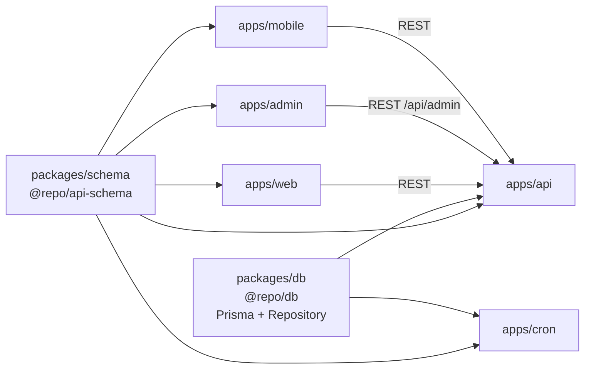
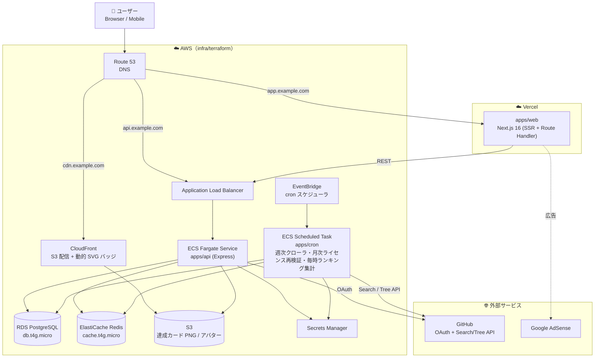

# タイピングロワイヤル（TypingRoyale）

エンジニア向けのコードタイピングゲーム。GitHub から自動収集した **OSS の実コード** を 120 秒で打鍵し、エンジニアグレード（Intern → Fellow）の昇格と「神々に挑戦」モードによる競技性を楽しめる Web プロダクト。

詳細はドキュメントを参照：

- [`docs/README.md`](docs/README.md) — プロダクト全体像
- [`docs/spec/README.md`](docs/spec/README.md) — 各機能の設計書
- [`docs/infra.md`](docs/infra.md) — インフラ設計
- [`TODO.md`](TODO.md) — 実装 TODO

Turborepo + pnpm monorepo を使用したフルスタック構成。

## 目次

- [プロジェクト構成](#プロジェクト構成)
  - [ディレクトリ構造](#ディレクトリ構造)
  - [モノレポ依存関係](#モノレポ依存関係)
  - [デプロイ・アーキテクチャ](#デプロイアーキテクチャ)
- [主要機能](#主要機能)
- [技術スタック](#技術スタック)
- [クイックリファレンス](#クイックリファレンス)
- [テンプレートの使い方](#テンプレートの使い方)
  - [1. プロジェクトのコピー](#1-プロジェクトのコピー)
  - [2. 環境変数の設定](#2-環境変数の設定)
- [AWS インフラのセットアップ](#aws-インフラのセットアップ)
  - [前提](#前提)
  - [1. プロジェクト名のリネーム（テンプレート流用時のみ）](#1-プロジェクト名のリネームテンプレート流用時のみ)
  - [2. Bootstrap（S3 tfstate + DynamoDB ロックテーブル）](#2-bootstraps3-tfstate--dynamodb-ロックテーブル)
  - [3. Account（OIDC / GitHub Actions IAM role / ECR）](#3-accountoidc--github-actions-iam-role--ecr)
  - [4. GitHub Environments のセットアップ](#4-github-environments-のセットアップ)
  - [5. env/dev のデプロイ](#5-envdev-のデプロイ)
  - [6. env/prd のデプロイ](#6-envprd-のデプロイ)
  - [トラブルシューティング](#トラブルシューティング)
- [Claude Code（MCP設定）](#claude-codemcp設定)
- [開発ルール](#開発ルール)
  - [1. 命名規則](#1-命名規則)
  - [2. 基本コマンド](#2-基本コマンド)
  - [3. pnpm ワークスペースコマンド](#3-pnpm-ワークスペースコマンド)
  - [4. 環境変数の管理コマンド](#4-環境変数の管理コマンド)
  - [5. Docker環境の起動コマンド](#5-docker環境の起動コマンド)

## プロジェクト構成

### ディレクトリ構造

```
typing-royale/
├── apps/
│   ├── web/                 # Next.js 16 — ユーザー向け Web（Vercel デプロイ、port 3000）
│   ├── admin/               # Next.js 16 — 運営管理ダッシュボード（port 3030）
│   ├── mobile/              # Expo / React Native — モバイルアプリ（将来拡張用）
│   ├── api/                 # Express 5 — REST API（ECS Fargate Service、port 8080）
│   └── cron/                # GitHub 週次クローラ + 月次ライセンス再検証 + 毎時ランキング集計（ECS Scheduled Task）
├── packages/
│   ├── schema/              # @repo/api-schema — Zod スキーマ・型定義（全アプリ共有）
│   └── db/                  # @repo/db — Prisma スキーマ / Client / Repository（api・cron で共有）
├── infra/
│   └── terraform/           # AWS Infrastructure as Code（RDS / ElastiCache / ECS / ALB / EventBridge / S3）
├── docs/
│   ├── README.md            # プロダクト全体像（ペルソナ・MVP スコープ・体験フロー）
│   ├── infra.md             # インフラ設計（サービス選定・コスト試算）
│   ├── auth.md              # 認証設計
│   ├── mcp.md               # MCP サーバー一覧
│   └── spec/                # 機能別設計書（typing-engine / problem-pool / ghost-battle …）
├── scripts/                 # テンプレートコピー・シークレット投入スクリプト
├── docker-compose.yaml      # ローカル開発用 Postgres 16 + Redis 7
└── turbo.json               # Turborepo パイプライン定義
```

> **api / cron を分離する理由**：両者は責務（HTTP 処理 / 定期実行）も実行モデル（常駐サービス / Scheduled Task）も異なる。Docker image と ECR リポジトリを分けることで、cron が必要とする AST パーサ等の重い依存を api バンドルに混ぜずに済み、CI とデプロイも独立化できる。cron はクローラ・ライセンス再検証・ランキング集計をまとめた 1 つの Image で、ECS Task Definition の `command` で実行する CLI を切り替える。Prisma スキーマと Repository 層は `packages/db` で共有して DRY を保つ。

### モノレポ依存関係

`packages/schema`（Zod）と `packages/db`（Prisma + Repository）を共有し、api と cron が同じデータモデルで動作する。



### デプロイ・アーキテクチャ

web のみ **Vercel**、それ以外（API・cron・DB・Redis・S3）は **AWS 単一 VPC** に集約。cron は EventBridge から呼び出される ECS Scheduled Task で、週次クローラ / 月次ライセンス再検証 / 毎時ランキング集計を `command` で切り替える。詳細は [`docs/infra.md`](docs/infra.md) を参照。



## 主要機能

ユーザージャーニーは [`docs/README.md`](docs/README.md)、各機能の詳細仕様は [`docs/spec/`](docs/spec/README.md) を参照。

| 機能 | 概要 | 詳細 |
|---|---|---|
| typing-engine | 120 秒制限・関数の連続出題・入力判定・スコア計算 | [docs/spec/typing-engine](docs/spec/typing-engine/README.md) |
| problem-pool | 週次 cron で GitHub Star 上位の寛容ライセンス OSS をクロールし AST で関数本体を抽出 | [docs/spec/problem-pool](docs/spec/problem-pool/README.md) |
| github-auth | GitHub OAuth 読み取り最小スコープでのログイン | [docs/spec/github-auth](docs/spec/github-auth/README.md) |
| score-ranking | 言語別全期間トップ 1000・**エンジニアグレード**（Intern → Fellow の 8 段階） | [docs/spec/score-ranking](docs/spec/score-ranking/README.md) |
| ghost-battle | 「神々に挑戦」モード — トップ 10 ランダム選定で同じ問題シーケンスを併走 | [docs/spec/ghost-battle](docs/spec/ghost-battle/README.md) |
| replay-viewer | トップ 10 入賞プレイのキーストローク再描画（動画ファイル不要） | [docs/spec/replay-viewer](docs/spec/replay-viewer/README.md) |
| rewards | 動的 SVG バッジ / 達成カード PNG / 3D アイコン / Hall of Fame | [docs/spec/rewards](docs/spec/rewards/README.md) |
| adsense | プレイ中非表示の Google AdSense ディスプレイ広告 | [docs/spec/adsense](docs/spec/adsense/README.md) |

## 技術スタック

#### モノレポ・ビルド


#### バックエンド


#### フロントエンド


#### モバイル


#### 認証


#### データベース・キャッシュ


#### テスト


#### ロギング・環境変数


#### インフラ・CI/CD


## クイックリファレンス

| ドキュメント | 内容 |
|---|---|
| [docs/mcp.md](docs/mcp.md) | MCP サーバーの一覧・使い方・追加方法 |
| [.claude/README.md](.claude/README.md) | Claude Code の設定（Agents・Commands・Skills） |

---

## テンプレートの使い方

### 1. プロジェクトのコピー

`scripts/copy-template.sh` を実行して、テンプレートを新しいプロジェクトとしてコピーします。

```bash
# 例: プロジェクト名を明示的に指定
./scripts/copy-template.sh ../my-new-app my-new-app

# 例: 絶対パスで指定 ⚠️ プロジェクト名を省略した場合、コピー先ディレクトリ名が使用される
./scripts/copy-template.sh ~/workspace/my-new-app
```

### 2. 環境変数の設定

各アプリの `.env.local` は [dotenvx](https://dotenvx.com/) で暗号化されています。復号に必要な `.env.keys` を管理者から受け取り、プロジェクトルートに配置してください。

各アプリ (`apps/api`, `apps/web`, `apps/mobile`) にはルートへのシンボリックリンクが git に含まれているため、ルートに置くだけで全アプリから参照されます。

```
<project-root>/
├── .env.keys                        ← ここに配置
├── apps/
│   ├── api/.env.keys → ../../.env.keys   (シンボリックリンク)
│   ├── web/.env.keys → ../../.env.keys   (シンボリックリンク)
│   └── mobile/.env.keys → ../../.env.keys (シンボリックリンク)
```

<details>
<summary>（管理者向け）.env.keys の作成方法とシンボリックリンクの貼り方</summary>

ゼロからプロジェクトをセットアップする管理者向けの手順です。既に `.env.keys` を受け取っている開発者は実施不要です。

```bash
# 1. ルートで .env.keys を生成（初回 set でついでに鍵が作られる）
npx dotenvx set _BOOTSTRAP "x" -f .env.local
rm .env.local                          # ← ルートに .env.local は要らないので削除

# 2. 各アプリにルートを指すシンボリックリンクを張る
ln -s ../../.env.keys apps/api/.env.keys
ln -s ../../.env.keys apps/web/.env.keys
ln -s ../../.env.keys apps/mobile/.env.keys
```

以降は **必ずプロジェクトルートから** `npx dotenvx set KEY "value" -f apps/<app>/.env.local` を実行すること（各アプリで `cd` して直接叩くと、シンボリックリンクが実体ファイルで上書きされ、アプリごとに別の鍵ペアが生成されてしまう）。

</details>

## AWS インフラのセットアップ

`infra/terraform/` を実 AWS アカウントにデプロイする手順。**テンプレートから fork した直後 / 新しい AWS アカウントに dev・prd を立てるとき** に一度だけ実施する。

実装の詳細・モジュール構造は [`infra/terraform/CLAUDE.md`](infra/terraform/CLAUDE.md)、サービス選定とコスト試算は [`docs/infra.md`](docs/infra.md) を参照。

### 前提

- AWS アカウント作成済み + IAM ユーザー（管理者権限）。`aws configure` でローカルに資格情報設定済み
- 必要なツール: `brew install terraform tflint trivy`（Terraform 1.12 以降推奨）
- GitHub リポジトリを fork し、最終的な repo 名（例: `kentakki416/typing-royale`）に rename 済み

### 1. プロジェクト名のリネーム（テンプレート流用時のみ）

このリポジトリをテンプレートとしてフォークした場合、AWS リソース名のプレフィックスとして使われる `project-template` を実プロジェクト名に置換しておく。**OIDC trust policy で GitHub repo 名を一致判定するため、`github_repository` の更新は CI 復旧の必須条件**。

```bash
# 例: typing-royale に統一
cd <project-root>
find infra/terraform -type f -name "*.tf" -not -path "*/.terraform/*" -exec sed -i '' \
  -e 's|kentakki416/project-template|kentakki416/typing-royale|g' \
  -e 's|project-template|typing-royale|g' \
  -e 's|project_template|typing_royale|g' {} +
find .github/workflows -type f -name "*.yml" -exec sed -i '' \
  -e 's|project-template|typing-royale|g' \
  -e 's|project_template|typing_royale|g' {} +
```

**追加で手動更新が必要** な箇所:

| ファイル | 変更内容 |
|---|---|
| `infra/terraform/aws/bootstrap/variables.tf` | `s3_bucket_name` の末尾日付（**AWS グローバルで一意である必要**。`<project>-terraform-state-<YYYYMMDD>` 形式推奨） |
| `infra/terraform/aws/account/variables.tf` | `github_repository` の値が実 repo（例: `kentakki416/typing-royale`）と一致しているか確認 |
| RDS `db_name` | Postgres 制約でハイフン不可なので `typing_royale` のように snake_case に統一（`env/dev/main.tf` / `env/prd/main.tf` の `module "rds"` 内） |

### 2. Bootstrap（S3 tfstate + DynamoDB ロックテーブル）

remote backend に使う S3 バケットと DynamoDB ロックテーブルを 1 回だけ作る。**state そのものを生む層なので local state で apply する**。

```bash
cd infra/terraform/aws/bootstrap
terraform init
terraform plan
terraform apply
```

apply 後、出力された S3 バケット名・テーブル名を **`account/backend.tf` / `env/dev/backend.tf` / `env/prd/backend.tf` の `bucket` / `dynamodb_table`** に反映する（Step 1 のリネームで実行済みのはず）。

### 3. Account（OIDC / GitHub Actions IAM role / ECR）

AWS アカウント単位で共有するリソース（OIDC プロバイダ・GitHub Actions IAM role・ECR リポジトリ）を作る。**GitHub Actions が assume する role 自身を作る層なので、初回および role の rename / replace 変更はローカル apply 必須**（CI 経由で apply すると trust policy 更新中に自分自身を AssumeRole できなくなる）。

```bash
cd ../account
terraform init   # bootstrap で作った S3 backend に接続
terraform plan
terraform apply

# 出力された role ARN を取得（次の Step 4 で使う）
terraform output -raw github_actions_dev_role_arn
terraform output -raw github_actions_prd_role_arn
terraform output -raw ecr_api_repository_url
```

### 4. GitHub Environments のセットアップ

GitHub Settings → Environments で以下を作成し、各 Environment に **Secret `AWS_ROLE_ARN`** として Step 3 の出力値を登録する。

| Environment | 用途 | Required reviewers | `AWS_ROLE_ARN` の値 |
|---|---|---|---|
| `dev` | env/dev の plan/apply・Docker push・ECS deploy | 不要 | `github_actions_dev_role_arn` |
| `dev-api-approval` | dev の API Blue/Green 切替承認ゲート | **必要**（自分） | `github_actions_dev_role_arn` |
| `prd` | env/prd の plan/apply | **必要**（管理者） | `github_actions_prd_role_arn` |

登録後、Pull Request を作ると Terraform CI（`Terraform AWS Env CI`）の OIDC 認証が成功するようになる。

### 5. env/dev のデプロイ

以降は GitHub Actions の workflow_dispatch から実行する。ローカル apply は不要。

```
Actions → "Terraform AWS Env Apply" → Run workflow → environment: dev
```

apply 完了後、`scripts/seed-secrets.sh` で `DATABASE_URL` / `REDIS_HOST` / `GOOGLE_CLIENT_ID` などを Secrets Manager の `/typing-royale-dev/app` に投入する（Terraform は「箱」だけ作って中身は手動投入する方針）。

### 6. env/prd のデプロイ

prd は事前にドメイン関連の手動セットアップが必要。

1. **Route53 hosted zone** を Console で作成（例: `typing-royale.com`）し、発行された NS をレジストラに登録（DNS 検証に必須、伝播に最大 48h）
2. `infra/terraform/aws/env/prd/terraform.tfvars`（gitignore 済み）を作成、または GHA `-var` で渡す:
   ```hcl
   domain_name   = "typing-royale.com"
   subdomain     = "prd"
   api_subdomain = "api"
   ```
3. apply 実行（prd Environment の Required reviewers で承認待ちになる）:
   ```
   Actions → "Terraform AWS Env Apply" → Run workflow → environment: prd
   ```
4. apply 完了後、Secrets Manager `/typing-royale-prd/app` に手動投入:
   - `DATABASE_URL` = `postgresql://typingroyale:<password>@<rds_address>:5432/typing_royale?sslmode=require`
     - `<password>` は `terraform output -raw rds_master_user_secret_arn` から取れる Secrets Manager の値
   - `REDIS_HOST` = **`rediss://<redis_address>:6379`**（TLS 有効化のため `rediss://` プレフィックス必須）
   - `GOOGLE_CLIENT_ID` / `GOOGLE_CLIENT_SECRET` / `LIVEKIT_*` / `FRONTEND_URL` 等の外部サービス連携 secret
5. 初回 Docker image を ECR に push（dev の `deploy-aws-dev.yml` を prd 用に複製して使う）
6. ECS API service が ALB target group A に登録され healthy になるまで待つ
7. `aws ecs run-task --cluster typing-royale-prd-cluster --task-definition typing-royale-prd-migration` で Prisma migrate deploy 実行
8. worker の `desired_count` を 0 → 1 に上げて apply（初回 image push 後の安全策）

### トラブルシューティング

| 症状 | 原因 | 対処 |
|---|---|---|
| GHA OIDC で `Could not load credentials from any providers` | `account/variables.tf` の `github_repository` が古い repo 名（trust policy も連動して古い） | Step 1 でリネーム → ローカルから `cd account && terraform apply` → GH Environment の `AWS_ROLE_ARN` を再登録 |
| `terraform init -lockfile=readonly` が `Provider dependency changes detected` | `.terraform.lock.hcl` が無いまたは古い | `terraform providers lock -platform=linux_amd64 -platform=linux_arm64 -platform=darwin_amd64 -platform=darwin_arm64` で 4 プラットフォーム分のハッシュを生成してコミット |
| `cached package does not match any of the checksums` | lock ファイルが macOS arm64 のみ持っていて Linux runner で照合失敗 | 同上 |
| ACM certificate validation が無限待機 | レジストラに NS レコードが反映されていない | Route53 から発行された NS を確認し、レジストラ側に正確に登録（伝播に最大 48h） |
| ALB target が all unhealthy | ECS task が起動失敗、または `/api/health` 応答せず | CloudWatch Logs `/ecs/typing-royale-{env}-api` を確認、Secrets Manager に必須キーが入っているか確認 |
| `Terraform Plan (prd)` で `data.aws_route53_zone.main` が error | hosted zone が AWS に作成されていない or `var.domain_name` が間違い | Route53 Console で `var.domain_name` と完全一致する hosted zone を作る |

## Claude Code（MCP設定）

このプロジェクトでは MCP サーバーの設定ファイル（`.mcp.json`）をリポジトリルートに配置しています。Claude Code 起動時に MCP サーバーを認識させるには、以下のコマンドを使用してください:

```bash
claude --mcp-config=./.mcp.json
```

MCP サーバーの詳細は [docs/mcp.md](docs/mcp.md) を参照してください。

## 開発ルール

### 1. 命名規則

| 対象 | 規則 | 例 |
|---|---|---|
| ディレクトリ | kebab-case | `user-profile/`, `api-schema/` |
| 一般ファイル（hooks, utils, lib等） | kebab-case | `use-auth.ts`, `api-client.ts`, `format-date.ts` |
| Componentをexportするファイル | PascalCase | `UserProfile.tsx`, `LoginForm.tsx`, `Button.tsx` |
| テストファイル | テスト対象の関数名 + `.test.ts` | `getUserById.test.ts`, `authenticateWithGoogle.test.ts` |

### 2. 基本コマンド

```bash
pnpm dev          # 全アプリを開発モードで起動
pnpm build        # 全アプリをビルド
pnpm lint         # ESLint 実行
pnpm lint:fix     # ESLint 自動修正
pnpm test         # テスト実行
```

### 3. pnpm ワークスペースコマンド

```bash
# 特定のワークスペースでコマンドを実行
pnpm --filter <workspace-name> <command>

# 例: webアプリのみ起動
pnpm --filter web dev

# すべてのワークスペースに依存関係を追加
pnpm add -w <package-name>

# 特定のワークスペースに依存関係を追加
pnpm --filter <workspace-name> add <package-name>

# 特定のワークスペースのdevDependenciesに依存関係を追加
pnpm --filter web add -D @types/node

# 依存関係を削除
pnpm --filter <workspace-name> remove <package-name>

# すべての node_modules を削除して再インストール
pnpm clean && pnpm install
```

### 4. 環境変数の管理コマンド

```bash
# .env.local の暗号化
cd apps/api && pnpm exec dotenvx encrypt -f .env.local

# .env.local の復号化
cd apps/api && pnpm exec dotenvx decrypt -f .env.local
```

### 5. Docker環境の起動コマンド

```bash
# Dockerコンテナを起動
docker compose up -d

# コンテナの状態を確認
docker compose ps

# ログを確認
docker compose logs -f

# コンテナを停止
docker compose down

# データを含めて完全に削除
docker compose down -v
```
