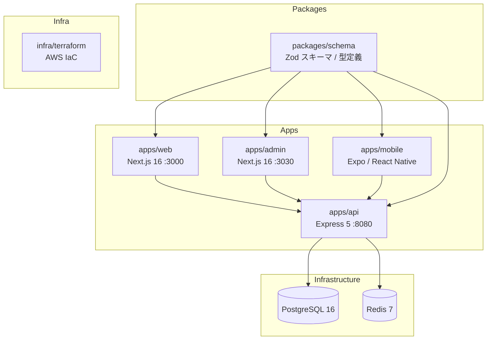

# タイピングロワイヤル（TypingRoyale）

エンジニア向けのコードタイピングゲーム。GitHub から自動収集した **OSS の実コード** を 120 秒で打鍵し、エンジニアグレード（Intern → Fellow）の昇格と「神々に挑戦」モードによる競技性を楽しめる Web プロダクト。

詳細はドキュメントを参照：

- [`docs/README.md`](docs/README.md) — プロダクト全体像
- [`docs/spec/README.md`](docs/spec/README.md) — 各機能の設計書
- [`docs/infra.md`](docs/infra.md) — インフラ設計
- [`TODO.md`](TODO.md) — 実装 TODO

Turborepo + pnpm monorepo を使用したフルスタック構成。

## 目次

- [プロジェクト構成図](#プロジェクト構成図)
- [技術スタック](#技術スタック)
- [ドキュメント](#ドキュメント)
- [使い方](#使い方)
  - [1. プロジェクトのコピー](#1-プロジェクトのコピー)
  - [2. 環境変数の設定](#2-環境変数の設定)
  - [3. セットアップ](#3-セットアップ)
- [Claude Code（MCP設定）](#claude-codemcp設定)
- [開発ルール](#開発ルール)
  - [1. 命名規則](#1-命名規則)
  - [2. 基本コマンド](#2-基本コマンド)
  - [3. pnpm ワークスペースコマンド](#3-pnpm-ワークスペースコマンド)
  - [4. 環境変数の管理コマンド](#4-環境変数の管理コマンド)
  - [5. Docker環境の起動コマンド](#5-docker環境の起動コマンド)

## プロジェクト構成図



## 技術スタック

#### モノレポ・ビルド


#### バックエンド


#### フロントエンド


#### モバイル


#### 認証


#### データベース・キャッシュ


#### テスト


#### ロギング・環境変数


#### インフラ・CI/CD


## クイックリファレンス

| ドキュメント | 内容 |
|---|---|
| [docs/mcp.md](docs/mcp.md) | MCP サーバーの一覧・使い方・追加方法 |
| [.claude/README.md](.claude/README.md) | Claude Code の設定（Agents・Commands・Skills） |

---

## テンプレートの使い方

### 1. プロジェクトのコピー

`scripts/copy-template.sh` を実行して、テンプレートを新しいプロジェクトとしてコピーします。

```bash
# 例: プロジェクト名を明示的に指定
./scripts/copy-template.sh ../my-new-app my-new-app

# 例: 絶対パスで指定 ⚠️ プロジェクト名を省略した場合、コピー先ディレクトリ名が使用される
./scripts/copy-template.sh ~/workspace/my-new-app
```

### 2. 環境変数の設定

各アプリの `.env.local` は [dotenvx](https://dotenvx.com/) で暗号化されています。復号に必要な `.env.keys` を管理者から受け取り、プロジェクトルートに配置してください。

各アプリ (`apps/api`, `apps/web`, `apps/mobile`) にはルートへのシンボリックリンクが git に含まれているため、ルートに置くだけで全アプリから参照されます。

```
<project-root>/
├── .env.keys                        ← ここに配置
├── apps/
│   ├── api/.env.keys → ../../.env.keys   (シンボリックリンク)
│   ├── web/.env.keys → ../../.env.keys   (シンボリックリンク)
│   └── mobile/.env.keys → ../../.env.keys (シンボリックリンク)
```

<details>
<summary>（管理者向け）.env.keys の作成方法とシンボリックリンクの貼り方</summary>

ゼロからプロジェクトをセットアップする管理者向けの手順です。既に `.env.keys` を受け取っている開発者は実施不要です。

```bash
# 1. ルートで .env.keys を生成（初回 set でついでに鍵が作られる）
npx dotenvx set _BOOTSTRAP "x" -f .env.local
rm .env.local                          # ← ルートに .env.local は要らないので削除

# 2. 各アプリにルートを指すシンボリックリンクを張る
ln -s ../../.env.keys apps/api/.env.keys
ln -s ../../.env.keys apps/web/.env.keys
ln -s ../../.env.keys apps/mobile/.env.keys
```

以降は **必ずプロジェクトルートから** `npx dotenvx set KEY "value" -f apps/<app>/.env.local` を実行すること（各アプリで `cd` して直接叩くと、シンボリックリンクが実体ファイルで上書きされ、アプリごとに別の鍵ペアが生成されてしまう）。

</details>

## Claude Code（MCP設定）

このプロジェクトでは MCP サーバーの設定ファイル（`.mcp.json`）をリポジトリルートに配置しています。Claude Code 起動時に MCP サーバーを認識させるには、以下のコマンドを使用してください:

```bash
claude --mcp-config=./.mcp.json
```

MCP サーバーの詳細は [docs/mcp.md](docs/mcp.md) を参照してください。

## 開発ルール

### 1. 命名規則

| 対象 | 規則 | 例 |
|---|---|---|
| ディレクトリ | kebab-case | `user-profile/`, `api-schema/` |
| 一般ファイル（hooks, utils, lib等） | kebab-case | `use-auth.ts`, `api-client.ts`, `format-date.ts` |
| Componentをexportするファイル | PascalCase | `UserProfile.tsx`, `LoginForm.tsx`, `Button.tsx` |
| テストファイル | テスト対象の関数名 + `.test.ts` | `getUserById.test.ts`, `authenticateWithGoogle.test.ts` |

### 2. 基本コマンド

```bash
pnpm dev          # 全アプリを開発モードで起動
pnpm build        # 全アプリをビルド
pnpm lint         # ESLint 実行
pnpm lint:fix     # ESLint 自動修正
pnpm test         # テスト実行
```

### 3. pnpm ワークスペースコマンド

```bash
# 特定のワークスペースでコマンドを実行
pnpm --filter <workspace-name> <command>

# 例: webアプリのみ起動
pnpm --filter web dev

# すべてのワークスペースに依存関係を追加
pnpm add -w <package-name>

# 特定のワークスペースに依存関係を追加
pnpm --filter <workspace-name> add <package-name>

# 特定のワークスペースのdevDependenciesに依存関係を追加
pnpm --filter web add -D @types/node

# 依存関係を削除
pnpm --filter <workspace-name> remove <package-name>

# すべての node_modules を削除して再インストール
pnpm clean && pnpm install
```

### 4. 環境変数の管理コマンド

```bash
# .env.local の暗号化
cd apps/api && pnpm exec dotenvx encrypt -f .env.local

# .env.local の復号化
cd apps/api && pnpm exec dotenvx decrypt -f .env.local
```

### 5. Docker環境の起動コマンド

```bash
# Dockerコンテナを起動
docker compose up -d

# コンテナの状態を確認
docker compose ps

# ログを確認
docker compose logs -f

# コンテナを停止
docker compose down

# データを含めて完全に削除
docker compose down -v
```
