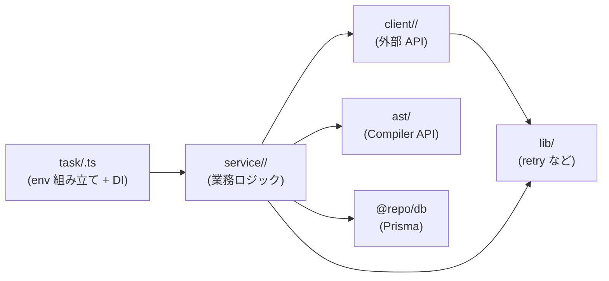

# apps/cron

cron / EventBridge から定期実行されるタスク群（GitHub クローラ・ライセンス再検証・ランキング集計）を 1 つの Node.js ワーカーにまとめたサービス。本番では ECS Scheduled Task として起動される。

詳細仕様は以下を参照:

- 問題プール（クローラ）: [`docs/spec/problem-pool/README.md`](../../docs/spec/problem-pool/README.md)
- スコア・ランキング: [`docs/spec/score-ranking/README.md`](../../docs/spec/score-ranking/README.md)

技術リファレンス:

- TypeScript Compiler API（AST 解析の関数・データ構造）: [`docs/typescript-ast.md`](./docs/typescript-ast.md) — 新規ジョイン者向けのキャッチアップガイド

## ステータス

**Phase 0**：ディレクトリと task エントリの雛形のみ。実処理は以下のフェーズで追加する。

| コマンド | フェーズ | 用途 |
| --- | --- | --- |
| `pnpm crawler:run` | Phase 2 | 週次クローラ（GitHub API → AST → 問題化） |
| `pnpm crawler:license-recheck` | Phase 2 | 月次ライセンス再検証 |
| `pnpm batch:ranking` | Phase 4 | 毎時ランキング集計 |

## Commands

```bash
pnpm dev        # tsx watch で src/index.ts を起動（起動確認用）
pnpm build      # dist/ にコンパイル
pnpm start      # dist/ から起動
pnpm lint       # ESLint
```

## ディレクトリ戦略

cron は「複数の独立した定期実行タスクが 1 つのワーカーに同居する」アプリ。GitHub クローラ以外のタスクが今後増えても破綻しないよう、層ごとに置くものを決めて分離している。

### 設計の方針

- **cron 1 本 = 1 ファイル**。起動エントリ（`task/<name>.ts`）はディレクトリを切らない。`package.json` の `scripts` と 1:1 対応させて、スケジュールされているジョブが一目で分かるようにする。
- **業務ロジックは `service/<domain>/`** に置く。task 横断で再利用される単位（crawler の repo 処理、license 再検証、ranking 集計など）はここで集約する。task が増えてもディレクトリは横に広がらず、`service/` の中だけが増える。
- **外部 API は `client/<service>/`** に分離する（`GithubClient` のような class）。env を直接 import せず、コンストラクタ DI で動かす。
- **`lib/` は env も DB も知らない純関数**だけ。

### 全体像

```
apps/cron/
├── src/
│   ├── task/                        # cron 1 本 = 1 ファイル（package.json scripts と 1:1）
│   │   ├── crawler-run.ts           # crawler:run             - 週次クローラ
│   │   ├── crawler-license-recheck.ts # crawler:license-recheck - 月次ライセンス再検証
│   │   └── ranking-batch.ts         # batch:ranking           - 毎時ランキング集計
│   ├── service/                     # 業務ロジック（task 横断で再利用される単位）
│   │   ├── crawler/                 # repo 処理 / run 追跡（crawler-run と license-recheck で共有）
│   │   ├── problem-pool/            # 問題プール DB の read/write
│   │   ├── license/                 # ライセンス再検証ロジック
│   │   └── ranking/                 # ランキング集計 + DB
│   │       ├── aggregator.ts
│   │       └── repository.ts
│   ├── client/                      # 外部 API クライアント class
│   │   └── github/                  # GitHub REST + raw content（GithubClient class）
│   ├── ast/                         # TypeScript Compiler API ラッパ（service/crawler/ が使用）
│   ├── lib/                         # 汎用ユーティリティ（env / DB を知らない純関数）
│   │   ├── retry.ts                 # 指数バックオフ + jitter
│   │   └── source-url.ts            # GitHub permalink 組み立て
│   ├── env.ts                       # Zod による env 検証（safeParse → process.exit(1)）
│   └── index.ts                     # pnpm dev のエントリ（起動確認用）
├── test/                            # src と同じツリー構造で配置
│   ├── task/
│   ├── service/
│   ├── client/github/
│   ├── ast/
│   ├── lib/
│   └── fixtures/                    # 実 API レスポンスの JSON 等
├── Dockerfile                       # 本番用 (turbo prune + installer-builder + runner)
├── package.json
└── tsconfig.json
```

### 層の役割

| 層 | 何を置くか | 何を置かないか |
| --- | --- | --- |
| `task/<name>.ts` | env 組み立て / Prisma・client の生成 / `service/*` を呼ぶ薄い 1 ファイル | 業務ロジック・複数ファイル |
| `service/<domain>/` | task 横断で再利用される業務ロジック（aggregator / verifier / repository） | 単一 task しか使わない使い捨てコード（その task に直接書く） |
| `client/<service>/` | 外部 API クライアント class。env はコンストラクタ DI | タスク固有の業務ルール |
| `ast/` | TypeScript Compiler API のラッパ | — |
| `lib/` | retry / URL 組み立てなど純関数のユーティリティ | env / DB / 外部 I/O |

### データの流れ



- env は `task/` でしか触らない（`service/` 以下は引数 / DI で受け取る）
- `client/` は env を知らない（コンストラクタで PAT などを受け取る）
- `lib/` は env も DB も知らない（純関数）

### 設計のルール

1. **client は env を直接 import しない**
   `new GithubClient({ pat, ... })` のように task 側で組み立てて DI する。同じクライアントが複数の task から再利用される前提。
2. **service は他 service に直接依存しすぎない**
   `service/crawler/` から `service/problem-pool/` を呼ぶのは OK（業務上の依存）。ただし循環依存になったら設計が崩れているサイン。
3. **task は service にしかロジックを置かない**
   task に業務ロジックを書きそうになったら、それは `service/<domain>/` に切り出すべき。task は最大でも数十行に保つ。
4. **lib は env も DB も知らない**
   引数だけで完結する純関数を置く。状態や I/O が必要な処理は `client/` か `service/` 側に持たせる。

### ランキング集計を実装するときの例

`batch:ranking`（毎時、ranking_snapshots を更新）は次のような構成になる。

**`src/task/ranking-batch.ts`** — 起動の薄い 1 ファイル：

```ts
import { createPrismaClient } from "@repo/db"
import { env } from "../env"
import { RankingAggregator } from "../service/ranking/aggregator"
import { RankingRepository } from "../service/ranking/repository"

const main = async () => {
  const prisma = createPrismaClient({ url: env.DATABASE_URL })
  const repo = new RankingRepository(prisma)
  const aggregator = new RankingAggregator(repo)
  await aggregator.run()
}
main()
```

**`src/service/ranking/aggregator.ts`** — 業務ロジック：

```ts
export class RankingAggregator {
  constructor(private readonly repo: RankingRepository) {}

  run = async (): Promise<void> => {
    const stats = await this.repo.fetchLanguageStats()
    const snapshot = computeSnapshot(stats)
    await this.repo.upsertSnapshot(snapshot)
  }
}
```

**`src/service/ranking/repository.ts`** — Prisma 経由の DB アクセス：

```ts
export class RankingRepository {
  constructor(private readonly prisma: PrismaClient) {}

  fetchLanguageStats = async (): Promise<LanguageStat[]> => { ... }
  upsertSnapshot = async (snapshot: RankingSnapshot): Promise<void> => { ... }
}
```

テストは `test/service/ranking/aggregator.test.ts` に置き、`RankingRepository` は in-memory モック / fake で差し替える。

### 新しい task を追加するときの手順

例：Slack に日次レポートを送る `report:daily` バッチを追加するケース。

1. `src/task/report-daily.ts` を作り `package.json` の `scripts` に `"report:daily": "tsx src/task/report-daily.ts"` を追加
2. 業務ロジックは `src/service/report/` に置く（`builder.ts` / `repository.ts` など）
3. Slack を叩くなら `src/client/slack/` に `SlackClient` class を追加（`client/github/` と同じ構成：`client.ts` / `errors.ts` / `types.ts` / `index.ts`）
4. token などは `src/env.ts` の Zod スキーマに追加し、task で `new SlackClient({ token: env.SLACK_TOKEN })` のように DI
5. テストは `test/service/report/` と `test/client/slack/` に src と対応する形で置く。fixture は `test/fixtures/slack/` に

### 各 task が使う共通基盤

| 共通パッケージ | 用途 |
| --- | --- |
| `@repo/db` | Prisma client。`createPrismaClient()` を task で 1 回呼んで service の Repository に DI |
| `@repo/logger` | `ILogger`。AsyncLocalStorage で trace_id を run 単位に伝搬 |
| `@repo/errors` | `Result<T>` / `ApiError` |
| `@repo/redis` | BullMQ / Pub/Sub が必要になったとき。Phase 0 では未使用 |

詳細は [`docs/spec/shared-packages/README.md`](../../docs/spec/shared-packages/README.md) を参照。
