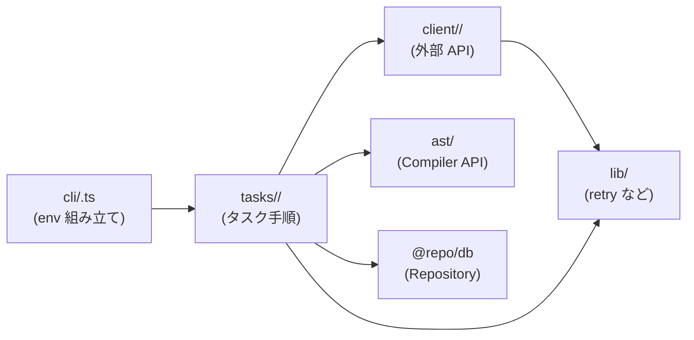

# apps/cron

cron / EventBridge から定期実行されるタスク群（GitHub クローラ・ライセンス再検証・ランキング集計）を 1 つの Node.js ワーカーにまとめたサービス。本番では ECS Scheduled Task として起動される。

詳細仕様は以下を参照:

- 問題プール（クローラ）: [`docs/spec/problem-pool/README.md`](../../docs/spec/problem-pool/README.md)
- スコア・ランキング: [`docs/spec/score-ranking/README.md`](../../docs/spec/score-ranking/README.md)

技術リファレンス:

- TypeScript Compiler API（AST 解析の関数・データ構造）: [`docs/typescript-ast.md`](./docs/typescript-ast.md) — 新規ジョイン者向けのキャッチアップガイド

## ステータス

**Phase 0**：ディレクトリと CLI エントリポイントの雛形のみ。実処理は以下のフェーズで追加する。

| コマンド | フェーズ | 用途 |
| --- | --- | --- |
| `pnpm crawler:run` | Phase 2 | 週次クローラ（GitHub API → AST → 問題化） |
| `pnpm crawler:license-recheck` | Phase 2 | 月次ライセンス再検証 |
| `pnpm batch:ranking` | Phase 4 | 毎時ランキング集計 |

## Commands

```bash
pnpm dev        # tsx watch で src/index.ts を起動（起動確認用）
pnpm build      # dist/ にコンパイル
pnpm start      # dist/ から起動
pnpm lint       # ESLint
```

## ディレクトリ戦略

cron は「複数の独立した定期実行タスクが 1 つのワーカーに同居する」アプリ。GitHub クローラ以外のタスクが今後増えても破綻しないよう、層ごとに置くものを決めて分離している。

### 全体像

```
apps/cron/
├── src/
│   ├── cli/                  # CLI エントリポイント（package.json の bin と 1:1）
│   │   ├── run.ts            # crawler:run            - 週次クローラ
│   │   ├── license-recheck.ts# crawler:license-recheck - 月次ライセンス再検証
│   │   └── ranking-batch.ts  # batch:ranking          - 毎時ランキング集計
│   ├── tasks/                # タスク固有ロジック（cli から呼ぶ）
│   │   ├── crawler/          # 問題プール収集（Phase 2）
│   │   ├── license-recheck/  # ライセンス再検証（Phase 2）
│   │   └── ranking/          # ランキング集計（Phase 4）
│   ├── client/               # 外部 API クライアント（タスク横断で再利用）
│   │   └── github/           # GitHub REST + raw content（GithubClient class）
│   ├── ast/                  # TypeScript Compiler API ラッパ（crawler が使用）
│   ├── lib/                  # 汎用ユーティリティ（タスク・クライアント横断）
│   │   ├── retry.ts          # 指数バックオフ + jitter
│   │   └── source-url.ts     # GitHub permalink 組み立て
│   ├── env.ts                # Zod による env 検証（safeParse → process.exit(1)）
│   └── index.ts              # pnpm dev のエントリ（起動確認用）
├── test/                     # src と同じツリー構造で配置
│   ├── client/github/
│   ├── ast/
│   ├── tasks/...
│   ├── lib/
│   └── fixtures/             # 実 API レスポンスの JSON 等
├── Dockerfile                # 本番用 (turbo prune + installer-builder + runner)
├── package.json
└── tsconfig.json
```

### 層の役割

| 層 | 何を置くか | 何を置かないか |
| --- | --- | --- |
| `cli/` | CLI 引数のパース、env の組み立て、`tasks/*` の `run()` を呼ぶ薄いエントリ | ビジネスロジック・I/O |
| `tasks/<name>/` | そのタスク固有の手順（DB / 外部 API / ドメインロジックの組み立て） | 他タスクから再利用される汎用処理 |
| `client/<service>/` | 外部 API クライアント class（`GithubClient` のような）。env 依存はコンストラクタ DI | タスク固有の業務ルール |
| `ast/` | TypeScript Compiler API のラッパ（crawler 専用だが横断的に使う想定がある層） | — |
| `lib/` | retry / URL 組み立て・GitHub 以外でも使うユーティリティ | 特定タスク・特定サービスの知識 |

### データの流れ



- env は `cli/` でしか触らない（`tasks/` 以下は引数 / DI で受け取る）
- `client/` は env を知らない（コンストラクタで PAT などを受け取る）
- `lib/` は env も DB も知らない（純関数）

### 設計のルール

1. **client は env を直接 import しない**
   `new GithubClient({ pat, ... })` のように cli 側で組み立てて DI する。CLI が切り替わっても同じクライアントを再利用できるようにするため。
2. **tasks は他 tasks に依存しない**
   横断したくなったら `lib/` に汎用ヘルパとして切り出すか、`client/` を作るか検討する。task 間の直接 import は禁止。
3. **lib は env も DB も知らない**
   引数だけで完結する純関数を置く。状態や I/O が必要な処理は `client/` か `tasks/` 側に持たせる。

### 新タスクを追加するときの手順

例：Slack に日次レポートを送る `report:daily` バッチを追加するケース。

1. `src/cli/report-daily.ts` を作り `package.json` の `scripts` に `"report:daily": "tsx src/cli/report-daily.ts"` を追加
2. `src/tasks/report/` にタスク本体を実装（`run.ts` + 必要なら repository / domain）
3. 新しい外部サービスを叩くなら `src/client/slack/` に `SlackClient` class を追加（`client/github/` と同じ構成：`client.ts` / `errors.ts` / `types.ts` / `index.ts`）
4. token などは `src/env.ts` の Zod スキーマに追加し、cli で `new SlackClient({ token: env.SLACK_TOKEN })` のように DI
5. テストは `test/tasks/report/` と `test/client/slack/` に src と対応する形で置く。fixture は `test/fixtures/slack/` に

### 各タスクが使う共通基盤

| 共通パッケージ | 用途 |
| --- | --- |
| `@repo/db` | Prisma client。`createPrismaClient()` を 1 回呼んで Repository に DI |
| `@repo/logger` | `ILogger`。AsyncLocalStorage で trace_id をリクエスト/run 単位に伝搬 |
| `@repo/errors` | `Result<T>` / `ApiError` |
| `@repo/redis` | BullMQ / Pub/Sub が必要になったとき。Phase 0 では未使用 |

詳細は [`docs/spec/shared-packages/README.md`](../../docs/spec/shared-packages/README.md) を参照。
