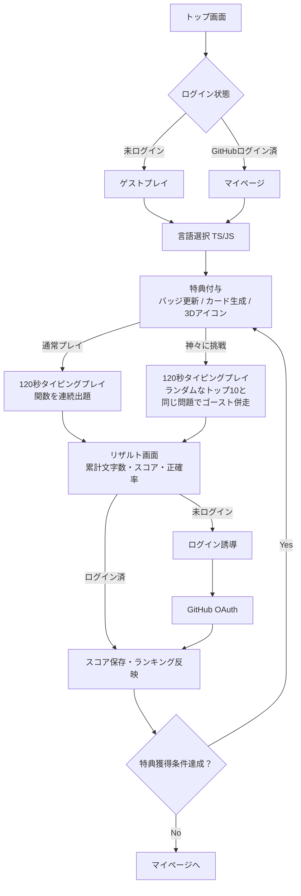
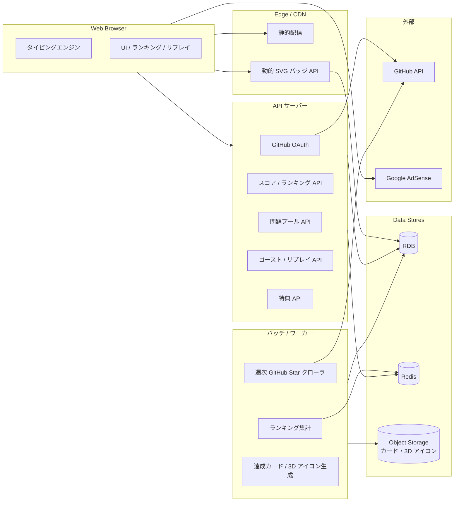
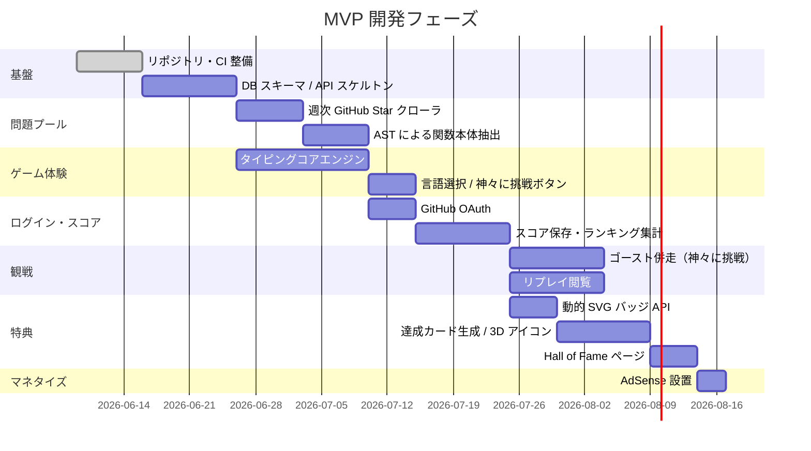

# タイピングロワイヤル（TypingRoyale）プロダクト要件

エンジニア向けに「実際の OSS コード」をタイピング教材として提供する Web タイピングゲーム。寿司打が既に一強となっている一般タイピング市場には参入せず、**コーディングタイピング**という未開拓領域に的を絞る。

「ロワイヤル」の名の通り、エンジニアグレード（Intern → Fellow の 8 段階）と「神々に挑戦」モードによる **競技性** を全面に押し出した設計。

このドキュメントは **プロダクト全体像** をまとめたものです。各機能の詳細仕様は [`docs/spec/`](./spec/README.md) 配下を参照してください。

---

## 目次

- [プロジェクト概要](#プロジェクト概要)
  - [ターゲットペルソナ](#ターゲットペルソナ)
  - [プラットフォーム](#プラットフォーム)
  - [ポジショニング](#ポジショニング)
- [体験フロー（ユーザージャーニー）](#体験フローユーザージャーニー)
- [機能一覧と詳細仕様へのリンク](#機能一覧と詳細仕様へのリンク)
- [MVP スコープ方針](#mvp-スコープ方針)
  - [対応言語（MVP）](#対応言語mvp)
  - [問題ソース（MVP）](#問題ソースmvp)
  - [含む / 含まない](#含む--含まない)
- [全体アーキテクチャ概要](#全体アーキテクチャ概要)
- [マネタイズ戦略の概要](#マネタイズ戦略の概要)
- [非機能要件](#非機能要件)
- [リスクと未確定事項](#リスクと未確定事項)
- [開発フェーズ（参考）](#開発フェーズ参考)

---

## プロジェクト概要

### ターゲットペルソナ

- **プライマリ**：現役エンジニア（実務 1〜10 年）／エンジニアを志す学生・ブートキャンプ生
- **行動特性**：
  - GitHub アカウントを保有
  - タイピング速度に課題意識がある／コードを速く書きたい
  - OSS・コーディングに興味がある

### プラットフォーム

- **Web のみ**（PC ブラウザ前提）
- モバイル対応しない

### ポジショニング

| 項目 | 寿司打 / e-typing / untyping.jp など既存タイピングサイト | 本プロダクト |
| --- | --- | --- |
| 題材 | 日本語の単語・文章 | **OSS の実コード** |
| ターゲット | 一般 | **エンジニア（GitHub 利用層）** |
| 特典 | スコア表示・サイト内ランキング | **GitHub README バッジ／達成カード／3D アイコン／Hall of Fame** |
| 競争性 | 個人スコア中心 | **言語別ランキング＋ゴースト対戦＋リプレイ閲覧** |
| マネタイズ | ディスプレイ広告（AdSense 等） | **同じく AdSense**（差別化要素ではない） |

マネタイズ方式は既存サイトと同様（AdSense）であり、収益面の優位性は **「単価の高いエンジニア向け面」「シェアによる流入増」** で勝負する。差別化の本丸は **「題材＝コード」「ターゲット＝エンジニア」「特典＝GitHub プロフィールが豪華になる」** の 3 点。

---

## 体験フロー（ユーザージャーニー）

---

## 機能一覧と詳細仕様へのリンク

すべての機能仕様は [`docs/spec/`](./spec/README.md) 配下にあります。

| 機能 | 概要 | 詳細 |
| --- | --- | --- |
| タイピングコアエンジン | 120 秒制限・関数の連続出題・入力判定・スコア計算 | [./spec/typing-engine/README.md](./spec/typing-engine/README.md) |
| 問題プール | 週次 cron で GitHub Star 上位の寛容ライセンス OSS をクロールし関数本体を抽出 | [./spec/problem-pool/README.md](./spec/problem-pool/README.md) |
| GitHub OAuth | 読み取り最小スコープでのログイン・アカウント管理 | [./spec/github-auth/README.md](./spec/github-auth/README.md) |
| スコア・ランキング | 言語別全期間トップ 1000 の集計・表示。**エンジニアグレード**（Intern → Fellow の 8 段階）で個人成長を可視化 | [./spec/score-ranking/README.md](./spec/score-ranking/README.md) |
| ゴースト併走（神々に挑戦） | 言語選択画面のボタンから起動。トップ 10 ランダム選定で同じ問題シーケンスを併走 | [./spec/ghost-battle/README.md](./spec/ghost-battle/README.md) |
| リプレイ閲覧 | トップ 10 入賞プレイのキーストローク再描画 | [./spec/replay-viewer/README.md](./spec/replay-viewer/README.md) |
| 特典（リワード） | 動的 SVG バッジ・達成カード・3D アイコン・Hall of Fame | [./spec/rewards/README.md](./spec/rewards/README.md) |
| 広告配信 | Google AdSense のディスプレイ広告配信 | [./spec/adsense/README.md](./spec/adsense/README.md) |

---

## MVP スコープ方針

### 対応言語（MVP）

| 言語 | 採用理由 |
| --- | --- |
| TypeScript | エンジニア人口最大層、Web 系の中心 |
| JavaScript | TypeScript と問題プールを共有しやすい（同じ repo の `.js` `.ts` を活用可） |

→ MVP 後の拡張候補：Python / Go / Rust / Java / Kotlin / Ruby / PHP / C++ / Swift。問題プール基盤は最初から **多言語拡張前提** で設計する。

### 問題ソース（MVP）

- **週次 cron で GitHub Star 上位の OSS を自動クロール** する単一パイプライン。手動キュレーションも GitHub Trending 取り込みも持たない。
- 寛容ライセンス（MIT / Apache-2.0 / BSD）の repo のみを対象。
- ユーザー指定 public repo からの出題は **MVP では対象外**。
- 全問題が単一ソースから来るため、**全プレイがランキング対象**。

### 含む / 含まない

| カテゴリ | MVP に含む | MVP では含まない |
| --- | --- | --- |
| プレイ体験 | ゲストプレイ / TS・JS / 120 秒制限 / 関数本体の連続出題 / スコア計算 / 通常プレイ・神々に挑戦の 2 モード | モバイル UI / 3 言語以上 / ユーザー指定 repo / コース制 / 任意時間制 / 依存型同梱 / スキップ機能 / 問題ソース選択 |
| ランキング | 言語×全期間トップ 1000 / トップ 10 表示 / **エンジニアグレード（Intern → Fellow の 8 段階）** | 国別・地域別ランキング / 日間・週間・月間ランキング |
| 観戦 | 神々に挑戦モードでの併走 / リプレイ閲覧（**キーストロークログを再描画する方式・動画ファイル不要**） | 動画ファイル化（mp4 / GIF）／ライブ対戦 |
| 認証 | GitHub OAuth 読み取り最小スコープ | メール・SNS 他プロバイダ / GitHub への書き込み |
| 特典 | 動的 SVG バッジ / 達成カード PNG / 3D アイコン / Hall of Fame | 物理グッズ / NFT |
| マネタイズ | Google AdSense（プレイ中非表示） | 課金 / サブスク / スポンサー枠（後期検討） |

ユーザー方針：**フルリリース**。コア体験から特典・観戦・GitHub 連携まで一気通貫で出す。

---

## 全体アーキテクチャ概要

実装スタックの選定（Next.js / Express / RDB の具体）は別途設計フェーズで決定。

---

## マネタイズ戦略の概要

詳細は [./spec/adsense/README.md](./spec/adsense/README.md) を参照。

- 課金機能なし。**Google AdSense** のディスプレイ広告のみ。
- **プレイ中・ゴースト対戦中は広告非表示**（体験優先）。
- 競合との収益構造比較：

| 項目 | 既存タイピングサイト（寿司打 / untyping.jp 等） | 本プロダクト |
| --- | --- | --- |
| 主要収益源 | Google AdSense | Google AdSense |
| 想定 RPM（参考） | 一般向け面のため低〜中 | **エンジニア面のため高単価** が期待できる（B2B SaaS 系の広告主が入りやすい） |
| ユーザー導線 | サイト直来訪 | **README バッジ／達成カード SNS シェア** による被リンク・流入が継続的に発生 |
| 拡張余地 | ディスプレイ広告中心 | スポンサー枠・採用広告・技術書アフィリエイト等のエンジニア特化収益が積み上げ可能 |

→ AdSense 自体は同じ仕組みでも、**「面の質」と「拡散ループ」** で収益効率に差を出す。

---

## 非機能要件

| 項目 | 要件 |
| --- | --- |
| 対応ブラウザ | 最新 2 バージョンの Chrome / Edge / Firefox / Safari |
| 入力遅延 / タイマー精度 | **寿司打と同等の体感** を品質基準（数値目標は設けず、並走テストでチューニング） |
| 可用性 | プレイ中の API 切断でローカル完走可能（リザルト送信のみリトライ）。DB 永続化は `/finish` 時のみで、離脱時は何も残らない |
| 同時接続 | ローンチ時 同時 500、半年で 5000 想定 |
| ランキング更新 | 集計バッチ：毎時／期間切替時。表示はキャッシュ |
| ストレージ | リプレイ・ゴーストは **動画ファイル不要**（キーストロークログを gzip 圧縮、1 セッション数十 KB） |
| ライセンス遵守 | 寛容ライセンス（MIT / Apache-2.0 / BSD）のみ採用、出典・ライセンス文を表示 |
| アクセシビリティ | キーボードのみで完結、配色は WCAG AA |

---

## リスクと未確定事項

- **GitHub API レート制限**：週次クローラは Search API（30 req/min）と Tree / Raw API（OAuth 経由 5000 req/h）の制限内で動かす。重い repo 走査は非同期キューで分割実行。
- **コードのライセンス遵守**：問題画面に必ず「出典 repo」「ライセンス名」「コミット SHA」を表示する。法務確認が必要。
- **不正対策**：ペーストやマクロによる高スコア偽装防止。キーストローク間隔の異常検知、`paste` イベント検知、最大入力速度の上限を設けるなど。
- **ゴースト・リプレイの公平性**：ブラウザ依存のタイムスタンプ精度差をどう吸収するか（リサンプリングで対応予定）。
- **3D アイコン生成方式**：内製モデル生成 or 既存サービス連携かは未確定。コストとクオリティで再検討。
- **広告とプレイ画面の境界**：プレイ画面で広告を完全に隠す UI／レイアウト設計は要プロトタイプ検証。
- **クローラの問題品質**：自動取得のため、特定の repo に偏ったコードスタイル / 不適切表現リテラルが含まれるケースがありうる。運営の事後 `disabled` 化と将来的な NG ワード辞書で吸収。
- **多言語 UI 対応**：日本語先行、英語 UI 対応は MVP 後に検討。

---

## 開発フェーズ（参考）

---

> **次のアクション**：個別機能の実装に着手するタイミングで、各 `docs/spec/{feature}/` 配下に `design-feature` skill で `step-*.md`（実装手順・コード例）を追加する。
