# 特典画像アセット（既存デザイン確認用）

`packages/generate-image` が**現状生成する**特典画像（殿堂入り / 月間 TOP10 バッジ、各種達成カード）のサンプルを書き出したもの。デザインをいつでも確認できるようにするための参照用で、実プロダクトの生成物と同一の renderer を使っている（モックではない）。

- バッジ: `badges/`（SVG・360×80）
- カード: `cards/`（PNG・1200×630）
- 再生成スクリプト: [`generate.mjs`](./generate.mjs)

> 言語は表示ラベル（TS / JS / Go）が変わるだけでデザインは共通。reward は言語マスタ駆動で、現状の対象は TypeScript / JavaScript / Go（新しい言語をマスタに追加すれば自動的に対象になる）。

## バッジ（SVG）

### 殿堂入り（Hall of Fame）

順位で配色が変わる（1=金 / 2=銀 / 3=銅 / 4–10=黒メイン）。

| 1位 | 2位 | 3位 | 4–10位 |
|---|---|---|---|
|  |  |  |  |

### 月間 TOP10（Monthly Top 10）

全順位で青テーマ固定。


## カード（PNG・1200×630）

### 殿堂入り（Hall of Fame）

| 1位 | 2位 |
|---|---|
| 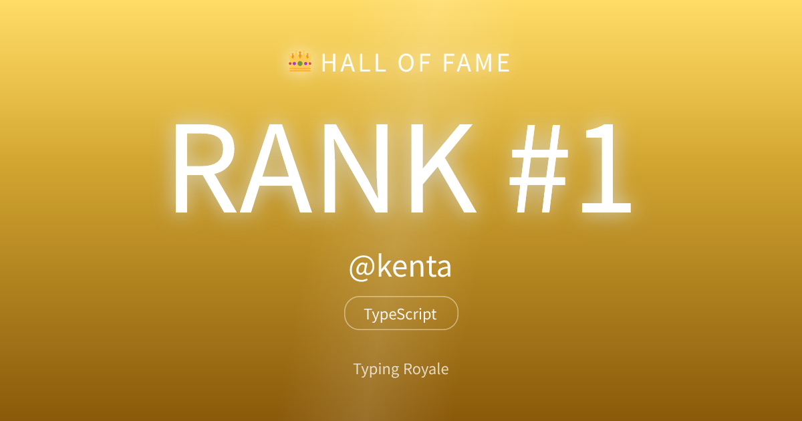 | 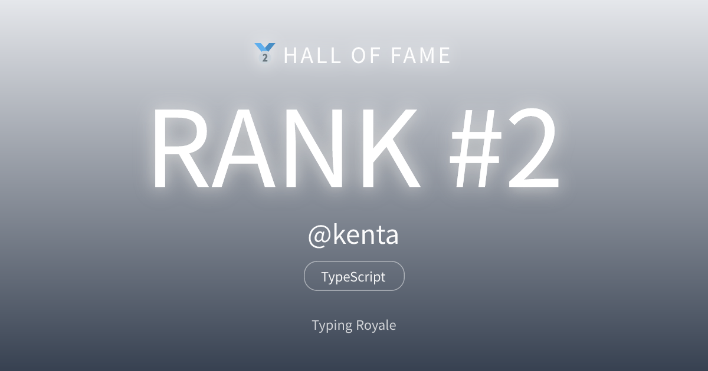 |
| **3位** | **4–10位** |
| 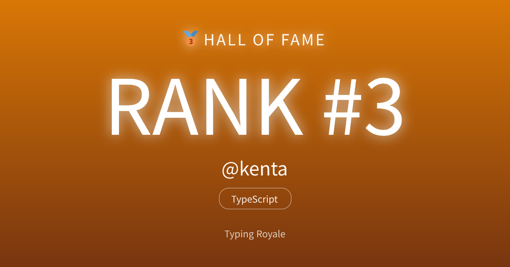 | 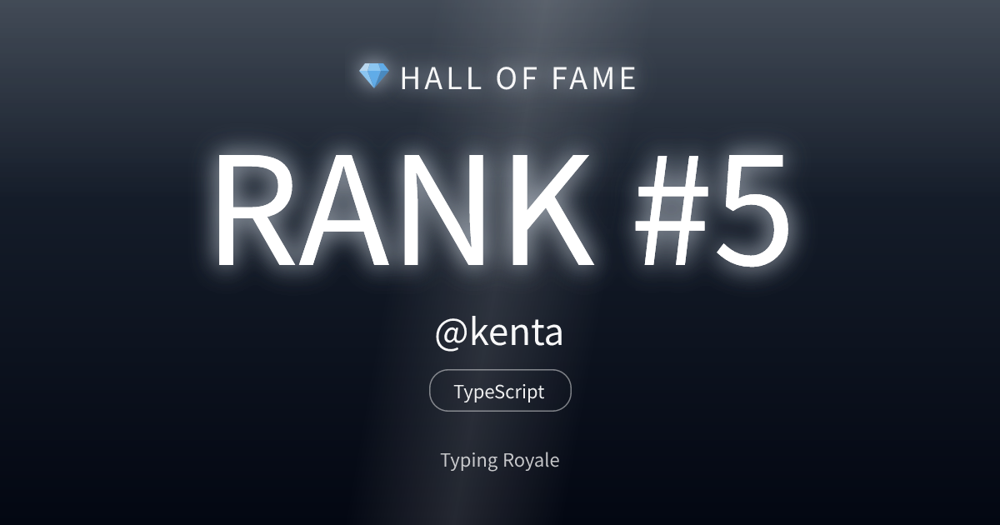 |

### 月間 TOP10（Monthly Top 10）

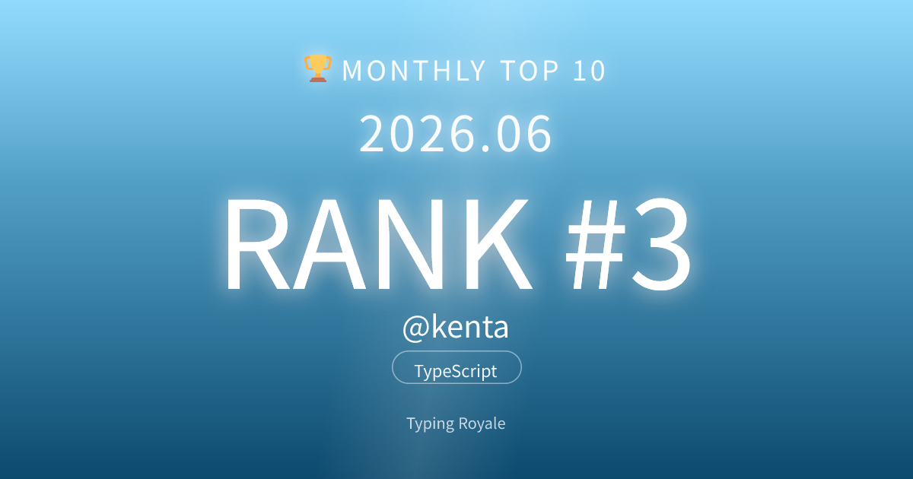

### 昇格（Grade Up）

グレードごとに配色が変わる。

| Intern | Junior Developer | Mid Developer | Senior Engineer |
|---|---|---|---|
| 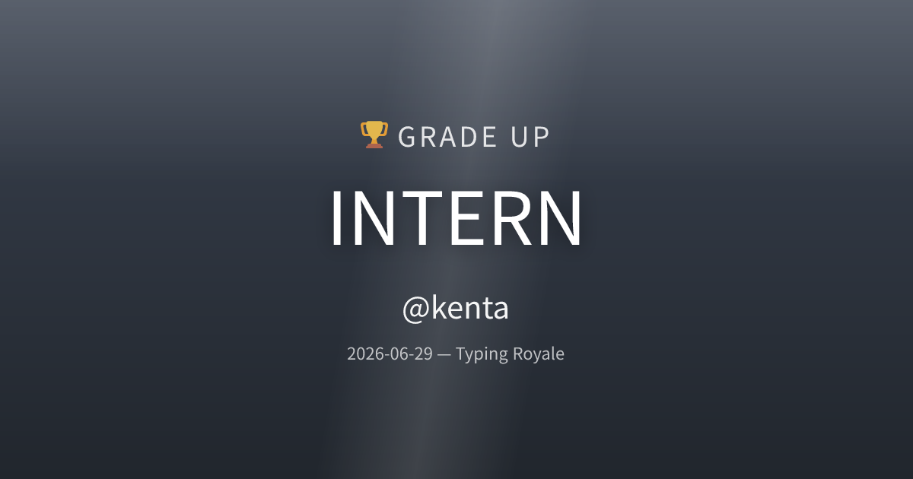 | 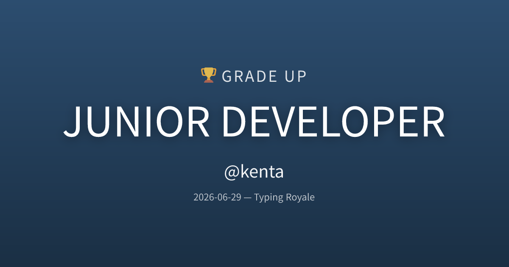 | 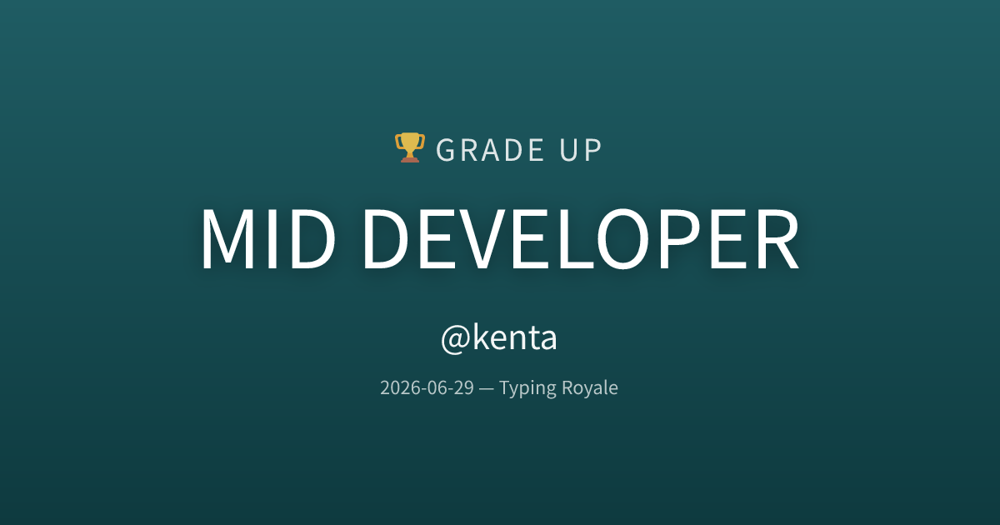 |  |
| **Staff Engineer** | **Principal Engineer** | **Distinguished Engineer** | **Fellow** |
| 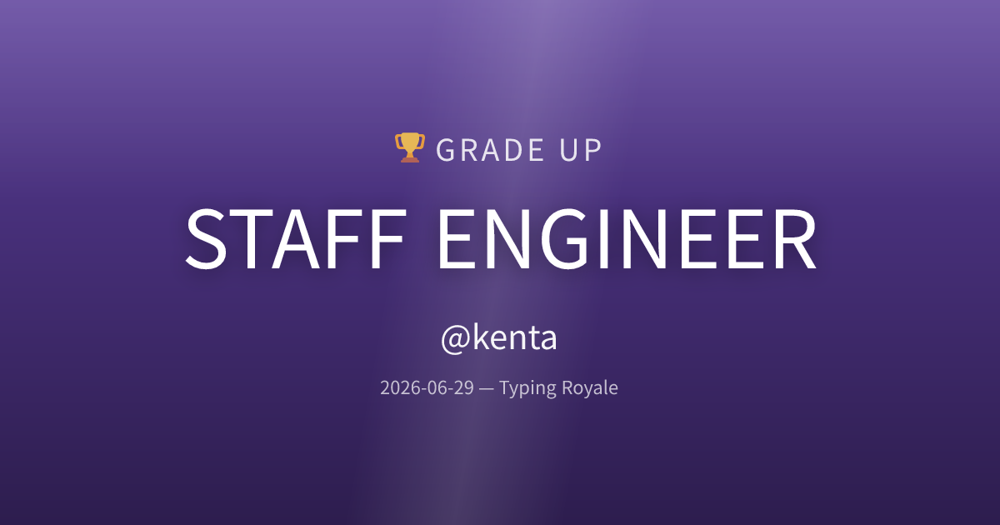 |  | 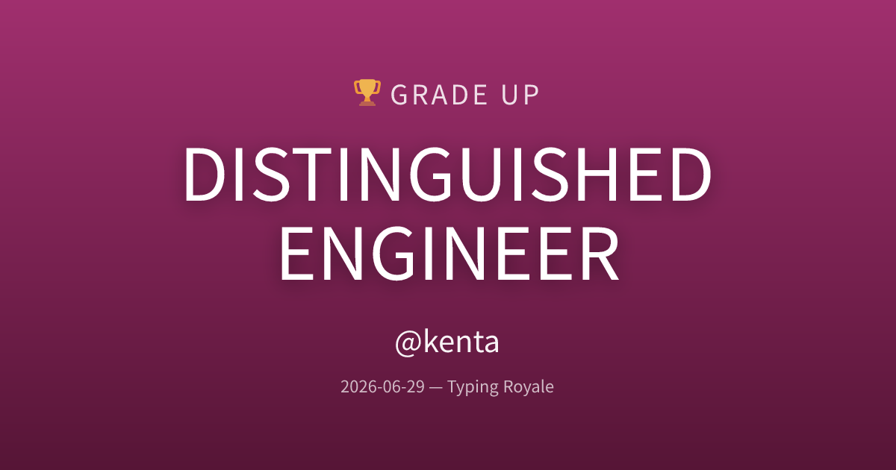 | 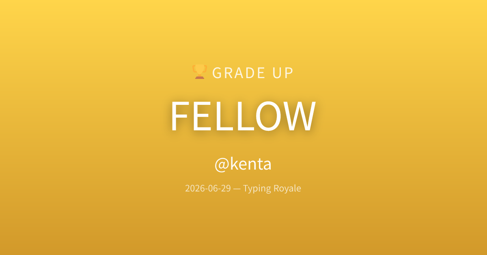 |

## 言語バリエーション

デザインは共通でラベルのみ変化（例: 殿堂入り 1位）。

| TypeScript | JavaScript | Go |
|---|---|---|
|  |  |  |

JavaScript / Go 版のカードも `cards/*-javascript.png` / `cards/*-go.png` に同梱している。

## 再生成

デザインを変更したら以下で更新する。

```bash
pnpm --filter @repo/generate-image build   # dist を生成
node docs/assets/rewards/generate.mjs       # 全アセットを再書き出し
```

カード PNG はフォント (Noto Sans JP) を実行時に取得するためネット接続が必要。
