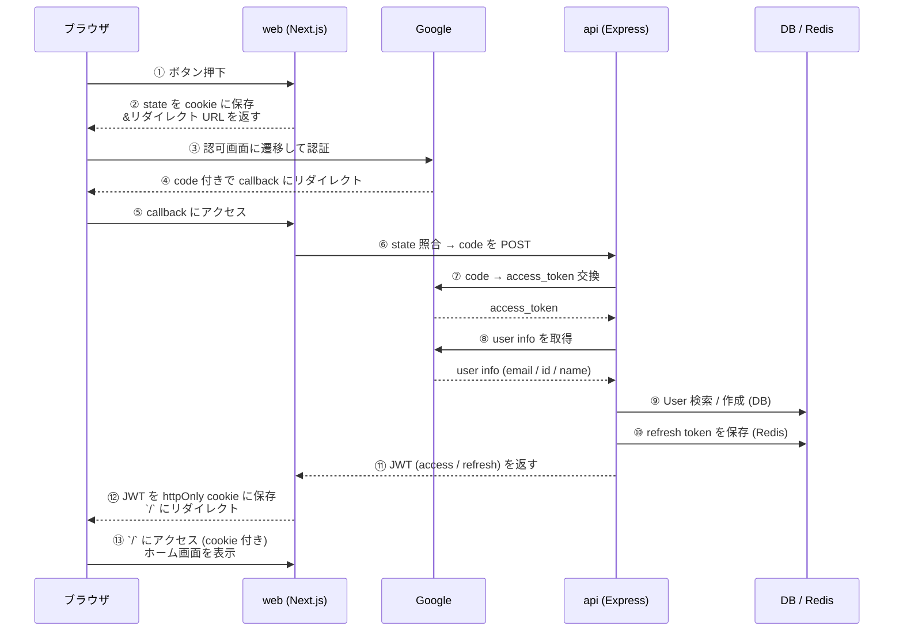

# Google OAuth サインインの仕組み

このプロジェクトでは Google の OAuth を使ったサインインを実装している。

## 目次

- [全体フロー](#全体フロー)
- [各ステップの補足](#各ステップの補足)
  - [前半: 認証情報の取得 (①〜④)](#前半-認証情報の取得-)
  - [中盤: code を JWT に変換 (⑤〜⑪)](#中盤-code-を-jwt-に変換-)
  - [後半: cookie に保存して認証完了 (⑫〜⑬)](#後半-cookie-に保存して認証完了-)
- [URL の整理](#url-の整理)
- [なぜ間に web を挟むのか](#なぜ間に-web-を挟むのか)
- [セキュリティ設計のまとめ](#セキュリティ設計のまとめ)
- [関連ファイル](#関連ファイル)

## 全体フロー



## 各ステップの補足

### 前半: 認証情報の取得 (①〜④)

- **①〜②**: ユーザが「Googleでサインイン」ボタンを押すと、web は **state**（ランダム文字列）を cookie に保存して、Google の認可画面 URL を返す
- **③**: ブラウザが Google に遷移し、ユーザが認証
- **④**: 認証成功すると Google が **`code`**（使い捨てチケット）を付けて web の callback にリダイレクト

> 💡 `state` は **CSRF 対策**。攻撃者が他人を罠サイト経由で勝手にログインさせるのを防ぐ

### 中盤: code を JWT に変換 (⑤〜⑪)

- **⑤〜⑥**: web は cookie の state と URL の state を照合（一致しなければエラー）。OK なら `code` を api に POST
- **⑦〜⑧**: api が `code` を Google に送って **access_token** に交換 → その token で **user info（メール・名前・ID）** を取得
- **⑨**: DB を検索して「この Google ID は既存ユーザ？」を判定。なければ新規作成（User + AuthAccount を1トランザクションで）
- **⑩〜⑪**: api が自前の **JWT を発行** → refresh は Redis に保存 → web に返す

> 💡 Google の token は使い捨て。以降の認証は **アプリ独自の JWT** で行う

### 後半: cookie に保存して認証完了 (⑫〜⑬)

- **⑫**: web が JWT を **httpOnly cookie** に保存（JavaScript から触れないので XSS で盗まれない）
- **⑬**: ホームに遷移。以降のリクエストは middleware が cookie の有無で認証ガード

## URL の整理

`/api/` で始まるからといって Express api サーバとは限らない。**Next.js の Route Handler も `/api/...` を使う** ので注意。

| URL | 実体 | サーバ | ファイル |
|---|---|---|---|
| `http://localhost:3000/api/auth/callback/google` | **Next.js の Route Handler** | web (port 3000) | `apps/web/src/app/api/auth/callback/google/route.ts` |
| `http://localhost:8080/api/auth/google` | **Express の POST エンドポイント** | api (port 8080) | `apps/api/src/controller/auth/google.ts` |

`apps/web/src/app/sign-in/actions.ts` の `redirect_uri` は次のように組み立てられる:

```ts
redirect_uri: `${process.env.NEXT_PUBLIC_APP_URL}/api/auth/callback/google`,
//             ^^^^^^^^^^^^^^^^^^^^^^^^^^^^^^^^^
//             これは http://localhost:3000 (web)
```

つまり `redirect_uri` の `/api/...` は **Next.js App Router の Route Handler** のことで、Express api サーバとは別物。Next.js は `app/api/foo/route.ts` というファイルがあると `/api/foo` を HTTP エンドポイントとして自動公開する仕組みで、Express とは無関係。

## なぜ間に web を挟むのか

「Google から直接 Express api に `redirect_uri` を向ければよくない？」と思うかもしれないが、このプロジェクトでは **web が前段で受けて api に転送する** 設計にしている。理由:

1. **JWT を httpOnly cookie に保存するのは Next.js 側のみ** — Express から `Set-Cookie` を返してもドメインが違うのでブラウザに保存させづらい（CORS / SameSite 制約）
2. **state cookie の照合は web で完結** — web で発行した cookie を web で読む方がシンプル
3. **api はステートレスに保てる** — api は「code もらって JWT を返すだけ」の純粋な変換器でいられる

つまり web は **「ブラウザ ↔ api」 の間の翻訳役** として動いている。

将来 GitHub / Apple / X など他プロバイダを追加する場合も、`apps/api/src/client/*-oauth.ts` を新設して `AuthAccount.provider` 文字列を増やすだけで対応できる構造になっている（`auth-service.ts` の既存ユーザ検索 / JWT 発行 / refresh 保存ロジックはプロバイダ非依存）。

## セキュリティ設計のまとめ

| 仕組み | 目的 |
|---|---|
| `code` → `access_token` の2段階 | パスワード相当の `access_token` をブラウザに渡さない |
| **state** cookie | CSRF 対策 |
| **httpOnly** cookie | XSS で JWT を盗まれない |
| **access (15分)** + **refresh (7日)** の2種類 | access が漏れても短時間で失効、利便性は refresh で確保 |
| **Client Secret は api だけ** が持つ | ブラウザに漏れない |
| refresh の **jti を Redis 管理** | サーバ側で個別失効が可能。ローテーション運用も対応 |
| cookie は **sameSite=lax** | OAuth コールバックの cross-site 連鎖ナビゲーションでも cookie が送信される |

## 関連ファイル

### web (Next.js)

- `apps/web/src/app/sign-in/page.tsx` — サインインボタン
- `apps/web/src/app/sign-in/actions.ts` — `startGoogleOAuth`（Server Action）
- `apps/web/src/app/api/auth/callback/google/route.ts` — Google callback Route Handler
- `apps/web/src/libs/auth.ts` — cookie 操作（`setAuthCookies` ほか）
- `apps/web/src/middleware.ts` — 認証ガード

### api (Express)

- `apps/api/src/controller/auth/google.ts` — `POST /api/auth/google` Controller
- `apps/api/src/service/auth-service.ts` — `authenticateWithGoogle` / `refreshTokens` / `logout`
- `apps/api/src/client/google-oauth.ts` — Google OAuth クライアント
- `apps/api/src/lib/jwt.ts` — JWT 発行・検証
- `apps/api/src/repository/redis/refresh-token-repository.ts` — refresh token の Redis 永続化
- `apps/api/src/repository/prisma/auth-account-repository.ts` — User と AuthAccount の DB 操作
