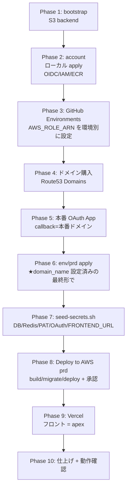

# 本番 (prd) デプロイ手順書

typing-royale を AWS (バックエンド) + Vercel (フロント) に**ゼロから本番デプロイ**するための手順書。
派生プロジェクト（project-template 系）でも同じ流れでハマりやすいので、**順番と落とし穴**を中心にまとめる。

> ⚠️ **最重要の教訓**: ALB は **最初から HTTPS の最終形にしてから app を deploy する**こと。
> HTTP で deploy → 後から HTTPS 化、の順だと **ECS Blue/Green のリスナールール紐付けが壊れ**、
> ECS サービスの作り直しが必要になる（[落とし穴 7](#落とし穴-7-https-は-deploy-より先に-ecs-bluegreen-のルール紐付け)）。

## 目次

- [全体像と順番](#全体像と順番)
- [前提（事前に用意するもの）](#前提事前に用意するもの)
- [Phase 1: Terraform backend (bootstrap)](#phase-1-terraform-backend-bootstrap)
- [Phase 2: account レイヤ（OIDC / IAM ロール / ECR）](#phase-2-account-レイヤoidc--iam-ロール--ecr)
- [Phase 3: GitHub Environments の設定](#phase-3-github-environments-の設定)
- [Phase 4: ドメイン購入（Route53 Domains）](#phase-4-ドメイン購入route53-domains)
- [Phase 5: GitHub OAuth App（本番用）](#phase-5-github-oauth-app本番用)
- [Phase 6: env/prd を apply（HTTPS 込みの最終形で）](#phase-6-envprd-を-applyhttps-込みの最終形で)
- [Phase 7: secret 投入（seed-secrets.sh）](#phase-7-secret-投入seed-secretssh)
- [Phase 8: アプリのデプロイ（GitHub Actions）](#phase-8-アプリのデプロイgithub-actions)
- [Phase 9: Vercel（フロント）](#phase-9-vercelフロント)
- [Phase 10: セキュリティ仕上げ & 動作確認](#phase-10-セキュリティ仕上げ--動作確認)
- [落とし穴集（実際にハマったもの）](#落とし穴集実際にハマったもの)

---

## 全体像と順番



**鉄則**:
- account レイヤの apply は **ローカルから**（OIDC ロール自己書き換えのため）。
- env/prd は **domain_name を設定した HTTPS の最終形で apply してから** app を deploy する。
- secret は env/prd apply（RDS/Redis 作成）の **後** に seed する。

---

## 前提（事前に用意するもの）

- AWS CLI が本番アカウントで認証済み（`aws sts get-caller-identity` で確認）。account/bootstrap の初回 apply にはリソース作成権限（≒admin）が必要
- Terraform 1.10+ / AWS CLI / jq / gh CLI / Docker
- GitHub リポジトリ（`<owner>/typing-royale`）への admin 権限
- 本番ドメインの方針（本書の例: フロント `typing-royale.com`(apex) / API `api.typing-royale.com`）
- `GITHUB_PAT`（crawler 用、`public_repo` スコープ）— dev のものを流用可

---

## Phase 1: Terraform backend (bootstrap)

S3 state バケットを作る。一度きり・ローカル apply。

```bash
cd infra/terraform/aws/bootstrap
terraform init && terraform apply
```

> 既に bucket がある場合はスキップ。state lock は S3 ネイティブ（`use_lockfile=true`）。

---

## Phase 2: account レイヤ（OIDC / IAM ロール / ECR）

**初回はローカルから apply**（CI が assume する OIDC ロール自身を作るため）。

```bash
cd infra/terraform/aws/account
terraform init && terraform apply
# 作成物: GitHub OIDC provider / IAM role(dev, prd) / ECR(api, worker, migration, cron)
terraform output -raw github_actions_dev_role_arn   # ← 控える
terraform output -raw github_actions_prd_role_arn   # ← 控える
```

> ⚠️ **prd ロールにも `AdministratorAccess` が必要**（[落とし穴 2](#落とし穴-2-prd-ロールに-tfstate--リソース権限が無い-s3-403)）。
> terraform で `github_actions_admin_prd` の attachment が入っていることを確認。

---

## Phase 3: GitHub Environments の設定

GitHub → Settings → Environments で **3 つ**作成し、**環境ごとに正しいロール ARN** を `AWS_ROLE_ARN`（Environment secret）に設定する。

| Environment | `AWS_ROLE_ARN` |
|---|---|
| `dev` | dev ロール ARN（末尾 `-github-actions-dev`） |
| `prd` | prd ロール ARN（末尾 `-github-actions-prd`） |
| `prd-api-approval` | prd ロール ARN（同上。prd の trust policy が両 sub を許可） |

```bash
gh secret set AWS_ROLE_ARN --env dev  --repo <owner>/typing-royale --body "<dev ロール ARN>"
gh secret set AWS_ROLE_ARN --env prd  --repo <owner>/typing-royale --body "<prd ロール ARN>"
gh secret set AWS_ROLE_ARN --env prd-api-approval --repo <owner>/typing-royale --body "<prd ロール ARN>"
```

- ⚠️ **repo レベルの `AWS_ROLE_ARN` は作らない／消す**（dev/prd で別ロールが必要なため、必ず Environment secret）。
- ⚠️ **テンプレ由来の取り違えに注意**（[落とし穴 1](#落とし穴-1-github-environment-の-aws_role_arn-が別プロジェクトのロールを指す)）。
- **承認ゲート**:
  - `prd-api-approval` に **Required reviewers** を設定（api 本番切替の承認用）。
  - `prd` 環境は **Required reviewers を付けない**（付けると build/migrate/Plan 全部が毎回承認待ちになる。承認は api 切替だけにする設計）。

---

## Phase 4: ドメイン購入（Route53 Domains）

AWS コンソール → **Route 53 → Domains → Register domains** で購入。

1. ドメイン（例 `typing-royale.com`）を検索 → 購入（.com は約 $15/年）
2. 登録者連絡先を入力、**Privacy protection 有効**、**Auto-renew 有効**
3. 規約同意 → 購入

購入後の確認（数分〜数十分で `SUCCESSFUL`）:

```bash
aws route53domains list-operations --region us-east-1 \
  --query 'Operations[?DomainName==`typing-royale.com`].{type:Type,status:Status}'
dig +short NS typing-royale.com   # NS が awsdns で返れば DNS 委譲が有効
```

> Route 53 Domains で買うと **hosted zone が自動作成**され、NS も自動でそこを向く（手動設定不要）。
> terraform の `data "aws_route53_zone"` がこれを lookup する。**NS 公開伝播後に ACM の DNS 検証が通る**。

---

## Phase 5: GitHub OAuth App（本番用）

**dev とは別の OAuth App を作る**（callback URL が違うため必須・1 App = 1 callback）。

GitHub → Settings → Developers → OAuth Apps → New OAuth App
- Application name: `Typing Royale (prod)`
- Homepage URL: `https://typing-royale.com`
- Authorization callback URL: `https://typing-royale.com/api/auth/callback/github`
- → **Client ID** と **Client secret** を控える（Phase 7 で seed）

---

## Phase 6: env/prd を apply（HTTPS 込みの最終形で）

> ★ **ここが最重要**。HTTP で先に立ち上げてから後で HTTPS 化、をやると ECS Blue/Green の
> ルール紐付けが壊れる（[落とし穴 7](#落とし穴-7-https-は-deploy-より先に-ecs-bluegreen-のルール紐付け)）。
> **最初から `domain_name` を設定して HTTPS の最終形で apply** し、それから Phase 8 で deploy する。

1. `env/prd/variables.tf` の `domain_name` を本番ドメインに設定（default を `"typing-royale.com"` に）。
   - API は `api.typing-royale.com`（`subdomain=""` なので apex 直下のサブドメイン）。stg/dev を足すなら `subdomain="stg"` 等。
2. `env/prd/.trivyignore` の `AVD-AWS-0054`（HTTPS 未使用）行を削除。
3. apply（CI = `terraform-aws-env-apply` を `environment=prd` で workflow_dispatch、またはローカル）:

```bash
# CI: Actions → terraform-aws-env-apply → environment=prd
# or local:
cd infra/terraform/aws/env/prd && terraform init && terraform apply
```

作成物: VPC / RDS(Multi-AZ) / ElastiCache(2 ノード TLS) / ALB(HTTPS+Blue/Green) /
ECS cluster + api/worker/migration/cron / EventBridge スケジュール / Secrets(箱+JWT) /
**ACM 証明書 `*.typing-royale.com`（DNS 検証）+ HTTPS リスナー + `api.typing-royale.com` の ALIAS Aレコード**。

> ⚠️ この時点で ECS api/worker は **イメージ未 push のため起動失敗**する（後で deploy して正常化）。想定どおり。

---

## Phase 7: secret 投入（seed-secrets.sh）

RDS/Redis ができた**後**に接続情報 + 外部 secret を投入する（これが無いと ECS タスクは起動に失敗する）。

```bash
cd <repo-root>
export GITHUB_PAT='ghp_...'                          # crawler 用（dev のを流用可）
export GITHUB_CLIENT_ID='<本番 OAuth App の Client ID>'
export GITHUB_CLIENT_SECRET='<本番 OAuth App の Client secret>'
export FRONTEND_URL='https://typing-royale.com'      # フロント(apex)
./scripts/seed-secrets.sh prd
```

- 自動構築される（export 不要）: `DATABASE_URL` / `REDIS_HOST` / `REDIS_URL`(prd は `rediss://` = TLS)
- スクリプトは **merge 方式**（何度でも再実行可。値だけ上書き）
- 確認:

```bash
aws secretsmanager get-secret-value --secret-id /typing-royale-prd/app \
  --query SecretString --output text | jq 'keys'
# DATABASE_URL / REDIS_* / GITHUB_* / FRONTEND_URL / JWT_* が揃っていること
```

> api は `GITHUB_CLIENT_ID/SECRET` が**非空**でないと起動に失敗する。`FRONTEND_URL` は有効な URL が必須。

---

## Phase 8: アプリのデプロイ（GitHub Actions）

Actions → **「Deploy to AWS prd」** を workflow_dispatch。

フロー（`prd` ゲートを外していれば自動で流れる）:
1. **build**: api / worker / cron / **migration** の4イメージを ECR へ push
2. **migrate**: prod RDS に `prisma migrate deploy`（migration イメージ = `packages/db/Dockerfile.migration`）
3. **deploy-worker / deploy-cron**: 承認なしで完走
4. **deploy-api**: Blue/Green の green を待機 TG に投入 → テストトラフィックを green に
5. **`prd-api-approval` で承認待ち** ← ここで承認

**承認前に green を実機確認できる**（Blue/Green の利点）:
```bash
# テストリスナー(9000)で green を叩く（test_listener_allowed_cidrs が許可していれば）
curl http://<ALB_DNS>:9000/api/health
```
green が 200 を返すのを確認 → Actions の「Review pending deployments」で **`prd-api-approval` を Approve**
→ SSM=approved → **本番トラフィックが green に切替** + 10 分 bake → 完了。

---

## Phase 9: Vercel（フロント）

- `apps/web` を Vercel(Pro) にデプロイ
- 環境変数に API ベース URL（`https://api.typing-royale.com`）等を設定
- カスタムドメイン **`typing-royale.com`（apex）** を割当
  - apex は CNAME 不可。Vercel が案内する **A レコード / ALIAS** を Route 53 hosted zone に追加
- 本番 URL が確定したら `FRONTEND_URL=https://typing-royale.com` で `seed-secrets.sh prd` を再実行（既に Phase 7 で設定済みなら不要）→ 必要なら api を再デプロイ

---

## Phase 10: セキュリティ仕上げ & 動作確認

- `env/prd/variables.tf` の `test_listener_allowed_cidrs`（Blue/Green テスト用 9000 番）を `0.0.0.0/0` → 社内/オフィス固定 IP に絞って再 apply
- 動作確認:
  - `https://api.typing-royale.com/api/health` → 200
  - `https://typing-royale.com` 表示 → GitHub ログイン → プレイ → スコア → ランキング
  - cron: 手動 `aws ecs run-task --task-definition typing-royale-prd-cron`、EventBridge スケジュール2本が ENABLED

> ⚠️ **reward 画像の S3 未対応**（既知）: worker がローカル disk に書いた PNG を api が配信できない（別タスクのため）。reward 表示が必要なら別途 S3 対応が必要。

---

## 落とし穴集（実際にハマったもの）

### 落とし穴 1: GitHub Environment の `AWS_ROLE_ARN` が別プロジェクトのロールを指す
派生プロジェクトでは GitHub の Environment secret がテンプレ元（例 `project-template-github-actions-dev`）の ARN を引き継いでいることがある。そのロールはこのアカウントに存在せず、CI が `Not authorized to perform sts:AssumeRoleWithWebIdentity` で落ちる。
→ **各環境の `AWS_ROLE_ARN` を `typing-royale-github-actions-{dev,prd}` に設定し直す**。CloudTrail の `AssumeRoleWithWebIdentity`（`errorCode=AccessDenied`）を見ると、どのロールを assume しようとしたか分かる。

### 落とし穴 2: prd ロールに tfstate / リソース権限が無い (S3 403)
dev ロールは `AdministratorAccess` 付きだが、prd ロールを scoped policy のみにすると、CI の `Terraform Plan (prd)` が `tfstate` 読込で 403 になる。terraform は IAM ロールまで作るため scoped 化は事実上 admin 相当。
→ **prd ロールにも `AdministratorAccess` を attach**（`account/github_oidc.tf` の `github_actions_admin_prd`）。

### 落とし穴 3: RDS の engine_version をマイナーでピン留めすると create で落ちる
`engine_version = "16.6"` のようにマイナー固定すると、AWS が EOL で廃止したとき `InvalidParameterCombination: Cannot find version 16.6` で apply が落ちる（validate/plan は通る）。
→ **メジャー指定 `"16"` + `auto_minor_version_upgrade=true`**。AWS が最新マイナーを選ぶ。

### 落とし穴 4: SG rule の description は ASCII のみ
`aws_security_group_rule` の `description` に日本語を入れると apply で `doesn't comply with restrictions` で落ちる（validate/plan は通る）。
→ description は英語(ASCII)。意図は隣の `#` コメントに書く。

### 落とし穴 5: Dockerfile の build は `turbo run build` を使う
`pnpm --filter <app> build` は app の `tsc` を直接実行し turbo を経由しないため、依存 `@repo/*` が未ビルドで `TS2307: Cannot find module '@repo/db'` になる（ローカルは既ビルド済みで再現しない／Docker で初めて出る）。
→ `RUN npx turbo run build --filter=<app>`（turbo.json の `dependsOn: ["^build", ...]` で依存を先にビルド）。

### 落とし穴 6: migration Dockerfile は packages/db に置く（欠落しやすい）
Prisma schema/migrations は `@repo/db`（packages/db）にあるのに、migration の Dockerfile が `apps/api/Dockerfile.migration`（旧構成の名残）を参照していると、ファイル欠落で build が `failed to read dockerfile` で落ちる。
→ **`packages/db/Dockerfile.migration`** を作り、workflow の `-f` パスもそこに向ける。`CMD = pnpm --filter @repo/db db:migrate:deploy`。
→ **migration は単一スキーマ(@repo/db)を migrate するので、api/cron/worker いずれが触るテーブルも一括で反映される**（DB は1つ・スキーマは1つの共有設計）。

### 落とし穴 7: HTTPS は deploy より先に（ECS Blue/Green のルール紐付け）
**最大の落とし穴。** HTTP で先に deploy → 後から `domain_name` を設定して HTTPS 化、の順だと:
1. HTTP→HTTPS の apply で ALB リスナールールが**作り直され ARN が変わる**
2. ところが ECS サービスは**旧 HTTP ルールを参照したまま**（ECS ネイティブ Blue/Green は `production_listener_rule` を **in-place 変更できない**＝ update-service では効かない）
3. 以後の Blue/Green デプロイは「存在しない旧ルール」を操作し、新 HTTPS ルールは誰も直さず **503**

**回避**: [Phase 6](#phase-6-envprd-を-applyhttps-込みの最終形で) のとおり **最初から HTTPS の最終形で apply してから deploy** する。

**既に踏んでしまった場合の復旧**（ECS サービスを作り直して HTTPS ルールにバインドし直す）:
```bash
cd infra/terraform/aws/env/prd
terraform apply -replace="module.ecs_api.aws_ecs_service.this[0]"
# 数十秒のダウンあり（pre-launch なら許容）。新サービスが HTTPS ルールにバインドされ 200 に復旧
```
> ALB モジュールの production rule は `lifecycle { ignore_changes = [action] }`（重みは ECS/手動管理）。
> 一時しのぎなら `aws elbv2 modify-rule` で健全な TG へ重み 100 にする手もあるが、ECS は旧ルール参照のままなので**将来のデプロイがまた壊れる**。根本解決はサービス再作成。

### 落とし穴 8: 承認ゲートの二重化
`prd` 環境に Required reviewers を付けると、build/migrate/deploy/Plan すべてが毎回承認待ちになり、キャンセルした run も `reject-api`(environment=prd) で詰まってデッドロックする。
→ **`prd` 環境のゲートは外し、承認は `prd-api-approval`（api 本番切替）だけ**にする。
