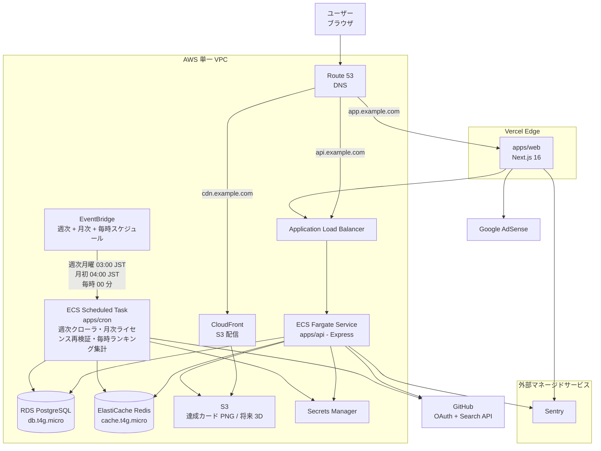

# インフラ設計

本プロダクトのインフラ全体像をまとめたドキュメント。各サービスの選定理由、責務、データフロー、コスト感を記載する。

**方針**：web は Vercel、それ以外（API / cron / DB / Redis / Storage）はすべて **AWS に寄せる**。同 VPC で完結することで、データ転送料を $0 に抑え、運用ベンダーを 1 つに集約する。

実装の詳細（Terraform 設定・モジュール構造）は [`infra/terraform/CLAUDE.md`](../infra/terraform/CLAUDE.md) を参照。

## 目次

- [全体方針](#全体方針)
- [サービス選定一覧](#サービス選定一覧)
- [全体構成図](#全体構成図)
- [各コンポーネントの責務](#各コンポーネントの責務)
  - [web (Next.js / Vercel)](#web-nextjs--vercel)
  - [api (Express / ECS Fargate)](#api-express--ecs-fargate)
  - [cron (ECS Scheduled Task)](#cron-ecs-scheduled-task)
  - [Postgres (RDS db.t4g.micro)](#postgres-rds-dbt4gmicro)
  - [Redis (ElastiCache cache.t4g.micro)](#redis-elasticache-cachet4gmicro)
  - [S3 (オブジェクトストレージ)](#s3-オブジェクトストレージ)
  - [CloudFront (CDN)](#cloudfront-cdn)
  - [Route 53 (DNS)](#route-53-dns)
- [CI/CD](#cicd)
- [Secrets 管理](#secrets-管理)
- [監視・ロギング](#監視ロギング)
- [環境（dev / staging / prod）](#環境dev--staging--prod)
- [概算コスト](#概算コスト)
- [将来検討](#将来検討)

---

## 全体方針

3 つの原則：

1. **マネージドサービスを最優先** — サーバー管理・パッチ適用のコストを払わない。
2. **AWS で完結** — 同 VPC でデータ転送料 $0、Terraform で IaC 統一、billing / IAM / 監視を 1 ベンダー化。
3. **web のみ Vercel** — Next.js 16 のネイティブ体験と PR プレビューを優先。AWS の ALB / CloudFront でホスティングする選択肢もあるが、Vercel の DX が圧倒的。

> **なぜ Aurora / Neon でなく RDS Standard か**：本プロダクトは「読み中心、書き込みは `/finish` 時のみ」のシンプルワークロード。Aurora の高速化機能・Neon のブランチ機能は不要。Standard RDS で十分。
>
> **なぜ ElastiCache / Upstash でなく ElastiCache 一択か**：API ↔ Redis は同 VPC で完結し、cross-cloud egress（$0.10/GB）が永続的にゼロ。MVP 段階の月額差 $11/月は許容範囲。

## サービス選定一覧

| レイヤ | サービス | 選定理由 |
| --- | --- | --- |
| web ホスティング | **Vercel** | Next.js 16 ネイティブ、Edge Functions、即時デプロイ、PR プレビュー |
| API ホスティング | **AWS ECS Fargate** | Terraform 親和性◎、サイドカー対応、Fargate Spot で大幅コスト削減、VPC 統合 |
| cron / バッチ | **ECS Scheduled Task** + **EventBridge** | API と同じイメージを使い回し、cron / 毎時バッチ専用タスクとして起動 |
| RDB | **AWS RDS PostgreSQL（db.t4g.micro）** | 同 VPC、Terraform 充実、月 $18 で MVP 完結、スケール時はリサイズで段階的に上げる |
| Redis | **AWS ElastiCache（cache.t4g.micro）** | 同 VPC、低レイテンシ、月 $11 で MVP 完結 |
| オブジェクトストレージ | **AWS S3** | 達成カード PNG・将来の 3D モデル等の配信用 |
| CDN | **CloudFront**（S3 用）/ **Vercel Edge**（web 用） | 静的アセット配信、低レイテンシ |
| DNS | **AWS Route 53** | A レコード・ALIAS で Vercel と ALB 両方を 1 ドメインに統合 |
| Secrets | **AWS Secrets Manager** + **Vercel Env Vars** | 各環境ごとに分離、ローテーション可能 |
| 監視 | **CloudWatch** + **Sentry** + **Vercel Analytics** | インフラ / エラー / Web Vitals |
| CI/CD | **GitHub Actions** | Vercel / ECS / Terraform 全部をワンストップで制御 |
| GitHub OAuth | **GitHub アプリ**（運営アカウント） | cron 用 PAT も同アカウントで管理 |

## 全体構成図

## 各コンポーネントの責務

### web (Next.js / Vercel)

- ホスティング：Vercel
- 役割：すべてのページ描画・ユーザー UI・OAuth コールバック処理
- 主要パス：
  - `/` トップ
  - `/sign-in` サインイン
  - `/api/auth/callback/github` Route Handler（[`docs/spec/github-auth/`](spec/github-auth/README.md)）
  - `/play/{language}` プレイ画面
  - `/ranking` ランキング
  - `/me` マイページ
- 通信：API は `api.example.com`（ALB → ECS Fargate）に CORS 設定で接続
- ENV：`NEXT_PUBLIC_API_URL`、`GITHUB_CLIENT_ID/SECRET`、`SENTRY_DSN`、Vercel Analytics token

### api (Express / ECS Fargate)

- ホスティング：ECS Fargate Service（ALB 経由）
- 役割：すべての REST API、認証、Redis セッション管理、DB アクセス
- ヘルスチェック：`GET /healthz`（ALB ターゲットグループ）
- タスクスペック：0.25 vCPU / 0.5 GB（最小構成）、Spot 50% / On-Demand 50% で混成
- スケール：min 1 task / max 10 task、CPU 70% で水平スケール
- ENV：`DATABASE_URL`（RDS）、`REDIS_URL`（ElastiCache）、`JWT_SECRET`、`S3_BUCKET`、`SENTRY_DSN`
- Secrets はタスク定義の `secrets` 経由で Secrets Manager から注入

### cron (ECS Scheduled Task)

- ホスティング：ECS Scheduled Task（`apps/cron` の単一 Docker イメージを起動）
- 起動：**EventBridge → ECS RunTask**
- 3 つのジョブ（週次クローラ / 月次ライセンス再検証 / 毎時ランキング集計）を 1 つの Image にまとめ、Task Definition の `command` で CLI エントリポイントを切り替える

#### 週次クローラ（言語ごとに独立した task）
- スケジュール：TypeScript = 毎週月曜 03:00 JST（新言語追加時は別ルールを増やす）
- エントリポイント：`pnpm crawler:run:typescript`（新言語追加時は `crawler:run:<slug>` を増やす）
- 役割：[`docs/spec/problem-pool/`](spec/problem-pool/README.md) に従って 1 言語ぶんの repo を処理。AST 抽出層が言語固有のため task を分離している（1 言語の rate limit / 障害を他言語に波及させない）
- Phase 2 ローンチ時点では TypeScript のみ。JavaScript / Go 等は同パターンで task を増やす
- ENV：`GITHUB_PAT`（運営アカウント）、`DATABASE_URL`、`SENTRY_DSN`、`CRAWLER_REPOS_PER_RUN`、`CRAWLER_MIN_STARS`、`CRAWLER_PUSHED_AFTER`

#### 毎時ランキングバッチ
- スケジュール：毎時 00 分
- エントリポイント：`pnpm batch:ranking`
- 役割：[`docs/spec/score-ranking/`](spec/score-ranking/README.md) に従って言語別トップ 1000 を集計、Redis キャッシュ更新
- ENV：`DATABASE_URL`、`REDIS_URL`、`SENTRY_DSN`

#### 月次ライセンス再検証
- スケジュール：月初 04:00 JST
- エントリポイント：`pnpm crawler:license-recheck`

### Postgres (RDS db.t4g.micro)

- 役割：永続データすべて（User / AuthAccount / play_sessions / problems / 等）
- インスタンス：db.t4g.micro（2 vCPU バースト・1 GB RAM）
- ストレージ：gp3 20 GB（必要に応じて自動拡張、上限 100 GB に設定）
- 月額：~$18（インスタンス $13 + ストレージ $5）
- バックアップ：自動、Point-in-Time Recovery 7 日
- 暗号化：AWS KMS（at-rest）
- Multi-AZ：MVP では single-AZ で開始、本番昇格時に Multi-AZ 化
- マイグレーション：Prisma Migrate（API デプロイ時に `prisma migrate deploy` を実行）

### Redis (ElastiCache cache.t4g.micro)

- 役割：揮発セッションステート、refresh token jti、ランキングキャッシュ
- インスタンス：cache.t4g.micro（2 vCPU バースト・0.5 GB RAM）
- 月額：~$11
- TTL：プレイ中ステートは 5 分、refresh token は 7 日、ランキングキャッシュは 1 時間
- 永続化：データは失われても致命的でない設計（[`docs/spec/typing-engine/`](spec/typing-engine/README.md) の Redis 障害時フォールバック参照）
- Multi-AZ：MVP では single-AZ で開始

### S3 (オブジェクトストレージ)

- 役割：達成カード PNG、将来の 3D モデル / Lottie / トレーディングカード
- バケット構成：
  - `typing-royale-assets-{env}/cards/{userId}/{cardId}.png`
  - `typing-royale-assets-{env}/avatars/{userId}.png`（GitHub アバターのキャッシュ）
- ライフサイクル：90 日以上アクセスがないオブジェクトは Glacier 移行
- 暗号化：SSE-S3 標準
- バージョニング：有効（誤削除対策）

### CloudFront (CDN)

- 役割：S3 オブジェクトの配信（達成カード等）+ 動的 SVG バッジ配信（ALB オリジン）
- ドメイン：`cdn.example.com`
- TTL：
  - S3 オブジェクト：1 年（不変なので長く）
  - SVG バッジ：5 分（短くしてスコア更新反映）

### Route 53 (DNS)

- ドメイン：`example.com`（仮）
- レコード：
  - `example.com` → Vercel ALIAS
  - `api.example.com` → ALB ALIAS
  - `cdn.example.com` → CloudFront ALIAS
  - メール用 MX レコード（Sentry / Vercel 通知用）

## CI/CD

GitHub Actions で全体を制御：

| ジョブ | トリガー | 内容 |
| --- | --- | --- |
| `pnpm-install-test` | PR / push to main | 依存解決・lint・テスト |
| `web-deploy-vercel` | push to main | Vercel CLI でデプロイ（PR は自動プレビュー） |
| `api-build-push-ecr` | push to main | Docker イメージビルド → ECR にプッシュ |
| `api-deploy-ecs` | push to main (api 変更時) | ECS Service の Task Definition を新リビジョンに更新、ローリングデプロイ |
| `cron-deploy-ecs` | push to main (cron 変更時) | ECS Scheduled Task の Task Definition を更新 |
| `terraform-plan` | PR | `infra/terraform/` の変更で `terraform plan` |
| `terraform-apply` | 手動 dispatch | 承認後に `terraform apply` |
| `prisma-migrate` | push to main (schema 変更時) | RDS に対して `prisma migrate deploy` |

AWS への認証は **GitHub OIDC** を使用（鍵レス、IAM ロール経由）。

## Secrets 管理

| Secret | 保管先 | 用途 |
| --- | --- | --- |
| `GITHUB_CLIENT_ID/SECRET`（OAuth） | Vercel Env + AWS Secrets Manager | web / api 共通 |
| `GITHUB_PAT`（運営アカウント、クローラ用） | AWS Secrets Manager | cron のみ |
| `JWT_SECRET` | AWS Secrets Manager | api / Refresh token 署名 |
| `DATABASE_URL`（RDS） | AWS Secrets Manager + Vercel Env | api / cron |
| `REDIS_URL`（ElastiCache） | AWS Secrets Manager | api / cron |
| `SENTRY_DSN` | Vercel Env + AWS Secrets Manager | web / api / cron |
| `ADSENSE_PUB_ID` | Vercel Env（クライアント公開可） | web |
| `S3_BUCKET` / `AWS_REGION` | ECS タスク環境変数 | api |

ECS タスクには **タスクロール**（実行時の権限）と **タスク実行ロール**（イメージ pull 等）を分離して付与。

## 監視・ロギング

| 用途 | サービス |
| --- | --- |
| サーバー側エラー | **Sentry**（api / cron） |
| クライアント側エラー / Web Vitals | **Sentry**（web）+ **Vercel Analytics** |
| ECS / ALB メトリクス | **CloudWatch**（CPU / Memory / 5xx / レスポンスタイム） |
| RDS メトリクス | **CloudWatch + Performance Insights**（slow query / DB connection 数） |
| ElastiCache メトリクス | **CloudWatch**（command 数 / eviction） |
| ECS ログ | **CloudWatch Logs**（stdout / stderr を自動収集） |
| AdSense 収益 | **Google AdSense + GA4 連携** |
| アラート | **Sentry → Slack**、CloudWatch → SNS → Slack |

## 環境（dev / staging / prod）

| 環境 | 用途 | 構成 |
| --- | --- | --- |
| dev | ローカル開発 | Docker Compose（既存 [`docker-compose.yaml`](../docker-compose.yaml)）で Postgres / Redis をローカル起動 |
| staging | リリース前検証 | Vercel Preview（PR プレビュー）+ AWS staging VPC（RDS / ElastiCache / ECS すべて別系統） |
| prod | 本番 | Vercel Production + AWS prod VPC |

Terraform workspace で `staging` / `prod` を切り替え。staging の RDS / ElastiCache は小さめのインスタンスでコスト最小化（db.t4g.micro / cache.t4g.micro でも OK、または使わないときは停止）。

## 概算コスト

MVP リリース直後（〜MAU 1000 名想定）の月額：

| サービス | プラン | 月額 |
| --- | --- | --- |
| Vercel | Hobby（個人）or Pro $20 | $0〜20 |
| AWS ECS Fargate（api、Spot 50% 混成） | 0.25 vCPU / 0.5 GB / 月 720 時間稼働 | ~$15 |
| AWS ECS Scheduled Task（cron） | 短時間稼働、1 タスク数分 | ~$2 |
| AWS RDS PostgreSQL（db.t4g.micro + 20GB gp3） | single-AZ | ~$18 |
| AWS ElastiCache Redis（cache.t4g.micro） | single-AZ | ~$11 |
| S3 + CloudFront | 数十 GB 想定 | $1〜3 |
| ALB | 1 つ常時起動 | ~$16 |
| Route 53 | ホストゾーン + クエリ | $1 |
| Sentry | Developer plan $26 or Team $80 | $0〜26 |
| GitHub Actions | パブリック repo 無料、プライベートは Pro 含み | $0〜4 |
| **合計** | | **$65〜120 / 月** |

成長に応じて：

- MAU 1 万：$150〜250 / 月（ECS Fargate スケール、RDS / ElastiCache はそのまま）
- MAU 10 万：$500〜1,500 / 月（RDS リサイズ、ElastiCache リサイズ、ECS タスク数増）
- AdSense 収益（[`docs/spec/adsense/`](spec/adsense/README.md) 試算）でカバー可能な水準

## 将来検討

MVP では実装しないが、運用負荷や障害対応で必要になりうる項目：

- **マルチリージョン展開**：海外ユーザー増加時に CloudFront / Vercel Edge で対応
- **RDS Multi-AZ 化**：本番昇格時、可用性向上のため必須
- **ElastiCache Multi-AZ / クラスタモード**：Redis 障害耐性向上
- **Aurora Serverless v2 への移行**：DB 負荷が db.t4g.large でも追いつかなくなったら
- **ElastiCache Serverless への移行**：cache.r7g 系でも追いつかなくなったら
- **Datadog / New Relic** などプロ向け監視への切り替え
- **AWS WAF**：DDoS / 不正アクセス対策（ALB / CloudFront にアタッチ）
- **VPC エンドポイント**：S3 / Secrets Manager への内部通信を NAT 経由から直接通信に切り替え（コスト削減）
- **GitHub Actions → CodePipeline 移行**：AWS 完結を徹底するなら（任意）
