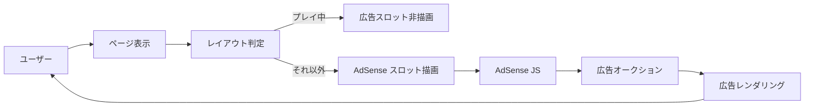

# 広告配信（Google AdSense）

唯一のマネタイズ手段。Google AdSense のディスプレイ広告のみ。課金機能やサブスクは持たない。

このドキュメントは **仕様（What）** と **設計（How）** を分けて記述する：

- **仕様**：どの画面に広告が出るか / 出ないか、収益最適化の方向性
- **設計**：CLS 対策、AdSense スクリプトの読み込み戦略、GDPR 対応、計測手段

## 関連 spec

- [`../problem-pool/README.md`](../problem-pool/README.md) — 問題コードのライセンス遵守は AdSense ポリシー（著作権侵害禁止）と直結

## 目次

- [仕様](#仕様)
  - [掲載面と非表示面](#掲載面と非表示面)
  - [広告フォーマット](#広告フォーマット)
  - [収益最適化の方針](#収益最適化の方針)
  - [将来の拡張余地](#将来の拡張余地)
- [設計](#設計)
  - [AdSense スクリプトの読み込み戦略](#adsense-スクリプトの読み込み戦略)
  - [CLS / LCP への影響対策](#cls--lcp-への影響対策)
  - [AdSense ポリシー遵守](#adsense-ポリシー遵守)
  - [GDPR / 同意管理](#gdpr--同意管理)
  - [収益測定とダッシュボード](#収益測定とダッシュボード)
  - [A/B テストの設計余地](#ab-テストの設計余地)
  - [広告ブロッカー耐性](#広告ブロッカー耐性)
- [必要な画面](#必要な画面)
- [必要な API](#必要な-api)
- [必要な DB 設計](#必要な-db-設計)
- [フロー図](#フロー図)

---

## 仕様

### 掲載面と非表示面

| 画面 / 状態 | 広告 | 理由 |
| --- | --- | --- |
| トップ画面 | ✅ | 流入直後に最初の広告露出 |
| 言語選択（神々に挑戦ボタン含む） | ✅（サイドバー / 下部） | 滞在時間がある |
| プレイ画面 | ❌ | 体験優先・集中阻害を避ける |
| ゴースト対戦中 | ❌ | 同上 |
| リザルト画面 | ✅（下部） | プレイ直後の高滞在面 |
| ランキング画面 | ✅（サイドバー） | 滞在時間が長く広告適合 |
| リプレイ画面 | ✅（再生終了後のみ） | 再生中は非表示 |
| マイページ | ✅（サイドバー） | 自身のスコア確認時 |
| Hall of Fame | ✅ | 滞在時間長い |

### 広告フォーマット

- **AdSense 自動広告** をベースに、主要面は **手動配置** で品質を担保。
- レスポンシブ広告ユニット（サイドバー / 下部 / インフィード）。
- インタースティシャル広告は **使用しない**（体験を損なうため）。

### 収益最適化の方針

- **エンジニア向け高単価広告主**（B2B SaaS / 採用 / クラウドベンダー）が AdSense オークションで入りやすい面構成を意識。
- ページの主要コンテンツ（コード / ランキング表 / リプレイ）を **広告で押し下げない**。
- ファーストビューに広告を 1 つ以上配置することで RPM を確保しつつ、コンテンツの認識を阻害しない位置取り。

### 将来の拡張余地

- エンジニア向け SaaS の **スポンサー枠**
- 技術書アフィリエイト
- Hall of Fame スポンサードリンク

MVP では含まず、AdSense 単一で運用。

---

## 設計

### AdSense スクリプトの読み込み戦略

- **プレイ画面ルートでは AdSense スクリプトをロードしない**（パフォーマンス重視・体験優先）。
- 他のページでは AdSense の自動広告 + 手動配置スロットを併用。
- レイアウトコンポーネントで「現在のルートはプレイ中か」を判定し、広告スロット自体を描画しないよう制御。

### CLS / LCP への影響対策

- 広告スロットは **固定サイズで予約**（Layout Shift を抑制）。
- Lighthouse 指標を CI / 本番 RUM で監視。
- レスポンシブスロットも min-height を予約してガタつきを防ぐ。

### AdSense ポリシー遵守

- **「お客様自身による広告クリック禁止」を社内徹底**。
- 著作権侵害コンテンツの掲載禁止 → [`../problem-pool/README.md` 「ライセンス管理」](../problem-pool/README.md#ライセンス管理) と直結。
- 不正クリック検知に引っかかると配信停止リスクがあるため、運用面でも教育を徹底。

### GDPR / 同意管理

- EU からのアクセス対応として Google の **Consent Mode v2** を導入。
- 同意状態に応じて広告のパーソナライズ動作を切り替える。

### 収益測定とダッシュボード

- 日次レポートを **Google Analytics 4 + AdSense 連携** で取得。
- RPM / CTR をダッシュボード化（運営の意思決定指標）。
- `POST /api/telemetry/ad-impression` で自前計測も可能（任意、AdSense 側計測で代替可）。

### A/B テストの設計余地

- MVP では掲載面・サイズは固定。
- 将来的に A/B テストできる仕組み（広告スロットを設定で切替可能にする）を用意する余地は残す。

### 広告ブロッカー耐性

- MVP では特別対策せず、**サイト自体は広告なしでも機能する** ように設計（体験は維持）。
- 「広告を有効にしてください」のような訴求も MVP では行わない。

---

## 必要な画面

広告は既存画面のレイアウト内に組み込むため、専用画面はなし。レイアウトコンポーネントに「広告スロット」プレースホルダを用意する。

| 画面 | 広告スロット |
| --- | --- |
| トップ | ヘッダー下 / フッター上 |
| 言語選択 | サイドバー |
| リザルト | スコア下部 |
| ランキング | サイドバー（テーブル右） |
| マイページ | サイドバー |
| リプレイ（再生終了後） | プレイヤー下 |
| Hall of Fame | サイドバー |

## 必要な API

専用 API は不要。AdSense のクライアント側スクリプトを各ページに読み込むのみ。

ただし、以下のメタ情報をフィードバック分析のために保存する。

| メソッド | パス | 説明 |
| --- | --- | --- |
| POST | `/api/telemetry/ad-impression` | 広告ユニットの表示計測（任意、AdSense 側計測で代替可） |

## 必要な DB 設計

通常運用では DB は不要。AdSense は Google 側で計測。

将来的にスポンサー枠を導入する場合は別途設計（[`../rewards/README.md`](../rewards/README.md) と同じく `rewards` 拡張または専用テーブル）。

## フロー図

