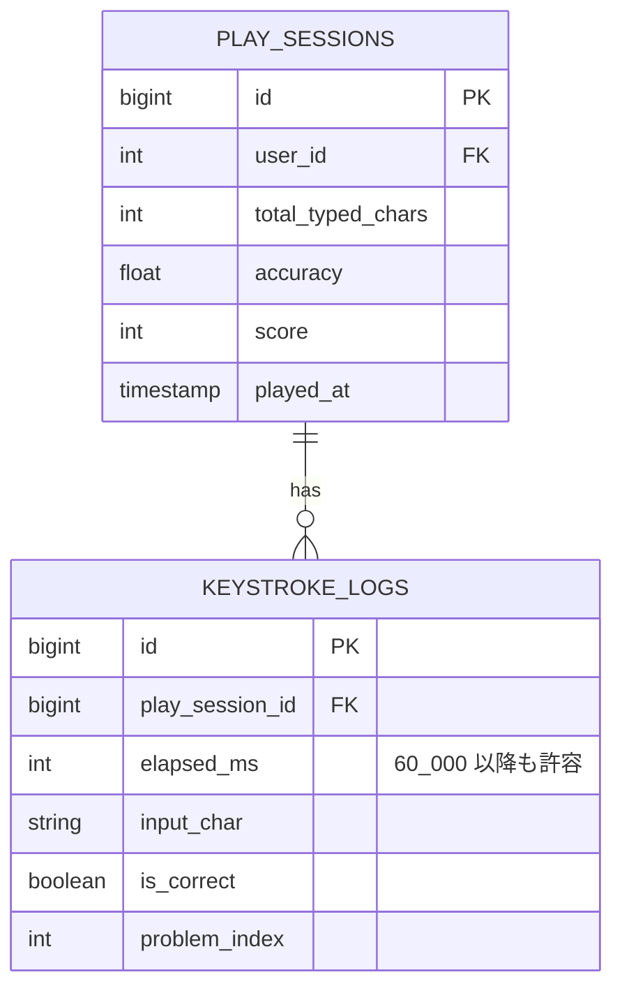
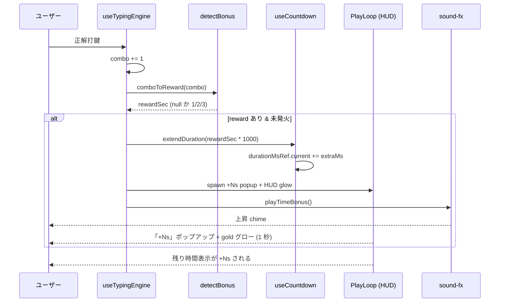
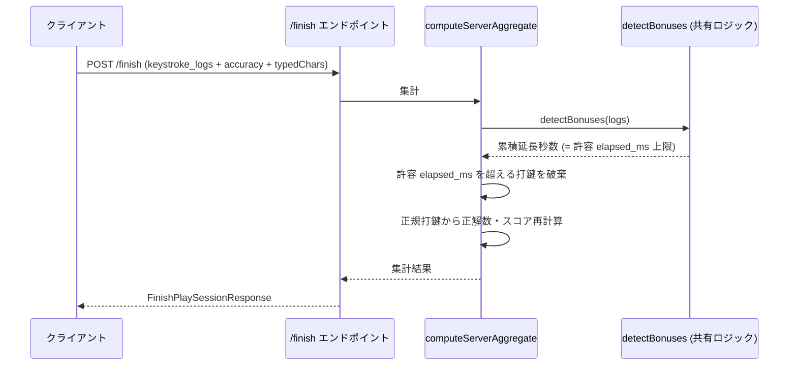

# コンボ時間ボーナス（combo-time-bonus）

タイピング中の正解打鍵 combo が一定数に達するごとに **プレイ時間を秒単位で延長** する仕組み。combo を切らさず伸ばすほど打鍵時間が増え、スコアにも反映されるため上級者と初級者のスコア差が広がる。

UI 上は HUD「残り時間」の左にポップアップが飛び出し、HUD 自体が一瞬光り、専用効果音が鳴って **動的に時間が延長された** ことを明確にユーザーへ伝える。

このドキュメントは **仕様（What）** と **設計（How）** を分けて記述する：

- **仕様**：ユーザーから見える挙動・ルール・データの意味
- **設計**：実装にあたっての技術的な選択と制約

## 関連 spec

- [`../typing-engine/README.md`](../typing-engine/README.md) — 120 秒タイマー / combo / `keystrokeLog` データ構造の親仕様。本機能は典型的なタイマー仕様の拡張
- [`../ghost-battle/README.md`](../ghost-battle/README.md) — 神々モードの ghost 再生。**`keystrokeLog` 構造の正本** はこちら
- [`../replay-viewer/README.md`](../replay-viewer/README.md) — リプレイ再生時にも `+Ns` 演出を再現する
- [`../play-audio/README.md`](../play-audio/README.md) — `playTimeBonus` 効果音を追加する先

## 目次

- [仕様](#仕様)
  - [ボーナス発生条件と加算量](#ボーナス発生条件と加算量)
  - [combo の維持・喪失と時間ボーナスの関係](#combo-の維持喪失と時間ボーナスの関係)
  - [マイルストーンは到達するたびに発火（毎回加算・上限なし）](#マイルストーンは到達するたびに発火毎回加算上限なし)
  - [HUD 演出](#hud-演出)
  - [効果音](#効果音)
  - [スコアへの影響](#スコアへの影響)
  - [神々モード / リプレイでの再現](#神々モード--リプレイでの再現)
- [設計](#設計)
  - [マイルストーン判定の決定論性](#マイルストーン判定の決定論性)
  - [タイマー実装の動的延長](#タイマー実装の動的延長)
  - [HUD 演出の実装](#hud-演出の実装)
  - [効果音の生成](#効果音の生成)
  - [サーバー側の不正検証](#サーバー側の不正検証)
  - [`keystroke_logs` 受け入れ elapsed_ms の上限](#keystroke_logs-受け入れ-elapsed_ms-の上限)
  - [神々モードでの ghost 同期](#神々モードでの-ghost-同期)
  - [リプレイ画面での演出再現](#リプレイ画面での演出再現)
- [必要な画面](#必要な画面)
- [必要な API](#必要な-api)
- [必要な DB 設計](#必要な-db-設計)
- [フロー図](#フロー図)

---

## 仕様

### ボーナス発生条件と加算量

正解打鍵で combo が **以下のマイルストーン** に達した瞬間に、残りプレイ時間を加算する。

| combo マイルストーン | 加算秒数 |
|---:|---:|
| 30 | **+1 秒** |
| 60 | **+2 秒** |
| 90 以降は **30 combo ごと**<br/>(90, 120, 150, 180, ...) | 各 **+3 秒** |

- 1 回の加算は **最大 +3 秒**（+5s や +10s のような派手なジャンプは無し）
- 累積上限なし。理論的には combo を切らさず維持し続ければ無限に延長される
- combo 30 未満ではボーナスは発生しない

#### 累積延長の試算

| combo 維持 | 累積延長 | 合計プレイ時間 |
|---:|---:|---:|
| 30  | +1s | 121s |
| 60  | +3s | 123s |
| 90  | +6s | 126s |
| 120 | +9s | 129s |
| 150 | +12s | 132s |
| 180 | +15s | 135s |
| 240 | +21s | 141s |

#### 「終わらない」可能性について

30 combo 区間 (combo 90 以降) で **+3 秒**もらえるので、30 combo を 3 秒未満で打てるプレイヤー (= **10 文字/秒 以上**) は理論上タイマーが減らず無限ループの可能性がある。

- 一般的な上級者: 5〜7 文字/秒 → 終わる
- 超上級者: 8〜9 文字/秒 → ギリギリ終わる
- 世界記録レベル: 15+ 文字/秒 → 終わらない可能性

MVP 仕様としては「人間がほぼ全員終わる」前提で累積上限なしを採用。世界記録レベルの極端なケースは将来 deferred 課題として扱う。

### combo の維持・喪失と時間ボーナスの関係

- 一度もらった時間ボーナスは **永続**。後でミスして combo が 0 に戻ってもプレイ時間は減らない
- combo 0 に戻った後、再度マイルストーンに達すれば **再び発火する**（次項参照）

### マイルストーンは到達するたびに発火（毎回加算・上限なし）

各マイルストーン (combo 30 / 60 / 90 / 120 / ...) は、**到達するたびに発火する**。ミスで combo が途切れても、再びマイルストーンに達すれば再び加算される（**何度でも取得可能・累積上限なし**）。シンプルで分かりやすいルールを優先した設計。

例：
- combo 29 → 30 で「+1 秒」発火
- combo 30 → 5 にリセット → 再び combo 30 まで戻る → **また「+1 秒」発火**
- combo 60 で「+2 秒」、combo 90 / 120 / 150 ... で各「+3 秒」発火

> **不正面の影響は限定的**：時間が伸びても **typedChars 上限（1500 文字）でスコアは頭打ち**のため、ランキングのスコア天井は変わらない。サーバーは `detectBonuses` を再生して許容 elapsed_ms を算出するので、フロント・サーバーで同じルールを保てば検証も成立する（[不正対策](#不正対策) 参照）。理論上は 10 文字/秒以上を維持し続ける上級者で時間が大きく伸びうるが、スコアは 1500 で止まる。

### HUD 演出

時間ボーナスが発火した瞬間：

1. HUD「残り時間」の **左** にポップアップで `+1s` / `+2s` / `+3s` が表示される
2. ポップアップは **約 1 秒で fade out**（フェード + 上向きフロート）
3. 同時に「残り時間」HUD セル自体が **一瞬 gold グロー**（0.5 秒程度）

ポップアップの色は加算量に応じて変えても良い：

- `+1s`: 蒼
- `+2s`: 翠
- `+3s`: 金

### 効果音

専用 SE `playTimeBonus` を新規追加：

- 短い **上昇 chime**（例: G5 → C6 → E6 の arpeggio）
- 既存の `playTierUp`（tier アップ時の sweep + chord）とは別音色にして、ユーザーが時間延長と tier アップを聞き分けられるようにする
- `playKeyHit` の上に重なるが、長さは 0.3 秒程度で次の打鍵を邪魔しない

### スコアへの影響

- スコア計算式自体は **無変更**（`correct_keystrokes * accuracy`）
- 時間が延長された分、長く打鍵できるので結果スコアが上がる
- ランキング・グレード・殿堂入りの判定はすべて既存ロジックを通る

### 神々モード / リプレイでの再現

- 神々モード（`/play?mode=challenge_gods`）：
  - 神（ghost）の元セッションが時間ボーナス込みで完走している場合、自分も **同じ秒数まで戦える**（120 秒固定ではなく、ghost の最終 elapsed_ms に同期）
  - ghost も combo ボーナス発火タイミングで HUD 演出が再現される
- リプレイ画面（`/replay/[playSessionId]`）：
  - 再生時に combo 到達タイミングを検出して `+Ns` ポップアップを再現
  - 残り時間表示も延長後のセッション全長を使う

---

## 設計

### マイルストーン判定の決定論性

`keystroke_logs` には `elapsed_ms` / `is_correct` が 1 打鍵ごとに記録されている。これを **時系列に再生** すれば combo の推移は完全に再現可能で、各マイルストーン到達時刻も決定論的に算出できる。

- DB スキーマ変更は **不要**
- クライアント（プレイ中）でリアルタイム判定し、同じロジックをサーバー（`/finish` 受信時）にも実装することで cheat 検証も成立

判定アルゴリズム（擬似コード）：

```ts
type BonusEvent = { elapsedMs: number; addedSec: number; milestoneCombo: number }

const detectBonuses = (logs: KeystrokeLogs): BonusEvent[] => {
  const events: BonusEvent[] = []
  let combo = 0
  for (const e of logs) {
    if (e.is_correct) {
      combo += 1
      const reward = comboToReward(combo)
      // マイルストーンに達するたびに発火（再到達でも再加算・上限なし）
      if (reward !== null) {
        events.push({ addedSec: reward, elapsedMs: e.elapsed_ms, milestoneCombo: combo })
      }
    } else {
      combo = 0
    }
  }
  return events
}

const comboToReward = (combo: number): number | null => {
  if (combo === 30) return 1
  if (combo === 60) return 2
  if (combo >= 90 && combo % 30 === 0) return 3
  return null
}
```

このロジックは **`apps/web/src/libs/combo-time-bonus.ts` に純粋関数として配置** し、フロント（プレイ画面 / リプレイ画面）とサーバー（`computeServerAggregate`）の両方から共有する形が望ましい。ただし TypeScript の場合は別 package 化せずとも、`apps/api/src/lib/` と `apps/web/src/libs/` に同じロジックを置き、ユニットテストで挙動一致を確認する形でも MVP では十分。

### タイマー実装の動的延長

現状の `useCountdown` は `durationMs` を引数で受け取り、`startAtRef.current + durationMs` を残り時間計算に使っている。本機能では `durationMs` を **mutable な ref** に変更し、外部から `extendDuration(ms: number)` で延長できるようにする。

```ts
// use-countdown.ts (改)
export function useCountdown({ initialDurationMs, onTimeUp, ... }) {
  const durationMsRef = useRef(initialDurationMs)
  const remainingMs = ...computeFromRef
  const extendDuration = (extraMs: number) => {
    durationMsRef.current += extraMs
  }
  return { remainingMs, startAtRef, extendDuration }
}
```

`useTypingEngine` 側で combo マイルストーン検知 → `extendDuration(rewardSec * 1000)` を呼ぶ。

### HUD 演出の実装

HUD は `play-loop.tsx` 内の `<div className="play-hud">` 構造。「残り時間」cell の左隣に **絶対配置でポップアップを spawn** する。

```tsx
{bonusPopups.map((b) => (
  <span
    key={b.id}
    className={`time-bonus-popup time-bonus-popup-${b.addedSec}s`}
    aria-hidden="true"
  >
    +{b.addedSec}s
  </span>
))}
```

- `bonusPopups` は `useState<BonusPopup[]>([])` で管理
- `setTimeout(1000)` で popup を配列から削除して fade out → unmount
- HUD グローは `.hud-cell` に `.time-bonus-flash` クラスを 0.5 秒間付与（CSS keyframe で gold glow）

### 効果音の生成

`apps/web/src/libs/sound-fx.ts` に `playTimeBonus` を追加。combo banner の `playTierUp` を参考に：

```ts
export const playTimeBonus = () => {
  const ctx = getContext()
  const master = getMaster()
  if (!ctx || !master) return
  const now = ctx.currentTime
  /** G5 → C6 → E6 の三和音 arpeggio (0.08s 間隔) */
  const notes = [783.99, 1046.5, 1318.51]
  notes.forEach((freq, i) => {
    const t = now + i * 0.08
    const osc = ctx.createOscillator()
    const gain = ctx.createGain()
    osc.type = "triangle"
    osc.frequency.setValueAtTime(freq, t)
    gain.gain.setValueAtTime(0, t)
    gain.gain.linearRampToValueAtTime(0.06, t + 0.01)
    gain.gain.exponentialRampToValueAtTime(0.0001, t + 0.18)
    osc.connect(gain).connect(master)
    osc.start(t)
    osc.stop(t + 0.2)
  })
}
```

### サーバー側の不正検証

`/finish` 受信時、サーバーは `keystroke_logs` を時系列に再生して以下を再計算する：

1. クライアント自称の combo マイルストーン発火タイミング
2. 各マイルストーンでの累積延長秒数
3. 「許容 elapsed_ms 上限」= `120_000 + 累積延長 * 1000`

クライアントから送られた `keystroke_logs` のうち、計算した許容 elapsed_ms を **超える打鍵は不正としてサーバー側で破棄**（= スコアにカウントされない）。これにより：

- 「クライアントが勝手にタイマーを 300 秒に延長してたくさん打った」ような明らかな cheat を弾く
- 真っ当に combo を伸ばして時間延長した正規プレイは通る

実装は `computeServerAggregate` (`apps/api/src/service/play-session-service.ts`) の内部で行う。

### `keystroke_logs` 受け入れ elapsed_ms の上限

`packages/schema/src/api-schema/play-session.ts` の `keystrokeEntrySchema` に `elapsed_ms.max(...)` 制約があれば緩和する：

- 旧: `elapsed_ms.max(120_000)` 相当の制約があれば撤去 or 緩和
- 新: 上限なし（サーバー側でロジックで弾く）。ただし極端な値（例: 100 万 ms）は別ルートで block

### 神々モードでの ghost 同期

- ghost の `keystroke_logs` には combo ボーナス込みの elapsed_ms（最大値）が記録されている
- 自分のセッション開始時、ghost log の **最終 elapsed_ms** を計算して `initialDurationMs` を `max(120_000, ghostLastMs)` のように調整する案もあるが、本機能では：
  - 自分も同じ combo ボーナスロジックで延長されるので、特別な同期は不要
  - ghost のプログレスバーは ghost log の elapsed_ms をそのまま追従
  - 自分のセッション終了は「自分の延長後のタイマー」で決まる
- 結果として、上手いプレイ同士が同程度の時間を戦える

### リプレイ画面での演出再現

リプレイ画面 (`apps/web/src/app/replay/[playSessionId]`) は `keystroke_logs` を時系列再生している。再生時：

- 同じ `detectBonuses` ロジックを使って `+Ns` ポップアップを再現
- 「残り時間」表示は log の最終 elapsed_ms を「セッション全長」として扱う
- 旧仕様（時間ボーナス導入前）のリプレイは log の最終 elapsed_ms <= 120_000 なので、`detectBonuses` の結果が空配列になり、ポップアップが出ないだけで自然に動く

---

## 必要な画面

| 画面 | 概要 |
| --- | --- |
| プレイ画面 (`/play/[sessionId]`) | HUD「残り時間」の左にポップアップ + gold グロー演出を追加 |
| リプレイ画面 (`/replay/[playSessionId]`) | 同じポップアップ演出を log から再現 |

---

## 必要な API

新規エンドポイントは **無し**。既存の以下を更新：

| メソッド | パス | 説明 |
| --- | --- | --- |
| POST | `/api/play-sessions/[id]/finish` | サーバー側の `computeServerAggregate` で combo ボーナス考慮の elapsed_ms 検証を追加 |
| POST | `/api/play-sessions/guest/finish` | 同上（ゲスト用） |

スキーマ変更：

- `packages/schema/src/api-schema/play-session.ts`
  - `keystrokeEntrySchema.elapsed_ms` の上限を緩和（または撤去）

---

## 必要な DB 設計

**DB スキーマ変更なし**。`keystroke_logs` は既存のまま（`elapsed_ms` / `input_char` / `is_correct` / `problem_index`）。combo ボーナスは log から決定論的に再計算するので追加列は不要。



---

## フロー図

### プレイ中の時間ボーナス発火



### /finish のサーバー側検証



---

## 実装の分割（step ファイル）

実装の詳細は以下の step ファイルに分割：

- [`step1-shared-detect-bonuses.md`](./step1-shared-detect-bonuses.md) — 共有判定ロジック (`detectBonuses` 純粋関数 + ユニットテスト)
- [`step2-api-finish-validation.md`](./step2-api-finish-validation.md) — `/finish` でのサーバー側不正検証
- [`step3-web-engine-and-countdown.md`](./step3-web-engine-and-countdown.md) — プレイ画面のエンジン拡張・タイマー動的延長・HUD 演出・効果音
- [`step4-web-replay-bonus-popup.md`](./step4-web-replay-bonus-popup.md) — リプレイ画面の `+Ns` 演出再現

## PR 分割（推奨）

| PR | スコープ | 含まれる step |
|---|---|---|
| PR ① | 共有ロジック + サーバー側検証 | step1 / step2 |
| PR ② | プレイ画面の演出 + 時間延長 | step3 |
| PR ③ | リプレイ画面の演出再現 | step4 |
| PR ④ | 神々モード対応（ghost との時間同期検証） | （step3 で自然に動く想定なので最初は PR ② に含める。違和感があれば別 PR で調整） |
