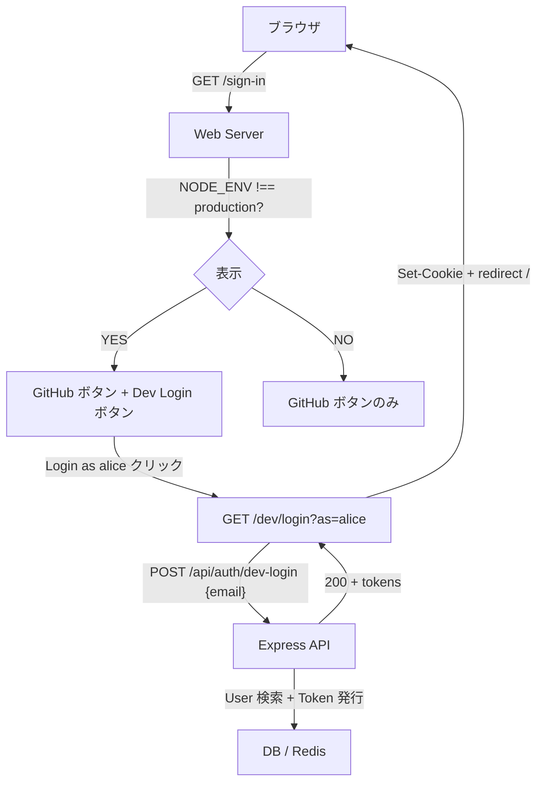
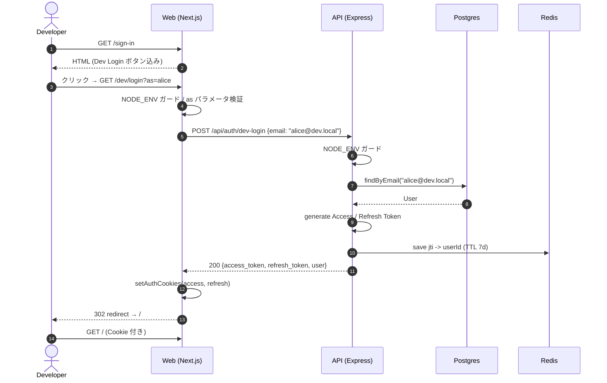

# dev-login

開発環境専用ログイン機能。`production` 以外の環境で、GitHub OAuth を経由せず seed 済みの dev ユーザー（alice / bob）として 1 クリック / URL 直叩きでログインできるようにする。

## 目次

- [背景](#背景)
- [全体像](#全体像)
- [仕様](#仕様)
- [必要な API](#必要な-api)
- [必要な画面](#必要な画面)
- [必要な DB 設計](#必要な-db-設計)
- [フロー図](#フロー図)
- [シーケンス図](#シーケンス図)
- [多重ガード](#多重ガード)
- [注意事項](#注意事項)

## 背景

ログイン必須のアプリでは、毎回 GitHub OAuth フローを通すと動作確認のコストが高い（リダイレクトの往復・別アカウントへの切り替え・Cookie のクリア等）。本プロジェクトでは sns-battle プロジェクトと同様、`production` 以外でのみ動く dev-login を用意して、確認したい画面に素早く到達できるようにする。

E2E テストでも `/dev/login?as=alice` を踏むだけで認証済み状態にできるので、setup の負担が下がる。

## 全体像

- API: `POST /api/auth/dev-login` で email を受け取り、GitHub OAuth と同形式の Access/Refresh Token を発行する。
- Web: `GET /dev/login?as=alice|bob` Route Handler が API を叩いて Cookie を保存し `/` にリダイレクト。
- Web: sign-in 画面に「Login as alice / bob」ボタンを表示（`NODE_ENV !== "production"` のみ）。
- DB: `pnpm --filter api db:seed` で `alice@dev.local` / `bob@dev.local` を User + AuthAccount(provider: "dev") として upsert。
- ガード: `NODE_ENV === "production"` の場合、API ルート登録・Web Route Handler・proxy.ts PUBLIC_PATHS のすべてで dev-login を無効化する。

## 仕様

- dev-login はあくまで開発支援機能であり、`NODE_ENV === "production"` では完全に無効化される
- 既存の GitHub OAuth と同じ JWT / Cookie / refresh フローに乗るため、`/dev/login` 経由でログイン後の挙動は通常ログインと区別なし
- dev ユーザーは seed で投入される。seed 未実行の場合は API が 404 を返し、Web は「seed を実行してください」と案内する
- 認証以外の機能（メモ / 設定など）の動作確認はすべて dev-login 経由で完結する

## 必要な API

| Method | Path | 認証 | 説明 |
|---|---|---|---|
| POST | `/api/auth/dev-login` | 不要（PUBLIC_PATHS、production 無効） | email を受け取り Access/Refresh Token を発行 |

リクエスト/レスポンススキーマは `packages/schema/src/api-schema/auth.ts` に `authDevLoginRequestSchema` / `authDevLoginResponseSchema` として定義。

## 必要な画面

| 画面 | 役割 |
|---|---|
| `/sign-in` | 既存の GitHub サインインに加えて、`NODE_ENV !== "production"` のときだけ「Login as alice / Login as bob」ボタンを表示する |
| `/dev/login?as=alice\|bob` | UI を持たない Route Handler。API に dev-login リクエストを投げて Cookie 保存 → `/` にリダイレクト |

## 必要な DB 設計

新規テーブルなし。既存の `users` / `auth_accounts` を使う。seed で以下を upsert する。

| テーブル | データ |
|---|---|
| `users` | `alice@dev.local` (githubUsername: "alice") / `bob@dev.local` (githubUsername: "bob") |
| `auth_accounts` | `provider: "dev"` / `providerAccountId: <email>` で各 user に紐づけ |

`provider: "dev"` を使うことで GitHub アカウントと衝突しない形で dev ユーザーを識別できる。

## フロー図

## シーケンス図

## 多重ガード

| 層 | ファイル | チェック | 効果 |
|---|---|---|---|
| API DI | `apps/api/src/index.ts` | `NODE_ENV !== "production"` のときだけ Controller をインスタンス化 | production ではコントローラ自体が無い |
| API Router | `apps/api/src/routes/auth-router.ts` | `controllers.devLogin` が undefined ならルート登録しない | production ではルート自体が無い |
| API Controller | `apps/api/src/controller/auth/dev-login.ts` | `NODE_ENV === "production"` で 404 | 何かの拍子に登録されても 404 |
| API PUBLIC_PATHS | `apps/api/src/const/index.ts` | `NODE_ENV !== "production"` のときだけ追加 | production では認証必須扱い |
| Web Route Handler | `apps/web/src/app/dev/login/route.ts` | `NODE_ENV === "production"` で 404 | production では Web 側でも 404 |
| Web proxy | `apps/web/src/proxy.ts` | `NODE_ENV !== "production"` のときだけ PUBLIC_PATHS に追加 | production では `/sign-in` にリダイレクト |
| Web UI | `apps/web/src/app/sign-in/page.tsx` | `NODE_ENV !== "production"` のときだけボタン表示 | production ではボタンが消える |
| Seed | `packages/db/prisma/seed.ts` | `NODE_ENV === "production"` でスキップ | production DB に dev ユーザーを作らない |

## 注意事項

- **本番ガードを 1 箇所に集約しない**。多層防御の観点から、1 箇所修正したつもりで漏れても他の層で止まるようにする。
- **dev ユーザーの password / シークレットを設定しない**。GitHub OAuth 経由ではないため、`AuthAccount.provider = "dev"` のみで識別する。
- **`/dev/login` を E2E テストの setup に使うときは `pnpm --filter api db:seed` が事前に走っていることを前提にする**。CI では `pnpm --filter api db:migrate:deploy && pnpm --filter api db:seed` の順で実行する。
- **dev ユーザーは絶対に本番マイグレーションに含めない**。`NODE_ENV === "production"` の seed スキップで担保している。
