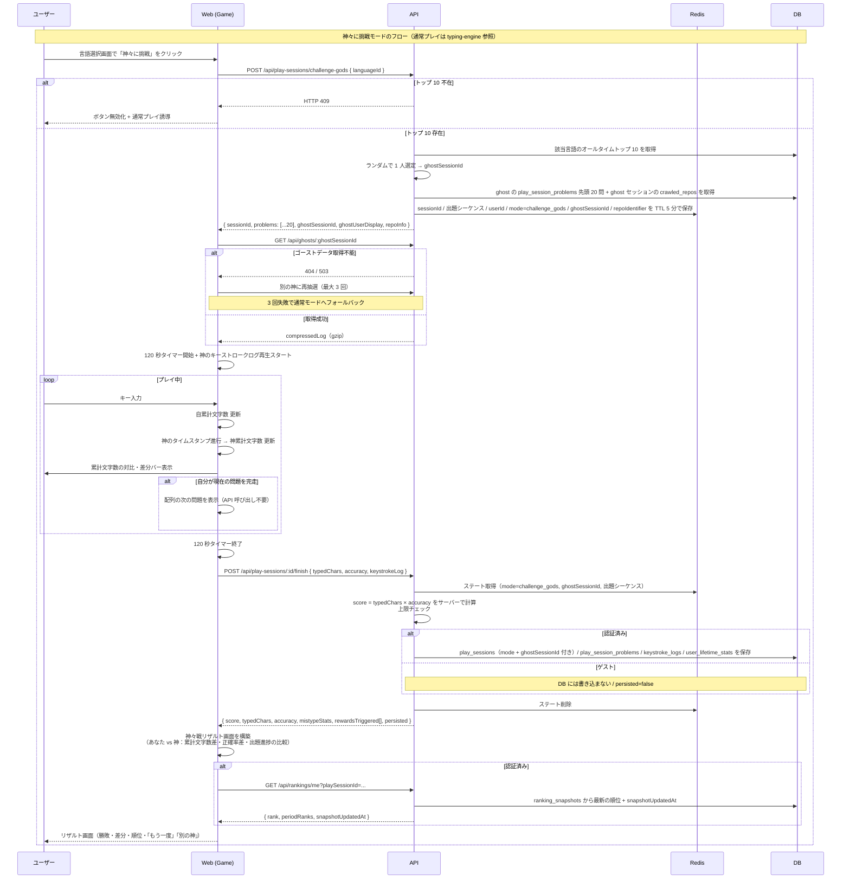

# ゴースト併走（「神々に挑戦」モード）

言語選択画面の **「神々に挑戦」ボタン** を押すと起動するモード。該当言語のオールタイムトップ 10 からランダムに 1 人を選び、その人の 120 秒セッションの問題シーケンスを引き継ぎつつ、ゴーストとして併走する。

> **設計前提：動画ファイルは存在しない**。神々の「過去のプレイ」を見せる仕組みは、事前撮影された動画ではなく **キーストロークログの再生** で実現される。サーバーから降ってくるのは数十 KB の JSON（タイムスタンプ + 入力文字）であり、ブラウザがそれを `requestAnimationFrame` で再生して打鍵進行を可視化する。詳細は [`../replay-viewer/README.md`](../replay-viewer/README.md) の「設計方針：動画ファイルなし・キーストロークログ再生」を参照。

このドキュメントは **仕様（What）** と **設計（How）** を分けて記述する：

- **仕様**：起動条件、神の選定ルール、出題引き継ぎ、ゴースト画面の見た目
- **設計**：キーストロークログの構造・サイズ・配信、フェイルセーフ、キャッシュ戦略

## 関連 spec

- [`../typing-engine/README.md`](../typing-engine/README.md) — 通常プレイの基礎フロー（神々モードも `/finish` 以降は共通）
- [`../replay-viewer/README.md`](../replay-viewer/README.md) — 同じキーストロークログを別 UI で再生する機能

## 目次

- [仕様](#仕様)
  - [起動と相手選定](#起動と相手選定)
  - [出題シーケンスと repo の引き継ぎ](#出題シーケンスと-repo-の引き継ぎ)
  - [プレイ中に記録されるデータ（キーストロークログ）](#プレイ中に記録されるデータキーストロークログ)
  - [ゴーストの可視化](#ゴーストの可視化)
- [設計](#設計)
  - [キーストロークログのデータ構造](#キーストロークログのデータ構造)
  - [キーストロークログのサイズ感](#キーストロークログのサイズ感)
  - [保存・配信形式](#保存配信形式)
  - [ゴーストデータ欠落時のフェイルセーフ](#ゴーストデータ欠落時のフェイルセーフ)
  - [タイムスタンプ精度の扱い](#タイムスタンプ精度の扱い)
  - [公平性の保証](#公平性の保証)
  - [拡張余地](#拡張余地)
- [必要な画面](#必要な画面)
- [必要な API](#必要な-api)
- [必要な DB 設計](#必要な-db-設計)
- [フロー図](#フロー図)

---

## 仕様

### 起動と相手選定

- ユーザーが **言語選択画面の「神々に挑戦」ボタン** を押した瞬間のみ起動する。
- ユーザーは相手を選ばない。**サーバーが該当言語のオールタイムトップ 10 からランダムに 1 人** を選定する。
- 同じ「神々」と続けて当たることもある（完全ランダム）。
- トップ 10 がまだ存在しない / 全員のキーストロークログが取得不能な場合は **ボタンを無効化** し、通常モードに誘導する。
- ゴーストは `publicRanking=true` のユーザーのみが候補。`publicRanking=false` のユーザーはそもそもトップ 10 に入らないため、神々候補にも含まれない。
- ゴーストの表示名には **グレード名を併記** する（例：「Principal Engineer kenta」）。神々はオールタイムトップ 10 に入る実力者なので、ほぼ Staff Engineer 以上の表示になる想定。

### 出題シーケンスと repo の引き継ぎ

「神々に挑戦」では、**選ばれたゴーストの 120 秒セッションで出題された問題シーケンス先頭 20 問** と、その **セッションで使われた repo の `repoInfo`** をプレイヤーにも一括で渡す。

- ゴーストが問題 A → B → C の順で打ったなら、プレイヤーにも A → B → C の順で出題される。
- ゴーストが React の関数で挑んでいたなら、プレイヤーも自動的に React 縛りになる（[`../typing-engine/README.md` 「出題内容」](../typing-engine/README.md#出題内容問題プールから受け取るもの) 参照）。
- `/challenge-gods` のレスポンスに同梱されるため、プレイ中の追加 API 呼び出しは不要。
- プレイヤーが A を打ち終わって B へ進む前に 120 秒経過したら、その時点で終了。
- ゴーストの出題シーケンスが 20 問未満の場合は、その人が実際に打った全問題を渡す。
- リザルト画面では「神は {repo name} のコードで挑んでいました」と表示できる。

これにより「同じ問題セットを同じ時間で打つ」公平な対戦が成立し、かつ「神の選んだフィールドで戦う」体験になる。

### プレイ中に記録されるデータ（キーストロークログ）

すべてのプレイ（通常モード含む）で、プレイ中のキー入力イベントを時系列配列として記録する。**ゴースト併走・リプレイ閲覧・誤打鍵集計（ニガテ文字）・将来の不正対策** で共通利用される、横断的なデータ構造。

- 通常モードでも記録する理由：将来 **そのプレイヤー自身がトップ 10 に入ったとき** に「神々に挑戦」モードのゴースト候補にできるため。
- 記録される内容：各キーイベントの「経過時刻 / 何問目か / 入力文字 / 正誤」。
- ログの保存期間はプレイ後 365 日。**オールタイムトップ 10 入賞プレイは永続保存**（神々候補のため必須）。

データ構造の正式定義は [設計：キーストロークログのデータ構造](#キーストロークログのデータ構造) を参照。

### ゴーストの可視化

両者は別々の問題に進んでいる可能性があるため、「同じ画面の薄いカーソル」では描画しない。代わりに **横並びの累計文字数比較** を中心に据える。

- **ヘッダー領域**：
  - 残り時間（120 秒カウントダウン）
  - **あなた：234 文字** ／ **神：287 文字**（リアルタイム更新）
  - 差分バー（神基準 +/-）
- **メインエリア**：プレイヤー自身が現在打っている関数のみ表示。
- **サイドエリア**：神の現在の状態（「問題 3 / 12 行目を打鍵中」程度のサマリ）
- 120 秒終了時：勝敗・累計文字数差・正確率差・出題進捗の比較を表示。

---

## 設計

### キーストロークログのデータ構造

```ts
type KeystrokeEntry = {
  elapsedMs:    number   // セッション開始からの経過ミリ秒（performance.now() 起点）
  problemIndex: number   // 何問目を打っていたか（0〜19、20 問同梱の問題インデックス = orderIndex）
  inputChar:    string   // 実際に入力された文字（または特殊キー名："Enter" / "Backspace" 等）
  isCorrect:    boolean  // その時点で期待されていた文字と一致したか
}

type KeystrokeLogs = KeystrokeEntry[]
```

具体例（`"hello"` を打って 1 回ミスタイプ）：

```json
[
  { "elapsedMs": 145.2, "problemIndex": 0, "inputChar": "h", "isCorrect": true  },
  { "elapsedMs": 312.8, "problemIndex": 0, "inputChar": "e", "isCorrect": true  },
  { "elapsedMs": 478.1, "problemIndex": 0, "inputChar": "l", "isCorrect": true  },
  { "elapsedMs": 645.6, "problemIndex": 0, "inputChar": "k", "isCorrect": false },
  { "elapsedMs": 812.3, "problemIndex": 0, "inputChar": "l", "isCorrect": true  },
  { "elapsedMs": 978.5, "problemIndex": 0, "inputChar": "o", "isCorrect": true  }
]
```

問題 0 が完走したら、次のエントリの `problemIndex` が 1 に切り替わる。

このデータが効いてくる場所：

| 利用箇所 | 用途 |
| --- | --- |
| ゴースト併走（本機能） | 神の log を取得 → `elapsedMs` の経過時刻に合わせて再生 |
| リプレイ閲覧（[`../replay-viewer/README.md`](../replay-viewer/README.md)） | シーク・倍速付きの UI で再生 |
| 誤打鍵集計（[`../typing-engine/README.md` 「誤打鍵集計（ニガテ文字）」](../typing-engine/README.md#誤打鍵集計ニガテ文字)） | `isCorrect: false` のエントリから「期待されていた正解文字」をカウント → `mistypeStats` 生成 |
| MVP 後の不正対策（[`../typing-engine/deferred-competitive-integrity.md`](../typing-engine/deferred-competitive-integrity.md)） | `t` の間隔分布から人間離れした打鍵を検知 |

### キーストロークログのサイズ感

| 項目 | 値 |
| --- | --- |
| 1 エントリ（JSON） | 約 30〜40 バイト |
| 平均的なプレイ（300 キー / 120 秒） | ~600 エントリ ≒ 20KB 生 |
| 速いプレイ（1000 キー / 120 秒） | ~1000 エントリ ≒ 35KB 生 |
| **gzip 圧縮後** | **5〜10KB 程度**（重複が多いので圧縮率が高い） |

### 保存・配信形式

- `keystroke_logs.compressedLog(bytea)` に **gzip 圧縮した JSON バイト列** として保存。
- `playSessionId` を主キーとする 1:1 関係。
- 配信時も gzip のまま、CDN / Redis でキャッシュ可能（不変データ）。
- トップ 10 は数が限られるため **事前ウォーミング** も可能。

### ゴーストデータ欠落時のフェイルセーフ

- 選んだ神のキーストロークログが何らかの理由で取得不能（DB から欠落等）の場合、**別のトップ 10 にランダム再抽選**。
- **3 回失敗したらボタンを一時無効化** し、エラーメッセージで通常モードへ誘導。
- 問題プールから問題が削除されていた場合は、その問題をフォールバックでスキップ（神も同じ位置でスキップ扱い）。

### タイムスタンプ精度の扱い

- `performance.now()` はブラウザ依存。1ms 未満の差は無視可能だが、Spectre/Meltdown 対策で精度が低下しているケースがある。
- 必要に応じて **リサンプリングで平準化** する。
- 120 秒の併走表示には十分な精度。

### 公平性の保証

- 神はあくまで「過去の進行を再生」しているため、プレイヤー側の不正対策（ペースト無効化等）は通常プレイと同じものを適用。
- 出題シーケンスを共有することで「引きの差」を排除。
- スコア計算の検証も通常プレイと共通（`/finish` でサーバー計算）。

### 拡張余地

将来的に検討する機能。MVP では非対象：

- **ライブ対戦**：リアルタイムにゴーストとしてストリーミング
- **特定の神を指名**：UI で神を選べるモード
- **神同士の比較**：トップ 10 内の神同士のリプレイ並列表示
- **モバイル対応**：MVP では PC のみ

---

## 必要な画面

| 画面 | 概要 |
| --- | --- |
| 言語選択画面（拡張） | 言語を選んだあと「通常プレイ」「神々に挑戦」の 2 ボタン。トップ 10 不在時は神々ボタンを disabled |
| プレイ画面（神々モード） | 通常プレイ画面に **累計文字数の対比表示** と神のサマリを追加 |
| 神々戦リザルト | 勝敗・文字数差・正確率差・出題シーケンスの達成状況・もう一度／別の神 |

## 必要な API

| メソッド | パス | 説明 |
| --- | --- | --- |
| POST | `/api/play-sessions/challenge-gods` | `{ languageId }` を渡すと、サーバーがランダムに神を選定し、神の出題シーケンス先頭 20 問、`ghostSessionId`、神の表示名、**神が打った repo の `repoInfo`**、および **`ghost_keystroke_logs`（神のキーストロークログ）** をまとめて返す。トップ 10 不在 / 全候補で keystroke log 取得不能の場合は HTTP 409 |

通常モードと同じく、プレイ完了時は `POST /api/play-sessions/:id/finish` で結果保存（`sessionId` 経由でサーバーが Redis から `mode` を参照し挙動を切り替える）。

> **設計メモ**: 当初は `GET /api/ghosts/:playSessionId` を別 endpoint として持つ予定だったが、神のキーストロークログを `/challenge-gods` のレスポンスに同梱する形に最適化した（追加 round-trip / 別キャッシュ層が不要）。シーク・倍速再生付きで観戦したい場合は [`../replay-viewer/README.md`](../replay-viewer/README.md) で別途実装する。

ユーザーが相手を選ぶ API（候補一覧取得）は **持たない**（ランダム抽選のため）。

## 必要な DB 設計

| テーブル | 主要カラム | 説明 |
| --- | --- | --- |
| `keystroke_logs` | `playSessionId(PK)`, `compressedLog(bytea)`, `format(string)`, `durationMs(int)`, `createdAt` | キーストロークログ本体（gzip） |

- `play_sessions` の `mode` カラムが `challenge_gods` のとき `ghostSessionId` を保持。
- 通常モードでも `keystroke_logs` は記録する（将来の神候補となるため）。
- ログの保存期間はプレイ後 365 日。**オールタイムトップ 10 入賞プレイは永続保存**（神々候補のため必須）。

## フロー図

通常プレイのフローは [`../typing-engine/README.md` の「フロー図」](../typing-engine/README.md#フロー図) を参照。本フロー図は **「神々に挑戦」モード固有の差分**（開始時の神選定、ゴーストデータ取得、プレイ中の併走再生、リザルトでの勝敗表示）に焦点を当てる。


