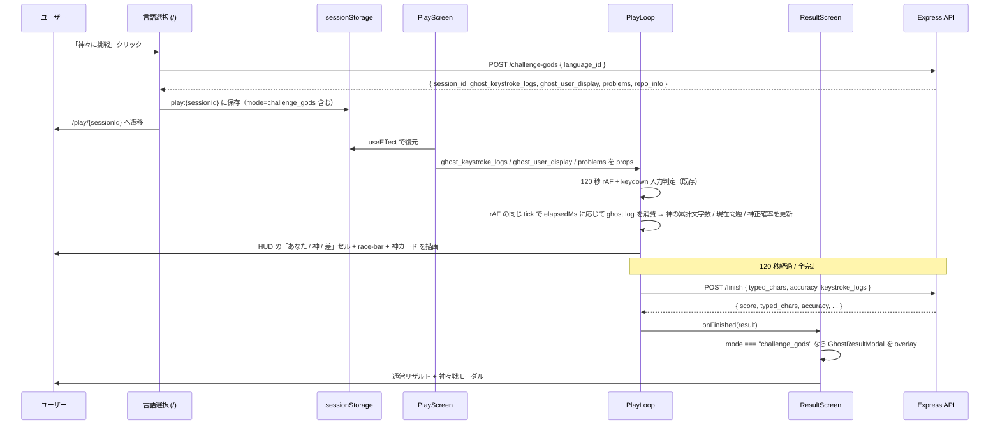

# step1: 神々モードの Web プレイ画面ゴースト併走 UI + 神々戦リザルトを実装

ghost-battle の API（`POST /api/play-sessions/challenge-gods`）は完成しており、レスポンスに `ghost_keystroke_logs` がフル同梱されている。本 step では **Web 側の神々モード固有 UI** を実装し、ghost-battle 機能をユーザー目線で完成させる。

実装対象は (1) プレイ画面のゴースト併走表示（あなた / 神の累計文字数対比・差分バー・神のサマリ）と (2) 神々戦リザルト（勝敗・差分・出題シーケンス達成状況）。あわせて API 側に残っている「Phase 4 完成までは 409 を返す」という旧コメントを整理する。

本 step 完了で ghost-battle 機能は MVP として完結する。`/api/ghosts/:playSessionId` GET endpoint は README に記載があるが `/challenge-gods` のレスポンス 1 本で済む設計に最適化済みのため、実装スコープから外す（replay-viewer step で必要になった時点で別途追加する）。

## 目次

- [対象画面・呼び出し API](#対象画面呼び出し-api)
- [参考モック](#参考モック)
  - [モックから読み取った主要構造](#モックから読み取った主要構造)
- [依存](#依存)
- [処理フロー](#処理フロー)
  - [処理の流れ](#処理の流れ)
- [ゴースト rAF 再生ロジック](#ゴースト-raf-再生ロジック)
- [設計方針](#設計方針)
- [対応内容](#対応内容)
- [動作確認](#動作確認)
- [次の step での利用](#次の-step-での利用)

## 対象画面・呼び出し API

### 画面（Next.js Route）

| Route | コンポーネント | 概要 |
|---|---|---|
| `/play/[sessionId]` | Server + Client | プレイ画面。本 step で `mode === "challenge_gods"` 時のゴースト併走 UI と神々戦リザルトを追加 |

PlayScreen / PlayLoop / ResultScreen は既存。ghost 関連の表示分岐を追加する形で実装する。

### 呼び出す API

| メソッド / パス | 呼び出すタイミング | 経路 | 認証 |
|---|---|---|---|
| `POST /api/play-sessions/challenge-gods` | 言語選択画面の「神々に挑戦」クリック時 | Server Action `startChallengeGodsSession`（既存） | 任意 |
| `POST /api/play-sessions/:id/finish` | 120 秒終了時 | Client → Route Handler proxy（既存） | 任意 |
| `GET /api/internal/my-ranking?language=...` | リザルトでランキング順位取得 | Client → Route Handler（既存） | 任意 |

本 step で新規 API 呼び出しは追加しない。`/challenge-gods` レスポンスに `ghost_keystroke_logs` / `ghost_user_display` / `problems` が同梱済みなので Client は sessionStorage 経由で復元するのみ。

## 参考モック

| 画面 | モックファイル | 反映すべき要素 |
|---|---|---|
| プレイ画面（神々モード） | [`docs/mocks/play-ghost.html`](../../mocks/play-ghost.html) | HUD の「あなた / 神 / 差」4 セル / race-bar（あなた vs 神） / 右サイドの神カード（avatar・グレード・進捗サマリ・正確率） / 出題シーケンス進捗カード |
| 神々戦リザルト | [`docs/mocks/modal-ghost-result.html`](../../mocks/modal-ghost-result.html) | 勝敗ヘッダー（絵文字 + 「惜敗」「勝利」/ pts 差表示） / あなた vs 神カード 2 列 / 出題シーケンスの達成状況 / race-bar / 「もう一度神々に挑戦」「通常プレイへ」ボタン |

### モックから読み取った主要構造

- レイアウト: 既存 PlayLoop の `container` + `play-hud` を拡張。`row gap-16` + `col` / `col-sidebar` で本文 + 右サイドの 2 カラム
- カラー: 神は `var(--gold)` / `var(--gold-light)` / `var(--ghost)`、自分は `var(--accent)`、差分マイナスは `var(--error)`
- タイポ: HUD 値は `text-mono`、神カード見出しは `text-sm + uppercase + letter-spacing`
- 動き: race-bar の width は ghost の累計文字数 / 20 問の合計文字数 比で更新
- 既存 globals.css に `.race`, `.race-row`, `.race-bar`, `.race-bar-fill`, `.race-bar-fill.ghost`, `.race-dot`, `.race-dot.ghost`, `.race-percent`, `.col-sidebar`, `.god-frame` などが定義済みか確認し、無ければ `apps/web/src/app/globals.css` に追加する
- リザルトはモーダル overlay（`.modal-overlay > .modal-lg`）で表示。背景の通常 result はそのまま下層に描画し、神々モード時のみモーダルを重ねる

## 依存

| 依存先 | 何を使うか | 本 step での扱い |
|---|---|---|
| `POST /api/play-sessions/challenge-gods` | レスポンスの `ghost_keystroke_logs` / `ghost_user_display` / `problems` / `repo_info` | 既存実装。本 step で挙動変更なし |
| `POST /api/play-sessions/:id/finish` | 通常モードと同じ完了処理 | 既存実装。`mode` 切り替えは Redis state で API 側が判別済み |
| 既存 PlayScreen / PlayLoop / ResultScreen | 描画分岐の挿入先 | 編集対象 |

## 処理フロー



### 処理の流れ

1. 言語選択画面の「神々に挑戦」が Server Action 経由で `/challenge-gods` を叩き、レスポンス全体（`ghost_keystroke_logs` 含む）を sessionStorage に保存
2. `/play/[sessionId]` 遷移後、PlayScreen が sessionStorage から復元（既存実装）
3. PlayScreen は `mode === "challenge_gods"` のとき `ghost_keystroke_logs` を PlayLoop に渡す
4. PlayLoop は既存の 120 秒 rAF tick 内で、`elapsedMs` 経過に応じて ghost log を消費し ghostTypedChars / ghostProblemIndex / ghostAccuracy を更新
5. HUD に「あなた / 神 / 差」セルを追加、メイン下に race-bar、右サイドに神カード（avatar + グレード + 進捗 + 正確率）を表示
6. 120 秒経過後、既存ロジックで `/finish` を叩いて結果を受信（mode はサーバー側 Redis state で判定済み）
7. ResultScreen は `mode === "challenge_gods"` のとき GhostResultModal を overlay 表示し、勝敗・累計文字数差・正確率差・出題シーケンス達成状況を描画
8. 「もう一度神々に挑戦」ボタンは言語選択画面（`/`）へ戻し、ユーザーが再度言語 + 神々モードを選ぶ動線にする（指名は不可）

## ゴースト rAF 再生ロジック

ghost 進捗は **既存の 120 秒 rAF tick の中で同期更新** する。別 rAF ループを持つと描画タイミングがズレるため避ける。

```ts
const ghostLogRef = useRef<GhostEntry[]>([])
const ghostCursorRef = useRef(0)
const ghostTypedCharsRef = useRef(0)
const ghostCorrectRef = useRef(0)
const ghostTotalRef = useRef(0)
const ghostProblemIndexRef = useRef(0)

const tick = () => {
  const elapsed = performance.now() - startAtRef.current
  /** 既存：残り時間更新 */

  if (mode === "challenge_gods") {
    /**
     * elapsed まで進んだ ghost log を全部消費
     * 同じ tick 内で複数エントリ消費し得る（速いプレイヤーは 1ms に複数キー）
     */
    while (
      ghostCursorRef.current < ghostLogRef.current.length &&
      ghostLogRef.current[ghostCursorRef.current].elapsedMs <= elapsed
    ) {
      const entry = ghostLogRef.current[ghostCursorRef.current]
      ghostTotalRef.current += 1
      if (entry.isCorrect) {
        ghostCorrectRef.current += 1
        ghostTypedCharsRef.current += 1
      }
      ghostProblemIndexRef.current = entry.problemIndex
      ghostCursorRef.current += 1
    }
    setGhostTypedChars(ghostTypedCharsRef.current)
    setGhostProblemIndex(ghostProblemIndexRef.current)
    setGhostAccuracy(ghostTotalRef.current === 0 ? 0 : ghostCorrectRef.current / ghostTotalRef.current)
  }

  if (remaining <= 0) { void finish(); return }
  raf = requestAnimationFrame(tick)
}
```

ポイント:

- ghost log は不変なので ref で持ち、cursor を進めるだけ
- `setGhost*` は tick 毎に呼ぶが React 18+ の自動 batching で 1 描画にまとまる
- `mode !== "challenge_gods"` のときは ghost 関連 ref は初期値のまま、ループも走らせない
- elapsedMs はサーバ側で `keystroke_logs` 記録時に `performance.now()` 起点で記録されているので、自分の rAF と同じ時刻軸

## 設計方針

- **ghost 再生は既存 rAF に乗せる**：別ループを立てないことで描画タイミングが完全に揃い、CPU も食わない
- **状態は mutable ref + setState の二重持ち**：keydown ハンドラから読むには ref が必要、表示には state が必要（既存 PlayLoop と同じ流派）
- **race-bar は問題総文字数を分母にしない**：神も自分も「全 20 問の合計文字数」のうち何文字打ったかで進捗率を出す。20 問の合計文字数は `problems.reduce((s, p) => s + p.char_count, 0)` で算出
- **GhostResultModal は ResultScreen の overlay**：通常リザルト（スコア / 順位 / グレード / mistype）は神々モードでも変わらず表示し、その上にモーダルを重ねる。モーダルを閉じても通常リザルトに留まる
- **勝敗判定はクライアント側**：神の最終 ghost_typed_chars は ghost log を最後まで消費した結果。神の最終スコアは `floor(ghost_typed_chars * ghost_accuracy)` ではなく、`ghost_user_display.best_score` をそのまま表示する（神は過去の確定スコアを持っているため）。文字数差・正確率差はクライアント計算
- **「もう一度神々に挑戦」は `/`（言語選択）へ戻す**：神は完全ランダムで指名不可。同じ動線で再抽選する
- **GET `/api/ghosts/:playSessionId` は実装しない**：README に記載があるが、`/challenge-gods` レスポンス 1 本で済む現行設計が望ましい（追加 round-trip / キャッシュ層が不要）。README は本 step で実態に合わせて更新
- **api 側のコメント整理**：start-challenge-gods controller / service の「Phase 4 完成までは 409」コメントは現状実態と乖離しているので削除

## 対応内容

### `apps/web/src/app/play/[sessionId]/play-screen.tsx`（修正）

`ghost_keystroke_logs` を PlayLoop に渡す。

```typescript
if (phase === "playing") {
  return (
    <PlayLoop
      ghostKeystrokeLogs={start.ghostKeystrokeLogs ?? null}
      ghostUserDisplay={start.ghostUserDisplay ?? null}
      mode={start.mode ?? "solo"}
      problems={start.problems}
      sessionId={sessionId}
      onFinished={(r, summary) => {
        setResult(r)
        setGhostSummary(summary)
        setPhase("result")
      }}
    />
  )
}

return (
  <ResultScreen
    ghostSummary={ghostSummary}
    ghostUserDisplay={start.ghostUserDisplay ?? null}
    mode={start.mode ?? "solo"}
    problems={start.problems}
    repoInfo={start.repoInfo}
    result={result}
  />
)
```

`GhostSummary` 型を `./types.ts` に切り出し、PlayLoop で確定した神の最終文字数 / 正確率 / 各問題の完走状況を載せる。

### `apps/web/src/app/play/[sessionId]/types.ts`（新規）

```typescript
import type { StartChallengeGodsResponse } from "@repo/api-schema"

export type GhostKeystrokeLogs = StartChallengeGodsResponse["ghost_keystroke_logs"]
export type GhostUserDisplay = StartChallengeGodsResponse["ghost_user_display"]

/**
 * PlayLoop が 120 秒終了時点で確定した神の進捗サマリ
 * ResultScreen が神々戦モーダルを描画するために使う
 */
export type GhostSummary = {
  accuracy: number
  perProblem: { completed: boolean; orderIndex: number; typedChars: number }[]
  problemIndex: number
  totalKeystrokes: number
  typedChars: number
}
```

### `apps/web/src/app/play/[sessionId]/play-loop.tsx`（修正）

- props に `ghostKeystrokeLogs` を追加、`onFinished` の第 2 引数で `GhostSummary` を返す
- 既存 rAF tick 内に ghost 進捗更新ロジックを追加（[ゴースト rAF 再生ロジック](#ゴースト-raf-再生ロジック)）
- mode === "challenge_gods" のとき HUD を「残り時間 / あなた / 神 / 差」の 4 セルに差し替え（通常モードは既存の「残り時間 / 累計文字数 / 正確率 / 完走」のまま）
- メインエディタの直上に `.race` ブロックを挿入（あなた / 神の race-bar）
- メイン下を `row gap-16` + `col` / `col-sidebar` に分け、右サイドに `.card.god-frame` を表示（avatar + グレード + 表示名 + 「問題 X / Y 行目を打鍵中」+ 正確率）

```tsx
{mode === "challenge_gods" && ghostUserDisplay && (
  <aside className="col-sidebar">
    <div className="card god-frame">
      <div className="card-header">
        <div className="card-title" style={{ color: "var(--gold-light)" }}>⚡ 今回の神</div>
      </div>
      <div className="flex-center gap-12 mb-8">
        <span className="avatar">{ghostUserDisplay.display_name.slice(0, 2).toUpperCase()}</span>
        <div>
          <div className="player-name">{ghostUserDisplay.display_name}</div>
          <div className="text-sm text-muted">{ghostUserDisplay.grade}</div>
        </div>
      </div>
      <div className="text-mono text-sm" style={{ color: "var(--ghost)" }}>
        問題 {ghostProblemIndex + 1} / {problems.length}
      </div>
      <div className="text-mono text-sm text-muted">
        正確率 {(ghostAccuracy * 100).toFixed(1)}%
      </div>
    </div>
  </aside>
)}
```

### `apps/web/src/app/play/[sessionId]/result-screen.tsx`（修正）

- props に `mode` / `ghostSummary` / `ghostUserDisplay` / `problems` を追加
- 既存リザルト本体はそのまま描画
- `mode === "challenge_gods"` のとき末尾で `<GhostResultModal />` を overlay
- 既存の「もう一度プレイ」ボタンは通常モードのみ表示、神々モードは GhostResultModal 内に「もう一度神々に挑戦 / 通常プレイへ / リザルトを見る」を持つ

### `apps/web/src/app/play/[sessionId]/ghost-result-modal.tsx`（新規）

```tsx
"use client"

import Link from "next/link"
import { useState } from "react"

import type { FinishPlaySessionResponse, StartSoloPlaySessionResponse } from "@repo/api-schema"

import type { GhostSummary, GhostUserDisplay } from "./types"

type Props = {
  ghostSummary: GhostSummary
  ghostUserDisplay: GhostUserDisplay
  problems: StartSoloPlaySessionResponse["problems"]
  result: FinishPlaySessionResponse
}

export function GhostResultModal({ ghostSummary, ghostUserDisplay, problems, result }: Props) {
  const [open, setOpen] = useState(true)
  if (!open) return null

  const ghostScore = ghostUserDisplay.best_score
  const diff = result.score - ghostScore
  const youWin = diff > 0
  const tie = diff === 0
  const heading = youWin ? "勝利" : tie ? "引き分け" : "惜敗"
  const emoji = youWin ? "🏆" : tie ? "🤝" : "😢"

  const totalChars = problems.reduce((s, p) => s + p.char_count, 0)
  const youPct = totalChars === 0 ? 0 : (result.typed_chars / totalChars) * 100
  const ghostPct = totalChars === 0 ? 0 : (ghostSummary.typedChars / totalChars) * 100

  return (
    <div className="modal-overlay">
      <div className="modal modal-lg" style={{ position: "relative" }}>
        <button className="modal-close" onClick={() => setOpen(false)} type="button">×</button>

        <div className="text-center mb-24">
          <div style={{ fontSize: "56px" }}>{emoji}</div>
          <h2 style={{ color: youWin ? "var(--success)" : tie ? "var(--accent)" : "var(--error)" }}>
            {heading}
          </h2>
          <p className="modal-sub">
            <span style={{ color: "var(--gold)", fontWeight: 700 }}>神 {ghostUserDisplay.display_name}</span>
            {youWin ? " に " : tie ? " と " : " に "}
            <strong>{Math.abs(diff)} pts {tie ? "互角" : youWin ? "差で勝利" : "差で負けました"}</strong>
          </p>
        </div>

        <div className="row mb-16" style={{ gap: "12px" }}>
          <div className="card" style={{ flex: 1, padding: "16px" }}>
            <div className="text-sm text-muted mb-8 text-center">あなた</div>
            <div className="text-center">
              <div className="stat-value accent">{result.score}</div>
              <div className="text-sm text-muted">
                {result.typed_chars} 文字 · {(result.accuracy * 100).toFixed(1)}%
              </div>
            </div>
          </div>
          <div className="card" style={{ borderColor: "var(--ghost)", flex: 1, padding: "16px" }}>
            <div className="text-sm text-muted mb-8 text-center">⚡ 神</div>
            <div className="text-center">
              <div className="stat-value" style={{ color: "var(--ghost)" }}>{ghostScore}</div>
              <div className="text-sm text-muted">
                {ghostSummary.typedChars} 文字 · {(ghostSummary.accuracy * 100).toFixed(1)}%
              </div>
            </div>
          </div>
        </div>

        <h3 className="mb-8">出題シーケンスの達成状況（神と同じ順）</h3>
        <div className="text-sm mb-16" style={{ display: "grid", gap: "6px" }}>
          {problems.map((p, i) => {
            const youDone = i < result.problems_completed
            const ghostDone = ghostSummary.perProblem[i]?.completed ?? false
            return (
              <div className="flex-between" key={p.id}>
                <span>{`${i + 1}. ${p.function_name}`}</span>
                <span>
                  <span className={`badge ${youDone ? "success" : "warning"}`}>
                    あなた:{youDone ? "完走" : "未完走"}
                  </span>{" "}
                  <span className="badge gold">神:{ghostDone ? "完走" : "未完走"}</span>
                </span>
              </div>
            )
          })}
        </div>

        <div className="race">
          <div className="race-row">
            <div className="race-label"><span className="race-dot" />あなた</div>
            <div className="race-bar"><div className="race-bar-fill" style={{ width: `${youPct}%` }} /></div>
            <div className="race-percent">{result.typed_chars}</div>
          </div>
          <div className="race-row">
            <div className="race-label"><span className="race-dot ghost" />神</div>
            <div className="race-bar"><div className="race-bar-fill ghost" style={{ width: `${ghostPct}%` }} /></div>
            <div className="race-percent">{ghostSummary.typedChars}</div>
          </div>
        </div>

        <div className="text-sm text-muted text-center mt-16">
          ⚡ 次の神もランダム抽選。指名はできません。
        </div>

        <div className="modal-actions">
          <Link className="btn btn-gold" href="/">⚡ もう一度神々に挑戦</Link>
          <Link className="btn" href="/">▶ 通常プレイへ</Link>
          <button className="btn btn-primary" onClick={() => setOpen(false)} type="button">
            リザルトを見る
          </button>
        </div>
      </div>
    </div>
  )
}
```

### `apps/web/src/app/globals.css`（必要なら追加）

`docs/mocks/styles.css` から `.race` / `.race-row` / `.race-bar` / `.race-bar-fill` / `.race-bar-fill.ghost` / `.race-dot` / `.race-dot.ghost` / `.race-percent` / `.col-sidebar` / `.god-frame` / `.avatar` / `.player-name` / `.modal-overlay` / `.modal` / `.modal-lg` / `.modal-close` / `.modal-actions` / `.modal-sub` / `.badge.gold` / `.btn.btn-gold` などを apps/web 側に取り込み（既に取り込み済みなものはスキップ）。新規追加分のみ globals.css の末尾に追記する。

### `apps/api/src/controller/play-session/start-challenge-gods.ts`（コメント整理）

```typescript
/**
 * 神々モード（challenge_gods）のセッション開始
 *
 * リクエスト Body の language_id を Zod で検証し、Service に処理を委譲する
 */
```

「Phase 4 完成までは 409 Conflict を返す」記述を削除。

### `apps/api/src/service/play-session-service.ts`（コメント整理）

`createChallengeGodsSession` の JSDoc から「Phase 4 (score-ranking) の ranking_snapshots が出来るまでは Stub が空配列を返すため、本 API は常に 409 Conflict を返す」を削除。

### `docs/spec/ghost-battle/README.md`（更新）

「必要な API」表の `GET /api/ghosts/:playSessionId` 行を、`/challenge-gods` のレスポンスに同梱する現行設計に合わせて削除（または「replay-viewer で実装予定」と注釈）。

## 動作確認

| 区分 | 内容 |
|---|---|
| 既存ユニットテスト | ghost 関連は API 側で完備済み。Web 側ユニットテストは導入していないため新規追加なし |
| Playwright MCP | 1. 言語選択画面で「神々に挑戦」をクリック → /play/{id} に遷移し神々モード HUD が表示される / 2. プレイ中に神のカウンタが増えていく / 3. 120 秒経過後にリザルト + 神々戦モーダルが overlay 表示される / 4. 「もう一度神々に挑戦」が `/` に戻す / 5. モーダル閉じても通常リザルトが見える |
| スクショ | docs/screenshots/ghost-battle-step1/{play-ghost,result-ghost-modal}.png |
| Lint / Build / Test | `pnpm lint && pnpm build && pnpm test` がすべて緑 |

### 神なしユーザーで境界値テスト

トップ 10 不在言語（または `publicRanking=false` のみ）の状況をテスト用 SQL で作り、Server Action が 409 を受けてエラーフラッシュ + 通常モード誘導することを確認する（既存実装の動作確認）。

## 次の step での利用

- **replay-viewer**: 本 step で確立した ghost rAF 再生ロジック（`KeystrokeLogs` を `elapsedMs` で消費するパターン）を再利用し、シーク・倍速対応の UI を追加で実装する
- **deferred-rich-rewards / 拡張機能**: 神々戦勝率を reward / グレード補正のシグナルとして使う場合、本 step の `GhostSummary.perProblem` を保存する仕組みを後段で検討する（MVP では非対象）
- 本 step で意図的に省略したもの:
  - `GET /api/ghosts/:playSessionId` の単独 endpoint（replay-viewer で実装）
  - 神のキャッシュ事前ウォーミング（運用上必要になった時点で対応）
  - 神々戦の DB 集計（神々モードの勝率・対戦履歴は MVP では保持しない）
