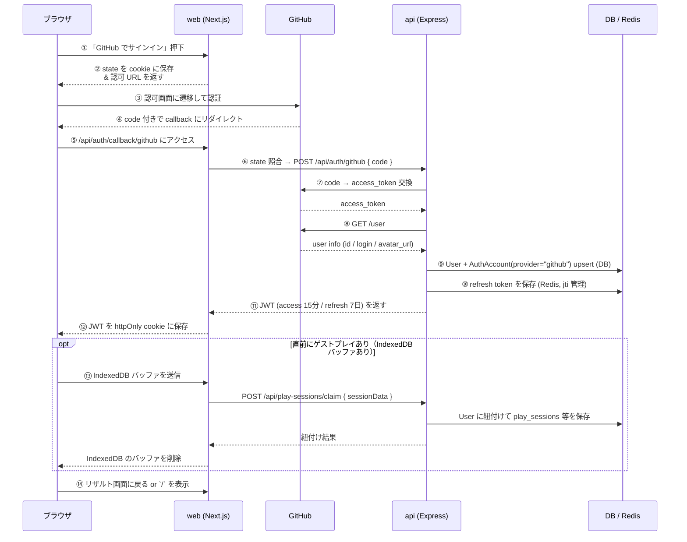

# GitHub OAuth 認証

ユーザーがゲストプレイから「記録を残す」「ランキングに載る」「特典を受け取る」ためにログインする仕組み。GitHub OAuth を使用し、**読み取り最小スコープ** のみ要求する。

このドキュメントは **仕様（What）** と **設計（How）** を分けて記述する：

- **仕様**：ユーザーから見える挙動、スコープ、保存されるデータ、削除時の挙動
- **設計**：アーキテクチャ、JWT・Cookie・Redis の構成、新規追加ファイル

## 関連 spec

- [`docs/auth.md`](../../auth.md) — Google OAuth の既存実装（本仕様の設計ベース）
- [`../typing-engine/README.md` 「セッション保存ポリシー」](../typing-engine/README.md#セッション保存ポリシー) — ゲスト → ログイン時の IndexedDB バッファ受け渡し

## 目次

- [仕様](#仕様)
  - [OAuth スコープ](#oauth-スコープ)
  - [ゲスト → ログイン時のスコアクレーム](#ゲスト--ログイン時のスコアクレーム)
  - [表示名とプライバシー](#表示名とプライバシー)
  - [アカウント削除](#アカウント削除)
  - [メールアドレス収集方針](#メールアドレス収集方針)
- [設計](#設計)
  - [既存 Google OAuth との共通アーキテクチャ](#既存-google-oauth-との共通アーキテクチャ)
  - [Cookie・JWT・Redis 構成](#cookiejwtredis-構成)
  - [CSRF / state 検証](#csrf--state-検証)
  - [アクセストークン非保存方針](#アクセストークン非保存方針)
  - [多重登録・複数プロバイダ併用](#多重登録複数プロバイダ併用)
  - [新規追加ファイル](#新規追加ファイル)
- [必要な画面](#必要な画面)
- [必要な API](#必要な-api)
  - [Web (Next.js, port 3000)](#web-nextjs-port-3000)
  - [API (Express, port 8080)](#api-express-port-8080)
- [必要な DB 設計](#必要な-db-設計)
- [フロー図](#フロー図)

---

## 仕様

### OAuth スコープ

- `read:user`（公開プロフィール取得）のみ。
- `repo` スコープは **要求しない**。README へのバッジ貼付はユーザーが手動で行う。
- `user:email` も MVP では要求しない（メール連絡が必要な特典が出るまで保留）。

### ゲスト → ログイン時のスコアクレーム

ゲスト時のリザルト画面で「ログインして記録を残す」を選択すると、本フローが起動する。

- 認証成功直後、クライアントが `POST /api/play-sessions/claim` で **IndexedDB のバッファ（直前のゲストプレイ 1 件分）** をアカウントに紐付ける。
- 送信成功で IndexedDB のバッファを削除。
- ログイン拒否 / 画面離脱時は IndexedDB のバッファを即時削除（後日のマージは行わない）。

詳細は [`../typing-engine/README.md` 「セッション保存ポリシー」](../typing-engine/README.md#セッション保存ポリシー) を参照。

### 表示名とプライバシー

- 既定の表示名は **GitHub username**。`User.displayName` に保存。
- アバター URL は GitHub から取得して `User.avatarUrl` に保存。
- ランキング掲載可否（`User.publicRanking`）をユーザーが設定可能。**OFF の場合はランキング集計対象から完全に除外**（順位そのものが計算されず、トップ 10 にも自分の順位表示にも一切現れない）。

### アカウント削除

- マイページからアカウント削除可能。既存の Google アカウント削除と同じハンドラを呼ぶ（プロバイダ非依存）。削除すると：
  - `User` / `AuthAccount` を削除
  - Redis 上の refresh token を削除
  - スコア・キーストロークログ・特典履歴を **FK カスケード削除**
  - Hall of Fame 掲載も削除
- GDPR 観点で **即時対応** を保証。Hall of Fame に過去掲載された情報も削除されることをアカウント設定画面に明記する。

### メールアドレス収集方針

- MVP では `user:email` スコープを要求しない。
- 連絡経路が必要な特典（3D アイコン手動納品等）が出てきた段階で再検討する。

---

## 設計

### 既存 Google OAuth との共通アーキテクチャ

[`docs/auth.md`](../../auth.md) の Google OAuth と **同じアーキテクチャを採用** する。プロバイダ固有の差分は OAuth クライアント（`github-oauth.ts`）と `AuthAccount.provider = "github"` の追加だけ。

| レイヤ | 共通 / 固有 |
| --- | --- |
| `auth-service.ts` のユーザー検索・JWT 発行・refresh 保存 | **共通**（プロバイダ非依存） |
| OAuth クライアント（code → access_token → user info） | **GitHub 固有** |
| `AuthAccount.provider` | `"google"` / `"github"` を識別 |
| web cookie ハンドリング・middleware・JWT lib・refresh token Redis | **共通**（変更なしで再利用） |

### Cookie・JWT・Redis 構成

- **JWT**：access（15 分）+ refresh（7 日）の 2 種類。
- **JWT は httpOnly cookie で配信**：`HttpOnly` `Secure` `SameSite=Lax`（OAuth コールバックの cross-site 連鎖ナビゲーションでも送信されるため Lax 必須）。
- **Refresh token は Redis で jti 管理**：個別失効可能、ローテーション運用にも対応。
- **アクセストークン（GitHub 側）は保存しない**：詳細は[アクセストークン非保存方針](#アクセストークン非保存方針)。
- web (Next.js) が JWT を cookie に保存し、Express api は cookie を発行しない（ドメイン分離・CORS / SameSite 制約のため）。

### CSRF / state 検証

- web の Server Action で **state（ランダム文字列）を cookie に保存**（10 分有効）。
- GitHub からの callback で web が cookie の state と URL の state を照合（一致しなければ 4xx で拒否）。
- state cookie も `HttpOnly` `Secure`。

### アクセストークン非保存方針

GitHub のアクセストークンは **DB / Redis のいずれにも保存しない**。理由：

1. 読み取りスコープで取得した情報（`user.login`, `avatar_url` 等）は **DB に保存済み**で再アクセス不要
2. 週次クローラには **運営アカウントの別 PAT** を使う（[`../problem-pool/README.md`](../problem-pool/README.md)）
3. 保存しないことで **トークン漏洩 / 管理コスト / ローテーション運用** をすべて排除

### 多重登録・複数プロバイダ併用

- `AuthAccount(provider, providerUserId)` に **一意制約** をかけ、1 GitHub アカウント = 1 `AuthAccount` を保証。
- `AuthAccount.userId` は 1 ユーザーが複数行持てる設計のため、将来的に **同一ユーザーが Google と GitHub の両方を紐付ける** 拡張が可能（MVP では片方のみで運用）。

### 新規追加ファイル

既存の Google OAuth 構造に GitHub 用ファイルを追加するだけ。プロバイダ非依存のロジックは既存ファイルを拡張するに留める。

#### web (Next.js)

| ファイル | 種別 | 内容 |
| --- | --- | --- |
| `apps/web/src/app/sign-in/page.tsx` | 拡張 | GitHub サインインボタンを追加 |
| `apps/web/src/app/sign-in/actions.ts` | 拡張 | `startGithubOAuth`（Server Action）を追加 |
| `apps/web/src/app/api/auth/callback/github/route.ts` | **新規** | GitHub callback Route Handler |

#### api (Express)

| ファイル | 種別 | 内容 |
| --- | --- | --- |
| `apps/api/src/controller/auth/github.ts` | **新規** | `POST /api/auth/github` Controller |
| `apps/api/src/client/github-oauth.ts` | **新規** | GitHub OAuth クライアント（code → access_token → user info の薄いラッパー） |
| `apps/api/src/service/auth-service.ts` | 拡張 | `authenticateWithGithub` を追加（`authenticateWithGoogle` と同型、内部の共通ロジックは抽出可） |
| `apps/api/src/repository/prisma/auth-account-repository.ts` | 既存利用 | provider 引数が汎用化済みなら追加実装不要 |

`apps/web/src/libs/auth.ts`（cookie 操作）、`apps/web/src/middleware.ts`（認証ガード）、`apps/api/src/lib/jwt.ts`（JWT 発行・検証）、`apps/api/src/repository/redis/refresh-token-repository.ts`（refresh token Redis）はすべて **既存ファイルを変更なしで再利用**。

---

## 必要な画面

| 画面 | 概要 |
| --- | --- |
| サインイン画面 | 「GitHub でサインイン」ボタン（既存の Google サインインボタンと並べる） |
| 初回ログイン後のオンボーディング | 表示名確認、ランキング掲載可否の選択 |
| マイページ > ホーム | **現在のエンジニアグレード（大きく表示）+ 次のグレードまでの進捗バー** / ベストスコア / 全期間順位（1000 位以内のみ）or 圏外 / 累計打鍵数 / 連続日数 / グレード昇格履歴 |
| マイページ > アカウント設定 | 表示名 / ランキング公開 / アバター表示 / アカウント削除 |

## 必要な API

`/api/...` の所属（web Route Handler か Express api か）は [`docs/auth.md` 「URL の整理」](../../auth.md#url-の整理) と同じ規則に従う。

### Web (Next.js, port 3000)

| URL / シンボル | 種別 | 説明 |
| --- | --- | --- |
| `/sign-in` | Page | サインイン画面（既存に GitHub ボタンを追加） |
| `apps/web/src/app/sign-in/actions.ts#startGithubOAuth` | Server Action | `state` を cookie に保存し、GitHub の認可画面 URL を返す |
| `/api/auth/callback/github` | Route Handler | GitHub からの callback。`state` 照合 → Express api に `code` を POST → JWT を httpOnly cookie 保存 → `/` リダイレクト |

### API (Express, port 8080)

| メソッド | パス | 説明 |
| --- | --- | --- |
| POST | `/api/auth/github` | **新規**：`{ code, redirectUri }` を受け取り、GitHub OAuth で access_token を取得 → user info（`/user`）取得 → `User` + `AuthAccount(provider="github")` upsert → JWT（access 15分 / refresh 7日）発行 |
| POST | `/api/auth/refresh` | 既存共用（プロバイダ非依存） |
| POST | `/api/auth/logout` | 既存共用（プロバイダ非依存） |
| GET | `/api/me` | 既存共用 |
| PATCH | `/api/me` | 表示名 / `publicRanking` 等の更新（既存共用） |
| DELETE | `/api/me` | アカウント削除（既存共用） |
| POST | `/api/play-sessions/claim` | リザルト直後にログインした際、IndexedDB のバッファ 1 件分をアカウントに紐付け |

`/api/auth/refresh` `/api/auth/logout` `/api/me` 系は **プロバイダ非依存** のため、既存 `auth-service.ts` のロジックを変更なしで再利用。

## 必要な DB 設計

既存の `User` / `AuthAccount` テーブルをそのまま利用。**GitHub 用に追加するのは `AuthAccount.provider` の文字列 `"github"` のみ**。

| テーブル | 主要カラム | 説明 |
| --- | --- | --- |
| `User` | `id`, `displayName`, `avatarUrl`, `publicRanking(bool)`, `createdAt`, `updatedAt` | ユーザー本体（プロバイダ非依存） |
| `AuthAccount` | `id`, `userId(FK)`, `provider("google"\|"github")`, `providerUserId`, `createdAt` | プロバイダ別の紐付け。`(provider, providerUserId)` に一意制約 |

`oauth_tokens` 等のアクセストークン保管テーブルは **作らない**（[アクセストークン非保存方針](#アクセストークン非保存方針) 参照）。refresh token は既存通り Redis 管理（jti 単位で個別失効可）。

## フロー図

[`docs/auth.md` の Google フロー](../../auth.md#全体フロー) と同型。`Google` を `GitHub` に、エンドポイントを GitHub のものに置き換えるだけ。

