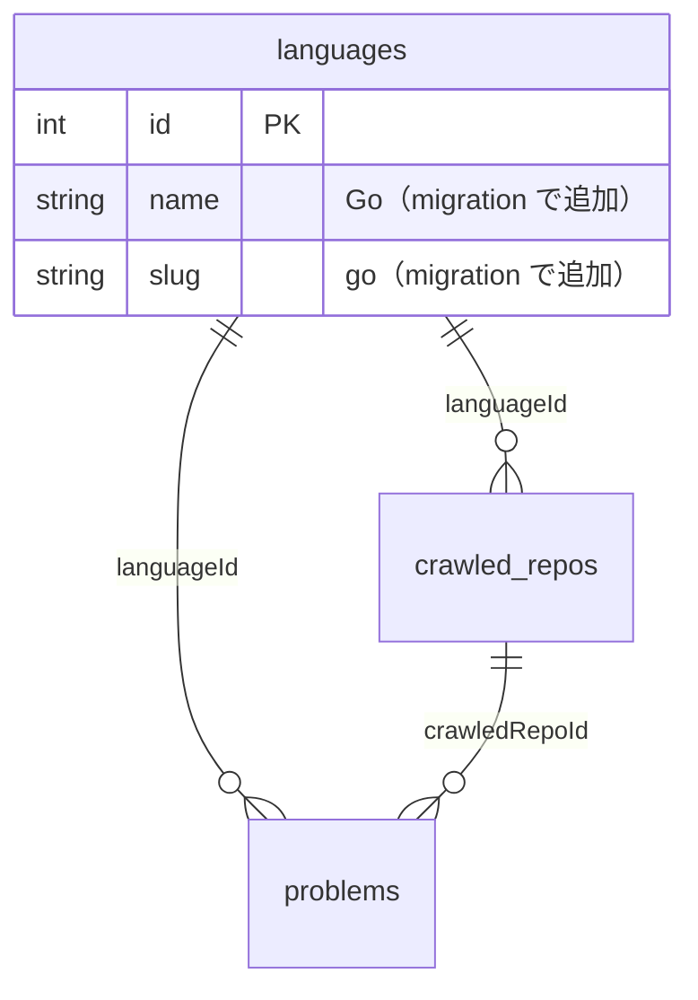
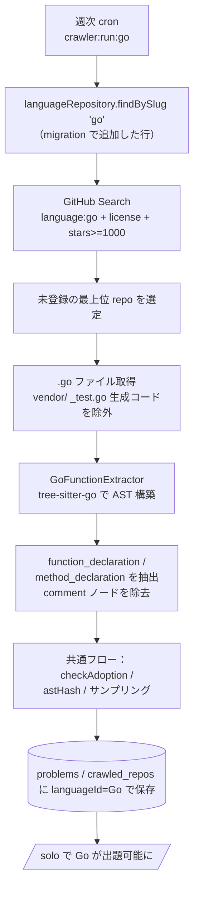
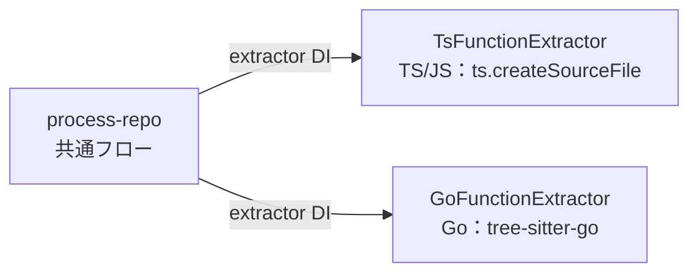

# Go 対応

初期リリースの対応言語に **Go** を加える。出題・ランキング・問題プールの蓄積方式は TypeScript / JavaScript と同じ枠組みに乗せるが、**Go は TypeScript Compiler API でパースできない**ため、AST 抽出層に別 parser を導入する点が本質的に異なる。

このドキュメントの主役は 2 つ：

1. **Go 用 AST パーサの選定**（`tree-sitter-go` を推奨）。
2. **`process-repo` を言語非依存にするリファクタ**（言語固有の抽出を `LanguageExtractor` strategy に切り出し、fetch / ライセンス / サンプリング / 保存の共通フローはそのまま共有する）。

このドキュメントは **仕様（What）** と **設計（How）** を分けて記述する：

- **仕様**：ユーザーから見て Go が「対応言語」として何ができるようになるか
- **設計**：Go パーサの選定理由と、既存パイプラインへの組み込み方

## 関連 spec

- [`../problem-pool/README.md`](../problem-pool/README.md) — クローラ本体の **正本**。抽出条件・採用ルール・出題ロジックはすべて problem-pool に従う。Go は「言語固有の AST 抽出層」のみを本書で定義する
- [`../language-master/README.md`](../language-master/README.md) — 言語タブの動的化。`languages` マスタの正本。Go 行は本書の migration で新規追加する
- [`../javascript-support/README.md`](../javascript-support/README.md) — もう一方の初期リリース追加言語。JS は TS パイプラインをそのまま流用でき設計が軽い（対比のため）

## 目次

- [仕様](#仕様)
  - [Go が対応言語になるとは](#go-が対応言語になるとは)
  - [対象ファイル](#対象ファイル)
  - [抽出単位](#抽出単位)
  - [採用ルール（problem-pool 準拠）](#採用ルールproblem-pool-準拠)
  - [Go 固有の除外](#go-固有の除外)
  - [運用（ブートストラップ）](#運用ブートストラップ)
- [設計](#設計)
  - [なぜ TypeScript Compiler API が使えないか](#なぜ-typescript-compiler-api-が使えないか)
  - [Go パーサの選定](#go-パーサの選定)
  - [process-repo を言語非依存にするリファクタ](#process-repo-を言語非依存にするリファクタ)
  - [Go 用 LanguageExtractor の実装](#go-用-languageextractor-の実装)
  - [GithubClient の除外パターンを注入式にする](#githubclient-の除外パターンを注入式にする)
  - [言語マスタへの Go 行追加](#言語マスタへの-go-行追加)
  - [Web 側の有効化](#web-側の有効化)
  - [インフラ（EventBridge スケジュール）](#インフラeventbridge-スケジュール)
- [必要な画面](#必要な画面)
- [必要な API](#必要な-api)
- [必要な DB 設計](#必要な-db-設計)
- [フロー図](#フロー図)
- [step ファイル](#step-ファイル)
- [注意事項](#注意事項)

---

## 仕様

### Go が対応言語になるとは

- 各画面に **Go タブ**が表示され、選択できる（マスタ駆動。本書の migration で `languages` に Go 行を追加）。
- ソロモードで Go を選ぶと、**Go の OSS から抽出された関数 / メソッド 20 問**が出題される。
- ランキング・月間ランキング・殿堂入り・特典が **Go 軸**で機能する（`languageId` 駆動の既存実装がそのまま効く）。

前提は **Go の問題プールが空でないこと**。本機能の中心は Go 用クローラを稼働させ、その問題プールを埋めることにある。

### 対象ファイル

GitHub Search で `language:Go` の repo を取得し、各 repo 内の `.go` ファイルを問題候補ソースとする。ただし以下は **除外**：

- `*_test.go`（テストファイル）
- `vendor/` 配下（ベンダリングされた他 repo のコード）
- 生成コード（`*.pb.go` / `*_gen.go` / 先頭に `// Code generated ... DO NOT EDIT.` を含むファイル）

### 抽出単位

Go の AST から以下 2 種類を **関数の問題候補**として抽出する：

- **関数宣言** `FunctionDeclaration`：`func Foo(a int) error { ... }`
- **メソッド宣言** `MethodDeclaration`：`func (r *Repo) Save(ctx context.Context) error { ... }`（レシーバ付き）

無名の関数リテラル（`func() { ... }` をその場で渡す / 代入する形）は **抽出対象外**（名前が取れず、problem-pool の「無名関数は除外」と整合）。ネストした関数リテラルも抽出しない（トップレベルの宣言のみ）。

### 採用ルール（problem-pool 準拠）

採用条件・重複排除・コメント除去ポリシー・出典保存・出題抽選は **[problem-pool](../problem-pool/README.md) と同一**：

- 採用条件：コメント除去後 200〜700 文字 / 8〜40 行 / 1 行 120 文字以下 / 非 ASCII 0 文字 / 関数名あり
- 重複排除：AST 正規化ハッシュ（`@@unique([languageId, astHash])`）
- repo 単位：採用候補 30 個未満は `disabled`、30 個以上はランダム最大 100 問を保存

> Go はレシーバや `err != nil` の定型が多く、関数が比較的短くなりやすい。MVP は TS と同じ 200〜700 文字でスタートし、プールの質を見て言語ごとの閾値調整が必要なら別途検討する（problem-pool の閾値は将来言語別にできる余地を残す）。

### Go 固有の除外

テスト・ベンチマーク・例示関数は問題として不適切なため除外する。Go の規約に従い、以下の **関数名プレフィックス**を除外する：

| プレフィックス | 例 | 理由 |
|---|---|---|
| `Test` | `func TestParse(t *testing.T)` | テスト関数 |
| `Benchmark` | `func BenchmarkParse(b *testing.B)` | ベンチマーク |
| `Example` | `func ExampleParse()` | 例示（godoc 用） |
| `Fuzz` | `func FuzzParse(f *testing.F)` | ファズテスト |

加えて、ファイル単位で `*_test.go` を除外する（上記名前フィルタの二重防御）。

### 運用（ブートストラップ）

- TS / JS と同様、`CRAWLER_REPOS_PER_RUN` でローンチ初期だけ増やして 50 repo まで積み上げる。
- Go 用 cron は **別タスク・別スケジュール**で動く（rate limit / 障害を他言語に波及させない）。

---

## 設計

### なぜ TypeScript Compiler API が使えないか

TS / JS は `ts.createSourceFile` で AST を構築していたが、これは **ECMAScript / TypeScript 文法専用**で Go 構文（`func`、レシーバ、`:=`、`chan`、ゴルーチン等）を一切解釈できない。Go では別の parser が必須になる。

### Go パーサの選定

3 案を比較し、**`tree-sitter-go`（WASM）を推奨**する。

| 案 | 仕組み | 利点 | 欠点 | 判定 |
|---|---|---|---|---|
| **A. tree-sitter-go（WASM）** | `web-tree-sitter` が `tree-sitter-go.wasm` を読み込み、Node 内で Go をパース | Go ツールチェーン不要 / npm 依存だけで完結 / ネイティブ addon ビルド不要（Alpine/ECS で安定） / 関数・メソッド・コメントのノードが取れる | 公式 `go/ast` ほどの厳密さはない（が関数境界・コメント抽出には十分） | **採用** |
| B. `go/parser` ヘルパバイナリ | cron イメージに Go ツールチェーンを同梱し、`go/parser` で AST を JSON 出力 → Node が読む | 公式 AST で最も正確 | cron Docker イメージに Go ランタイム追加（イメージ肥大・ビルド複雑化）/ ファイルごとのプロセス起動 or 常駐サーバの IPC が必要 | 不採用（インフラ負荷大） |
| C. node-tree-sitter（ネイティブ） | `node-tree-sitter` + `tree-sitter-go` のネイティブバインディング | 高速 | node-gyp ビルドが必要で Alpine / ECS で不安定になりがち | 不採用（A で代替可能） |

**採用：A. tree-sitter-go（WASM）**。`web-tree-sitter` は純粋な WASM ロードで動き、ECS の Node ランタイムにそのまま乗る。tree-sitter は関数境界・識別子・コメントのノードを正確に返すため、本用途（名前付き関数の本文抽出 + コメント除去 + 行範囲）には十分。

> `web-tree-sitter` と `tree-sitter-go.wasm` を `apps/cron` の依存に追加し、wasm アセットを `dist/` にコピーする build 設定を入れる（[step2](./step2-cron-go-extractor.md) 参照）。これは **npm 依存の追加のみ**で、Docker イメージや Terraform の変更を伴わない（案 B との決定的な差）。

### process-repo を言語非依存にするリファクタ

現状 `process-repo.ts` は `ts.createSourceFile(...)` をハードコードしている（`process-repo.ts:154`）。Go を 3 言語目として迎えるにあたり、**言語固有の「ソース → コメント除去済み関数候補」変換を `LanguageExtractor` strategy に切り出す**。fetch / ライセンス確認 / ファイルサンプリング / 採用足切り / DB 保存は **言語非依存なので共有**する。

```ts
// apps/cron/src/ast/language-extractor.ts（新規・共通インターフェース）
export type ExtractedCandidate = {
  /** コメント除去後の本文 */
  codeStripped: string
  functionName: string
  /** 1-indexed（元ファイル基準） */
  sourceLineEnd: number
  sourceLineStart: number
}

export interface LanguageExtractor {
  /** 1 ソースファイルから採用前の関数候補（コメント除去済み）を返す */
  extract(source: string, filePath: string): ExtractedCandidate[]
  /** Go の Test*/Benchmark* 等、言語固有の除外関数名判定 */
  isExcludedName(functionName: string): boolean
}
```

- **`TsFunctionExtractor`**（既存ロジックの移設）：`ts.createSourceFile` + `extractFunctions` + `removeComments` を内包。TypeScript / JavaScript の両 task が共有（JS は [javascript-support](../javascript-support/README.md) で追加する task が利用）。
- **`GoFunctionExtractor`**（新規）：`tree-sitter-go` で関数・メソッドノードを抽出し、コメントノードを除去。

`process-repo` は `LanguageExtractor` を DI で受け取り、内部の `ts.createSourceFile(...)` 直書きを `extractor.extract(raw, file.path)` に置き換える。`checkAdoption` は共有しつつ、テスト関数名の除外だけ `extractor.isExcludedName()` に委譲する（言語ごとに異なるため）。

> この strategy 化は javascript-support の step1 で言及した「3 言語目で共通化を検討する」リファクタの実体。Go PR でこの抽象を導入し、TS / JS の既存 task もこの抽象の上に乗せ替える。

### Go 用 LanguageExtractor の実装

`tree-sitter-go` のノード型を使う：

| Go 構文 | tree-sitter ノード型 | 名前の取り方 |
|---|---|---|
| `func Foo(...) {...}` | `function_declaration` | `name` フィールド（`identifier`） |
| `func (r *T) Foo(...) {...}` | `method_declaration` | `name` フィールド（`field_identifier`） |
| コメント | `comment` | テキスト範囲を本文から除去 |

実装方針：

```ts
// 擬似コード
const tree = parser.parse(source)
walk(tree.rootNode, (node) => {
  if (node.type === "function_declaration" || node.type === "method_declaration") {
    const name = node.childForFieldName("name")?.text
    if (!name) return                       // 無名は除外（理論上 Go では起きない）
    const rawText = source.slice(node.startIndex, node.endIndex)
    const codeStripped = stripGoComments(rawText, node)  // comment ノードの範囲を後ろから削除
    candidates.push({
      codeStripped,
      functionName: name,
      sourceLineStart: node.startPosition.row + 1,   // 0-indexed → 1-indexed
      sourceLineEnd: node.endPosition.row + 1,
    })
    return  // ネスト関数リテラルを二重抽出しないため子は走査しない
  }
})
```

- **コメント除去**：関数ノード配下の `comment` ノードの範囲を集め、本文から後ろ向きに削除（既存 TS 版 `remove-comments.ts` と同じ「後ろから消す」戦略）。文字列リテラル内の `//` は `comment` ノードにならないので自動的に保護される。
- **行範囲**：`startPosition.row` / `endPosition.row`（0-indexed）を +1。出典 URL は既存 `buildSourceUrl` をそのまま使う。
- **正規化ハッシュ**：コメント除去後本文を既存 `normalize-for-hash.ts` の `astHashOf` に渡す（言語非依存。空白圧縮 + SHA-256）。
- **`isExcludedName`**：`/^(Test|Benchmark|Example|Fuzz)/` にマッチしたら除外。

### GithubClient の除外パターンを注入式にする

現状 `GithubClient` の `EXCLUDED_TREE_PATTERNS`（`client.ts:30`）は JS/TS 前提（`node_modules/` / `dist/` / `[-_]test\.[jt]sx?$` 等）で、Go の `vendor/` や `_test.go` を弾けない。`targetExtensions` と同様に **除外パターンもコンストラクタで注入できる**ようにする：

```ts
// GithubClientConfig に追加
excludedPathPatterns?: RegExp[]   // 省略時は現行の JS/TS 向けデフォルト
```

Go task では Go 向けのパターンを渡す：

```ts
excludedPathPatterns: [
  /^vendor\//, /\/vendor\//,
  /_test\.go$/,
  /\.pb\.go$/, /_gen\.go$/,
  /^(testdata|examples?)\//, /\/(testdata|examples?)\//,
]
```

> デフォルト引数で現行挙動を維持するため、TS / JS task は無変更で動く（後方互換）。

### 言語マスタへの Go 行追加

`languages` に Go 行を追加する migration を新設する。既存 seed migration（`20260626120000_seed_master_languages`）と同じ `ON CONFLICT DO NOTHING` で冪等にする。詳細は [step1](./step1-db-go-language.md)。

```sql
INSERT INTO "languages" ("name", "slug", "created_at", "updated_at")
VALUES ('Go', 'go', NOW(), NOW())
ON CONFLICT ("slug") DO NOTHING;
```

GitHub Search の `language:` 修飾子は slug `go`（`language:go`）で Go repo に一致する（大文字小文字非依存）。Search 周りのコード変更は不要。

### Web 側の有効化

`apps/web/src/app/play/page.tsx` の `LANGUAGE_PRESENTATION` に Go の表示メタを追加し（`comingSoon: false`）、`apps/web/src/app/page.tsx` の対応言語バッジを `Go (近日)` → `Go` に更新する。問題プールが十分に積まれてからデプロイする。詳細は [step4](./step4-web-enable-go.md)。

### インフラ（EventBridge スケジュール）

TS / JS と同型の EventBridge → ECS Scheduled Task を 1 つ追加して `crawler:run:go` を定期起動する。Terraform 変更は **アプリ実装とは別 PR** に分離する。詳細は [step5](./step5-infra-schedule-go.md)。

---

## 必要な画面

| 画面 | 変更内容 |
|---|---|
| 言語選択 / home / ranking 等 | Go タブを追加表示（`getLanguages()` 駆動、マスタ行は migration で追加）。新規画面なし |

## 必要な API

新規 API なし。既存の `POST /api/play-sessions/solo` 等が `languageId`（Go）でそのまま機能する。

## 必要な DB 設計

`languages` に Go 行を 1 行追加するのみ（migration）。テーブル構造の変更はなし。`crawled_repos` / `problems` / `crawler_runs` / `crawler_run_items` は `languageId` で Go データを分離する。



## フロー図





## step ファイル

| step | 内容 |
|---|---|
| [step1-db-go-language.md](./step1-db-go-language.md) | `languages` に Go 行を追加する migration |
| [step2-cron-go-extractor.md](./step2-cron-go-extractor.md) | `LanguageExtractor` strategy 導入 + `GoFunctionExtractor`（tree-sitter-go） + `process-repo` リファクタ |
| [step3-cron-crawler-go.md](./step3-cron-crawler-go.md) | `crawler-run-go.ts` task + `package.json` スクリプト + GithubClient 除外パターン注入 |
| [step4-web-enable-go.md](./step4-web-enable-go.md) | UI に Go を追加・選択可能化 |
| [step5-infra-schedule-go.md](./step5-infra-schedule-go.md) | EventBridge / ECS Scheduled Task（**別 PR**） |

## 注意事項

- **strategy リファクタの blast radius**：`process-repo` のリファクタは TypeScript の既存 task の挙動を変えてはならない。リファクタ前後で TS クローラの出力（採用件数・astHash）が一致することを既存テスト + スナップショットで担保する。
- **wasm アセットの同梱**：`tree-sitter-go.wasm` を `dist/` にコピーする build 設定を忘れると本番で parser ロードに失敗する。`pnpm build` 後に dist 内 wasm の存在を確認する step を入れる。
- **Go の短関数**：`err != nil` 定型やワンライナーが多く、200 文字未満で弾かれる関数が TS より多い可能性がある。プールが薄ければ閾値を言語別に調整する（problem-pool の採用条件は言語別化の余地あり）。
- **生成コードの混入**：`.pb.go` 等は除外するが、`// Code generated` ヘッダのみで判別すべきファイルもある。MVP はパスパターン除外で始め、混入が見つかれば先頭行ヘッダ検査を追加する。
- **問題プールの薄さ**：稼働直後は Go プールが空なので `/solo` で Go を選ぶと 404。ローンチ前にブートストラップで 200 問以上積んでから Web の Go タブを有効化する（step4 は最後）。
- **3 言語そろった後の運用**：TS / JS / Go の 3 task が `crawler_runs.runType` で分かれて動く。連続失敗の Slack 通知（problem-pool 参照）は runType ごとに判定する。
</content>
