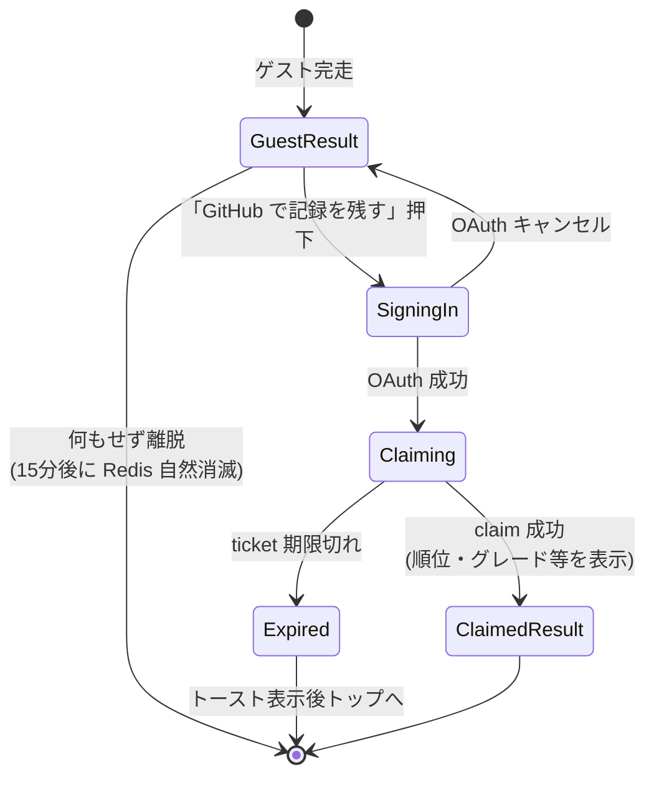
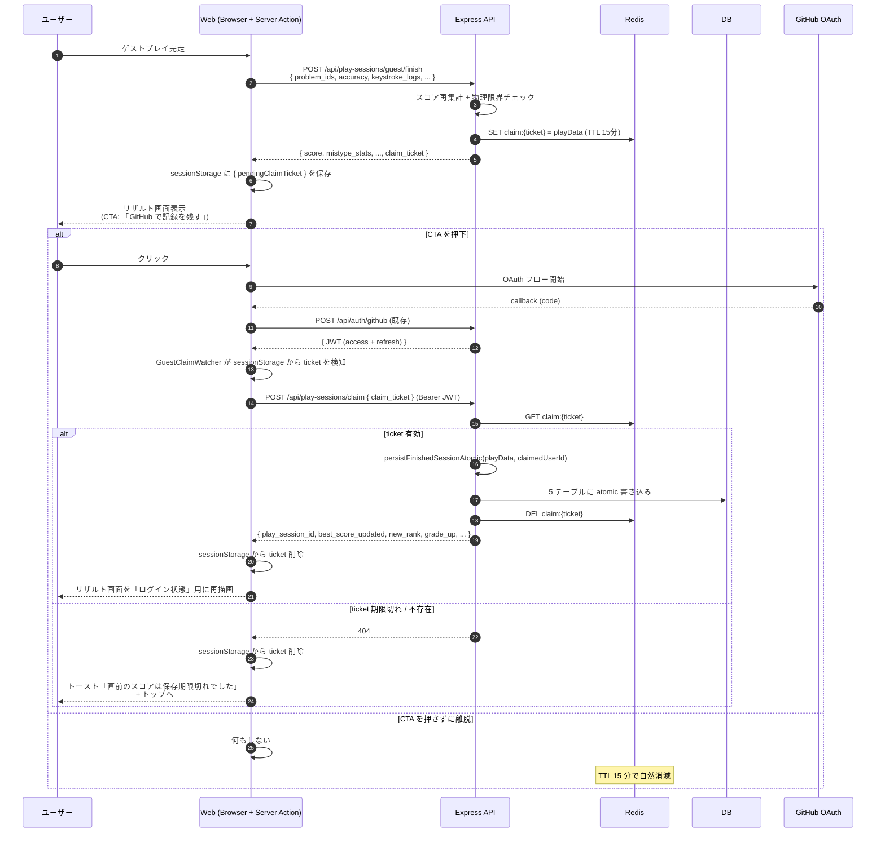

# ゲストプレイ後のスコア引き継ぎ（claim）

ゲストとしてタイピングプレイを完走した直後にユーザーが GitHub OAuth でログインすると、**そのプレイ結果をログインしたアカウントに紐付けて DB に保存する**機能。離脱率を下げてランキングへの新規流入を増やすことを目的とする。

このドキュメントは **仕様（What）** と **設計（How）** を分けて記述する：

- **仕様**：ユーザーから見える挙動・データの扱い・期限・成功失敗時の表示
- **設計**：Redis claim ticket 方式の根拠、API surface、データ shape、セキュリティ

## 関連 spec

- [`../typing-engine/README.md` 「セッション保存ポリシー」](../typing-engine/README.md#セッション保存ポリシー) — ゲストプレイ自体の挙動。本機能は完走直後の延長線上で発火する
- [`../github-auth/README.md` 「ゲスト → ログイン時のスコア引き継ぎ方針」](../github-auth/README.md#ゲスト--ログイン時のスコア引き継ぎ方針) — 本機能を反映して「引き継ぎあり」に方針更新
- [`../score-ranking/README.md` 「スコア保存対象」](../score-ranking/README.md#スコア保存対象) — claim 経由で書き込まれるスコアもランキング対象

## 目次

- [仕様](#仕様)
  - [機能の発動条件](#機能の発動条件)
  - [対象データの粒度](#対象データの粒度)
  - [保持期限と失敗時の挙動](#保持期限と失敗時の挙動)
  - [リザルト画面の状態遷移](#リザルト画面の状態遷移)
- [設計](#設計)
  - [データの保管場所：サーバー Redis ticket 方式](#データの保管場所サーバー-redis-ticket-方式)
  - [OAuth との繋ぎ込み：sessionStorage 経由](#oauth-との繋ぎ込みsessionstorage-経由)
  - [DB 書き込みの再利用](#db-書き込みの再利用)
  - [セキュリティ / 不正対策](#セキュリティ--不正対策)
  - [エッジケース](#エッジケース)
- [必要な画面](#必要な画面)
- [必要な API](#必要な-api)
- [必要な DB 設計](#必要な-db-設計)
- [フロー図](#フロー図)
- [MVP 対象外（将来検討）](#mvp-対象外将来検討)

---

## 仕様

### 機能の発動条件

- **ゲストプレイの完走直後**、リザルト画面に「💾 このスコアは保存されていません」+「GitHub で記録を残す」CTA が表示される
- ユーザーがこの CTA を押下し、**OAuth フローを完走（同一ブラウザタブ内）** した場合のみ、直前のスコアが claim される
- 完走から **15 分以内** に claim する必要がある
- claim の対象は **直前の 1 ゲスト完走分のみ**（複数を貯めることはしない）

### 対象データの粒度

claim が成功すると、ログイン経由の通常 `/finish` と **完全に同等のデータ** が DB に書き込まれる。具体的には次の 5 テーブル：

| テーブル | 書き込む内容 |
|---|---|
| `play_sessions` | claim したユーザーの 1 行（accuracy / typedChars / score / mode / mistypeStats など） |
| `play_session_problems` | 出題された 20 問のシーケンス |
| `keystroke_logs` | プレイ中のキーストロークログ（gzip 圧縮 bytea。ゴースト併走 / リプレイ視聴の原資となる） |
| `user_lifetime_stats` | 加算 upsert（totalSessions, totalTypedChars 等）+ グレード再判定 |
| `user_language_best` | ベスト更新時のみ |

これにより claim 済みのゲストプレイは **ランキング集計 / ゴースト併走の対象 / 達成カード生成 / Hall of Fame 入賞** のすべてで通常プレイと同等に扱われる。データの shape を一貫させることで、claim 由来かどうかをアプリケーション層で意識する必要をなくす。

### 保持期限と失敗時の挙動

- claim ticket の TTL は **15 分**。これは「リザルト画面 → CTA 押下 → OAuth 同意画面 → 戻り → claim 実行」の往復に十分な余裕
- 期限切れで claim できなかった場合：ログイン自体は成功するため、**「ログインは完了したが直前のスコアは保存期限切れだった」とトーストで通知**し、トップ画面に遷移
- OAuth を途中でキャンセル / 失敗：sessionStorage 上の claim 情報は次回ゲストプレイ完走時に上書きされる。ユーザーが何もしなければ 15 分で Redis から自然消滅

### リザルト画面の状態遷移



---

## 設計

### データの保管場所：サーバー Redis ticket 方式

**候補との比較**：

| 案 | 中身 | Pros | Cons |
|---|---|---|---|
| **採用: サーバー Redis claim ticket** | サーバーが完走時データを Redis に格納し、不透明な `claim_ticket` をクライアントに返す | サーバーが信頼の単一情報源 / クライアントは ticket だけ持ち回り / 二重 claim を Redis 削除で防止 | Redis storage（1 claim あたり ~10-50KB） |
| 不採用: クライアント (sessionStorage) + 署名トークン | サーバーが署名済み JWT 風トークンを発行、クライアントが完走データと一緒に保持 | Redis storage 不要 | JWT 署名インフラ要 / 二重 claim 防止が複雑 |
| 不採用: aggregate のみ Redis（ハイブリッド） | スコア集計値だけ Redis、keystrokeLog は持たない | Redis 容量小 | claim 後の row が ghost/replay 非対応で不整合 |

**採用理由**：

- **shape 一貫性**: 既存の `persistFinishedSessionAtomic` をそのまま再利用でき、claim 経由 / 通常 finish 経由のどちらでも play_session の shape が同一になる
- **改ざん耐性**: サーバーが集計済みデータを保持するため、claim 時にクライアントから渡るのは ticket（UUID）だけ。スコア偽装の余地が無い
- **二重 claim 防止**: Redis から削除すれば物理的に再利用不可能

### OAuth との繋ぎ込み：sessionStorage 経由

**候補との比較**：

| 案 | 方式 | Pros | Cons |
|---|---|---|---|
| **採用: sessionStorage** | クライアントが ticket を sessionStorage で保持、OAuth 戻り後に取り出して claim | OAuth state を汚さない / sign-in 動線変更最小 | private window で sessionStorage が消える環境がある（実害ほぼ無し） |
| 不採用: OAuth state に同梱 | `/sign-in?claim_ticket=xxx` で渡して callback で復元 | sessionStorage 非依存 | OAuth state が冗長化、callback の改修が要る |

**実装ポイント**：

- ゲストプレイの完走時に `sessionStorage.setItem("pendingClaimTicket", ticket)` する
- ログイン後の画面（トップなど）に **GuestClaimWatcher Client Component** を仕込み、`useEffect` で sessionStorage を見て ticket があれば自動で claim を試みる
- claim 成功時は sessionStorage から削除し、結果画面を再描画
- 失敗時（401 / 404）も sessionStorage から削除して再試行を止める

### DB 書き込みの再利用

`finishSession` で使われている `persistFinishedSessionAtomic`（5 テーブル atomic transaction）を **そのまま** claim Service から呼ぶ。

```ts
// claimGuestSession 内
const state: PlaySessionState = {
  crawledRepoId: data.crawledRepoId,
  ghostSessionId: data.ghostSessionId,
  languageId: data.languageId,
  mode: data.mode,
  problemIds: data.problemIds,
  userId: input.userId,  // ← OAuth 認証されたユーザーの id
}
await persistFinishedSessionAtomic(
  { ...data, state, playedAt: new Date(data.playedAt) },
  repo,
)
```

これにより claim 経由のスコアでも以下が自動的に発火する：

- ランキング順位の更新
- グレード再判定 + 達成カード PNG 自動生成
- ベスト更新時の `bestPlaySessionId` 連携

### セキュリティ / 不正対策

| 攻撃 | 対策 |
|---|---|
| 他人の ticket を奪う | ticket は sessionStorage 内のみ、TLS 経由でしか送られない |
| ticket 横流しで他アカウントに claim | claim API は `req.userId` 宛にしか書かない（client 指定不可） |
| 二重 claim で同じスコアを別アカウントに | claim 成功時に Redis から DEL するので物理的に不可 |
| Redis 容量攻撃 | TTL 15 分 + 1 guest finish あたり ~30KB なら問題無し（将来 rate limit を検討） |
| 期限切れ ticket での再現攻撃 | 15 分 TTL で自然消滅 |
| ticket 改ざんで偽スコア | ticket は UUID で乱数、Redis に対応 entry が無ければ 404 |
| 偽 finish データで claim | スコアは `/guest/finish` 時点で server-validated（物理限界チェック、サーバー側再集計）。claim 時点では追加チェック不要 |

物理限界チェック（`typedChars × accuracy` の上限 1500 文字）は `/guest/finish` の段階で適用済みで、その validated データが Redis に保存される。**claim 時点での改ざんリスクは存在しない**。

### エッジケース

| ケース | 挙動 |
|---|---|
| OAuth 中断 / ユーザーが戻ってきた | sessionStorage に ticket 残置、次に CTA を再度押す or 自然削除 |
| 既に DB に最新ベストがある状態で claim | `persistFinishedSessionAtomic` の `upsertIfBest` が `false` を返し、`best_score_updated: false`。スコアは `play_sessions` には積まれる |
| Challenge gods モードのゲスト → claim | `mode=challenge_gods` で persist。`ghostSessionId` は guest 完走時に Redis に保持済みなのでそのまま使う |
| 15 分の TTL を超えて claim | `/api/play-sessions/claim` が 404。Web 側は「直前のスコアは保存期限切れだった」とトーストで通知してトップへ |
| サインアウト後に新たなゲストプレイ → ログイン | 通常通り claim 動作。前のセッション cookie はクリア済み |
| 連続で 2 回ゲストプレイ → ログイン | sessionStorage は **直前の 1 件のみ** を保持（後勝ち）。1 件目の ticket は 15 分で自然消滅 |

---

## 必要な画面

| 画面 | 概要 |
|---|---|
| リザルト画面（ゲスト用、既存） | 「GitHub で記録を残す」CTA は既存のまま。完走時に sessionStorage への ticket 保存ロジックを追加 |
| claim 成功時の表示 | 既存リザルト画面に persisted=true の結果を渡して再描画（順位・グレード等を追加表示） |
| claim 失敗時の表示（新規 UI 要素） | トースト「直前のスコアは保存期限切れでした」 |

リザルト画面の専用ルートは追加しない。トップ画面に仕込む `GuestClaimWatcher` Client Component が sessionStorage 起点で自動発火する。

## 必要な API

### Express API

| メソッド | パス | 説明 |
|---|---|---|
| POST | `/api/play-sessions/guest/finish` | 既存。レスポンスに `claim_ticket: string` を **追加**。Service で Redis にも claim 用データを保存 |
| POST | `/api/play-sessions/claim` | **新規**。Body: `{ claim_ticket: string }`。Bearer JWT 認証必須。Redis から ticket データを引き、`persistFinishedSessionAtomic` で 5 テーブルに書き込み、Redis から ticket を削除。レスポンスは `FinishPlaySessionResponse` と同形（クライアントが claim と通常 finish を同じ shape として扱えるように） |

### Web (Next.js)

| URL / シンボル | 種別 | 説明 |
|---|---|---|
| `apps/web/src/libs/claim-guest-session.ts#claimGuestSessionAction` | Server Action | sessionStorage から取り出した ticket で Express の `/api/play-sessions/claim` を proxy |
| `apps/web/src/components/guest-claim-watcher.tsx` | Client Component | layout 等に常設し、`useEffect` で sessionStorage の ticket を検知して claim を起動 |

## 必要な DB 設計

**新規テーブルは無し**。既存の 5 テーブル（`play_sessions` / `play_session_problems` / `keystroke_logs` / `user_lifetime_stats` / `user_language_best`）にそのまま書き込む。

### Redis に新規格納するデータ

| key | value | TTL |
|---|---|---|
| `claim:{uuid}` | `GuestClaimTicketData`（下記）の JSON シリアライズ | 900 秒（15 分） |

```ts
export type GuestClaimTicketData = {
    accuracy: number
    crawledRepoId: number
    ghostSessionId: number | null
    keystrokeLogs: KeystrokeLogs       // /guest/finish 時のサーバー受信ログをそのまま保存
    languageId: number
    mistypeStats: MistypeStats
    mode: PlaySessionMode               // "solo" | "challenge_gods"
    playedAt: string                    // ISO 8601
    problemIds: number[]
    problemsCompleted: number
    problemsPlayed: number
    score: number
    typedChars: number
}
```

---

## フロー図



---

## MVP 対象外（将来検討）

| 項目 | 理由 |
|---|---|
| **複数の claim を貯められる仕組み** | 「直前 1 件のみ」で十分。複数貯まると UX が複雑化し、UI で「どのプレイを保存するか選択」が必要になる |
| **claim の rate limit** | 攻撃検知の設計と一緒にあとから入れる |
| **claim 成功率の analytics** | KPI 確定後に observability 計装 |
| **モバイル app からの claim** | Web のみ先行。後から mobile に拡張する場合は OAuth 戻り先と sessionStorage 相当を再設計 |
