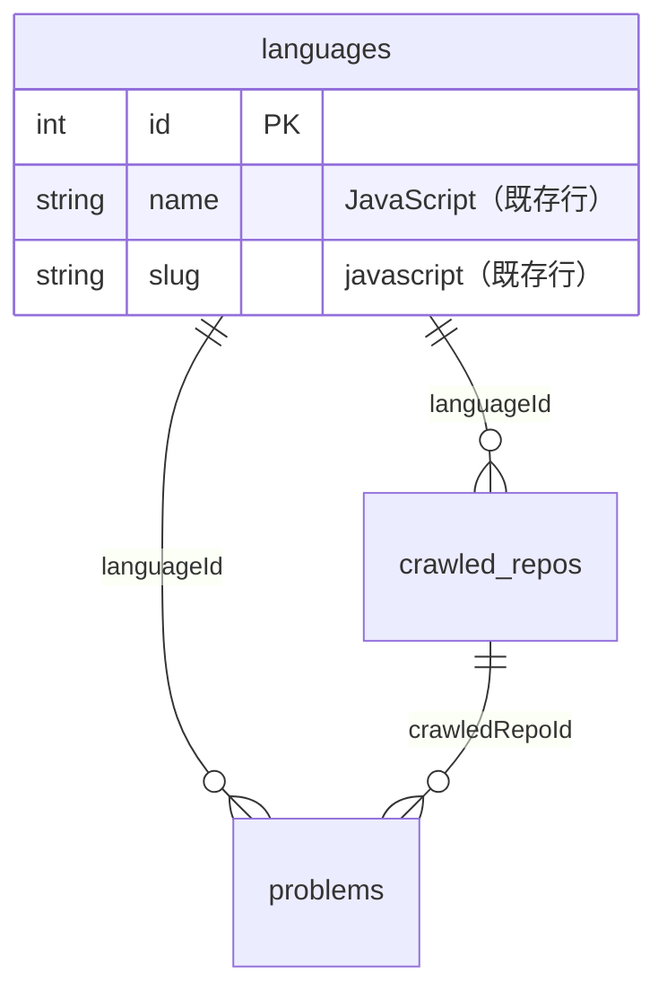
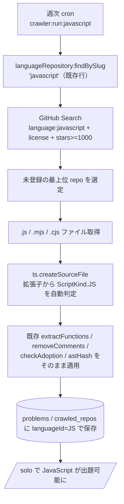

# JavaScript 対応

初期リリースの対応言語に **JavaScript** を加える。TypeScript と同じ「週次 cron で OSS から関数を抽出して問題プールに蓄積する」仕組みをそのまま流用し、**JavaScript 専用のクローラ task を 1 本追加するだけ**で playable にする。

ポイントは「JavaScript はほぼ無料で増やせる」こと。理由は 2 つ：

1. `languages` マスタには **すでに `JavaScript`（slug: `javascript`）行が存在する**（`20260626120000_seed_master_languages`）。DB 変更は不要。
2. AST 抽出に使っている **TypeScript Compiler API は `.js` / `.mjs` / `.cjs` をそのままパースできる**。`extract-functions` / `remove-comments` / `adoption-check` / `normalize-for-hash` / `process-repo` を一切変更せず再利用できる。

このドキュメントは **仕様（What）** と **設計（How）** を分けて記述する：

- **仕様**：ユーザーから見て JavaScript が「対応言語」として何ができるようになるか
- **設計**：既存パイプラインのどこを流用し、何を 1 本だけ足すか

## 関連 spec

- [`../problem-pool/README.md`](../problem-pool/README.md) — クローラ本体の **正本**。本機能は「JavaScript 用 cron」の言語固有部分のみを定義し、抽出条件・採用ルール・出題ロジックはすべて problem-pool に従う
- [`../language-master/README.md`](../language-master/README.md) — 言語タブの動的化。`languages` マスタの正本。JavaScript 行は既存
- [`./../go-support/README.md`](../go-support/README.md) — もう一方の初期リリース追加言語。Go は別 parser が必要で設計が大きく異なる（対比のため）

## 目次

- [仕様](#仕様)
  - [JavaScript が対応言語になるとは](#javascript-が対応言語になるとは)
  - [対象ファイル](#対象ファイル)
  - [抽出・採用ルール（problem-pool 準拠）](#抽出採用ルールproblem-pool-準拠)
  - [JavaScript 固有の除外](#javascript-固有の除外)
  - [運用（ブートストラップ）](#運用ブートストラップ)
- [設計](#設計)
  - [既存パイプラインの再利用範囲](#既存パイプラインの再利用範囲)
  - [追加する JavaScript 用 cron task](#追加する-javascript-用-cron-task)
  - [TypeScript Compiler API で JS をパースする](#typescript-compiler-api-で-js-をパースする)
  - [GitHub Search の language フィルタ](#github-search-の-language-フィルタ)
  - [Web 側の有効化](#web-側の有効化)
  - [インフラ（EventBridge スケジュール）](#インフラeventbridge-スケジュール)
- [必要な画面](#必要な画面)
- [必要な API](#必要な-api)
- [必要な DB 設計](#必要な-db-設計)
- [フロー図](#フロー図)
- [step ファイル](#step-ファイル)
- [注意事項](#注意事項)

---

## 仕様

### JavaScript が対応言語になるとは

- 言語選択 / ランキング / 殿堂入り等の各画面に **JavaScript タブ**が表示され、選択できる（マスタ駆動なので行は既存、UI の「近日公開」ゲートを外すだけ）。
- ソロモード（`POST /api/play-sessions/solo`）で言語に JavaScript を選ぶと、**JavaScript の OSS から抽出された関数 20 問**が出題される。
- ランキング・月間ランキング・殿堂入り・特典が **JavaScript 軸**で機能する（これらはすべて `languageId` 駆動で既存実装がそのまま効く）。

唯一の前提は **JavaScript の問題プールが空でないこと**。本機能の主目的は、その問題プールを埋めるための **JavaScript 用クローラを稼働させる**ことにある。

### 対象ファイル

GitHub Search で `language:JavaScript` の repo を取得し、各 repo 内の以下の拡張子を問題候補ソースとする：

- `.js`（標準）
- `.mjs`（ES Modules）
- `.cjs`（CommonJS）

`.jsx` は **MVP では対象外**（problem-pool の「`.tsx` / `.jsx` は対象外でスタート」方針に揃える）。

### 抽出・採用ルール（problem-pool 準拠）

抽出単位・採用条件・重複排除・コメント除去・出典保存・出題抽選は **[problem-pool](../problem-pool/README.md) と完全に同一**。JavaScript 固有のルールは設けない：

- 抽出単位：`FunctionDeclaration` / `MethodDeclaration` / `const foo = (...) => {}` / `const foo = function (...) {}`
- 採用条件：コメント除去後 200〜700 文字 / 8〜40 行 / 1 行 120 文字以下 / 非 ASCII 0 文字 / 関数名あり
- 重複排除：AST 正規化ハッシュ（`@@unique([languageId, astHash])`）
- repo 単位：採用候補 30 個未満は `disabled`、30 個以上はランダム最大 100 問を保存

### JavaScript 固有の除外

テストフレームワークの構造は問題として不適切なため除外する。除外関数名は problem-pool と共通（`test` / `it` / `describe` / `beforeEach` / ...）。ファイルパスの除外パターン（`*.test.*` / `*.spec.*` / `__tests__/` / `node_modules/` / `dist/` 等）は **既存 `GithubClient` の `EXCLUDED_TREE_PATTERNS` がそのまま JavaScript にも効く**（`[jt]sx?` を含む正規表現で定義済み）。

### 運用（ブートストラップ）

- TypeScript と同様、`CRAWLER_REPOS_PER_RUN`（デフォルト 1）でローンチ初期だけ 5 等に上げ、50 repo まで一気に積み上げてから 1 に戻す。
- TypeScript 用 cron とは **別タスク・別スケジュール**で動く（1 言語の rate limit / 障害が他言語に波及しない）。

---

## 設計

### 既存パイプラインの再利用範囲

JavaScript 対応で **変更を加えない**（そのまま使う）既存資産：

| ファイル | 再利用 |
|---|---|
| `apps/cron/src/ast/extract-functions.ts` | そのまま（TS Compiler API は JS の関数ノードも同じ型で返す） |
| `apps/cron/src/ast/remove-comments.ts` | そのまま（`//` `/* */` は JS と共通） |
| `apps/cron/src/ast/adoption-check.ts` | そのまま |
| `apps/cron/src/ast/normalize-for-hash.ts` | そのまま |
| `apps/cron/src/service/crawler/process-repo.ts` | そのまま（`ts.createSourceFile` は拡張子から JS を自動判定） |
| `apps/cron/src/service/crawler/pick-next-repo.ts` | そのまま（`language.slug` を Search に渡すだけ） |
| `apps/cron/src/client/github/*` | そのまま（`targetExtensions` を JS 用に渡すだけ） |
| `apps/cron/src/repository/prisma/*` | そのまま（`languageId` 駆動） |

つまり **JavaScript のために書く新規コードは task 1 本のみ**。

### 追加する JavaScript 用 cron task

`apps/cron/CLAUDE.md` の「新言語追加時は `task/crawler-run-<slug>.ts` を新規作成し、`LANGUAGE_SLUG` と `RUN_TYPE = "crawler_<slug>"` をハードコードする」に従う。

`apps/cron/src/task/crawler-run-javascript.ts`（`crawler-run-typescript.ts` のコピーで差分は 3 定数 + 拡張子のみ）：

```ts
const LANGUAGE_SLUG = "javascript"
const RUN_TYPE = "crawler_javascript"
const TASK_NAME = "crawler-run-javascript"

// GithubClient の targetExtensions のみ JS 用に変更
targetExtensions: /\.(js|mjs|cjs)$/,
```

`package.json` に実行コマンドを追加：

```jsonc
"crawler:run:javascript": "dotenvx run -f .env.local -- tsx src/task/crawler-run-javascript.ts"
```

> `crawler_runs.runType = "crawler_javascript"` で TypeScript run と区別される。`crawler_run_items` / `crawled_repos` / `problems` はすべて `languageId` で分離されるため、両言語の cron が同じテーブルを共有しても干渉しない。

### TypeScript Compiler API で JS をパースする

`ts.createSourceFile(fileName, source, ScriptTarget.Latest, true)` は **ファイル名の拡張子から `ScriptKind` を自動推定**する（`.js` → `ScriptKind.JS`、`.mjs` → `JS`、`.cjs` → `JS`）。`process-repo.ts` は `file.path`（`.js` 等）を第 1 引数に渡しているため、**コード変更なしで JS が正しくパースされる**。

JS 特有の構文（CommonJS の `module.exports = function () {}`、`require()` 等）も AST 上は `FunctionDeclaration` / `FunctionExpression` として現れ、既存 `extractFunctions` の抽出対象（名前付き関数）にそのまま乗る。`module.exports.foo = function(){}` のような無名代入は名前が取れず採用されない（problem-pool の「無名関数は除外」と整合）。

### GitHub Search の language フィルタ

`GithubClient.searchRepos(language, page)` は `language:${language}` を組み立てる（`client.ts:137`）。`pickNextRepo` が `language.slug`（=`"javascript"`）を渡すため、`language:javascript` で検索される。GitHub の `language:` 修飾子は **大文字小文字を区別しない**ため slug `javascript` で正しく JavaScript repo に一致する。**Search 周りのコード変更は不要**。

### Web 側の有効化

`languages` マスタに JavaScript 行は既存だが、UI 側で JavaScript を「近日公開（comingSoon）」としてゲートしている場合は、そのゲートを外す：

- `apps/web/src/app/language-selector.tsx` の `comingSoon` 判定
- `apps/web/src/app/page.tsx` の対応言語バッジ表記

> UI の確定仕様・スクショは実装フェーズで詰める（本 PR は設計のみ）。データソースは `language-master` の `getLanguages()` を踏襲し、**新規のハードコードは増やさない**。

### インフラ（EventBridge スケジュール）

本番は TypeScript 用と同型の **EventBridge → ECS Scheduled Task** を 1 つ追加して `crawler:run:javascript` を定期起動する（毎週月曜、TypeScript とは時間をずらす）。Terraform 変更は **アプリ実装とは別 PR** に分離する（infra/app を 1 PR にしない方針）。詳細は [`step3-infra-schedule-javascript.md`](./step3-infra-schedule-javascript.md)。

---

## 必要な画面

| 画面 | 変更内容 |
|---|---|
| 言語選択 / home / ranking 等 | JavaScript タブの `comingSoon` ゲートを外す（マスタ行は既存、`getLanguages()` 駆動）。新規画面なし |

## 必要な API

新規 API なし。既存の `POST /api/play-sessions/solo` 等が `languageId`（JavaScript）でそのまま機能する。

## 必要な DB 設計

**スキーマ変更なし・マイグレーション不要**。`languages` テーブルの JavaScript 行は `20260626120000_seed_master_languages` で投入済み。`crawled_repos` / `problems` / `crawler_runs` / `crawler_run_items` はすべて `languageId` で言語を分離するため、JavaScript のデータは既存テーブルに追記されるだけ。



## フロー図



## step ファイル

| step | 内容 |
|---|---|
| [step1-cron-crawler-javascript.md](./step1-cron-crawler-javascript.md) | `crawler-run-javascript.ts` task + `package.json` スクリプト + 動作確認 |
| [step2-web-enable-javascript.md](./step2-web-enable-javascript.md) | UI の comingSoon ゲート解除 |
| [step3-infra-schedule-javascript.md](./step3-infra-schedule-javascript.md) | EventBridge / ECS Scheduled Task（**別 PR**） |

## 注意事項

- **問題プールの薄さ**：稼働直後は JS プールが空なので、`/solo` で JavaScript を選ぶと 404（20 問未満）になる。ローンチ前に `CRAWLER_REPOS_PER_RUN` を上げてブートストラップし、各言語 200 問以上を目標に積む（problem-pool の目標に準拠）。
- **`.jsx` 除外**：React コンポーネントが多い repo では `.js` だけだと候補が少ない可能性がある。MVP は `.jsx` 除外でスタートし、プール不足が顕在化したら緩和を検討（problem-pool の TSX/JSX 方針と同じ判断軸）。
- **TS と JS のコード重複検知**：`astHash` は `languageId` ごとの UNIQUE。TS と JS は別 `languageId` なので、同一ユーティリティが両言語に存在しても互いを弾かない（言語ごとに独立したプールを持つ意図どおり）。
- **ミニファイ済み JS の混入**：`.min.js` のような 1 行巨大ファイルは `MAX_FILE_SIZE`（100KB）と 1 行 120 文字上限で自然に弾かれるが、`dist/` 除外パターンも効くため二重に防御される。
</content>
</invoke>
