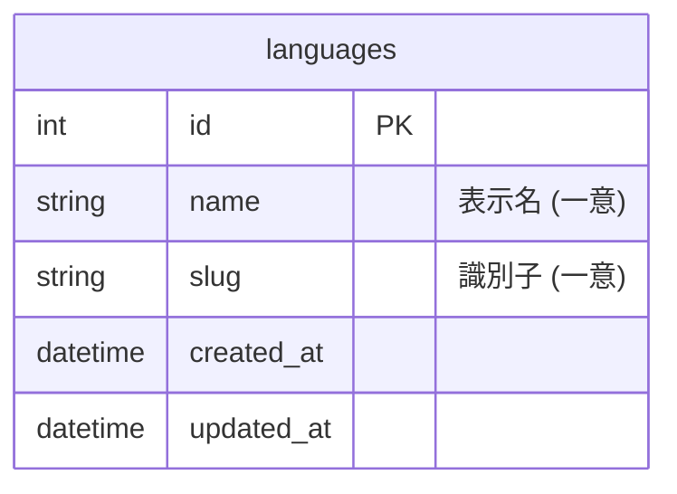
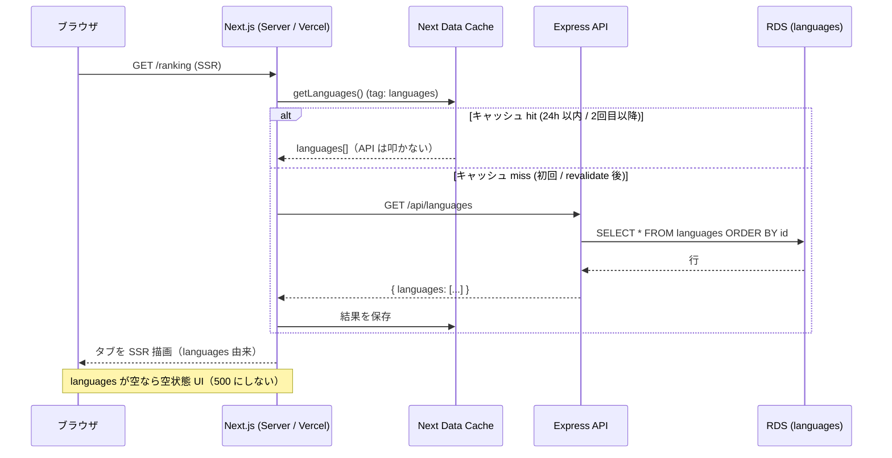

# 言語マスタの動的化

各画面の言語タブ（TypeScript / JavaScript …）を、フロントのハードコードではなく **DB の言語マスタ（`languages` テーブル）を API 経由で取得して描画**する。新しい言語を増やすときに migration で 1 行追加するだけで全画面に反映されるようにし、フロント各所に散らばった重複定義（`SUPPORTED_LANGUAGES`）を一掃する。

このドキュメントは **仕様（What）** と **設計（How）** を分けて記述する：

- **仕様**：ユーザーから見える挙動・ルール・データの意味
- **設計**：実装にあたっての技術的な選択と制約

## 関連 spec

- [`../problem-pool/README.md`](../problem-pool/README.md) — クローラが言語 `slug` を GitHub Search の `language:` フィルタに使う。言語マスタの **正本**（行の追加はこの文脈で行う）
- [`../score-ranking/README.md`](../score-ranking/README.md) — ランキングは言語軸。タブの言語一覧が本機能の対象
- [`../monthly-ranking/README.md`](../monthly-ranking/README.md) — 月間ランキングの言語タブも対象

## 目次

- [仕様](#仕様)
  - [言語マスタの意味](#言語マスタの意味)
  - [各画面のタブ描画ルール](#各画面のタブ描画ルール)
  - [選択中の言語の決定](#選択中の言語の決定)
  - [データが無い場合の挙動](#データが無い場合の挙動)
  - [言語の追加運用](#言語の追加運用)
- [設計](#設計)
  - [GET /api/languages（公開エンドポイント）](#get-apilanguages公開エンドポイント)
  - [キャッシュ戦略（Next.js Data Cache）](#キャッシュ戦略nextjs-data-cache)
  - [getLanguages() ヘルパへの集約](#getlanguages-ヘルパへの集約)
  - [空配列ハンドリング](#空配列ハンドリング)
  - [スキーマの enum との関係](#スキーマの-enum-との関係)
- [必要な画面](#必要な画面)
- [必要な API](#必要な-api)
- [必要な DB 設計](#必要な-db-設計)
- [フロー図](#フロー図)

---

## 仕様

### 言語マスタの意味

- 「対応言語」は `languages` テーブルの行で表現される（現状: TypeScript / JavaScript）。
- 各言語は **表示名 `name`（"TypeScript"）** と **識別子 `slug`（"typescript"）** を持つ。
- `slug` は URL のクエリ（`/ranking?language=typescript`）・API のフィルタ・クローラの言語指定に使う一意キー。

### 各画面のタブ描画ルール

- home / ranking / crawled-repos / hall-of-fame / play の言語タブは、**マスタから取得した一覧をそのままの並び順で描画**する。
- 並び順は **追加順（`id` 昇順）**。最初に登録された言語（TypeScript）が先頭。
- タブのラベルは `name`、リンク/選択値は `slug`。

### 選択中の言語の決定

- クエリ `?language=<slug>` が **マスタに存在する slug** なら、それを選択。
- 無効 or 未指定なら **一覧の先頭（`languages[0].slug`）** を選択（フォールバック）。

### データが無い場合の挙動

- 言語マスタが空（`languages` が 0 件）の場合、**タブを描画せず空状態メッセージ**を出す（例：「対応言語が準備中です」）。
- **本来は migration で必ず 1 件以上投入されるため発生しない**が、防御的に空状態を持つ（500 で落とさない）。

### 言語の追加運用

- 新言語は **migration で `languages` に 1 行追加**する（[`../problem-pool`](../problem-pool/README.md) のクローラ追加とセット）。
- フロントの修正は不要。再デプロイ（または `revalidateTag("languages")`）で全画面のタブに自動反映される。

---

## 設計

### GET /api/languages（公開エンドポイント）

- **認証不要**（home / ranking 等の公開ページが SSR で叩くため、`proxy.ts` の公開 API としても扱う）。
- `languages` テーブルを `id` 昇順で全件返す。件数は将来も数件〜十数件オーダーで、ページングは不要。
- 既存 `LanguageRepository` に `findAll()` を追加して利用する（`apps/api/CLAUDE.md` のレイヤード構成に従う）。

### キャッシュ戦略（Next.js Data Cache）

各画面で都度 API を叩くのは非効率なため、**Next.js のサーバ側 Data Cache** で「実質 1 回だけ取得して全画面・全リクエストで共有」する。

- フロントに `getLanguages()` ヘルパ（Server 専用）を 1 つ用意し、`fetch(\`${API_URL}/api/languages\`, { next: { revalidate: 86400, tags: ["languages"] } })` で取得。
- これにより:
  - 初回以降は **Data Cache から返り API は叩かれない**（24h ごと、または明示 revalidate 時のみ再取得）。
  - **SSR のままタブが描画される**（クライアント JS 不要・チラつき無し・SEO 維持）。
- 言語マスタを更新したとき（migration で追加）に最新化したい場合は、**`revalidateTag("languages")`**（管理操作 or デプロイ後フック）で即時無効化できる。MVP では 24h revalidate のみで十分。

> 補足: 「ブラウザキャッシュ」ではなくサーバ側 Data Cache を採用。SSR を維持しつつ「各画面で API を叩かない」という目的を、クライアント実装の追加（provider / localStorage / ローディング状態）なしに達成できるため。

### getLanguages() ヘルパへの集約

- 現状 `SUPPORTED_LANGUAGES = ["typescript", "javascript"]` が **ranking / crawled-repos / hall-of-fame / play に重複**している。これらを **`getLanguages()` の戻り値**に置き換え、定義を 1 箇所に集約する。
- 各 Server Component は `const languages = await getLanguages()` を呼び、タブ描画・選択言語の決定に使う。

### 空配列ハンドリング

- `getLanguages()` は API 失敗時や 0 件時に **空配列 `[]` を返す**（throw しない＝ページ全体を 500 にしない）。
- 各ページは `languages.length === 0` のとき空状態 UI を出す。
- 選択言語の決定も `languages[0]?.slug ?? null` のように **空を考慮**する。

### スキーマの enum との関係

- 既存の `REWARD_LANGUAGES`（`z.enum`）等の **バリデーション用 enum は本 PR では変更しない**（reward 生成など別ドメインの検証に使われ、動的化は影響範囲が大きいため）。
- 本機能は **「画面のタブ表示」の動的化に限定**する。バリデーション enum の動的化は将来の別タスク（必要になったら deferred として切り出す）。

---

## 必要な画面

| 画面 | 変更内容 |
|---|---|
| home (`/`) | 言語タブ（月間トップ / クロール対象リポジトリのサイドバー）を `getLanguages()` 由来に |
| ranking (`/ranking`) | `SUPPORTED_LANGUAGES` を `getLanguages()` に置換 + 空状態 |
| crawled-repos (`/crawled-repos`) | 同上 |
| hall-of-fame (`/hall-of-fame`) | 同上 |
| play (`/play`) | 言語選択タブを `getLanguages()` に |

> いずれも **既存 UI / デザインは変えない**（データソースの差し替えのみ）。`design-mock` は不要。

## 必要な API

| メソッド | パス | 認証 | 概要 |
|---|---|---|---|
| GET | `/api/languages` | 不要（公開） | 言語マスタを `id` 昇順で全件返す |

レスポンス例:

```json
{
  "languages": [
    { "id": 1, "name": "TypeScript", "slug": "typescript" },
    { "id": 2, "name": "JavaScript", "slug": "javascript" }
  ]
}
```

## 必要な DB 設計

**スキーマ変更なし**。既存の `languages` テーブルをそのまま参照する。マスタ行は migration で管理（[`../problem-pool`](../problem-pool/README.md) / `20260626120000_seed_master_languages`）。



## フロー図


