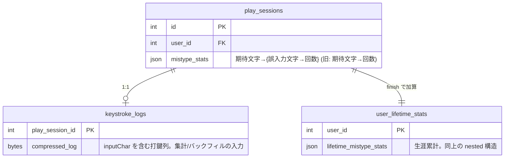
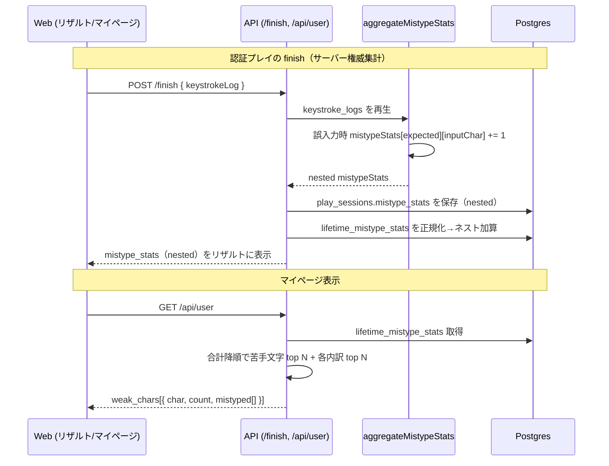

# 苦手文字の誤入力内訳（mistype-confusion）

苦手文字（誤打鍵の多い文字）を「文字 × 回数」で並べるだけだと、なぜ間違えるのかが分からない。本機能は **「打つべきだった文字（期待文字）」に対して「実際に何を打ってしまったか（誤入力文字）」の内訳** を併記し、ユーザーが自分のクセ（例：`{` を打つべき所で `(` をよく打つ）を具体的に把握できるようにする。

タイピングエンジンの改修は不要で、**誤入力文字は既に keystroke_logs に記録済み**（集計時に捨てているだけ）。本機能は集計・保存・表示のデータ構造を「文字 → 回数」から「期待文字 → {誤入力文字 → 回数}」へ拡張するのが本体。

このドキュメントは **仕様（What）** と **設計（How）** を分けて記述する：

- **仕様**：ユーザーから見える挙動・ルール・データの意味
- **設計**：実装にあたっての技術的な選択と制約

## 関連 spec

- [`../ghost-battle/README.md`](../ghost-battle/README.md) — **keystrokeLog の正本**。誤入力文字 `inputChar` を含むキーストロークログの構造はこちらを参照（本機能はこのログを集計するだけ）
- [`../typing-engine/README.md`](../typing-engine/README.md) — リザルト画面「よく間違える文字」とゲストプレイのクライアント集計バッファ
- [`../score-ranking/README.md`](../score-ranking/README.md) — マイページの生涯統計（苦手文字 top N）と `user_lifetime_stats` のマージ

## 目次

- [仕様](#仕様)
  - [苦手文字に誤入力の内訳を併記する](#苦手文字に誤入力の内訳を併記する)
  - [表示する場所](#表示する場所)
  - [表示の粒度と並び順](#表示の粒度と並び順)
  - [特殊文字の表記](#特殊文字の表記)
  - [過去データの扱い](#過去データの扱い)
- [設計](#設計)
  - [データ構造：flat から nested へ](#データ構造flat-から-nested-へ)
  - [集計はサーバー権威（keystroke_logs 再生）](#集計はサーバー権威keystroke_logs-再生)
  - [後方互換：legacy flat の正規化](#後方互換legacy-flat-の正規化)
  - [生涯統計のマージ](#生涯統計のマージ)
  - [ゲストプレイの集計経路](#ゲストプレイの集計経路)
  - [過去データのバックフィル](#過去データのバックフィル)
- [必要な画面](#必要な画面)
- [必要な API](#必要な-api)
- [必要な DB 設計](#必要な-db-設計)
- [フロー図](#フロー図)

---

## 仕様

### 苦手文字に誤入力の内訳を併記する

従来は「文字 `l` を 3 回間違えた」までしか分からなかった。本機能では、その 3 回の内訳として **「実際には何を打ったか」** を表示する。

例（マイページの苦手文字 1 件）：

```
l  ×3   ← よく間違える文字
   └ 実際は  k ×2 ・ o ×1
```

これにより「`l` の隣の `k` を押しがち」「`{` を打つべき所で `(` を押しがち（Shift の押し間違い）」といった、ユーザー自身のクセが具体的に見える。

### 表示する場所

| 画面 | 集計範囲 | 内容 |
|---|---|---|
| マイページ「⌨ 苦手文字」カード | 生涯累計（全プレイ通算） | 苦手文字 top N に、それぞれの誤入力内訳を併記 |
| リザルト画面「よく間違える文字」 | その回のセッション 1 回分 | 上位の苦手文字に、その回の誤入力内訳を併記 |

認証ユーザーは両方、ゲストプレイはリザルト画面のみ（マイページは認証必須のため対象外）。

### 表示の粒度と並び順

- 苦手文字は **合計誤打数（内訳の合算）の降順** に並べる（従来と同じ順序ロジック）。
- 各苦手文字の誤入力内訳は **回数降順で上位数件** を表示する（多い順に「最も間違えやすい打ち間違い」が分かる）。
- 内訳が 1 種類しかない場合はその 1 件のみ表示する。

### 特殊文字の表記

期待文字・誤入力文字ともに、空白・タブ・改行は見やすい記号に置き換えて表示する（既存の `displayChar` と同じ）。

| 実文字 | 表記 |
|---|---|
| 半角スペース | `␣` |
| タブ | `⇥` |
| 改行 | `⏎` |

### 過去データの扱い

- 過去のプレイ分も、保存済みの keystroke_logs を再集計して **誤入力内訳を復元する**（バックフィル）。
- ただし keystroke_logs が残っていないセッション（ゲスト等でログ未保存の分）は内訳を復元できない。その分は「内訳不明」として合計回数のみ残す（従来表示と同等）。

---

## 設計

### データ構造：flat から nested へ

`mistypeStats` を「期待文字 → 回数」から **「期待文字 → {誤入力文字 → 回数}」** のネスト構造へ拡張する。これが本機能の中核データ構造の **正本**。

```ts
/** 旧（flat）: 期待文字ごとの誤打回数 */
type MistypeStats = Record<string, number>
/** 例: { "l": 3, ";": 5 } */

/** 新（nested）: 期待文字 → 誤入力文字 → 回数 */
type MistypeStats = Record<string, Record<string, number>>
/** 例: { "l": { "k": 2, "o": 1 }, ";": { "'": 5 } } */
```

- ある期待文字の **合計誤打数 = 内訳 value の総和**。苦手文字 top N の並び替えはこの総和で行う（旧仕様と意味が一致）。
- DB 上は元々 Json 列（`mistype_stats` / `lifetime_mistype_stats`）なので **マイグレーション不要**。格納される JSON の shape だけが変わる。

### 集計はサーバー権威（keystroke_logs 再生）

認証プレイの誤打集計は従来どおりサーバーが keystroke_logs を再生して行う（クライアントの自己申告は信用しない）。集計時、サーバーは既に「期待文字（codeBlock から復元）」と「誤入力文字（`inputChar`）」の **両方** を持っているため、内訳を記録するのに新しい入力は不要。

```
誤入力時:  mistypeStats[expected][inputChar] += 1   ← 旧は mistypeStats[expected] += 1
```

`inputChar` は通常 1 文字だが、`Enter` / `Backspace` 等の特殊キー名（複数文字）も入り得る。内訳キーとしてはそのまま文字列で保持し、表示側で `displayChar` 変換する（特殊キー名はそのまま表示）。

### 後方互換：legacy flat の正規化

既存の `lifetime_mistype_stats`（および未バックフィルの `mistype_stats`）は flat（`Record<string, number>`）で保存されている。読み出し・マージ時は **両 shape を受け付ける正規化関数** を通す：

```ts
/** 旧 flat を「内訳不明」扱いの nested に正規化する */
const UNKNOWN_ACTUAL = "?"
const normalizeMistypeStats = (raw): MistypeStats =>
  期待文字ごとに value が number なら { [UNKNOWN_ACTUAL]: number }、
  object ならそのまま nested として扱う
```

バックフィル後はほぼ nested に揃うが、ログが無く復元できない分は `"?"`（内訳不明）として合計のみ保持する。

### 生涯統計のマージ

`user_lifetime_stats.lifetimeMistypeStats` への加算を **ネスト加算** に変更する（`finish` の 1 トランザクション内）。既存値は前述の正規化を通してから期待文字 × 誤入力文字の二段で加算する。

### ゲストプレイの集計経路

ゲストプレイはサーバーに keystroke_logs を保存せず、リザルト用の `mistype_stats` を **クライアントのタイピングエンジンが集計** している。エンジンは入力時に期待文字・実際の入力文字の両方を知っているため、クライアント側の集計も同じ nested 構造に拡張する（サーバーと同じ shape を送る）。

### 過去データのバックフィル

保存済み keystroke_logs を新しい集計ロジックで再生し、過去分の誤入力内訳を復元する一度きりのスクリプト（先の空行バックフィルと同じ運用：`--dry-run` → 本実行、prd は ECS run-task、実行後に削除）。

- **対象**: `play_sessions.mistype_stats`（keystroke_logs があるセッション）と、それを再集計した `user_lifetime_stats.lifetimeMistypeStats`。
- **冪等**: nested に再構築するだけなので再実行しても結果は同じ。
- **ログ欠損分**: keystroke_logs が無いセッションは flat のまま残し、読み出し時に `"?"` 内訳へ正規化する。

詳細手順は [`./step4-backfill-mistype-confusion.md`](./step4-backfill-mistype-confusion.md) を参照。

---

## 必要な画面

| 画面 | 変更内容 |
|---|---|
| マイページ `apps/web/src/app/mypage/page.tsx` | 「⌨ 苦手文字」カードの各行に誤入力内訳（上位数件）を併記 |
| リザルト `apps/web/src/app/play/[sessionId]/result-screen.tsx` | 「よく間違える文字」に誤入力内訳を併記 |

> 確定 UI（内訳の具体的なレイアウト・配色）は `design-mock` skill で詰める。本設計では「どこに何を出すか」までを定義する。

## 必要な API

| メソッド / エンドポイント | 変更内容 |
|---|---|
| `GET /api/user` | `weak_chars[]` を `{ char, count, mistyped: { char, count }[] }` に拡張（内訳を上位 N 件付与） |
| `POST /api/play-sessions/:id/finish` | レスポンスの `mistype_stats` を nested 構造に変更 |
| `POST /api/play-sessions/guest-finish` | 同上（ゲスト） |

## 必要な DB 設計

スキーマ（テーブル定義）は変更なし。`mistype_stats` / `lifetime_mistype_stats` は元々 Json 列で、**格納する JSON の shape だけが flat → nested に変わる**ため **マイグレーション不要**。



## フロー図


