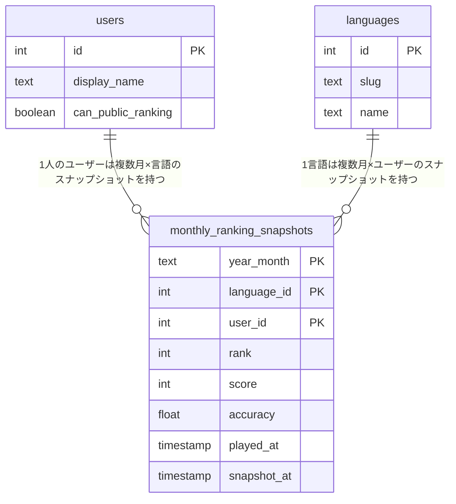
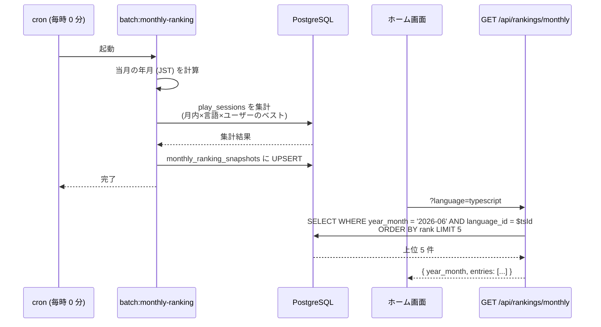

# 月間ランキング

ホーム画面で「**当月の言語別 top 5**」を見られる機能。score-ranking が「全期間オールタイム」を対象にしているのに対し、本機能は「**JST 暦月**」単位の動的なランキングを提供する。プレイヤーが月初に向けて再挑戦するモチベーションを作る目的。

> score-ranking の MVP 方針では「日間/週間/月間ランキングは持たない」と明記していたが、運用フェーズに入って **「全期間トップは固定化しやすく新規参加者の動機が薄い」** との判断から、月間軸を追加する。score-ranking は維持したまま並列で動かす。

このドキュメントは **仕様（What）** と **設計（How）** を分けて記述する：

- **仕様**：何が月間ランキング対象になり、どう表示されるか、月変わりの挙動
- **設計**：cron バッチ + `monthly_ranking_snapshots` テーブル + 単純 SELECT な API、tie-breaking 実装

## 関連 spec

- [`../score-ranking/README.md`](../score-ranking/README.md) — 全期間ランキング。tie-breaking ルール / 公開設定の扱いを揃える
- [`../typing-engine/README.md`](../typing-engine/README.md) — 月間集計の元データである `play_sessions` の生成元
- [`../github-auth/README.md`](../github-auth/README.md) — `publicRanking` 設定の管理元

## 目次

- [仕様](#仕様)
  - [月間ランキングとは](#月間ランキングとは)
  - [当月の定義](#当月の定義)
  - [集計対象セッション](#集計対象セッション)
  - [同点時の順位決定（tie-breaking）](#同点時の順位決定tie-breaking)
  - [プライバシー（`publicRanking`）](#プライバシーpublicranking)
  - [表示要素（ホーム画面）](#表示要素ホーム画面)
  - [月変わりの挙動](#月変わりの挙動)
  - [集計の鮮度](#集計の鮮度)
- [設計](#設計)
  - [集計戦略：毎時バッチ + スナップショット](#集計戦略毎時バッチ--スナップショット)
  - [`monthly_ranking_snapshots` テーブル](#monthly_ranking_snapshots-テーブル)
  - [SQL：1 ヶ月分の集計クエリ](#sql1-ヶ月分の集計クエリ)
  - [タイムゾーン](#タイムゾーン)
  - [API: GET /api/rankings/monthly](#api-get-apirankingsmonthly)
  - [スケール時の対応](#スケール時の対応)
- [必要な画面](#必要な画面)
- [必要な API](#必要な-api)
- [必要な DB 設計](#必要な-db-設計)
- [フロー図](#フロー図)

---

## 仕様

### 月間ランキングとは

- **当月（JST 暦月）の各言語の TOP 5** を、ホーム画面に 2 カラム（TypeScript / JavaScript）で並べる
- 「全期間トップ」とは別軸。score-ranking は引き続き全期間オールタイムを担う

### 当月の定義

- **JST（Asia/Tokyo）の暦月**
- 月初（毎月 1 日 0:00:00 JST）に当月集計範囲が切り替わる
- 月末（月末日 23:59:59.999 JST）まで当月扱い
- 翌月 0:00:00 JST 以降のプレイは翌月集計対象になり、ホーム画面の「当月トップ」は新しい月で集計し直されたものになる

### 集計対象セッション

- **`play_sessions` テーブルに保存された認証済みプレイのみ**
  - ゲストプレイは `play_sessions` に保存されないため自動的に除外される
- **mode は問わない**（`solo` / `challenge_gods` 両方）
- **同じプレイヤーは言語ごとに 1 件**（その月のベストスコア 1 件だけ）
- 不正検知フラグ（将来追加予定の `flagged`）が立ったプレイは集計対象外（MVP では未対応）

### 同点時の順位決定（tie-breaking）

score-ranking と完全に同じルール：

1. `score` 降順
2. `accuracy` 降順
3. `played_at` 昇順（その月内で早く到達した方が上位）

同月内で同じ score / accuracy が並ぶ場合、**先にその記録を出したプレイヤーが上位**。

### プライバシー（`publicRanking`）

- **`users.canPublicRanking = false` のユーザーは集計対象から完全除外**（score-ranking と同じ）
- 非公開ユーザー自身も自分の月間順位は表示されない（API レスポンスに自分の順位を含めない）

### 表示要素（ホーム画面）

カード 2 つ（TypeScript / JavaScript）を横並びで配置。各カード内の各エントリで以下を表示：

- 順位（1〜5）
- アバター + `display_name`
- スコア
- 正確率（小さく副次的に）

「当月（YYYY 年 M 月）」の表示と、対象が 0 件のときの空状態（「まだエントリがありません」）も含む。

### 月変わりの挙動

- 月初 0:00:00 JST に当月集計範囲が更新される
- 月初 0:00 〜 最初のプレイ完走までは「まだエントリがありません」を表示
- **過去の月間トップは MVP では参照できない**（履歴閲覧 UI は作らない。テーブルにはデータが残るため将来追加可能）

### 集計の鮮度

- 集計バッチは **毎時 0 分** に走る
- ホーム画面に出る順位は **最大 1 時間遅れ** 
- リザルト画面で「月間トップに入った」を即時に出す機能は MVP で持たない（実装するとリアルタイム集計クエリが必要になり設計方針と相反）

---

## 設計

### 集計戦略：毎時バッチ + スナップショット

毎時 0 分に cron task が動き、**当月分のスナップショット** を `monthly_ranking_snapshots` テーブルに UPSERT する。

理由：

- ホーム画面に出るランキングは 1 時間遅れで十分（新規参加者が次回ホームを開くタイミングで反映されれば良い体験）
- リアルタイム集計（`/api/rankings/monthly` リクエスト毎に `GROUP BY` で集計）はクエリが重い + キャッシュ戦略が複雑になる
- 毎時バッチで「単純 SELECT」できる形に整えておけば API は軽量

### `monthly_ranking_snapshots` テーブル

- `(year_month, language_id, user_id)` で複合 PK
  - `year_month` は `2026-06` 形式の文字列（読みやすさ優先、暦月以外のセグメントは持たないので集計列として扱う）
- `rank` は 1〜N で正規化済み（API は ORDER BY rank だけで足りる）
- 集計時刻 `snapshot_at` を持ち、フロントは「最終更新：N 時間前」のような表示に利用可能

詳細スキーマは [`step1-db-monthly-ranking-snapshots.md`](./step1-db-monthly-ranking-snapshots.md) を参照。

### SQL：1 ヶ月分の集計クエリ

集計の核となるクエリは以下の形（year_month と JST 月境界はバッチ起動時にパラメータ化する）：

```sql
WITH user_best_in_month AS (
  SELECT DISTINCT ON (ps.user_id, ps.language_id)
    ps.user_id, ps.language_id, ps.score, ps.accuracy, ps.played_at
  FROM play_sessions ps
  JOIN users u ON u.id = ps.user_id
  WHERE
    ps.played_at >= $month_start_jst::timestamp AT TIME ZONE 'Asia/Tokyo'
    AND ps.played_at <  $month_end_jst::timestamp   AT TIME ZONE 'Asia/Tokyo'
    AND u.can_public_ranking = TRUE
  ORDER BY ps.user_id, ps.language_id,
           ps.score DESC, ps.accuracy DESC, ps.played_at ASC
)
SELECT
  $year_month       AS year_month,
  language_id,
  user_id,
  score, accuracy, played_at,
  RANK() OVER (
    PARTITION BY language_id
    ORDER BY score DESC, accuracy DESC, played_at ASC
  ) AS rank
FROM user_best_in_month;
```

- `DISTINCT ON` で言語×ユーザーごとに最良のセッション 1 件に絞ったあと、`RANK() OVER` で言語別に順位付け
- 結果を `monthly_ranking_snapshots` に UPSERT（`ON CONFLICT (year_month, language_id, user_id) DO UPDATE`）

### タイムゾーン

- DB の `played_at` は `timestamp(3) without time zone` で UTC 時刻として書かれている前提（既存仕様、`/finish` 内で `new Date()` をそのまま保存）
- 月境界は **JST で判断** するため、バッチ起動時に `month_start_jst` / `month_end_jst` を JST の月初・翌月初として計算し、SQL 側で `AT TIME ZONE 'Asia/Tokyo'` で UTC に変換して比較する

### API: GET /api/rankings/monthly

詳細は [`step3-api-get-monthly-rankings.md`](./step3-api-get-monthly-rankings.md) を参照。要点：

- `?language=typescript|javascript` 必須
- `?limit=5` （デフォルト 5、最大 10）
- 単純な `SELECT ... WHERE year_month = $current AND language_id = $lid ORDER BY rank LIMIT $limit`
- 認証不要（誰でも見られる公開ランキング）

### スケール時の対応

- 当面の DB サイズ見込み：`user 数 × 言語数 × 月数`。1 年で公開ユーザー 1 万人 × 2 言語 × 12 ヶ月 = 24 万行レベル。10 年で 240 万行 → 単一テーブルで余裕
- 過去月のデータは履歴として残す（MVP では参照 UI なし、将来追加可能性あり）
- 仮にテーブルが肥大化した場合は `year_month < ?` で古い月を別テーブルに退避（partition or archive）

---

## 必要な画面

| 画面 | 役割 |
|---|---|
| ホーム画面 (`/`) の「月間トップ」カード | TypeScript / JS の月間 TOP 5 を 2 カラム表示。「全期間トップ」placeholder を置き換える |

詳細実装は [`step4-web-home-monthly-top.md`](./step4-web-home-monthly-top.md) を参照。

## 必要な API

| メソッド・パス | 役割 | 認証 |
|---|---|---|
| `GET /api/rankings/monthly` | 当月の言語別ランキング上位 N 件 | 不要（公開） |

## 必要な DB 設計



詳細は [`step1-db-monthly-ranking-snapshots.md`](./step1-db-monthly-ranking-snapshots.md) を参照。

## フロー図

毎時バッチ → 月間集計 → スナップショット保存 → ホーム表示 の流れ：


