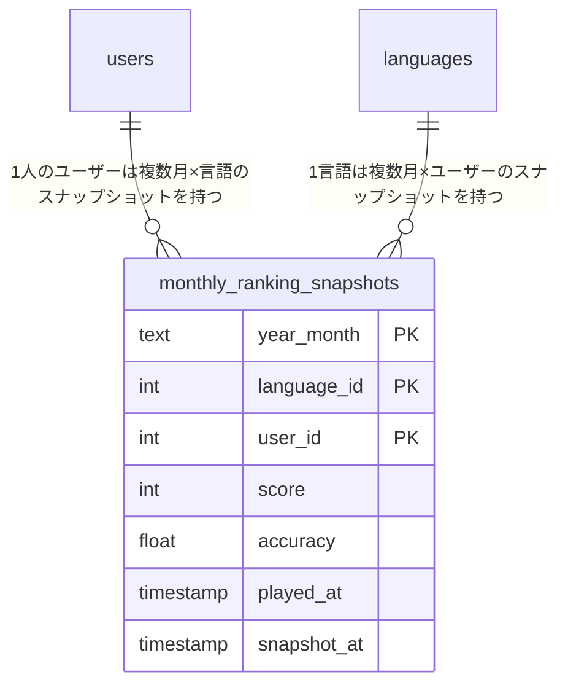
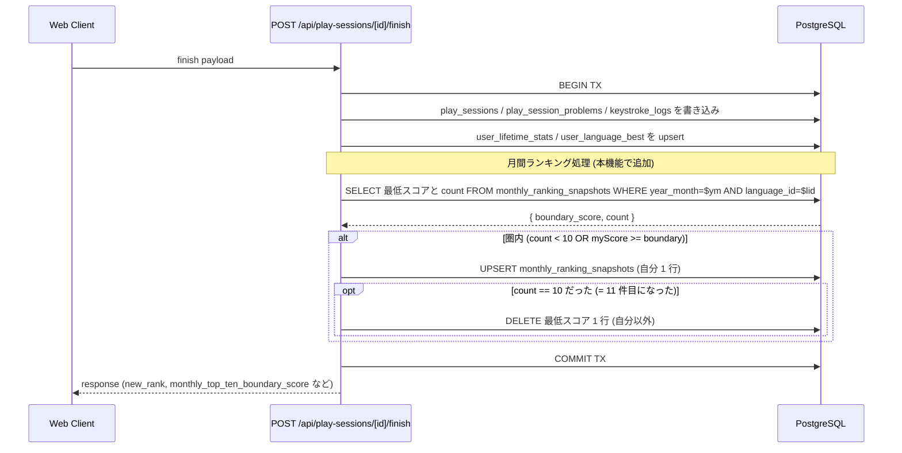
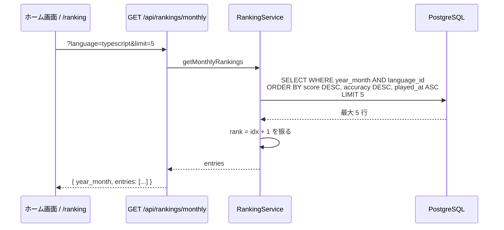

# 月間ランキング

ホーム画面で「**当月の言語別 top 5**」、`/ranking` で「**当月の言語別 top 10**」を見られる機能。score-ranking が「全期間オールタイム」を対象にしているのに対し、本機能は「**JST 暦月**」単位の動的なランキングを提供する。プレイヤーが月初に向けて再挑戦するモチベーションを作る目的。

> **更新履歴**:
> - v1 (初期 MVP): 毎時 cron + `rank` カラム事前計算による「最大 1 時間遅れ」設計
> - v2 (本ドキュメント): **リアルタイム反映** に方針変更。`/finish` で snapshot を同期 UPSERT し、cron 廃止 + `rank` カラム廃止。リザルト画面に「月間 TOP 10 入賞」ポップアップを出すために必要

このドキュメントは **仕様（What）** と **設計（How）** を分けて記述する：

- **仕様**：何が月間ランキング対象になり、どう表示されるか、月変わりの挙動
- **設計**：`/finish` 内 transaction でのスナップショット同期 UPSERT、TOP 10 cap 維持、tie-breaking 実装

## 関連 spec

- [`../score-ranking/README.md`](../score-ranking/README.md) — 全期間ランキング (殿堂入り)。tie-breaking ルール / 公開設定の扱いを揃える
- [`../typing-engine/README.md`](../typing-engine/README.md) — 月間集計の元データである `play_sessions` の生成元
- [`../result-top-ten-popup/README.md`](../result-top-ten-popup/README.md) — リザルト画面で月間 TOP 10 入賞時にポップアップを出す機能。本機能の **リアルタイム反映が前提**

## 目次

- [仕様](#仕様)
  - [月間ランキングとは](#月間ランキングとは)
  - [当月の定義](#当月の定義)
  - [集計対象セッション](#集計対象セッション)
  - [同点時の順位決定（tie-breaking）](#同点時の順位決定tie-breaking)
  - [プライバシー（`publicRanking`）](#プライバシーpublicranking)
  - [表示要素](#表示要素)
  - [月変わりの挙動](#月変わりの挙動)
  - [集計の鮮度](#集計の鮮度)
- [設計](#設計)
  - [集計戦略：`/finish` 同期 UPSERT (TOP 10 cap)](#集計戦略finish-同期-upsert-top-10-cap)
  - [`monthly_ranking_snapshots` テーブル](#monthly_ranking_snapshots-テーブル)
  - [順位はクエリ時計算（殿堂入りと同じ設計）](#順位はクエリ時計算殿堂入りと同じ設計)
  - [11 位押し出しの delete](#11-位押し出しの-delete)
  - [タイムゾーン](#タイムゾーン)
  - [API: GET /api/rankings/monthly](#api-get-apirankingsmonthly)
  - [負荷見積もり](#負荷見積もり)
- [必要な画面](#必要な画面)
- [必要な API](#必要な-api)
- [必要な DB 設計](#必要な-db-設計)
- [フロー図](#フロー図)

---

## 仕様

### 月間ランキングとは

- **当月（JST 暦月）の各言語の TOP 5** を、ホーム画面に 2 カラム（TypeScript / JavaScript）で並べる
- **当月の TOP 10** を `/ranking` で詳細表示
- 「全期間トップ（殿堂入り）」とは別軸。`/hall-of-fame` は引き続き全期間オールタイムを担う

### 当月の定義

- **JST（Asia/Tokyo）の暦月**
- 月初（毎月 1 日 0:00:00 JST）に当月集計範囲が切り替わる
- 月末（月末日 23:59:59.999 JST）まで当月扱い
- 翌月 0:00:00 JST 以降のプレイは翌月集計対象になり、ホーム / `/ranking` の月間トップは新しい月で集計し直された状態になる

### 集計対象セッション

- **`play_sessions` テーブルに保存された認証済みプレイのみ**
  - ゲストプレイは `play_sessions` に保存されないため自動的に除外される
- **mode は問わない**（`solo` / `challenge_gods` 両方）
- **同じプレイヤーは言語ごとに 1 件**（その月のベストスコア 1 件だけ）

### 同点時の順位決定（tie-breaking）

score-ranking と完全に同じルール：

1. `score` 降順
2. `accuracy` 降順
3. `played_at` 昇順（その月内で早く到達した方が上位）

### プライバシー（`publicRanking`）

- **`users.canPublicRanking = false` のユーザーは集計対象から完全除外**（score-ranking と同じ）
- 非公開ユーザーは `monthly_ranking_snapshots` に行が生成されないので、表示にも自分の順位通知にも一切現れない

### 表示要素

#### ホーム画面 (TOP 5)

カード 2 つ（TypeScript / JavaScript）を横並びで配置。各カード内の各エントリで以下を表示：

- 順位（1〜5）
- アバター + `display_name`
- スコア

#### `/ranking` 画面 (TOP 10)

テーブル形式で当月の TOP 10 を表示。同じ tie-breaking 順序。「当月（YYYY 年 M 月）」見出し、月初リセットの注意書きあり。

### 月変わりの挙動

- 月初 0:00:00 JST に当月集計範囲が更新される
- 月初 0:00 〜 最初のプレイ完走までは「まだエントリがありません」を表示
- **過去月のデータは `year_month` 別に残る**（履歴閲覧 UI は MVP では未提供、将来追加可能）

### 集計の鮮度

- **リアルタイム** (= `/finish` 完了直後に snapshot に反映される)
- リザルト画面で「月間 TOP 10 入った」演出を **即時に出せる** ([`../result-top-ten-popup`](../result-top-ten-popup/README.md))

---

## 設計

### 集計戦略：`/finish` 同期 UPSERT (TOP 10 cap)

旧設計は「毎時 cron で集計し直す」だったが、リアルタイム性を取るために **`/finish` 内 transaction で snapshot を同期 UPSERT** する設計に変更した。

`/finish` 時の処理（既存の 5 テーブル書き込みと同じ tx 内に組み込む）：

1. 当月の自分の monthly best (= 通常は今回のプレイの score) を計算
2. 当月の TOP 10 boundary score を取得 (`monthly_ranking_snapshots` 内で最低スコアを取る)
3. 自分が TOP 10 圏内に入るか判定:
   - スナップショット件数 < 10 → 入る (まだ枠が空いている)
   - スナップショット件数 == 10 かつ 自分の score >= 10 位スコア → 入る
4. 圏内なら:
   - 自分の `monthly_ranking_snapshots` 行を UPSERT (= 自分 1 行のみ)
   - 件数が 11 件以上になっていれば、自分以外で最低スコアの 1 行を delete (= TOP 10 cap 維持)
5. 圏外なら 何もしない

cron による定期再集計は **廃止**。`/finish` だけが書き手なので整合性が単純化される。

### `monthly_ranking_snapshots` テーブル

| カラム | 型 | 説明 |
|---|---|---|
| year_month | text | `"YYYY-MM"` (JST 暦月) |
| language_id | int | FK to `languages` |
| user_id | int | FK to `users` |
| score | int | その月のベストスコア |
| accuracy | float | 上記スコア時の正確率 (tie-break 再現用) |
| played_at | timestamp | 上記スコア時の `played_at` (tie-break 再現用) |
| snapshot_at | timestamp | 行を書き込んだ時刻 (MVP では参考値、表示には未使用) |

- 複合 PK: `(year_month, language_id, user_id)`
- インデックス: `(year_month, language_id, score DESC)` (TOP 10 取得用)
- **`rank` カラムは持たない** (殿堂入りと揃える設計、後述)

### 順位はクエリ時計算（殿堂入りと同じ設計）

殿堂入り (`user_language_best`) と完全に同じパターン:

- DB は `score DESC, accuracy DESC, played_at ASC` で並べて TOP 10 を取り出す
- アプリ側 (service 層) で `entries.map((e, idx) => ({ ...e, rank: idx + 1 }))` のように **取得時に順位を振る**
- DB に `rank` カラムを保存しないことで「自分が 5 位に入ったとき、元 5 位の他ユーザー行を update する必要がなくなる」= 他ユーザーの tx と競合しない

### 11 位押し出しの delete

TOP 10 cap を維持するため、`/finish` で自分が新規に 11 件目の行になった場合、最低スコアの 1 行を delete する。

- 触る行数: **1 行**（押し出された 1 人ぶん）
- 影響: その押し出された 1 人ユーザーの同時 finish との極小ロック競合のみ
- 同時 finish 全体への影響: 数 ms 程度、無視できる

### タイムゾーン

- DB の `played_at` は UTC で保存されている（既存仕様）
- 月境界は **JST で判断**。`/finish` 内では `new Date()` から JST の年月 `YYYY-MM` を導出して `year_month` 列に書き込む
- 月初の境界はクライアントタイムゾーン非依存（サーバー側で固定 JST 計算）

### API: GET /api/rankings/monthly

詳細は [`step3-api-get-monthly-rankings.md`](./step3-api-get-monthly-rankings.md) を参照。要点：

- `?language=typescript|javascript` 必須
- `?limit=5` （デフォルト 5、最大 10）
- クエリ: `SELECT ... WHERE year_month = $current AND language_id = $lid ORDER BY score DESC, accuracy DESC, played_at ASC LIMIT $limit`
- 認証不要（誰でも見られる公開ランキング）
- service 層で順位 (`rank`) をアプリ側で振ってレスポンスに含める

### 負荷見積もり

| 観点 | 旧設計 (cron) | 新設計 (リアルタイム) |
|---|---|---|
| GET `/api/rankings/monthly` | snapshot 1 SELECT, 単純 ORDER BY rank | snapshot 1 SELECT, ORDER BY score DESC + LIMIT 10。最大 10 行のみ。負荷は無視できる |
| POST `/finish` 増分 | なし | 自分の行 1 UPSERT + 押し出し 1 DELETE (発火条件付き) ≒ 数 ms |
| 他ユーザー POST との競合 | (cron は別軸) | 押し出された 1 人とのみ 1 行ロック、影響軽微 |
| DB サイズ | `年月 × 言語 × 10` | 同左 (TOP 10 cap 維持) |

---

## 必要な画面

| 画面 | 役割 |
|---|---|
| ホーム画面 (`/`) の「月間トップ」カード | TS / JS の当月 TOP 5 を 2 カラム表示 |
| `/ranking` | 当月 TOP 10 を テーブル表示 (殿堂入り `/hall-of-fame` と役割分離) |

詳細実装は [`step4-web-home-monthly-top.md`](./step4-web-home-monthly-top.md) を参照。

## 必要な API

| メソッド・パス | 役割 | 認証 |
|---|---|---|
| `GET /api/rankings/monthly` | 当月の言語別ランキング上位 N 件 | 不要（公開） |

(`/finish` での snapshot 同期 UPSERT は API として公開はせず、`POST /api/play-sessions/[id]/finish` の内部処理として実装)

## 必要な DB 設計

> **v1 (旧設計) からの差分**: `rank int` カラムを削除。`/finish` 内で UPSERT する設計に揃え、順位はクエリ時計算とする。

詳細は [`step1-db-monthly-ranking-snapshots.md`](./step1-db-monthly-ranking-snapshots.md) を参照。

## フロー図

### `/finish` での同期 UPSERT

### GET 取得時の順位付け

