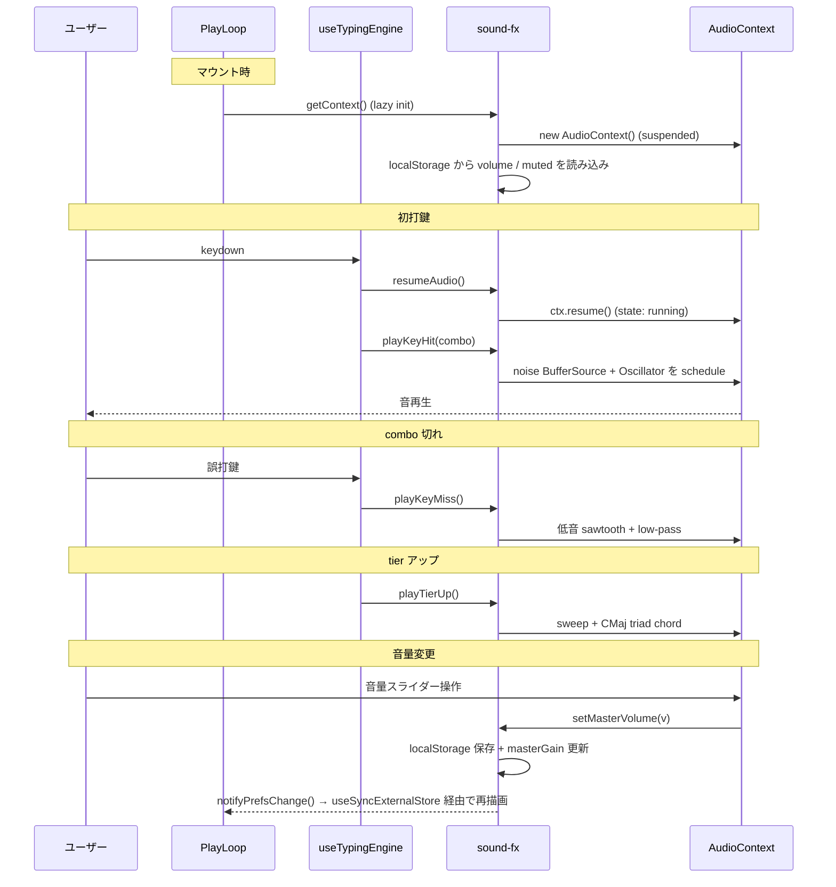

# play-audio（プレイ画面の音響）

プレイ画面でのタイピング体験を高める SE（効果音）と音量コントロール UI の仕様。**BGM は採用しない**（procedural な ambient 風 BGM が逆効果になった経緯あり）。打鍵音は「メカニカルキーボードの打鍵感」+「pentatonic スケールでのピッチアクセント」のハイブリッドで、connect しても耳に痛くなく、combo が伸びるほど音域が高くなり高揚感が出る。

mp3 / wav は **持たず**、すべて Web Audio API の `OscillatorNode` と短い noise buffer から procedural に生成する（バンドル容量 0 / 著作権リスク 0）。

## 関連 spec

- [`../typing-engine/README.md`](../typing-engine/README.md) — combo・tier・remaining time の各イベントが本機能の SE トリガー元

## 目次

- [仕様](#仕様)
  - [SE の種類とトリガー](#se-の種類とトリガー)
  - [打鍵音と combo の連動](#打鍵音と-combo-の連動)
  - [combo banner との同期](#combo-banner-との同期)
  - [音量コントロール UI](#音量コントロール-ui)
  - [採用しないもの](#採用しないもの)
- [設計](#設計)
  - [Web Audio API のレイヤー構成](#web-audio-api-のレイヤー構成)
  - [AudioContext の lazy init と autoplay policy](#audiocontext-の-lazy-init-と-autoplay-policy)
  - [設定値の永続化と React への同期](#設定値の永続化と-react-への同期)
- [必要な画面](#必要な画面)
- [必要な API](#必要な-api)
- [必要な DB 設計](#必要な-db-設計)
- [フロー図](#フロー図)

---

## 仕様

### SE の種類とトリガー

| 名前 | トリガー | 役割 |
| --- | --- | --- |
| `playKeyHit(combo)` | 正解打鍵ごと | メカニカルクリック + pentatonic ピッチアクセント。combo に応じて音域が上がる |
| `playKeyMiss` | 誤打鍵ごと | low-pass された短いダウンスイープ。combo 切れの dull thud |
| `playTierUp` | typedChars が 100/200/300/400/500 を初めて超えた瞬間 | 上昇 sweep + CMaj triad chord。「ドロップ感」で達成感を演出 |
| `playUrgentTick` | 残り 30 秒・10 秒の境界をまたいだ瞬間 | 高音→低音の警告 chirp。1 回だけ鳴る |
| `playFinish` | `/finish` 送信時（時間切れ or 全問完走） | C メジャー arpeggio + coda chord のミニファンファーレ |

### 打鍵音と combo の連動

打鍵音（`playKeyHit`）は **2 レイヤー** 構成。

1. **メカニカルクリック**：12ms の band-pass noise burst。メカニカルキーボードの「コッ／カチッ」感
2. **ピッチアクセント**：C メジャーペンタトニック（C, D, E, G, A）から **毎回ランダムに 1 音** 選んで triangle で重ねる。控えめな音量

ペンタトニックは「何を組み合わせても協和する」ため、ランダムでも即興メロディに聞こえる。連打が音楽的になる。

combo の伸びに応じて、**10 combo ごとに 6 段階** で音色が切り替わる。combo banner の色 tier と完全同期している（同じ閾値で変化）。

| combo | tier | クリック中心周波数 | ピッチアクセント | 波形 |
|------:|-----:|-------------------:|------------------|------|
|  0〜9  | 1（蒼） | 2400Hz | C5〜A5（基準） | triangle |
| 10〜19 | 2（翠） | 2700Hz | C5〜A5         | triangle |
| 20〜29 | 3（紫） | 3000Hz | C6〜A6（+1 oct）| triangle |
| 30〜39 | 4（紅） | 3300Hz | C6〜A6         | triangle |
| 40〜49 | 5（金） | 3600Hz | C7〜A7（+2 oct）| triangle |
|  50〜  | 6（虹） | 3900Hz | C7〜A7         | square   |

combo が切れる（miss する）と即基準に戻る。「combo を切らさず伸ばすほど音が明るく・高くなる」体験になる。tier 6 のみ波形を triangle → square に変えて派手な質感を加える。

### combo banner との同期

エディタ右上（`code-block-source` ヘッダーの下）に常駐する combo banner の表示色と、打鍵音 tier は **同じ閾値（10 combo ごと）** で動く。

- combo banner は `combo` の値に関わらず **常時表示**（`combo = 0` でも `×0 COMBO` を出す）
- 表示位置は `.editor-area` 内の `position: absolute` で右上に重ねる。`pointer-events: none` で打鍵には影響しない
- 色は背景 tier と同じパレット：蒼 → 翠 → 紫 → 紅 → 金 → 虹（tier 6 は虹色グラデーション）
- 音色 tier とまったく同じ閾値なので、「色が変わった瞬間に音色も変わる」体験が成立する

### 音量コントロール UI

プレイ画面の右上に常駐するフローティング pill。

- アイコンボタン（音量帯に応じて 🔇 / 🔈 / 🔉 / 🔊 を出し分け）+ レンジスライダー（0〜100）
- クリックでミュート on/off。ミュート中はスライダーが disabled
- 値は localStorage に永続化（key: `typing-royale.audio.volume`, `typing-royale.audio.muted`）
- リロード後もユーザー設定が保持される
- BGM はないが、SE 全体に効く master volume として動作

### 採用しないもの

- **BGM**：採用しない。Web Audio で sine pad + デチューンを重ねた procedural ambient BGM を一度実装したが、ambient horror 系に聞こえてしまい逆効果だったため撤去した。将来 BGM を追加する場合は、CC0 ロイヤリティフリーの **実トラック** を `public/sounds/` で配信する方針を先にユーザーと合意してから着手する
- **打鍵音の mp3/wav サンプル**：MVP では持たない。Web Audio の procedural 生成で十分「メカニカルキーボードの打鍵感」が出ているため。サンプル導入は質感に不満が出てから検討する

---

## 設計

### Web Audio API のレイヤー構成

すべての SE は `apps/web/src/libs/sound-fx.ts` に集約されている。

```
                ┌─────────────────────────────────┐
  各 SE 関数 ──→│ OscillatorNode / BufferSource    │
                │ + BiquadFilter (band-pass等)     │
                │ + GainNode (envelope)            │
                └────────────┬────────────────────┘
                             │
                             ▼
                      ┌─────────────┐
                      │ masterGain  │  ← setMasterVolume / setMuted で制御
                      └─────┬───────┘
                             │
                             ▼
                  AudioContext.destination
```

- `cachedContext: AudioContext | null` をモジュールスコープで保持し、初回 `getContext()` 時に lazy init
- `masterGain` も同時に生成し、`AudioContext.destination` に接続。すべての SE はこの bus を経由する
- short noise burst（打鍵音のクリック層）は 25ms の `AudioBuffer` を 1 回だけ生成してキャッシュし、毎打鍵で `BufferSource` から使い回す（毎回新規バッファ生成より軽量）
- envelope は `gain.linearRampToValueAtTime` で attack を 2〜4ms、`exponentialRampToValueAtTime` で減衰させ、クリックノイズを防止
- 打鍵音は全体で 60ms 以下に収め、高速連打時の残響被りを防ぐ

### AudioContext の lazy init と autoplay policy

ブラウザの autoplay policy 上、`AudioContext` はユーザー操作を経た後でないと音が出ない（suspended のまま start しても再生されない）。

- `getContext()` を初回呼び出しまで遅延し、suspended で生成しても問題ない作りにする
- `useTypingEngine` の最初の keydown で `resumeAudio()` を呼ぶ。ここで `state === "suspended"` なら `resume()` する
- これにより「ページロード直後は無音、初打鍵と同時にすべての SE 系が起動する」挙動になる

### 設定値の永続化と React への同期

`AudioControls` コンポーネントは sound-fx 内の master volume / muted 状態を直接見せる UI。

- volume / muted はモジュールスコープの変数で唯一の真として保持し、`localStorage` への保存も sound-fx が担当
- React への同期は `useSyncExternalStore` を使う：
  - getSnapshot: `getMasterVolume()` / `isMuted()` を呼ぶ
  - subscribe: `subscribeAudioPrefs(listener)` で sound-fx の更新通知を購読
  - getServerSnapshot: SSR 時は固定値（0.6 / false）を返す。クライアントの hydration 直後に本物の localStorage 値で再評価される
- 「`useEffect` 内で同期 `setState` を呼ばない」React ガイドラインに沿った実装になる

---

## 必要な画面

| 画面 | 概要 |
| --- | --- |
| プレイ画面 (`/play/[sessionId]`) | 右上に AudioControls を常駐表示。SE の再生もこの画面のフックから |

## 必要な API

なし。クライアント完結（Web Audio API + localStorage）。

## 必要な DB 設計

なし。ユーザー設定は localStorage に保存し、サーバーには送らない（端末ごとに保持される）。

## フロー図


