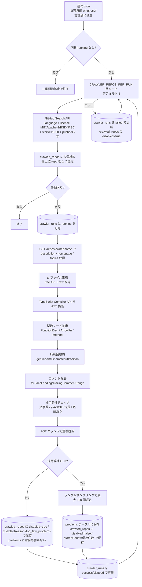
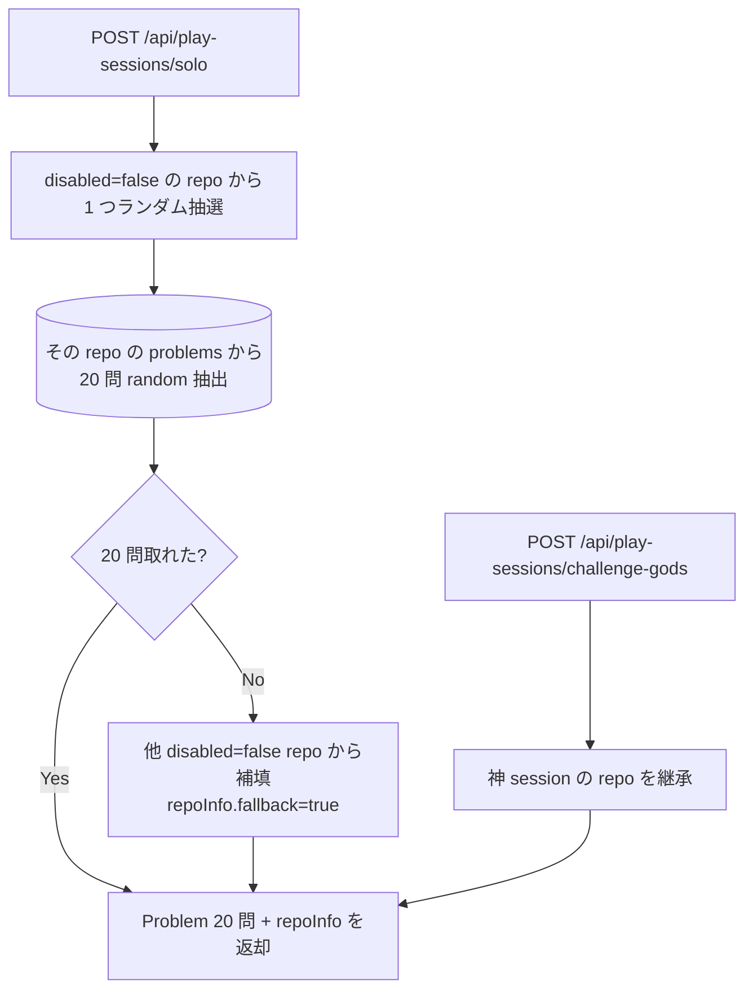

# 問題プール

GitHub 上の OSS コードから **関数単位でタイピング問題を抽出** し、問題プールに蓄積するサブシステム。**週次 cron で GitHub Star ランキング上位の repo を自動取得**、寛容ライセンスのみフィルタして問題化する **単一パイプライン** で運用負荷を最小化する。

**セッション単位では「1 つの repo から 20 問」を出題する** ことで、リザルト画面で「ちなみに今回のリポジトリは XXX で…」というコメントを自然に挿入できるようにする。

このドキュメントは **仕様（What）** と **設計（How）** を分けて記述する：

- **仕様**：どの repo からどんな関数が問題プールに入るか、どんなメタ情報がぶら下がるか、セッションでどう抽選されるか
- **設計**：cron スケジューラの構成、AST 解析パイプライン、GitHub API レート制限対応、コメント除去の実装

## 関連 spec

- [`../typing-engine/README.md`](../typing-engine/README.md) — 本プールの消費者。`/solo` でランダム抽選される
- [`../ghost-battle/README.md`](../ghost-battle/README.md) — `/challenge-gods` で神の repo を継承

## 目次

- [仕様](#仕様)
  - [運用方針：週次 cron による完全自動化](#運用方針週次-cron-による完全自動化)
  - [取得元の選定](#取得元の選定)
  - [言語ごとの cron](#言語ごとの-cron)
  - [対応言語（MVP）](#対応言語mvp)
  - [関数の抽出単位](#関数の抽出単位)
  - [問題として採用する条件](#問題として採用する条件)
  - [重複排除（AST 正規化ハッシュ）](#重複排除ast-正規化ハッシュ)
  - [コメントの除去ポリシー](#コメントの除去ポリシー)
  - [出典情報の保存（ファイル・行範囲）](#出典情報の保存ファイル行範囲)
  - [ライセンス管理](#ライセンス管理)
  - [セッション単位の repo 抽選ルール](#セッション単位の-repo-抽選ルール)
  - [repo メタ情報の取得](#repo-メタ情報の取得)
- [設計](#設計)
  - [クローラ Cron の構成](#クローラ-cron-の構成)
  - [AST 解析パイプライン](#ast-解析パイプライン)
  - [コメント除去の実装](#コメント除去の実装)
  - [行範囲の取得実装](#行範囲の取得実装)
  - [GitHub API レート制限対応](#github-api-レート制限対応)
  - [月次ライセンス再検証バッチ](#月次ライセンス再検証バッチ)
- [必要な画面](#必要な画面)
- [必要な API](#必要な-api)
- [必要な DB 設計](#必要な-db-設計)
- [フロー図](#フロー図)
- [注意事項](#注意事項)

---

## 仕様

### 運用方針：週次 cron による完全自動化

- **週 1 回のバッチで `CRAWLER_REPOS_PER_RUN` 個の repo を処理する** 軽量運用（デフォルト 1）。1 repo の失敗が他 repo の処理を止めないよう **ループ内で個別 try-catch + `crawler_run_items` に失敗記録**。
- 手動でのキュレーション作業は **行わない**。
- 処理順は **GitHub Star ランキング上位から sequential**（`crawled_repos` に未登録の最上位 repo を毎回選定）。
- 一度処理した repo は **再クロールしない**（プールは累積、上書きしない）。
- バッチが失敗してもアプリは既存のプールで動作し続ける。
- **ローンチ初期のみ** 環境変数 `CRAWLER_REPOS_PER_RUN`（デフォルト 1）で 1 回の処理 repo 数を一時的に増やせる。例：最初の 1〜2 週は 5 にして 1 日 5 repo 処理 → 50 repo まで一気に積み上げてから 1 に戻す。途中で 1 repo 失敗してもループは続行する。

### 取得元の選定

GitHub Search API を使い、以下の条件で repo を **対象候補リスト** としてリストアップ：

- 言語：`language:TypeScript`（TypeScript 用 cron の場合）
- ライセンス：`license:mit` / `license:apache-2.0` / `license:bsd-3-clause` / `license:isc`（コード再配布が許容される主要 OSS ライセンス 4 種）
- スター数：`stars:>=1000`
- アーカイブ済み除外：`archived:false`
- 最終更新：`pushed:>{2 年前}`（実行日から相対計算。長く更新がない repo は除外しつつ、ある程度の余裕を持たせる）
- ソート：`sort=stars-desc`

候補リスト取得は **毎週の cron 実行時に都度叩く**（リストはサーバー側で保持しない）。Star ランキングは時間で変動するため、毎週「現在の上位リスト」を取得し、その中から **まだクロールしていない最上位 repo** を選ぶ。

進捗管理：

- `crawled_repos` テーブルが「すでに処理済み（成功 / 失敗 / 不適格）」の repo を保持。
- 新しい cron 実行時：Search API のレスポンスから `crawled_repos` に未登録のものを上から順に 1 つ取り出す。

### 言語ごとの cron

- **言語別に独立した cron** を運用する（TypeScript 用 / JavaScript 用 / 将来追加分）。AST 抽出ルール・関数ノード判定が言語固有のため、cron 実装も分離する。
- 本ドキュメントは **TypeScript 用 cron を例として記述** する。JavaScript / Go 等は同型の cron を別途実装する（言語固有の AST 抽出層は本仕様の対象外）。

### 対応言語（MVP）

- TypeScript
- JavaScript

両言語とも TypeScript Compiler API で AST を構築できるが、上述のとおり **cron 自体は言語ごとに別実装** とする。AST 抽出層は言語固有の処理を持つ。

### 関数の抽出単位

各 repo の `.ts` / `.js` ファイルを取得し、AST から次のノードを **関数の問題候補** として抽出する：

- `FunctionDeclaration`：`function foo(...) { ... }`
- `ArrowFunctionExpression`：`const foo = (...) => { ... }` / `const foo = (...): T => { ... }`
- `FunctionExpression`：`const foo = function (...) { ... }`
- `MethodDefinition` / `MethodDeclaration`：クラス内メソッド

抽出されたコードはソース上の原文（フォーマット・空白を保持）を **そのまま** 取り出す（フォーマッタは通さない）。インデントレベルはトップレベル基準に正規化する。

ネストされた内側の関数（クロージャ内のアロー関数等）は **抽出対象外**。

> **依存型の同梱は MVP では行わない**。関数本体のみを問題化する。未解決の型名は問題テキストにそのまま現れる。

### 問題として採用する条件

抽出した関数のうち、以下を **すべて満たす** ものを **採用候補** とする：

| 条件 | 値 | 理由 |
|---|---|---|
| 文字数（コメント除去後） | 200〜700 文字 | 旧 100-400 では「3 行ラッパー関数」が大量に通り OSS のプレイ感が薄かったため引き上げ。120 秒セッションで 4-6 問こなせる想定 |
| 行数 | 8〜40 行 | 短すぎる 1-liner も長すぎる巨大関数も避ける（旧 5-25 から引き上げ） |
| 1 行最大文字数 | 120 文字以下 | 横スクロールが必要になる行はタイピング体験が悪い |
| 非 ASCII 文字 | 本文に **0 文字**（コメント除去後） | 全角コメント・識別子に日本語が混じる関数を除外 |
| 関数名 | 存在する（無名関数は除外。`const foo = ...` 代入は名前ありとして扱う） | プレイ画面で表示する関数名が必要 |
| 除外する関数名パターン | `test` / `it` / `describe` / `beforeEach` / `afterEach` / `beforeAll` / `afterAll` / `setup` / `teardown` | テストフレームワーク構造は問題として不適切 |
| AST 正規化ハッシュ | 同一 repo 内・プール全体で重複なし | [重複排除（AST 正規化ハッシュ）](#重複排除ast-正規化ハッシュ)参照 |
| コメント除去後本文 | 空でない | 関数全体がコメントだけのケースを除外 |

**repo 単位の保存ルール**：

- 採用候補が **30 個未満** の repo は `crawled_repos.disabled=true` + `disabledReason="too_few_problems"` として記録し、`problems` には何も保存しない。次回以降のクロール対象からも外れる。
- 採用候補が **30 個以上** の repo は `disabled=false` + `storedCount=保存件数` として記録し、採用候補から **ランダムサンプリングで最大 100 個** を `problems` に保存。
  - 候補が 30〜100 個の場合：全件保存
  - 候補が 100 個超の場合：ランダムに 100 個を選んで保存

100 個キャップの根拠：

- 単一 repo が問題プールを支配しないようにする
- セッションあたり 20 問なので、100 問あれば同一 repo を繰り返しプレイしても飽きにくい
- DB サイズと出題の多様性のバランスポイント

### 重複排除（AST 正規化ハッシュ）

同じ関数が複数の repo にコピペされているケースを排除するため、**コメントと空白を除去した本文** で SHA-256 ハッシュを計算し、`problems.astHash` に保存する。`UNIQUE INDEX (astHash)` で 2 件目以降の INSERT を弾く。

**正規化の方針**：

- コメント（leading / trailing 両方）を除去
- 連続空白・改行を 1 つに圧縮、trim
- **識別子（関数名・変数名・引数名）は変更しない**（リネームしてしまうと「名前だけが違う本来別の関数」も同一視されてプールの多様性が落ちる）

実装イメージ：

```ts
const normalize = (codeStripped: string): string =>
  codeStripped.replace(/\s+/g, " ").trim()

const astHash = (codeStripped: string): string =>
  crypto.createHash("sha256").update(normalize(codeStripped)).digest("hex")
```

repo 内のローカル重複（同一ファイル内の overload 等）と、プール全体での横断重複（複数 repo にコピペされたユーティリティ）の両方を同じ仕組みで弾く。

### コメントの除去ポリシー

問題テキストには **コメントを一切含めない**。これにより：

- 「コメントを延々打たされる」という体験を防ぐ
- 関数本体のロジックに集中できる
- 関数長の判定基準が安定する（コメント量で揺れない）

除去対象：

- **JSDoc / ブロックコメント** `/** ... */` `/* ... */`
  - 関数の直前に置かれたものも含めて全削除
- **行コメント** `// ...`
- **行末コメント**（例：`const x = 1 // 初期化`）
- **TypeScript の 3 スラッシュディレクティブ** `/// <reference ...>`

除去 **しない** もの：

- 文字列リテラル内の `//` や `/* */`（例：URL `"https://..."` やテンプレートリテラル内の擬似コメント）
- 正規表現リテラル

コメント除去後、**連続する空行は 1 行に折り畳む**（コメント跡地の空白が目立たないように）。

### 出典情報の保存（ファイル・行範囲）

各問題には、元のコードを GitHub 上で特定できる以下の情報を保存する：

| フィールド | 例 | 用途 |
| --- | --- | --- |
| `sourceRepo` | `"colinhacks/zod"` | プレイ画面・リプレイで出典表示 |
| `sourceFilePath` | `"src/parse.ts"` | 同上 |
| `sourceLineStart` | `123` | コメント **除去前** の元ファイルでの開始行（1-indexed） |
| `sourceLineEnd` | `145` | 同 終了行 |
| `sourceCommitSha` | `"a1b2c3..."` | 後からファイルが変わっても元バージョンを保証 |
| `sourceUrl` | `https://github.com/colinhacks/zod/blob/a1b2c3/src/parse.ts#L123-L145` | プレイ・リプレイ画面からワンクリックで該当箇所を開ける GitHub URL |

行範囲は **コメント除去前の元ファイル基準** で保存する。理由：GitHub 上でユーザーが見たときに「ここが問題のコードだ」と分かることが重要だから。

### ライセンス管理

- 採用ライセンス：**MIT / Apache-2.0 / BSD-3-Clause / ISC**。
- GitHub Search の `license:` フィルタに加えて、各ファイル取得時に **ファイル先頭のライセンスヘッダ** も最善努力で確認（個別ファイルが別ライセンスのケースをカバー）。
- 各問題に `license`, `sourceRepo`, `sourceFilePath`, `sourceLineStart`, `sourceLineEnd`, `sourceCommitSha`, `sourceUrl`, `functionName` を保存。
- プレイ画面・リプレイ画面に「出典 repo / ファイル / 行範囲 / ライセンス名 / コミット SHA / 関数名」を表示。
- ライセンス全文への参照リンクをフッターに掲載。
- 月次でライセンス変更検知バッチを回す（取得済み repo のライセンスが変更されていないか確認）。

### セッション単位の repo 抽選ルール

ソロモード（`POST /api/play-sessions/solo`）開始時、サーバーは以下の手順で出題する：

1. `languageId` に紐づく `crawled_repos` から `disabled=false AND storedCount > 0` の repo を抽出
2. その中からランダムに 1 repo を選定（**クールダウン等は行わない、純粋ランダム**）
3. その repo の `problems` から **20 問をランダム抽出**
4. **fallback**：選んだ repo の問題数が 20 未満なら、同言語の他 `disabled=false` repo から不足分を補填（このときレスポンスの `repoInfo.fallback=true` をセット）
5. レスポンスに `repoInfo`（後述）と 20 問を同梱

同じ repo が連続することは確率的にあり得るが、50 repo / 言語あれば実用上の偏りは発生しないと判断する。

「神々に挑戦」モードでは抽選を行わず、神が打った session の repo をそのまま継承する（[`../ghost-battle/README.md`](../ghost-battle/README.md) 参照）。

### repo メタ情報の取得

リザルト画面のコメント「ちなみにこのリポジトリは…」を成立させるため、クローラ実行時に各 repo のメタ情報を GitHub API から取得し `crawled_repos` に保存する：

- `description` — repo の説明文（GitHub の「About」欄）
- `homepage` — 公式サイト URL（存在する場合）
- `topics` — タグ配列（例：`["typescript", "schema", "validation"]`）

これらは `GET /repos/{owner}/{repo}` 1 回の API 呼び出しで取得可能。手動キュレーションは不要。

`/solo` `/challenge-gods` のレスポンスに同梱される `repoInfo`：

```ts
type RepoInfo = {
  owner:       string         // "colinhacks"
  repo:        string         // "zod"
  stars:       number         // 35000
  description: string         // "A type-safe schema validation library"
  homepage:    string | null  // "https://zod.dev"
  topics:      string[]       // ["typescript", "schema", "validation"]
  fallback:    boolean        // 20 問足切りで他 repo から補填した場合 true
}
```

---

## 設計

### クローラ Cron の構成

#### スケジュールと実行環境

- **スケジュール**：毎週月曜 03:00 JST。GitHub API の負荷が比較的低い時間帯。
- **実行環境**：API サーバとは別プロセス（`apps/cron` パッケージ内の `pnpm crawler:run:<slug>` CLI として実装、言語ごとに別 task）。本番は AWS EventBridge → ECS Scheduled Task で起動。
- **実行時間目安**：1 repo の処理は数秒〜数分（メタ取得 + ファイル取得 + AST 走査）。タイムアウトは 10 分に設定。

#### 1 回の処理内容

1 回の cron 実行で **`CRAWLER_REPOS_PER_RUN` 個（デフォルト 1）の repo を処理** する。複雑なジョブキュー・並列化は **不要**（シンプルな逐次処理で完結）。

```
for i in 1..CRAWLER_REPOS_PER_RUN:
    target = pickNextRepo()       # GitHub Search + crawled_repos 突き合わせ
    if target == None: break       # 候補なし、終了
    result = processRepo(target)   # メタ取得 → AST → 採用判定 → 保存
    recordRun(target, result)      # crawler_runs に履歴
```

`pickNextRepo()`：

1. GitHub Search API で「言語 × ライセンス（MIT/Apache-2/BSD-3/ISC）× stars>=1000 × pushed>2 年 × stars-desc」の上位 repo リストを取得
2. `crawled_repos` テーブルにすでに登録済みの repo は除外
3. 残った中の最上位 repo（Star 数最大）を返す
4. 候補なしなら `None` を返して当週は終了

#### ブートストラップ運用

- 環境変数 `CRAWLER_REPOS_PER_RUN`（デフォルト 1）で 1 回の実行 repo 数を制御。
- ローンチ初期は `CRAWLER_REPOS_PER_RUN=5` のようにして 1 週に 5 repo 処理 → 50 repo まで一気に積み上げてから 1 に戻す運用が可能。
- コード変更不要、ENV だけで切り替え。

#### リトライとエラーハンドリング（部分失敗の継続）

- ループ内の各 repo は **個別 try-catch** で処理し、1 repo の失敗が次の repo の処理を止めないようにする（ブートストラップ運用との整合）。
- 失敗した repo は `crawled_repos` に `disabled=true` + `disabledReason` で記録し、再クロール対象にはしない（運営判断で明示的に再開する場合のみ CLI から）。
- 同時に `crawler_run_items` に `status="failed"` + `error` を記録（連続 2 回失敗判定の根拠）。
- リトライ対象外のエラー：HTTP 404（repo 消失）、ライセンス変更検知、AST 解析エラー、採用候補 30 個未満。
- HTTP 5xx・レート制限は **`lib/retry.ts` の指数バックオフ（最大 3 回、base 1s, factor 2, jitter ±20%）** で吸収。3 回失敗で `disabled=true` / `disabledReason="server_error"`。
- run 全体は **すべての repo が失敗したときだけ** `crawler_runs.status="failed"`。1 件でも success があれば `success`（部分成功）。

#### 排他制御と二重起動防止

- アプリケーション側で二重起動防止のロジックは持たない。本処理がべき等なため：
  - `pickNextRepo` は `crawled_repos` に登録済みの repo をスキップする
  - `processRepo` の挿入は `problems` の `@@unique([languageId, astHash])` で重複を防ぐ
  - `licenseRecheck` は read 寄りで、結果が変わらなければ DB を更新しない
- そのため ECS Scheduled Task の重複起動・手動再実行のどちらが起きても問題プールは壊れない。
- ただし `crawler_runs` は `start()` のレスポンス喪失 / `succeed()` `fail()` の失敗 / OOM / SIGKILL のいずれかで `status="running"` のまま残ることがあるため、次回 run の冒頭で `markStaleAsFailed` を呼んで 30 分以上前の running を `failed` に倒す。
- `fail()` 自体が失敗した場合に元エラーが消えないよう、catch 内で nested try/catch して `fail` の失敗は logger に記録するだけにし、元の例外は必ず rethrow する。
- 1 repo / 週の軽量運用のため分散ロック不要。

#### モニタリングと通知

- 各 run は `crawler_runs` に 1 行、その中で処理した個別 repo は `crawler_run_items` に 1 行ずつ記録。
  - `crawler_runs`: 全体集計（`reposProcessed`, `problemsAdded`, `status`, `startedAt`, `endedAt`, `error`）
  - `crawler_run_items`: `targetOwner`, `targetRepo`, `status`, `problemsAdded`, `error`
- 運営は SQL で直接参照（`crawler_run_items` を 1 段クエリ）、または将来的に簡易ダッシュボード化。
- **連続 2 回失敗**（同一 `targetOwner/targetRepo` の直近 2 件が `status="failed"`、または run 全体の直近 2 件が `failed`）で Slack 通知する仕組みは別途整備。通知本文には `crawler_run_items.error` の JSON を抜粋する。

#### 管理 API は持たない

- 外部公開する HTTP エンドポイントは作らない。
- 運営オペレーション（特定 repo の再クロール、`disabled` 化、進捗確認）は **CLI ツール** で行う。CLI は DB / GitHub に直接アクセスする独立コマンド。

### AST 解析パイプライン

`processRepo(target)` の中で、各 `.ts` ファイル（TypeScript cron の場合）に対して：

1. `ts.createSourceFile(filePath, source, ScriptTarget.Latest, true, ScriptKind.TS)` で AST 構築
2. `ts.forEachChild` で再帰的に走査
3. `FunctionDeclaration` / `ArrowFunctionExpression` / `FunctionExpression` / `MethodDeclaration` を抽出
4. 各関数ノードに対して：
   - 行範囲を取得（[行範囲の取得実装](#行範囲の取得実装)）
   - 関数本体テキストを取得（コメント除去前）
   - コメント除去（[コメント除去の実装](#コメント除去の実装)）
   - 採用条件チェック
   - AST 正規化ハッシュで重複判定
5. **repo 内の全採用候補を集めてから判定**：
   - 30 個未満 → `disabled=true` + `disabledReason="too_few_problems"` で `crawled_repos` 更新、`problems` には何も保存せず終了
   - 30 個以上 → ランダムサンプリングで最大 100 個を `problems` に挿入、`crawled_repos` は `disabled=false` + `storedCount=保存件数`

**ファイルサイズ上限**：1 ファイル 100KB を超えるものは AST 構築前にスキップ（バンドル済みコード / minify 済みファイル除外）。

**JavaScript / その他言語の cron**：本ドキュメントは TypeScript 用 cron の設計。JavaScript / Go 用の cron は同型のフローを持つが、AST 抽出層は言語固有の実装（`ts.createSourceFile` の代わりに各言語のパーサを使う）。本仕様の対象外。

### コメント除去の実装

TypeScript Compiler API のコメント情報は **トリビア（trivia）** として AST ノードに紐づいている。除去手順：

1. 関数ノード全体のテキストを取得（`node.getFullText()` ではなく `node.getText()`、これでも leading trivia は含まれる）
2. `ts.forEachLeadingCommentRange(text, pos, callback)` / `ts.forEachTrailingCommentRange(text, pos, callback)` で全コメント範囲を列挙
3. 列挙された範囲を **後ろから削除**（前から消すと位置がズレるため）
4. 文字列リテラル・正規表現内の `//` `/*` はコメントトリビア扱いされないので自動的に保護される
5. 削除後、`/\n{3,}/g` を `\n\n` に置換して連続空行を折り畳む

このため、`codeBlock` に保存される文字列は **コメント除去後** のテキスト。元ファイル上の行範囲（`sourceLineStart` / `sourceLineEnd`）は **除去前** の位置を保存する（GitHub 上で見たときの位置を保証するため）。

### 行範囲の取得実装

```ts
const sourceFile = ts.createSourceFile(...)
const start = node.getStart(sourceFile)
const end = node.getEnd()

const { line: lineStart } = sourceFile.getLineAndCharacterOfPosition(start)
const { line: lineEnd }   = sourceFile.getLineAndCharacterOfPosition(end)

// TypeScript Compiler API は 0-indexed なので 1-indexed に変換
const sourceLineStart = lineStart + 1
const sourceLineEnd   = lineEnd + 1
```

GitHub の URL 生成：

```
https://github.com/{owner}/{repo}/blob/{commitSha}/{filePath}#L{sourceLineStart}-L{sourceLineEnd}
```

これで **GitHub 上で該当範囲がハイライト表示** された状態で開ける。

### GitHub API レート制限対応

1 週 1 repo の超軽量運用なので **レート制限を意識する必要はほぼない** が、念のため：

- 認証なし：60 req/h、OAuth トークン経由：5000 req/h。バッチには **運営アカウントの Personal Access Token** を使用。
- Search API は 30 req/min、最大 1000 件まで。1 回の cron 実行で 1 リクエスト程度。
- Tree / Raw / Repos API は OAuth 経由で 5000 req/h。1 repo × 数十ファイルなら 50〜100 リクエストで余裕。
- ブートストラップ運用（`CRAWLER_REPOS_PER_RUN=5` 等）でも 1 回あたり数百リクエストに収まる。
- レート制限ヒット時はその repo を当週失敗扱いにし、次週次の repo に進む（同 cron 内でリトライしない）。

### 月次ライセンス再検証バッチ

- 別の cron として毎月 1 回実行。
- `crawled_repos` の各 repo に対して `GET /repos/{owner}/{repo}` を呼び、`license.spdx_id` が採用ライセンス内に収まっているか確認。
- 変更があれば該当 repo の `disabled=true`、紐づく `problems` も `disabled=true` に。
- ランキングへの影響を最小化するため、変更検知時は運営に Slack 通知。

---

## 必要な画面

| 画面 | 概要 |
| --- | --- |
| （なし） | ユーザー向け画面はなし。問題ソースの選択 UI は廃止（言語選択のみで開始） |
| 管理 CLI（運営向け） | 取得状況の確認・問題の手動無効化（不適切表現を含む等のケース）・特定 repo の手動再クロール |

## 必要な API

| メソッド | パス | 説明 |
| --- | --- | --- |
| （内部） | – | `POST /api/play-sessions/solo` から呼ばれ、`languageId` を受け取り、**1 つの repo をランダム抽選 + その repo から 20 問抽出 + `repoInfo` 構築** を行う内部関数。クライアント向け単体 API は持たない |
| GET | `/api/problems/:id` | 問題の詳細（リプレイ画面で利用）。レスポンスに `sourceUrl`（行範囲付き GitHub URL）も含む |

**管理 API は持たない**。運営オペレーション（個別問題の無効化、特定 repo の再クロール、進捗確認）は **CLI ツール** で行う（DB / GitHub に直接アクセスする独立コマンド）。

クローラジョブも cron で直接 DB / GitHub API を叩く独立ワーカー（API サーバ経由しない）。

## 必要な DB 設計

詳細スキーマ（カラム型 / インデックス / FK）は [`./step1-db-problem-pool.md`](./step1-db-problem-pool.md) を参照。本表は概要のみ。

| テーブル | 主要カラム | 説明 |
| --- | --- | --- |
| `languages` | `id`, `name`, `slug` | 言語マスタ（TS / JS） |
| `crawled_repos` | `id`, `languageId`, `githubId(unique)`, `owner`, `name`, `fullName`, `stars`, `license`, `defaultBranch`, `commitSha`, `description`, `homepage(nullable)`, `topics(jsonb)`, `candidatesCount`, `storedCount`, `disabled`, `disabledReason(nullable)`, `crawledAt` | 処理済み repo（成功 / 不適格 / 失敗 すべて）。`disabled=false AND storedCount > 0` が `/solo` の抽選対象。`candidatesCount` は採用条件を満たした総数、`storedCount` は実際に保存された件数（≤ 100、> 0 で「過去に採用された」の代理キー）。`disabled=true` は失敗 / 採用候補不足 / ライセンス変更等で除外された repo |
| `problems` | `id`, `crawledRepoId(FK)`, `languageId(FK、非正規化)`, `sourceFilePath`, `sourceLineStart`, `sourceLineEnd`, `sourceUrl`, `functionName`, `codeBlock(text)`, `charCount`, `lineCount`, `astHash`, `disabled` | 問題本体。`codeBlock` は **コメント除去後**。`sourceLineStart` / `sourceLineEnd` は **コメント除去前の元ファイル基準**（1-indexed）。`@@unique([languageId, astHash])` で言語ごとに重複排除。`disabled` はライセンス再検証 / 運営の手動無効化で `true` |
| `crawler_runs` | `id`, `runType("crawler_<slug>"\|"license_recheck")`, `status("running"\|"success"\|"failed")`, `reposProcessed`, `problemsAdded`, `startedAt`, `endedAt`, `error(jsonb)` | バッチ実行の **run 全体**を表す親レコード。1 回の `pnpm crawler:run:<slug>` で 1 行（言語ごとに独立した task） |
| `crawler_run_items` | `id`, `crawlerRunId(FK)`, `languageId`, `targetOwner`, `targetRepo`, `status("success"\|"failed"\|"skipped")`, `problemsAdded`, `startedAt`, `endedAt`, `error(jsonb)` | run 内で処理した **個別 repo 1 行**の履歴。連続 2 回失敗の Slack 通知や、ブートストラップ時の途中失敗の特定に使う |

関連：[`../score-ranking/README.md`](../score-ranking/README.md) の ER 図参照。

## フロー図

### クロール（週次 cron、言語別に独立）



### 出題（セッション開始時）



## 注意事項

- **ローンチ初期のプール薄さ**：1 repo / 週ペースでは 10 repo に達するまで約 10 週間。ローンチ前に **`CRAWLER_REPOS_PER_RUN=5` のようなブートストラップ設定** で 50 repo まで一気に積み上げてから通常運用に切り替える想定。
- **AST 解析の処理コスト**：1 ファイルあたり数十 ms、1 repo の全ファイル走査でも数秒〜数十秒。1 cron 実行内で十分完結する。
- **型未解決の表示**：MVP では型同梱を行わないため、関数シグネチャに登場する `User` のようなプロジェクト独自型はそのまま問題テキストに現れる。コード片の打鍵が目的のため体験上は問題ない。
- **JSX / TSX**：MVP では `.ts` / `.js` のみを対象とし、`.tsx` / `.jsx` は対象外でスタート。
- **コメント除去で関数が短くなりすぎるケース**：JSDoc が長く本体が短い関数は、除去後に 100 文字未満になることがある。これは採用条件で自然に弾かれる。
- **行範囲のズレ**：プレイ画面に表示するコードは「コメント除去後」、`sourceUrl` で GitHub に飛ぶと「除去前」の元ファイルが見える。この **差異がユーザーを混乱させないよう、リプレイ画面に「GitHub で原文を見る（コメント付き）」と注釈** する。
- **不適切コード**：人名・連絡先・URL を含む文字列リテラルなどが含まれている可能性。MVP では完全自動チェックは難しいため、運営の事後対応（CLI 経由で `disabled` 化）で吸収。NG ワード辞書による事前フィルタは将来検討。
- **クローラ PAT 管理**：運営アカウントの PAT は **環境変数経由で注入**、コードベース・ログには絶対に出さない。月次でローテーション。
- **言語別 cron の独立**：本ドキュメントは TypeScript 用 cron を例示。JavaScript / Go 等は同型の cron を別実装するが、AST 抽出層は言語固有のため別途設計（本仕様の対象外）。
- **問題数の目標**：MVP リリース時に各言語 200 問題以上をプールに格納できることを目標。ブートストラップで 5〜10 repo 積めば余裕で到達。
