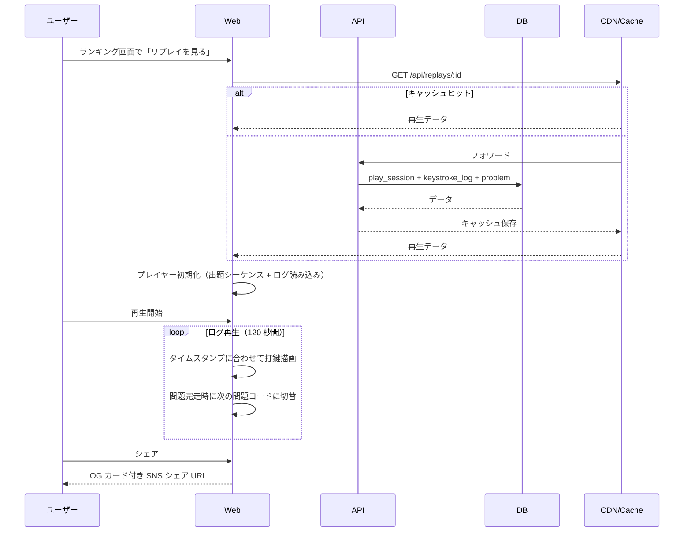

# リプレイ閲覧

ランキングトップ 10 入賞プレイを、誰でも観戦できる閲覧機能。**動画ファイル（mp4 等）は一切作成・保存せず、キーストロークログをフロントエンドで再描画する方式** を採用する。

このドキュメントは **仕様（What）** と **設計（How）** を分けて記述する：

- **仕様**：何をリプレイとして公開するか、視聴者が触れるコントロール、シェアの動線
- **設計**：動画ファイルを使わない方式、データの不変性とキャッシュ、サイズ感

## 関連 spec

- [`../ghost-battle/README.md`](../ghost-battle/README.md) — 同じキーストロークログを併走再生する機能。**`keystrokeLog` データ構造の正本** はこちら
- [`../score-ranking/README.md`](../score-ranking/README.md) — リプレイ公開対象を決めるトップ 10 集計
- [`../problem-pool/README.md`](../problem-pool/README.md) — 表示する問題コードの出典・ライセンス情報

## 目次

- [仕様](#仕様)
  - [閲覧対象](#閲覧対象)
  - [プレイヤーコントロール](#プレイヤーコントロール)
  - [SNS シェア](#sns-シェア)
  - [ライセンス・出典の表示](#ライセンス出典の表示)
- [設計](#設計)
  - [設計方針：動画ファイルなし・キーストロークログ再生](#設計方針動画ファイルなしキーストロークログ再生)
  - [データソース構成（既存テーブル参照）](#データソース構成既存テーブル参照)
  - [データの不変性とキャッシュ戦略](#データの不変性とキャッシュ戦略)
  - [データサイズ感](#データサイズ感)
  - [モバイル対応・不適切表現対応](#モバイル対応不適切表現対応)
  - [将来拡張](#将来拡張)
- [必要な画面](#必要な画面)
- [必要な API](#必要な-api)
- [必要な DB 設計](#必要な-db-設計)
- [フロー図](#フロー図)

---

## 仕様

### 閲覧対象

- **言語 × 期間ごとのトップ 10 入賞プレイ** の 120 秒セッション全体（キーストロークログ + 出題シーケンス）を保存・公開。
- 1 リプレイ = 1 セッション（120 秒 / 複数問題を含む）。
- 期間切替によりトップ 10 から押し出されたプレイでも、過去にトップ 10 入賞歴があれば永続保存。
- プレイヤーが `publicRanking=false` の場合、そもそもトップ 10 に入らないため **リプレイ公開対象にもならない**（ランキング除外と連動）。後から `publicRanking` を OFF に切り替えたユーザーの過去リプレイは順位再集計時に公開対象から外れる。

### プレイヤーコントロール

- 再生 / 一時停止 / 1.5x / 2x 速度
- シーク（プログレスバー上での任意位置移動）。プログレスバーは 120 秒全体
- 累計文字数 / 正確率 / 経過時間 / 現在の問題番号（"問題 3 / 8" 等）
- 問題間の遷移はマーカー表示（"問題 2 → 3" のような区切り線）

### SNS シェア

- 「このリプレイをシェア」ボタン → X / Reddit / Zenn 等のシェア URL を発行。
- OG カードに「{username} の TypeScript 月間トップ #1 リプレイ」を表示（達成カード PNG と共通テンプレ）。

### ライセンス・出典の表示

- 問題コードの **出典 repo / ファイル / 行範囲 / ライセンス名 / コミット SHA / 関数名** を画面に表示（[`../problem-pool/README.md` 「出典情報の保存（ファイル・行範囲）」](../problem-pool/README.md#出典情報の保存ファイル行範囲)）。
- 「GitHub で原文を見る（コメント付き）」リンクから、`sourceUrl`（行範囲ハイライト付き）で元ファイルを開ける。

---

## 設計

### 設計方針：動画ファイルなし・キーストロークログ再生

本機能は **「動画録画」ではない**。プレイ中に事前撮影することもなく、サーバー側で動画エンコードを行うこともない。実体は **キーストロークログ（タイムスタンプ + 入力文字の JSON）** であり、閲覧時にフロントエンドが `requestAnimationFrame` でログを順に再生して、視覚的には動画と同じ表現を作り出す。

| 観点 | 動画方式（採用せず） | キーストロークログ方式（採用） |
| --- | --- | --- |
| 事前撮影 | 必要 | **不要** |
| ストレージ | 1 リプレイ数 MB〜数十 MB | **数十 KB**（数百倍以上の差） |
| エンコード処理 | プレイ後にサーバー側で必要 | **不要**（プレイ中の記録だけ） |
| 配信コスト | 動画 CDN が必要 | **静的 JSON 配信で OK** |
| シーク・早送り | 動画プレイヤー実装次第 | **任意位置に即ジャンプ可** |
| 倍速再生 | 動画プレイヤー次第 | **任意倍速、滑らか** |

ゴースト併走（[`../ghost-battle/README.md`](../ghost-battle/README.md)）も同じ `keystroke_logs` テーブルを参照する。**「動画」と書かれていてもファイルは存在しない** という設計を、関連 spec すべてで一貫させる。

> **データ構造の正本**：`keystrokeLog` の型定義・具体例・サイズ感は [`../ghost-battle/README.md` の「キーストロークログのデータ構造」](../ghost-battle/README.md#キーストロークログのデータ構造) に集約。本ドキュメントを含む関連 spec はそこを参照する。

### データソース構成（既存テーブル参照）

リプレイは既存テーブルの組み合わせで成立し、専用テーブルは不要。

- `play_sessions`（[`../score-ranking/README.md`](../score-ranking/README.md)）
- `play_session_problems`（[`../typing-engine/README.md`](../typing-engine/README.md)）
- `keystroke_logs`（[`../ghost-battle/README.md`](../ghost-battle/README.md)）
- `problems`（[`../problem-pool/README.md`](../problem-pool/README.md)）

出題シーケンスは `play_session_problems` から復元する。

| 追加カラム | 説明 |
| --- | --- |
| `play_sessions.persistReplay (bool)` | トップ 10 入賞時に `true`、押し出されても保持する |

### データの不変性とキャッシュ戦略

- 保存済みのキーストロークログ・問題コードは **変更不可**（永続保存）。
- リプレイデータは不変なので CDN キャッシュ TTL を長く設定可（例：7 日）。
- `GET /api/replays/:playSessionId` は最初のリクエストで DB から構築 → CDN にキャッシュ → 以降は CDN ヒット。

### データサイズ感

- 120 秒セッションで複数問題（数問〜十数問）+ キーストロークログ。
- 合算で 1 リプレイ **数十 KB〜200KB** を想定。
- 動画方式の 1/100 以下のサイズ。

### モバイル対応・不適切表現対応

- リプレイは横長レイアウト中心。**モバイルでも閲覧のみは可能** にする（プレイは PC のみ）。
- 問題コード自体は OSS 由来のため低リスクだが、表示名や Hall of Fame コメント欄には **NG ワードフィルタ** を導入。

### 将来拡張

- SNS シェア用の **GIF / mp4 エクスポート**：サーバー側でキーストロークログから動画を生成する想定（事前撮影は不要）。MVP では対象外。
- ライブ観戦：MVP では非対象。

---

## 必要な画面

| 画面 | 概要 |
| --- | --- |
| ランキング一覧 → リプレイへの導線 | 各エントリの「リプレイを見る」リンク |
| リプレイ画面 | コード表示・キーストローク再描画・コントロール・出典表示 |
| プレイヤー詳細ページ | そのプレイヤーの代表的なリプレイ一覧 |

## 必要な API

| メソッド | パス | 説明 |
| --- | --- | --- |
| GET | `/api/replays/:playSessionId` | リプレイデータ（問題コード + キーストロークログ + メタ情報） |
| GET | `/api/replays/featured` | 注目リプレイ一覧（Hall of Fame 連携） |

## 必要な DB 設計

[データソース構成](#データソース構成既存テーブル参照) を参照。専用テーブルは持たず、既存テーブル + `play_sessions.persistReplay` カラム追加のみ。

## フロー図

