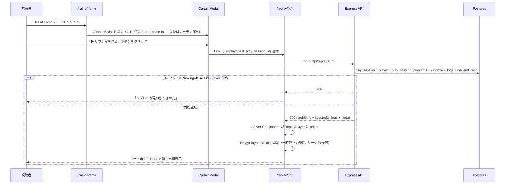

# step1: リプレイ閲覧の API + Web プレイヤーを実装

ランキング画面の各エントリから「そのユーザーが 120 秒でどう打鍵したか」を視聴できるようにする。**動画ファイルは作らず、ghost-battle と同じ `keystroke_logs` テーブルをフロントが `requestAnimationFrame` で再生** する設計（[`./README.md`](./README.md)）。

本 step では (1) `GET /api/replays/:playSessionId` の新設、(2) ランキングテーブルの「▶」アイコンを `/replay/[id]` リンクに差し替え、(3) `/replay/[id]` でプレイヤー UI（再生 / 一時停止 / 倍速 / シーク / 出典表示）を実装する。

`GET /api/replays/featured`（注目リプレイ一覧）、`play_sessions.persistReplay` カラム追加、SNS シェア用 OG カードは MVP スコープ外として後続 step に回す。

## 目次

- [対象 API / 対象画面](#対象-api--対象画面)
- [参考モック](#参考モック)
  - [モックから読み取った主要構造](#モックから読み取った主要構造)
- [依存](#依存)
- [リクエスト](#リクエスト)
  - [Path Param](#path-param)
- [レスポンス](#レスポンス)
  - [200 OK](#200-ok)
  - [エラー](#エラー)
- [処理フロー](#処理フロー)
  - [処理の流れ](#処理の流れ)
- [プレイヤー rAF 再生ロジック](#プレイヤー-raf-再生ロジック)
- [設計方針](#設計方針)
- [対応内容](#対応内容)
- [動作確認](#動作確認)
- [次の step での利用](#次の-step-での利用)

## 対象 API / 対象画面

### 対象 API

| 項目 | 値 |
|---|---|
| メソッド / パス | `GET /api/replays/:playSessionId` |
| 認証 | 不要（公開リプレイ） |
| 副作用 | なし（読み取りのみ） |
| 冪等性 | 冪等（不変データ） |
| 呼び出し元 | apps/web の `/replay/[playSessionId]` Server Component |
| 連携 step | 後続の `featured` API / プレイヤー詳細ページがレスポンスを再利用 |

### 対象画面

| Route | コンポーネント | 概要 |
|---|---|---|
| `/replay/[playSessionId]` | Server (fetch) + Client (再生) | リプレイプレイヤー本体。コード表示・キーストローク再描画・コントロール・出典表示 |
| `/ranking` (修正) | 既存 Server Component | RankingTable の「▶」を `/replay/{id}` リンクに差し替え |

呼び出す API:

| メソッド / パス | 呼び出すタイミング | 経路 | 認証 |
|---|---|---|---|
| `GET /api/replays/:playSessionId` | /replay/[id] 着地時に Server Component が 1 回叩く | `apiClient.get` | 不要 |

## 参考モック

| 画面 | モックファイル | 反映すべき要素 |
|---|---|---|
| `/replay/[id]` | [`docs/mocks/replay.html`](../../mocks/replay.html) | ヘッダー（avatar + 表示名 + ランキング badge + グレード badge + メタ情報） / 4 セル HUD（経過時間 / 累計文字数 / 正確率 / 現在の問題） / `code-block-source` + `pre.code-block` / `.replay-controls`（▶⏸ + ⏮⏭ + プログレスバー + 倍速 pill） / 右サイドの「ライセンス・出典」カード + 出題シーケンスリスト |

「⚡ 神々に挑戦」ボタンはモックに含まれているが本 step では実装スコープ外（指定対戦は仕様外のため、ランキング → リプレイ動線とは独立に置く）。

### モックから読み取った主要構造

- レイアウト: 既存 `container container-wide` + `play-hud` を流用、コントロール下に `row` + `col` / `col-sidebar` の 2 カラム
- カラー: 再生進捗は `var(--purple)`（既存 `.progress-fill` の `background` を override）、現在の問題行は `rgba(88,166,255,0.08)` 背景
- タイポ: HUD 値は `text-mono`、出典は `text-sm` グリッド
- 既存 globals.css に `.progress` / `.progress-fill` / `.speed-pills` / `.speed-pill` / `.speed-pill.active` / `.replay-controls` などがあれば流用、なければ末尾に追記

## 依存

| 依存先 | 何を使うか | 本 step での扱い |
|---|---|---|
| `keystroke_logs` テーブル | gzip 圧縮された `KeystrokeLogs`（既存） | 既存 `KeystrokeLogRepository.findByPlaySessionId` を再利用 |
| `play_sessions` + `play_session_problems` + `problems` + `crawled_repos` + `users` + `user_lifetime_stats` | 既存テーブル組み合わせ | 専用テーブルは作らない |
| `play_sessions.persistReplay` カラム | README に記載 | **本 step では追加しない**。MVP は全 play_session が永続前提で運用 |
| GetRankingsResponse の `best_play_session_id` | 既存 | RankingTable のリンク先 ID として再利用 |

## リクエスト

### Path Param

| パラメータ | 型 | 制約 | 説明 |
|---|---|---|---|
| `playSessionId` | number | `z.coerce.number().int().positive()` | リプレイを取得する `play_sessions.id` |

## レスポンス

### 200 OK

```json
{
  "play_session_id": 42,
  "player": {
    "avatar_url": null,
    "current_grade": "fellow",
    "github_username": "alice",
    "user_id": 1
  },
  "language": "typescript",
  "stats": {
    "accuracy": 0.984,
    "played_at": "2026-06-08T05:48:42.000Z",
    "problems_completed": 6,
    "score": 1490,
    "typed_chars": 1520
  },
  "problems": [
    {
      "id": 1,
      "char_count": 30,
      "code_block": "function f1() { return 1 }",
      "function_name": "f1",
      "line_count": 1,
      "order_index": 0,
      "source_url": "https://github.com/demo/demo-repo/blob/main/src/f1.ts#L1"
    }
  ],
  "keystroke_logs": [
    { "elapsed_ms": 1000, "input_char": "a", "is_correct": true, "problem_index": 0 }
  ],
  "repo_info": {
    "description": "demo",
    "homepage": null,
    "license": "Apache-2.0",
    "name": "demo-repo",
    "owner": "demo",
    "stars": 100,
    "topics": ["demo"]
  }
}
```

| フィールド | 型 | 説明 |
|---|---|---|
| `play_session_id` | number | 対象セッション ID |
| `player.user_id` | number | プレイヤーの user_id |
| `player.github_username` | string \| null | GitHub username（未連携時は null） |
| `player.avatar_url` | string \| null | アバター URL |
| `player.current_grade` | string | グレード slug |
| `language` | string | 言語 slug |
| `stats.score` | number | 確定スコア |
| `stats.typed_chars` | number | 累計文字数 |
| `stats.accuracy` | number | 正確率（0.0〜1.0） |
| `stats.problems_completed` | number | 完走した問題数 |
| `stats.played_at` | string (ISO) | プレイ日時 |
| `problems[]` | array(20) | 出題シーケンス（既存 playSessionProblemSchema 流用） |
| `keystroke_logs[]` | array | キーストローク（既存 keystrokeEntrySchema 流用） |
| `repo_info` | object | 出典情報（既存 repoInfoSchema + `license: string`、NOT NULL） |

### エラー

| Status | type | 条件 | クライアント挙動 |
|---|---|---|---|
| 400 | BAD_REQUEST | `playSessionId` が不正 | エラーページ表示 |
| 404 | NOT_FOUND | セッション不在 / 該当ユーザーが `publicRanking=false` / キーストロークログ欠落 | 「リプレイが見つかりません」表示 |

`publicRanking=false` 時に意図的に 404 を返すことで「後から非公開化したユーザーの過去リプレイも閲覧不可」を仕様通り実現する。

## 処理フロー



### 処理の流れ

1. ユーザーが `/ranking` の RankingTable で「▶」をクリック（`/replay/{best_play_session_id}` リンク）
2. `/replay/[playSessionId]` Server Component が `apiClient.get<GetReplayResponse>` で API を叩く
3. API は `play_sessions` から user / language / stats / crawled_repo / play_session_problems を取得し、`keystroke_logs` を gunzip して `KeystrokeLogs` を組み立てる（NG なら 404）
4. player の `users.canPublicRanking=false` なら 404 で打ち切る
5. レスポンスを ReplayPlayer Client Component に props で渡す
6. ReplayPlayer は内部で `playTimeRef`（再生時刻）を rAF tick で進め、`elapsed_ms <= playTime` のログを順次消費して `typedChars` / `accuracy` / `problemIndex` / `cursor` を更新
7. 一時停止 / 倍速 / シークボタンで `speed` / `paused` / `playTimeRef` を直接操作（シークは前から再計算）

## プレイヤー rAF 再生ロジック

ghost-battle と同じく `keystroke_logs` を `elapsed_ms` 順に消費する設計。ただし時間軸は **「再生時刻」** で進めることでシーク / 倍速 / 一時停止に対応する。

```ts
const playTimeRef = useRef(0)
const lastWallRef = useRef(performance.now())
const speedRef = useRef(1)
const pausedRef = useRef(false)
const cursorRef = useRef(0)

const tick = () => {
  const now = performance.now()
  const dt = now - lastWallRef.current
  lastWallRef.current = now
  if (!pausedRef.current) {
    playTimeRef.current = Math.min(SESSION_MS, playTimeRef.current + dt * speedRef.current)
  }

  while (cursorRef.current < logs.length && logs[cursorRef.current].elapsed_ms <= playTimeRef.current) {
    consumeEntry(logs[cursorRef.current])
    cursorRef.current += 1
  }

  setPlayedMs(playTimeRef.current)
  raf = requestAnimationFrame(tick)
}
```

シーク時は `playTimeRef = target` + `cursorRef = 0` + ローカル state（typedChars / 正確率 / cursor）を初期化し、`cursor < logs.length && logs[cursor].elapsed_ms <= target` を再走させる（120 秒分でも 1ms 未満）。

## 設計方針

- **動画は作らない**：[`README.md`](./README.md) の通り `keystroke_logs` の再生だけで動画と同じ表現を作る。サーバー側で動画エンコードもキャッシュも不要
- **rAF 1 つで動かす**：別 timer や interval は使わず、`playTimeRef + speed + paused` のモデルで全状態を導出。シーク・倍速・一時停止が単一の関数で完結する
- **シークは O(N) 再計算**：120 秒で数百〜数千エントリ。逐次再計算でも 1ms 以内で終わるため、累積差分 / 二分木 / 中間スナップショット最適化は MVP では不要
- **`publicRanking=false` のリプレイは 404**：READMEに沿って閲覧対象から外す。これにより「あとから非公開化したユーザーのリプレイも見えない」を仕様通り実現
- **`play_sessions.persistReplay` カラムは入れない**：全 play_session は現状 cron / cleanup が無い前提で永続。保存期間が必要になった段階で追加（READMEには記載があるが MVP では deferred）
- **featured / 注目リプレイ一覧は別 step**：Hall of Fame との結線が要るため独立 PR にする方がレビュアブル
- **OG カード PNG 生成は別 step**：rewards 機能と類似の satori パイプラインを再利用する想定。MVP では `https://x.com/intent/post?text=...` だけのシンプルなシェアにする
- **コード表示は ghost-battle と同じ `<pre>` + typed / current / untyped span** で揃える（syntax-highlight は MVP では行わない、モック上の色分けは段階的に強化）

## 対応内容

### `packages/schema/src/api-schema/replay.ts`（新規）

```typescript
import { z } from "zod"

const replayProblemSchema = z.object({
  id: z.number().int().positive(),
  char_count: z.number().int().positive(),
  code_block: z.string(),
  function_name: z.string(),
  line_count: z.number().int().positive(),
  order_index: z.number().int().nonnegative(),
  source_url: z.string().url(),
})

const replayKeystrokeEntrySchema = z.object({
  elapsed_ms: z.number().nonnegative(),
  input_char: z.string().min(1).max(20),
  is_correct: z.boolean(),
  problem_index: z.number().int().nonnegative().max(19),
})

const replayRepoInfoSchema = z.object({
  description: z.string().nullable(),
  homepage: z.string().nullable(),
  license: z.string(),
  name: z.string(),
  owner: z.string(),
  stars: z.number().int().nonnegative(),
  topics: z.array(z.string()),
})

export const getReplayPathParamSchema = z.object({
  playSessionId: z.coerce.number().int().positive(),
})

export const getReplayResponseSchema = z.object({
  keystroke_logs: z.array(replayKeystrokeEntrySchema),
  language: z.string(),
  play_session_id: z.number().int().positive(),
  player: z.object({
    avatar_url: z.string().url().nullable(),
    current_grade: z.string(),
    github_username: z.string().nullable(),
    user_id: z.number().int().positive(),
  }),
  problems: z.array(replayProblemSchema).min(1).max(20),
  repo_info: replayRepoInfoSchema,
  stats: z.object({
    accuracy: z.number().min(0).max(1),
    played_at: z.string(),
    problems_completed: z.number().int().nonnegative(),
    score: z.number().int().nonnegative(),
    typed_chars: z.number().int().nonnegative(),
  }),
})

export type GetReplayPathParam = z.infer<typeof getReplayPathParamSchema>
export type GetReplayResponse = z.infer<typeof getReplayResponseSchema>
```

`packages/schema/src/api-schema/index.ts` から再エクスポート。`pnpm --filter @repo/api-schema build`。

### `apps/api/src/repository/prisma/replay-repository.ts`（新規）

```typescript
import { PrismaClient } from "@repo/db"

export type ReplaySourceRow = {
  language: { slug: string }
  problems: Array<{
    orderIndex: number
    problem: {
      charCount: number
      codeBlock: string
      functionName: string
      id: number
      lineCount: number
      sourceUrl: string
    }
  }>
  accuracy: number
  crawledRepo: {
    description: string | null
    homepage: string | null
    license: string
    name: string
    owner: string
    stars: number
    topics: unknown
  }
  id: number
  playedAt: Date
  problemsCompleted: number
  score: number
  typedChars: number
  user: {
    avatarUrl: string | null
    canPublicRanking: boolean
    currentGrade: string
    githubUsername: string | null
    id: number
  }
}

export interface ReplayRepository {
  findById(playSessionId: number): Promise<ReplaySourceRow | null>
}

export class PrismaReplayRepository implements ReplayRepository {
  private _prisma: PrismaClient
  constructor(prisma: PrismaClient) { this._prisma = prisma }

  async findById(playSessionId: number): Promise<ReplaySourceRow | null> {
    const row = await this._prisma.playSession.findUnique({
      include: {
        crawledRepo: {
          select: {
            description: true, homepage: true, license: true,
            name: true, owner: true, stars: true, topics: true,
          },
        },
        language: { select: { slug: true } },
        problems: {
          include: {
            problem: {
              select: {
                charCount: true, codeBlock: true, functionName: true,
                id: true, lineCount: true, sourceUrl: true,
              },
            },
          },
          orderBy: { orderIndex: "asc" },
        },
        user: {
          include: { lifetimeStats: { select: { currentGrade: true } } },
          select: {
            avatarUrl: true, canPublicRanking: true, githubUsername: true,
            id: true, lifetimeStats: true,
          },
        },
      },
      where: { id: playSessionId },
    })
    if (!row) return null
    return {
      accuracy: row.accuracy,
      crawledRepo: row.crawledRepo,
      id: row.id,
      language: { slug: row.language.slug },
      playedAt: row.playedAt,
      problems: row.problems.map((p) => ({ orderIndex: p.orderIndex, problem: p.problem })),
      problemsCompleted: row.problemsCompleted,
      score: row.score,
      typedChars: row.typedChars,
      user: {
        avatarUrl: row.user.avatarUrl,
        canPublicRanking: row.user.canPublicRanking,
        currentGrade: row.user.lifetimeStats?.currentGrade ?? "intern",
        githubUsername: row.user.githubUsername,
        id: row.user.id,
      },
    }
  }
}
```

`apps/api/src/repository/prisma/index.ts` から再エクスポート。

実カラム名は schema.prisma で確認しつつ実装する（fields の最終名が異なる場合は schema 通りに合わせる）。

### `apps/api/src/service/replay-service.ts`（新規）

```typescript
import { err, notFoundError, ok, Result } from "@repo/errors"
import { logger } from "@repo/logger"
import type { KeystrokeLogRepository } from "../repository/prisma/keystroke-log-repository"
import type { ReplayRepository, ReplaySourceRow } from "../repository/prisma/replay-repository"

type GetReplayInput = { playSessionId: number }
type GetReplayOutput = {
  keystrokeLogs: { elapsedMs: number; inputChar: string; isCorrect: boolean; problemIndex: number }[]
  source: ReplaySourceRow
}

export const getReplay = async (
  input: GetReplayInput,
  repo: { keystrokeLogRepository: KeystrokeLogRepository; replayRepository: ReplayRepository },
): Promise<Result<GetReplayOutput>> => {
  logger.debug("ReplayService: getReplay", input)
  const source = await repo.replayRepository.findById(input.playSessionId)
  if (source === null) return err(notFoundError("Replay not found"))
  if (!source.user.canPublicRanking) return err(notFoundError("Replay not found"))
  const keystrokeLogs = await repo.keystrokeLogRepository.findByPlaySessionId(input.playSessionId)
  if (keystrokeLogs === null) return err(notFoundError("Replay not found"))
  return ok({ keystrokeLogs, source })
}
```

`service/index.ts` から `export * as replay from "./replay-service"`。

### `apps/api/src/controller/replay/get.ts`（新規）

```typescript
import { Request, Response } from "express"
import {
  ErrorResponse,
  getReplayPathParamSchema,
  getReplayResponseSchema,
} from "@repo/api-schema"
import * as service from "../../service"
import type { KeystrokeLogRepository, ReplayRepository } from "../../repository/prisma"

export class ReplayGetController {
  constructor(
    private keystrokeLogRepository: KeystrokeLogRepository,
    private replayRepository: ReplayRepository,
  ) {}

  async execute(req: Request, res: Response) {
    const { playSessionId } = getReplayPathParamSchema.parse(req.params)

    const result = await service.replay.getReplay(
      { playSessionId },
      { keystrokeLogRepository: this.keystrokeLogRepository, replayRepository: this.replayRepository },
    )

    if (!result.ok) {
      const errorResponse: ErrorResponse = { error: result.error.message, status_code: result.error.statusCode }
      return res.status(result.error.statusCode).json(errorResponse)
    }

    const { keystrokeLogs, source } = result.value
    const response = getReplayResponseSchema.parse({
      keystroke_logs: keystrokeLogs.map((e) => ({
        elapsed_ms: e.elapsedMs,
        input_char: e.inputChar,
        is_correct: e.isCorrect,
        problem_index: e.problemIndex,
      })),
      language: source.language.slug,
      play_session_id: source.id,
      player: {
        avatar_url: source.user.avatarUrl,
        current_grade: source.user.currentGrade ?? "intern",
        github_username: source.user.githubUsername,
        user_id: source.user.id,
      },
      problems: source.problems.map((p) => ({
        char_count: p.problem.charCount,
        code_block: p.problem.codeBlock,
        function_name: p.problem.functionName,
        id: p.problem.id,
        line_count: p.problem.lineCount,
        order_index: p.orderIndex,
        source_url: p.problem.sourceUrl,
      })),
      repo_info: {
        description: source.crawledRepo.description,
        homepage: source.crawledRepo.homepage,
        license: source.crawledRepo.license,
        name: source.crawledRepo.name,
        owner: source.crawledRepo.owner,
        stars: source.crawledRepo.stars,
        topics: Array.isArray(source.crawledRepo.topics) ? source.crawledRepo.topics as string[] : [],
      },
      stats: {
        accuracy: source.accuracy,
        played_at: source.playedAt.toISOString(),
        problems_completed: source.problemsCompleted,
        score: source.score,
        typed_chars: source.typedChars,
      },
    })
    return res.status(200).json(response)
  }
}
```

### `apps/api/src/routes/replay-router.ts`（新規）

```typescript
import { Router } from "express"
import { ReplayGetController } from "../controller/replay/get"

type ReplayRouterControllers = { get?: ReplayGetController }

export const replayRouter = (controllers: ReplayRouterControllers): Router => {
  const router = Router()
  if (controllers.get) {
    const controller = controllers.get
    router.get("/:playSessionId", async (req, res) => controller.execute(req, res))
  }
  return router
}
```

### `apps/api/src/index.ts`（DI 追加）

- `PrismaReplayRepository`、`ReplayGetController` をインスタンス化
- `app.use("/api/replays", replayRouter({ get: replayGetController }))`
- `PUBLIC_PATHS` に `/api/replays` を追加

### リプレイ動線

リプレイへの動線は **ランキングテーブルではなく Hall of Fame 経由** とする。Hall of Fame のカード（`apps/web/src/app/hall-of-fame/hof-cards.tsx`）をクリックすると `CurtainModal`（`apps/web/src/app/hall-of-fame/curtain-modal.tsx`）が開き、その中に「▶ リプレイを見る」ボタン（`<Link href={`/replay/${bestPlaySessionId}`}>`）を配置する。`ranking-table.tsx` は本 step では変更しない。

### `apps/web/src/app/replay/[playSessionId]/page.tsx`（新規）

```tsx
import type { Metadata } from "next"
import Link from "next/link"
import { notFound } from "next/navigation"
import type { GetReplayResponse } from "@repo/api-schema"
import { Topbar } from "@/components/topbar"
import { getAccessToken } from "@/libs/auth/session"
import { apiClient } from "@/libs/api-client"
import { ReplayPlayer } from "./replay-player"

export const metadata: Metadata = { title: "リプレイ - Typing Royale" }

export default async function ReplayPage({
  params,
}: { params: Promise<{ playSessionId: string }> }) {
  const { playSessionId } = await params
  const accessToken = await getAccessToken()
  let data: GetReplayResponse
  try {
    data = await apiClient.get<GetReplayResponse>(`/api/replays/${playSessionId}`)
  } catch {
    notFound()
  }

  return (
    <>
      <Topbar active="ranking" isAuthed={accessToken !== null} />
      <div className="container container-wide">
        <div className="text-sm text-muted mb-8"><Link href="/ranking">← ランキング</Link></div>
        <ReplayPlayer data={data} />
      </div>
    </>
  )
}
```

### `apps/web/src/app/replay/[playSessionId]/replay-player.tsx`（新規）

- mock `replay.html` の構造を踏襲
- 状態: `playedMs`, `typedChars`, `correct`, `total`, `problemIndex`, `cursor`, `paused`, `speed`
- rAF tick で [プレイヤー rAF 再生ロジック](#プレイヤー-raf-再生ロジック)
- コントロール:
  - 再生 / 一時停止 toggle ボタン
  - ⏮（先頭に戻す）/ ⏭（末尾にジャンプ）
  - プログレスバークリックで `playedMs` を更新（シーク）
  - 倍速 pill: 0.5x / 1x / 1.5x / 2x
- 出典カードと出題シーケンスサイドバーを描画
- combo マイルストーン (30/60/90...) のキーストロークログから `detectBonuses` で `+Ns` ポップアップを発火し、効果音 `playTimeBonus` を鳴らす演出を組み込む（ghost-battle / 通常プレイと同じ演出を再生時刻ベースでもトリガーする）

### `apps/web/src/app/replay/[playSessionId]/not-found.tsx`（新規）

シンプルな「リプレイが見つかりません」案内 + /ranking へ戻すリンク。

## 動作確認

| 区分 | 内容 |
|---|---|
| Service ユニットテスト | `apps/api/test/service/replay-service/get-replay.test.ts`: (1) 正常系 / (2) Replay 不在 → 404 / (3) `publicRanking=false` → 404 / (4) keystroke_logs 欠落 → 404 |
| Controller インテグレーションテスト | `apps/api/test/controller/replay/get.test.ts`: 実 Postgres で fixture 投入 → 200 で 全フィールド一致 / 404 を境界条件で確認 |
| 手動 | dev DB の seed-ghost-fixture で Bob のセッションを準備 → /ranking → 「▶ 視聴」クリック → /replay/2 でプレイヤー UI 表示 → 再生 / 一時停止 / 倍速 / シーク が動く / 出典カードが表示される |
| スクショ | `docs/screenshots/replay-viewer-step1/{ranking-link.png, replay-player.png}` |
| Lint / Build / Test | `pnpm lint && pnpm build && pnpm test` がすべて緑 |

## 次の step での利用

- **step2**: `GET /api/replays/featured` + Hall of Fame との結線（注目リプレイ一覧）
- **step3**: SNS シェア OG カード PNG 生成（rewards step6 と同じ satori パイプラインを流用）
- **step4 (deferred)**: `play_sessions.persistReplay` カラム + 保存期間ポリシー（保存対象を Top 10 入賞歴あり / 既存入賞歴を含めて永続化）
- **player 詳細ページ**: `/players/[userId]` でそのユーザーの代表リプレイ一覧（rewards / Hall of Fame 連携）。本 step では `RankingTable` 内の `<Link href="/players/${user_id}">` だけ既存のまま残し、リンク先実装は別 step
- 本 step で意図的に省略したもの:
  - syntax highlight（モックは色分けされているが MVP では plain `<pre>`）
  - 動画 / GIF エクスポート（README の将来拡張）
  - ライブ観戦（README の将来拡張）
