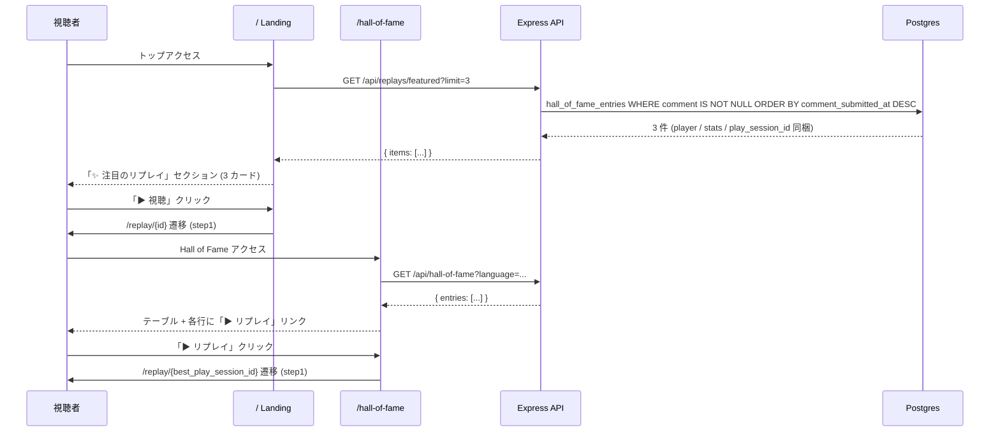

# step2: 注目リプレイ API + Hall of Fame / Landing からの動線

> **ステータス: 未着手**。Hall of Fame は table ではなく cards + curtain modal 構成（`apps/web/src/app/hall-of-fame/hof-cards.tsx` + `apps/web/src/app/hall-of-fame/curtain-modal.tsx`）に変更されたため、step2 の Hall of Fame 改修方針は再設計が必要。リプレイ動線は curtain modal 内の「▶ リプレイを見る」ボタンとして既に実装済みであり、本 step の Hall of Fame 改修は実質不要（featured API + Landing カードのみが残タスク）。

step1 で `/replay/[playSessionId]` 単独画面と API は完成済み。本 step では (1) 注目リプレイ一覧 API `GET /api/replays/featured` を新設、(2) Hall of Fame の各エントリに「▶ リプレイ」リンクを追加、(3) Landing (`/`) に「✨ 注目のリプレイ」セクションを追加することで、複数の入口からリプレイ視聴に誘導する。

featured の定義は「`hall_of_fame_entries` のうち **コメント付き** を `comment_submitted_at DESC` で最大 N 件」とする。コメントを残した入賞者は紹介価値が高いというシグナルを活用する（コメント無しは紛れ込まない）。

`play_sessions.persistReplay` カラム / SNS シェア OG カード / syntax highlight は引き続き別 step。

## 目次

- [対象 API / 対象画面](#対象-api--対象画面)
- [参考モック](#参考モック)
  - [モックから読み取った主要構造](#モックから読み取った主要構造)
- [依存](#依存)
- [リクエスト](#リクエスト)
  - [Query String](#query-string)
- [レスポンス](#レスポンス)
  - [200 OK](#200-ok)
  - [エラー](#エラー)
- [処理フロー](#処理フロー)
  - [処理の流れ](#処理の流れ)
- [設計方針](#設計方針)
- [対応内容](#対応内容)
- [動作確認](#動作確認)
- [次の step での利用](#次の-step-での利用)

## 対象 API / 対象画面

### 対象 API

| 項目 | 値 |
|---|---|
| メソッド / パス | `GET /api/replays/featured?limit=N&language=...` |
| 認証 | 不要 |
| 副作用 | なし（読み取りのみ） |
| 冪等性 | 冪等 |
| 呼び出し元 | apps/web の `/` Landing (Server Component) |
| 連携 step | step3 の OG カード PNG 生成にも `play_session_id` を再利用 |

### 対象画面

| Route | コンポーネント | 概要 |
|---|---|---|
| `/hall-of-fame` (改修済) | Server + Client | 既に cards + curtain modal 構成に移行済み。curtain modal 内の「▶ リプレイを見る」ボタン（`<Link href="/replay/{best_play_session_id}">`）が実装済みのため本 step で追加改修なし |
| `/` Landing (修正) | Server | 「✨ 注目のリプレイ」セクションを追加し `/api/replays/featured?limit=3` を Server-side fetch して 3 件をカードで横並び |

呼び出す API:

| メソッド / パス | 呼び出すタイミング | 経路 | 認証 |
|---|---|---|---|
| `GET /api/replays/featured?limit=3` | `/` Server Component の Promise.all | `apiClient.get` | 不要 |
| `GET /api/replays/:playSessionId` | featured カード / Hall of Fame の「▶ リプレイ」クリック → step1 で実装済み | step1 既存 | 不要 |

## 参考モック

| 画面 | モックファイル | 反映すべき要素 |
|---|---|---|
| Hall of Fame | [`docs/mocks/hall-of-fame.html`](../../mocks/hall-of-fame.html) | カード + curtain modal 内のボタン（実装済）。本 step での Hall of Fame 改修は不要 |
| Landing `/` | [`docs/mocks/top.html`](../../mocks/top.html) | 既存セクション（タイピング紹介 / 神々モード紹介）の下に「✨ 注目のリプレイ」カードを 3 枚横並びで追加（avatar + 表示名 + 言語 / スコア / 「▶ 視聴」ボタン） |

### モックから読み取った主要構造

- Hall of Fame: cards + curtain modal 内のボタン（実装済）。table レイアウト時代の追加列方針は破棄
- Landing: `card` + `flex-center` + `avatar lg` + `text-mono` 数字 + `btn btn-primary` のスタイルで 3 枚をグリッド表示
- 既存 globals.css の `.card` / `.avatar.lg` / `.btn-primary` / `.badge.accent` で十分（追加 CSS なし）

## 依存

| 依存先 | 何を使うか | 本 step での扱い |
|---|---|---|
| `hall_of_fame_entries`（既存） | `comment` / `commentSubmittedAt` / `bestPlaySessionId` | featured API で comment IS NOT NULL を `commentSubmittedAt DESC` で取得 |
| `play_sessions` + `users` + `user_lifetime_stats`（既存） | スコア・正確率・github_username・grade・avatar | featured レスポンスに同梱 |
| `Language`（既存） | slug でフィルタ | `?language=...` の絞り込みに利用 |
| step1 の `GET /api/replays/:id`（既存） | カード / Hall of Fame からの遷移先 | 変更なし |

## リクエスト

### Query String

| パラメータ | 型 | 必須 | 制約 | 説明 |
|---|---|---|---|---|
| `limit` | number | 任意 | `z.coerce.number().int().min(1).max(20).default(10)` | 取得件数。デフォルト 10、Landing は 3 を指定 |
| `language` | string | 任意 | `z.string().min(1).max(20).optional()` | 言語 slug。指定があれば該当言語のみ。未指定は全言語横断 |

## レスポンス

### 200 OK

```json
{
  "items": [
    {
      "comment": "ペアプロでも目に見えてコードが速くなった。",
      "comment_submitted_at": "2026-06-08T05:48:42.000Z",
      "language": "typescript",
      "play_session_id": 42,
      "player": {
        "avatar_url": null,
        "current_grade": "fellow",
        "github_username": "alice",
        "user_id": 1
      },
      "stats": {
        "accuracy": 0.984,
        "score": 1490,
        "typed_chars": 1520
      }
    }
  ]
}
```

| フィールド | 型 | 説明 |
|---|---|---|
| `items[].play_session_id` | number | `/replay/[id]` への遷移先 |
| `items[].language` | string | 言語 slug |
| `items[].comment` | string | コメント本文（300 文字以内、IS NOT NULL を保証） |
| `items[].comment_submitted_at` | string (ISO) | コメント送信日時。ソートキー |
| `items[].player` | object | プレイヤー display |
| `items[].stats` | object | スコア・文字数・正確率 |

### エラー

| Status | type | 条件 | クライアント挙動 |
|---|---|---|---|
| 400 | BAD_REQUEST | `limit` / `language` が不正 | Landing 側でフォールバック（空配列扱い） |

featured は「該当 0 件」でも 200 を返し `items: []`（フィルタが過剰だっただけのケースもあるため、空でもエラー扱いにしない）。

## 処理フロー



### 処理の流れ

1. Landing が Server Component で `apiClient.get<GetFeaturedReplaysResponse>("/api/replays/featured?limit=3")` を `Promise.all` に追加
2. API は `hall_of_fame_entries` に `play_session` / `user / lifetimeStats` を join し、`comment IS NOT NULL` + `commentSubmittedAt DESC` で limit 件取得
3. レスポンスを featured カードに map して表示（カードをクリックすると `/replay/{play_session_id}` へ）
4. Hall of Fame テーブルは既存表示に「リプレイ」列を 1 つ追加して `<Link>` を出す
5. 「▶ リプレイ」リンクの遷移先は step1 の `/replay/[id]` で同じ動作

## 設計方針

- **featured は Hall of Fame コメント駆動**：「コメントを書いた入賞者 = 紹介する価値」というシグナル。runtime 集計（cron 不要）で `commentSubmittedAt DESC` を ORDER BY するだけで安く出せる
- **limit の上限を 20 にする**：Landing で 3、別画面で 10、最大でも 20 に絞ることで「人気ぽい埋め草」を防ぐ
- **language は optional**：未指定は全言語横断（Landing 用）。指定すると言語別の featured（将来の言語別 landing 用）
- **空でも 200**：featured 0 件は普通に起きるため、エラーにせず Landing 側のスペースを潰さない（カードを描画しない実装）
- **fetch 失敗は Landing で吸収**：featured が 500 でも Landing は描画される（try/catch + 空配列）
- **Hall of Fame は最小差分**：既存 table に列を 1 つ追加するだけ。スタイルは `/ranking` と揃える
- **キャッシュは step3 以降**：Hall of Fame の更新はコメント submit 1 回のみ。CDN キャッシュ TTL は別 step で検討（MVP は都度クエリ）

## 対応内容

### `packages/schema/src/api-schema/replay.ts`（追記）

```typescript
// ========================================================
// GET /api/replays/featured - 注目リプレイ一覧
// ========================================================

const featuredReplayItemSchema = z.object({
  comment: z.string(),
  comment_submitted_at: z.string(),
  language: z.string(),
  play_session_id: z.number().int().positive(),
  player: z.object({
    avatar_url: z.string().url().nullable(),
    current_grade: z.string(),
    github_username: z.string().nullable(),
    user_id: z.number().int().positive(),
  }),
  stats: z.object({
    accuracy: z.number().min(0).max(1),
    score: z.number().int().nonnegative(),
    typed_chars: z.number().int().nonnegative(),
  }),
})

export const getFeaturedReplaysQueryStringSchema = z.object({
  language: z.string().min(1).max(20).optional(),
  limit: z.coerce.number().int().min(1).max(20).default(10),
})

export const getFeaturedReplaysResponseSchema = z.object({
  items: z.array(featuredReplayItemSchema),
})

export type GetFeaturedReplaysQueryString = z.infer<typeof getFeaturedReplaysQueryStringSchema>
export type GetFeaturedReplaysResponse = z.infer<typeof getFeaturedReplaysResponseSchema>
```

スキーマ build。

### `apps/api/src/repository/prisma/replay-repository.ts`（追記）

```typescript
export type FeaturedReplayRow = {
    comment: string
    commentSubmittedAt: Date
    language: { slug: string }
    playSession: {
        accuracy: number
        id: number
        score: number
        typedChars: number
    }
    user: {
        avatarUrl: string | null
        currentGrade: string | null
        githubUsername: string | null
        id: number
    }
}

export interface ReplayRepository {
    findById(playSessionId: number): Promise<ReplaySource | null>
    findFeatured(input: { language?: string; limit: number }): Promise<FeaturedReplayRow[]>
}
```

`currentGrade` は `users` テーブル直下ではなく `user_lifetime_stats.currentGrade` を join して取得する（include の `lifetimeStats: { select: { currentGrade: true } }` を経由して Repository 側で平坦化する）。`displayName` カラムは廃止済みなので使わない。

実装は `prisma.hallOfFameEntry.findMany` で:
- `where: { comment: { not: null }, language: input.language ? { slug: input.language } : undefined }`
- `orderBy: { commentSubmittedAt: "desc" }`
- `take: input.limit`
- `include: { language: { select: { slug: true } }, playSession: true, user: { include: { lifetimeStats: { select: { currentGrade: true } } } } }`

### `apps/api/src/service/replay-service.ts`（追記）

```typescript
export const listFeatured = async (
  input: { language?: string; limit: number },
  repo: { replayRepository: ReplayRepository },
): Promise<FeaturedReplayRow[]> => {
  return repo.replayRepository.findFeatured(input)
}
```

業務エラーは無し（空配列は ok 扱いなので Result でなく素の Promise を返してよい。既存 rewards.listMine と同じパターン）。

### `apps/api/src/controller/replay/featured.ts`（新規）

```typescript
export class ReplayFeaturedController {
  constructor(private replayRepository: ReplayRepository) {}

  async execute(req: Request, res: Response) {
    const { language, limit } = getFeaturedReplaysQueryStringSchema.parse(req.query)
    const items = await service.replay.listFeatured(
      { language, limit },
      { replayRepository: this.replayRepository },
    )

    const response = getFeaturedReplaysResponseSchema.parse({
      items: items.map((row) => ({
        comment: row.comment,
        comment_submitted_at: row.commentSubmittedAt.toISOString(),
        language: row.language.slug,
        play_session_id: row.playSession.id,
        player: {
          avatar_url: row.user.avatarUrl,
          current_grade: row.user.currentGrade ?? "intern",
          github_username: row.user.githubUsername,
          user_id: row.user.id,
        },
        stats: {
          accuracy: row.playSession.accuracy,
          score: row.playSession.score,
          typed_chars: row.playSession.typedChars,
        },
      })),
    })
    return res.status(200).json(response)
  }
}
```

### `apps/api/src/routes/replay-router.ts`（修正）

```typescript
type ReplayRouterControllers = {
    featured?: ReplayFeaturedController
    get?: ReplayGetController
}

// ...
if (controllers.featured) {
  router.get("/featured", async (req, res) => controllers.featured!.execute(req, res))
}
if (controllers.get) {
  router.get("/:playSessionId", async (req, res) => controllers.get!.execute(req, res))
}
```

`/featured` は `/:playSessionId` より **先** に登録（Express の route match 順）。

### `apps/api/src/index.ts`（DI 追加）

`replayFeaturedController` を生成し `replayRouter({ featured, get })` に渡す。

### `apps/web/src/app/hall-of-fame/`（実装済み・改修不要）

Hall of Fame は既に cards + curtain modal 構成に移行済みで、curtain modal 内に「▶ リプレイを見る」ボタン（`<Link href="/replay/${e.bestPlaySessionId}">`）が組み込まれている。本 step で `hall-of-fame/page.tsx` を変更する必要はない。

### `apps/web/src/app/page.tsx`（修正）

Landing の Server Component で `apiClient.get<GetFeaturedReplaysResponse>("/api/replays/featured?limit=3")` を `Promise.all` に追加（失敗は catch して空配列）。既存セクションの間に：

```tsx
{featured.items.length > 0 && (
  <section className="mt-32">
    <div className="flex-between mb-16">
      <h2>✨ 注目のリプレイ</h2>
      <Link className="text-sm" href="/hall-of-fame">Hall of Fame →</Link>
    </div>
    <div className="row gap-16">
      {featured.items.map((item) => (
        <div className="card col" key={item.play_session_id}>
          <div className="flex-center gap-12 mb-8">
            <PlayerAvatar avatarUrl={item.player.avatar_url} githubUsername={item.player.github_username} />
            <div>
              <div className="player-name">@{item.player.github_username ?? `user${item.player.user_id}`}</div>
              <div className="text-xs text-muted">{LANGUAGE_LABEL[item.language] ?? item.language} · {item.stats.score} pts</div>
            </div>
          </div>
          <div className="text-sm text-muted mb-8" style={{ minHeight: "40px" }}>
            「{truncate(item.comment, 60)}」
          </div>
          <Link className="btn btn-primary" href={`/replay/${item.play_session_id}`}>▶ 視聴する</Link>
        </div>
      ))}
    </div>
  </section>
)}
```

`PlayerAvatar` と `LANGUAGE_LABEL` は ReplayPlayer 由来のロジックを apps/web に共有ヘルパ化してもよいが MVP では landing 内に local 定義で OK。

## 動作確認

| 区分 | 内容 |
|---|---|
| Service ユニット | `apps/api/test/service/replay-service/list-featured.test.ts`: (1) limit を repo に渡す / (2) language が optional |
| Controller integration | `apps/api/test/controller/replay/featured.test.ts`: 正常系 (3 件) / 0 件 / language filter / 不正 limit で 400 |
| 手動 | dev DB の Bob/Alice セッションに対し hall_of_fame_entries + comment を seed して `curl /api/replays/featured?limit=3` / `/` Landing / `/hall-of-fame` を Playwright で確認 |
| スクショ | `docs/screenshots/replay-viewer-step2/{landing-featured.png, hof-link.png}` |
| Lint / Build / Test | `pnpm lint && pnpm build && pnpm test` 緑 |

## 次の step での利用

- **step3**: featured 各カードの OG カード PNG 生成（satori で `play_session_id` ベース）
- **step4 (deferred)**: featured を Hall of Fame コメント以外（神々戦勝率・新着 / トレンディング）で重み付け
- **言語別 featured**: 既に `?language=...` 対応済みなので、言語別 Landing が出来た時点でそのまま流用可
- 本 step で意図的に省略したもの:
  - featured の cron / キャッシュ層（MVP は都度クエリ）
  - 神々戦勝率による featured（rewards / ghost-battle 連携）
  - syntax highlight / OG カード PNG（別 step）
