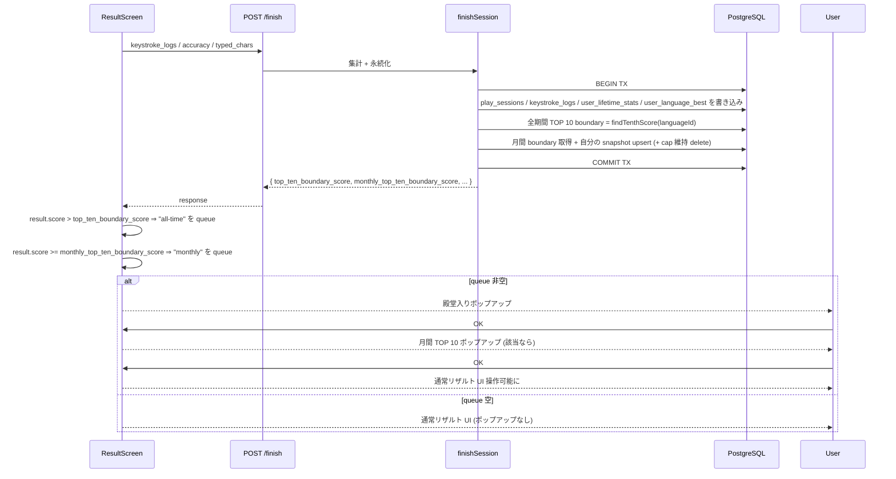

# リザルト画面 TOP 10 入賞ポップアップ

リザルト画面到達直後に、**ログインユーザーが TOP 10 入りした場合のお知らせポップアップ** を出す機能。

- **殿堂入り (全期間 TOP 10)** 入賞 → 「殿堂入りにランクインしました。他のユーザーがあなたに挑戦することが可能になります。」
- **月間 TOP 10** 入賞 → 「月間 TOP 10 にランクインしました。他のユーザーがあなたのタイピングを視聴することが可能になります。」
- 両方該当する場合は **殿堂入り → 月間** の順に 2 枚順次表示
- どちらにも入賞していない場合は **そのまま結果を表示** (ポップアップ無し)
- ゲスト (未ログイン) は対象外 (`persisted=false` でランキング登録されないため)

このドキュメントは **仕様（What）** と **設計（How）** を分けて記述する：

- **仕様**：いつ・どのポップアップが・どの順で出るか、文言、表示条件
- **設計**：判定をサーバー側 `/finish` レスポンスに含める、フロントは順次表示するキューを持つ

## 関連 spec

- [`../score-ranking/README.md`](../score-ranking/README.md) — 全期間ランキング (殿堂入り) の判定ルール。`top_ten_boundary_score` は既に `/finish` レスポンスに含まれている
- [`../monthly-ranking/README.md`](../monthly-ranking/README.md) — 月間ランキング。本機能は **monthly-ranking v2 のリアルタイム反映** が前提
- [`../rewards/README.md`](../rewards/README.md) — Hall of Fame コメント入力モーダルとの関係 (= 別 UI で併存)

## 目次

- [仕様](#仕様)
  - [対象ユーザー](#対象ユーザー)
  - [ポップアップの種類と文言](#ポップアップの種類と文言)
  - [入賞判定ルール](#入賞判定ルール)
  - [表示順序と挙動](#表示順序と挙動)
  - [既存「TOP 10 入り見込み」カードとの関係](#既存top-10-入り見込みカードとの関係)
- [設計](#設計)
  - [判定はサーバー側 `/finish` で行う](#判定はサーバー側-finish-で行う)
  - [`FinishPlaySessionResponse` 拡張](#finishplaysessionresponse-拡張)
  - [Service 実装](#service-実装)
  - [フロント実装 (キュー順次表示)](#フロント実装-キュー順次表示)
  - [cheat 防止 / クライアント信頼性](#cheat-防止--クライアント信頼性)
- [必要な画面](#必要な画面)
- [必要な API](#必要な-api)
- [必要な DB 設計](#必要な-db-設計)
- [フロー図](#フロー図)

---

## 仕様

### 対象ユーザー

- **ログインユーザーのみ** (`persisted=true`)。ゲストは対象外 — ゲストはランキングに登録されないため
- 各言語別に判定。サーバー判定はセッションの言語別に行うが、result 画面のグレード補助 fetch のみ TypeScript 固定

### ポップアップの種類と文言

#### 殿堂入り (全期間 TOP 10)
- タイトル: 「🏆 殿堂入りにランクインしました」
- 本文: 「他のユーザーがあなたに挑戦することが可能になります。」
- ボタン: 「OK」(1 つだけ)

#### 月間 TOP 10
- タイトル: 「🏆 月間 TOP 10 にランクインしました」
- 本文: 「他のユーザーがあなたのタイピングを視聴することが可能になります。」
- ボタン: 「OK」(1 つだけ)

### 入賞判定ルール

| 種別 | 判定 |
|---|---|
| 殿堂入り | `result.top_ten_boundary_score === null` または `result.score >= result.top_ten_boundary_score`（`findTenthScore` が upsert 後の値を返すため、自分自身が境界 score と一致するケースを含めて `>=` で判定する。`null` は全期間で 10 件未満の状態） |
| 月間 TOP 10 | `result.monthly_top_ten_boundary_score` が `null` (= 当月 10 件未満) または `result.score >= result.monthly_top_ten_boundary_score` |

判定は **サーバー側 `/finish`** で行い、レスポンスに含めて返す。クライアントは booly な判定だけ受け取って表示するか決める (= cheat 不可能)。

### 表示順序と挙動

1. リザルト画面到達 → サーバー判定済みの結果を見てキューを構築 (殿堂入り該当なら "all-time"、月間該当なら "monthly" を順に push)
2. キューが空でなければ先頭のポップアップを表示
3. ユーザーが「OK」で閉じる → キューから 1 件取り除く → 次があれば自動で次のポップアップを表示
4. キューが空になれば通常のリザルト画面 UI が見える状態

両方該当時の順序は **殿堂入り → 月間** で固定 (殿堂入りの方が重要度高、視聴より挑戦が「強い」体験のため先に出す)。

### 既存「TOP 10 入り見込み」カードとの関係

リザルト画面の本文中には既に「🏆 TOP 10 入り見込み！殿堂入りに掲載されます。記念にコメントを残しませんか？」というインラインカードが存在する ([rewards spec](../rewards/README.md))。これは **コメント入力導線** として残し、ポップアップとは役割を分担する:

- **ポップアップ** (本機能) = 入賞のお知らせ (情報伝達)
- **インラインカード** (既存) = Hall of Fame コメント入力導線 (アクション促し)

両者が同時に存在しても役割が違うので UX 上の混乱は起きない。

---

## 設計

### 判定はサーバー側 `/finish` で行う

入賞判定をフロントで行うのではなく、`/finish` のレスポンスに含めて返す。理由:

- **cheat 不可**: クライアントが入賞演出を勝手に出すことを防ぐ
- **追加 fetch 不要**: リザルト遷移直後に追加 API を叩かなくて済む → 表示ラグが無い
- **整合性**: 殿堂入りも月間も `/finish` の同 transaction 内で判定 (monthly-ranking v2 のリアルタイム反映前提)

### `FinishPlaySessionResponse` 拡張

`packages/schema/src/api-schema/play-session.ts`:

```ts
export const finishPlaySessionResponseSchema = z.object({
  // 既存フィールド ...
  top_ten_boundary_score: z.number().int().nonnegative().nullable(),
  /** 月間 TOP 10 の boundary (= 当月 N 位の score)。
   *  null は「当月のエントリ件数が cap 未満で誰でも入賞」の状態 */
  monthly_top_ten_boundary_score: z.number().int().nonnegative().nullable(),
})
```

`FinishGuestPlaySessionResponse` には追加しない (ゲストは対象外)。

### Service 実装

`apps/api/src/service/play-session-service.ts` の `finishSession` 内で、既存の transaction 終了後に追加クエリ:

```ts
// 既存: const topTenBoundaryScore = await ...userLanguageBestRepository.findTenthScore(state.languageId)

// 新規: 月間 TOP 10 cap 維持 + boundary 取得
const yearMonth = currentYearMonthJst(playedAt)
const monthlyCount = await repo.monthlyRankingSnapshotRepository.countByLanguage(yearMonth, state.languageId)
const monthlyBoundary = monthlyCount === 0
  ? null
  : await repo.monthlyRankingSnapshotRepository.findBoundaryScore(yearMonth, state.languageId, MONTHLY_TOP_TEN_CAP)

// 入賞条件 (今回スコアで判定。upsert の update で過去ベストが上書きされる前提)
const isMonthlyTopTen = monthlyCount < MONTHLY_TOP_TEN_CAP || score >= (monthlyBoundary ?? 0)

if (isMonthlyTopTen) {
  // 自分の行を upsert (update 時は今回スコアで上書き)
  await repo.monthlyRankingSnapshotRepository.upsertForUser({
    yearMonth, languageId: state.languageId, userId: state.userId,
    score, accuracy, playedAt,
  })
  // TOP 10 cap 維持: cap 件超になったら自分以外の最低スコアを delete
  const newCount = await repo.monthlyRankingSnapshotRepository.countByLanguage(yearMonth, state.languageId)
  if (newCount > MONTHLY_TOP_TEN_CAP) {
    await repo.monthlyRankingSnapshotRepository.deleteLowestExcluding(yearMonth, state.languageId, state.userId)
  }
}

// レスポンスに含める
return ok({
  // ... 既存フィールド
  monthly_top_ten_boundary_score: isMonthlyTopTen ? null : monthlyBoundary,
  // ↑ "入賞しているなら null (= 自分が境界より上)、入賞していないなら境界 score"
  // とすると判定がややこしいので、シンプルに「現在の boundary」を返す方が良い:
  //   フロント側で result.score >= monthly_top_ten_boundary_score の比較で表示
})
```

レスポンスでは **`monthly_top_ten_boundary_score`** を「**自分の upsert を含む** 現時点の TOP 10 中の最低スコア」または `null` (10 件未満) として返す。フロントは:

```ts
const isMonthlyTopTenEntry = !isGuest && (
  result.monthly_top_ten_boundary_score === null
  || result.score >= result.monthly_top_ten_boundary_score
)
```

で判定する。これは `top_ten_boundary_score` (全期間) と shape を揃えた設計。

(実装の詳細は [`step1-api-finish-monthly-extension.md`](./step1-api-finish-monthly-extension.md) を参照)

### フロント実装 (キュー順次表示)

`apps/web/src/app/play/[sessionId]/result-screen.tsx`:

```tsx
/**
 * useState の lazy initializer 内で result から直接 queue を 1 度だけ計算する。
 * result はリザルト到達時点で確定しており、後から変わらないため useEffect は不要。
 */
const [announcementQueue, setAnnouncementQueue] = useState<("all-time" | "monthly")[]>(() => {
  if (!result.persisted) return []  // ゲスト (= persisted=false) は対象外
  const queue: ("all-time" | "monthly")[] = []
  if (result.top_ten_boundary_score === null || result.score >= result.top_ten_boundary_score) {
    queue.push("all-time")
  }
  if (result.monthly_top_ten_boundary_score === null || result.score >= result.monthly_top_ten_boundary_score) {
    queue.push("monthly")
  }
  return queue
})

const closeTopAnnouncement = () => {
  setAnnouncementQueue((prev) => prev.slice(1))
}

return (
  <>
    {/* リザルト本体 */}
    ...

    {announcementQueue.length > 0 && (
      <TopTenAnnouncementModal
        kind={announcementQueue[0]}
        onClose={closeTopAnnouncement}
        open
      />
    )}
  </>
)
```

`<TopTenAnnouncementModal>` は新規コンポーネント (`apps/web/src/components/top-ten-announcement-modal.tsx`)、`kind` で文言を切り替える。

### cheat 防止 / クライアント信頼性

- 判定はすべてサーバー側 (`/finish` 内) で行うので、クライアントが score を改ざんしても入賞判定はサーバーの正しい結果を返す
- フロントは「`result.score` と `result.monthly_top_ten_boundary_score` を比較するだけ」だが、それは UI 表示の条件分岐に過ぎず、改ざんしてもポップアップが出るだけで実態 (ランキング DB) は変わらない
- 「ポップアップ表示の有無」と「ランキング DB の状態」は同じソース (`/finish` レスポンス) から作られるため整合する

---

## 必要な画面

| 画面 | 役割 |
|---|---|
| リザルト画面 (`/play/[sessionId]`) | リザルト到達直後に該当ポップアップを順次表示。本体 UI は既存のまま |

## 必要な API

新規エンドポイントなし。既存 `POST /api/play-sessions/[id]/finish` のレスポンスに `monthly_top_ten_boundary_score` を追加するのみ。

## 必要な DB 設計

新規テーブルなし。`monthly_ranking_snapshots` への書き込み詳細は [`monthly-ranking spec`](../monthly-ranking/README.md) を参照。

## フロー図



## 実装の分割

- [`step1-api-finish-monthly-extension.md`](./step1-api-finish-monthly-extension.md): `FinishPlaySessionResponse` 拡張 + Service / Repository の月間 snapshot 同期 UPSERT + boundary 算出
- [`step2-web-result-popup.md`](./step2-web-result-popup.md): `<TopTenAnnouncementModal>` 新規 + `<ResultScreen>` で キュー順次表示
