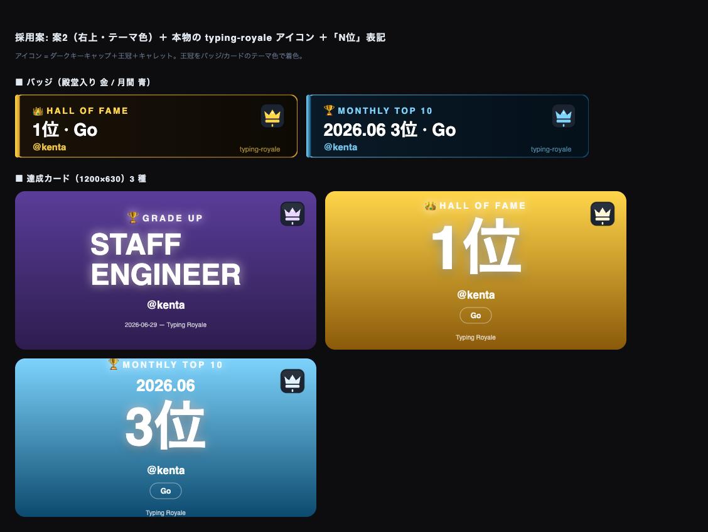
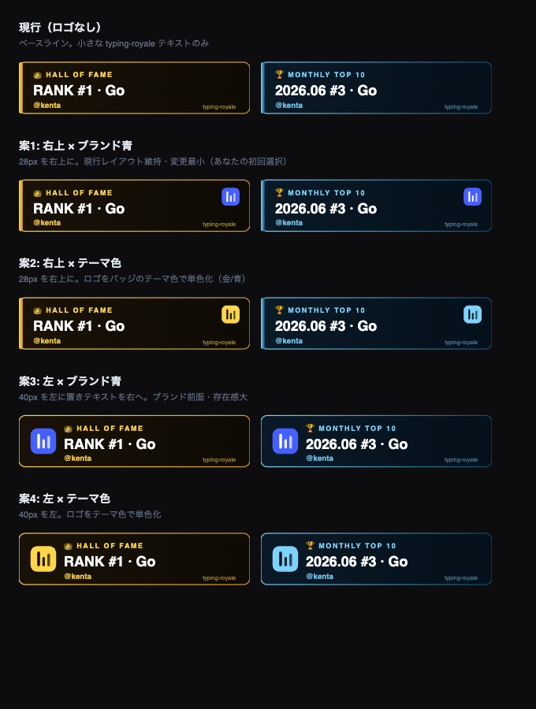

# 特典バッジ/カードへの typing-royale ロゴ追加（デザイン案）

生成される特典画像（殿堂入り / 月間 TOP10 バッジ、各種カード）に typing-royale のブランドアイコンを入れる。採用案が決まり次第 `packages/generate-image` に実装する。

## 目次

- [採用デザイン（確定）](#採用デザイン確定)
- [背景](#背景)
- [生成範囲（言語ごとの作り分け）](#生成範囲言語ごとの作り分け)
- [使用するロゴ素材](#使用するロゴ素材)
- [デザイン候補一覧（検討経緯）](#デザイン候補一覧検討経緯)
  - [案1: 右上 × ブランド青](#案1-右上--ブランド青)
  - [案2: 右上 × テーマ色](#案2-右上--テーマ色)
  - [案3: 左 × ブランド青](#案3-左--ブランド青)
  - [案4: 左 × テーマ色](#案4-左--テーマ色)
- [比較とおすすめ](#比較とおすすめ)
- [実装時の反映範囲](#実装時の反映範囲)

## 採用デザイン（確定）

レビューの結果、以下に決定。

- **配置**: 右上（案2）
- **配色**: テーマ色 — アイコンの**王冠をバッジ/カードのテーマ色で着色**（殿堂入り=金 / 月間=青 / 昇格=各グレード色）
- **アイコン**: 本物の typing-royale アイコン（`apps/web/src/app/icon.svg` = ダークなキーキャップ＋王冠＋タイピングキャレット）。※検討初期に使っていた `apps/admin` の 3 本バーは管理画面テンプレートのロゴだったので不採用
- **順位表記**: `#1` / `#3` ではなく **`1位` / `3位`**（日本語で直感的に）

バッジ（殿堂入り 金 / 月間 青）と達成カード 3 種（GRADE UP / HALL OF FAME / MONTHLY TOP10、各 1200×630）の確定イメージ:

再現用モック: [`mock2.html`](./mock2.html)（ローカルで開くと再描画される）

## 背景

現状の特典バッジ/カードにはブランドのアイコンが入っておらず、右下に小さな `typing-royale` テキストがあるのみ。SNS でシェアされたときにブランドが伝わりにくいため、ロゴアイコンを追加したい。

## 生成範囲（言語ごとの作り分け）

特典画像は type によって粒度が異なる。**殿堂入り / 月間は言語ごとに別々の PNG・SVG が生成される。**

| type | 言語ごと | SVG | PNG | 保存パス例 |
|---|---|---|---|---|
| `hall_of_fame_in`（殿堂入り） | ✅ | ✅ | ✅ | `special-badges/{user}-hof-{language}.png` |
| `monthly_top_ten`（月間 TOP10） | ✅ | ✅ | ✅ | `special-badges/{user}-monthly-{language}-{ym}.png` |
| `grade_up`（昇格カード） | ❌（グレード単位） | ✗ | ✅ | `{user}-{rewardId}.png` |

## 使用するロゴ素材

**`apps/web/src/app/icon.svg`**（64×64、ダークなキーキャップ＋金の王冠＋タイピングキャレット）が typing-royale の本物のアイコン。実装ではこの path を generate-image に取り込み、王冠/キャレットの色をテーマ色に差し替える。

> 注: `apps/admin/public/images/logo/logo-icon.svg`（青の 3 本バー）は管理画面テンプレート由来のロゴで、typing-royale のアイコンではない（検討初期の候補画像で誤って使用していた）。

## デザイン候補一覧（検討経緯）

下図は配置×配色の比較に使った初期候補（**ロゴは admin の旧ロゴ**で描画している点に注意。確定デザインは上記「採用デザイン」を参照）。一番上は現行（ロゴなし）。

### 案1: 右上 × ブランド青

28px のアイコンを右上に配置。現行レイアウト（左アクセントバー・絵文字・右下 wordmark）を維持し**変更が最小**。ブランド色 `#465FFF` をそのまま使う。

### 案2: 右上 × テーマ色

配置は案1 と同じ右上。アイコンをバッジのテーマ色（金 / 青）で単色化し統一感を出す。ブランド色は薄れる。

### 案3: 左 × ブランド青

40px のアイコンを左に置き、テキストを右へ寄せる。**ブランドを前面に出す**。左アクセントバーは廃止しレイアウトを再構成。

### 案4: 左 × テーマ色

配置は案3 と同じ左。アイコンをテーマ色で単色化。

## 比較とおすすめ

| 観点 | 右上（案1/2） | 左（案3/4） |
|---|---|---|
| レイアウト変更量 | 小（既存維持） | 大（テキスト移動・バー廃止） |
| ブランドの存在感 | 控えめ | 強い |
| 既存の見た目との一貫性 | 高い | 中 |

| 観点 | ブランド青（案1/3） | テーマ色（案2/4） |
|---|---|---|
| ブランド認知 | 高い | 中 |
| バッジ内の色の統一感 | 中（青が差し色） | 高い |

（初期おすすめは案1 だったが、レビューの結果**案2（右上 × テーマ色）+ 本物アイコン**に決定。[採用デザイン（確定）](#採用デザイン確定)を参照）

## 実装時の反映範囲

`packages/generate-image` の以下に確定デザイン（右上・テーマ色・本物アイコン・「N位」表記）を反映する。

- `badge-svg-hof.ts` / `badge-svg-monthly.ts`（SVG。インライン `<g>` でロゴ path を埋め込み）
- `card-renderer.ts`（PNG。satori に data URI の `` でロゴを配置）
- ロゴ markup / data URI は `brand-logo.ts` 等に一元化して 3 renderer で共有する
