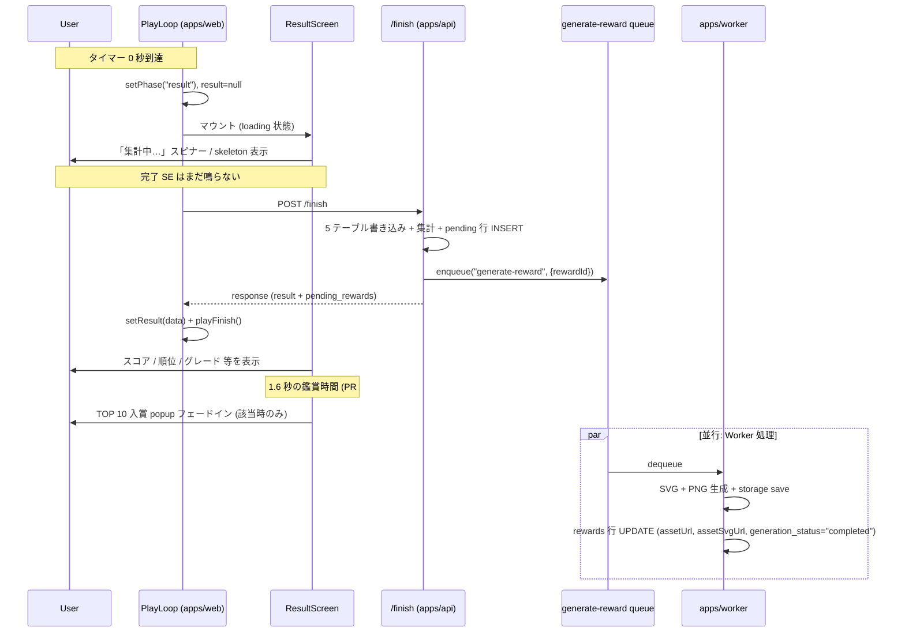
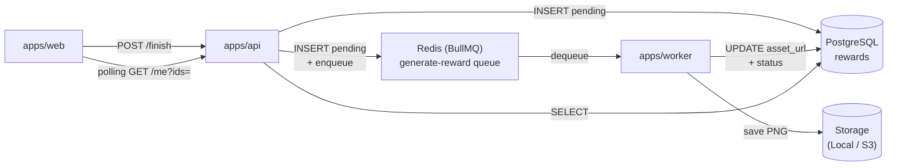
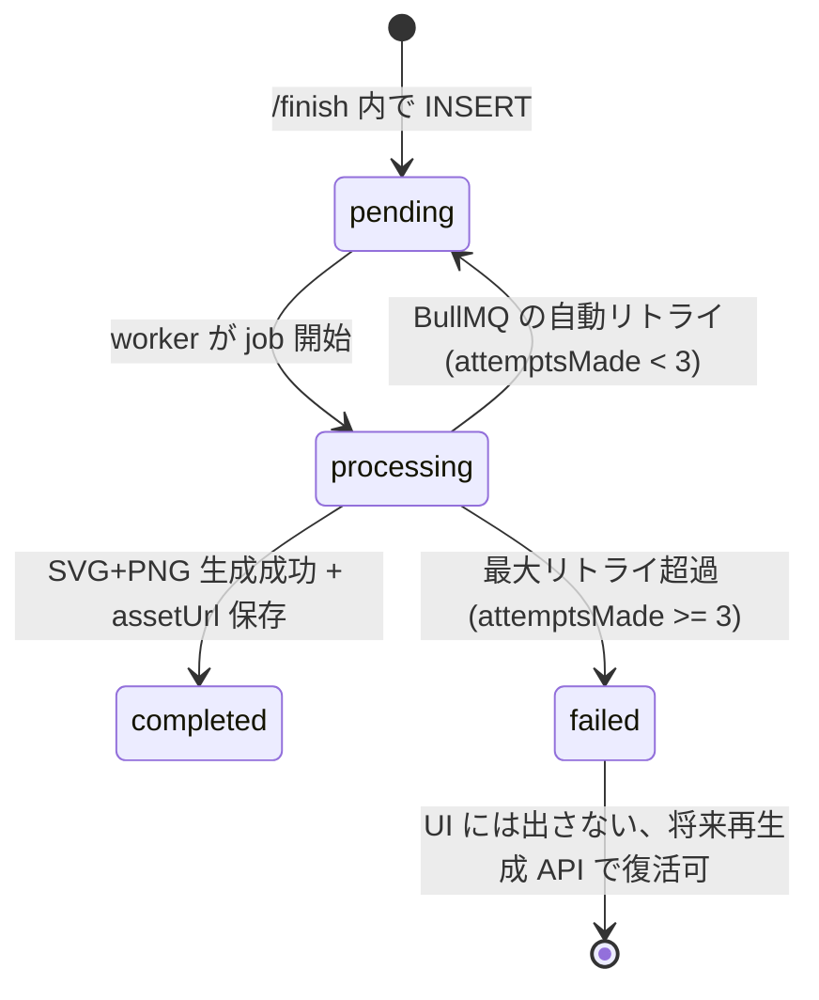
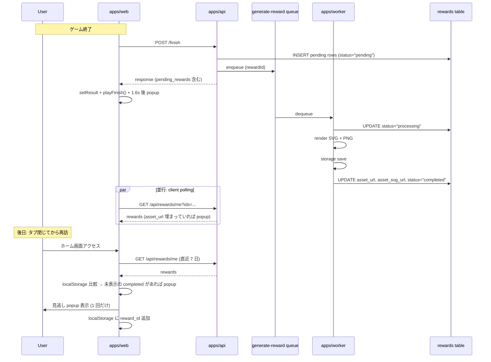
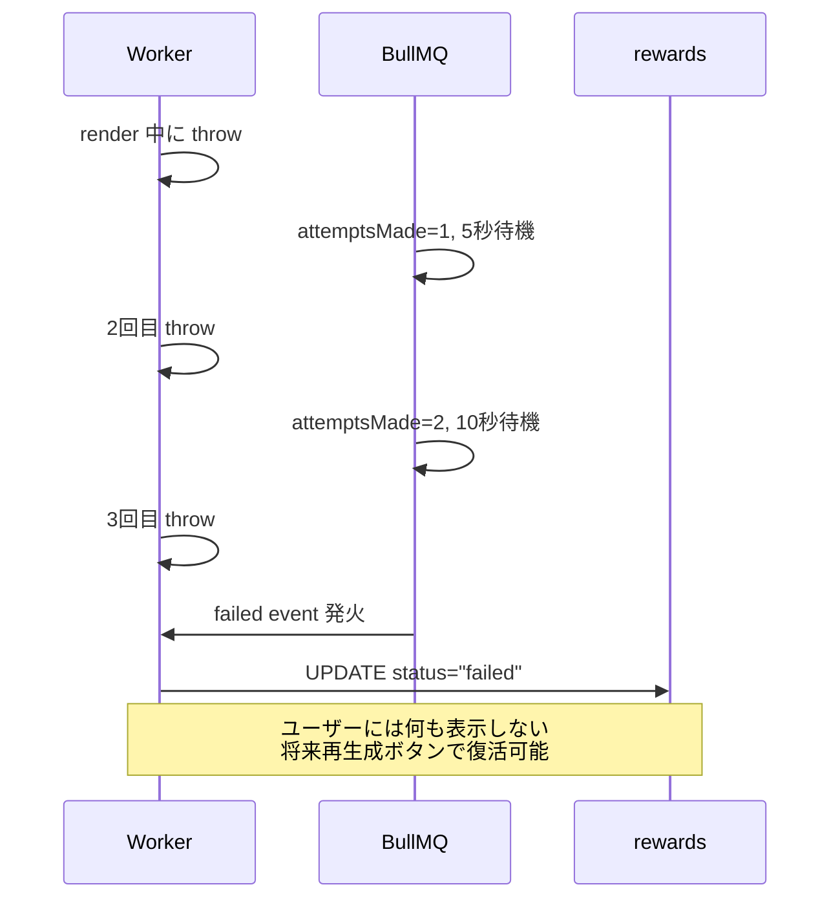

# 報酬画像の非同期 Worker 化 + UX 改善

`/finish` API が grade_up カードの PNG を同期生成しているせいでレスポンス遅延（実測で秒単位）が起きており、リザルト画面遷移が体感「フリーズ」していた。これを解消するため:

1. **画像生成を BullMQ Worker に分離**して `/finish` を高速化する
2. リザルト画面の UI フローを「即時遷移 → 集計中表示 → 結果到着で音 + 表示 → ポップアップ」に再構成
3. ホーム再訪時の「**見逃し popup**」（worker 完了済だがユーザー未確認）を追加

このドキュメントは **仕様（What）** と **設計（How）** を分けて記述する：

- **仕様**：ユーザー視点の体験変化、新しい挙動
- **設計**：apps/worker / packages/queue の構造、`/finish` の責務縮小、status カラム

## 関連 spec

- [`../special-badges/README.md`](../special-badges/README.md) — 殿堂入り / 月間 TOP 10 バッジ。既存の pending 行 + client fire-and-forget スキームを本 spec で置き換える
- [`../rewards/README.md`](../rewards/README.md) — grade_up 達成カード PNG。本 spec で非同期化対象
- [`../result-top-ten-popup/README.md`](../result-top-ten-popup/README.md) — TOP 10 入賞 popup。本 spec でタイミングを再定義
- [`../shared-packages/README.md`](../shared-packages/README.md) — `@repo/db` / `@repo/logger` / `@repo/redis` 等の共通基盤
- 参考: 兄弟プロジェクト `project-template` の `apps/worker` / `packages/queue` を踏襲

## 目次

- [仕様](#仕様)
  - [従来との挙動差分](#従来との挙動差分)
  - [リザルト画面の新フロー](#リザルト画面の新フロー)
  - [ホーム再訪時の見逃し popup](#ホーム再訪時の見逃し-popup)
  - [対象となる reward 種別](#対象となる-reward-種別)
  - [生成失敗時の挙動](#生成失敗時の挙動)
- [設計](#設計)
  - [全体アーキテクチャ](#全体アーキテクチャ)
  - [packages/queue (新規)](#packagesqueue-新規)
  - [apps/worker (新規)](#appsworker-新規)
  - [/finish の責務縮小](#finish-の責務縮小)
  - [generation\_status カラム追加](#generation_status-カラム追加)
  - [削除するもの](#削除するもの)
  - [失敗時のステータス管理](#失敗時のステータス管理)
  - [冪等性](#冪等性)
  - [デプロイ構成 (ECS)](#デプロイ構成-ecs)
- [必要な画面](#必要な画面)
- [必要な API](#必要な-api)
- [必要な DB 設計](#必要な-db-設計)
- [フロー図](#フロー図)
- [ステップ分割](#ステップ分割)

---

## 仕様

### 従来との挙動差分

| 項目 | 従来 | 新仕様 |
|---|---|---|
| `/finish` レスポンス時間 | grade_up 発生時に秒単位 (satori + resvg + storage save が同期) | 数十〜数百 ms（pending 行 INSERT + enqueue のみ） |
| プレイ画面 → リザルト遷移 | `/finish` 完了まで playing 画面のまま固まる | タイマー 0 で即遷移、リザルト画面に「集計中…」表示 |
| 完了 SE のタイミング | タイマーが 0 になった瞬間（API 待ち中に鳴る） | `/finish` レスポンス到着時に再生（結果表示と同期） |
| TOP 10 popup のタイミング | リザルト到達と同時 | 結果表示後 1.6 秒遅延 + ゆっくりフェードイン（PR #154 で対応済） |
| 画像生成の実行場所 | `/finish` API の async chain | `apps/worker` プロセスが BullMQ の `generate-reward` queue から消費 |
| 画像生成失敗時 | grade_up は warn ログのみで握りつぶし、HoF/Monthly は次回ログイン時の reconcile で再試行 | BullMQ が 3 回まで自動リトライ、超えたら `generation_status = "failed"` で停止（ユーザーには非表示） |
| 見逃し popup | 無し（リザルト画面を閉じると永久に見逃す） | ホーム画面アクセス時に「未表示の完成済 reward」があれば 1 回だけ popup 表示 |

### リザルト画面の新フロー



### ホーム再訪時の見逃し popup

リザルト画面で popup を見られなかったユーザー（タブを閉じた、結果画面を即離脱、worker 処理が間に合わなかった 等）を救済する。

- **挙動**: ホーム画面にアクセスしたとき、worker が生成完了したが未表示の reward があれば popup でその画像を見せる
- **「未表示」の判定**: クライアント側 `localStorage` に「ユーザーが popup を見た reward id の一覧」を保持し、サーバーから取得した完成済 reward のうちその一覧に含まれないものを表示
- **表示回数**: 1 reward につき 1 回だけ（localStorage に id を追加した時点で「表示済」扱い）
- **対象期間**: 直近 7 日以内に `granted_at` を持つ reward に限定（古い reward を蒸し返さない）
- **対象 reward**: `generation_status = "completed"` かつ `asset_url IS NOT NULL`

### 対象となる reward 種別

`grade_up` / `hall_of_fame_in` / `monthly_top_ten` のすべて。今後 `card` / `3d` / `lottie` / `trading_card` 等が追加されても同じスキームで扱える。

### 生成失敗時の挙動

- BullMQ が 3 回まで自動リトライ（exponential backoff、5 秒スタート）
- 全リトライ失敗したら `rewards.generation_status = "failed"` を保存
- **ユーザーには何も表示しない**（pending 行は DB に残るが UI に出さない）
- 将来「再生成リクエスト」ボタンや「失敗 reward 一覧」を作る余地を残す（status カラムだけ管理）

---

## 設計

### 全体アーキテクチャ



apps/web は何も「叩か」ない（fire-and-forget 不要）。ただ polling するだけ。

### packages/queue (新規)

`project-template/packages/queue` を踏襲して新規作成。Queue 抽象 + BullMQ 実装を含む。

**ファイル構成**:

```
packages/queue/
├── package.json
├── tsconfig.json
├── eslint.config.js
└── src/
    ├── index.ts                 # 全 export
    ├── types.ts                 # JobQueue<T> / JobProcessor<T> / JobConsumer interface
    ├── bullmq-queue.ts          # BullMQ 実装 (BullMQJobQueue<T> + startBullMQWorker)
    └── jobs/
        ├── index.ts             # 全 job 定義の re-export
        └── generate-reward.ts   # GENERATE_REWARD_QUEUE_NAME + GenerateRewardJobData + jobId helper
```

**公開する型と定数**:

```typescript
export const GENERATE_REWARD_QUEUE_NAME = "generate-reward"

export type GenerateRewardJobData = {
  rewardId: number
}

export const buildGenerateRewardJobId = (rewardId: number): string =>
  `generate-reward-${rewardId}`
```

**ポイント**:
- Job 識別子 (`jobId`) は `rewardId` 単位で決定的に生成 → BullMQ が同じ jobId のジョブを自動的に重複排除
- Producer (`apps/api`) と Consumer (`apps/worker`) は `@repo/queue` の **同じ型・定数を共有**
- 将来 SQS / Cloud Tasks に乗り換える場合、`JobQueue<T>` interface 実装を差し替えるだけ

### apps/worker (新規)

`project-template/apps/worker` を踏襲して新規作成。複数 worker を持てる構成にしておく（初期は `generate-reward` のみ）。

**ファイル構成**:

```
apps/worker/
├── package.json
├── tsconfig.json
├── tsconfig.build.json
├── eslint.config.js
├── .env.local                   # 暗号化された REDIS_URL / DATABASE_URL
└── src/
    ├── index.ts                 # main: redis/prisma 生成 → startGenerateRewardWorker() → graceful shutdown
    ├── env.ts                   # Zod env スキーマ (DATABASE_URL / REDIS_URL / WORKER_CONCURRENCY=1)
    ├── runtime/
    │   └── graceful-shutdown.ts # SIGINT/SIGTERM ハンドラ
    ├── workers/
    │   └── generate-reward-worker.ts  # startGenerateRewardWorker(args): 組み立てのみ
    ├── jobs/
    │   └── generate-reward.ts   # generateReward({rewardRepo, userRepo, cardStorage}): JobProcessor
    └── repository/
        └── prisma/
            ├── index.ts
            └── reward-repository.ts  # apps/api と同じ interface 実装 (DI)
```

**ポイント**:
- `WORKER_CONCURRENCY = 1`（仕様確定: 単一プロセス、単一 in-flight ジョブ）
- `apps/api` から `card-renderer.ts` / `badge-svg-hof.ts` / `badge-svg-monthly.ts` / `card-storage.ts` を **そのまま import するのではなく** 共通利用するため `packages/reward-renderer` (新規) に移動する（後述）

#### 共通化: packages/reward-renderer (新規)

`apps/api` と `apps/worker` の両方が SVG/PNG 生成ロジックを使うため、共通パッケージに切り出す。

```
packages/reward-renderer/
└── src/
    ├── index.ts
    ├── badge-svg-hof.ts
    ├── badge-svg-monthly.ts
    └── card-renderer.ts        # renderGradeUpCard / renderHallOfFameCard / renderMonthlyTopTenCard
```

`card-storage.ts` (LocalCardStorage / S3CardStorage) も同じく共通化すべきだが、storage interface が複雑なので **本 spec のスコープではコピーで対応**（DRY 違反は技術負債として記録）。

### /finish の責務縮小

**Before** (`apps/api/src/service/play-session-service.ts`):
```typescript
// 既存
if (gradeUp !== null) {
  await rewardsService.createCard(...)  // 同期、satori + resvg + save
}
const pendingRewards = await detectAndInsertPendings(...)  // HoF / Monthly のみ
return ok({ ..., pendingRewards })
```

**After**:
```typescript
const pendingRewards = await detectAndInsertPendings(...)
// grade_up / hall_of_fame_in / monthly_top_ten すべて INSERT pending + enqueue
for (const p of pendingRewards) {
  await generateRewardQueue.enqueue(
    { rewardId: p.rewardId },
    { jobId: buildGenerateRewardJobId(p.rewardId) },
  )
}
return ok({ ..., pendingRewards })
```

`pending_rewards` の schema に **`grade_up` 形式を追加**:

```typescript
// packages/schema/src/api-schema/rewards.ts
export const pendingRewardSchema = z.discriminatedUnion("type", [
  z.object({ type: z.literal("hall_of_fame_in"), language, rank, reward_id }),
  z.object({ type: z.literal("monthly_top_ten"), language, rank, year_month, reward_id }),
  // NEW
  z.object({ type: z.literal("grade_up"), grade_slug: z.string(), reward_id }),
])
```

これにより `/finish` で grade_up が発生した場合も `pending_rewards` に乗り、リザルト画面の polling 対象になる。

### generation_status カラム追加

`rewards` テーブルに `generation_status TEXT NOT NULL DEFAULT 'pending'` を追加。

```prisma
model Reward {
  id                Int      @id @default(autoincrement())
  userId            Int      @map("user_id")
  type              String
  payload           Json
  assetUrl          String?  @map("asset_url")
  assetSvgUrl       String?  @map("asset_svg_url")
  generationStatus  String   @default("pending") @map("generation_status")
  // "pending" | "processing" | "completed" | "failed"
  grantedAt         DateTime @map("granted_at")
  createdAt         DateTime @default(now()) @map("created_at")
  updatedAt         DateTime @updatedAt @map("updated_at")
  ...
}
```

**ステート遷移**:



### 削除するもの

| 削除対象 | 理由 |
|---|---|
| `apps/api/src/controller/rewards/generate.ts` | クライアントが叩く必要が無くなる |
| `POST /api/rewards/generate` ルート登録 | 同上 |
| `apps/web/src/app/api/internal/rewards/generate/route.ts` | 内部 bridge も不要 |
| `apps/api/src/service/rewards-service.ts::generateReward` (export) | worker から `packages/reward-renderer` 経由で直接生成するため不要 |
| `apps/api/src/service/rewards-service.ts::reconcilePendingRewards` | BullMQ のリトライで代替、自己修復ロジック不要 |
| `apps/api/src/controller/auth/github.ts` の reconcile 呼び出し | 同上 |
| `apps/web/src/app/play/[sessionId]/result-screen.tsx` の `POST /api/internal/rewards/generate` fire-and-forget | クライアントは何も叩かない |

クライアントの polling 経路 (`GET /api/internal/rewards/me?ids=...`) は維持。これは「生成済か」を確認するだけなので worker 化と独立。

### 失敗時のステータス管理

- BullMQ の `defaultJobOptions.attempts: 3` + `backoff: { type: "exponential", delay: 5000 }`
- 1 回目失敗 → 5 秒後にリトライ
- 2 回目失敗 → 10 秒後にリトライ
- 3 回目失敗 → BullMQ は `failed` queue に積む
- BullMQ の `failed` event hook で `rewards.generation_status = "failed"` を UPDATE
- ユーザーには UI 上何も表示しない（spec で確認済）
- 将来のために `generation_status` だけ保存しておく

### 冪等性

ジョブは中断・再実行で複数回走りうるため、`generateReward(rewardId)` は冪等:

1. `rewards` を SELECT
2. `generation_status === "completed"` かつ `assetUrl !== null` → 既に完成、no-op で return
3. `generation_status` を "processing" に UPDATE
4. SVG + PNG 生成 + storage save
5. `assetUrl`, `assetSvgUrl`, `generation_status = "completed"` を UPDATE
6. throw した場合は 3 で書いた "processing" のままで終わる → BullMQ がリトライ時に再度 SELECT して "processing" を見るが、それも上書きして再生成すれば良い

### デプロイ構成 (ECS)

- `apps/cron` と同じレーンで ECS Service として起動
- ECS Service: 単一 task definition、`desiredCount = 1`（仕様確定: 単一）
- Container 起動コマンド: `node dist/index.js`（`apps/cron` と同じ）
- 環境変数:
  - `REDIS_URL`（既存と同じ Redis）
  - `DATABASE_URL`
  - `REWARDS_CACHE_DIR`（Storage Local 用、本番 S3 移行時は別 env）
  - `LOG_LEVEL`
- ECS health check: `node -e 'process.exit(0)'`（BullMQ Worker は HTTP を持たない）
- 終了シグナル: SIGTERM で graceful shutdown（in-flight ジョブの完了を待つ）

---

## 必要な画面

| 画面 | 概要 |
|---|---|
| リザルト画面 (`/play/[sessionId]`) の loading 状態 | `/finish` の response 到達前に「集計中…」placeholder を表示。スコア部分は skeleton |
| ホーム画面 (`/`) の見逃し popup | localStorage の `seen-reward-ids` と比較して未表示の完成 reward があれば 1 度だけ popup 表示 |

## 必要な API

| メソッド | パス | 説明 |
|---|---|---|
| POST | `/api/play-sessions/:id/finish` | （既存）レスポンスに `pending_rewards` を含める。`grade_up` も含まれるようになる |
| GET | `/api/rewards/me?ids=...` | （既存）ホームの polling 用。レスポンスに `generation_status` フィールドを追加 |

## 必要な DB 設計

`rewards` テーブルに 1 カラム追加するだけ:

```sql
ALTER TABLE rewards ADD COLUMN generation_status TEXT NOT NULL DEFAULT 'pending';
-- 既存行は pending とみなしておく (どうせ asset_url 入りなので worker は no-op)
UPDATE rewards SET generation_status = 'completed' WHERE asset_url IS NOT NULL;
```

## フロー図

### 全体（リザルト → 見逃し popup まで）



### 失敗時のステート遷移



---

## ステップ分割

実装は 4 step に分ける。各 step は独立した PR として merge する。

| step | スコープ | 主な影響範囲 |
|---|---|---|
| **step1** | `packages/queue` (BullMQ 抽象) + `packages/reward-renderer` (SVG/PNG 共通化) | packages のみ |
| **step2** | DB マイグレーション (`generation_status` カラム追加) + 既存行の status バックフィル | packages/db |
| **step3** | `apps/worker` 新規作成 + `apps/api` の `/finish` を enqueue 方式に refactor + `/api/rewards/generate` 削除 + reconcile 削除 | apps/worker (新規), apps/api, packages/schema |
| **step4** | apps/web の UI/UX 修正 (リザルト画面 loading 状態 + 完了 SE タイミング + ホーム見逃し popup) | apps/web |

PR の順序は **step1 → step2 → step3 → step4**（依存順）。
