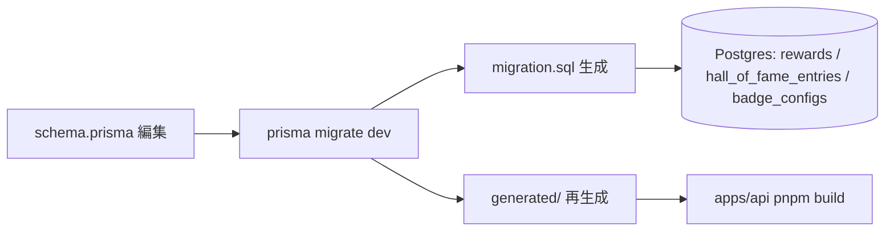

# step1: rewards / hall_of_fame_entries / badge_configs テーブル追加

rewards 機能の永続化基盤として 3 テーブルを Prisma schema に追加する。

3 テーブルはそれぞれ独立した責務を持つ：

- `rewards`: 達成カード PNG の生成記録（type=`card` / `grade_up`、`assetUrl` に S3 URL）
- `hall_of_fame_entries`: Hall of Fame コメント（1 ユーザー × 1 言語 = 1 行、リアルタイム集計のため rank は持たない）
- `badge_configs`: 動的 SVG バッジの表示設定（1 ユーザー = 1 行）

設計判断のポイント：

- score-ranking でリアルタイム集計方針が確定したため、`hall_of_fame_entries` は **rank カラムを保存しない**。Hall of Fame ページの表示時に `user_language_best` を `ORDER BY score DESC LIMIT 10` した結果と `LEFT JOIN` してコメントを合成する
- コメントの draft / 公開昇格の 2 段階管理も廃止。`comment` カラムに直接保存して即時公開する
- バッジ / Hall of Fame は `rewards` テーブルに行を作らない（テーブル責務を分割。`rewards` はあくまで「達成証明 PNG 画像の記録」に絞る）

## 目次

- [対象テーブル](#対象テーブル)
- [スキーマ追加](#スキーマ追加)
  - [`rewards` モデル](#rewards-モデル)
  - [`hall_of_fame_entries` モデル](#hall_of_fame_entries-モデル)
  - [`badge_configs` モデル](#badge_configs-モデル)
  - [既存モデルへの relation 追加](#既存モデルへの-relation-追加)
- [マイグレーション](#マイグレーション)
- [処理フロー](#処理フロー)
  - [処理の流れ](#処理の流れ)
- [設計方針](#設計方針)
- [対応内容](#対応内容)
- [動作確認](#動作確認)
- [次の step での利用](#次の-step-での利用)

## 対象テーブル

| 項目 | rewards | hall_of_fame_entries | badge_configs |
|---|---|---|---|
| Prisma model | `Reward` | `HallOfFameEntry` | `BadgeConfig` |
| 行数見積もり | ユーザー × グレードアップ回数 (8 回上限) × 節目イベント数 | ユニーク player 数 × 言語数（最大数十万） | ユニーク player 数 |
| 書き込み | step6 の `POST /api/rewards/cards` + `/finish` 拡張 | step4 の `POST /api/hall-of-fame/comments` + `PATCH /api/hall-of-fame/comments/:entryId` | step2 の `PUT /api/users/me/badge-config` |
| 読み出し | step6 の `GET /api/rewards/me` | step4 の `GET /api/hall-of-fame` + step5 の Hall of Fame ページ | step2 の `GET /badge/:username.svg` + マイページバッジ設定 |

## スキーマ追加

### `rewards` モデル

`packages/db/prisma/schema.prisma` の `UserLanguageBest` の直後に追加：

```prisma
// 達成カード PNG の生成記録
// type=card は累計達成系 (10K 文字 等)、type=grade_up はグレードアップ達成カード
// docs/spec/rewards/README.md「達成カード PNG の生成」参照
model Reward {
  id        Int      @id @default(autoincrement())
  userId    Int      @map("user_id")
  type      String /// "card" / "grade_up"。将来 "3d" / "lottie" / "trading_card" を追加
  payload   Json /// 例: { "grade_slug": "senior" } / { "milestone_label": "10K_chars" }
  assetUrl  String?  @map("asset_url") /// S3 URL。生成失敗時のみ null
  grantedAt DateTime @map("granted_at")
  createdAt DateTime @default(now()) @map("created_at")
  updatedAt DateTime @updatedAt @map("updated_at")

  user User @relation(fields: [userId], references: [id], onDelete: Cascade)

  @@index([userId, grantedAt(sort: Desc)]) /// マイページ特典タブの最新順表示
  @@map("rewards")
}
```

### `hall_of_fame_entries` モデル

```prisma
// Hall of Fame コメント (1 ユーザー × 1 言語 = 1 行)
// rank は保存しない (リアルタイム集計のため、user_language_best を ORDER BY して JOIN)
// docs/spec/rewards/README.md「Hall of Fame コメントの入力タイミング」参照
model HallOfFameEntry {
  id                 Int       @id @default(autoincrement())
  userId             Int       @map("user_id")
  languageId         Int       @map("language_id")
  bestPlaySessionId  Int       @map("best_play_session_id") /// この入賞を確定させた PlaySession
  comment            String?   @db.VarChar(300) /// 最大 300 文字。null = 未入力
  commentSubmittedAt DateTime? @map("comment_submitted_at") /// コメント送信時刻 (履歴用)
  createdAt          DateTime  @default(now()) @map("created_at")
  updatedAt          DateTime  @updatedAt @map("updated_at")

  user        User        @relation(fields: [userId], references: [id], onDelete: Cascade)
  language    Language    @relation(fields: [languageId], references: [id], onDelete: Restrict)
  playSession PlaySession @relation(fields: [bestPlaySessionId], references: [id], onDelete: Restrict)

  @@unique([userId, languageId]) /// 1 ユーザー × 1 言語 = 1 コメント
  @@index([languageId]) /// Hall of Fame ページの言語別取得 (rank 順は user_language_best を ORDER BY して LEFT JOIN)
  @@map("hall_of_fame_entries")
}
```

### `badge_configs` モデル

```prisma
// ユーザーごとの SVG バッジ表示設定
// docs/spec/rewards/README.md「動的 SVG バッジの配信戦略」参照
model BadgeConfig {
  userId       Int      @id @map("user_id")
  displayItems Json     @default("[\"grade\", \"best_score\"]") @map("display_items") /// 表示要素 slug 配列 (grade / best_score / rank / streak_days / typed_chars)
  theme        String   @default("dark") /// "dark" / "light"
  createdAt    DateTime @default(now()) @map("created_at")
  updatedAt    DateTime @updatedAt @map("updated_at")

  user User @relation(fields: [userId], references: [id], onDelete: Cascade)

  @@map("badge_configs")
}
```

### 既存モデルへの relation 追加

`User` モデルに backref：

```prisma
model User {
  // ... 既存
  rewards            Reward[]
  hallOfFameEntries  HallOfFameEntry[]
  badgeConfig        BadgeConfig?
}
```

`Language` モデルに backref：

```prisma
model Language {
  // ... 既存
  hallOfFameEntries HallOfFameEntry[]
}
```

`PlaySession` モデルに backref：

```prisma
model PlaySession {
  // ... 既存
  hallOfFameEntries HallOfFameEntry[]
}
```

## マイグレーション

```bash
cd packages/db
pnpm db:migrate --name add_rewards_tables
```

生成される SQL の確認ポイント：

- `CREATE TABLE rewards` (8 カラム + index)
- `CREATE TABLE hall_of_fame_entries` (8 カラム + unique + 2 index)
- `CREATE TABLE badge_configs` (5 カラム、PK = user_id)
- FK 計 5 本: `rewards.user_id` (CASCADE) / `hall_of_fame_entries.user_id` (CASCADE), `language_id` (RESTRICT), `best_play_session_id` (RESTRICT) / `badge_configs.user_id` (CASCADE)

## 処理フロー



### 処理の流れ

1. `schema.prisma` に `Reward` / `HallOfFameEntry` / `BadgeConfig` モデルを追加
2. `User` / `Language` / `PlaySession` に backref を追加
3. `pnpm db:migrate --name add_rewards_tables` で migration 生成 + 適用
4. `packages/db/generated/` の型が再生成される（`Reward` / `HallOfFameEntry` / `BadgeConfig` 型が利用可能になる）
5. `apps/api` の build が通ることを確認

## 設計方針

- **`hall_of_fame_entries` に `rank` カラムを持たない理由**: score-ranking と同じくリアルタイム集計方針。`rank` を保存すると他人のベスト更新時に全員の rank を再計算する必要がある。Hall of Fame ページの表示時に `user_language_best` を `ORDER BY score DESC LIMIT 10` して `LEFT JOIN hall_of_fame_entries ON (user_id, language_id)` でコメントを合成する方が軽量
- **`comment` を 1 カラムで持つ理由**: README から draft / 公開昇格の 2 段階管理を廃止（cron バッチ廃止に合わせて）。`/finish` 完了時点でリアルタイム順位が確定しているので、コメント送信即公開で問題ない
- **`commentSubmittedAt` を持つ理由**: 編集履歴の追跡用。「最初に書いた時刻」と「最後に編集した時刻 (`updatedAt`)」を区別したい場合に使う
- **`@@unique([userId, languageId])` の理由**: 1 ユーザー × 1 言語 = 1 コメント。同じ言語でベストを更新しても新規行は作らず既存行を上書き
- **`Reward.type` を enum にしない理由**: 将来 `3d` / `lottie` / `trading_card` / `procedural_art` を追加するときに migration を増やしたくない。8 種類以下に増える想定なので string で十分
- **`Reward.payload` を jsonb にする理由**: `type` ごとに必要な情報が違う（card は milestone_label、grade_up は grade_slug など）。schema を type ごとに増やすより jsonb に閉じ込める方が運用負荷低
- **`BadgeConfig.userId` を PK にする理由**: 1 ユーザー = 1 行のため `@id` で 1:1 強制。`@@unique([userId])` よりシンプル
- **`BadgeConfig.displayItems` の default を `["grade", "best_score"]` にする理由**: 初回バッジ表示でも何か出るように。空配列だと SVG が空白になり README の見栄えが悪い
- **`onDelete` 方針**:
  - `User` 削除時は CASCADE (個人情報なので消す、README「削除対応」準拠)
  - `Language` / `PlaySession` 削除時は RESTRICT (履歴を孤児化しない)

## 対応内容

### `packages/db/prisma/schema.prisma`（編集）

`UserLanguageBest` の直後に 3 モデル追加（コードは「スキーマ追加」セクションのまま）。`User` / `Language` / `PlaySession` に backref 追加。

### マイグレーション生成

```bash
cd packages/db
pnpm db:migrate --name add_rewards_tables
```

### README 修正同 PR

- `docs/spec/rewards/README.md` の cron バッチ前提（commentDraft → 毎時バッチ昇格 / ranking_snapshots 参照）をリアルタイム集計方式に修正
- 「Hall of Fame コメントの入力タイミング」セクション、API テーブル、DB テーブル、フロー図 を更新

## 動作確認

| 区分 | 内容 |
|---|---|
| マイグレーション適用 | `pnpm db:migrate` がエラーなく完走、`migrations/` に新ディレクトリが追加される |
| Postgres 直接確認 | `docker exec typing-royale-postgres psql -U postgres -d project-template_dev -c "\d rewards"` / `\d hall_of_fame_entries` / `\d badge_configs` で全カラムが表示される |
| FK 確認 | 5 本の FK が `pg_constraint` に存在 |
| Build | `pnpm build` がルートで通る (`apps/api` で `Reward` / `HallOfFameEntry` / `BadgeConfig` 型が import 可能) |
| Lint | `pnpm lint` がルートで緑 |

### 確認 SQL

```sql
\d rewards
\d hall_of_fame_entries
\d badge_configs

SELECT conname, pg_get_constraintdef(oid) FROM pg_constraint
WHERE conrelid IN ('rewards'::regclass, 'hall_of_fame_entries'::regclass, 'badge_configs'::regclass)
  AND contype = 'f';
```

期待される FK 一覧：

- `rewards_user_id_fkey` (CASCADE)
- `hall_of_fame_entries_user_id_fkey` (CASCADE)
- `hall_of_fame_entries_language_id_fkey` (RESTRICT)
- `hall_of_fame_entries_best_play_session_id_fkey` (RESTRICT)
- `badge_configs_user_id_fkey` (CASCADE)

## 次の step での利用

- **step2 (動的 SVG バッジ)**: `badge_configs` を CRUD する API を実装、`GET /badge/:username.svg` が `users` + `user_lifetime_stats` + `badge_configs` を読んで SVG を生成
- **step4 (Hall of Fame API)**: `GET /api/hall-of-fame` が `user_language_best ORDER BY score DESC LIMIT 10 LEFT JOIN hall_of_fame_entries` でコメント込みのトップ 10 を返す。`POST /api/hall-of-fame/comments` で `comment` を upsert
- **step5 (Hall of Fame Web)**: 公開ページ + リザルト画面の TOP 10 入りモーダル + マイページのコメント編集タブが本テーブルを書き込む
- **step6 (達成カード PNG)**: `POST /api/rewards/cards` で satori + resvg-js で PNG 生成 → S3 保存 → `rewards` 行作成。`GET /api/rewards/me` が `rewards` を最新順で返す
