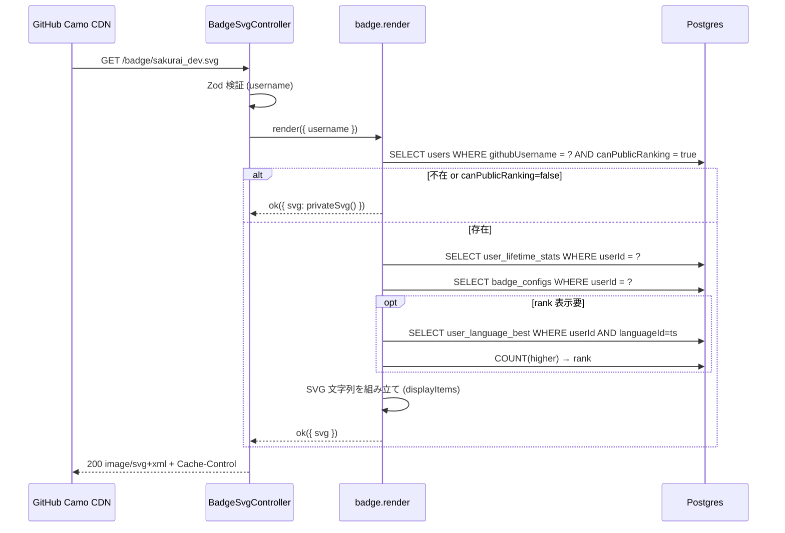
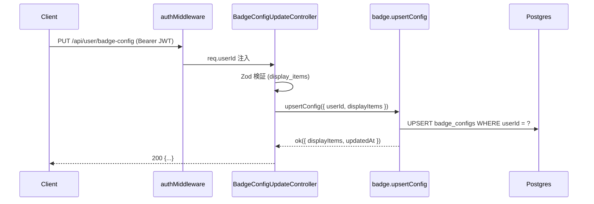

# step2: 動的 SVG バッジ API + badge_configs CRUD

README に貼る動的 SVG バッジを返す公開 API `GET /badge/:username.svg` と、表示項目を変更する `GET / PUT /api/user/badge-config` を実装する。

SVG は **JSX を介さず文字列テンプレートで生成** する（badge は固定レイアウトで装飾も限定的なため satori はオーバーキル）。 6 種の `displayItems` slug（`grade` / `best_score` / `rank` / `streak_days` / `typed_chars` / `username`）から `badge_configs.displayItems` で選択された項目のみを縦に積む。

CDN キャッシュ前提のため `Cache-Control: public, max-age=300, stale-while-revalidate=600` を返す（README「動的 SVG バッジの配信戦略」準拠）。

## 目次

- [対象 API](#対象-api)
- [依存](#依存)
- [リクエスト](#リクエスト)
  - [GET /badge/:username.svg](#get-badgeusernamesvg)
  - [GET /api/user/badge-config](#get-apiusersmebadge-config)
  - [PUT /api/user/badge-config](#put-apiusersmebadge-config)
- [レスポンス](#レスポンス)
  - [GET /badge/:username.svg](#get-badgeusernamesvg-1)
  - [GET /api/user/badge-config](#get-apiusersmebadge-config-1)
  - [PUT /api/user/badge-config](#put-apiusersmebadge-config-1)
  - [エラー](#エラー)
- [処理フロー](#処理フロー)
  - [GET /badge/:username.svg の流れ](#get-badgeusernamesvg-の流れ)
  - [PUT /api/user/badge-config の流れ](#put-apiusersmebadge-config-の流れ)
- [SVG 生成ロジック](#svg-生成ロジック)
- [設計方針](#設計方針)
- [対応内容](#対応内容)
- [動作確認](#動作確認)
- [次の step での利用](#次の-step-での利用)

## 対象 API

| 項目 | GET /badge/:username.svg | GET /api/user/badge-config | PUT /api/user/badge-config |
|---|---|---|---|
| 認証 | 不要（公開、CDN キャッシュ前提） | 必須 (Bearer JWT) | 必須 (Bearer JWT) |
| 副作用 | なし | なし | `badge_configs` upsert |
| 冪等性 | 冪等 | 冪等 | 冪等 |
| Content-Type | `image/svg+xml` | `application/json` | `application/json` |
| Cache-Control | `public, max-age=300, stale-while-revalidate=600` | デフォルト | デフォルト |
| 呼び出し元 | GitHub Camo CDN / 任意のブラウザ | apps/web の マイページバッジ設定 (step3) | 同上 |

## 依存

| 依存先 | 何を使うか | 本 step での扱い |
|---|---|---|
| step1 (`badge_configs` テーブル) | 表示設定の保存先 | 必須前提 |
| score-ranking step2 (`UserLanguageBestRepository.countHigherRanked`) | バッジに表示する rank 算出 | 流用 (TS 言語固定で集計) |
| `user_lifetime_stats` | best_score / streak_days / typed_chars / currentGrade | 既存テーブル参照 |
| `User.canPublicRanking` | 非公開ユーザーは「Private」バッジを返す | クエリ条件 |

## リクエスト

### GET /badge/:username.svg

| Path Param | 型 | 制約 | 説明 |
|---|---|---|---|
| `username` | string | 1-40 chars, 英数 + `-` + `_` | `User.githubUsername` で引く |

クエリ：なし（表示項目は `badge_configs.displayItems` から取得）

### GET /api/user/badge-config

なし（認証 cookie のみ）

### PUT /api/user/badge-config

Body:

```json
{
  "display_items": ["grade", "best_score", "rank"]
}
```

| フィールド | 型 | 必須 | 制約 | 説明 |
|---|---|---|---|---|
| `display_items` | string[] | yes | 1-5 要素、各要素は `grade` / `best_score` / `rank` / `streak_days` / `typed_chars` / `username` から選択（重複なし） | バッジに表示する項目 |

## レスポンス

### GET /badge/:username.svg

200 OK + `image/svg+xml`：

```xml
<svg xmlns="http://www.w3.org/2000/svg" width="280" height="120" viewBox="0 0 280 120">
  <!-- ... -->
</svg>
```

`canPublicRanking=false` または存在しない `username`: 200 OK + 「Private / Not Found」表示の SVG（CDN キャッシュ前提のため 404 にしない）

### GET /api/user/badge-config

```json
{
  "display_items": ["grade", "best_score"],
  "updated_at": "2026-06-08T12:34:56.000Z"
}
```

| フィールド | 型 | 説明 |
|---|---|---|
| `display_items` | string[] | 設定済み or default `["grade", "best_score"]` |
| `updated_at` | string (ISO 8601) | 最終更新 |

未保存ユーザーでもデフォルト値を返す（200、`badge_configs` 行が無くてもクライアントは「設定済み」として扱える）

### PUT /api/user/badge-config

`GET` と同じ shape を返す（upsert 後の値）

### エラー

| Status | type | 条件 | クライアント挙動 |
|---|---|---|---|
| 400 | BAD_REQUEST | `display_items` 不正 | バリデーションエラー表示 |
| 401 | UNAUTHORIZED | JWT 無し | ログイン誘導 |

`GET /badge/:username.svg` は **404 を返さず常に 200** で SVG を返す（CDN キャッシュ前提）

## 処理フロー

### GET /badge/:username.svg の流れ



#### 流れ

1. Controller が `username` を Zod で検証（NG なら 200 + 「Bad Request」SVG）
2. Service が `User` を `githubUsername` で取得（NG / `canPublicRanking=false` なら「Private」SVG を返して 200）
3. `user_lifetime_stats` を取得（無ければ defaults）
4. `badge_configs` を取得（無ければ default `["grade", "best_score"]`）
5. `displayItems` に `rank` が含まれていれば TS の `user_language_best` を引いて `countHigherRanked + 1`
6. SVG を文字列テンプレートで組み立て（width/height/各行 text 要素、常に黒背景）
7. Controller が `Content-Type: image/svg+xml` + `Cache-Control: public, max-age=300, stale-while-revalidate=600` で返す

### PUT /api/user/badge-config の流れ



#### 流れ

1. 認証 middleware が `req.userId` を注入
2. Controller が Zod で `display_items` (1-5 要素, 列挙) を検証
3. Service が `badge_configs` を upsert
4. レスポンス組み立て (snake_case 変換)

## SVG 生成ロジック

純粋関数 `buildBadgeSvg` を `apps/api/src/lib/badge-svg.ts` に定義。

入力：

```ts
type BadgeData = {
  username: string
  grade: { name: string; slug: string } | null
  bestScore: number | null
  rank: number | null
  streakDays: number
  typedChars: number
}

type BuildBadgeInput = {
  data: BadgeData
  displayItems: string[]
}
```

出力：`string`（SVG マークアップ）

実装方針：

- 幅 280 / 行高 24 / 行数 = `displayItems.length` で高さ可変
- 常に黒背景固定（`#0d1117` 背景 / `#ffffff` 文字）。テーマ選択は廃止
- `xml:lang="ja"` を付与 (ChatGPT 等で読み上げ時の言語識別)
- アクセント色（gold `#d29922`）は「Typing Royale」ロゴ行と grade 行に使う

`getPrivateBadgeSvg()` / `getBadRequestBadgeSvg()` は事前定義した固定文字列を返す。

## 設計方針

- **satori を使わない理由**: バッジは固定レイアウトで画像 / フォントの埋め込みも不要。プレーン SVG 文字列テンプレートで十分軽量。satori は達成カード PNG (step6) で導入する
- **CDN キャッシュ前提で 404 を返さない理由**: GitHub Camo CDN は 4xx をキャッシュしない一方、間違って 404 が camo に入ると README から削除されるまで「壊れた画像アイコン」が表示される。「Private」「Not Found」SVG を 200 で返す方が UX 良い
- **`username` で引く理由**: バッジ URL は `https://typing-royale.example.com/badge/sakurai_dev.svg` のような **覚えやすい URL** にしたい。`/badge/12.svg` だと README に貼ったときに「12 は誰?」になる。`User.githubUsername` を path にする（GitHub OAuth ログイン時の login をそのまま使うので衝突しない）
- **rank 計算は TS 固定**: バッジに「TS と JS の両方の rank」を出すと幅が広がる。`displayItems: ["rank"]` は **言語別ベスト 1 件しかない場合のみ意味** があるが、ユーザーがメイン言語を選ぶ仕組みが必要。MVP では TS 固定 (将来 `?lang=ts` クエリ追加)
- **`badge_configs` が無いユーザーの default**: `["grade", "best_score"]` を空読みで返す。`/finish` 初回時に勝手に row 作る方が DB が増えて重い
- **`Cache-Control: max-age=300`**: 5 分 TTL。グレードアップやベスト更新が反映されるまで最大 5 分遅延するが、CDN コストを抑えるためのトレードオフ。`stale-while-revalidate=600` で背景再取得も許可
- **PUT を upsert にする理由**: 初回設定でも 2 回目以降の更新でも同じエンドポイントで完結。POST/PATCH を分けると client 側で「初回か否か」を判別する必要があり煩雑

## 対応内容

### `packages/schema/src/api-schema/badge.ts`（新規）

```typescript
import { z } from "zod"

const DISPLAY_ITEM_SLUGS = ["grade", "best_score", "rank", "streak_days", "typed_chars", "username"] as const

export const getBadgeSvgPathParamSchema = z.object({
  username: z.string().min(1).max(40).regex(/^[a-zA-Z0-9_-]+$/),
})

export const updateBadgeConfigRequestSchema = z.object({
  display_items: z.array(z.enum(DISPLAY_ITEM_SLUGS)).min(1).max(5),
})

export const getBadgeConfigResponseSchema = z.object({
  display_items: z.array(z.enum(DISPLAY_ITEM_SLUGS)),
  updated_at: z.string().datetime(),
})

export type GetBadgeSvgPathParam = z.infer<typeof getBadgeSvgPathParamSchema>
export type UpdateBadgeConfigRequest = z.infer<typeof updateBadgeConfigRequestSchema>
export type GetBadgeConfigResponse = z.infer<typeof getBadgeConfigResponseSchema>
```

### `apps/api/src/repository/prisma/badge-config-repository.ts`（新規）

```typescript
import { PrismaClient } from "@repo/db"

export type BadgeConfigRow = {
    displayItems: string[]
    updatedAt: Date
}

export interface BadgeConfigRepository {
    findByUserId(userId: number): Promise<BadgeConfigRow | null>
    upsert(userId: number, input: { displayItems: string[] }): Promise<BadgeConfigRow>
}

export class PrismaBadgeConfigRepository implements BadgeConfigRepository {
  private _prisma: PrismaClient

  constructor(prisma: PrismaClient) {
    this._prisma = prisma
  }

  async findByUserId(userId: number): Promise<BadgeConfigRow | null> {
    const row = await this._prisma.badgeConfig.findUnique({ where: { userId } })
    if (row === null) return null
    return {
      displayItems: row.displayItems as string[],
      updatedAt: row.updatedAt,
    }
  }

  async upsert(userId: number, input: { displayItems: string[] }): Promise<BadgeConfigRow> {
    const row = await this._prisma.badgeConfig.upsert({
      create: { displayItems: input.displayItems, userId },
      update: { displayItems: input.displayItems },
      where: { userId },
    })
    return {
      displayItems: row.displayItems as string[],
      updatedAt: row.updatedAt,
    }
  }
}
```

### `apps/api/src/repository/prisma/user-repository.ts`（拡張）

`findByGithubUsername` を追加 (公開バッジ生成用):

```typescript
async findByGithubUsername(githubUsername: string): Promise<PublicProfileUser | null> {
  const row = await this._prisma.user.findFirst({
    select: { id: true, avatarUrl: true, canPublicRanking: true, createdAt: true, githubUsername: true },
    where: { githubUsername },
  })
  if (row === null) return null
  return { ...row, githubUsername: row.githubUsername }
}
```

### `apps/api/src/lib/badge-svg.ts`（新規）

純粋関数 `buildBadgeSvg(input)` / `getPrivateBadgeSvg()` / `getBadRequestBadgeSvg()` を定義。実装は SVG ヘッダー + ヒエラルキーで `<text>` 要素を縦に並べる関数（コード本体は実装時に詳細化）。

### `apps/api/src/service/badge-service.ts`（新規）

```typescript
import { err, notFoundError, ok, Result } from "@repo/errors"
import { logger } from "@repo/logger"

import { buildBadgeSvg, getPrivateBadgeSvg } from "../lib/badge-svg"
import { calcGrade } from "../lib/grade"
import {
  BadgeConfigRepository,
  BadgeConfigRow,
  LanguageRepository,
  UserLanguageBestRepository,
  UserLifetimeStatsRepository,
  UserRepository,
} from "../repository/prisma"

export const render = async (
  input: { username: string },
  repo: {
        badgeConfigRepository: BadgeConfigRepository
        languageRepository: LanguageRepository
        userLanguageBestRepository: UserLanguageBestRepository
        userLifetimeStatsRepository: UserLifetimeStatsRepository
        userRepository: UserRepository
    },
): Promise<Result<{ svg: string }>> => {
  const user = await repo.userRepository.findByGithubUsername(input.username)
  if (user === null || !user.canPublicRanking) {
    return ok({ svg: getPrivateBadgeSvg() })
  }

  const lifetime = await repo.userLifetimeStatsRepository.findByUserId(user.id)
  const config = (await repo.badgeConfigRepository.findByUserId(user.id))
    ?? { displayItems: ["grade", "best_score"], updatedAt: new Date() }

  let rank: number | null = null
  if (config.displayItems.includes("rank")) {
    const ts = await repo.languageRepository.findBySlug("typescript")
    if (ts !== null) {
      const myBest = await repo.userLanguageBestRepository.findMine(user.id, ts.id)
      if (myBest !== null) {
        rank = (await repo.userLanguageBestRepository.countHigherRanked(ts.id, myBest)) + 1
      }
    }
  }

  const bestScore = lifetime?.bestScore ?? 0
  const grade = calcGrade(bestScore)
  const typedChars = Number(lifetime?.totalTypedChars ?? 0n)

  const svg = buildBadgeSvg({
    data: { bestScore, grade, rank, streakDays: lifetime?.streakDays ?? 0, typedChars, username: user.githubUsername },
    displayItems: config.displayItems,
  })

  logger.debug("BadgeService: rendered", { displayItems: config.displayItems, username: input.username })
  return ok({ svg })
}

export const getConfig = async (
  input: { userId: number },
  repo: { badgeConfigRepository: BadgeConfigRepository },
): Promise<BadgeConfigRow> => {
  const row = await repo.badgeConfigRepository.findByUserId(input.userId)
  return row ?? { displayItems: ["grade", "best_score"], updatedAt: new Date(0) }
}

export const upsertConfig = async (
  input: { userId: number; displayItems: string[] },
  repo: { badgeConfigRepository: BadgeConfigRepository },
): Promise<BadgeConfigRow> => {
  return repo.badgeConfigRepository.upsert(input.userId, {
    displayItems: input.displayItems,
  })
}
```

### `apps/api/src/controller/badge/svg.ts`（新規）

```typescript
import { Request, Response } from "express"

import { ErrorResponse, getBadgeSvgPathParamSchema } from "@repo/api-schema"

import { getBadRequestBadgeSvg } from "../../lib/badge-svg"
import {
  BadgeConfigRepository,
  LanguageRepository,
  UserLanguageBestRepository,
  UserLifetimeStatsRepository,
  UserRepository,
} from "../../repository/prisma"
import * as service from "../../service"

const CACHE_CONTROL = "public, max-age=300, stale-while-revalidate=600"

export class BadgeSvgController {
  constructor(
        private badgeConfigRepository: BadgeConfigRepository,
        private languageRepository: LanguageRepository,
        private userLanguageBestRepository: UserLanguageBestRepository,
        private userLifetimeStatsRepository: UserLifetimeStatsRepository,
        private userRepository: UserRepository,
  ) {}

  async execute(req: Request, res: Response) {
    const parsed = getBadgeSvgPathParamSchema.safeParse(req.params)
    if (!parsed.success) {
      res.setHeader("Content-Type", "image/svg+xml")
      res.setHeader("Cache-Control", CACHE_CONTROL)
      return res.status(200).send(getBadRequestBadgeSvg())
    }

    const result = await service.badge.render(
      { username: parsed.data.username },
      {
        badgeConfigRepository: this.badgeConfigRepository,
        languageRepository: this.languageRepository,
        userLanguageBestRepository: this.userLanguageBestRepository,
        userLifetimeStatsRepository: this.userLifetimeStatsRepository,
        userRepository: this.userRepository,
      },
    )

    if (!result.ok) {
      /** render は ok しか返さない設計だが型上 Result を返すため fallback */
      const errorResponse: ErrorResponse = {
        error: result.error.message,
        status_code: result.error.statusCode,
      }
      return res.status(result.error.statusCode).json(errorResponse)
    }

    res.setHeader("Content-Type", "image/svg+xml")
    res.setHeader("Cache-Control", CACHE_CONTROL)
    return res.status(200).send(result.value.svg)
  }
}
```

### `apps/api/src/controller/badge/config-get.ts` / `config-update.ts`（新規）

`BadgeConfigGetController` / `BadgeConfigUpdateController` を class + execute パターンで実装。`getBadgeConfigResponseSchema.parse` でレスポンスを通す。

### `apps/api/src/routes/badge-router.ts`（新規 - 公開 SVG 用）

```typescript
import { Router } from "express"

import { BadgeSvgController } from "../controller/badge/svg"

type BadgeRouterControllers = {
    svg?: BadgeSvgController
}

export const badgeRouter = (controllers: BadgeRouterControllers): Router => {
  const router = Router()
  if (controllers.svg) {
    const controller = controllers.svg
    router.get("/:username.svg", async (req, res) => controller.execute(req, res))
  }
  return router
}
```

### `apps/api/src/routes/user-router.ts`（編集）

`/api/user/badge-config` GET / PUT を追加する（既存 `userRouter` に optional controller を 2 つ追加）。

### `apps/api/src/index.ts`（編集）

`badgeRouter` を `/badge` にマウント、`userRouter` に badge-config controllers を追加。`PUBLIC_PATHS` に `/badge` を追加。

### `apps/api/src/const/index.ts`（編集）

```typescript
export const PUBLIC_PATHS: readonly string[] = [
  // ... 既存
  "/badge",
]
```

## 動作確認

| 区分 | 内容 |
|---|---|
| 公開 SVG (data あり) | seed 後 `curl -i http://localhost:8080/badge/Alice%20(dev).svg` → 200 + `image/svg+xml` + Cache-Control header |
| 公開 SVG (不在) | `curl -i http://localhost:8080/badge/nobody.svg` → 200 + 「Private/Not Found」SVG |
| 公開 SVG (Private) | canPublicRanking=false の user → 同上 |
| バッジ設定 GET (未保存) | `curl -H "Authorization: Bearer $T" /api/user/badge-config` → 200 default 値 |
| バッジ設定 PUT | `curl -X PUT -d '{"display_items":["grade","rank"]}'` → 200 + DB に row が upsert される |
| バリデーション | `display_items=["invalid"]` → 400、空配列 → 400、6 要素超 → 400 |
| Service ユニット | `apps/api/test/service/badge-service/` に render / upsertConfig の test (正常系 2 / 異常系 1) |
| Controller integration | `/badge/:username.svg` で実 Postgres 経由、`/api/user/badge-config` で upsert 確認 |
| Lint / Build / Test | `pnpm lint && pnpm build && pnpm test` |

## 次の step での利用

- **step3 (マイページバッジ設定)**: 本 step の `GET /api/user/badge-config` を Server Component から、`PUT /api/user/badge-config` を Server Action から呼ぶ。`` でプレビュー表示
- **README 上の埋め込み**: 本 step 完了後、ユーザーは `` を README に貼れるようになる
