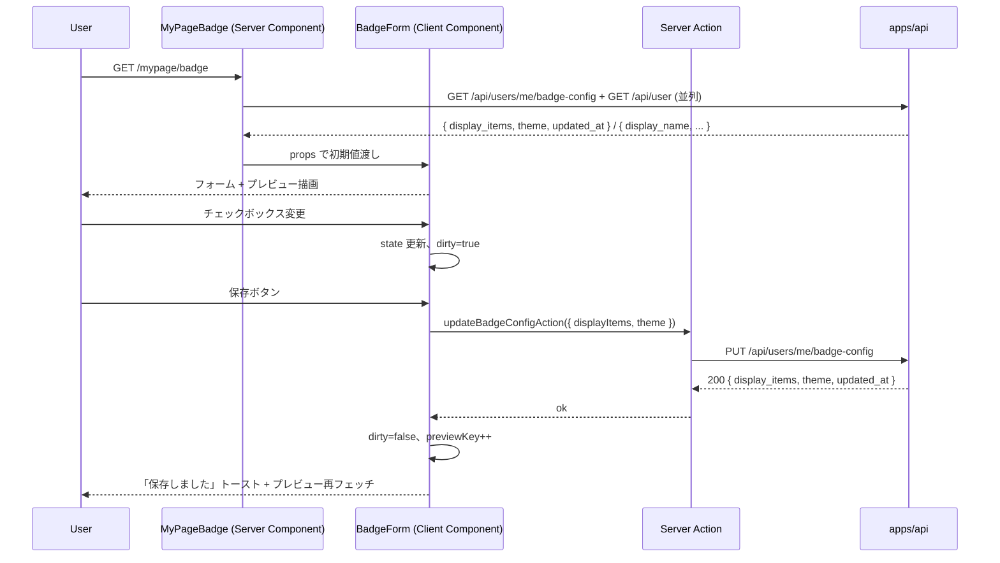

# step3: マイページに「バッジ設定」タブを追加

step2 で実装した `GET / PUT /api/users/me/badge-config` を Web から消費する画面を実装する。マイページのタブ構成（既存：概要 / 特典 / プレイ履歴 / 設定）に「バッジ」を追加し、`/mypage/badge` で表示項目とテーマを編集できるようにする。

リアルタイムプレビュー（変更内容を実 `` でその場で確認）も含めて 1 画面で完結する。

## 目次

- [対象画面・呼び出し API](#対象画面呼び出し-api)
- [参考モック](#参考モック)
- [依存](#依存)
- [画面の状態モデル](#画面の状態モデル)
- [画面遷移とデータフロー](#画面遷移とデータフロー)
  - [処理の流れ](#処理の流れ)
- [設計方針](#設計方針)
- [対応内容](#対応内容)
- [動作確認](#動作確認)
- [次の step での利用](#次の-step-での利用)

## 対象画面・呼び出し API

### 画面（Next.js Route）

| Route | コンポーネント | 概要 |
|---|---|---|
| `/mypage/badge` | Server Component + Form Client Component | バッジ表示項目チェックボックス + テーマトグル + リアルタイムプレビュー + 保存 |
| `/mypage` のタブ | （既存）`/mypage` の `<Link className="tab">` 群に「バッジ」を追加 | 遷移動線 |

### 呼び出す API

| メソッド / パス | 呼び出すタイミング | 経路 | 認証 |
|---|---|---|---|
| `GET /api/users/me/badge-config` | ページ表示時 | Server Component → `apiClient.get` | 必須 |
| `GET /api/user` | 同上 | 同上（プレビュー URL に `username` を入れるため） | 必須 |
| `PUT /api/users/me/badge-config` | 保存ボタン押下 | Server Action → `apiClient.put` | 必須 |
| `GET /badge/{username}.svg` | プレビュー画像 | Client Component の `` 経由 | 不要 |

## 参考モック

| 画面 | モックファイル | 反映すべき要素 |
|---|---|---|
| `/mypage/badge` | （モック未作成）`docs/mocks/mypage.html` の構成を流用 + 設定フォームは新規 | タブ群 / カード / プレビュー枠 / 保存ボタン |

### モックから読み取った主要構造

- マイページの 2 ペインレイアウト（`.row > .col + .col-sidebar`）を流用
- タブ群 `<Link className="tab active">` を踏襲、`active` 切替に「バッジ」を追加
- フォーム要素は既存 globals.css の `.form-row` / `.checkbox` / `.toggle` を流用（無ければ最低限のスタイルを inline で）
- プレビュー枠は `.card` + 中央寄せ + 背景 `var(--bg-surface-2)`
- カラー: 既存 globals.css の `--accent` / `--bg-surface` を使う

## 依存

| 依存先 | 何を使うか | 本 step での扱い |
|---|---|---|
| step2 (`/api/users/me/badge-config` GET/PUT) | 設定の取得・保存 | 必須前提 |
| step2 (`/badge/:username.svg`) | プレビュー画像 | 必須前提（`` で読み込み） |
| 既存 `apiClient.get` / `apiClient.put` | サーバー間通信 | 流用 |
| 既存 `Topbar` / マイページ globals.css | レイアウト | 流用 |
| 既存 `GET /api/user` | 自分の `display_name` 取得（プレビュー URL に使う） | 流用 |

## 画面の状態モデル

| state | 値 | UI |
|---|---|---|
| `username` | string | プレビュー URL の path |
| `displayItems` | string[] | チェックボックス群の状態 |
| `theme` | `"dark"` / `"light"` | トグル |
| `dirty` | bool | 編集中フラグ、保存ボタンの enabled |
| `previewKey` | int | プレビュー画像のキャッシュバスター（保存後に変更して `` を強制再フェッチ） |

Server Component が初期 `displayItems` / `theme` / `username` を props で渡し、Client Component（`BadgeForm`）が編集・送信を担当。

## 画面遷移とデータフロー



### 処理の流れ

1. Server Component が cookie 付きで `GET /api/users/me/badge-config` と `GET /api/user` を並列 fetch
2. 取得値を `BadgeForm` Client Component に渡す
3. ユーザーがチェックボックス / トグルを操作 → ローカル state を更新、`dirty=true`
4. プレビュー画像は `` で表示（変更直後は古いキャッシュのまま、保存後にだけ再フェッチ）
5. 保存ボタン押下 → Server Action `updateBadgeConfigAction` を invoke
6. Server Action が `apiClient.put` で API を叩く → 成功なら `revalidatePath("/mypage/badge")` してフォームに ok を返す
7. Client Component が `dirty=false` + `previewKey++` で再描画

## 設計方針

- **`/mypage/badge` を独立ルートにする理由**: バッジ設定はマイページの他要素（4-stat / グレード進捗 / 全期間ランキング）と無関係。同一ページで mux すると state が複雑化。タブで遷移する方が App Router の RSC キャッシュとも整合
- **プレビューを `` で実画像を読む理由**: SVG 文字列を JSX で書き直すと「実 API と乖離する」リスク。実 API を叩いて表示する方が確実
- **プレビューのキャッシュバスター `previewKey`**: 保存後に画像を即時更新したい。`Cache-Control: max-age=300` のため、URL に `?v=N` を付けて変えないとブラウザが古いキャッシュを使う
- **「保存中は即時反映しない」理由**: 編集中のチェックボックスを変えるたびに PUT を叩くと API 負荷が高く UI もチカチカする。明示的に「保存」ボタンで commit する方が UX が良い
- **`dirty` フラグ + 離脱確認**: 保存せず離脱しようとしたら警告を出す（`beforeunload` イベント）。MVP では `confirm()` で十分
- **README の埋め込みコード snippet を表示する理由**: ユーザーは「これをどこに貼ればいいか」迷う。`` をコピーボタン付きで表示する
- **Server Action で更新する理由**: 認証 cookie を Server 側で扱える、Form submit の標準パターン
- **Topbar `active` は "mypage" 相当だが**: 既存 `Topbar` の `active` 型は `"home" | "ranking" | "hall-of-fame"`。マイページは右上の `user-chip` で active 状態が表現されるので `active` 無指定で OK

## 対応内容

### `apps/web/src/app/mypage/badge/page.tsx`（新規）

```typescript
import type { Metadata } from "next"
import Link from "next/link"

import type { GetBadgeConfigResponse, GetUserResponse } from "@repo/api-schema"

import { Topbar } from "@/components/topbar"
import { apiClient } from "@/libs/api-client"

import { BadgeForm } from "./badge-form"

export const metadata: Metadata = {
  title: "バッジ設定 - Typing Royale",
}

export default async function MyPageBadge() {
  const [me, config] = await Promise.all([
    apiClient.get<GetUserResponse>("/api/user"),
    apiClient.get<GetBadgeConfigResponse>("/api/users/me/badge-config"),
  ])

  return (
    <>
      <Topbar />

      <div className="container">
        <h1 className="mb-16">バッジ設定</h1>

        <div className="tabs">
          <Link className="tab" href="/mypage">概要</Link>
          <a className="tab" href="#">特典</a>
          <a className="tab" href="#">プレイ履歴</a>
          <Link className="tab active" href="/mypage/badge">バッジ</Link>
          <Link className="tab" href="/mypage/account">設定</Link>
        </div>

        <BadgeForm
          initialDisplayItems={config.display_items}
          initialTheme={config.theme}
          username={me.display_name ?? `user${me.id}`}
        />
      </div>

      <div className="footer">
        <a href="#">利用規約</a> · <a href="#">プライバシー</a>
      </div>
    </>
  )
}
```

### `apps/web/src/app/mypage/badge/badge-form.tsx`（新規 Client Component）

```typescript
"use client"

import { useState } from "react"

import { updateBadgeConfigAction } from "./actions"

const ITEM_LABELS: Record<string, string> = {
  best_score: "ベストスコア",
  grade: "グレード",
  rank: "TS 全期間順位",
  streak_days: "連続日数",
  typed_chars: "累計打鍵数",
  username: "ユーザー名",
}

const ALL_ITEMS = ["grade", "best_score", "rank", "streak_days", "typed_chars", "username"] as const

type Props = {
    initialDisplayItems: string[]
    initialTheme: "dark" | "light"
    username: string
}

export function BadgeForm({ initialDisplayItems, initialTheme, username }: Props) {
  const [displayItems, setDisplayItems] = useState<string[]>(initialDisplayItems)
  const [theme, setTheme] = useState<"dark" | "light">(initialTheme)
  const [dirty, setDirty] = useState(false)
  const [saving, setSaving] = useState(false)
  const [savedAt, setSavedAt] = useState<Date | null>(null)
  const [previewKey, setPreviewKey] = useState(0)

  const toggle = (slug: string) => {
    setDirty(true)
    setDisplayItems((prev) =>
      prev.includes(slug) ? prev.filter((s) => s !== slug) : [...prev, slug])
  }

  const onSave = async () => {
    if (displayItems.length === 0 || displayItems.length > 5) return
    setSaving(true)
    try {
      await updateBadgeConfigAction({ displayItems, theme })
      setDirty(false)
      setSavedAt(new Date())
      setPreviewKey((k) => k + 1)
    } finally {
      setSaving(false)
    }
  }

  const badgeUrl = `/badge/${encodeURIComponent(username)}.svg`
  const previewUrl = `${badgeUrl}?v=${previewKey}`
  const embedSnippet = ``

  return (
    <div className="row">
      <div className="col">
        <div className="card mb-16">
          <div className="card-header"><div className="card-title">表示項目（1〜5 個）</div></div>
          <div style={{ display: "grid", gap: "8px" }}>
            {ALL_ITEMS.map((slug) => (
              <label className="flex gap-8" key={slug} style={{ alignItems: "center" }}>
                <input
                  checked={displayItems.includes(slug)}
                  onChange={() => toggle(slug)}
                  type="checkbox"
                />
                <span>{ITEM_LABELS[slug]}</span>
              </label>
            ))}
          </div>
        </div>

        <div className="card mb-16">
          <div className="card-header"><div className="card-title">テーマ</div></div>
          <div className="flex gap-8">
            {(["dark", "light"] as const).map((t) => (
              <button
                className={`btn ${theme === t ? "btn-primary" : ""}`}
                key={t}
                onClick={() => { setTheme(t); setDirty(true) }}
                type="button"
              >
                {t === "dark" ? "ダーク" : "ライト"}
              </button>
            ))}
          </div>
        </div>

        <div className="flex gap-12" style={{ alignItems: "center" }}>
          <button
            className="btn btn-primary"
            disabled={!dirty || saving || displayItems.length === 0 || displayItems.length > 5}
            onClick={onSave}
            type="button"
          >
            {saving ? "保存中..." : "保存"}
          </button>
          {savedAt !== null && !dirty && (
            <span className="text-sm text-muted">{savedAt.toLocaleTimeString()} に保存しました</span>
          )}
        </div>
      </div>

      <aside className="col-sidebar">
        <div className="card mb-16">
          <div className="card-header"><div className="card-title">プレビュー</div></div>
          <div className="text-center">
            {/* eslint-disable-next-line @next/next/no-img-element */}
            
          </div>
        </div>

        <div className="card">
          <div className="card-header"><div className="card-title">README に貼る</div></div>
          <pre className="text-sm" style={{
            background: "var(--bg-surface-2)",
            overflow: "auto",
            padding: "8px",
            whiteSpace: "pre-wrap",
            wordBreak: "break-all",
          }}>{embedSnippet}</pre>
        </div>
      </aside>
    </div>
  )
}
```

### `apps/web/src/app/mypage/badge/actions.ts`（新規）

```typescript
"use server"

import { revalidatePath } from "next/cache"

import type { GetBadgeConfigResponse, UpdateBadgeConfigRequest } from "@repo/api-schema"

import { apiClient } from "@/libs/api-client"

export const updateBadgeConfigAction = async (input: { displayItems: string[]; theme: "dark" | "light" }): Promise<GetBadgeConfigResponse> => {
  const body: UpdateBadgeConfigRequest = {
    display_items: input.displayItems as UpdateBadgeConfigRequest["display_items"],
    theme: input.theme,
  }
  const res = await apiClient.put<GetBadgeConfigResponse>("/api/users/me/badge-config", body)
  revalidatePath("/mypage/badge")
  return res
}
```

### `apps/web/src/app/mypage/page.tsx`（編集 - tabs に「バッジ」追加）

```typescript
<div className="tabs">
  <Link className="tab active" href="/mypage">概要</Link>
  <a className="tab" href="#">特典</a>
  <a className="tab" href="#">プレイ履歴</a>
  <Link className="tab" href="/mypage/badge">バッジ</Link>
  <Link className="tab" href="/mypage/account">設定</Link>
</div>
```

## 動作確認

| 区分 | 内容 |
|---|---|
| 初回表示 | dev-login で alice → `/mypage/badge` → default `["grade", "best_score"]` がチェック済み + ダークテーマ |
| チェック変更 → 保存 | rank をチェック → 保存 → 「HH:MM:SS に保存しました」表示 + プレビュー更新 |
| テーマ変更 → 保存 | ライトをクリック → 保存 → 背景が白いプレビューに変わる |
| バリデーション | 全部チェック外して保存ボタンが disabled になる、6 個以上チェックできない |
| README snippet コピー | コピーボタンクリックでクリップボードに `` が入る（実装は ClipboardJS / `navigator.clipboard.writeText`） |
| 未ログイン | proxy で `/sign-in` にリダイレクト |
| Playwright MCP | `/mypage/badge` 初期 → 変更 → 保存 → プレビュー更新 のスクショ取得、コンソール error 0 件 |
| Lint / Build | `pnpm lint && pnpm build` |

## 次の step での利用

- **README 上の埋め込み**: 本 step 完了後、ユーザーが自分のバッジ URL と embed snippet を取得できる。GitHub README に貼れば動的バッジが表示される
- **step6 (マイページ特典タブ)**: 「特典」タブ ( `/mypage/rewards`) を本 step と同様のパターン (タブ群 + 専用ページ) で実装する
