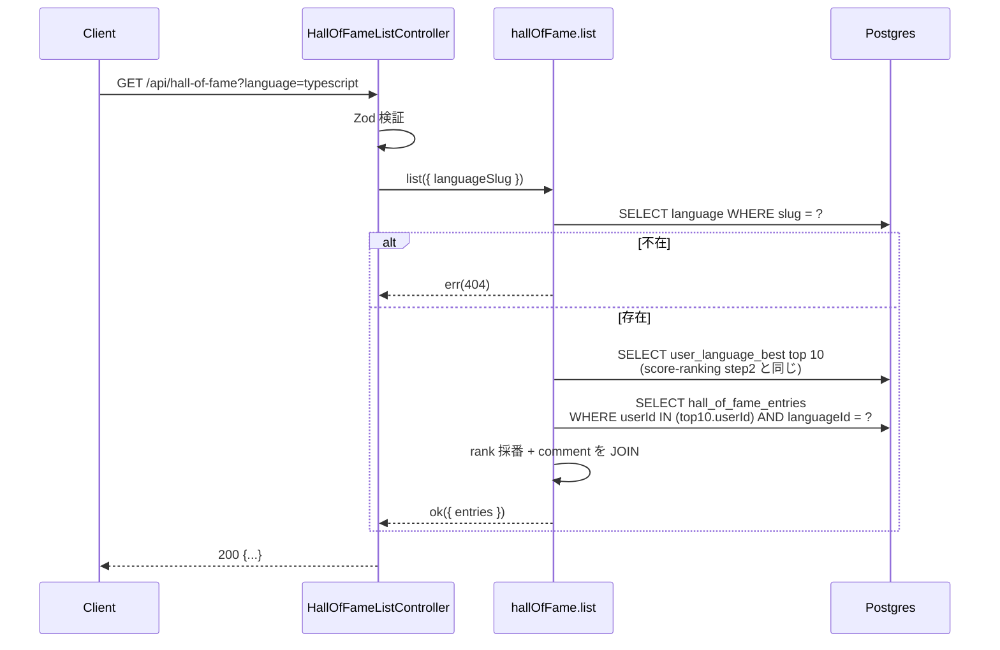
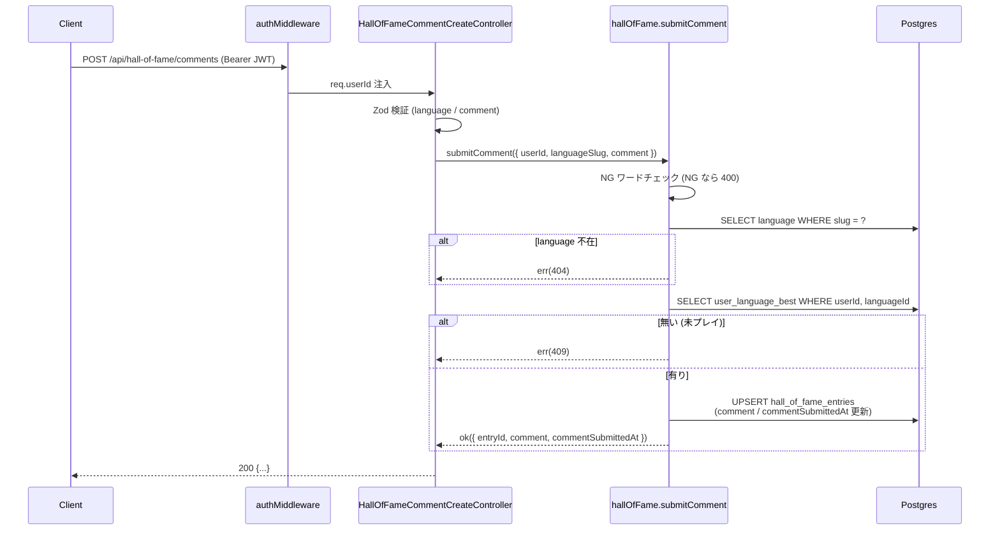
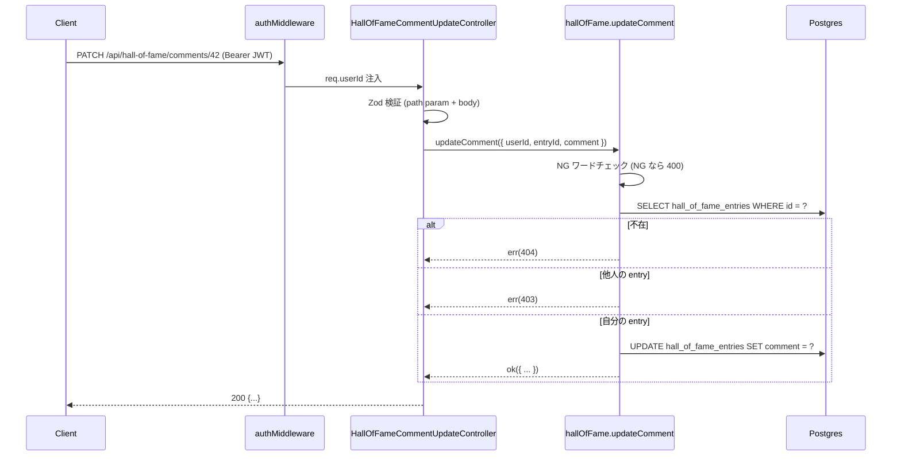

# step4: Hall of Fame API 3 本

Hall of Fame 関連 API 3 本を実装する：

- `GET /api/hall-of-fame?language=...`: 言語別 TOP 10 + コメント込みのリアルタイム集計
- `POST /api/hall-of-fame/comments`: リザルト画面で送信されるコメント（即時公開、`comment` に upsert）
- `PATCH /api/hall-of-fame/comments/:entryId`: マイページからのコメント編集

リアルタイム集計の設計上、Hall of Fame の「順位」は `user_language_best` の `ORDER BY score DESC LIMIT 10` 結果に他ならない。`hall_of_fame_entries` テーブルは **コメントの保存場所のみ** を担う。

## 目次

- [対象 API](#対象-api)
- [依存](#依存)
- [リクエスト](#リクエスト)
  - [GET /api/hall-of-fame](#get-apihall-of-fame)
  - [POST /api/hall-of-fame/comments](#post-apihall-of-famecomments)
  - [PATCH /api/hall-of-fame/comments/:entryId](#patch-apihall-of-famecommentsentryid)
- [レスポンス](#レスポンス)
  - [GET /api/hall-of-fame - 200 OK](#get-apihall-of-fame---200-ok)
  - [POST /api/hall-of-fame/comments - 200 OK](#post-apihall-of-famecomments---200-ok)
  - [PATCH /api/hall-of-fame/comments/:entryId - 200 OK](#patch-apihall-of-famecommentsentryid---200-ok)
  - [エラー](#エラー)
- [処理フロー](#処理フロー)
  - [GET /api/hall-of-fame の流れ](#get-apihall-of-fame-の流れ)
  - [POST /api/hall-of-fame/comments の流れ](#post-apihall-of-famecomments-の流れ)
  - [PATCH /api/hall-of-fame/comments/:entryId の流れ](#patch-apihall-of-famecommentsentryid-の流れ)
- [集計クエリ設計](#集計クエリ設計)
- [入賞判定ロジック](#入賞判定ロジック)
- [NG ワードチェック](#ng-ワードチェック)
- [設計方針](#設計方針)
- [対応内容](#対応内容)
- [動作確認](#動作確認)
- [次の step での利用](#次の-step-での利用)

## 対象 API

| 項目 | GET /api/hall-of-fame | POST /api/hall-of-fame/comments | PATCH /api/hall-of-fame/comments/:entryId |
|---|---|---|---|
| 認証 | 不要（公開） | 必須 (Bearer JWT) | 必須 (Bearer JWT) |
| 副作用 | なし | `hall_of_fame_entries` upsert | `hall_of_fame_entries` update |
| 冪等性 | 冪等 | 冪等（upsert） | 冪等 |
| 呼び出し元 | apps/web の `/hall-of-fame` (step5) | apps/web のリザルト画面 TOP10 入りモーダル (step5) | apps/web のマイページコメント編集 (step5) |

## 依存

| 依存先 | 何を使うか | 本 step での扱い |
|---|---|---|
| step1 (`hall_of_fame_entries` テーブル) | コメントの保存先 | 必須前提 |
| score-ranking step1 (`user_language_best`) | 順位算出の source | 必須前提（TOP 10 取得） |
| score-ranking step2 (`UserLanguageBestRepository.findTopByLanguage`) | TOP 10 取得 | 流用 |
| score-ranking step2 (`LanguageRepository.findBySlug`) | language slug → id 解決 | 流用 |

## リクエスト

### GET /api/hall-of-fame

Query:

| パラメータ | 型 | 必須 | 制約 | 説明 |
|---|---|---|---|---|
| `language` | string | yes | `typescript` / `javascript` | 言語 slug |

### POST /api/hall-of-fame/comments

Body:

```json
{
  "language": "typescript",
  "comment": "OSS をひたすら打って rank 1 でした！"
}
```

| フィールド | 型 | 必須 | 制約 | 説明 |
|---|---|---|---|---|
| `language` | string | yes | `typescript` / `javascript` | コメント対象言語 |
| `comment` | string | yes | 1〜300 chars, NG ワードチェック通過 | 公開コメント |

サーバー側で「自分が当該言語のベストを 1 件でも持っているか」を検証する（無ければ 409）。

### PATCH /api/hall-of-fame/comments/:entryId

| Path Param | 型 | 制約 | 説明 |
|---|---|---|---|
| `entryId` | number | 正の整数 | `HallOfFameEntry.id` |

Body:

```json
{ "comment": "編集後のコメント" }
```

| フィールド | 型 | 必須 | 制約 | 説明 |
|---|---|---|---|---|
| `comment` | string | yes | 1〜300 chars, NG ワードチェック通過 | 編集後のコメント |

サーバー側で「対象 entry が自分の所有」を検証する（他人の entry なら 403）。

## レスポンス

### GET /api/hall-of-fame - 200 OK

```json
{
  "language": "typescript",
  "entries": [
    {
      "rank": 1,
      "user": {
        "id": 12,
        "display_name": "sakurai_dev",
        "avatar_url": "https://...",
        "current_grade": "fellow"
      },
      "score": 1490,
      "accuracy": 0.98,
      "typed_chars": 1520,
      "best_play_session_id": 8732,
      "played_at": "2026-06-03T02:14:08.000Z",
      "comment": "OSS をひたすら打って rank 1 でした！",
      "comment_submitted_at": "2026-06-03T02:18:00.000Z"
    }
  ]
}
```

`comment` / `comment_submitted_at` は未入力なら null。

### POST /api/hall-of-fame/comments - 200 OK

```json
{
  "entry_id": 42,
  "language": "typescript",
  "comment": "OSS をひたすら打って rank 1 でした！",
  "comment_submitted_at": "2026-06-03T02:18:00.000Z"
}
```

### PATCH /api/hall-of-fame/comments/:entryId - 200 OK

`POST` と同じ shape を返す（編集後の値）。`comment_submitted_at` は最初の送信時刻を保持し、`updated_at` は内部のみ管理。

### エラー

| Status | type | 条件 | クライアント挙動 |
|---|---|---|---|
| 400 | BAD_REQUEST | `language` 不正 / `comment` 不正 / NG ワード | バリデーションエラー表示 |
| 401 | UNAUTHORIZED | JWT 無し | ログイン誘導 |
| 403 | FORBIDDEN | PATCH 対象 entry が自分のものでない | 「権限がありません」 |
| 404 | NOT_FOUND | PATCH 対象 entry が存在しない / GET の language 不在 | 「見つかりません」 |
| 409 | CONFLICT | POST 時に該当言語の `user_language_best` が無い（プレイ実績無し） | 「先にプレイしてください」 |

## 処理フロー

### GET /api/hall-of-fame の流れ



#### 流れ

1. Controller が Zod で `language` を検証（NG なら 400）
2. Service が `Language` を slug で引く（NG なら 404）
3. `userLanguageBestRepository.findTopByLanguage(languageId, 10)` で TOP 10 を取得（score-ranking step2 流用）
4. `hallOfFameEntryRepository.findManyByUserIds(top10.userId[], languageId)` で comment を一括取得
5. `entries[i].comment` を Map で合成、`rank: i + 1` を採番
6. Controller が 200 で返す

### POST /api/hall-of-fame/comments の流れ



#### 流れ

1. 認証 middleware が `req.userId` を注入
2. Controller が Zod で `language` / `comment` を検証
3. Service が `comment` を NG ワードチェック（NG なら 400）
4. Service が `Language` を slug で引く（NG なら 404）
5. Service が `userLanguageBestRepository.findMine` で自分のベストを取得（無ければ 409 CONFLICT）
6. `hallOfFameEntryRepository.upsertComment(userId, languageId, bestPlaySessionId, comment)` で upsert
7. レスポンス組み立て

### PATCH /api/hall-of-fame/comments/:entryId の流れ



#### 流れ

1. 認証 middleware が `req.userId` を注入
2. Controller が Zod で `entryId` (path) と `comment` (body) を検証
3. Service が NG ワードチェック
4. Service が `hallOfFameEntryRepository.findById(entryId)` で取得（無ければ 404）
5. `entry.userId !== input.userId` なら 403
6. `hallOfFameEntryRepository.updateComment(entryId, comment)` で update
7. レスポンス組み立て

## 集計クエリ設計

### TOP 10 + コメント JOIN（GET /api/hall-of-fame）

Prisma で 2 クエリに分けて取得（複雑な JOIN を避ける）：

```typescript
const top = await userLanguageBestRepository.findTopByLanguage(language.id, 10)
const userIds = top.map((e) => e.user.id)
const comments = await hallOfFameEntryRepository.findManyByUserIds(userIds, language.id)
const byUserId = new Map(comments.map((c) => [c.userId, c]))

const entries = top.map((e, idx) => ({
  ...e,
  rank: idx + 1,
  comment: byUserId.get(e.user.id)?.comment ?? null,
  commentSubmittedAt: byUserId.get(e.user.id)?.commentSubmittedAt ?? null,
}))
```

step2 の `findTopByLanguage` を再利用するため、Repository 追加は `HallOfFameEntryRepository` のみ。

### 自分の入賞判定（POST 時）

「コメント送信できる = 該当言語の `user_language_best` 行を持っている」とする。順位 1〜10 位内である必要は **無い**（後で順位が下がってもコメントは残る）。

```typescript
const myBest = await userLanguageBestRepository.findMine(userId, languageId)
if (myBest === null) return err(conflictError("Play first to comment"))
```

## 入賞判定ロジック

リアルタイム集計のため、`POST /api/hall-of-fame/comments` 時点では「順位 1〜10 位以内」を **強制しない**：

- 送信時刻は 11 位だが、その後他者がベスト更新で押し下げられて自分が 10 位以内に戻る可能性がある
- 逆に、送信時刻は 10 位以内でも、後で他者が更新して自分が圏外に押し出される可能性がある

→ `hall_of_fame_entries` は **コメントの保存場所**、Hall of Fame ページ表示時に `user_language_best` の TOP 10 と JOIN するので、圏外コメントは自然と非表示になる。再入賞時に同じ comment が再表示される。

## NG ワードチェック

`apps/api/src/lib/ng-word.ts` に簡易フィルタを実装：

```typescript
const NG_WORDS = ["死ね", "殺す", ...] // MVP は固定リスト 30 個程度

export const containsNgWord = (text: string): boolean => {
  const normalized = text.toLowerCase()
  return NG_WORDS.some((w) => normalized.includes(w))
}
```

正式な NG ワードリストと自動判定（ML / 外部 API）は別 PR。本 step は **固定リスト + 文字列マッチ** で MVP 対応。

## 設計方針

- **`hall_of_fame_entries` を「コメント保存場所」に限定する理由**: リアルタイム集計のため、rank / featuredAt 等のメタデータは保存不要。`user_language_best` の TOP 10 を引いた結果と JOIN するだけで Hall of Fame が成立
- **POST を upsert にする理由**: 「初回送信」「2 回目以降の編集」を区別する必要がない。`PATCH /:entryId` はマイページから entry_id 経由で編集する別 UX 用
- **POST で順位判定を強制しない理由**: リアルタイム集計のため、送信時点の順位と Hall of Fame ページ表示時の順位がずれる可能性がある。「コメントを送信したが圏外で表示されない」「再入賞したら自動で再表示される」という挙動を許容
- **PATCH の対象 entry を 403 で守る理由**: 他人のコメントを編集できると荒らされる。`entry.userId !== req.userId` で必ず弾く
- **NG ワードを Service 層で実施する理由**: Controller でやると DB 書き込みの前で弾けるが、Service が業務ロジックを所有する設計と整合させるため Service 層で判定
- **`bestPlaySessionId` を `hall_of_fame_entries` に保存する理由**: 後で「このコメントはどのプレイ時のものか」を辿れるように。リプレイ機能（別フェーズ）で利用
- **`@@unique([userId, languageId])` の理由**: 1 ユーザー × 1 言語 = 1 コメント。POST で upsert する設計と整合
- **`comment_submitted_at` を最初の送信時のみ更新**: 「最初に書いた時刻」を保持。`updatedAt` (Prisma の `@updatedAt`) は編集のたびに変わるので両者を区別

## 対応内容

### `packages/schema/src/api-schema/hall-of-fame.ts`（新規）

```typescript
import { z } from "zod"

const LANGUAGE_SLUG = z.string().min(1).max(32)
const COMMENT = z.string().min(1).max(300)

export const getHallOfFameQueryStringSchema = z.object({
  language: LANGUAGE_SLUG,
})

const hallOfFameEntrySchema = z.object({
  rank: z.number().int().min(1),
  user: z.object({
    id: z.number().int().positive(),
    avatar_url: z.string().url().nullable(),
    current_grade: z.string(),
    display_name: z.string(),
  }),
  accuracy: z.number().min(0).max(1),
  best_play_session_id: z.number().int().positive(),
  comment: z.string().nullable(),
  comment_submitted_at: z.string().datetime().nullable(),
  played_at: z.string().datetime(),
  score: z.number().int().nonnegative(),
  typed_chars: z.number().int().nonnegative(),
})

export const getHallOfFameResponseSchema = z.object({
  entries: z.array(hallOfFameEntrySchema).max(10),
  language: z.string(),
})

export const submitHallOfFameCommentRequestSchema = z.object({
  comment: COMMENT,
  language: LANGUAGE_SLUG,
})

export const updateHallOfFameCommentPathParamSchema = z.object({
  entryId: z.coerce.number().int().positive(),
})

export const updateHallOfFameCommentRequestSchema = z.object({
  comment: COMMENT,
})

export const hallOfFameCommentResponseSchema = z.object({
  comment: z.string(),
  comment_submitted_at: z.string().datetime(),
  entry_id: z.number().int().positive(),
  language: z.string(),
})

export type GetHallOfFameQueryString = z.infer<typeof getHallOfFameQueryStringSchema>
export type GetHallOfFameResponse = z.infer<typeof getHallOfFameResponseSchema>
export type SubmitHallOfFameCommentRequest = z.infer<typeof submitHallOfFameCommentRequestSchema>
export type UpdateHallOfFameCommentRequest = z.infer<typeof updateHallOfFameCommentRequestSchema>
export type HallOfFameCommentResponse = z.infer<typeof hallOfFameCommentResponseSchema>
```

### `apps/api/src/repository/prisma/hall-of-fame-entry-repository.ts`（新規）

```typescript
import { PrismaClient } from "@repo/db"

export type HallOfFameEntryRow = {
    id: number
    userId: number
    languageId: number
    bestPlaySessionId: number
    comment: string | null
    commentSubmittedAt: Date | null
}

export type UpsertCommentInput = {
    userId: number
    languageId: number
    bestPlaySessionId: number
    comment: string
}

export interface HallOfFameEntryRepository {
    findById(id: number): Promise<HallOfFameEntryRow | null>
    findManyByUserIds(userIds: number[], languageId: number): Promise<HallOfFameEntryRow[]>
    upsertComment(input: UpsertCommentInput): Promise<HallOfFameEntryRow>
    updateComment(id: number, comment: string): Promise<HallOfFameEntryRow>
}

export class PrismaHallOfFameEntryRepository implements HallOfFameEntryRepository {
  private _prisma: PrismaClient

  constructor(prisma: PrismaClient) {
    this._prisma = prisma
  }

  async findById(id: number): Promise<HallOfFameEntryRow | null> {
    const row = await this._prisma.hallOfFameEntry.findUnique({ where: { id } })
    return row === null ? null : this._toRow(row)
  }

  async findManyByUserIds(userIds: number[], languageId: number): Promise<HallOfFameEntryRow[]> {
    if (userIds.length === 0) return []
    const rows = await this._prisma.hallOfFameEntry.findMany({
      where: { languageId, userId: { in: userIds } },
    })
    return rows.map((r) => this._toRow(r))
  }

  async upsertComment(input: UpsertCommentInput): Promise<HallOfFameEntryRow> {
    const now = new Date()
    const row = await this._prisma.hallOfFameEntry.upsert({
      create: {
        bestPlaySessionId: input.bestPlaySessionId,
        comment: input.comment,
        commentSubmittedAt: now,
        languageId: input.languageId,
        userId: input.userId,
      },
      update: {
        bestPlaySessionId: input.bestPlaySessionId,
        comment: input.comment,
        /** 既存値があれば保持、無ければ now */
      },
      where: { userId_languageId: { languageId: input.languageId, userId: input.userId } },
    })
    /** 既存行で commentSubmittedAt が null なら now で update し直す */
    if (row.commentSubmittedAt === null) {
      const updated = await this._prisma.hallOfFameEntry.update({
        data: { commentSubmittedAt: now },
        where: { id: row.id },
      })
      return this._toRow(updated)
    }
    return this._toRow(row)
  }

  async updateComment(id: number, comment: string): Promise<HallOfFameEntryRow> {
    const row = await this._prisma.hallOfFameEntry.update({
      data: { comment },
      where: { id },
    })
    return this._toRow(row)
  }

  private _toRow(row: { id: number; userId: number; languageId: number; bestPlaySessionId: number; comment: string | null; commentSubmittedAt: Date | null }): HallOfFameEntryRow {
    return {
      bestPlaySessionId: row.bestPlaySessionId,
      comment: row.comment,
      commentSubmittedAt: row.commentSubmittedAt,
      id: row.id,
      languageId: row.languageId,
      userId: row.userId,
    }
  }
}
```

### `apps/api/src/lib/ng-word.ts`（新規）

固定リスト + 単純 contains 判定（実装本体）。

### `apps/api/src/service/hall-of-fame-service.ts`（新規）

`list` / `submitComment` / `updateComment` の 3 関数を `export const` で実装。`Result<T>` 戻り値。

### `apps/api/src/controller/hall-of-fame/` 配下（新規）

- `list.ts` (`HallOfFameListController`)
- `comment-create.ts` (`HallOfFameCommentCreateController`)
- `comment-update.ts` (`HallOfFameCommentUpdateController`)

### `apps/api/src/routes/hall-of-fame-router.ts`（新規）

```typescript
import { Router } from "express"

import { HallOfFameCommentCreateController } from "../controller/hall-of-fame/comment-create"
import { HallOfFameCommentUpdateController } from "../controller/hall-of-fame/comment-update"
import { HallOfFameListController } from "../controller/hall-of-fame/list"

type HallOfFameRouterControllers = {
    commentCreate?: HallOfFameCommentCreateController
    commentUpdate?: HallOfFameCommentUpdateController
    list?: HallOfFameListController
}

export const hallOfFameRouter = (controllers: HallOfFameRouterControllers): Router => {
  const router = Router()
  if (controllers.list) {
    const c = controllers.list
    router.get("/", async (req, res) => c.execute(req, res))
  }
  if (controllers.commentCreate) {
    const c = controllers.commentCreate
    router.post("/comments", async (req, res) => c.execute(req, res))
  }
  if (controllers.commentUpdate) {
    const c = controllers.commentUpdate
    router.patch("/comments/:entryId", async (req, res) => c.execute(req, res))
  }
  return router
}
```

### `apps/api/src/const/index.ts`（編集）

`PUBLIC_PATHS` に `/api/hall-of-fame` を追加。`PROTECTED_PATHS` に `/api/hall-of-fame/comments` を追加（POST / PATCH は認証必須）。

```typescript
export const PROTECTED_PATHS: readonly string[] = [
  "/api/rankings/me",
  "/api/hall-of-fame/comments",
]
```

### `apps/api/src/index.ts`（編集）

DI 組み立て + `app.use("/api/hall-of-fame", hallOfFameRouter({...}))`

## 動作確認

| 区分 | 内容 |
|---|---|
| 公開 GET (空) | seed 直後 → `entries=[]` で 200 |
| 公開 GET (データあり) | TOP 10 seed + 一部にコメント → rank 順 + comment が JOIN されて返る |
| POST 認証必須 | cookie 無し → 401 |
| POST 未プレイ | 該当言語の user_language_best が無い → 409 |
| POST 正常 | DB に `hall_of_fame_entries` 行が作成され、Hall of Fame で表示される |
| POST 編集（同 user 同 language） | upsert される（既存の `commentSubmittedAt` を維持） |
| POST NG ワード | 「死ね」を含む → 400 |
| PATCH 他人 entry | 403 |
| PATCH 自分 entry | 200 で comment が更新される |
| PATCH 存在しない entryId | 404 |
| Service ユニット | list / submitComment / updateComment それぞれ正常系 + 異常系 |
| Controller integration | 実 Postgres、`testPrisma.hallOfFameEntry.findUnique` で最終状態確認 |
| Lint / Build / Test | `pnpm lint && pnpm build && pnpm test` |

## 次の step での利用

- **step5 (Hall of Fame Web)**: `/hall-of-fame` 公開ページが `GET /api/hall-of-fame` を Server Component から叩く。リザルト画面の TOP10 入りモーダルが `POST /api/hall-of-fame/comments` を Server Action から叩く。マイページコメント編集タブが `PATCH /api/hall-of-fame/comments/:entryId` を叩く
- **step3 (バッジ)**: 本 step とは独立。両立可能
