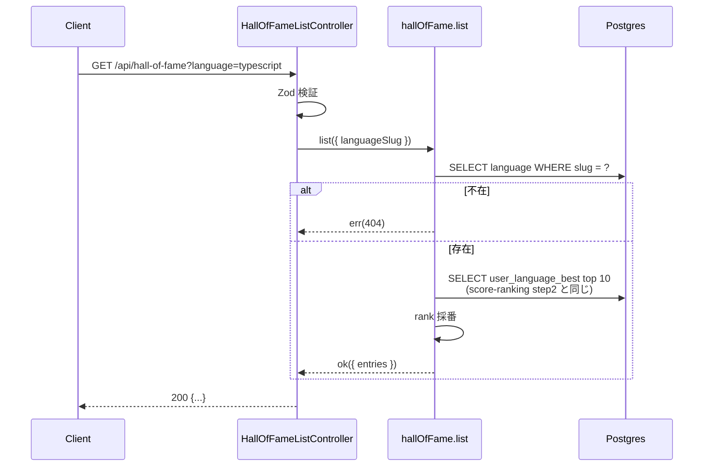

# step4: Hall of Fame API

Hall of Fame 公開 API を実装する：

- `GET /api/hall-of-fame?language=...`: 言語別 TOP 10 のリアルタイム集計

リアルタイム集計の設計上、Hall of Fame の「順位」は `user_language_best` の `ORDER BY score DESC LIMIT 10` 結果に他ならない。コメント機能は廃止された（`hall_of_fame_entries` テーブルは drop 済み）。

## 目次

- [対象 API](#対象-api)
- [依存](#依存)
- [リクエスト](#リクエスト)
  - [GET /api/hall-of-fame](#get-apihall-of-fame)
- [レスポンス](#レスポンス)
  - [GET /api/hall-of-fame - 200 OK](#get-apihall-of-fame---200-ok)
  - [エラー](#エラー)
- [処理フロー](#処理フロー)
  - [GET /api/hall-of-fame の流れ](#get-apihall-of-fame-の流れ)
- [集計クエリ設計](#集計クエリ設計)
- [設計方針](#設計方針)
- [対応内容](#対応内容)
- [動作確認](#動作確認)
- [次の step での利用](#次の-step-での利用)

## 対象 API

| 項目 | GET /api/hall-of-fame |
|---|---|
| 認証 | 不要（公開） |
| 副作用 | なし |
| 冪等性 | 冪等 |
| 呼び出し元 | apps/web の `/hall-of-fame` (step5) |

## 依存

| 依存先 | 何を使うか | 本 step での扱い |
|---|---|---|
| score-ranking step1 (`user_language_best`) | 順位算出の source | 必須前提（TOP 10 取得） |
| score-ranking step2 (`UserLanguageBestRepository.findTopByLanguage`) | TOP 10 取得 | 流用 |
| score-ranking step2 (`LanguageRepository.findBySlug`) | language slug → id 解決 | 流用 |

## リクエスト

### GET /api/hall-of-fame

Query:

| パラメータ | 型 | 必須 | 制約 | 説明 |
|---|---|---|---|---|
| `language` | string | yes | `typescript` / `javascript` | 言語 slug |

## レスポンス

### GET /api/hall-of-fame - 200 OK

```json
{
  "language": "typescript",
  "entries": [
    {
      "rank": 1,
      "user": {
        "id": 12,
        "github_username": "sakurai_dev",
        "avatar_url": "https://...",
        "current_grade": "fellow",
        "favorite_repo_url": "https://github.com/sakurai_dev/awesome"
      },
      "score": 1490,
      "accuracy": 0.98,
      "typed_chars": 1520,
      "best_play_session_id": 8732,
      "played_at": "2026-06-03T02:14:08.000Z"
    }
  ]
}
```

### エラー

| Status | type | 条件 | クライアント挙動 |
|---|---|---|---|
| 400 | BAD_REQUEST | `language` 不正 | バリデーションエラー表示 |
| 404 | NOT_FOUND | GET の language 不在 | 「見つかりません」 |

## 処理フロー

### GET /api/hall-of-fame の流れ



#### 流れ

1. Controller が Zod で `language` を検証（NG なら 400）
2. Service が `Language` を slug で引く（NG なら 404）
3. `userLanguageBestRepository.findTopByLanguage(languageId, 10)` で TOP 10 を取得（score-ranking step2 流用）
4. `entries[i].rank: i + 1` を採番
5. Controller が 200 で返す

## 集計クエリ設計

### TOP 10（GET /api/hall-of-fame）

```typescript
const top = await userLanguageBestRepository.findTopByLanguage(language.id, 10)
const entries = top.map((e, idx) => ({
  ...e,
  rank: idx + 1,
}))
```

step2 の `findTopByLanguage` を再利用する。

## 設計方針

- **Hall of Fame をリアルタイム集計のみで成立させる理由**: `user_language_best` の TOP 10 を引くだけで「殿堂入り」相当の情報は揃う。コメント等の付帯情報は廃止し、Hall of Fame は閲覧のみの公開ページに留める
- **`/api/hall-of-fame` を公開（認証不要）にする理由**: 自慢動線・拡散用のページなので未ログインユーザーにも見せたい。書き込み API は無いので保護不要

## 対応内容

### `packages/schema/src/api-schema/hall-of-fame.ts`（新規）

```typescript
import { z } from "zod"

const LANGUAGE_SLUG = z.string().min(1).max(32)

export const getHallOfFameQueryStringSchema = z.object({
  language: LANGUAGE_SLUG,
})

const hallOfFameEntrySchema = z.object({
  rank: z.number().int().min(1),
  user: z.object({
    id: z.number().int().positive(),
    avatar_url: z.string().url().nullable(),
    current_grade: z.string(),
    favorite_repo_url: z.string().nullable(),
    github_username: z.string().nullable(),
  }),
  accuracy: z.number().min(0).max(1),
  best_play_session_id: z.number().int().positive(),
  played_at: z.string().datetime(),
  score: z.number().int().nonnegative(),
  typed_chars: z.number().int().nonnegative(),
})

export const getHallOfFameResponseSchema = z.object({
  entries: z.array(hallOfFameEntrySchema).max(10),
  language: z.string(),
})

export type GetHallOfFameQueryString = z.infer<typeof getHallOfFameQueryStringSchema>
export type GetHallOfFameResponse = z.infer<typeof getHallOfFameResponseSchema>
```

### `apps/api/src/service/hall-of-fame-service.ts`（新規）

`list` の 1 関数を `export const` で実装。`Result<T>` 戻り値。

### `apps/api/src/controller/hall-of-fame/` 配下（新規）

- `list.ts` (`HallOfFameListController`)

### `apps/api/src/routes/hall-of-fame-router.ts`（新規）

```typescript
import { Router } from "express"

import { HallOfFameListController } from "../controller/hall-of-fame/list"

type HallOfFameRouterControllers = {
    list?: HallOfFameListController
}

export const hallOfFameRouter = (controllers: HallOfFameRouterControllers): Router => {
  const router = Router()
  if (controllers.list) {
    const c = controllers.list
    router.get("/", async (req, res) => c.execute(req, res))
  }
  return router
}
```

### `apps/api/src/const/index.ts`（編集）

`PUBLIC_PATHS` に `/api/hall-of-fame` を追加。

### `apps/api/src/index.ts`（編集）

DI 組み立て + `app.use("/api/hall-of-fame", hallOfFameRouter({...}))`

## 動作確認

| 区分 | 内容 |
|---|---|
| 公開 GET (空) | seed 直後 → `entries=[]` で 200 |
| 公開 GET (データあり) | TOP 10 seed → rank 順で返る |
| 言語不正 | `language=invalid` → 400 / 404 |
| Service ユニット | list 正常系 + 異常系 |
| Controller integration | 実 Postgres、TOP 10 を seed して順位と user フィールドを検証 |
| Lint / Build / Test | `pnpm lint && pnpm build && pnpm test` |

## 次の step での利用

- **step5 (Hall of Fame Web)**: `/hall-of-fame` 公開ページが `GET /api/hall-of-fame` を Server Component から叩く
- **step3 (バッジ)**: 本 step とは独立。両立可能
