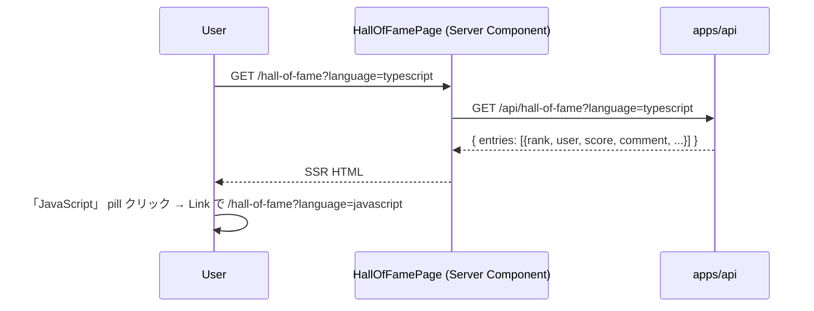
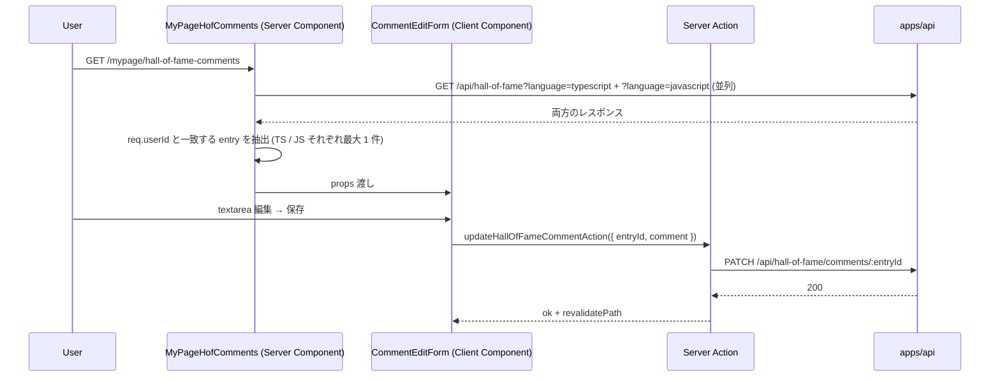

# step5: /hall-of-fame ページ + リザルト TOP 10 入りモーダル + マイページコメント編集

step4 で実装した Hall of Fame API 3 本を Web から消費する。3 つの UI 接点を 1 step に集約：

1. `/hall-of-fame` 公開ページ（言語タブ + コメント込み TOP 10）
2. リザルト画面の TOP 10 入りコメント入力モーダル（score-ranking step6 で出した「🏆 TOP 10 入り見込み！」バナーを差し替え）
3. マイページ「Hall of Fame コメント編集」タブ（過去の自分のコメントを編集）

3 つは同じ `hall_of_fame_entries` を読み書きし、同じ「コメント入力 / 編集」UI コンポーネントを共有するので、凝集度が高く 1 step / 1 PR に収まる。

## 目次

- [対象画面・呼び出し API](#対象画面呼び出し-api)
- [参考モック](#参考モック)
- [依存](#依存)
- [画面の状態モデル](#画面の状態モデル)
- [処理フロー](#処理フロー)
  - [Hall of Fame ページの流れ](#hall-of-fame-ページの流れ)
  - [TOP 10 入りモーダルの流れ](#top-10-入りモーダルの流れ)
  - [マイページコメント編集の流れ](#マイページコメント編集の流れ)
- [設計方針](#設計方針)
- [対応内容](#対応内容)
- [動作確認](#動作確認)
- [次の step での利用](#次の-step-での利用)

## 対象画面・呼び出し API

### 画面（Next.js Route）

| Route | 種別 | 概要 |
|---|---|---|
| `/hall-of-fame` | Server Component + 言語タブ Link | 言語別 TOP 10 + コメント表示（公開） |
| `/hall-of-fame?language=javascript` | 同上 | JS タブ |
| `/play/[sessionId]` リザルトフェーズ | 既存 Client Component に `<TopTenCommentModal>` を追加 | TOP 10 入りモーダル（送信 / あとで書く） |
| `/mypage/hall-of-fame-comments` | Server Component + Form Client Component | 自分の comment 一覧 + 各行に編集フォーム |
| `/mypage` のタブ | 既存に「Hall of Fame」を追加 | 遷移動線 |

### 呼び出す API

| メソッド / パス | 呼び出すタイミング | 経路 | 認証 |
|---|---|---|---|
| `GET /api/hall-of-fame?language=...` | Hall of Fame ページ表示 | Server Component → `apiClient.get` | 不要 |
| `POST /api/hall-of-fame/comments` | リザルトモーダル送信 | Server Action | 必須 |
| `PATCH /api/hall-of-fame/comments/:entryId` | マイページ編集保存 | Server Action | 必須 |
| `GET /api/hall-of-fame?language=...` （×2 言語並列） | マイページ編集タブ表示 | Server Component → 並列 fetch + 自分の entry をフィルタ | 必須 |

## 参考モック

| 画面 | モックファイル | 反映すべき要素 |
|---|---|---|
| `/hall-of-fame` | （モック未作成） | `/ranking` の表構造を流用 + コメント行を追加 |
| TOP 10 入りモーダル | （モック未作成） | typing-royale の card style を流用、accent border、textarea + 「送信」「あとで書く」 |
| マイページ Hall of Fame タブ | （モック未作成） | TS / JS のカードを縦に並べて textarea + 保存ボタン |

### モックから読み取った主要構造

- `/hall-of-fame`: `/ranking` ページのテーブル構造（`.table` + `.rank-badge.gold/silver/bronze`）に「コメント」列を追加
- モーダル: 既存 globals.css に `.modal-backdrop` `.modal` クラスは無いので、`/play/[sessionId]` 内に inline で position fixed + backdrop 実装、もしくは `<dialog>` 要素を使う
- カラー: 既存 `--accent` / `--gold` / `--bg-surface` を流用

## 依存

| 依存先 | 何を使うか | 本 step での扱い |
|---|---|---|
| step4 (`GET /api/hall-of-fame`) | TOP 10 + コメント取得 | 必須前提 |
| step4 (`POST /api/hall-of-fame/comments`) | コメント送信 | 必須前提 |
| step4 (`PATCH /api/hall-of-fame/comments/:entryId`) | コメント編集 | 必須前提 |
| score-ranking step6 (リザルト画面の TOP 10 バナー) | バナーをモーダルに差し替え | 既存実装を編集 |
| 既存 `apiClient` | サーバー間通信 | 流用 |
| 既存 `Topbar` | ヘッダー (`active="hall-of-fame"`) | 既存 `active` 型に含まれているので追加不要 |
| 既存 `proxy.ts` | `/hall-of-fame` を `PUBLIC_PATHS` に追加 | 編集 |

## 画面の状態モデル

### Hall of Fame ページ

| state | 値 | UI |
|---|---|---|
| `language` | `typescript` / `javascript` | URL query で永続化 |
| `entries` | `Array<entry>` (≤10) | テーブル本体 |

### TOP 10 入りモーダル

| state | 値 | UI |
|---|---|---|
| `open` | bool | `score > top_ten_boundary_score` で true |
| `comment` | string (≤300 chars) | textarea |
| `submitting` | bool | 送信中の disabled |
| `submitted` | bool | 「コメントを公開しました」表示 |

### マイページコメント編集

| state | 値 | UI |
|---|---|---|
| `tsComment` / `jsComment` | string | 各言語の textarea 初期値 |
| `dirtyTs` / `dirtyJs` | bool | 各 「保存」 ボタンの enabled |

## 処理フロー

### Hall of Fame ページの流れ



### TOP 10 入りモーダルの流れ

```mermaid
sequenceDiagram
    participant U as User
    participant Loop as PlayLoop
    participant Res as ResultScreen
    participant Modal as TopTenCommentModal
    participant Action as Server Action
    participant API as apps/api

    U->>Loop: プレイ完了
    Loop->>API: POST /finish
    API-->>Loop: { score, top_ten_boundary_score, new_rank, ... }
    Loop->>Res: result props
    Res->>Res: score > top_ten_boundary_score → Modal 表示
    U->>Modal: コメント入力 → 「送信」
    Modal->>Action: submitHallOfFameCommentAction({ language: "typescript", comment })
    Action->>API: POST /api/hall-of-fame/comments
    API-->>Action: 200 { entry_id, comment, ... }
    Action-->>Modal: ok
    Modal-->>U: 「コメントを公開しました」+ 自動クローズ
    U->>Modal: または 「あとで書く」 → close()
```

### マイページコメント編集の流れ



## 設計方針

- **`POST` を Server Action 経由にする理由**: cookie 認証をサーバー側で扱える、form submit の標準パターン。リザルト画面のモーダルから直接 Express を叩かない (apps/web/CLAUDE.md ルール)
- **モーダルの実装に `<dialog>` を使うかカスタム div か**: ブラウザ標準 `<dialog>` を使う方が a11y 良い (showModal() / close() / Esc キー自動対応)。スタイルは既存 globals.css を流用しつつ inline で最小限
- **TOP 10 入りモーダルを既存「🏆 TOP 10 入り見込み！」バナーと差し替える理由**: score-ranking step6 で「モーダル本体は Rewards 機能側」と明記済み。本 step で本実装
- **コメント未入力で送信不可**: textarea が空 (or 空白のみ) のときは「送信」ボタン disabled。`<button disabled>`
- **「あとで書く」スキップ時の挙動**: モーダルを閉じるだけ。`hall_of_fame_entries` には何も書かない。後でマイページから書ける
- **マイページタブで TS / JS を縦並びにする理由**: 1 言語あたり 1 コメントしかないので、横並びにする意味がない。縦に並べてそれぞれに textarea + 保存ボタンが分かりやすい
- **`POST` の重複送信防止**: モーダル送信ボタンを `submitting` 中は disabled。サーバー側は upsert なので二重送信されても結果は同じ
- **`<TopTenCommentModal>` の表示判定を Client Component で行う理由**: `me` state の取得に useEffect を使うため (score-ranking step6 と同じ)。Server Component では `top_ten_boundary_score` 判定はできるが、モーダル開閉は Client state なので Client Component が自然
- **Hall of Fame ページの空状態**: `entries=[]` または全エントリで comment=null のとき「コメント無し」を控えめに表示（プレースホルダ過剰にしない）
- **`/mypage` タブに「Hall of Fame」を追加**: バッジ (step3) と同じ ` <Link className="tab" href="/mypage/hall-of-fame-comments">Hall of Fame</Link>` パターン

## 対応内容

### `apps/web/src/app/hall-of-fame/page.tsx`（新規）

`/ranking` ページと同じ構造で、言語タブ + コメント列付きテーブル。

```typescript
import type { Metadata } from "next"
import Link from "next/link"

import type { GetHallOfFameResponse } from "@repo/api-schema"

import { Topbar } from "@/components/topbar"
import { apiClient } from "@/libs/api-client"

export const metadata: Metadata = {
  title: "Hall of Fame - Typing Royale",
}

const SUPPORTED_LANGUAGES = ["typescript", "javascript"] as const
type SupportedLanguage = (typeof SUPPORTED_LANGUAGES)[number]

export default async function HallOfFamePage({
  searchParams,
}: {
    searchParams: Promise<{ language?: string }>
}) {
  const { language: rawLang } = await searchParams
  const language: SupportedLanguage = SUPPORTED_LANGUAGES.includes(rawLang as SupportedLanguage)
    ? (rawLang as SupportedLanguage)
    : "typescript"

  const data = await apiClient.get<GetHallOfFameResponse>(`/api/hall-of-fame?language=${language}`)

  return (
    <>
      <Topbar active="hall-of-fame" />
      <div className="container">
        <h1 className="mb-16">🏛 Hall of Fame</h1>
        <div className="pills mb-16">
          {SUPPORTED_LANGUAGES.map((lang) => (
            <Link className={`pill ${language === lang ? "active" : ""}`} href={`/hall-of-fame?language=${lang}`} key={lang}>
              {lang === "typescript" ? "TypeScript" : "JavaScript"}
            </Link>
          ))}
        </div>
        {data.entries.length === 0 ? (
          <div className="card text-center" style={{ padding: "48px 16px" }}>
            <p className="text-muted">まだ Hall of Fame エントリがありません</p>
          </div>
        ) : (
          <div className="card">
            <table className="table">
              <thead>
                <tr>
                  <th>順位</th>
                  <th>プレイヤー</th>
                  <th className="numeric">ベスト</th>
                  <th>コメント</th>
                </tr>
              </thead>
              <tbody>
                {data.entries.map((e) => (
                  <tr key={e.best_play_session_id}>
                    <td><span className={`rank-badge ${rankMedal(e.rank)}`}>#{e.rank}</span></td>
                    <td>
                      <Link href={`/players/${e.user.id}`}>
                        <strong>@{e.user.display_name}</strong>
                      </Link>
                    </td>
                    <td className="numeric"><strong>{e.score.toLocaleString()}</strong></td>
                    <td>
                      {e.comment === null ? (
                        <span className="text-muted text-sm">（コメントなし）</span>
                      ) : (
                        <span>{e.comment}</span>
                      )}
                    </td>
                  </tr>
                ))}
              </tbody>
            </table>
          </div>
        )}
      </div>
    </>
  )
}

const rankMedal = (rank: number): string =>
  rank === 1 ? "gold" : rank === 2 ? "silver" : rank === 3 ? "bronze" : ""
```

### `apps/web/src/components/top-ten-comment-modal.tsx`（新規 Client Component）

`<dialog>` 要素を使ったモーダル。`open` 状態は親 (`ResultScreen`) から制御。

```typescript
"use client"

import { useEffect, useRef, useState } from "react"

import { submitHallOfFameCommentAction } from "@/app/play/[sessionId]/actions"

type Props = {
    language: "typescript" | "javascript"
    onClose: () => void
    open: boolean
}

export function TopTenCommentModal({ language, onClose, open }: Props) {
  const dialogRef = useRef<HTMLDialogElement>(null)
  const [comment, setComment] = useState("")
  const [submitting, setSubmitting] = useState(false)
  const [submitted, setSubmitted] = useState(false)
  const [error, setError] = useState<string | null>(null)

  useEffect(() => {
    if (open) {
      dialogRef.current?.showModal()
    } else {
      dialogRef.current?.close()
    }
  }, [open])

  const onSubmit = async () => {
    if (comment.trim().length === 0 || submitting) return
    setSubmitting(true)
    setError(null)
    try {
      await submitHallOfFameCommentAction({ comment: comment.trim(), language })
      setSubmitted(true)
      setTimeout(() => { onClose() }, 1500)
    } catch (e) {
      setError(e instanceof Error ? e.message : "送信に失敗しました")
    } finally {
      setSubmitting(false)
    }
  }

  return (
    <dialog onClose={onClose} ref={dialogRef} style={{ background: "var(--bg-surface)", border: "1px solid var(--gold)", borderRadius: "8px", padding: "24px", width: "min(560px, 90vw)" }}>
      <h2 style={{ color: "var(--gold-light)" }}>🏆 TOP 10 入り見込み！</h2>
      <p className="text-sm text-muted mb-16">
                Hall of Fame に掲載されます。記念にコメントを残しませんか？（任意、300 字以内）
      </p>
      <textarea
        disabled={submitting || submitted}
        maxLength={300}
        onChange={(e) => setComment(e.target.value)}
        rows={4}
        style={{ background: "var(--bg-surface-2)", border: "1px solid var(--border)", borderRadius: "4px", color: "var(--text-primary)", padding: "8px", width: "100%" }}
        value={comment}
      />
      <div className="text-sm text-muted text-right">{comment.length}/300</div>
      {error !== null && <div className="text-sm" style={{ color: "var(--error)" }}>{error}</div>}
      {submitted && <div className="text-sm" style={{ color: "var(--success)" }}>✓ コメントを公開しました</div>}
      <div className="flex gap-12 mt-16" style={{ justifyContent: "flex-end" }}>
        <button className="btn" onClick={onClose} type="button">あとで書く</button>
        <button className="btn btn-primary" disabled={comment.trim().length === 0 || submitting || submitted} onClick={onSubmit} type="button">
          {submitting ? "送信中..." : "送信"}
        </button>
      </div>
    </dialog>
  )
}
```

### `apps/web/src/app/play/[sessionId]/actions.ts`（新規）

```typescript
"use server"

import type { HallOfFameCommentResponse, SubmitHallOfFameCommentRequest } from "@repo/api-schema"

import { apiClient } from "@/libs/api-client"

export const submitHallOfFameCommentAction = async (input: SubmitHallOfFameCommentRequest): Promise<HallOfFameCommentResponse> => {
  return apiClient.post<HallOfFameCommentResponse>("/api/hall-of-fame/comments", input)
}
```

### `apps/web/src/app/play/[sessionId]/result-screen.tsx`（編集）

「🏆 TOP 10 入り見込み！」バナーを `<TopTenCommentModal>` に差し替え。`isTopTenEntry` を判定して `<TopTenCommentModal open={modalOpen} onClose={...} />` を inline で出す。

### `apps/web/src/app/mypage/hall-of-fame-comments/page.tsx`（新規）

```typescript
import type { GetHallOfFameResponse, GetUserResponse } from "@repo/api-schema"

import { apiClient } from "@/libs/api-client"

import { CommentEditForm } from "./comment-edit-form"

export default async function MyPageHofComments() {
  const [me, ts, js] = await Promise.all([
    apiClient.get<GetUserResponse>("/api/user"),
    apiClient.get<GetHallOfFameResponse>("/api/hall-of-fame?language=typescript"),
    apiClient.get<GetHallOfFameResponse>("/api/hall-of-fame?language=javascript"),
  ])

  const tsEntry = ts.entries.find((e) => e.user.id === me.id) ?? null
  const jsEntry = js.entries.find((e) => e.user.id === me.id) ?? null

  return (
    <CommentEditForm
      jsEntry={jsEntry === null ? null : { comment: jsEntry.comment, entryId: extractEntryId(jsEntry) }}
      tsEntry={tsEntry === null ? null : { comment: tsEntry.comment, entryId: extractEntryId(tsEntry) }}
    />
  )
}
```

> `entries[]` には `entry_id` が含まれていないので、`HallOfFameEntryRepository.findManyByUserIds` の戻り値に `id` を含めて Service が response に乗せる必要がある。step4 の `getHallOfFameResponseSchema` の `hallOfFameEntrySchema` に `entry_id` を追加する（step4 の schema 修正で対応）。

### `apps/web/src/app/mypage/hall-of-fame-comments/comment-edit-form.tsx`（新規 Client Component）

各言語の textarea + 保存ボタンを縦に並べる。`updateHallOfFameCommentAction` を Server Action で呼ぶ。

### `apps/web/src/app/mypage/hall-of-fame-comments/actions.ts`（新規）

```typescript
"use server"

import { revalidatePath } from "next/cache"

import type { HallOfFameCommentResponse, UpdateHallOfFameCommentRequest } from "@repo/api-schema"

import { apiClient } from "@/libs/api-client"

export const updateHallOfFameCommentAction = async (input: { entryId: number; comment: string }): Promise<HallOfFameCommentResponse> => {
  const body: UpdateHallOfFameCommentRequest = { comment: input.comment }
  const res = await apiClient.patch<HallOfFameCommentResponse>(
    `/api/hall-of-fame/comments/${input.entryId}`,
    body,
  )
  revalidatePath("/mypage/hall-of-fame-comments")
  return res
}
```

### `apps/web/src/app/mypage/page.tsx`（編集）

tabs に「Hall of Fame」を追加：

```typescript
<Link className="tab" href="/mypage/hall-of-fame-comments">Hall of Fame</Link>
```

### `apps/web/src/proxy.ts`（編集）

`PUBLIC_PATHS` に `/hall-of-fame` を追加（公開ページ）。

### step4 schema 修正（同 PR で追加）

`getHallOfFameResponseSchema` の各 entry に `entry_id: z.number().int().positive()` を追加。

## 動作確認

| 区分 | 内容 |
|---|---|
| Hall of Fame 公開ページ (空) | seed 直後の typescript → 「まだ Hall of Fame エントリがありません」 placeholder |
| Hall of Fame (データあり) | TOP 10 seed + 一部にコメント → rank 順 + コメント表示 |
| 言語タブ切替 | TS → JS の Link クリックで JS のエントリが描画 |
| リザルト TOP 10 モーダル表示 | dev で seed して score > top_ten_boundary_score になるプレイ → モーダル open |
| モーダル送信 | コメント入力 → 送信 → 1.5 秒後に自動クローズ → Hall of Fame に反映確認 |
| モーダル「あとで書く」 | close のみ、DB 書き込みなし |
| マイページ Hall of Fame タブ | dev-login → /mypage/hall-of-fame-comments で TS/JS の textarea + 保存ボタン |
| マイページ編集 → 保存 | comment 編集 → 保存 → API 経由で DB 更新、`commentSubmittedAt` は据え置き |
| 未ログインで /mypage タブ | proxy が `/sign-in` にリダイレクト |
| Playwright MCP | /hall-of-fame, リザルトモーダル (sessionStorage 制約あり、コードレビューで代替), /mypage/hall-of-fame-comments の各スクショ + コンソール error 0 件 |
| Lint / Build | `pnpm lint && pnpm build` |

## 次の step での利用

- **step6 (達成カード PNG)**: 本 step とは独立。両立可能
- **将来 (Rewards 機能拡張)**: TOP 10 入り → 達成カード PNG 生成のトリガー連動。本 step のモーダル送信時に `POST /api/rewards/cards` も叩く拡張
