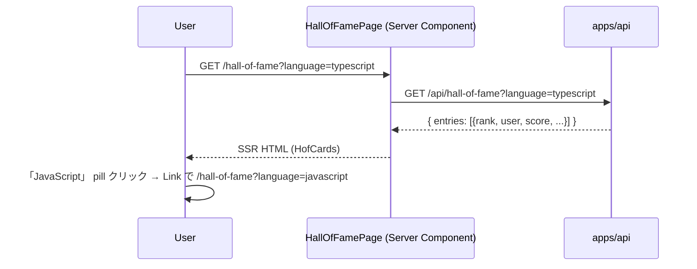

# step5: /hall-of-fame ページ + リザルト TOP 10 入り告知モーダル

step4 で実装した Hall of Fame API を Web から消費する。2 つの UI 接点を 1 step に集約：

1. `/hall-of-fame` 公開ページ（言語タブ + `<HofCards>` 形式の TOP 10）
2. リザルト画面の `TopTenAnnouncementModal`（all-time / monthly の 2 種告知、紙吹雪 Lottie 演出のみ、入力欄なし）

Hall of Fame のコメント機能は廃止された。本 step は閲覧・告知のみで完結する。

## 目次

- [対象画面・呼び出し API](#対象画面呼び出し-api)
- [参考モック](#参考モック)
- [依存](#依存)
- [画面の状態モデル](#画面の状態モデル)
- [処理フロー](#処理フロー)
  - [Hall of Fame ページの流れ](#hall-of-fame-ページの流れ)
  - [TOP 10 入りモーダルの流れ](#top-10-入りモーダルの流れ)
  - [マイページコメント編集の流れ](#マイページコメント編集の流れ)
- [設計方針](#設計方針)
- [対応内容](#対応内容)
- [動作確認](#動作確認)
- [次の step での利用](#次の-step-での利用)

## 対象画面・呼び出し API

### 画面（Next.js Route）

| Route | 種別 | 概要 |
|---|---|---|
| `/hall-of-fame` | Server Component + 言語タブ Link | 言語別 TOP 10 を `<HofCards>` 形式で表示（公開） |
| `/hall-of-fame?language=javascript` | 同上 | JS タブ |
| `/play/[sessionId]` リザルトフェーズ | 既存 Client Component に `<TopTenAnnouncementModal>` を追加 | TOP 10 入り告知モーダル（all-time / monthly 2 種、紙吹雪 Lottie 演出のみ） |

### 呼び出す API

| メソッド / パス | 呼び出すタイミング | 経路 | 認証 |
|---|---|---|---|
| `GET /api/hall-of-fame?language=...` | Hall of Fame ページ表示 | Server Component → `apiClient.get` | 不要 |

## 参考モック

| 画面 | モックファイル | 反映すべき要素 |
|---|---|---|
| `/hall-of-fame` | [`docs/mocks/hall-of-fame.html`](../../mocks/hall-of-fame.html) | `<HofCards>` 形式（クラウン + カーテン演出、コメント列なし） |
| TopTenAnnouncementModal | （モック未作成） | typing-royale の card style を流用、accent border、紙吹雪 Lottie + 告知テキストのみ（入力欄なし） |

### モックから読み取った主要構造

- `/hall-of-fame`: 上位 3 名はクラウン付き `hof-card`、4 位以下も同じ hof-card 形式（コメント列なし）
- 告知モーダル: `<dialog>` 要素 + 紙吹雪 Lottie + 「殿堂入りおめでとう」or「月間 TOP 10 入り」テキスト
- カラー: 既存 `--accent` / `--gold` / `--bg-surface` を流用

## 依存

| 依存先 | 何を使うか | 本 step での扱い |
|---|---|---|
| step4 (`GET /api/hall-of-fame`) | TOP 10 取得 | 必須前提 |
| score-ranking step6 (リザルト画面の TOP 10 バナー) | バナーを告知モーダルに差し替え | 既存実装を編集 |
| 既存 `apiClient` | サーバー間通信 | 流用 |
| 既存 `Topbar` | ヘッダー (`active="hall-of-fame"`) | 既存 `active` 型に含まれているので追加不要 |
| 既存 `proxy.ts` | `/hall-of-fame` を `PUBLIC_PATHS` に追加 | 編集 |

## 画面の状態モデル

### Hall of Fame ページ

| state | 値 | UI |
|---|---|---|
| `language` | `typescript` / `javascript` | URL query で永続化 |
| `entries` | `Array<entry>` (≤10) | `<HofCards>` 本体 |

### TopTenAnnouncementModal

| state | 値 | UI |
|---|---|---|
| `open` | bool | TOP 10 入り判定で true |
| `mode` | `"all_time"` / `"monthly"` | 告知の種類 |

## 処理フロー

### Hall of Fame ページの流れ



### TopTenAnnouncementModal の流れ

```mermaid
sequenceDiagram
    participant U as User
    participant Loop as PlayLoop
    participant Res as ResultScreen
    participant Modal as TopTenAnnouncementModal

    U->>Loop: プレイ完了
    Loop->>API: POST /finish
    API-->>Loop: { score, top_ten_boundary_score, new_rank, ... }
    Loop->>Res: result props
    Res->>Res: TOP10 入り判定 (all-time / monthly) → Modal 表示
    Modal-->>U: 紙吹雪 Lottie + 告知テキスト
    U->>Modal: 「閉じる」または背景クリックで close
```

## 設計方針

- **モーダルの実装に `<dialog>` を使う理由**: ブラウザ標準 `<dialog>` の方が a11y 良い (showModal() / close() / Esc キー自動対応)。スタイルは既存 globals.css を流用しつつ inline で最小限
- **TOP 10 入りモーダルを「告知のみ」にする理由**: コメント機能を廃止したため入力動線は持たない。紙吹雪 Lottie + 告知テキストだけで「殿堂入りした感」を演出
- **all-time / monthly の 2 種を区別する理由**: ユーザーが「殿堂入り（all-time TOP 10）」と「月間 TOP 10 入り」のどちらに到達したかを明示する。両方同時達成時は all-time を優先表示
- **`<TopTenAnnouncementModal>` の表示判定を Client Component で行う理由**: モーダル開閉は Client state、Lottie の再生も Client 側で行う
- **Hall of Fame ページの空状態**: `entries=[]` のとき「まだ Hall of Fame エントリがありません」 placeholder を控えめに表示

## 対応内容

### `apps/web/src/app/hall-of-fame/page.tsx`（新規）

Server Component。言語タブ + `<HofCards>` の組み合わせ。詳細は step7 で hof-card 形式 + クラウン + カーテン演出 + 神モーダルに発展する。

```typescript
import type { Metadata } from "next"
import Link from "next/link"

import type { GetHallOfFameResponse } from "@repo/api-schema"

import { Topbar } from "@/components/topbar"
import { apiClient } from "@/libs/api-client"

import { HofCards } from "./hof-cards"

export const metadata: Metadata = {
  title: "Hall of Fame - Typing Royale",
}

const SUPPORTED_LANGUAGES = ["typescript", "javascript"] as const
type SupportedLanguage = (typeof SUPPORTED_LANGUAGES)[number]

export default async function HallOfFamePage({
  searchParams,
}: {
    searchParams: Promise<{ language?: string }>
}) {
  const { language: rawLang } = await searchParams
  const language: SupportedLanguage = SUPPORTED_LANGUAGES.includes(rawLang as SupportedLanguage)
    ? (rawLang as SupportedLanguage)
    : "typescript"

  const data = await apiClient.get<GetHallOfFameResponse>(`/api/hall-of-fame?language=${language}`)

  return (
    <>
      <Topbar active="hall-of-fame" />
      <div className="container">
        <h1 className="mb-16">🏛 Hall of Fame</h1>
        <div className="pills mb-16">
          {SUPPORTED_LANGUAGES.map((lang) => (
            <Link className={`pill ${language === lang ? "active" : ""}`} href={`/hall-of-fame?language=${lang}`} key={lang}>
              {lang === "typescript" ? "TypeScript" : "JavaScript"}
            </Link>
          ))}
        </div>
        {data.entries.length === 0 ? (
          <div className="card text-center" style={{ padding: "48px 16px" }}>
            <p className="text-muted">まだ Hall of Fame エントリがありません</p>
          </div>
        ) : (
          <HofCards entries={data.entries} />
        )}
      </div>
    </>
  )
}
```

### `apps/web/src/components/top-ten-announcement-modal.tsx`（新規 Client Component）

`<dialog>` 要素を使った告知モーダル。`open` / `mode` は親 (`ResultScreen`) から制御。紙吹雪 Lottie + 告知テキストのみで入力欄なし。

```typescript
"use client"

import { useEffect, useRef } from "react"

type Props = {
    mode: "all_time" | "monthly"
    onClose: () => void
    open: boolean
}

export function TopTenAnnouncementModal({ mode, onClose, open }: Props) {
  const dialogRef = useRef<HTMLDialogElement>(null)

  useEffect(() => {
    if (open) {
      dialogRef.current?.showModal()
    } else {
      dialogRef.current?.close()
    }
  }, [open])

  const title = mode === "all_time" ? "🏆 殿堂入りおめでとう！" : "🥇 月間 TOP 10 入り！"
  const subtitle = mode === "all_time"
    ? "Hall of Fame に掲載されました"
    : "今月のランキング TOP 10 に名前が刻まれました"

  return (
    <dialog onClose={onClose} ref={dialogRef} style={{ background: "var(--bg-surface)", border: "1px solid var(--gold)", borderRadius: "8px", padding: "24px", width: "min(560px, 90vw)" }}>
      {/* 紙吹雪 Lottie はここで再生 */}
      <h2 style={{ color: "var(--gold-light)" }}>{title}</h2>
      <p className="text-sm text-muted mb-16">{subtitle}</p>
      <div className="flex gap-12 mt-16" style={{ justifyContent: "flex-end" }}>
        <button className="btn btn-primary" onClick={onClose} type="button">閉じる</button>
      </div>
    </dialog>
  )
}
```

### `apps/web/src/app/play/[sessionId]/result-screen.tsx`（編集）

「🏆 TOP 10 入り見込み！」バナーを `<TopTenAnnouncementModal>` に差し替え。`/finish` レスポンスから all-time / monthly の TOP 10 入り判定を行い、該当時に `<TopTenAnnouncementModal open={modalOpen} mode={mode} onClose={...} />` を出す。

### `apps/web/src/proxy.ts`（編集）

`PUBLIC_PATHS` に `/hall-of-fame` を追加（公開ページ）。

## 動作確認

| 区分 | 内容 |
|---|---|
| Hall of Fame 公開ページ (空) | seed 直後の typescript → 「まだ Hall of Fame エントリがありません」 placeholder |
| Hall of Fame (データあり) | TOP 10 seed → HofCards で rank 順表示 |
| 言語タブ切替 | TS → JS の Link クリックで JS のエントリが描画 |
| リザルト TOP 10 告知モーダル | dev で seed して TOP 10 入り条件を満たすプレイ → 紙吹雪 Lottie + 告知モーダル open |
| モーダル close | 「閉じる」ボタンまたは Esc キーで閉じる |
| Playwright MCP | /hall-of-fame と リザルト告知モーダルのスクショ + コンソール error 0 件 |
| Lint / Build | `pnpm lint && pnpm build` |

## 次の step での利用

- **step6 (達成カード PNG)**: 本 step とは独立。両立可能
- **step7 (神モーダル + favorite_repo_url)**: 本 step の `<HofCards>` を上位 3 名クラウン + カーテン演出 + 神モーダル化する
