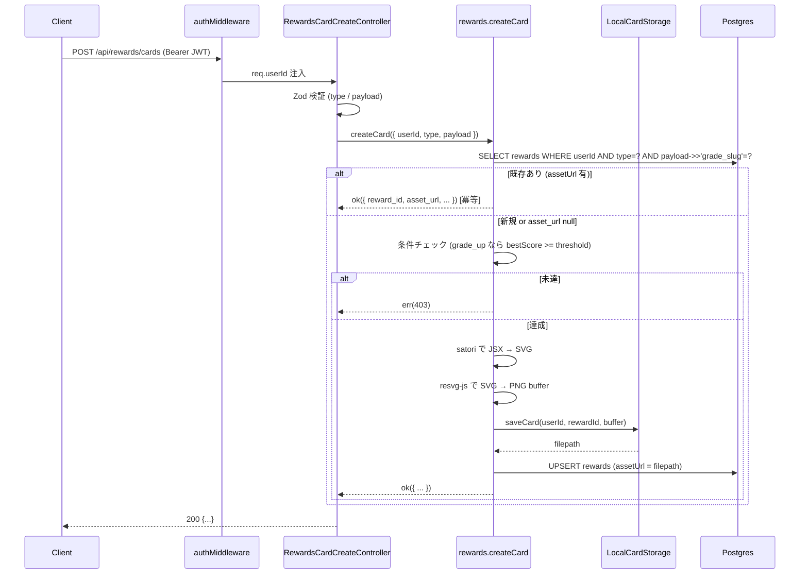
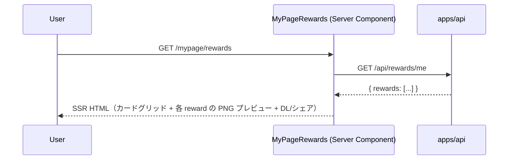

# step6: 達成カード PNG 生成 + /api/rewards/me + マイページ特典タブ

rewards 機能の最後のサブ機能：達成カード PNG（OG カード風画像）の自動生成 + ダウンロード動線。

3 つの要素を 1 step に集約：

1. `satori` + `resvg-js` で PNG を生成する Service 層
2. `POST /api/rewards/cards` （生成 / 既存取得）と `GET /api/rewards/me` （獲得済み一覧）
3. マイページ「特典」タブで一覧表示 + ダウンロード + SNS シェア

PNG ストレージは MVP では **ローカルファイルシステム** に置く（`/var/cache/rewards/{userId}-{rewardId}.png`）。S3 連携は別 PR で対応（環境変数で切り替え可能なよう Storage interface を切る）。

## 目次

- [対象 API・画面](#対象-api画面)
- [参考モック](#参考モック)
- [依存](#依存)
- [リクエスト](#リクエスト)
  - [POST /api/rewards/cards](#post-apirewardscards)
  - [GET /api/rewards/me](#get-apirewardsme)
- [レスポンス](#レスポンス)
  - [POST /api/rewards/cards - 200 OK](#post-apirewardscards---200-ok)
  - [GET /api/rewards/me - 200 OK](#get-apirewardsme---200-ok)
  - [エラー](#エラー)
- [処理フロー](#処理フロー)
  - [達成カード生成の流れ](#達成カード生成の流れ)
  - [マイページ特典タブの流れ](#マイページ特典タブの流れ)
- [達成カード自動生成のトリガー](#達成カード自動生成のトリガー)
- [PNG ストレージ設計](#png-ストレージ設計)
- [設計方針](#設計方針)
- [対応内容](#対応内容)
- [動作確認](#動作確認)
- [次の step での利用](#次の-step-での利用)

## 対象 API・画面

### API

| メソッド / パス | 認証 | 副作用 | 冪等性 | 説明 |
|---|---|---|---|---|
| `POST /api/rewards/cards` | 必須 | `rewards` upsert + PNG 生成 + ファイル書き込み | 冪等（同 type + payload なら既存 PNG を返す） | 達成カード PNG の生成 or 取得 |
| `GET /api/rewards/me` | 必須 | なし | 冪等 | 自分の獲得済み rewards 一覧 |
| `GET /cache/rewards/:filename` | 不要（推測困難なファイル名で擬似秘匿） | なし | 冪等 | 生成済み PNG の配信（Express の静的ファイル配信） |

### 画面

| Route | 種別 | 概要 |
|---|---|---|
| `/mypage/rewards` | Server Component | 獲得済み rewards の一覧、ダウンロード / シェアボタン |
| `/mypage` のタブ | 既存「特典」タブを `/mypage/rewards` リンクに変更 | 遷移動線 |

### `/finish` 拡張トリガー

`/finish` 完了時に `grade_up !== null` なら **サーバー側で `POST /api/rewards/cards` 相当の処理を内部呼び出し** して達成カードを自動生成（クライアントは何もしなくて良い）。実装は Service 層内で同期実行（リクエストレイテンシは増えるが acceptable）または `setImmediate` で非同期化。

## 参考モック

| 画面 | モックファイル | 反映すべき要素 |
|---|---|---|
| `/mypage/rewards` | （モック未作成）`mypage.html` の sidebar 「特典」カードを参考 | 各 reward を card で並べる、PNG プレビュー画像 + DL ボタン + シェアボタン |
| 達成カード PNG レイアウト | （モック未作成） | OG card 風 (1200×630)、グレード名大文字、ユーザー名、達成日、Typing Royale ロゴ |

### モックから読み取った主要構造

- マイページタブ群を流用、`active="特典"` で `/mypage/rewards`
- 各 reward は `.card` ヘッダー + プレビュー画像 + DL/シェアアクション
- PNG カードは Twitter / X の OG カードと同サイズで、シェアしたときに見栄えするように

## 依存

| 依存先 | 何を使うか | 本 step での扱い |
|---|---|---|
| step1 (`rewards` テーブル) | 生成記録 | 必須前提 |
| score-ranking step3 (`/finish` の `grade_up`) | 自動生成トリガー | 既存処理に追記 |
| score-ranking step6 (グレードアップ祝賀バナー) | 達成カードへのリンク追加 | 編集（UI で「達成カードを見る」リンクを追加） |
| `satori` (npm) | JSX → SVG 変換 | 新規導入 |
| `@resvg/resvg-js` (npm) | SVG → PNG 変換 | 新規導入 |

## リクエスト

### POST /api/rewards/cards

Body:

```json
{
  "type": "grade_up",
  "payload": { "grade_slug": "senior" }
}
```

| フィールド | 型 | 必須 | 制約 | 説明 |
|---|---|---|---|---|
| `type` | string | yes | `grade_up` のみ MVP 対応（`card` 型は MVP では未対応、リクエストすると 400） | カード種別 |
| `payload` | object | yes | `type` ごとに別 schema | grade_up なら `{ grade_slug }` |

サーバー側で「自分が当該条件を満たしているか」を検証（`grade_up: senior` なら `user_lifetime_stats.bestScore >= 400` 等）。

### GET /api/rewards/me

なし（認証 cookie のみ）

## レスポンス

### POST /api/rewards/cards - 200 OK

```json
{
  "reward_id": 42,
  "type": "grade_up",
  "payload": { "grade_slug": "senior" },
  "asset_url": "/cache/rewards/12-42.png",
  "granted_at": "2026-06-08T12:34:56.000Z"
}
```

### GET /api/rewards/me - 200 OK

```json
{
  "rewards": [
    {
      "reward_id": 42,
      "type": "grade_up",
      "payload": { "grade_slug": "senior" },
      "asset_url": "/cache/rewards/12-42.png",
      "granted_at": "2026-06-08T12:34:56.000Z"
    }
  ]
}
```

`asset_url` は `null` の場合あり（PNG 生成失敗時など、`rewards` 行は作るが `assetUrl` 未設定）。

### エラー

| Status | type | 条件 | クライアント挙動 |
|---|---|---|---|
| 400 | BAD_REQUEST | type / payload 不正 | バリデーションエラー |
| 401 | UNAUTHORIZED | JWT 無し | ログイン誘導 |
| 403 | FORBIDDEN | 条件未達（例: senior をリクエストしたが bestScore<400） | 「達成条件を満たしていません」 |

## 処理フロー

### 達成カード生成の流れ



#### 流れ

1. 認証 middleware が `req.userId` を注入
2. Controller が Zod で `type` / `payload` を検証
3. Service が既存 `rewards` 行を `(userId, type, payload)` で検索（同じ達成カードは 1 度生成したら再利用）
4. 既存があり `assetUrl !== null` なら即返す（冪等）
5. 無い or `assetUrl=null` なら条件チェック → 未達なら 403
6. satori で JSX を SVG にレンダリング
7. resvg-js で SVG を PNG buffer に変換
8. `LocalCardStorage.saveCard` で `/var/cache/rewards/{userId}-{rewardId}.png` に書き込み
9. `rewards` を upsert（`assetUrl` セット）
10. レスポンス組み立て

### マイページ特典タブの流れ



#### 流れ

1. Server Component が `apiClient.get<GetMyRewardsResponse>("/api/rewards/me")`
2. 取得した `rewards[]` を grid で並べる
3. 各 card に `` でプレビュー
4. ダウンロードボタン: `<a href={r.asset_url} download={`reward-${r.reward_id}.png`}>`
5. シェアボタン: X intent URL（`?text=Typing+Royale+で+Senior+Engineer+昇格！&url=https://...`）

## 達成カード自動生成のトリガー

`/finish` で `grade_up !== null` のとき、Service 層で **同期的に** `rewards.createCard({ userId, type: "grade_up", payload: { grade_slug: gradeUp.to.slug } })` を呼ぶ。

```typescript
// apps/api/src/service/play-session-service.ts の finishSession 末尾
if (gradeUp !== null) {
  await rewards.createCard(
    { payload: { grade_slug: gradeUp.to.slug }, type: "grade_up", userId: state.userId },
    { rewardRepository: repo.rewardRepository, /* ... */ },
  )
}
```

> **注記**：生成失敗時（satori / resvg / Storage 例外）は warn ログのみで `/finish` は成功扱いとする。`rewards` 行は `assetUrl=null` で残り、マイページ特典タブでは「生成中」もしくは非表示扱いになる。`/finish` 自体は冪等性とユーザー体験のために失敗しない。

レイテンシ：satori + resvg は数十 ms〜数百 ms 程度なので `/finish` 全体のレイテンシ増は許容範囲。気になるなら `setImmediate` で fire-and-forget にできる（その場合は `rewards` 行作成のみ tx 内 → PNG 生成は背景処理）。

> MVP では同期実行で十分。本格運用で問題になったら `BullMQ` 等のキュー化を検討。

## PNG ストレージ設計

`CardStorage` interface を定義し、`LocalCardStorage` (filesystem) と将来の `S3CardStorage` を切り替え可能にする：

```typescript
export interface CardStorage {
    /** PNG を保存して URL を返す */
    save(filename: string, buffer: Buffer): Promise<string>
}

export class LocalCardStorage implements CardStorage {
    constructor(private baseDir: string, private publicUrlPrefix: string) {}

    async save(filename: string, buffer: Buffer): Promise<string> {
      await fs.mkdir(this.baseDir, { recursive: true })
      await fs.writeFile(`${this.baseDir}/${filename}`, buffer)
      return `${this.publicUrlPrefix}/${filename}`
    }
}
```

> 削除動線はアカウント削除フローから直接 fs を叩く方針に変更されたため、`Storage.delete` は持たない（現実装シグネチャに合わせた）。

Express の `app.use("/cache/rewards", express.static(localCacheDir))` で配信。

## 設計方針

- **POST を upsert / 冪等にする理由**: 同じ達成カード（grade_up: senior）は 1 度生成したら再利用。クライアントから「カード作って」と何度呼ばれても 1 行 + 1 ファイルで済む
- **`type` + `payload` で一意とする理由**: ユーザーが Junior → Senior → Staff と順次達成する場合、3 種類の rewards 行を作る。`(userId, type, payload->>'grade_slug')` で UNIQUE 判定
- **満たしていない条件で 403 を返す理由**: フロントエンドが正規 UX を踏まず直接 API を叩いた場合の防御。`grade_up: fellow` を bestScore 200 で要求できないようサーバー側で検証
- **ローカルファイルストレージで MVP を回す理由**: S3 連携 + IAM + bucket policy 設定は別 PR の手間が大きい。MVP は単一インスタンスで動かせばよいので filesystem で十分。Storage interface を切ってあるので S3 化は局所変更で済む
- **満了 (期限切れ) を持たない**: 達成カードは一度生成したら永続。アカウント削除時のみ削除
- **PNG のサイズを 1200×630 (OG カード) にする理由**: X / Slack / Facebook の OG カードと同サイズ。シェアしたときに切り取られず綺麗に表示される
- **`satori` を選ぶ理由**: Vercel 製、JSX で書ける、Node のみで動く、フォント埋め込み可能。Puppeteer より軽量で、3D アイコン等を組み込まないなら十分
- **`resvg-js` を選ぶ理由**: satori が SVG しか出力しないので、PNG が欲しければ rasterize 必要。`resvg-js` は Rust の resvg を WASM 化したもので Node のみで完結
- **自動生成を `/finish` 同期実行にする理由**: ユーザーがリザルト画面に着地した時点でカードが取得可能になる UX。失敗しても `assetUrl=null` の `rewards` 行は残り、マイページで「再生成」ボタンを出せばリトライ可（再生成は MVP では不要、必要になったら別 PR）
- **`/cache/rewards/:filename` を `PUBLIC_PATHS` にする理由**: PNG をクライアントが直接 fetch できないとマイページの `` が表示できない。Express の static 配信なら認証経由は不可能なので公開。ファイル名 `{userId}-{rewardId}.png` で推測困難（rewardId は連番 autoincrement なので完全秘匿ではないが、誰でも見れる程度の機密性で問題ない）

## 対応内容

### 依存追加

```bash
cd apps/api
pnpm add satori @resvg/resvg-js
```

### `packages/schema/src/api-schema/rewards.ts`（新規）

```typescript
import { z } from "zod"

const cardTypeSchema = z.enum(["grade_up", "card"])

const createCardPayloadSchema = z.union([
  z.object({ grade_slug: z.string() }),
  z.object({ milestone_label: z.string() }),
])

export const createRewardCardRequestSchema = z.object({
  payload: createCardPayloadSchema,
  type: cardTypeSchema,
})

const rewardEntrySchema = z.object({
  asset_url: z.string().nullable(),
  granted_at: z.string().datetime(),
  payload: z.record(z.string(), z.unknown()),
  reward_id: z.number().int().positive(),
  type: z.string(),
})

export const createRewardCardResponseSchema = rewardEntrySchema

export const getMyRewardsResponseSchema = z.object({
  rewards: z.array(rewardEntrySchema),
})

export type CreateRewardCardRequest = z.infer<typeof createRewardCardRequestSchema>
export type CreateRewardCardResponse = z.infer<typeof createRewardCardResponseSchema>
export type GetMyRewardsResponse = z.infer<typeof getMyRewardsResponseSchema>
```

### `apps/api/src/repository/prisma/reward-repository.ts`（新規）

```typescript
export type RewardRow = {
    id: number
    userId: number
    type: string
    payload: Record<string, unknown>
    assetUrl: string | null
    grantedAt: Date
}

export interface RewardRepository {
    findByUserId(userId: number): Promise<RewardRow[]>
    findOneByUserTypePayload(userId: number, type: string, payload: Record<string, unknown>): Promise<RewardRow | null>
    upsert(input: { userId: number; type: string; payload: Record<string, unknown>; assetUrl: string | null }): Promise<RewardRow>
}
```

Prisma 実装は `payload->>'grade_slug'` 等の JSON path 検索を `findFirst` with `where: { payload: { equals: input.payload } }` で代用（payload が小さい object なので equals で問題ない）。

### `apps/api/src/lib/card-storage.ts`（新規）

`CardStorage` interface + `LocalCardStorage` 実装（filesystem ベース）。

### `apps/api/src/lib/card-renderer.ts`（新規）

`renderGradeUpCard(input: { gradeName: string; gradeSlug: string; userDisplayName: string; achievedAt: Date }): Promise<Buffer>` を実装。satori で JSX → SVG、resvg-js で SVG → PNG buffer。

### `apps/api/src/service/rewards-service.ts`（新規）

`createCard` / `listMine` の 2 関数を `export const`。`Result<T>` 戻り値。条件チェックも含む。

### `apps/api/src/controller/rewards/cards.ts` / `me.ts`（新規）

それぞれ class + execute パターン。

### `apps/api/src/routes/rewards-router.ts`（新規）

```typescript
export const rewardsRouter = (controllers: RewardsRouterControllers): Router => {
  const router = Router()
  if (controllers.me) {
    const c = controllers.me
    router.get("/me", async (req, res) => c.execute(req, res))
  }
  if (controllers.cards) {
    const c = controllers.cards
    router.post("/cards", async (req, res) => c.execute(req, res))
  }
  return router
}
```

### `apps/api/src/service/play-session-service.ts`（編集）

`finishSession` 末尾で `gradeUp !== null` なら `rewards.createCard` を呼ぶ。`FinishSessionRepo` に `rewardRepository` 追加。`/finish` レスポンス schema にも `achievement_card_url` を追加（任意）。

### `apps/api/src/index.ts`（編集）

`/api/rewards` に `rewardsRouter` をマウント。`/cache/rewards` に `express.static(localCacheDir)`。`PUBLIC_PATHS` に `/cache/rewards` を追加。`PROTECTED_PATHS` には何も追加しない（`/api/rewards/me` / `/api/rewards/cards` は普通に認証必須）。

### `apps/web/src/app/mypage/rewards/page.tsx`（新規）

Server Component。`/api/rewards/me` を fetch、card grid で表示。

### `apps/web/src/app/mypage/page.tsx`（編集）

「特典」タブを `<a className="tab" href="#">` から `<Link className="tab" href="/mypage/rewards">` に変更。

### `apps/web/src/app/play/[sessionId]/result-screen.tsx`（編集）

`grade_up !== null` 時の祝賀バナーに `<Link href="/mypage/rewards">達成カードを見る →</Link>` を追加。

### `apps/api/src/env.ts`（編集）

ローカル PNG キャッシュディレクトリの env var を追加：

```typescript
REWARDS_CACHE_DIR: z.string().default("/tmp/typing-royale-rewards"),
REWARDS_PUBLIC_URL_PREFIX: z.string().default("/cache/rewards"),
```

## 動作確認

| 区分 | 内容 |
|---|---|
| POST 正常 (新規) | dev-login + 条件達成済み → 200 + PNG ファイル生成 + DB 行作成 |
| POST 冪等 (既存) | 同 type + payload で再リクエスト → 既存の reward_id / asset_url を返す（ファイル再生成しない） |
| POST 条件未達 | bestScore=50 で `grade_up: fellow` 要求 → 403 |
| POST バリデーション | 不正な type → 400 |
| GET /api/rewards/me | 0 件で `rewards=[]`、複数件 grantedAt DESC で並ぶ |
| /finish 連動 | グレードアップが発生する `/finish` → DB に `rewards` 行 + PNG ファイル生成 |
| /cache/rewards/:filename | `curl http://localhost:8080/cache/rewards/1-42.png > out.png` で取得、`file out.png` で `PNG image data` 確認 |
| マイページ特典タブ (空) | 「まだ獲得した特典がありません」 placeholder |
| マイページ特典タブ (データあり) | カードグリッド表示、PNG プレビュー、DL ボタン |
| 達成カード DL | `<a download>` でローカルに保存できる |
| シェア | X intent URL でツイート画面が開く |
| Playwright MCP | /mypage/rewards のスクショ取得、コンソール error 0 件 |
| Lint / Build / Test | `pnpm lint && pnpm build && pnpm test` |

## 次の step での利用

- **rewards 機能完成**: 本 step で MVP の 3 種（バッジ / Hall of Fame / 達成カード）が全て揃う
- **S3 移行 (別 PR)**: `LocalCardStorage` を `S3CardStorage` に差し替え。env var で切り替え
- **キュー化 (別 PR)**: PNG 生成を `BullMQ` 等で非同期化
- **コミックカード等 Phase 2 特典**: `Reward.type` に `trading_card` 等を追加して同じパターンで実装
