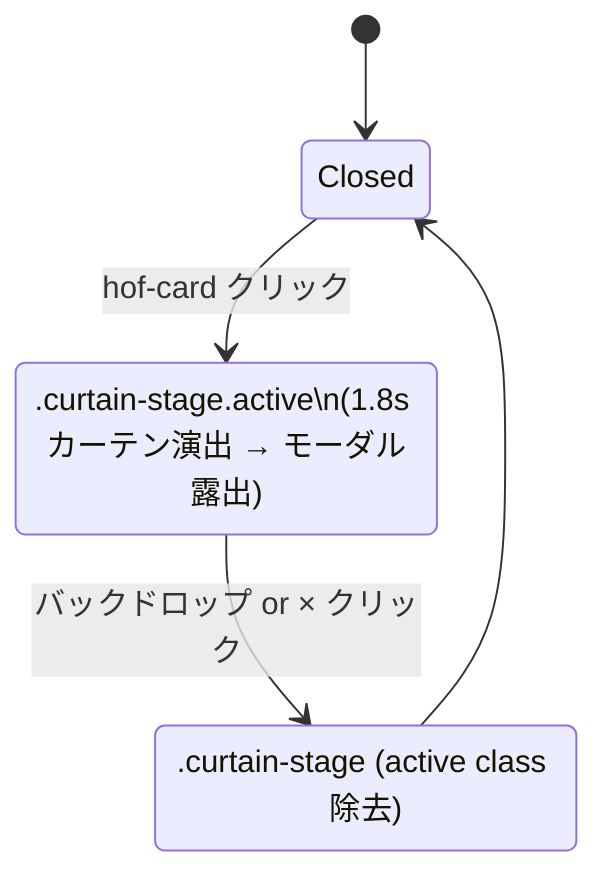

# step7: Hall of Fame の上位 3 名にカーテン演出 + 神モーダル + お気に入りリポジトリ

step5 で Hall of Fame の MVP（コメント付きテーブル）を実装したが、`docs/mocks/hall-of-fame.html` 準拠の **上位 3 名クラウン + クリックでカーテン演出 + 神モーダル** が未反映だった。本 step で (1) 上位 3 名の hof-card レイアウト + クラウン + カーテン演出 + 神モーダル化、(2) 神モーダルに **お気に入りリポジトリ** を表示する `users.favorite_repo_url` カラムと設定 UI を追加、(3) TODO.md の現状反映を 1 PR で行う。

「⚡ この神に挑戦」ボタンはモックに含まれるが、神々モードは指名対戦不可の仕様（[`../ghost-battle/step1-web-play-and-result.md`](../ghost-battle/step1-web-play-and-result.md)）に従い、神モーダルからは出さず「▶ リプレイを見る」のみとする。

## 目次

- [対象 API / 対象画面](#対象-api--対象画面)
- [参考モック](#参考モック)
- [依存](#依存)
- [DB スキーマ変更](#db-スキーマ変更)
- [API 変更](#api-変更)
- [処理フロー](#処理フロー)
  - [カーテン演出 → 神モーダルの状態遷移](#カーテン演出--神モーダルの状態遷移)
- [設計方針](#設計方針)
- [対応内容](#対応内容)
- [動作確認](#動作確認)
- [TODO.md の更新方針](#todomd-の更新方針)
- [次の step での利用](#次の-step-での利用)

## 対象 API / 対象画面

### 画面

| Route | 変更内容 |
|---|---|
| `/hall-of-fame` | テーブル形式 → mock 準拠 hof-card に書き換え。上位 3 名（rank=1〜3）は `.hof-card.has-crown.tappable[data-rank=gold/silver/bronze]` + クラウン SVG。クリックで `.curtain-stage.active` を 1.8 秒再生して `.god-modal` を露出。4 位以下は既存のコメント表示テーブルをそのまま下に並べる |
| `/mypage/account` | 設定フォームに「お気に入りリポジトリ URL」入力欄追加 |

### API

| メソッド / パス | 変更内容 |
|---|---|
| `GET /api/hall-of-fame?language=...` | response の `entries[].user` に `favorite_repo_url: string \| null` を追加 |
| `PATCH /api/user` | request body に `favorite_repo_url: string \| null` を追加（null で空欄リセット） |
| `GET /api/user` | response の userSchema に `favorite_repo_url: string \| null` を追加 |

## 参考モック

| 画面 | モックファイル | 反映すべき要素 |
|---|---|---|
| Hall of Fame | [`docs/mocks/hall-of-fame.html`](../../mocks/hall-of-fame.html) | `.hof-card.has-crown.tappable` 3 枚（gold/silver/bronze、`.hof-crown` SVG）+ `.curtain-stage > .curtain-backdrop + .curtain-left + .curtain-right + .curtain-flash + .god-modal` 構造。クリックで `.active` を toggle |

mock 由来の `.hof-card` / `.hof-crown` / `.curtain-stage` / `.god-modal` / `@keyframes curtain-*` などは [`apps/web/src/app/globals.css`](../../../apps/web/src/app/globals.css) に **すでに移植済み**（grep で 30 件 hit）。新規 CSS 追加は不要、React で構造を組むだけで動く。

### 神モーダルに表示する要素

| 項目 | データソース |
|---|---|
| クラウン SVG | static (rank に応じて gold/silver/bronze) |
| avatar + 表示名 | `entry.user` |
| ベスト / 文字数 / 正確率 | `entry.score / entry.typed_chars / entry.accuracy` |
| グレード | `entry.user.current_grade` |
| 殿堂入りコメント | `entry.comment` (null なら「コメントなし」placeholder) |
| **お気に入りリポジトリ** | `entry.user.favorite_repo_url`（null なら hide）→ 入力 URL が `github.com/...` 形式なら `<a>` リンク + `owner/name` 抽出表示 |
| 「▶ リプレイを見る」 | `/replay/{entry.best_play_session_id}` |

GitHub / X のソーシャルリンクは MVP では割愛（user データに保持していないため）。後続 step で `github_username` を持つようになったら追加。

## 依存

| 依存先 | 何を使うか |
|---|---|
| 既存 `users` テーブル | `favorite_repo_url` カラム追加 (migration) |
| 既存 Hall of Fame Repository / Service | join 先 user の取得カラムに `favorite_repo_url` を追加 |
| 既存 User Repository / Service | update 時のフィールド追加 |
| 既存 [`replay-viewer/step1`](../replay-viewer/step1-api-and-web-replay-player.md) | 「▶ リプレイを見る」リンク先 |

## DB スキーマ変更

```prisma
model User {
  // ... 既存 ...
  favoriteRepoUrl  String? @map("favorite_repo_url")
}
```

migration 名: `add_user_favorite_repo_url`

```sql
ALTER TABLE users ADD COLUMN favorite_repo_url TEXT;
```

## API 変更

### `packages/schema/src/api-schema/user.ts`

```typescript
const userSchema = z.object({
  avatar_url: z.string().nullable(),
  can_public_ranking: z.boolean(),
  created_at: z.string(),
  display_name: z.string().nullable(),
  email: z.string().nullable(),
  favorite_repo_url: z.string().nullable(),
  id: z.number(),
})

export const updateUserRequestSchema = z
  .object({
    can_public_ranking: z.boolean().optional(),
    display_name: z.string().trim().min(1).max(50).optional(),
    /**
     * URL 文字列。null で空欄リセット。validation は 200 文字以下 + http(s) スキーム
     */
    favorite_repo_url: z.string().trim().max(200).url().nullable().optional(),
  })
  .refine(
    (v) =>
      v.can_public_ranking !== undefined
      || v.display_name !== undefined
      || v.favorite_repo_url !== undefined,
    { message: "At least one field is required" },
  )
```

### `packages/schema/src/api-schema/hall-of-fame.ts`

`entries[].user` の項目に `favorite_repo_url: z.string().nullable()` を追加（current_grade と同列）。

### `apps/api/src/repository/prisma/user-repository.ts`

`update(input)` の data に `favoriteRepoUrl` 渡し追加、`_toDomain` で `favoriteRepoUrl` を含める。

### `apps/api/src/repository/prisma/hall-of-fame-entry-repository.ts`

`user` の select に `favoriteRepoUrl: true` を追加し、戻り型に含める。

### `apps/api/src/service/user-service.ts` / `hall-of-fame-service.ts`

field 追加に追従。新規ロジックは無し。

### `apps/api/src/controller/user/update.ts` / `controller/hall-of-fame/list.ts`

response 組み立てに `favorite_repo_url` 追加。

### `apps/api/src/types/domain/user.ts`

User 型に `favoriteRepoUrl: string | null` 追加。

## 処理フロー

### カーテン演出 → 神モーダルの状態遷移



実装は `useState<{ rank: 1 | 2 | 3 } | null>` で **1 件分の opened state** を持ち、クリックされた rank に応じてモーダル中身を出す。CSS は mock の `.curtain-stage.active` に `[data-rank]` を組み合わせる前提なので、`<div className="curtain-stage active" data-rank={rank}>` で再現できる。

### 処理の流れ

1. Hall of Fame Server Component が `GET /api/hall-of-fame?language=...` を fetch
2. 上位 3 名は `hof-card has-crown tappable` + `data-rank` で描画、4 位以下は既存テーブル
3. 上位 3 カードに `onClick={() => setOpen({ rank })}` を付与
4. open state が non-null のとき `<CurtainModal entry={data.entries[open.rank-1]} onClose={...} />` を mount
5. CurtainModal は `.curtain-stage.active[data-rank=...]` 構造を 1 つだけ DOM に出し、CSS 由来の 1.8 秒アニメーション後に内部 `.god-modal` が表示される
6. バックドロップクリックで onClose → setOpen(null)
7. モーダル中身: avatar / 表示名 / stat / grade / comment / favorite_repo_url（あれば）/ リプレイリンク

## 設計方針

- **CSS は globals.css 既存を流用**：新規 CSS なし。`.hof-card` / `.curtain-*` / `.god-modal` などすべて移植済み
- **「⚡ この神に挑戦」は出さない**：神々モードは指名対戦不可（ghost-battle step1）。モーダルの CTA は「▶ リプレイを見る」のみ
- **上位 3 名はクラウン演出、4 位以下はテーブル**：mock 通り段差を付ける。テーブル自体は step5 の構造を残しコメント / リプレイリンクは継続表示
- **favorite_repo_url の validation は URL のみ**：「github.com/...」固定にはせず汎用 URL（Zenn 記事 / 個人ブログ等も入れたいニーズに対応）。表示時に `github.com/owner/name` パターンなら短く `owner/name` 表示する
- **モーダルは 1 つだけ DOM**：mock は 3 つの `.curtain-stage` を予め描画していたが、React では open state による 1 つだけマウントで簡素化
- **API 変更は非破壊**：新規 nullable フィールド追加だけなので既存クライアントは無影響
- **migration は単独 commit にしない**：本 step は migration + API + Web を 1 PR にまとめる（コンパクトで、相互レビュー容易）

## 対応内容

### `packages/db/prisma/schema.prisma`（修正）+ migration

`User` モデルに `favoriteRepoUrl String? @map("favorite_repo_url")` を追加。`pnpm --filter @repo/db db:migrate:dev --name add_user_favorite_repo_url` で migration 生成。

### `packages/schema/src/api-schema/user.ts`（修正）

- `userSchema` に `favorite_repo_url: z.string().nullable()` 追加
- `updateUserRequestSchema` に `favorite_repo_url: z.string().trim().max(200).url().nullable().optional()` 追加 + refine 拡張

### `packages/schema/src/api-schema/hall-of-fame.ts`（修正）

`entries[].user` に `favorite_repo_url: z.string().nullable()` 追加。

`pnpm --filter @repo/api-schema build`。

### `apps/api/src/types/domain/user.ts`（修正）

`User` 型に `favoriteRepoUrl: string | null` 追加。

### `apps/api/src/repository/prisma/user-repository.ts`（修正）

- `_toDomain` で `favoriteRepoUrl: row.favoriteRepoUrl` 追加
- `update` の `data` に `favoriteRepoUrl: input.favoriteRepoUrl` 追加（undefined なら Prisma 側で省略）

### `apps/api/src/repository/prisma/hall-of-fame-entry-repository.ts`（修正）

`user` の select に `favoriteRepoUrl: true` 追加し、戻り値の構造体に含める。

### `apps/api/src/service/user-service.ts`（修正）

`updateUser` の input 型に `favoriteRepoUrl?: string | null` 追加し、Repository に渡す。

### `apps/api/src/service/hall-of-fame-service.ts`（修正）

`list` の戻り型に `favoriteRepoUrl` を含めて Controller に渡す。

### `apps/api/src/controller/user/update.ts` / `user/get.ts`（修正）

response 組み立てで `favorite_repo_url: user.favoriteRepoUrl` を追加。

### `apps/api/src/controller/hall-of-fame/list.ts`（修正）

response の `entries[].user` に `favorite_repo_url: entry.user.favoriteRepoUrl` 追加。

### `apps/web/src/app/hall-of-fame/page.tsx`（リライト）

mock 準拠で **上位 3 名 = hof-card has-crown + クリックで `<CurtainModal>` 開閉**、4 位以下は既存テーブル（簡素版）。Server Component は引き続き fetch のみ、開閉 state は Client Component に分離。

### `apps/web/src/app/hall-of-fame/curtain-modal.tsx`（新規）

Client Component。`{ open: { rank: 1|2|3 } | null }` を受け取り、`.curtain-stage.active[data-rank=...]` 構造 + `.god-modal` を描画。「▶ リプレイを見る」リンクは `/replay/{entry.best_play_session_id}` へ。`favorite_repo_url` が non-null なら「📦 お気に入りリポジトリ」セクションを出す（github.com URL なら `owner/name` 短縮表示、それ以外は URL を表示）。

### `apps/web/src/app/hall-of-fame/hof-cards.tsx`（新規）

Client Component。上位 3 名の `hof-card` を描画し、クリックで `open` state を更新して `CurtainModal` を mount。

### `apps/web/src/app/mypage/account/account-form.tsx`（修正）

`favorite_repo_url` 入力欄を追加（既存 display_name / can_public_ranking と同列）。Server Action で patch。

### `apps/web/src/app/mypage/account/actions.ts`（修正）

`favorite_repo_url` を patch 引数に追加。

### `TODO.md`（更新）

Phase 1〜7 の実装済みタスクを `[x]` に更新（実装済みなのに `[ ]` になっているもの全て）。さらに Phase 7 の最下層に本 step 由来の項目を追加：

```markdown
- [x] Hall of Fame 上位 3 名のクラウン + カーテン演出 + 神モーダル（step7）
- [x] users.favorite_repo_url + マイページ設定 + Hall of Fame モーダルでの表示（step7）
```

## 動作確認

| 区分 | 内容 |
|---|---|
| Service ユニット | `apps/api/test/service/user-service/update-user.test.ts` 既存に favorite_repo_url ケース追加 |
| Controller integration | `apps/api/test/controller/user/update.test.ts` / `hall-of-fame/list.test.ts` の既存テストに favorite_repo_url アサーション追加 |
| Playwright | (1) /hall-of-fame 上位 3 名カードクリックでカーテン → モーダル表示 / (2) モーダル × でクローズ / (3) /mypage/account で favorite URL 入力 → 再 fetch でモーダルに表示 / (4) 4 位以下のテーブル表示は維持 |
| スクショ | `docs/screenshots/rewards-step7/{hof-cards.png, hof-modal.png, mypage-favorite.png}` |
| Lint / Build / Test | `pnpm lint && pnpm build && pnpm test` 緑 |

## TODO.md の更新方針

- 設計時の `[ ]` のまま放置されている **実装完了タスクをすべて `[x]` に置換**
- 完了基準は「該当 PR がマージ済み」または「コードベース内で動作中」
- 新規追加タスク（本 step）は Phase 7 末尾に追記
- 構造（Phase 区分・タスクの粒度）は変えない

## 次の step での利用

- **個別ユーザー詳細ページ**: `/players/[userId]` で favorite_repo_url を含むプロフィール表示
- **OG カード PNG (replay-viewer step3)**: favorite_repo_url を OG カードに含めるか後段で検討
- **GitHub / X のソーシャルリンク**: `users.github_username` / `users.x_username` を後段で追加した時点で同モーダルに反映
- 本 step で意図的に省略したもの:
  - GitHub OAuth で取得した `github_username` の表示（現状 user データに保持なし）
  - 「⚡ この神に挑戦」CTA（指名対戦不可）
  - 4 位以下の hof-card 風カード化（テーブルのまま維持）
