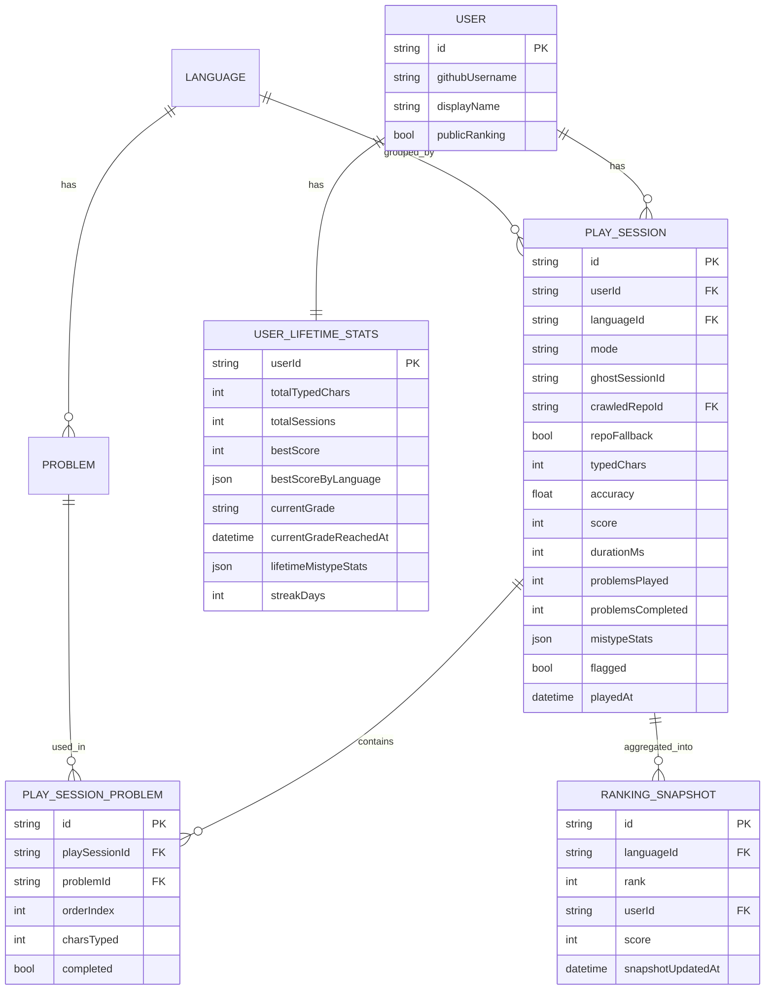
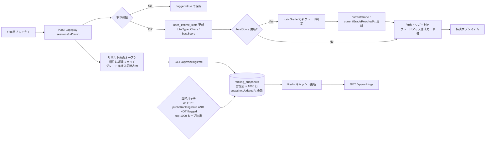

# スコア・ランキング

プレイ結果を保存し、言語 × 期間（日 / 週 / 月 / 全期間）の組み合わせでランキングを集計・表示するサブシステム。

このドキュメントは **仕様（What）** と **設計（How）** を分けて記述する：

- **仕様**：何が保存されてランキングされるか、どの軸でどう見えるか、リザルト画面の挙動
- **設計**：集計バッチの構成、Redis キャッシュ、不正対策の実装、引き運への評価

## 関連 spec

- [`../typing-engine/README.md`](../typing-engine/README.md) — プレイ結果の生成元、`/finish` API、`play_sessions` の詳細
- [`../problem-pool/README.md`](../problem-pool/README.md) — `crawledRepoId` で繋がる問題プール
- [`../github-auth/README.md`](../github-auth/README.md) — `publicRanking` 設定の管理元

## 目次

- [仕様](#仕様)
  - [スコア保存対象](#スコア保存対象)
  - [ランキング軸](#ランキング軸)
  - [1000 位までのみ集計（圏外は順位非表示）](#1000-位までのみ集計圏外は順位非表示)
  - [エンジニアグレード](#エンジニアグレード)
  - [リザルト画面に表示する順位とグレード](#リザルト画面に表示する順位とグレード)
  - [プライバシー（`publicRanking`）](#プライバシーpublicranking)
- [設計](#設計)
  - [集計バッチとキャッシュ](#集計バッチとキャッシュ)
  - [同点時の順位決定ロジック](#同点時の順位決定ロジック)
  - [グレード判定の実装](#グレード判定の実装)
  - [圏外ユーザーの API レスポンス](#圏外ユーザーの-api-レスポンス)
  - [引き運の評価](#引き運の評価)
  - [不正対策（基本のみ）](#不正対策基本のみ)
  - [集計バッチの負荷対策](#集計バッチの負荷対策)
  - [タイムゾーン](#タイムゾーン)
- [必要な画面](#必要な画面)
- [必要な API](#必要な-api)
- [必要な DB 設計](#必要な-db-設計)
- [フロー図](#フロー図)

---

## 仕様

### スコア保存対象

- **120 秒を消化した認証済みプレイのみ DB に保存**（タブ離脱等で中断したセッション、およびゲストプレイは DB に保存しない / [`../typing-engine/README.md`](../typing-engine/README.md) 参照）。
- ゲストプレイは端末 IndexedDB に **リザルト画面表示中だけ一時バッファ** として保持し、ユーザーが「ログインして記録を残す」を選ぶとサーバーへ送ってアカウントに紐付ける。**ログイン拒否や画面離脱時は即時削除** されるため、後日マージするロジックは不要。
- 問題プールは週次 cron で構築される単一のソースから供給されるため、**保存されたプレイはすべてランキング対象** となる（[`../problem-pool/README.md`](../problem-pool/README.md)）。
- 通常モード / 神々に挑戦モード ともにランキング対象。
- 不正検知フラグ（`flagged`）が立ったプレイはランキングから除外。

### ランキング軸

- 言語：TypeScript / JavaScript
- 期間：**全期間（オールタイム）のみ**
- 表示：**トップ 10** + 自分の順位（1000 位以内の場合）
- 1 プレイヤーにつきベストスコア 1 件をランキング対象にする（同じプレイヤーが上位を埋めるのを防ぐ）。

> **MVP では日間 / 週間 / 月間ランキングは持たない**。エンジニア向けプロダクトという性質上、毎日プレイする層が薄く、また「1 位 → 4 位」のような短時間での順位変動が体験を損なうため、全期間 1 軸に集約する。月間以下の集計は将来の運用データを見て追加検討する。

### 1000 位までのみ集計（圏外は順位非表示）

- 全期間ランキングは **言語別 × トップ 1000 位** のみを `ranking_snapshots` に保存する。
- 1000 位以下のユーザーは **順位を計算しない**（"圏外" 扱い）。
- 1000 位以下のユーザーには順位の代わりに **エンジニアグレード** とエンジニアらしい数値（次グレードまでの距離・累計打鍵数など）を表示する。
- これにより、保存データ量と集計コストの上限が固定化される。

### エンジニアグレード

**1 セッションのベストスコア** に応じて、エンジニアキャリア風のグレードをユーザーに付与する。圏外ユーザーにも誇示できる「絶対的な進歩の指標」として機能する。

| Lv | グレード名 | ベストスコア閾値 |
| --- | --- | --- |
| 1 | **Intern** | 0 〜 |
| 2 | **Junior Developer** | 100 〜 |
| 3 | **Mid Developer** | 250 〜 |
| 4 | **Senior Engineer** | 400 〜 |
| 5 | **Staff Engineer** | 600 〜 |
| 6 | **Principal Engineer** | 800 〜 |
| 7 | **Distinguished Engineer** | 1000 〜 |
| 8 | **Fellow** | 1200 〜 |

- 評価軸：**`user_lifetime_stats.bestScore`**（全言語通算のベストスコア）。
- 「累計打鍵数」は別軸の評価指標として[`../rewards/README.md`](../rewards/README.md) の特典（達成カード）で扱う。グレードと累計は **別の褒め方** をする。
- 言語ごとのベストスコアは `bestScoreByLanguage(jsonb)` に保存済み。グレードは **その最大値** で判定する。
- **降格はない**：ベストスコアは更新時のみ上書き、グレードも一度上がったら下がらない。
- 正式な閾値は MVP 直前にデータを見て調整する（理想分布は Lv 4〜5 が大多数）。

### リザルト画面に表示する順位とグレード

- リアルタイム集計は行わない。プレイ直後のリザルト画面では **直近の集計バッチで決まった順位** を表示する。
- ユーザーには「集計時刻 XX:XX 時点の順位」と **`snapshotUpdatedAt` を併記** し、リアルタイムではないことを明示する。
- 1000 位以内なら順位を、圏外なら **「圏外（順位は 1000 位以内のプレイヤーのみ表示）」+ グレード進捗** を表示する。
- グレードは **即時反映**（DB 直読み、バッチ依存しない）：「現在 Senior Engineer。次の Staff Engineer まであと XXX 点」のように進捗バー付きで表示する。
- ベストスコア更新時 / グレードアップ時 は祝賀演出を入れる。グレードアップ時は[`../rewards/README.md`](../rewards/README.md) の達成カード PNG が自動生成される。
- リザルト画面は **即座に開く**。順位はバックグラウンドでフェッチして遅延描画してよい。
- `/finish` レスポンスに **`topTenBoundaryScore`**（直近 snapshot の言語別 10 位スコア）を含める。クライアントは `myScore > topTenBoundaryScore` のとき、即時 **Hall of Fame コメント入力モーダル** を開く（詳細は [`../rewards/README.md` 「Hall of Fame コメントの入力タイミング」](../rewards/README.md#hall-of-fame-コメントの入力タイミング)）。

### プライバシー（`publicRanking`）

- `User.publicRanking` 設定（[`../github-auth/README.md` 「表示名とプライバシー」](../github-auth/README.md#表示名とプライバシー)）が `false` のユーザーは **ランキング集計対象から完全除外**。
順位そ- のものが計算されず、トップ 10・自分の現在順位（`/api/rankings/me`）・Hall of Fame など、いかなる場面でも表示されない。
- プレイ結果は DB に保存されるが、ユーザーが将来 `publicRanking=true` に切り替えれば次の集計バッチから反映される。

---

## 設計

### 集計バッチとキャッシュ

- 毎リクエスト集計せず、**毎時バッチ** で集計結果テーブル（`ranking_snapshots`）を更新（期間切替時の特別バッチは全期間ランキングだけなので不要）。
- 集計結果は **Redis にキャッシュ** し、`GET /api/rankings` / `/api/rankings/me` は Redis から返す。
- バッチ完了時に該当キーを失効させて、新しい順位を即時反映。
- 集計クエリは **`WHERE publicRanking=true AND NOT flagged`** をベースに、ユーザーごとの `MAX(score)` で上位 1000 名を抽出（top-k ヒープ実装で O(N log 1000)）。

### 同点時の順位決定ロジック

`score` 同点の場合：

1. `accuracy` 降順
2. それでも同点なら `playedAt` 昇順（先に達成した方が上位）

`durationMs` は 120 秒固定のため tie-break には使わない。

### グレード判定の実装

```ts
const GRADES = [
  { level: 1, slug: "intern",        name: "Intern",                 scoreThreshold: 0    },
  { level: 2, slug: "junior",        name: "Junior Developer",       scoreThreshold: 100  },
  { level: 3, slug: "mid",           name: "Mid Developer",          scoreThreshold: 250  },
  { level: 4, slug: "senior",        name: "Senior Engineer",        scoreThreshold: 400  },
  { level: 5, slug: "staff",         name: "Staff Engineer",         scoreThreshold: 600  },
  { level: 6, slug: "principal",     name: "Principal Engineer",     scoreThreshold: 800  },
  { level: 7, slug: "distinguished", name: "Distinguished Engineer", scoreThreshold: 1000 },
  { level: 8, slug: "fellow",        name: "Fellow",                 scoreThreshold: 1200 },
] as const

const calcGrade = (bestScore: number) =>
  [...GRADES].reverse().find(g => bestScore >= g.scoreThreshold) ?? GRADES[0]
```

判定タイミング：

- `/finish` 完了時、サーバー側で `newScore` を計算した直後
- `bestScore = MAX(currentBestScore, newScore)` を更新
- `bestScore` が更新された場合のみ `calcGrade(bestScore)` を呼び、結果を `user_lifetime_stats.currentGrade` と `currentGradeReachedAt` に保存
- グレードが上がった場合、レスポンスに `gradeUp: { from, to }` を含めてクライアントで祝賀演出をトリガー
- 同時に [`../rewards/README.md`](../rewards/README.md) の **達成カード PNG 自動生成** をキック

定数として持つ理由（マスタテーブルではなく）：

- 閾値の変更は MVP 直前のチューニング後はほぼ発生しない
- DB マスタにすると JOIN コストが発生し、API レスポンス毎の取得が必要になる
- 8 件しかないので enum / 定数で十分

### 圏外ユーザーの API レスポンス

`GET /api/rankings/me` のレスポンスは以下のいずれか：

```ts
// 1000 位以内
{
  status: "ranked",
  rank: 87,
  bestScore: 543,
  grade: { level: 4, slug: "senior", name: "Senior Engineer" },
  nextGrade: { level: 5, slug: "staff", name: "Staff Engineer", scoreNeeded: 57 },
  snapshotUpdatedAt: "2026-06-03T15:00:00+09:00"
}

// 圏外（1000 位以下）
{
  status: "out_of_top_1000",
  rank: null,
  bestScore: 213,
  grade: { level: 2, slug: "junior", name: "Junior Developer" },
  nextGrade: { level: 3, slug: "mid", name: "Mid Developer", scoreNeeded: 37 },
  snapshotUpdatedAt: "2026-06-03T15:00:00+09:00"
}
```

圏外ユーザーには **グレード進捗（`scoreNeeded`）と累計打鍵数** を見せて、順位がない不快感を別の達成感で埋める。

### 引き運の評価

- スコア＝「時間あたりの打鍵文字数」のため、**引いた関数の長短はスコアに影響しない**（120 秒の時間軸で吸収される）。
- 「神々に挑戦」モードでは出題シーケンスが固定されるため、1:1 比較でも公平（[`../ghost-battle/README.md`](../ghost-battle/README.md)）。
- 引き運に関する追加補正（出題長さ帯マッチング・同一関数別軸ランキング等）は **不要**。

### 不正対策（基本のみ）

詳細・厳密対策は [`../typing-engine/README.md` 「不正対策（基本のみ）」](../typing-engine/README.md#不正対策基本のみ) および [`../typing-engine/deferred-competitive-integrity.md`](../typing-engine/deferred-competitive-integrity.md)。

ランキング集計時には：

- `flagged=true` のセッションは `WHERE NOT flagged` で集計から除外
- スコアの再計算検証は `/finish` 時に typing-engine 側で実施済み

### 集計バッチの負荷対策

- 全期間ランキングは累積件数次第で重くなる。`languageId` ごとに分割集計し、top-1000 ヒープ実装で O(N log 1000) に抑える。
- インデックス：`play_sessions(languageId, score)`（top-k 抽出用）+ `play_sessions(userId, languageId, score DESC)`（ユーザーごとのベスト 1 件抽出用）。
- `ranking_snapshots` 行数は **(言語数 × 1000) で固定**、スケールしない。

### タイムゾーン

- 期間境界はすべて **JST（Asia/Tokyo）** 基準。
- DB は UTC で保存、集計時に JST に変換して日付境界を決める。
- `playedAt` も UTC 保存・表示時に変換。

---

## 必要な画面

| 画面 | 概要 |
| --- | --- |
| ランキングトップ | 言語 × 期間のタブ切替、トップ 10 + 自分の順位 |
| プレイヤー詳細 | 表示名・累計スコア・獲得特典・代表的なベストプレイ一覧（リプレイへ） |
| リザルト画面（再掲） | 今回のスコアと現在の順位（暫定） |

## 必要な API

| メソッド | パス | 説明 |
| --- | --- | --- |
| POST | `/api/play-sessions/solo` / `/api/play-sessions/challenge-gods` | プレイ開始（[`../typing-engine/README.md`](../typing-engine/README.md) 参照、モード別にエンドポイント分割） |
| POST | `/api/play-sessions/:id/finish` | 120 秒終了時のプレイ結果保存。順位はレスポンスに含めないが、**`topTenBoundaryScore`** (直近 snapshot の 10 位スコア) を含めて返す。クライアントがトップ 10 入りモーダルを判定するため |
| GET | `/api/rankings` | `language` を指定して全期間トップ 10 + `snapshotUpdatedAt` を取得 |
| GET | `/api/rankings/me` | 自分の現在順位（1000 位以内なら順位、圏外なら `status="out_of_top_1000"`）+ ベストスコア + 現在のグレード + 次のグレードまでの進捗 + `snapshotUpdatedAt`。詳細は[圏外ユーザーの API レスポンス](#圏外ユーザーの-api-レスポンス) |
| GET | `/api/players/:userId` | プレイヤー詳細・グレード・ベストスコア・累計打鍵数・代表プレイ |

## 必要な DB 設計

| テーブル | 主要カラム | 説明 |
| --- | --- | --- |
| `play_sessions` | `id`, `userId(nullable)`, `languageId`, `mode(solo/challenge_gods)`, `ghostSessionId(nullable)`, `crawledRepoId(FK)`, `repoFallback(bool)`, `typedChars`, `accuracy`, `score`, `durationMs(=120000)`, `problemsPlayed`, `problemsCompleted`, `mistypeStats(jsonb)`, `flagged(bool)`, `playedAt` | プレイ結果 1 件（120 秒固定セッション）。`crawledRepoId` はそのセッションの主 repo（[`../typing-engine/README.md` 「出題内容」](../typing-engine/README.md#出題内容問題プールから受け取るもの) 参照）。`repoFallback=true` は 20 問足切りで他 repo から補填されたセッション。`mistypeStats` は文字別誤打鍵カウント |
| `play_session_problems` | `id`, `playSessionId`, `problemId`, `orderIndex`, `charsTyped`, `completed(bool)` | セッション中に出題された問題のシーケンス |
| `ranking_snapshots` | `id`, `languageId`, `rank(1〜1000)`, `userId`, `playSessionId`, `score`, `snapshotUpdatedAt` | 集計済みランキング（毎時バッチで再生成、全期間のみ、トップ 1000）。`snapshotUpdatedAt` はバッチ完了時刻 |
| `user_lifetime_stats` | `userId(PK)`, `totalTypedChars`, `totalSessions`, `bestScore`, `bestScoreByLanguage(jsonb)`, `currentGrade(string)`, `currentGradeReachedAt(datetime)`, `lifetimeMistypeStats(jsonb)`, `streakDays`, `lastPlayedDate`, `updatedAt` | 特典・グレード判定に使う累計値。`bestScore` は全言語通算のベストスコア（グレード判定の基準）。`currentGrade` は slug（`intern` / `junior` / ...）。`lifetimeMistypeStats` は文字別誤打鍵の累計（マイページ「生涯ニガテ文字」用） |



## フロー図


