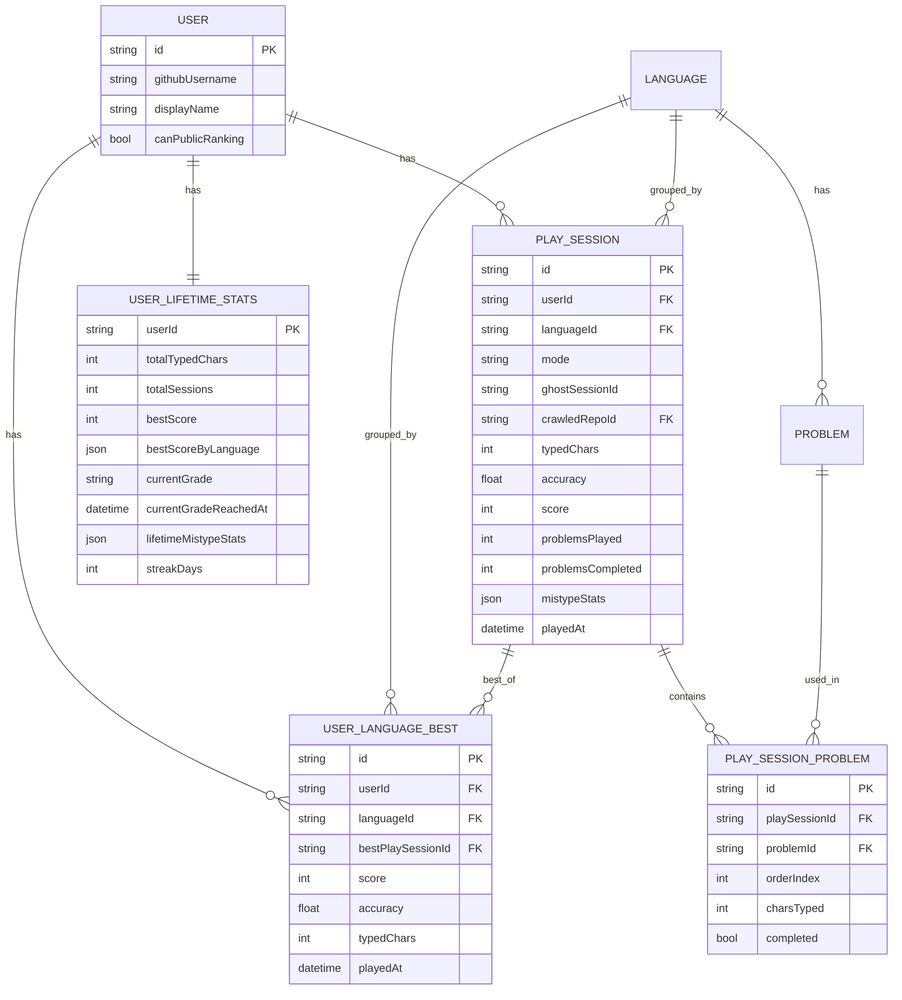

# スコア・ランキング

プレイ結果を保存し、言語別の全期間ランキングを **リアルタイム集計** で表示するサブシステム。

このドキュメントは **仕様（What）** と **設計（How）** を分けて記述する：

- **仕様**：何が保存されてランキングされるか、どの軸でどう見えるか、リザルト画面の挙動
- **設計**：`user_language_best` を使ったリアルタイム集計、インデックス設計、グレード判定の実装、不正対策

## 関連 spec

- [`../typing-engine/README.md`](../typing-engine/README.md) — プレイ結果の生成元、`/finish` API、`play_sessions` の詳細
- [`../problem-pool/README.md`](../problem-pool/README.md) — `crawledRepoId` で繋がる問題プール
- [`../github-auth/README.md`](../github-auth/README.md) — `publicRanking` 設定の管理元

## 目次

- [仕様](#仕様)
  - [スコア保存対象](#スコア保存対象)
  - [ランキング軸](#ランキング軸)
  - [リアルタイム集計（バッチ不要）](#リアルタイム集計バッチ不要)
  - [エンジニアグレード](#エンジニアグレード)
  - [リザルト画面に表示する順位とグレード](#リザルト画面に表示する順位とグレード)
  - [プライバシー（`publicRanking`）](#プライバシーpublicranking)
- [設計](#設計)
  - [`user_language_best` テーブル](#user_language_best-テーブル)
  - [同点時の順位決定ロジック](#同点時の順位決定ロジック)
  - [順位算出 SQL](#順位算出-sql)
  - [グレード判定の実装](#グレード判定の実装)
  - [自分の順位 API レスポンス](#自分の順位-api-レスポンス)
  - [引き運の評価](#引き運の評価)
  - [不正対策（基本のみ）](#不正対策基本のみ)
  - [スケール時の対応](#スケール時の対応)
  - [タイムゾーン](#タイムゾーン)
- [必要な画面](#必要な画面)
- [必要な API](#必要な-api)
- [必要な DB 設計](#必要な-db-設計)
- [フロー図](#フロー図)

---

## 仕様

### スコア保存対象

- **120 秒を消化した認証済みプレイのみ DB に保存**（タブ離脱等で中断したセッション、およびゲストプレイは DB に保存しない / [`../typing-engine/README.md`](../typing-engine/README.md) 参照）。
- ゲストプレイは端末 IndexedDB に **リザルト画面表示中だけ一時バッファ** として保持し、ユーザーが「ログインして記録を残す」を選ぶとサーバーへ送ってアカウントに紐付ける。**ログイン拒否や画面離脱時は即時削除** されるため、後日マージするロジックは不要。
- 問題プールは週次 cron で構築される単一のソースから供給されるため、**保存されたプレイはすべてランキング対象** となる（[`../problem-pool/README.md`](../problem-pool/README.md)）。
- 通常モード / 神々に挑戦モード ともにランキング対象。
- 不正検知フラグ（`flagged`）が立ったプレイはランキングから除外（MVP では `flagged` カラム未追加、将来追加時にクエリ条件を有効化）。

### ランキング軸

- 言語：TypeScript / JavaScript
- 期間：**全期間（オールタイム）のみ**
- 表示：**トップ 10** + 自分の順位（言語別に常に表示）
- 1 プレイヤーにつき **言語ごとに** ベストスコア 1 件をランキング対象にする（同じプレイヤーが上位を埋めるのを防ぐ）。

> **MVP では日間 / 週間 / 月間ランキングは持たない**。エンジニア向けプロダクトという性質上、毎日プレイする層が薄く、また「1 位 → 4 位」のような短時間での順位変動が体験を損なうため、全期間 1 軸に集約する。月間以下の集計は将来の運用データを見て追加検討する。

### リアルタイム集計（バッチ不要）

- ランキングは **集計バッチを使わず、API リクエスト時に `ORDER BY score DESC LIMIT 10` で都度算出する**。
- 全プレイヤーの言語別ベストを `user_language_best` テーブル（1 ユーザー × 1 言語 = 1 行）に保存し、`/finish` でベスト更新時のみ upsert する。
- ランキングは「現在の最新状態」が返るため、プレイ直後に順位が反映される（バッチ待ちの遅延なし）。
- **「圏外」概念は廃止**。MVP 規模では全プレイヤーに具体的な順位を返せるため、`out_of_top_1000` のような状態は持たない。1000 位以下のプレイヤーには順位（例: #4523）を表示する。
- **`@@index([languageId, score(sort: Desc)])`** 1 本で TOP N 取得 / 自分の順位算出 / 言語ランカー数カウント のすべてが軽量に動く（MVP 規模で十分）。

> **将来規模が大きくなって ORDER BY が重くなった場合は、`user_language_best` を source として cron バッチで TOP 1000 を別テーブル（`ranking_snapshots`）に切り出す移行が可能**。API のレスポンス形は維持できるので、画面側コードへの影響は最小。

### エンジニアグレード

**1 セッションのベストスコア** に応じて、エンジニアキャリア風のグレードをユーザーに付与する。順位とは別の「絶対的な進歩の指標」として機能する。

| Lv | グレード名 | ベストスコア閾値 |
| --- | --- | --- |
| 1 | **Intern** | 0 〜 |
| 2 | **Junior Developer** | 100 〜 |
| 3 | **Mid Developer** | 250 〜 |
| 4 | **Senior Engineer** | 400 〜 |
| 5 | **Staff Engineer** | 600 〜 |
| 6 | **Principal Engineer** | 800 〜 |
| 7 | **Distinguished Engineer** | 1000 〜 |
| 8 | **Fellow** | 1200 〜 |

- 評価軸：**`user_lifetime_stats.bestScore`**（全言語通算のベストスコア）。
- 「累計打鍵数」は別軸の評価指標として[`../rewards/README.md`](../rewards/README.md) の特典（達成カード）で扱う。グレードと累計は **別の褒め方** をする。
- 言語ごとのベストスコアは `user_language_best` テーブルから取得。グレードは **全言語通算ベストの最大値** で判定する。
- **降格はない**：ベストスコアは更新時のみ上書き、グレードも一度上がったら下がらない。
- 正式な閾値は MVP 直前にデータを見て調整する（理想分布は Lv 4〜5 が大多数）。

### リザルト画面に表示する順位とグレード

- `/finish` のレスポンスには **`new_rank`**（リアルタイム計算した新順位）/ **`top_ten_boundary_score`**（直近の言語別 10 位スコア）/ **`grade_up`**（グレードアップ情報）/ **`best_score_updated`**（ベスト更新フラグ）を含める。
- ランキングは **リアルタイム集計** なので「snapshot N 分前」表示は無く、「現在の順位」として表示する。
- グレードは **即時反映**（DB 直読み、バッチ依存しない）：「現在 Senior Engineer。次の Staff Engineer まであと XXX 点」のように進捗バー付きで表示する。
- ベストスコア更新時 / グレードアップ時 は祝賀演出を入れる。グレードアップ時は[`../rewards/README.md`](../rewards/README.md) の達成カード PNG が自動生成される。
- リザルト画面は **即座に開く**。順位は `/finish` レスポンスから取得済みなのでサイドロード不要だが、グレード進捗バー描画用に `GET /api/rankings/me` を並列で叩いて補完する。
- `myScore > topTenBoundaryScore` のとき、クライアントは即時 **Hall of Fame コメント入力モーダル** を開く（詳細は [`../rewards/README.md` 「Hall of Fame コメントの入力タイミング」](../rewards/README.md#hall-of-fame-コメントの入力タイミング)）。

### プライバシー（`publicRanking`）

- `User.canPublicRanking` 設定（[`../github-auth/README.md` 「表示名とプライバシー」](../github-auth/README.md#表示名とプライバシー)）が `false` のユーザーは **ランキング集計対象から除外**。
- `GET /api/rankings` の TOP 10 / `total_ranked_players` の COUNT には含まれない。
- **ただし自分自身は自分の順位を見れる**（`GET /api/rankings/me` は呼び出し元の `canPublicRanking` を無視して順位を返す）。
- プレイ結果と `user_language_best` のベストは DB に保存される（ユーザーが将来 `canPublicRanking=true` に切り替えれば即時公開される）。

---

## 設計

### `user_language_best` テーブル

ランキング集計の source となる「1 ユーザー × 1 言語 = ベスト 1 件」のテーブル。

- `/finish` 完了時に upsert（新スコアが既存ベストより高ければ更新、低ければ書き換えない）
- `rank` カラムは持たない（リアルタイム集計するため、保存しても他人のベスト更新で stale 化する）
- `score` / `accuracy` / `playedAt` を非正規化保存して tie-break と表示を 1 クエリで完結
- `bestPlaySessionId` でベストを達成した `PlaySession` への参照を保持（リプレイ動線 / プレイヤー詳細ページで利用）

詳細スキーマは [`step1-db-user-language-best.md`](step1-db-user-language-best.md) を参照。

### 同点時の順位決定ロジック

`score` 同点の場合：

1. `accuracy` 降順
2. それでも同点なら `playedAt` 昇順（先に達成した方が上位）

`durationMs` は 120 秒固定のため tie-break には使わない。

リアルタイム集計クエリ（`ORDER BY score DESC, accuracy DESC, playedAt ASC`）と整合する。

### 順位算出 SQL

#### TOP N（`GET /api/rankings`）

```sql
SELECT ulb.*, u.display_name, u.avatar_url, uls.current_grade
FROM user_language_best ulb
INNER JOIN users u ON u.id = ulb.user_id
LEFT JOIN user_lifetime_stats uls ON uls.user_id = ulb.user_id
WHERE ulb.language_id = $1
  AND u.can_public_ranking = true
ORDER BY ulb.score DESC, ulb.accuracy DESC, ulb.played_at ASC
LIMIT $2
```

`@@index([languageId, score(sort: Desc)])` で index scan + LIMIT。

#### 自分の順位（`GET /api/rankings/me`）

```sql
SELECT COUNT(*) + 1 AS rank
FROM user_language_best ulb
INNER JOIN users u ON u.id = ulb.user_id
WHERE ulb.language_id = $1
  AND u.can_public_ranking = true
  AND (
    ulb.score > $2  -- 自分のスコア
    OR (ulb.score = $2 AND ulb.accuracy > $3)  -- 自分の accuracy
    OR (ulb.score = $2 AND ulb.accuracy = $3 AND ulb.played_at < $4)  -- 自分の playedAt
  )
```

「自分より上位の数」+ 1 で順位算出。同一 index で COUNT が走るので軽量。

#### 言語別ランカー総数

```sql
SELECT COUNT(*) FROM user_language_best ulb
INNER JOIN users u ON u.id = ulb.user_id
WHERE ulb.language_id = $1 AND u.can_public_ranking = true
```

`user_language_best` は 1 ユーザー × 1 言語 = 1 行のため、`COUNT(*)` がそのままユニーク player 数。

### グレード判定の実装

```ts
const GRADES = [
  { level: 1, slug: "intern",        name: "Intern",                 scoreThreshold: 0    },
  { level: 2, slug: "junior",        name: "Junior Developer",       scoreThreshold: 100  },
  { level: 3, slug: "mid",           name: "Mid Developer",          scoreThreshold: 250  },
  { level: 4, slug: "senior",        name: "Senior Engineer",        scoreThreshold: 400  },
  { level: 5, slug: "staff",         name: "Staff Engineer",         scoreThreshold: 600  },
  { level: 6, slug: "principal",     name: "Principal Engineer",     scoreThreshold: 800  },
  { level: 7, slug: "distinguished", name: "Distinguished Engineer", scoreThreshold: 1000 },
  { level: 8, slug: "fellow",        name: "Fellow",                 scoreThreshold: 1200 },
] as const

const calcGrade = (bestScore: number) =>
  [...GRADES].reverse().find(g => bestScore >= g.scoreThreshold) ?? GRADES[0]
```

判定タイミング：

- `/finish` 完了時、サーバー側で `newScore` を計算した直後
- `bestScore = MAX(currentBestScore, newScore)` を更新
- `bestScore` が更新された場合のみ `calcGrade(bestScore)` を呼び、結果を `user_lifetime_stats.currentGrade` と `currentGradeReachedAt` に保存
- グレードが上がった場合、レスポンスに `grade_up: { from, to }` を含めてクライアントで祝賀演出をトリガー
- 同時に [`../rewards/README.md`](../rewards/README.md) の **達成カード PNG 自動生成** をキック

定数として持つ理由（マスタテーブルではなく）：

- 閾値の変更は MVP 直前のチューニング後はほぼ発生しない
- DB マスタにすると JOIN コストが発生し、API レスポンス毎の取得が必要になる
- 8 件しかないので enum / 定数で十分

### 自分の順位 API レスポンス

`GET /api/rankings/me` のレスポンス：

```ts
{
  language: "typescript",
  rank: 87,                       // 言語別順位（ベスト未保存なら null）
  best_score: 543,                // この言語でのベスト（未保存なら null）
  best_accuracy: 0.97,
  best_play_session_id: 8123,
  best_played_at: "2026-06-03T05:43:21.000Z",
  total_ranked_players: 53871,    // この言語の全ランカー数（canPublicRanking=true）
  grade: { level: 4, slug: "senior", name: "Senior Engineer" },
  next_grade: { level: 5, slug: "staff", name: "Staff Engineer", score_needed: 57 }
}
```

ベスト未保存ユーザーは `rank: null`、`best_*: null` を返す。グレードは `user_lifetime_stats.bestScore`（全言語通算）が 0 なら Intern を返す。

### 引き運の評価

- スコア＝「時間あたりの打鍵文字数」のため、**引いた関数の長短はスコアに影響しない**（120 秒の時間軸で吸収される）。
- 「神々に挑戦」モードでは出題シーケンスが固定されるため、1:1 比較でも公平（[`../ghost-battle/README.md`](../ghost-battle/README.md)）。
- 引き運に関する追加補正（出題長さ帯マッチング・同一関数別軸ランキング等）は **不要**。

### 不正対策（基本のみ）

詳細・厳密対策は [`../typing-engine/README.md` 「不正対策（基本のみ）」](../typing-engine/README.md#不正対策基本のみ) および [`../typing-engine/deferred-competitive-integrity.md`](../typing-engine/deferred-competitive-integrity.md)。

ランキング集計時には：

- `flagged=true` のセッションは `WHERE NOT flagged` で集計から除外（MVP では `flagged` カラム未追加、将来追加時に有効化）
- スコアの再計算検証は `/finish` 時に typing-engine 側で実施済み

### スケール時の対応

リアルタイム集計の前提：

- `user_language_best` 行数 = 言語数 × ユニークプレイヤー数
- MVP 規模では言語別 < 100k 行、`@@index([languageId, score(sort: Desc)])` の index scan + LIMIT で軽量

スケール時の対応（**MVP では未実装**）：

1. **キャッシュレイヤー**: `GET /api/rankings` のレスポンスを Redis に TTL 60 秒で乗せる。`/finish` 完了時に該当 key を失効
2. **集計バッチへの移行**: `user_language_best` を source として毎時 cron で TOP 1000 を別テーブル（`ranking_snapshots`）に切り出す。API は `ranking_snapshots` から読むよう切替、レスポンス形は維持
3. **インデックス追加**: `WHERE u.can_public_ranking = true` フィルタが効くよう partial index を作成

どれも API のレスポンス形を変えずに実装できるため、画面側コードへの影響は最小。

### タイムゾーン

- DB は UTC で保存、表示時に JST（Asia/Tokyo）に変換。
- `playedAt` は UTC 保存（tie-break で利用、UTC 比較は安全）。
- 期間別ランキング（日 / 週 / 月）が将来追加された場合は JST 基準で日付境界を決める。

---

## 必要な画面

| 画面 | 概要 |
| --- | --- |
| ランキングトップ | 言語タブ（TS / JS）切替、TOP 10 + 自分の順位 |
| プレイヤー詳細 | 表示名・グレード・言語別ベスト・累計打鍵数・代表プレイ |
| リザルト画面（再掲） | 今回のスコアと現在の順位（リアルタイム） |

## 必要な API

| メソッド | パス | 説明 |
| --- | --- | --- |
| POST | `/api/play-sessions/solo` / `/api/play-sessions/challenge-gods` | プレイ開始（[`../typing-engine/README.md`](../typing-engine/README.md) 参照） |
| POST | `/api/play-sessions/:id/finish` | 120 秒終了時のプレイ結果保存。`user_language_best` を upsert し、レスポンスに `new_rank` / `top_ten_boundary_score` / `grade_up` / `best_score_updated` を含めて返す |
| GET | `/api/rankings` | `language` を指定して全期間トップ 10 + `total_ranked_players` を取得（リアルタイム集計） |
| GET | `/api/rankings/me` | 自分の現在順位 + ベストスコア + 現在のグレード + 次のグレードまでの進捗。詳細は[自分の順位 API レスポンス](#自分の順位-api-レスポンス) |
| GET | `/api/players/:userId` | プレイヤー詳細・グレード・ベストスコア・累計打鍵数・言語別ベスト |

## 必要な DB 設計

| テーブル | 主要カラム | 説明 |
| --- | --- | --- |
| `play_sessions` | `id`, `userId`, `languageId`, `mode(solo/challenge_gods)`, `ghostSessionId(nullable)`, `crawledRepoId(FK)`, `typedChars`, `accuracy`, `score`, `problemsPlayed`, `problemsCompleted`, `mistypeStats(jsonb)`, `playedAt` | プレイ結果 1 件（120 秒固定セッション、既存）。`flagged` カラムは将来追加 |
| `play_session_problems` | `id`, `playSessionId`, `problemId`, `orderIndex`, `charsTyped`, `completed(bool)` | セッション中に出題された問題のシーケンス（既存） |
| `user_language_best` | `id`, `userId`, `languageId`, `bestPlaySessionId(FK)`, `score`, `accuracy`, `typedChars`, `playedAt` | **本機能で新規追加**。1 ユーザー × 1 言語 = ベスト 1 件。`/finish` で upsert、`GET /api/rankings` / `/me` がリアルタイムで ORDER BY して順位算出 |
| `user_lifetime_stats` | `userId(PK)`, `totalTypedChars`, `totalSessions`, `bestScore`, `bestScoreByLanguage(jsonb)`, `currentGrade(string)`, `currentGradeReachedAt(datetime)`, `lifetimeMistypeStats(jsonb)`, `streakDays`, `lastPlayedDate`, `updatedAt` | 特典・グレード判定に使う累計値。`bestScore` は全言語通算のベストスコア（グレード判定の基準）。`currentGrade` は slug（`intern` / `junior` / ...）。**本機能で `currentGrade` / `currentGradeReachedAt` の書き込みを `/finish` から開始** |



## フロー図

```mermaid
flowchart LR
    Play[120 秒プレイ完了] --> Save[POST /api/play-sessions/:id/finish]
    Save --> CheckFlag{不正検知<br/>※ MVP 未実装}
    CheckFlag -->|NG| Flagged[flagged=true で保存<br/>※ 将来カラム追加]
    CheckFlag -->|OK| Stats[user_lifetime_stats 更新<br/>totalTypedChars / bestScore]
    Stats --> CheckBest{bestScore 更新?}
    CheckBest -->|Yes| CalcGrade[calcGrade で新グレード判定]
    CalcGrade --> SaveGrade[currentGrade / currentGradeReachedAt 更新]
    SaveGrade --> Reward[特典トリガー判定<br/>グレードアップ達成カード等]
    CheckBest -->|No| Reward

    Save --> UpsertBest[user_language_best を upsert<br/>※ 新スコアが既存ベストより高ければのみ]
    UpsertBest --> NewRank[新ランクを COUNT で即時算出]
    NewRank --> Boundary[10 位ボーダースコアを取得]
    Boundary --> Resp[/finish レスポンス組み立て<br/>new_rank / grade_up /<br/>top_ten_boundary_score]

    Resp --> Result[リザルト画面オープン<br/>順位・グレード進捗を即時表示]
    Result --> GetMe[GET /api/rankings/me<br/>でグレード詳細補完]

    Request[GET /api/rankings] --> Read[user_language_best を<br/>ORDER BY score DESC LIMIT 10<br/>でリアルタイム集計]
    Read --> Respond[レスポンス]

    Reward --> RewardSvc[特典サブシステム]
```
