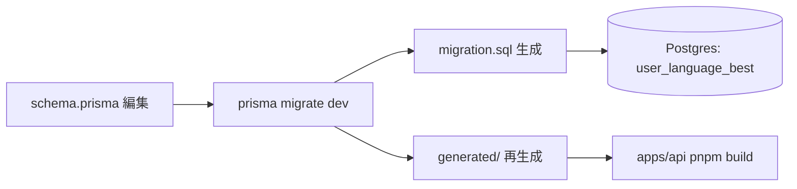

# step1: user_language_best テーブル追加

score-ranking 機能の永続化基盤として、**「ユーザー × 言語 = ベスト 1 件」** を保存する `user_language_best` テーブルを追加する。

設計判断：当初 `ranking_snapshots`（毎時バッチで TOP 1000 を全置換）を採用する案だったが、MVP の規模 (数万行) ならリアルタイム集計で十分速いと判断して、cron バッチを廃した。`user_language_best` は次の特性を持つ：

- 1 ユーザー × 1 言語 = 1 行（`@@unique([userId, languageId])` で強制）
- `/finish` でベスト更新時のみ upsert（step3）
- ランキング表示は API リクエスト時に `ORDER BY score DESC ... LIMIT 10` + `ROW_NUMBER()` で都度採番（step2）
- `rank` カラムは持たない（毎リクエスト動的計算）
- 1000 位制限も持たない（全プレイヤーのベストを保存、API で `LIMIT 10` する）
- cron 不要、Redis キャッシュ不要

将来規模が成長して ORDER BY が重くなったら、本テーブルを source として毎時バッチで TOP 1000 を別テーブルに切り出す移行は容易（テーブル名と API のレスポンス形が独立しているため）。

## 目次

- [対象テーブル](#対象テーブル)
- [スキーマ追加](#スキーマ追加)
  - [`packages/db/prisma/schema.prisma`（編集）](#packagesdbprismaschemaprisma編集)
  - [カラム設計](#カラム設計)
  - [インデックス設計](#インデックス設計)
- [マイグレーション](#マイグレーション)
- [処理フロー](#処理フロー)
  - [処理の流れ](#処理の流れ)
- [設計方針](#設計方針)
- [対応内容](#対応内容)
- [動作確認](#動作確認)
- [次の step での利用](#次の-step-での利用)

## 対象テーブル

| 項目 | 値 |
|---|---|
| テーブル名 | `user_language_best` |
| Prisma model | `UserLanguageBest` |
| 行数の見積もり | ユニーク player 数 × 言語数（MVP は数万 × 2 = 数万行程度） |
| 書き込み | step3 の `/finish` でベスト更新時のみ upsert |
| 読み出し | step2 の `GET /api/rankings` / `/api/rankings/me`、step3 の `/finish`（10 位ボーダースコア）、step4 の `GET /api/players/:userId`（プレイヤー詳細） |

## スキーマ追加

### `packages/db/prisma/schema.prisma`（編集）

`UserLifetimeStats` の直後に以下のモデルを追加する。

```prisma
// ユーザー × 言語ごとのベストプレイ（1 ユーザー × 1 言語 = 1 行）
// /finish でベスト更新時に upsert される。ランキング表示はこのテーブルを ORDER BY score で都度集計
// docs/spec/score-ranking/README.md 参照（MVP は cron バッチ不要のリアルタイム集計方式）
model UserLanguageBest {
  id                Int      @id @default(autoincrement())
  userId            Int      @map("user_id")
  languageId        Int      @map("language_id")
  bestPlaySessionId Int      @map("best_play_session_id") /// このベストを達成した PlaySession（リプレイ動線 / 詳細ページで参照）
  score             Int      /// PlaySession.score の非正規化保存
  accuracy          Float    /// 同点時の tie-break 用
  typedChars        Int      @map("typed_chars") /// UI 表示用（ランキング表に「文字数」列があるため）
  playedAt          DateTime @map("played_at") /// 同点 + 同 accuracy 時の tie-break 用（先に達成した方が上位）
  createdAt         DateTime @default(now()) @map("created_at")
  updatedAt         DateTime @updatedAt @map("updated_at")

  user        User        @relation(fields: [userId], references: [id], onDelete: Cascade)
  language    Language    @relation(fields: [languageId], references: [id], onDelete: Restrict)
  playSession PlaySession @relation(fields: [bestPlaySessionId], references: [id], onDelete: Restrict)

  @@unique([userId, languageId]) /// 1 ユーザー × 1 言語 = ベスト 1 件
  @@index([languageId, score(sort: Desc)]) /// GET /api/rankings の主クエリ (ORDER BY score DESC LIMIT)
  @@index([userId]) /// GET /api/players/:userId / GET /api/rankings/me の自分のベスト引き
  @@map("user_language_best")
}
```

### 既存モデルへの relation 追加

`User` / `Language` / `PlaySession` モデルに backref を追加：

```prisma
model User {
  // ... 既存フィールド
  languageBests UserLanguageBest[]
}

model Language {
  // ... 既存フィールド
  userLanguageBests UserLanguageBest[]
}

model PlaySession {
  // ... 既存フィールド
  bestOfUserLanguage UserLanguageBest[]
}
```

### カラム設計

| カラム | 型 | 役割 | 由来 |
|---|---|---|---|
| `id` | `Int @id @default(autoincrement())` | サロゲートキー | 既存テーブルと同じ |
| `userId` | `Int` | プレイヤー | `User.id` |
| `languageId` | `Int` | 言語別ベストの軸 | `Language.id` |
| `bestPlaySessionId` | `Int` | このベストを達成した PlaySession | `PlaySession.id`（リプレイ動線で参照） |
| `score` | `Int` | スコア | `PlaySession.score` の非正規化保存 |
| `accuracy` | `Float` | 正確率 | tie-break + ランキング表表示 |
| `typedChars` | `Int` | 累計打鍵数 | ランキング表に「文字数」列があるため snapshot しておく |
| `playedAt` | `DateTime` | プレイ時刻 | 同点 + 同 accuracy の tie-break |
| `createdAt` / `updatedAt` | `DateTime` | 監査用 | 既存テーブルと同じ |

### インデックス設計

| インデックス | 用途 |
|---|---|
| `@@unique([userId, languageId])` | 1 ユーザー＝ベスト 1 件の制約 + upsert の安定動作 |
| `@@index([languageId, score(sort: Desc)])` | `GET /api/rankings?language=...` の主クエリ（`ORDER BY score DESC LIMIT 10`）、`GET /api/rankings/me` の「自分より上のプレイヤー数」COUNT |
| `@@index([userId])` | プレイヤー詳細ページ（step4）で「このユーザーの全言語ベスト」を引く |

## マイグレーション

```bash
cd packages/db
pnpm prisma migrate dev --name add_user_language_best
```

生成される SQL の確認ポイント:

- `CREATE TABLE user_language_best` で 10 カラム
- `CREATE UNIQUE INDEX` が 1 本（`user_id, language_id`）
- `CREATE INDEX` が 2 本（`language_id, score DESC` / `user_id`）
- 外部キー 3 本（`users` / `languages` / `play_sessions`）

## 処理フロー



### 処理の流れ

1. `schema.prisma` に `UserLanguageBest` モデルを追加
2. `User` / `Language` / `PlaySession` に backref を追加
3. `pnpm prisma migrate dev --name add_user_language_best` でマイグレーション生成 + 適用
4. `packages/db/generated/` の型が再生成される（`UserLanguageBest` 型が利用可能になる）
5. `apps/api` の build が通ることを確認（既存 `StubRankingSnapshotRepository` は step2 で削除されるため本 step では未変更）

## 設計方針

- **`ranking_snapshots` を採用しない理由**: 当初は毎時バッチで TOP 1000 を全置換する `ranking_snapshots` 案を検討したが、MVP 規模では cron + Redis キャッシュ + 1000 位制限の複雑さが見合わない。リアルタイム集計（API リクエスト時に `ORDER BY score DESC LIMIT 10`）で十分速く、プレイ直後に順位が反映される体験の方が価値が高い
- **`rank` を保存しない理由**: rank を保存すると、誰かのベストが更新されるたびに「44 位〜87 位の全員の rank を +1 する」必要があり、書き込みコストが爆発する。`ORDER BY score DESC` + `ROW_NUMBER()` で都度算出すれば、`@@index([languageId, score(sort: Desc)])` 1 本で全クエリが O(log N + 10) で済む
- **`1000` 位制限を持たない理由**: 圏外プレイヤーのベストも保存しておくと、「自分は今何位か」をリアルタイム計算できる（`COUNT(*) WHERE score > 自分のベスト` + 1）。圏外 (`out_of_top_1000` ステータス) という README の概念は廃止し、全プレイヤーに具体的な順位を返す
- **`bestPlaySessionId` を保存する理由**: プレイヤー詳細ページ（step4）でリプレイ動線を作るときに「あなたの言語別ベストプレイ」を 1 click で開けるようにするため。`(userId, languageId, MAX(score))` から都度逆引きしようとすると、同 score+accuracy のプレイが複数あったときに非決定的になる
- **`typedChars` を非正規化する理由**: ランキング表に「文字数」列があるため、毎回 `play_sessions` を JOIN するのは無駄。`/finish` upsert 時に同じトランザクション内でコピーすれば整合性が崩れない
- **`accuracy` / `playedAt` を非正規化する理由**: tie-break のたびに `play_sessions` を JOIN すると `GET /api/rankings` のレイテンシが悪化する。upsert 時にコピーすれば read 側は単一テーブル参照で済む
- **`onDelete` の方針**: `User` 削除時は cascade（個人情報なので消す）。`Language` / `PlaySession` 削除時は restrict（プレイは履歴として残るのが正、ベスト記録が宙ぶらりんになるのを防ぐ）
- **既存 `StubRankingSnapshotRepository`（typing-engine `/challenge-gods` 用）は本 step では触らない**: step2 で `UserLanguageBest` を読む新 Repository に置き換えるので、step1 段階では `Stub`（常に空配列を返す）のままにしておく。typing-engine の挙動は変わらない

## 対応内容

### `packages/db/prisma/schema.prisma`（編集）

`User` モデルに backref を追加：

```prisma
model User {
  // ... 既存フィールド
  accounts          AuthAccount[]
  playSessions      PlaySession[]
  lifetimeStats     UserLifetimeStats?
  languageBests     UserLanguageBest[]
}
```

`Language` モデルに backref を追加：

```prisma
model Language {
  // ... 既存フィールド
  crawledRepos      CrawledRepo[]
  problems          Problem[]
  crawlerRunItems   CrawlerRunItem[]
  playSessions      PlaySession[]
  userLanguageBests UserLanguageBest[]
}
```

`PlaySession` モデルに backref を追加：

```prisma
model PlaySession {
  // ... 既存フィールド
  user                User                 @relation(fields: [userId], references: [id], onDelete: Cascade)
  language            Language             @relation(fields: [languageId], references: [id], onDelete: Restrict)
  crawledRepo         CrawledRepo          @relation(fields: [crawledRepoId], references: [id], onDelete: Restrict)
  ghostSession        PlaySession?         @relation("GhostReference", fields: [ghostSessionId], references: [id], onDelete: SetNull)
  ghostedBy           PlaySession[]        @relation("GhostReference")
  problems            PlaySessionProblem[]
  keystrokeLog        KeystrokeLog?
  bestOfUserLanguage  UserLanguageBest[]
}
```

`UserLifetimeStats` の直後に `UserLanguageBest` モデルを追加（「スキーマ追加」セクション参照、本セクションでは再掲しない）。

### マイグレーション生成

```bash
cd packages/db
pnpm prisma migrate dev --name add_user_language_best
```

生成された `packages/db/prisma/migrations/{timestamp}_add_user_language_best/migration.sql` を確認し、「マイグレーション」セクションの 4 点が満たされていることを目視する。

### 型再生成の確認

`packages/db/generated/index.d.ts` に `UserLanguageBest` 型と `Prisma.UserLanguageBestWhereInput` 等が生成されているか確認：

```bash
grep "UserLanguageBest" packages/db/generated/index.d.ts | head -5
```

## 動作確認

| 区分 | 内容 |
|---|---|
| マイグレーション適用 | `pnpm prisma migrate dev` がエラーなく完走、`migrations/` に新ディレクトリが追加される |
| Postgres 直接確認 | `docker exec typing-royale-postgres psql -U postgres -d project-template_dev -c "\d user_language_best"` で 10 カラム + 3 インデックスが表示される |
| Build | `pnpm build` がルートで通る（特に `apps/api` で `UserLanguageBest` 型が import できる） |
| Lint | `pnpm lint` がルートで緑 |
| `StubRankingSnapshotRepository` 互換性 | 既存の `apps/api/src/repository/prisma/ranking-snapshot-repository.ts` の Stub は本 step では未変更（step2 で `UserLanguageBest` を読む実装に置き換え予定） |

### 確認 SQL

```sql
-- テーブル定義
\d user_language_best

-- インデックス確認
SELECT indexname, indexdef FROM pg_indexes WHERE tablename = 'user_language_best';

-- 外部キー確認
SELECT conname, pg_get_constraintdef(oid) FROM pg_constraint
WHERE conrelid = 'user_language_best'::regclass AND contype = 'f';
```

期待される結果：

- `user_language_best_pkey`（`id`）
- `user_language_best_user_id_language_id_key`（unique）
- `user_language_best_language_id_score_idx`
- `user_language_best_user_id_idx`
- FK 3 本（`user_id` / `language_id` / `best_play_session_id`）

## 次の step での利用

- **step2 (`GET /api/rankings` + `/api/rankings/me`)**: 本テーブルを `WHERE languageId = ? ORDER BY score DESC, accuracy DESC, playedAt ASC LIMIT 10` で読み TOP 10 を返す。`/me` は `WHERE userId = ? AND languageId = ?` でベストを引き、`COUNT(*) WHERE languageId = ? AND score > 自分のスコア` で順位算出
- **step3 (`/finish` 拡張)**: `/finish` 完了時にこのテーブルへ upsert（既存より高ければ更新）。同 step で 10 位ボーダースコア（`SELECT score FROM user_language_best WHERE languageId = ? ORDER BY score DESC LIMIT 1 OFFSET 9`）をレスポンスの `topTenBoundaryScore` に詰める
- **step4 (`GET /api/players/:userId`)**: 本テーブルから「プレイヤーの全言語ベスト」を `WHERE userId = ?` で取得し、プレイヤー詳細ページの「TS ベスト / JS ベスト」表示に使う
- **step5 (`/ranking` 画面)**: API レスポンスをそのまま表示
- **typing-engine `/challenge-gods`（既存）**: step2 で `RankingSnapshotRepository` の Prisma 実装が本テーブルを読むようになる（`Stub` から置き換え）ため、TOP 10 が存在すれば成功するようになる
