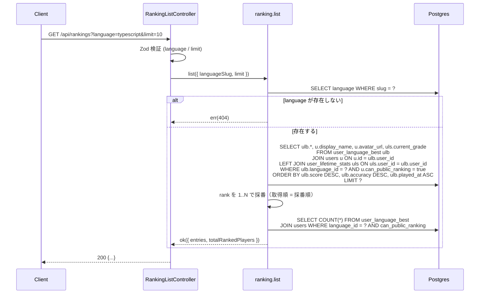
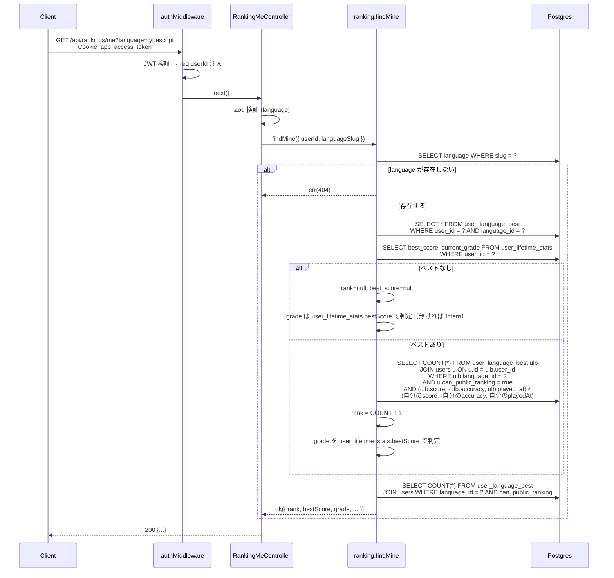

# step2: GET /api/rankings + GET /api/rankings/me（リアルタイム集計）

step1 で追加した `user_language_best` テーブルを source として、ランキング取得 API 2 本を実装する。

- `GET /api/rankings`: 言語別 TOP 10 + 全ランカー数
- `GET /api/rankings/me`: 認証ユーザーの言語別順位 + グレード進捗

両エンドポイントは **cron / Redis キャッシュを使わずリアルタイム集計**（`ORDER BY score DESC` + `ROW_NUMBER()` で都度採番）。MVP 規模 (数万行) では `@@index([languageId, score(sort: Desc)])` 1 本で十分な性能が出る。

1 step に 2 API を入れる理由：

- どちらも同じ `user_language_best` を `WHERE languageId = ?` で読む（Repository を共有）
- 同じグレード計算ロジック（`user_lifetime_stats.currentGrade` 読み出し）が絡む
- 既存 `StubRankingSnapshotRepository`（typing-engine の `/challenge-gods` 用）を `Prisma` 実装に置き換える作業も同 PR で行う方が test 同時実行で安全

## 目次

- [対象 API](#対象-api)
- [依存](#依存)
- [リクエスト](#リクエスト)
  - [GET /api/rankings — Query](#get-apirankings--query)
  - [GET /api/rankings/me — Query](#get-apirankingsme--query)
- [レスポンス](#レスポンス)
  - [GET /api/rankings — 200 OK](#get-apirankings--200-ok)
  - [GET /api/rankings/me — 200 OK](#get-apirankingsme--200-ok)
  - [エラー](#エラー)
- [処理フロー](#処理フロー)
  - [GET /api/rankings の流れ](#get-apirankings-の流れ)
  - [GET /api/rankings/me の流れ](#get-apirankingsme-の流れ)
- [集計クエリ設計](#集計クエリ設計)
- [既存 Stub の置き換え](#既存-stub-の置き換え)
- [設計方針](#設計方針)
- [対応内容](#対応内容)
- [動作確認](#動作確認)
- [次の step での利用](#次の-step-での利用)

## 対象 API

| 項目 | GET /api/rankings | GET /api/rankings/me |
|---|---|---|
| 認証 | 不要（公開） | 必須（Bearer JWT） |
| 副作用 | なし（read-only） | なし（read-only） |
| 冪等性 | 冪等 | 冪等 |
| 呼び出し元 | apps/web の `/ranking`（step5）、`/`（既存 placeholder の差し替え） | apps/web の `/play/[sessionId]` リザルト画面（step6）、`/mypage`（step6） |
| 主な依存 | step1 `user_language_best` | step1 `user_language_best` + `user_lifetime_stats` |

## 依存

| 依存先 | 何を使うか | 本 step での扱い |
|---|---|---|
| step1 (`user_language_best`) | ランキング source データ | 必須前提（テーブル空でも 200 で空配列を返す） |
| `User.canPublicRanking` | プライバシー除外 | クエリで `WHERE canPublicRanking = true` フィルタ |
| `user_lifetime_stats.currentGrade` | グレード表示 | `currentGrade` が null なら `intern` 扱い |
| 既存 `StubRankingSnapshotRepository` | typing-engine `/challenge-gods` が TOP 10 を取得して神を選ぶ | 本 step で `PrismaRankingSnapshotRepository` に置き換える（`Stub` は削除） |

## リクエスト

### GET /api/rankings — Query

| パラメータ | 型 | 必須 | 制約 | 説明 |
|---|---|---|---|---|
| `language` | `string` | yes | `typescript` / `javascript` | 言語 slug |
| `limit` | `number` | no | 1〜10、デフォルト 10 | 返す件数 |

### GET /api/rankings/me — Query

| パラメータ | 型 | 必須 | 制約 | 説明 |
|---|---|---|---|---|
| `language` | `string` | yes | `typescript` / `javascript` | 言語 slug |

> 認証は middleware 経由で `req.userId` が注入される（既存 `/api/users/me` と同じ方式）

## レスポンス

### GET /api/rankings — 200 OK

```json
{
  "entries": [
    {
      "rank": 1,
      "user": {
        "id": 12,
        "avatar_url": "https://avatars.githubusercontent.com/u/...",
        "current_grade": "fellow",
        "display_name": "sakurai_dev"
      },
      "score": 1490,
      "accuracy": 0.98,
      "typed_chars": 1520,
      "best_play_session_id": 8732,
      "played_at": "2026-06-03T02:14:08.000Z"
    }
  ],
  "language": "typescript",
  "total_ranked_players": 53871
}
```

| フィールド | 型 | 説明 |
|---|---|---|
| `entries[]` | array | TOP N。`user_language_best` が 0 件なら空配列 |
| `entries[].rank` | int | 1 以上の連番（リクエスト時点での順位） |
| `entries[].user.id` | int | プレイヤー詳細ページ動線 |
| `entries[].user.avatar_url` | string \| null | アバター URL |
| `entries[].user.current_grade` | string | グレード slug（`fellow` / `staff` / …、`intern` がデフォルト） |
| `entries[].user.display_name` | string | 表示名（null なら `user{id}` フォールバック） |
| `entries[].score` | int | スコア |
| `entries[].accuracy` | float | 0.0〜1.0 |
| `entries[].typed_chars` | int | 累計打鍵数 |
| `entries[].best_play_session_id` | int | リプレイ動線（step7 で利用） |
| `entries[].played_at` | string (ISO 8601 UTC) | プレイ時刻 |
| `language` | string | リクエストの language slug |
| `total_ranked_players` | int | この言語でベストを持つ `canPublicRanking=true` のユニーク player 数（UI の「N 人中」表示用） |

> `snapshot_updated_at` は **持たない**（リアルタイム集計のため）。UI は「現在の順位」と表示し、「N 分前」は無くす

### GET /api/rankings/me — 200 OK

```json
{
  "language": "typescript",
  "rank": 87,
  "best_score": 732,
  "best_accuracy": 0.974,
  "best_play_session_id": 9912,
  "best_played_at": "2026-06-03T05:43:21.000Z",
  "total_ranked_players": 53871,
  "grade": {
    "level": 5,
    "name": "Staff Engineer",
    "slug": "staff"
  },
  "next_grade": {
    "level": 6,
    "name": "Principal Engineer",
    "slug": "principal",
    "score_needed": 68
  }
}
```

| フィールド | 型 | 説明 |
|---|---|---|
| `language` | string | リクエストの language slug |
| `rank` | int \| null | 言語別順位（`user_language_best` にベストが無ければ null） |
| `best_score` | int \| null | この言語でのベストスコア（無ければ null） |
| `best_accuracy` | float \| null | ベスト達成時の正確率 |
| `best_play_session_id` | int \| null | ベストプレイのリプレイ動線 |
| `best_played_at` | string \| null | ベストプレイ時刻 |
| `total_ranked_players` | int | この言語でベストを持つ `canPublicRanking=true` のユニーク player 数 |
| `grade.level` | int | 1〜8 |
| `grade.name` | string | 表示名 |
| `grade.slug` | string | UI バッジ class 用 |
| `next_grade` | object \| null | 次グレード。current が Fellow なら null |
| `next_grade.score_needed` | int | 次グレード到達まで必要な pts（`user_lifetime_stats.bestScore`（全言語通算）基準） |

> グレード判定は **`user_lifetime_stats.bestScore`（全言語通算）** で行う（README「エンジニアグレード」参照）。本 API では言語別ベストとグレードを同時に返すが、グレードは言語に依存しない値（同じユーザーなら TS でも JS でも同じグレード）

> `publicRanking=false` のユーザーが `/me` を叩いた場合: ベストは保存されている（step3 で `/finish` が upsert）が `total_ranked_players` の COUNT には含まれない。`rank` は計算する（自分自身は自分の順位を見たいので公開対象から外しても表示する）

### エラー

| Status | type | 条件 | クライアント挙動 |
|---|---|---|---|
| 400 | BAD_REQUEST | `language` 不正 / `limit` 範囲外 | バリデーションエラー表示 |
| 401 | UNAUTHORIZED | `/me` で JWT なし or 不正 | ログイン誘導 |
| 404 | NOT_FOUND | 指定言語の `Language` 行が存在しない | 「言語が見つかりません」 |

> `user_language_best` が 0 件のケースは **404 にしない**（空配列 / null で 200 を返す）

## 処理フロー

### GET /api/rankings の流れ



#### 流れ

1. Controller が `getRankingsQuerySchema` で `language` / `limit` を検証（NG なら 400）
2. Service が Language を slug で引く（NG なら 404）
3. `user_language_best` を `users` + `user_lifetime_stats` と JOIN して TOP N を 1 クエリで取得
4. 取得順がそのまま rank（DB の ORDER BY が tie-break 込みで一意に順序付けする）
5. `total_ranked_players` を `WHERE language_id = ? AND can_public_ranking = true` で COUNT
6. Controller が 200 で返す

### GET /api/rankings/me の流れ



#### 流れ

1. 認証 middleware が `app_access_token` を検証して `req.userId` を注入（既存実装）
2. Controller が Zod で `language` を検証（NG なら 400）
3. Service が Language を slug で引く（NG なら 404）
4. Service が `user_language_best` から自分のベストを引く（無ければ `rank=null`, `best_score=null`）
5. `user_lifetime_stats` から `bestScore` と `currentGrade` を引く（無ければ全部 null / Intern）
6. ベストありなら順位を `COUNT(*) WHERE 自分より上位 + 1` で算出
7. グレード判定は `user_lifetime_stats.bestScore`（全言語通算）で行う（言語別ベストではない）
8. `total_ranked_players` を共通 COUNT クエリで取得
9. Controller が 200 で返す

## 集計クエリ設計

### TOP N 取得（`GET /api/rankings`）

Prisma の高レベル API で完結：

```typescript
const rows = await prisma.userLanguageBest.findMany({
  include: {
    user: {
      include: { lifetimeStats: { select: { currentGrade: true } } },
      select: { id: true, avatarUrl: true, displayName: true },
    },
  },
  orderBy: [
    { score: "desc" },
    { accuracy: "desc" },
    { playedAt: "asc" },
  ],
  take: limit,
  where: {
    languageId,
    user: { canPublicRanking: true },
  },
})
```

`@@index([languageId, score(sort: Desc)])` を活かして主クエリは index scan + LIMIT で済む。tie-break の `accuracy` / `playedAt` は同 score 内の数行に絞られた後の処理なので index に含めなくても問題ない。

### 自分の順位算出（`GET /api/rankings/me`）

「自分より上位のプレイヤー数」を 1 クエリで取得。tie-break ロジックを SQL で表現するために `OR` 条件で展開：

```typescript
const higherCount = await prisma.userLanguageBest.count({
  where: {
    languageId,
    user: { canPublicRanking: true },
    OR: [
      { score: { gt: myBest.score } },
      { score: myBest.score, accuracy: { gt: myBest.accuracy } },
      { score: myBest.score, accuracy: myBest.accuracy, playedAt: { lt: myBest.playedAt } },
    ],
  },
})
const myRank = higherCount + 1
```

### ランカー総数（共通）

```typescript
const totalRankedPlayers = await prisma.userLanguageBest.count({
  where: {
    languageId,
    user: { canPublicRanking: true },
  },
})
```

`user_language_best` は 1 ユーザー × 1 言語 = 1 行なので、`COUNT(*)` がそのままユニーク player 数になる（`DISTINCT` 不要）。

## 既存 Stub の置き換え

`apps/api/src/repository/prisma/ranking-snapshot-repository.ts` の `StubRankingSnapshotRepository` を削除し、`UserLanguageBest` を読む `PrismaRankingSnapshotRepository` を新規実装する。

`RankingSnapshotRepository.getTopByLanguage(languageId, limit)` の既存契約は **typing-engine `/challenge-gods`** が依存している。本 step で実装を切り替えても、interface の戻り型は変えないため `/challenge-gods` 側のコード変更は不要（Stub が空配列を返していたのが、本物のデータを返すようになるだけ）。

> 命名について：もはや `snapshot` という概念は無くなったが、`/challenge-gods` 側の呼び出しコードや schema を巻き戻すと PR が膨らむため、interface 名は `RankingSnapshotRepository` のまま残す。コメントで「`user_language_best` を読む」旨を明記する。命名の整理は将来の独立 PR で行う。

## 設計方針

- **cron / Redis キャッシュを使わない**: MVP 規模では `@@index([languageId, score(sort: Desc)])` 1 本で API が十分速い。バッチ + キャッシュを足すリターンが薄く、運用負荷とリアルタイム性のトレードオフでリアルタイム集計を選ぶ
- **rank をその場で採番する**: テーブルに `rank` を保存しないので、誰かのベストが更新されても他人の rank を rewrite する必要がない。書き込みコストが O(1)、読み出しコストが O(log N + 10)
- **「自分より上位の数」で順位を出す理由**: `ORDER BY ... LIMIT` で TOP 10 を取って自分を探すと、N 位 (N > 10) のユーザーを発見できない。`COUNT(*) WHERE 自分より上 + 1` なら任意の N に対して O(log N) で順位が出る
- **tie-break を SQL の OR で展開する理由**: Prisma で `(score, -accuracy, playedAt) > (my.score, -my.accuracy, my.playedAt)` のような「タプル比較」が書けない。OR 3 条件に展開するのが冗長だが分かりやすい。`@@index([languageId, score(sort: Desc)])` が効くので性能問題なし
- **`total_ranked_players` を毎リクエスト COUNT する**: テーブル行数なので軽い (`user_language_best` は最大でも数万〜数十万行)。バックフィル不要 / 整合性問題なし
- **`snapshot_updated_at` を持たない**: 常に「今この瞬間の順位」が返るため UI の「N 分前」表記は不要。step6 で result.html / mypage.html のモック該当箇所を削除する
- **`/me` でベスト未保存ユーザーには `rank: null` を返す**: ベストプレイがゼロ件の状態（新規ユーザーの初回プレイ前）は順位を計算できない。null で「未プレイ」を表現する
- **`publicRanking=false` ユーザーへの扱い**:
  - `GET /api/rankings`: `WHERE u.can_public_ranking = true` で除外（クエリ条件）
  - `GET /api/rankings/me`: 自分自身は除外しない（自分の順位は自分が見たい）。`rank` の計算では `canPublicRanking=true` の他人だけと比較するので、`publicRanking=false` ユーザーの順位は「公開されている人の中での順位 + 1」になる（仕様として記録）
- **`/me` で `language` 未指定を許さない理由**: マイページに「TS でのランキング」「JS でのランキング」を別カードで表示する想定（mock 参照）。1 API で全言語まとめて返すと N+1 用途が混じってレスポンス形が複雑化する。クライアントが言語ごとに並列に叩く方が単純
- **`limit` 上限を 10 にする理由**: ランキング画面 (step5) では TOP 10 + 自分のランクだけ表示。それ以上の件数を返す UI が無いので、サーバーで上限を切ると DoS 耐性が上がる
- **認証方式**: `/rankings` は `PUBLIC_PATHS` に追加（公開）。`/rankings/me` は既存の `app_access_token` cookie 認証（`/api/users/me` と同じ middleware）
- **`/challenge-gods` への波及**: 本 step で Stub が削除されて Prisma 実装が `user_language_best` を読むようになる。TOP 10 が 1 件でもあれば `/challenge-gods` が 200 を返すようになり、web 側の「神々に挑戦」ボタン disabled 解除が可能になる（解除自体は step6 で行う）

## 対応内容

### `packages/schema/src/api-schema/ranking.ts`（新規）

```typescript
import { z } from "zod"

// ========================================================
// GET /api/rankings - 言語別オールタイムランキング TOP N
// ========================================================

/**
 * GET /api/rankings の query string
 */
export const getRankingsQueryStringSchema = z.object({
  language: z.string().min(1).max(32),
  limit: z.coerce.number().int().min(1).max(10).default(10),
})

/**
 * ランキング 1 エントリの user 表示情報
 */
const rankingEntryUserSchema = z.object({
  id: z.number().int().positive(),
  avatar_url: z.string().url().nullable(),
  current_grade: z.string(),
  display_name: z.string(),
})

/**
 * ランキング 1 エントリ
 */
const rankingEntrySchema = z.object({
  rank: z.number().int().min(1),
  user: rankingEntryUserSchema,
  accuracy: z.number().min(0).max(1),
  best_play_session_id: z.number().int().positive(),
  played_at: z.string().datetime(),
  score: z.number().int().nonnegative(),
  typed_chars: z.number().int().nonnegative(),
})

/**
 * GET /api/rankings のレスポンス
 */
export const getRankingsResponseSchema = z.object({
  entries: z.array(rankingEntrySchema).max(10),
  language: z.string(),
  total_ranked_players: z.number().int().nonnegative(),
})

export type GetRankingsQueryString = z.infer<typeof getRankingsQueryStringSchema>
export type GetRankingsResponse = z.infer<typeof getRankingsResponseSchema>

// ========================================================
// GET /api/rankings/me - 認証ユーザーの言語別順位 + グレード
// ========================================================

/**
 * GET /api/rankings/me の query string
 */
export const getMyRankingQueryStringSchema = z.object({
  language: z.string().min(1).max(32),
})

/**
 * グレード情報
 */
const gradeSchema = z.object({
  level: z.number().int().min(1).max(8),
  name: z.string(),
  slug: z.string(),
})

const nextGradeSchema = gradeSchema.extend({
  score_needed: z.number().int().nonnegative(),
})

/**
 * GET /api/rankings/me のレスポンス
 */
export const getMyRankingResponseSchema = z.object({
  best_accuracy: z.number().min(0).max(1).nullable(),
  best_play_session_id: z.number().int().positive().nullable(),
  best_played_at: z.string().datetime().nullable(),
  best_score: z.number().int().nonnegative().nullable(),
  grade: gradeSchema,
  language: z.string(),
  next_grade: nextGradeSchema.nullable(),
  rank: z.number().int().min(1).nullable(),
  total_ranked_players: z.number().int().nonnegative(),
})

export type GetMyRankingQueryString = z.infer<typeof getMyRankingQueryStringSchema>
export type GetMyRankingResponse = z.infer<typeof getMyRankingResponseSchema>
```

### `packages/schema/src/api-schema/index.ts`（編集）

```typescript
export * from "./ranking"
```

### `apps/api/src/repository/prisma/user-language-best-repository.ts`（新規）

```typescript
import type { PrismaClient } from "@repo/db"

/**
 * ランキング表示用エントリ（TOP N 用、ユーザー情報を含む）
 */
export type UserLanguageBestWithUser = {
    accuracy: number
    bestPlaySessionId: number
    playedAt: Date
    score: number
    typedChars: number
    user: {
        avatarUrl: string | null
        currentGrade: string
        displayName: string
        id: number
    }
}

/**
 * 自分のベスト 1 件（順位計算用、ユーザー情報は呼び出し側で取得済み）
 */
export type MyLanguageBest = {
    accuracy: number
    bestPlaySessionId: number
    playedAt: Date
    score: number
    typedChars: number
}

export interface UserLanguageBestRepository {
    /**
     * 言語別 TOP N を取得（canPublicRanking=true のユーザーのみ）
     * tie-break: score DESC, accuracy DESC, playedAt ASC
     */
    findTopByLanguage(languageId: number, limit: number): Promise<UserLanguageBestWithUser[]>

    /**
     * 自分の言語別ベストを取得（無ければ null）
     */
    findMine(userId: number, languageId: number): Promise<MyLanguageBest | null>

    /**
     * 自分より上位のプレイヤー数を取得
     */
    countHigherRanked(languageId: number, myBest: MyLanguageBest): Promise<number>

    /**
     * 言語別の総ランカー数（canPublicRanking=true のベスト保持者数）
     */
    countRankableByLanguage(languageId: number): Promise<number>
}

export class PrismaUserLanguageBestRepository implements UserLanguageBestRepository {
  private _prisma: PrismaClient

  constructor(prisma: PrismaClient) {
    this._prisma = prisma
  }

  async findTopByLanguage(languageId: number, limit: number): Promise<UserLanguageBestWithUser[]> {
    const rows = await this._prisma.userLanguageBest.findMany({
      include: {
        user: {
          include: { lifetimeStats: { select: { currentGrade: true } } },
        },
      },
      orderBy: [
        { score: "desc" },
        { accuracy: "desc" },
        { playedAt: "asc" },
      ],
      take: limit,
      where: {
        languageId,
        user: { canPublicRanking: true },
      },
    })

    return rows.map((row) => ({
      accuracy: row.accuracy,
      bestPlaySessionId: row.bestPlaySessionId,
      playedAt: row.playedAt,
      score: row.score,
      typedChars: row.typedChars,
      user: {
        avatarUrl: row.user.avatarUrl,
        currentGrade: row.user.lifetimeStats?.currentGrade ?? "intern",
        displayName: row.user.displayName ?? `user${row.user.id}`,
        id: row.user.id,
      },
    }))
  }

  async findMine(userId: number, languageId: number): Promise<MyLanguageBest | null> {
    const row = await this._prisma.userLanguageBest.findUnique({
      where: { userId_languageId: { languageId, userId } },
    })
    if (row === null) return null
    return {
      accuracy: row.accuracy,
      bestPlaySessionId: row.bestPlaySessionId,
      playedAt: row.playedAt,
      score: row.score,
      typedChars: row.typedChars,
    }
  }

  async countHigherRanked(languageId: number, myBest: MyLanguageBest): Promise<number> {
    return this._prisma.userLanguageBest.count({
      where: {
        languageId,
        user: { canPublicRanking: true },
        OR: [
          { score: { gt: myBest.score } },
          { score: myBest.score, accuracy: { gt: myBest.accuracy } },
          {
            accuracy: myBest.accuracy,
            playedAt: { lt: myBest.playedAt },
            score: myBest.score,
          },
        ],
      },
    })
  }

  async countRankableByLanguage(languageId: number): Promise<number> {
    return this._prisma.userLanguageBest.count({
      where: {
        languageId,
        user: { canPublicRanking: true },
      },
    })
  }
}
```

### `apps/api/src/repository/prisma/ranking-snapshot-repository.ts`（編集）

既存 `StubRankingSnapshotRepository` を削除し、`UserLanguageBest` を読む実装に置き換える。`getTopByLanguage` の契約は不変。

```typescript
import type { PrismaClient } from "@repo/db"

/**
 * 言語別オールタイムトップエントリ
 * typing-engine /challenge-gods が「神」を選ぶときに利用
 */
export type RankingTopEntry = {
    bestPlaySessionId: number
    bestScore: number
    userDisplay: {
        avatarUrl: string | null
        currentGrade: string
        displayName: string
    }
    userId: number
}

export interface RankingSnapshotRepository {
    /**
     * 言語別オールタイムトップ N を返す（score 降順 + tie-break）
     * 内部は user_language_best を ORDER BY で読む（リアルタイム集計）
     */
    getTopByLanguage(languageId: number, limit: number): Promise<RankingTopEntry[]>
}

/**
 * user_language_best を source とする実装
 * （命名は既存 interface 名を維持。実体は snapshot ではなくリアルタイム集計）
 */
export class PrismaRankingSnapshotRepository implements RankingSnapshotRepository {
  private _prisma: PrismaClient

  constructor(prisma: PrismaClient) {
    this._prisma = prisma
  }

  async getTopByLanguage(languageId: number, limit: number): Promise<RankingTopEntry[]> {
    const rows = await this._prisma.userLanguageBest.findMany({
      include: {
        user: {
          include: { lifetimeStats: { select: { currentGrade: true } } },
        },
      },
      orderBy: [
        { score: "desc" },
        { accuracy: "desc" },
        { playedAt: "asc" },
      ],
      take: limit,
      where: {
        languageId,
        user: { canPublicRanking: true },
      },
    })

    return rows.map((row) => ({
      bestPlaySessionId: row.bestPlaySessionId,
      bestScore: row.score,
      userDisplay: {
        avatarUrl: row.user.avatarUrl,
        currentGrade: row.user.lifetimeStats?.currentGrade ?? "intern",
        displayName: row.user.displayName ?? `user${row.user.id}`,
      },
      userId: row.user.id,
    }))
  }
}
```

### `apps/api/src/lib/grade.ts`（新規）

`apps/web/src/libs/grade.ts` と同じ閾値テーブルだが、API 側でも独立して持つ。共通化したくなるが server / client で依存先（Web は `next/font` 等）が違うため別実装で OK。

```typescript
export type Grade = {
    level: number
    name: string
    slug: string
    /**
     * このグレードに到達するための最低ベストスコア
     */
    threshold: number
}

export const GRADES: readonly Grade[] = [
  { level: 1, name: "Intern", slug: "intern", threshold: 0 },
  { level: 2, name: "Junior Developer", slug: "junior", threshold: 100 },
  { level: 3, name: "Mid Developer", slug: "mid", threshold: 250 },
  { level: 4, name: "Senior Engineer", slug: "senior", threshold: 400 },
  { level: 5, name: "Staff Engineer", slug: "staff", threshold: 600 },
  { level: 6, name: "Principal Engineer", slug: "principal", threshold: 800 },
  { level: 7, name: "Distinguished Engineer", slug: "distinguished", threshold: 1000 },
  { level: 8, name: "Fellow", slug: "fellow", threshold: 1200 },
]

export const calcGrade = (bestScore: number): Grade => {
  const reversed = [...GRADES].reverse()
  return reversed.find((g) => bestScore >= g.threshold) ?? GRADES[0]
}

export const calcNextGrade = (current: Grade): Grade | null => {
  const idx = GRADES.findIndex((g) => g.level === current.level + 1)
  return idx >= 0 ? GRADES[idx] : null
}
```

### `apps/api/src/service/ranking-service.ts`（新規）

```typescript
import { logger } from "@repo/logger"

import { calcGrade, calcNextGrade, type Grade } from "../lib/grade"
import type { LanguageRepository } from "../repository/prisma/language-repository"
import type { UserLanguageBestRepository, UserLanguageBestWithUser } from "../repository/prisma/user-language-best-repository"
import type { UserLifetimeStatsRepository } from "../repository/prisma/user-lifetime-stats-repository"
import { err, notFoundError, ok, type Result } from "../types/result"

export type RankingListResult = {
    entries: Array<UserLanguageBestWithUser & { rank: number }>
    language: string
    totalRankedPlayers: number
}

export const list = async (
  input: { languageSlug: string; limit: number },
  repo: {
        languageRepository: LanguageRepository
        userLanguageBestRepository: UserLanguageBestRepository
    },
): Promise<Result<RankingListResult>> => {
  logger.debug("ranking.list", { language: input.languageSlug, limit: input.limit })

  const language = await repo.languageRepository.findBySlug(input.languageSlug)
  if (!language) return err(notFoundError("Language not found"))

  const top = await repo.userLanguageBestRepository.findTopByLanguage(language.id, input.limit)
  const totalRankedPlayers = await repo.userLanguageBestRepository.countRankableByLanguage(language.id)

  return ok({
    entries: top.map((entry, idx) => ({ ...entry, rank: idx + 1 })),
    language: input.languageSlug,
    totalRankedPlayers,
  })
}

export type MyRankingResult = {
    bestAccuracy: number | null
    bestPlaySessionId: number | null
    bestPlayedAt: Date | null
    bestScore: number | null
    grade: Grade
    language: string
    nextGrade: (Grade & { scoreNeeded: number }) | null
    rank: number | null
    totalRankedPlayers: number
}

export const findMine = async (
  input: { userId: number; languageSlug: string },
  repo: {
        languageRepository: LanguageRepository
        userLanguageBestRepository: UserLanguageBestRepository
        userLifetimeStatsRepository: UserLifetimeStatsRepository
    },
): Promise<Result<MyRankingResult>> => {
  logger.debug("ranking.findMine", { language: input.languageSlug, userId: input.userId })

  const language = await repo.languageRepository.findBySlug(input.languageSlug)
  if (!language) return err(notFoundError("Language not found"))

  const myBest = await repo.userLanguageBestRepository.findMine(input.userId, language.id)
  const lifetimeStats = await repo.userLifetimeStatsRepository.findByUserId(input.userId)
  const lifetimeBestScore = lifetimeStats?.bestScore ?? 0

  const grade = calcGrade(lifetimeBestScore)
  const next = calcNextGrade(grade)
  const nextGrade = next === null
    ? null
    : { ...next, scoreNeeded: Math.max(0, next.threshold - lifetimeBestScore) }

  const totalRankedPlayers = await repo.userLanguageBestRepository.countRankableByLanguage(language.id)

  if (myBest === null) {
    return ok({
      bestAccuracy: null,
      bestPlaySessionId: null,
      bestPlayedAt: null,
      bestScore: null,
      grade,
      language: input.languageSlug,
      nextGrade,
      rank: null,
      totalRankedPlayers,
    })
  }

  const higher = await repo.userLanguageBestRepository.countHigherRanked(language.id, myBest)
  return ok({
    bestAccuracy: myBest.accuracy,
    bestPlaySessionId: myBest.bestPlaySessionId,
    bestPlayedAt: myBest.playedAt,
    bestScore: myBest.score,
    grade,
    language: input.languageSlug,
    nextGrade,
    rank: higher + 1,
    totalRankedPlayers,
  })
}
```

### `apps/api/src/service/index.ts`（編集）

```typescript
export * as ranking from "./ranking-service"
```

### `apps/api/src/controller/ranking/list.ts`（新規）

```typescript
import type { Request, Response } from "express"

import {
  getRankingsQueryStringSchema,
  getRankingsResponseSchema,
  type GetRankingsResponse,
} from "@repo/api-schema"

import type { LanguageRepository } from "../../repository/prisma/language-repository"
import type { UserLanguageBestRepository } from "../../repository/prisma/user-language-best-repository"
import * as service from "../../service"
import type { ErrorResponse } from "../../types/error"

export class RankingListController {
  constructor(
    private _languageRepository: LanguageRepository,
    private _userLanguageBestRepository: UserLanguageBestRepository,
  ) {}

  execute = async (req: Request, res: Response) => {
    const query = getRankingsQueryStringSchema.parse(req.query)
    const result = await service.ranking.list(
      { languageSlug: query.language, limit: query.limit },
      {
        languageRepository: this._languageRepository,
        userLanguageBestRepository: this._userLanguageBestRepository,
      },
    )

    if (!result.ok) {
      const errorResponse: ErrorResponse = {
        error: result.error.message,
        status_code: result.error.statusCode,
      }
      return res.status(result.error.statusCode).json(errorResponse)
    }

    const response: GetRankingsResponse = {
      entries: result.value.entries.map((e) => ({
        accuracy: e.accuracy,
        best_play_session_id: e.bestPlaySessionId,
        played_at: e.playedAt.toISOString(),
        rank: e.rank,
        score: e.score,
        typed_chars: e.typedChars,
        user: {
          id: e.user.id,
          avatar_url: e.user.avatarUrl,
          current_grade: e.user.currentGrade,
          display_name: e.user.displayName,
        },
      })),
      language: result.value.language,
      total_ranked_players: result.value.totalRankedPlayers,
    }
    return res.status(200).json(getRankingsResponseSchema.parse(response))
  }
}
```

### `apps/api/src/controller/ranking/me.ts`（新規）

```typescript
import type { Request, Response } from "express"

import {
  getMyRankingQueryStringSchema,
  getMyRankingResponseSchema,
  type GetMyRankingResponse,
} from "@repo/api-schema"

import type { LanguageRepository } from "../../repository/prisma/language-repository"
import type { UserLanguageBestRepository } from "../../repository/prisma/user-language-best-repository"
import type { UserLifetimeStatsRepository } from "../../repository/prisma/user-lifetime-stats-repository"
import * as service from "../../service"
import type { ErrorResponse } from "../../types/error"

export class RankingMeController {
  constructor(
    private _languageRepository: LanguageRepository,
    private _userLanguageBestRepository: UserLanguageBestRepository,
    private _userLifetimeStatsRepository: UserLifetimeStatsRepository,
  ) {}

  execute = async (req: Request, res: Response) => {
    const query = getMyRankingQueryStringSchema.parse(req.query)
    /**
     * authMiddleware が req.userId を注入する前提
     */
    const userId = (req as Request & { userId: number }).userId

    const result = await service.ranking.findMine(
      { languageSlug: query.language, userId },
      {
        languageRepository: this._languageRepository,
        userLanguageBestRepository: this._userLanguageBestRepository,
        userLifetimeStatsRepository: this._userLifetimeStatsRepository,
      },
    )

    if (!result.ok) {
      const errorResponse: ErrorResponse = {
        error: result.error.message,
        status_code: result.error.statusCode,
      }
      return res.status(result.error.statusCode).json(errorResponse)
    }

    const response: GetMyRankingResponse = {
      best_accuracy: result.value.bestAccuracy,
      best_play_session_id: result.value.bestPlaySessionId,
      best_played_at: result.value.bestPlayedAt?.toISOString() ?? null,
      best_score: result.value.bestScore,
      grade: {
        level: result.value.grade.level,
        name: result.value.grade.name,
        slug: result.value.grade.slug,
      },
      language: result.value.language,
      next_grade: result.value.nextGrade === null
        ? null
        : {
          level: result.value.nextGrade.level,
          name: result.value.nextGrade.name,
          score_needed: result.value.nextGrade.scoreNeeded,
          slug: result.value.nextGrade.slug,
        },
      rank: result.value.rank,
      total_ranked_players: result.value.totalRankedPlayers,
    }
    return res.status(200).json(getMyRankingResponseSchema.parse(response))
  }
}
```

### `apps/api/src/routes/ranking-router.ts`（新規）

```typescript
import { Router } from "express"

import type { RankingListController } from "../controller/ranking/list"
import type { RankingMeController } from "../controller/ranking/me"

type RankingRouterControllers = {
    list?: RankingListController
    me?: RankingMeController
}

export const rankingRouter = (controllers: RankingRouterControllers): Router => {
  const router = Router()
  if (controllers.list) {
    router.get("/", (req, res) => controllers.list!.execute(req, res))
  }
  if (controllers.me) {
    router.get("/me", (req, res) => controllers.me!.execute(req, res))
  }
  return router
}
```

### `apps/api/src/index.ts`（編集）

```typescript
import { PrismaUserLanguageBestRepository } from "./repository/prisma/user-language-best-repository"
import { PrismaRankingSnapshotRepository } from "./repository/prisma/ranking-snapshot-repository"
import { RankingListController } from "./controller/ranking/list"
import { RankingMeController } from "./controller/ranking/me"
import { rankingRouter } from "./routes/ranking-router"

// 既存 Stub の生成を削除
const rankingSnapshotRepository = new PrismaRankingSnapshotRepository(prisma)
const userLanguageBestRepository = new PrismaUserLanguageBestRepository(prisma)

const rankingListController = new RankingListController(
  languageRepository,
  userLanguageBestRepository,
)
const rankingMeController = new RankingMeController(
  languageRepository,
  userLanguageBestRepository,
  userLifetimeStatsRepository,
)

app.use("/api/rankings", rankingRouter({
  list: rankingListController,
  me: rankingMeController,
}))
```

`PUBLIC_PATHS`（認証不要パス）に `GET /api/rankings`（末尾スラなし）のみ追加：

```typescript
const PUBLIC_PATHS = [
  // ... 既存
  "/api/rankings", // ← exact match: /me は対象外（middleware が認証強制）
]
```

> middleware の `PUBLIC_PATHS` がパス完全一致なら上記で OK。prefix match の場合は `/api/rankings/me` を強制認証対象として明示する別ロジックが必要。既存実装に合わせて調整する

## 動作確認

| 区分 | 内容 |
|---|---|
| 公開 API (空) | seed 直後で `user_language_best` 空 → `curl 'http://localhost:8080/api/rankings?language=typescript'` → 200 `entries=[], total_ranked_players=0` |
| 公開 API (データあり) | テストユーザー 3 人 + ベスト保存 → `curl ...` → 200 `entries` 3 件、rank が 1, 2, 3、tie-break 正しい |
| `/me` 認証必須 | cookie 無しで `curl /api/rankings/me?language=typescript` → 401 |
| `/me` ベスト未保存 | issue-test-token で発行した token + cookie → 200 `rank: null`, `best_score: null`, `grade: Intern` |
| `/me` ベストあり | DB に手動 INSERT → 200 `rank=N`, `best_score=N`, `grade.slug` が閾値通り |
| `publicRanking=false` のユーザーが TOP 10 から除外 | seed 後に user.canPublicRanking=false に変更 → `/rankings` で TOP に表示されない、`total_ranked_players` の COUNT からも除外 |
| `/challenge-gods` の挙動変化 | TOP 1 以上が存在する状態で `POST /api/play-sessions/challenge-gods` → 409 ではなく 200（神プレイのキーストロークログを返す） |
| バリデーション | `?language=ts` → 200（slug 完全一致）、`?language=python` → 404、`?limit=999` → 400 |
| Service ユニットテスト | `apps/api/test/service/ranking-service/list.test.ts` + `findMine.test.ts`、正常系 2 + 異常系 2 |
| Controller インテグレーションテスト | `apps/api/test/controller/ranking/list.test.ts` + `me.test.ts`、実 Postgres |
| Lint / Build | `pnpm lint && pnpm build && pnpm test` |

### Service ユニットテスト例

```typescript
describe("ranking.findMine", () => {
  beforeEach(() => vi.clearAllMocks())

  describe("正常系", () => {
    it("ベストありなら rank と grade を返す", async () => {
      const language = { id: 1, slug: "typescript" } as never
      const myBest = { accuracy: 0.97, bestPlaySessionId: 5, playedAt: new Date(), score: 732, typedChars: 752 }
      const result = await findMine(
        { languageSlug: "typescript", userId: 10 },
        {
          languageRepository: { findBySlug: vi.fn().mockResolvedValue(language) } as never,
          userLanguageBestRepository: {
            countHigherRanked: vi.fn().mockResolvedValue(86),
            countRankableByLanguage: vi.fn().mockResolvedValue(53871),
            findMine: vi.fn().mockResolvedValue(myBest),
            findTopByLanguage: vi.fn(),
          },
          userLifetimeStatsRepository: {
            findByUserId: vi.fn().mockResolvedValue({ bestScore: 732, currentGrade: "staff" }),
          } as never,
        },
      )
      expect(result.ok).toBe(true)
      if (result.ok) {
        expect(result.value.rank).toBe(87)
        expect(result.value.grade.slug).toBe("staff")
        expect(result.value.nextGrade?.scoreNeeded).toBe(68)
      }
    })

    it("ベスト未保存なら rank=null + Intern を返す", async () => {
      // ...
    })
  })

  describe("異常系", () => {
    it("language が存在しない場合 NOT_FOUND", async () => {
      // ...
    })
  })
})
```

### Controller インテグレーションテスト例

```typescript
describe("GET /api/rankings", () => {
  beforeEach(async () => {
    await cleanupTestData()
  })

  describe("正常系", () => {
    it("TOP 10 を返す", async () => {
      const lang = await testPrisma.language.create({ data: { name: "TypeScript", slug: "typescript" } })
      const users = await Promise.all(
        Array.from({ length: 3 }, (_, i) =>
          testPrisma.user.create({ data: { displayName: `u${i}` } })),
      )
      for (let i = 0; i < 3; i++) {
        const session = await testPrisma.playSession.create({
          data: {
            accuracy: 0.95 + i * 0.01,
            crawledRepoId: 1,
            languageId: lang.id,
            mode: "solo",
            mistypeStats: {},
            playedAt: new Date(),
            problemsCompleted: 5,
            problemsPlayed: 6,
            score: 100 + i * 50,
            typedChars: 100 + i * 50,
            userId: users[i].id,
          },
        })
        await testPrisma.userLanguageBest.create({
          data: {
            accuracy: 0.95 + i * 0.01,
            bestPlaySessionId: session.id,
            languageId: lang.id,
            playedAt: new Date(),
            score: 100 + i * 50,
            typedChars: 100 + i * 50,
            userId: users[i].id,
          },
        })
      }

      const res = await request(app).get("/api/rankings").query({ language: "typescript" })
      expect(res.status).toBe(200)
      expect(res.body).toEqual({
        entries: expect.arrayContaining([
          expect.objectContaining({ rank: 1, score: 200 }),
          expect.objectContaining({ rank: 2, score: 150 }),
          expect.objectContaining({ rank: 3, score: 100 }),
        ]),
        language: "typescript",
        total_ranked_players: 3,
      })
    })
  })

  describe("異常系", () => {
    it("不正な language で 404", async () => {
      const res = await request(app).get("/api/rankings").query({ language: "python" })
      expect(res.status).toBe(404)
    })

    it("limit が範囲外で 400", async () => {
      const res = await request(app).get("/api/rankings").query({ language: "typescript", limit: 999 })
      expect(res.status).toBe(400)
    })
  })
})
```

## 次の step での利用

- **step3 (`/finish` 拡張)**: 同じ `user_language_best` テーブルに upsert する。本 step で実装した `UserLanguageBestRepository` を再利用する形になる（`upsertIfBest(...)` メソッド追加）。`topTenBoundaryScore`（10 位ボーダー）は本 step の `findTopByLanguage(limit=10)` の 10 番目を取り出すか、専用メソッド `findTenthScore(languageId)` を追加して `/finish` から呼ぶ
- **step4 (`GET /api/players/:userId`)**: 本テーブルを `WHERE userId = ?` で読み「プレイヤーの全言語ベスト」を返す。本 step の `UserLanguageBestRepository` に `findAllByUserId(userId)` メソッドを追加して再利用
- **step5 (`/ranking` 画面)**: 本 step で実装した `GET /api/rankings` を Server Component から `apiClient.get()` で叩いて表示
- **step6 (`/play/[sessionId]` リザルト + `/mypage`)**: 本 step の `GET /api/rankings/me` を Route Handler 経由 / Server Component から叩いて、順位 + グレード進捗を表示
- **step7 (`/players/[id]` 画面)**: step4 の API を叩く（本 step に直接依存はしない）
- **typing-engine `/challenge-gods`**: 本 step で `Stub` が削除されて `Prisma` 実装が `user_language_best` を読むようになる。TOP 10 が 1 件でも存在すれば 200 が返るようになる
