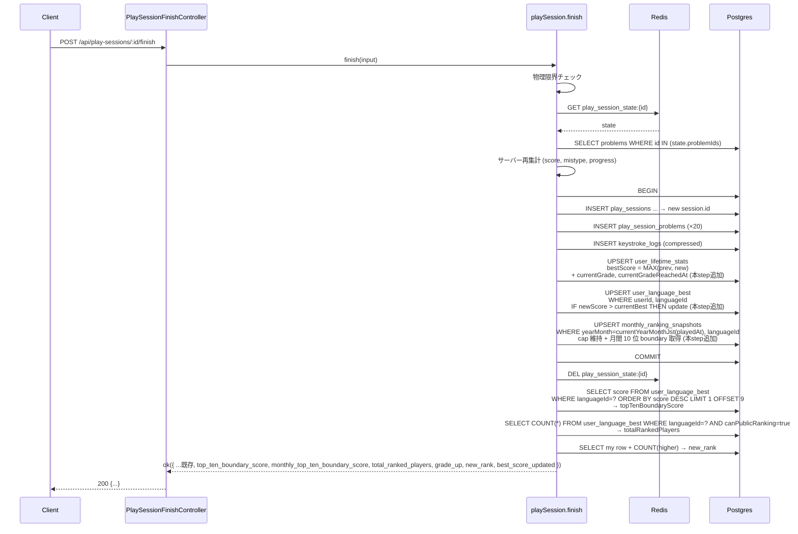

# step3: /finish 拡張（user_language_best upsert + gradeUp + topTenBoundaryScore）

step1 で追加した `user_language_best` テーブルへの書き込みと、`/finish` レスポンスへのランキング/グレード情報の追加を行う。

既存の `/finish` は次の責務を持っている (typing-engine PR #20):

1. 物理限界チェック
2. Redis から `play_session_state` 取得
3. サーバー再集計 (score / mistypeStats / problemProgress)
4. 4 テーブル書き込み (play_sessions / play_session_problems / keystroke_logs / user_lifetime_stats)
5. Redis state 削除

本 step では既存トランザクションに **5 番目のテーブル** (`user_language_best`) と **`user_lifetime_stats.currentGrade` の更新** を追加し、レスポンスにランキング体験用のフィールドを追加する。

## 目次

- [対象 API](#対象-api)
- [依存](#依存)
- [リクエスト](#リクエスト)
- [レスポンス](#レスポンス)
  - [200 OK（拡張箇所のみ）](#200-ok拡張箇所のみ)
  - [エラー](#エラー)
- [処理フロー](#処理フロー)
  - [処理の流れ](#処理の流れ)
- [トランザクション境界の更新](#トランザクション境界の更新)
- [user_language_best への upsert ロジック](#user_language_best-への-upsert-ロジック)
- [グレード判定とアップ通知](#グレード判定とアップ通知)
- [10 位ボーダースコアの取得](#10-位ボーダースコアの取得)
- [新ランクの即時計算](#新ランクの即時計算)
- [設計方針](#設計方針)
- [対応内容](#対応内容)
- [動作確認](#動作確認)
- [次の step での利用](#次の-step-での利用)

## 対象 API

| 項目 | 値 |
|---|---|
| メソッド / パス | `POST /api/play-sessions/:id/finish`（既存、本 step で拡張） |
| 認証 | 必須 |
| 副作用 | 既存 4 テーブル + 本 step で追加: `user_language_best` upsert、`user_lifetime_stats.currentGrade` / `currentGradeReachedAt` 更新 |
| 冪等性 | 非冪等（既存と同じ。Redis state を 1 回だけ消費） |
| 呼び出し元 | apps/web の `PlayLoop`（既存） |

## 依存

| 依存先 | 何を使うか | 本 step での扱い |
|---|---|---|
| step1 (`user_language_best`) | ベスト保存先 | 必須前提 |
| step2 (`UserLanguageBestRepository.findTopByLanguage` 等) | 10 位ボーダー / 新ランク取得 | 本 step で同 interface に `findTenthScore` / `upsertIfBest` メソッドを追加して再利用 |
| step2 (`calcGrade` / `calcNextGrade`) | グレード判定 | `apps/api/src/lib/grade.ts` を再利用 |
| `user_lifetime_stats.upsertOnFinish` | 既存実装に `currentGrade` / `currentGradeReachedAt` 更新を追加 | 本 step で実装内部を拡張（戻り値で旧 grade を返すよう変更） |

## リクエスト

既存と同じ（変更なし）。

## レスポンス

### 200 OK（拡張箇所のみ）

```json
{
  "accuracy": 0.974,
  "mistype_stats": { "a": 3, ";": 5 },
  "persisted": true,
  "problems_completed": 7,
  "problems_played": 8,
  "score": 732,
  "typed_chars": 752,

  "best_score_updated": true,
  "new_rank": 87,
  "top_ten_boundary_score": 1041,
  "monthly_top_ten_boundary_score": 612,
  "total_ranked_players": 53871,
  "grade_up": {
    "from": { "level": 4, "name": "Senior Engineer", "slug": "senior" },
    "to":   { "level": 5, "name": "Staff Engineer",  "slug": "staff" }
  }
}
```

| フィールド | 型 | 説明 |
|---|---|---|
| `best_score_updated` | bool | この `/finish` でその言語のベストを更新したか |
| `new_rank` | int \| null | upsert 後の言語別順位（`COUNT(自分より上位) + 1`）。ベスト未更新なら旧順位を返す。`canPublicRanking=false` でも自分自身は順位を見れる |
| `top_ten_boundary_score` | int \| null | 直近の言語別 10 位スコア（ベスト 10 件未満なら null）。クライアントが「TOP 10 入りモーダルを開くべきか」判定する |
| `monthly_top_ten_boundary_score` | int \| null | 今月（JST）の言語別 10 位スコア（`monthly_ranking_snapshots` 由来、10 件未満なら null）。リザルト画面で月間 TOP 10 入りモーダル判定に利用 |
| `total_ranked_players` | int | この言語の全期間ランカー数（`canPublicRanking=true`）。リザルト画面の「○○人中 N 位」表示に利用 |
| `grade_up` | object \| null | グレードアップが発生したときのみ。`from` / `to` でクライアントが祝賀演出を出す |

### エラー

既存と同じ（変更なし）。新規追加カラムの書き込み失敗は **全体トランザクションのロールバック** で扱う（部分成功させない）。

## 処理フロー



### 処理の流れ

1〜4 は既存と同じ（物理限界 / Redis state / 問題本体取得 / サーバー再集計）
5. **トランザクション内** で次の 5 テーブル書き込みを実施:
   - `play_sessions` INSERT（既存）
   - `play_session_problems` INSERT ×20（既存）
   - `keystroke_logs` INSERT（既存）
   - `user_lifetime_stats` UPSERT（既存実装を拡張：`currentGrade` / `currentGradeReachedAt` 更新を追加、戻り値で旧 grade を返す）
   - `user_language_best` UPSERT（**本 step で追加**：新スコアが既存ベストより高ければ更新）
6. Redis state を削除（書き込み成功時のみ）
7. **トランザクション後** に追加 3 クエリ:
   - 10 位ボーダースコアを取得（`ORDER BY score DESC LIMIT 1 OFFSET 9`、9 件以下なら null）
   - 自分の新しいベストと `COUNT(自分より上位)` で `new_rank` を算出（`canPublicRanking` 関係なく自分自身を含めて計算）
   - `gradeUp` は upsert ステップの戻り値から組み立て
8. レスポンスを返す

## トランザクション境界の更新

既存の `persistFinishedSessionAtomic` に書き込みを 1 つ追加し、戻り値で `gradeUp` を返すように変更：

```typescript
type PersistFinishedSessionResult = {
    bestScoreUpdated: boolean
    gradeUp: { from: Grade; to: Grade } | null
}

const persistFinishedSessionAtomic = async (
  data: PersistFinishedSessionInput,
  repo: FinishSessionRepo,
): Promise<PersistFinishedSessionResult> => {
  return repo.transactionRunner.run(async (tx) => {
    /** 既存: play_sessions / play_session_problems / keystroke_logs */
    const session = await repo.playSessionRepository.create({...}, tx)
    await repo.playSessionProblemRepository.createMany(session.id, [...], tx)
    await repo.keystrokeLogRepository.create(session.id, data.keystrokeLogs, tx)

    /** 既存 + 本 step 拡張: user_lifetime_stats と現在グレード判定 */
    const upsertResult = await repo.userLifetimeStatsRepository.upsertOnFinish(
      { ...既存, currentScore: data.score, userId: data.state.userId },
      tx,
    )
    /** upsertResult.gradeUp は旧 grade と新 grade の差分。同じなら null */

    /** 本 step 新規: user_language_best upsert */
    const bestUpdate = await repo.userLanguageBestRepository.upsertIfBest(
      {
        accuracy: data.accuracy,
        bestPlaySessionId: session.id,
        languageId: data.state.languageId,
        playedAt: new Date(),
        score: data.score,
        typedChars: data.typedChars,
        userId: data.state.userId,
      },
      tx,
    )

    return { bestScoreUpdated: bestUpdate.updated, gradeUp: upsertResult.gradeUp }
  })
}
```

## user_language_best への upsert ロジック

「既存より高ければ更新、低ければ書き換えない」セマンティクスを SQL レベルで担保する：

```typescript
// apps/api/src/repository/prisma/user-language-best-repository.ts (拡張)

export type UpsertIfBestInput = {
    accuracy: number
    bestPlaySessionId: number
    languageId: number
    playedAt: Date
    score: number
    typedChars: number
    userId: number
}

export type UpsertIfBestResult = {
    /**
     * INSERT または既存より高いスコアで UPDATE したら true
     * 既存より低いスコアだったので変更しなかった場合は false
     */
    updated: boolean
}

async upsertIfBest(input: UpsertIfBestInput, tx?: TransactionContext): Promise<UpsertIfBestResult> {
  const client = tx ?? this._prisma
  const existing = await client.userLanguageBest.findUnique({
    where: { userId_languageId: { languageId: input.languageId, userId: input.userId } },
  })

  if (existing === null) {
    await client.userLanguageBest.create({
      data: {
        accuracy: input.accuracy,
        bestPlaySessionId: input.bestPlaySessionId,
        languageId: input.languageId,
        playedAt: input.playedAt,
        score: input.score,
        typedChars: input.typedChars,
        userId: input.userId,
      },
    })
    return { updated: true }
  }

  /**
   * 既存と同じ tie-break ルール: score DESC, accuracy DESC, playedAt ASC
   * 新スコアが既存より「強い」場合のみ更新
   */
  const isBetter =
        input.score > existing.score
        || (input.score === existing.score && input.accuracy > existing.accuracy)
        || (input.score === existing.score
            && input.accuracy === existing.accuracy
            && input.playedAt < existing.playedAt)

  if (!isBetter) {
    return { updated: false }
  }

  await client.userLanguageBest.update({
    data: {
      accuracy: input.accuracy,
      bestPlaySessionId: input.bestPlaySessionId,
      playedAt: input.playedAt,
      score: input.score,
      typedChars: input.typedChars,
    },
    where: { id: existing.id },
  })
  return { updated: true }
}
```

## グレード判定とアップ通知

既存 `upsertOnFinish` を拡張し、トランザクション内で旧 grade を読み、新 `bestScore` から新 grade を計算して、変更があれば `currentGrade` / `currentGradeReachedAt` も更新する。戻り値で `gradeUp` 情報を Service に返す：

```typescript
// apps/api/src/repository/prisma/user-lifetime-stats-repository.ts (拡張)

import { calcGrade, type Grade } from "../../lib/grade"

export type UpsertOnFinishResult = {
    /**
     * グレードアップした場合のみ from/to を返す。同一グレードなら null
     */
    gradeUp: { from: Grade; to: Grade } | null
}

async upsertOnFinish(
  input: UpsertOnFinishInput,
  tx?: TransactionContext,
): Promise<UpsertOnFinishResult> {
  const client = tx ?? this._prisma
  const existing = await client.userLifetimeStats.findUnique({ where: { userId: input.userId } })
  const langKey = String(input.languageId)

  if (!existing) {
    const newBest = input.score
    const newGrade = calcGrade(newBest)
    await client.userLifetimeStats.create({
      data: {
        bestScore: newBest,
        bestScoreByLanguage: { [langKey]: input.score },
        currentGrade: newGrade.slug,
        currentGradeReachedAt: newGrade.level > 1 ? new Date() : null,
        lifetimeMistypeStats: input.mistypeStats,
        totalSessions: 1,
        totalTypedChars: BigInt(input.typedChars),
        userId: input.userId,
      },
    })
    /**
     * 初回プレイで Intern より上のグレードに到達した場合のみ gradeUp 通知
     * （Intern = 初期値なので「Intern になった」は通知しない）
     */
    return { gradeUp: newGrade.level > 1
      ? { from: { level: 1, name: "Intern", slug: "intern", threshold: 0 }, to: newGrade }
      : null,
    }
  }

  const prevBest = existing.bestScore
  const newBest = Math.max(prevBest, input.score)
  const prevGrade = calcGrade(prevBest)
  const newGrade = calcGrade(newBest)

  const currentByLang = (existing.bestScoreByLanguage ?? {}) as Record<string, number>
  const newByLang = {
    ...currentByLang,
    [langKey]: Math.max(currentByLang[langKey] ?? 0, input.score),
  }
  const currentMistype = (existing.lifetimeMistypeStats ?? {}) as MistypeStats
  const newMistype: MistypeStats = { ...currentMistype }
  for (const [key, count] of Object.entries(input.mistypeStats)) {
    newMistype[key] = (newMistype[key] ?? 0) + count
  }

  await client.userLifetimeStats.update({
    data: {
      bestScore: newBest,
      bestScoreByLanguage: newByLang,
      currentGrade: newGrade.slug,
      currentGradeReachedAt: newGrade.level > prevGrade.level ? new Date() : existing.currentGradeReachedAt,
      lifetimeMistypeStats: newMistype,
      totalSessions: existing.totalSessions + 1,
      totalTypedChars: existing.totalTypedChars + BigInt(input.typedChars),
    },
    where: { userId: input.userId },
  })

  return {
    gradeUp: newGrade.level > prevGrade.level ? { from: prevGrade, to: newGrade } : null,
  }
}
```

## 10 位ボーダースコアの取得

トランザクション後（自分の upsert 完了後）に取得する：

```typescript
// apps/api/src/repository/prisma/user-language-best-repository.ts (拡張)

/**
 * 言語別 10 位スコア（10 件未満なら null）
 * tie-break ルールに従って取得
 */
async findTenthScore(languageId: number): Promise<number | null> {
  const rows = await this._prisma.userLanguageBest.findMany({
    orderBy: [
      { score: "desc" },
      { accuracy: "desc" },
      { playedAt: "asc" },
    ],
    select: { score: true },
    skip: 9,
    take: 1,
    where: {
      languageId,
      user: { canPublicRanking: true },
    },
  })
  return rows.length === 0 ? null : rows[0].score
}
```

クライアントは `score > top_ten_boundary_score` のとき「TOP 10 入りモーダル」を開く（[`../rewards/README.md` の Hall of Fame コメント仕様](../rewards/README.md) と連動。本 step では境界スコアを返すだけで、モーダルは Rewards 機能側で実装）。

## 新ランクの即時計算

`upsertIfBest` 後の自分のベストで `step2` の `countHigherRanked` を呼ぶ。`canPublicRanking=false` でも **自分自身は順位を見れる**ので、自分の `canPublicRanking` フラグでは絞らない（他のランカーは `canPublicRanking=true` で絞る、step2 と同じ実装）：

```typescript
const updatedBest = await userLanguageBestRepository.findMine(userId, languageId)
const newRank = updatedBest === null
  ? null
  : (await userLanguageBestRepository.countHigherRanked(languageId, updatedBest)) + 1
```

`updatedBest === null` のケースは理論上発生しない（直前に upsert したため）が、型安全のため null チェック。

## 設計方針

- **追加書き込みを既存トランザクションに含める**: `user_language_best` 更新 / `user_lifetime_stats.currentGrade` 更新が play_sessions 等と別トランザクションだと、片方だけ成功する状態が発生する（プレイは記録されたがベストは更新されない、など）。1 トランザクションにまとめる
- **`gradeUp` をトランザクション内で判定する理由**: トランザクション外で旧 grade / 新 grade を読むと、同時並行プレイで読み取りタイミングがずれて誤通知になる可能性がある。upsert 関数内で「旧値 → 新値」の差分を返すのが安全
- **`gradeUp.from === Intern` のケース**: 初回プレイで Intern よりも上のグレードに即到達した場合は通知する（祝賀演出があった方が良い）。一方、「Intern になった」（つまり 0 → 0 pts のままや、初プレイで Intern のままなど）の通知は無意味なので出さない
- **`currentGradeReachedAt` を更新するタイミング**: グレードレベルが上がったときのみ。同じグレードに留まった場合は既存値を保持（マイページの「2026-05-28 達成」表示用、mock 参照）
- **`new_rank` をトランザクション後に取得する理由**: トランザクション内で COUNT クエリを打つと、他ユーザーの並行 upsert が見えず順位がズレる可能性がある。トランザクション後の最新スナップショットで COUNT した方が「外から見たときの順位」と一致する（既に自分の upsert はコミット済みなので自分の値は反映されている）
- **`top_ten_boundary_score` をトランザクション後に取得する理由**: 同上。自分のスコアを含めた状態で 10 位を取りたいので、`/finish` で自分のベストが入った直後に取る
- **`best_score_updated` を返す理由**: クライアントは「ベスト更新時のみ祝賀演出 / Hall of Fame モーダル」を出したい。旧スコアと新スコアの比較をクライアントでやらせるとロジックが分散するので、サーバーが一括判定して返す
- **`UserLanguageBestRepository.upsertIfBest` をアプリケーションコードで分岐する理由**: PostgreSQL の `INSERT ... ON CONFLICT DO UPDATE WHERE` で SQL レベルに条件を寄せることも可能だが、Prisma の Type-safe API では条件付き UPDATE が表現しにくい（rawSQL に逃げる）。アプリ層で `findUnique` → 比較 → `update` する方が型安全で読みやすい。並行性の懸念は `@@unique([userId, languageId])` + トランザクション分離レベルで担保
- **既存 `upsertOnFinish` の戻り値変更は破壊的**: 既存呼び出し元は `apps/api/src/service/play-session-service.ts` の 1 箇所のみ。本 step で同時に変更するので影響範囲は閉じる
- **`UserLifetimeStats.currentGrade` の文字列型を維持**: schema は既に `String?`。Prisma enum にしない理由は step1 README に書いた通り「8 件しかないので定数で十分、マスタテーブルにすると JOIN コストが発生」

## 対応内容

### `packages/schema/src/api-schema/play-session.ts`（編集）

`finishPlaySessionResponseSchema` を拡張：

```typescript
const gradeSchema = z.object({
  level: z.number().int().min(1).max(8),
  name: z.string(),
  slug: z.string(),
})

export const finishPlaySessionResponseSchema = z.object({
  /** 既存 */
  accuracy: z.number(),
  mistype_stats: mistypeStatsSchema,
  persisted: z.boolean(),
  problems_completed: z.number().int().nonnegative(),
  problems_played: z.number().int().nonnegative(),
  score: z.number().int().nonnegative(),
  typed_chars: z.number().int().nonnegative(),

  /** 本 step で追加 */
  best_score_updated: z.boolean(),
  grade_up: z.object({
    from: gradeSchema,
    to: gradeSchema,
  }).nullable(),
  new_rank: z.number().int().min(1).nullable(),
  top_ten_boundary_score: z.number().int().nonnegative().nullable(),
})

export type FinishPlaySessionResponse = z.infer<typeof finishPlaySessionResponseSchema>
```

### `apps/api/src/repository/prisma/user-language-best-repository.ts`（編集）

interface に `upsertIfBest` / `findTenthScore` を追加（コードは「user_language_best への upsert ロジック」「10 位ボーダースコアの取得」セクション参照）。

### `apps/api/src/repository/prisma/user-lifetime-stats-repository.ts`（編集）

`upsertOnFinish` の戻り値を `Promise<UpsertOnFinishResult>` に変更し、内部で `calcGrade` を呼んで `currentGrade` / `currentGradeReachedAt` を更新する（コードは「グレード判定とアップ通知」セクション参照）。

### `apps/api/src/service/play-session-service.ts`（編集）

`FinishSessionRepo` 型に `userLanguageBestRepository` を追加：

```typescript
type FinishSessionRepo = {
    /** 既存 */
    keystrokeLogRepository: KeystrokeLogRepository
    playSessionProblemRepository: PlaySessionProblemRepository
    playSessionRepository: PlaySessionRepository
    playSessionStateRepository: PlaySessionStateRepository
    problemRepository: ProblemRepository
    transactionRunner: TransactionRunner
    userLifetimeStatsRepository: UserLifetimeStatsRepository

    /** 本 step で追加 */
    userLanguageBestRepository: UserLanguageBestRepository
}
```

`persistFinishedSessionAtomic` を「トランザクション境界の更新」セクションのコードに置き換え、`finishSession` の最後でトランザクション後の追加クエリ + レスポンス組み立てを行う：

```typescript
export const finishSession = async (
  input: FinishSessionInput,
  repo: FinishSessionRepo,
): Promise<Result<FinishResult>> => {
  /** 既存: 1〜4 (物理限界 / Redis state / 問題本体 / サーバー再集計) */
  // ... 既存実装

  /** 5. 5 テーブルの atomic 書き込み + gradeUp 戻り値 */
  const { bestScoreUpdated, gradeUp } = await persistFinishedSessionAtomic({...}, repo)

  /** 6. Redis state 削除 */
  await repo.playSessionStateRepository.delete(input.sessionId)

  /** 本 step で追加: ランキング系の追加クエリ */
  const updatedBest = await repo.userLanguageBestRepository.findMine(state.userId, state.languageId)
  const newRank = updatedBest === null
    ? null
    : (await repo.userLanguageBestRepository.countHigherRanked(state.languageId, updatedBest)) + 1
  const topTenBoundaryScore = await repo.userLanguageBestRepository.findTenthScore(state.languageId)

  return ok({
    /** 既存 */
    accuracy: input.accuracy,
    mistypeStats,
    persisted: true,
    problemsCompleted,
    problemsPlayed,
    score,
    typedChars: input.typedChars,

    /** 本 step で追加 */
    bestScoreUpdated,
    gradeUp,
    newRank,
    topTenBoundaryScore,
  })
}
```

`FinishResult` 型（`apps/api/src/types/domain/play-session.ts` 等）にも `bestScoreUpdated` / `gradeUp` / `newRank` / `topTenBoundaryScore` を追加。

### `apps/api/src/controller/play-session/finish.ts`（編集）

レスポンス組み立てに新フィールドを追加（snake_case 変換）：

```typescript
const response: FinishPlaySessionResponse = {
  /** 既存 */
  accuracy: result.value.accuracy,
  mistype_stats: result.value.mistypeStats,
  persisted: result.value.persisted,
  problems_completed: result.value.problemsCompleted,
  problems_played: result.value.problemsPlayed,
  score: result.value.score,
  typed_chars: result.value.typedChars,

  /** 本 step で追加 */
  best_score_updated: result.value.bestScoreUpdated,
  grade_up: result.value.gradeUp === null
    ? null
    : {
      from: { level: result.value.gradeUp.from.level, name: result.value.gradeUp.from.name, slug: result.value.gradeUp.from.slug },
      to: { level: result.value.gradeUp.to.level, name: result.value.gradeUp.to.name, slug: result.value.gradeUp.to.slug },
    },
  new_rank: result.value.newRank,
  top_ten_boundary_score: result.value.topTenBoundaryScore,
}
return res.status(200).json(finishPlaySessionResponseSchema.parse(response))
```

### `apps/api/src/index.ts`（編集）

`FinishController` の DI に `userLanguageBestRepository` を追加：

```typescript
const finishController = new PlaySessionFinishController(
  /** 既存 */
  keystrokeLogRepository,
  playSessionProblemRepository,
  playSessionRepository,
  playSessionStateRepository,
  problemRepository,
  transactionRunner,
  userLifetimeStatsRepository,
  /** 本 step で追加 */
  userLanguageBestRepository, // step2 で既に生成済み
)
```

## 動作確認

| 区分 | 内容 |
|---|---|
| 初回プレイ（ベスト記録） | 新規ユーザーで /finish → 200、`best_score_updated=true`、`new_rank=1`（自分 1 人なら）、`top_ten_boundary_score=null`、DB `user_language_best` に 1 行 |
| 2 回目（ベスト未更新） | 同ユーザーで前回より低いスコア → 200、`best_score_updated=false`、`new_rank` は前回と同じ、`user_language_best` は更新されない |
| 2 回目（ベスト更新） | 前回より高いスコア → `best_score_updated=true`、`user_language_best.score` と `bestPlaySessionId` が新セッションに置き換わる |
| グレードアップ | bestScore が閾値を跨ぐ /finish → `grade_up` が non-null、`user_lifetime_stats.currentGrade` 更新、`currentGradeReachedAt` 更新 |
| グレード据置 | bestScore 更新だが同じ grade のまま → `grade_up=null`、`currentGradeReachedAt` は変更されない |
| 10 位ボーダー（11 人以上） | テストで 11 ユーザー × ベスト保存 → /finish レスポンスの `top_ten_boundary_score` が 10 位スコアと一致 |
| 10 位ボーダー（10 人未満） | テストで 5 ユーザー → `top_ten_boundary_score=null` |
| tie-break | 同 score 2 人で同 accuracy 異なる playedAt → 先プレイの方が上位 |
| publicRanking=false のランカー除外 | TOP 10 内に false ユーザー → `top_ten_boundary_score` の計算から除外、`new_rank` も他人の COUNT には含めない |
| 既存 4 テーブル書き込み回帰 | play_sessions / play_session_problems / keystroke_logs / user_lifetime_stats が従来通り書き込まれる |
| トランザクションロールバック | `user_language_best` への INSERT が失敗 → 既存 4 テーブルもロールバック（手動で UNIQUE 違反を起こすテスト） |
| Service ユニットテスト | `apps/api/test/service/play-session-service/finish.test.ts` に既存テストを拡張。正常系 +3 (best更新あり/なし/gradeUp) / 異常系 +1 (upsert失敗) |
| Controller インテグレーションテスト | `apps/api/test/controller/play-session/finish.test.ts` 既存に追加。`testPrisma.userLanguageBest.findUnique` で DB 最終状態確認 |
| Lint / Build | `pnpm lint && pnpm build && pnpm test` |

### Controller インテグレーションテスト例

```typescript
describe("POST /api/play-sessions/:id/finish", () => {
  beforeEach(async () => {
    await cleanupTestData()
    await cleanupTestRedis()
  })

  describe("正常系", () => {
    it("ベスト更新時 user_language_best が upsert され grade_up が返る", async () => {
      const { user, sessionId, languageId } = await setupSession({ /** seed */ })
      /** 旧 bestScore = 50（Intern）を seed */
      await testPrisma.userLifetimeStats.create({
        data: { bestScore: 50, currentGrade: "intern", userId: user.id },
      })
      await testPrisma.userLanguageBest.create({
        data: { /** 旧ベスト 50 */ },
      })

      const res = await request(app)
        .post(`/api/play-sessions/${sessionId}/finish`)
        .set("Cookie", [`app_access_token=${token}`])
        .send({ accuracy: 0.95, keystroke_logs: [...], typed_chars: 110 })

      expect(res.status).toBe(200)
      expect(res.body).toEqual({
        accuracy: expect.any(Number),
        mistype_stats: expect.any(Object),
        persisted: true,
        problems_completed: expect.any(Number),
        problems_played: expect.any(Number),
        score: expect.any(Number), // computeScore(110, 0.95) = 104
        typed_chars: 110,

        best_score_updated: true,
        grade_up: {
          from: { level: 1, name: "Intern", slug: "intern" },
          to: { level: 2, name: "Junior Developer", slug: "junior" },
        },
        monthly_top_ten_boundary_score: null,
        new_rank: 1,
        top_ten_boundary_score: null,
        total_ranked_players: 1,
      })

      const updated = await testPrisma.userLanguageBest.findUnique({
        where: { userId_languageId: { languageId, userId: user.id } },
      })
      expect(updated).toMatchObject({ score: 104 })

      const stats = await testPrisma.userLifetimeStats.findUnique({ where: { userId: user.id } })
      expect(stats).toMatchObject({ bestScore: 104, currentGrade: "junior" })
    })
  })

  describe("異常系", () => {
    it("user_language_best の UNIQUE 違反でトランザクションがロールバック", async () => {
      // ...
    })
  })
})
```

## 次の step での利用

- **step5 (`/ranking` 画面)**: 本 step で書かれた `user_language_best` の値が `GET /api/rankings` で読まれて UI 表示される
- **step6 (`/play/[sessionId]` リザルト)**: `/finish` のレスポンスから `top_ten_boundary_score` / `new_rank` / `grade_up` を受け取り、即時表示
  - `score > top_ten_boundary_score` のとき TOP 10 入りモーダルを開く（Rewards 機能側で実装、本 step ではフラグを渡すだけ）
  - `grade_up !== null` のとき祝賀演出（Rewards 達成カード PNG 自動生成は別 step）
  - `new_rank` を「#87」表示に使う
- **step6 (`/mypage`)**: `/api/rankings/me` を叩いて表示するため、本 step の書き込みが反映される（user_lifetime_stats.currentGrade）
- **step4 (`GET /api/players/:userId`)**: `user_language_best` の言語別ベストをそのまま読んで表示
- **typing-engine `/challenge-gods`**: step2 で `Stub` が外れた後、`user_language_best` に 1 件以上ベストがあれば 200 を返す。本 step で `/finish` がベストを書き込むようになるため、テスト環境で 1 セッションだけプレイすれば `/challenge-gods` が動くようになる
