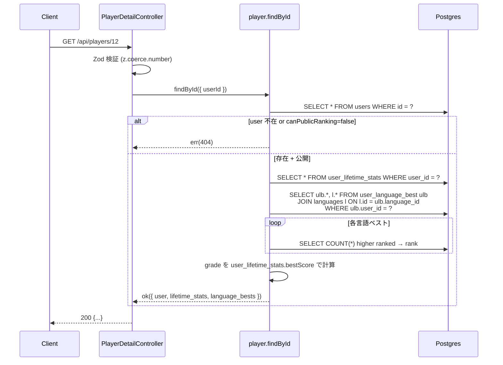

# step4: GET /api/players/:userId（プレイヤー詳細データ取得）

`player-detail.html` モックを実データで描画するためのエンドポイントを追加する。プレイヤー詳細ページ（step7）で「@sakurai_dev」のような他人のプロフィールページを開いたとき、サーバーから 1 リクエストでまとめて取得する。

## 目次

- [対象 API](#対象-api)
- [依存](#依存)
- [リクエスト](#リクエスト)
  - [Path Param](#path-param)
- [レスポンス](#レスポンス)
  - [200 OK](#200-ok)
  - [エラー](#エラー)
- [処理フロー](#処理フロー)
  - [処理の流れ](#処理の流れ)
- [集計クエリ設計](#集計クエリ設計)
- [プライバシー](#プライバシー)
- [設計方針](#設計方針)
- [対応内容](#対応内容)
- [動作確認](#動作確認)
- [次の step での利用](#次の-step-での利用)

## 対象 API

| 項目 | 値 |
|---|---|
| メソッド / パス | `GET /api/players/:userId` |
| 認証 | 不要（公開プロフィール） |
| 副作用 | なし（read-only） |
| 冪等性 | 冪等 |
| 呼び出し元 | apps/web の `/players/[userId]`（step7） |

## 依存

| 依存先 | 何を使うか | 本 step での扱い |
|---|---|---|
| step1 (`user_language_best`) | 言語別ベストの取得元 | 必須前提 |
| step2 (`UserLanguageBestRepository.findAllByUserId`) | 言語別ベスト一覧 | 本 step で同 interface に追加して再利用 |
| `user_lifetime_stats` | グレード / 累計打鍵数 / 累計セッション数 | 既存テーブル参照 |
| `User.canPublicRanking` | プライバシー | `false` のユーザーは 404 を返す |

## リクエスト

### Path Param

| パラメータ | 型 | 制約 | 説明 |
|---|---|---|---|
| `userId` | `number` | 正の整数 | `User.id` |

## レスポンス

### 200 OK

```json
{
  "user": {
    "id": 12,
    "avatar_url": "https://avatars.githubusercontent.com/u/...",
    "display_name": "sakurai_dev",
    "joined_at": "2026-01-08T00:00:00.000Z"
  },
  "lifetime_stats": {
    "best_score": 1490,
    "current_grade": {
      "level": 8,
      "name": "Fellow",
      "slug": "fellow"
    },
    "current_grade_reached_at": "2026-05-12T03:21:11.000Z",
    "streak_days": 28,
    "total_sessions": 142,
    "total_typed_chars": 512847
  },
  "language_bests": [
    {
      "language": { "id": 1, "name": "TypeScript", "slug": "typescript" },
      "accuracy": 0.98,
      "best_play_session_id": 8732,
      "played_at": "2026-06-03T02:14:08.000Z",
      "rank": 1,
      "score": 1490,
      "typed_chars": 1520
    },
    {
      "language": { "id": 2, "name": "JavaScript", "slug": "javascript" },
      "accuracy": 0.969,
      "best_play_session_id": 7891,
      "played_at": "2026-05-12T11:33:02.000Z",
      "rank": 2,
      "score": 1184,
      "typed_chars": 1221
    }
  ]
}
```

| フィールド | 型 | 説明 |
|---|---|---|
| `user.id` | int | `User.id` |
| `user.avatar_url` | string \| null | アバター URL |
| `user.display_name` | string | 表示名（null なら `user{id}`） |
| `user.joined_at` | string (ISO 8601) | `User.createdAt` |
| `lifetime_stats.best_score` | int | 全言語通算ベスト（グレード判定の基準） |
| `lifetime_stats.current_grade` | object | グレード `{ level, name, slug }` |
| `lifetime_stats.current_grade_reached_at` | string \| null | グレード到達日（Intern のままなら null） |
| `lifetime_stats.streak_days` | int | 連続プレイ日数 |
| `lifetime_stats.total_sessions` | int | 総プレイ数 |
| `lifetime_stats.total_typed_chars` | int | 累計打鍵数（BigInt を number に変換、Number.MAX_SAFE_INTEGER 範囲内なので問題なし） |
| `language_bests[]` | array | 言語別ベスト一覧（プレイ実績のある言語のみ）。`canPublicRanking=true` 内での順位を含む |
| `language_bests[].language` | object | `{ id, name, slug }` |
| `language_bests[].rank` | int | 言語別順位（リアルタイム計算） |
| `language_bests[].score` / `accuracy` / `typed_chars` / `played_at` / `best_play_session_id` | int / float / int / string / int | step1 の `user_language_best` フィールド |

### エラー

| Status | type | 条件 | クライアント挙動 |
|---|---|---|---|
| 400 | BAD_REQUEST | `userId` が数値でない | バリデーションエラー |
| 404 | NOT_FOUND | `User` 行が存在しない / `canPublicRanking=false` | 「プレイヤーが見つかりません」 |

> `canPublicRanking=false` を 403 ではなく 404 にする理由: プライバシー保護のため「ユーザーが存在するが非公開」を識別させない（存在自体を秘匿）

## 処理フロー



### 処理の流れ

1. Controller が `userId` を Zod (`z.coerce.number().int().positive()`) で検証（NG なら 400）
2. Service が `User` を取得（NG / `canPublicRanking=false` なら 404）
3. `user_lifetime_stats` を取得（無ければデフォルト値で構成）
4. `user_language_best` を Languages JOIN で全件取得（Languages 行は通常 2 件以下なので N+1 を懸念しない）
5. 各言語ベストについて step2 の `countHigherRanked` を呼び順位を算出（言語数 × クエリだが、MVP で 2 言語なので問題なし）
6. グレードは `user_lifetime_stats.bestScore` で `calcGrade` を呼ぶ
7. Controller が 200 で返す

## 集計クエリ設計

### user 取得

```typescript
const user = await prisma.user.findUnique({
  select: { avatarUrl: true, canPublicRanking: true, createdAt: true, displayName: true, id: true },
  where: { id: userId },
})
if (!user || !user.canPublicRanking) return err(notFoundError("Player not found"))
```

### 言語別ベスト一覧（言語情報込み）

```typescript
const bests = await prisma.userLanguageBest.findMany({
  include: {
    language: { select: { id: true, name: true, slug: true } },
  },
  orderBy: { language: { id: "asc" } },
  where: { userId },
})
```

### 各言語の順位算出

```typescript
const bestsWithRank = await Promise.all(
  bests.map(async (best) => {
    const higher = await prisma.userLanguageBest.count({
      where: {
        languageId: best.languageId,
        user: { canPublicRanking: true },
        OR: [
          { score: { gt: best.score } },
          { score: best.score, accuracy: { gt: best.accuracy } },
          {
            accuracy: best.accuracy,
            playedAt: { lt: best.playedAt },
            score: best.score,
          },
        ],
      },
    })
    return { ...best, rank: higher + 1 }
  }),
)
```

step2 の `UserLanguageBestRepository.countHigherRanked` をそのまま再利用。

## プライバシー

- **`canPublicRanking=false` のユーザーは 404 を返す**: ランキングから除外されている人がプロフィール直 URL でも見えると整合しない
- **自分自身が `canPublicRanking=false` の場合**: 本 API は他人の閲覧経路。自分のプロフィールは `/mypage` で別 API（step6 で実装する `/api/users/me` 関連）から表示するので、本 API では一律 404 で問題ない
- **`/players/:userId` を path param に user.id（数値）を使う理由**: GitHub username で引くと username 変更時に URL が壊れる。numeric id は不変。SEO 的な可読性は犠牲になるが、MVP では許容（将来 `/players/@sakurai_dev` のような slug ベースを追加可能）

## 設計方針

- **`language_bests` をフラットな配列で返す**: TS / JS が将来 5 言語 / 10 言語に増えても同じ構造。`{ "typescript": {...}, "javascript": {...} }` のオブジェクト形にすると key を hard-code するロジックが増えるので避ける
- **`rank` を毎リクエスト計算する理由**: step2 と同じくランキングは保存しない方針。`user_language_best` 全行に対する COUNT クエリは `@@index([languageId, score(sort: Desc)])` で軽い
- **`avatar_url` / `display_name` を `users` から都度引く理由**: GitHub アバター変更がリアルタイム反映される（step2 と同じ方針）
- **`current_grade` を `user_lifetime_stats` の slug から計算しない理由**: schema には `currentGrade: String?` が保存されているが、本 API では `calcGrade(bestScore)` で都度計算する。理由: step3 でグレード閾値変更があった場合に DB の slug と実態がずれる可能性があるため、`bestScore` から都度計算する方が常に正しい。`currentGradeReachedAt` だけは保存値を使う（履歴情報のため）
- **`total_typed_chars` を `BigInt` から `number` に変換**: JSON 表現の都合上 number に落とす。`Number.MAX_SAFE_INTEGER`（約 9 ペタ）まで安全に扱えるため、1 ユーザーの累計打鍵数では絶対に超えない
- **「最近のプレイ」「代表的なリプレイ」を返さない理由**: モックには載っているが、これは別 API（`GET /api/players/:userId/sessions` 等）に分けて step を切る方が責務が明確。本 step ではプロフィール「ヘッダー + ベスト一覧」だけに絞る。リプレイ機能自体が別フェーズ（rewards / replay）スコープなので、UI 側で placeholder 表示すれば OK
- **「獲得した特典」を返さない理由**: 同上。Rewards 機能側で `GET /api/users/:userId/achievements` のような専用 API を切る想定
- **`UserLifetimeStatsRepository.findByUserId` を `findOrDefault` にしない理由**: 「user は存在するが lifetime_stats レコードはまだ無い」というケース（プレイ前のユーザー）はあり得る。null チェックして 0 埋めのデフォルト値で組み立てる方が「無い」状態が明示的で読みやすい

## 対応内容

### `packages/schema/src/api-schema/player.ts`（新規）

```typescript
import { z } from "zod"

// ========================================================
// GET /api/players/:userId - プレイヤー詳細データ
// ========================================================

/**
 * GET /api/players/:userId の path param
 */
export const getPlayerPathParamSchema = z.object({
  userId: z.coerce.number().int().positive(),
})

const gradeSchema = z.object({
  level: z.number().int().min(1).max(8),
  name: z.string(),
  slug: z.string(),
})

const playerUserSchema = z.object({
  id: z.number().int().positive(),
  avatar_url: z.string().url().nullable(),
  display_name: z.string(),
  joined_at: z.string().datetime(),
})

const playerLifetimeStatsSchema = z.object({
  best_score: z.number().int().nonnegative(),
  current_grade: gradeSchema,
  current_grade_reached_at: z.string().datetime().nullable(),
  streak_days: z.number().int().nonnegative(),
  total_sessions: z.number().int().nonnegative(),
  total_typed_chars: z.number().int().nonnegative(),
})

const playerLanguageBestSchema = z.object({
  language: z.object({
    id: z.number().int().positive(),
    name: z.string(),
    slug: z.string(),
  }),
  accuracy: z.number().min(0).max(1),
  best_play_session_id: z.number().int().positive(),
  played_at: z.string().datetime(),
  rank: z.number().int().min(1),
  score: z.number().int().nonnegative(),
  typed_chars: z.number().int().nonnegative(),
})

/**
 * GET /api/players/:userId のレスポンス
 */
export const getPlayerResponseSchema = z.object({
  language_bests: z.array(playerLanguageBestSchema),
  lifetime_stats: playerLifetimeStatsSchema,
  user: playerUserSchema,
})

export type GetPlayerPathParam = z.infer<typeof getPlayerPathParamSchema>
export type GetPlayerResponse = z.infer<typeof getPlayerResponseSchema>
```

### `packages/schema/src/api-schema/index.ts`（編集）

```typescript
export * from "./player"
```

### `apps/api/src/repository/prisma/user-language-best-repository.ts`（編集）

interface に `findAllByUserId` を追加：

```typescript
export type UserLanguageBestWithLanguage = MyLanguageBest & {
    language: { id: number; name: string; slug: string }
    languageId: number
}

export interface UserLanguageBestRepository {
    /** 既存 */
    findTopByLanguage(...): Promise<UserLanguageBestWithUser[]>
    findMine(...): Promise<MyLanguageBest | null>
    countHigherRanked(...): Promise<number>
    countRankableByLanguage(...): Promise<number>
    /** step3 */
    upsertIfBest(...): Promise<UpsertIfBestResult>
    findTenthScore(...): Promise<number | null>
    /** 本 step */
    findAllByUserId(userId: number): Promise<UserLanguageBestWithLanguage[]>
}

async findAllByUserId(userId: number): Promise<UserLanguageBestWithLanguage[]> {
  const rows = await this._prisma.userLanguageBest.findMany({
    include: {
      language: { select: { id: true, name: true, slug: true } },
    },
    orderBy: { language: { id: "asc" } },
    where: { userId },
  })
  return rows.map((row) => ({
    accuracy: row.accuracy,
    bestPlaySessionId: row.bestPlaySessionId,
    language: row.language,
    languageId: row.languageId,
    playedAt: row.playedAt,
    score: row.score,
    typedChars: row.typedChars,
  }))
}
```

### `apps/api/src/repository/prisma/user-repository.ts`（編集 - メソッド追加）

```typescript
export type PublicProfileUser = {
    avatarUrl: string | null
    canPublicRanking: boolean
    createdAt: Date
    displayName: string
    id: number
}

async findPublicProfile(userId: number): Promise<PublicProfileUser | null> {
  const row = await this._prisma.user.findUnique({
    select: { avatarUrl: true, canPublicRanking: true, createdAt: true, displayName: true, id: true },
    where: { id: userId },
  })
  if (row === null) return null
  return {
    avatarUrl: row.avatarUrl,
    canPublicRanking: row.canPublicRanking,
    createdAt: row.createdAt,
    displayName: row.displayName ?? `user${row.id}`,
    id: row.id,
  }
}
```

### `apps/api/src/repository/prisma/user-lifetime-stats-repository.ts`（編集 - メソッド追加）

```typescript
export type LifetimeStatsRead = {
    bestScore: number
    currentGradeReachedAt: Date | null
    streakDays: number
    totalSessions: number
    totalTypedChars: bigint
}

async findByUserId(userId: number): Promise<LifetimeStatsRead | null> {
  const row = await this._prisma.userLifetimeStats.findUnique({ where: { userId } })
  if (row === null) return null
  return {
    bestScore: row.bestScore,
    currentGradeReachedAt: row.currentGradeReachedAt,
    streakDays: row.streakDays,
    totalSessions: row.totalSessions,
    totalTypedChars: row.totalTypedChars,
  }
}
```

### `apps/api/src/service/player-service.ts`（新規）

```typescript
import { logger } from "@repo/logger"

import { calcGrade, type Grade } from "../lib/grade"
import type { UserLanguageBestRepository } from "../repository/prisma/user-language-best-repository"
import type { UserLifetimeStatsRepository } from "../repository/prisma/user-lifetime-stats-repository"
import type { UserRepository } from "../repository/prisma/user-repository"
import { err, notFoundError, ok, type Result } from "../types/result"

export type PlayerDetailResult = {
    languageBests: Array<{
        accuracy: number
        bestPlaySessionId: number
        language: { id: number; name: string; slug: string }
        playedAt: Date
        rank: number
        score: number
        typedChars: number
    }>
    lifetimeStats: {
        bestScore: number
        currentGrade: Grade
        currentGradeReachedAt: Date | null
        streakDays: number
        totalSessions: number
        totalTypedChars: number
    }
    user: {
        avatarUrl: string | null
        displayName: string
        id: number
        joinedAt: Date
    }
}

export const findById = async (
  input: { userId: number },
  repo: {
        userLanguageBestRepository: UserLanguageBestRepository
        userLifetimeStatsRepository: UserLifetimeStatsRepository
        userRepository: UserRepository
    },
): Promise<Result<PlayerDetailResult>> => {
  logger.debug("player.findById", { userId: input.userId })

  const user = await repo.userRepository.findPublicProfile(input.userId)
  if (user === null || !user.canPublicRanking) {
    return err(notFoundError("Player not found"))
  }

  const lifetime = await repo.userLifetimeStatsRepository.findByUserId(input.userId)
  const bestScore = lifetime?.bestScore ?? 0
  const grade = calcGrade(bestScore)

  const bests = await repo.userLanguageBestRepository.findAllByUserId(input.userId)
  const bestsWithRank = await Promise.all(
    bests.map(async (b) => {
      const higher = await repo.userLanguageBestRepository.countHigherRanked(b.languageId, {
        accuracy: b.accuracy,
        bestPlaySessionId: b.bestPlaySessionId,
        playedAt: b.playedAt,
        score: b.score,
        typedChars: b.typedChars,
      })
      return {
        accuracy: b.accuracy,
        bestPlaySessionId: b.bestPlaySessionId,
        language: b.language,
        playedAt: b.playedAt,
        rank: higher + 1,
        score: b.score,
        typedChars: b.typedChars,
      }
    }),
  )

  return ok({
    languageBests: bestsWithRank,
    lifetimeStats: {
      bestScore,
      currentGrade: grade,
      currentGradeReachedAt: lifetime?.currentGradeReachedAt ?? null,
      streakDays: lifetime?.streakDays ?? 0,
      totalSessions: lifetime?.totalSessions ?? 0,
      totalTypedChars: Number(lifetime?.totalTypedChars ?? 0n),
    },
    user: {
      avatarUrl: user.avatarUrl,
      displayName: user.displayName,
      id: user.id,
      joinedAt: user.createdAt,
    },
  })
}
```

### `apps/api/src/service/index.ts`（編集）

```typescript
export * as player from "./player-service"
```

### `apps/api/src/controller/player/detail.ts`（新規）

```typescript
import type { Request, Response } from "express"

import {
  getPlayerPathParamSchema,
  getPlayerResponseSchema,
  type GetPlayerResponse,
} from "@repo/api-schema"

import type { UserLanguageBestRepository } from "../../repository/prisma/user-language-best-repository"
import type { UserLifetimeStatsRepository } from "../../repository/prisma/user-lifetime-stats-repository"
import type { UserRepository } from "../../repository/prisma/user-repository"
import * as service from "../../service"
import type { ErrorResponse } from "../../types/error"

export class PlayerDetailController {
  constructor(
    private _userLanguageBestRepository: UserLanguageBestRepository,
    private _userLifetimeStatsRepository: UserLifetimeStatsRepository,
    private _userRepository: UserRepository,
  ) {}

  execute = async (req: Request, res: Response) => {
    const { userId } = getPlayerPathParamSchema.parse(req.params)
    const result = await service.player.findById(
      { userId },
      {
        userLanguageBestRepository: this._userLanguageBestRepository,
        userLifetimeStatsRepository: this._userLifetimeStatsRepository,
        userRepository: this._userRepository,
      },
    )
    if (!result.ok) {
      const errorResponse: ErrorResponse = {
        error: result.error.message,
        status_code: result.error.statusCode,
      }
      return res.status(result.error.statusCode).json(errorResponse)
    }

    const response: GetPlayerResponse = {
      language_bests: result.value.languageBests.map((b) => ({
        accuracy: b.accuracy,
        best_play_session_id: b.bestPlaySessionId,
        language: b.language,
        played_at: b.playedAt.toISOString(),
        rank: b.rank,
        score: b.score,
        typed_chars: b.typedChars,
      })),
      lifetime_stats: {
        best_score: result.value.lifetimeStats.bestScore,
        current_grade: {
          level: result.value.lifetimeStats.currentGrade.level,
          name: result.value.lifetimeStats.currentGrade.name,
          slug: result.value.lifetimeStats.currentGrade.slug,
        },
        current_grade_reached_at: result.value.lifetimeStats.currentGradeReachedAt?.toISOString() ?? null,
        streak_days: result.value.lifetimeStats.streakDays,
        total_sessions: result.value.lifetimeStats.totalSessions,
        total_typed_chars: result.value.lifetimeStats.totalTypedChars,
      },
      user: {
        id: result.value.user.id,
        avatar_url: result.value.user.avatarUrl,
        display_name: result.value.user.displayName,
        joined_at: result.value.user.joinedAt.toISOString(),
      },
    }
    return res.status(200).json(getPlayerResponseSchema.parse(response))
  }
}
```

### `apps/api/src/routes/player-router.ts`（新規）

```typescript
import { Router } from "express"

import type { PlayerDetailController } from "../controller/player/detail"

type PlayerRouterControllers = {
    detail?: PlayerDetailController
}

export const playerRouter = (controllers: PlayerRouterControllers): Router => {
  const router = Router()
  if (controllers.detail) {
    router.get("/:userId", (req, res) => controllers.detail!.execute(req, res))
  }
  return router
}
```

### `apps/api/src/index.ts`（編集）

```typescript
import { PlayerDetailController } from "./controller/player/detail"
import { playerRouter } from "./routes/player-router"

const playerDetailController = new PlayerDetailController(
  userLanguageBestRepository,
  userLifetimeStatsRepository,
  userRepository,
)
app.use("/api/players", playerRouter({ detail: playerDetailController }))
```

`PUBLIC_PATHS` に `/api/players` を追加（公開エンドポイント）：

```typescript
const PUBLIC_PATHS = [
  // ... 既存
  "/api/players",
]
```

> Express の `PUBLIC_PATHS` が prefix match なら `/api/players` 1 行で全 `:userId` を許可できる。完全一致なら正規表現対応の別ロジックが必要

## 動作確認

| 区分 | 内容 |
|---|---|
| 存在するプレイヤー | seed 後 `curl http://localhost:8080/api/players/1` → 200、`user` / `lifetime_stats` / `language_bests` 全て返る |
| 言語別ベスト 0 件 | プレイ前のユーザー → 200、`language_bests=[]`、`lifetime_stats.best_score=0`、grade=Intern |
| `canPublicRanking=false` | 該当ユーザー → 404 |
| 存在しない userId | `curl /api/players/9999999` → 404 |
| `userId` 不正 | `curl /api/players/abc` → 400 |
| 順位の即時性 | テストユーザー 3 人に異なるスコアで seed → 各 user の言語別 rank が 1/2/3 で正しく返る |
| Service ユニットテスト | `apps/api/test/service/player-service/findById.test.ts`、正常系 2 + 異常系 2 |
| Controller インテグレーションテスト | `apps/api/test/controller/player/detail.test.ts`、実 Postgres |
| Lint / Build | `pnpm lint && pnpm build && pnpm test` |

### Controller インテグレーションテスト例

```typescript
describe("GET /api/players/:userId", () => {
  describe("正常系", () => {
    it("公開ユーザーの詳細を返す", async () => {
      const user = await testPrisma.user.create({
        data: { canPublicRanking: true, displayName: "sakurai_dev" },
      })
      await testPrisma.userLifetimeStats.create({
        data: { bestScore: 1490, currentGrade: "fellow", streakDays: 28, totalSessions: 142, totalTypedChars: 512847n, userId: user.id },
      })
      // ... language seed + user_language_best seed

      const res = await request(app).get(`/api/players/${user.id}`)
      expect(res.status).toBe(200)
      expect(res.body).toEqual({
        language_bests: expect.any(Array),
        lifetime_stats: expect.objectContaining({
          best_score: 1490,
          current_grade: { level: 8, name: "Fellow", slug: "fellow" },
          total_typed_chars: 512847,
        }),
        user: expect.objectContaining({ display_name: "sakurai_dev" }),
      })
    })
  })

  describe("異常系", () => {
    it("canPublicRanking=false なら 404", async () => {
      const user = await testPrisma.user.create({ data: { canPublicRanking: false } })
      const res = await request(app).get(`/api/players/${user.id}`)
      expect(res.status).toBe(404)
    })

    it("存在しない userId で 404", async () => {
      const res = await request(app).get("/api/players/999999")
      expect(res.status).toBe(404)
    })

    it("userId が数値でないと 400", async () => {
      const res = await request(app).get("/api/players/abc")
      expect(res.status).toBe(400)
    })
  })
})
```

## 次の step での利用

- **step7 (`/players/[userId]` 画面)**: 本 API を Server Component から叩いて `player-detail.html` モックに沿って描画
- **step5 (`/ranking` 画面)**: 各エントリの `user.id` から `/players/${id}` へのリンクを作る（API は本 step、UI は step5/7）
- **Rewards 機能（将来）**: 同 API レスポンスに `achievements: [...]` 等を後付けする。本 step では未実装、レスポンス schema が拡張可能なので将来追加できる
