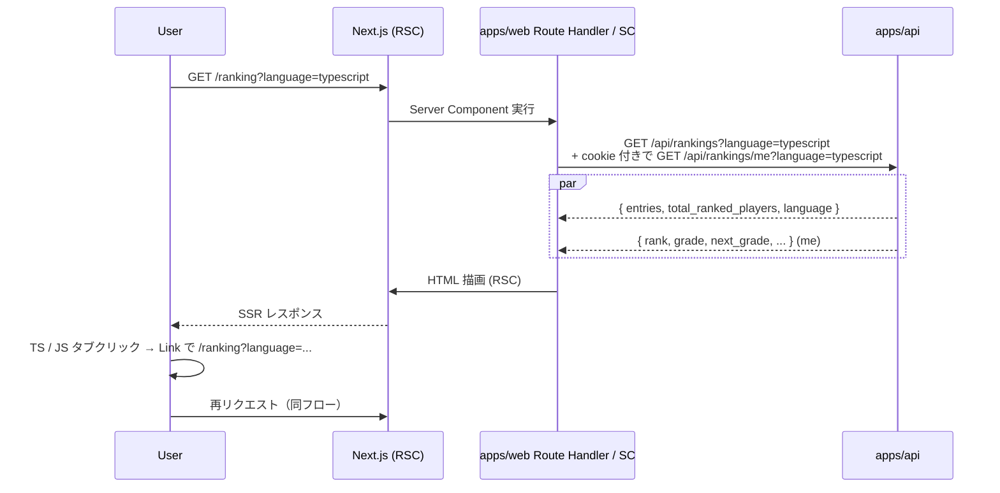

# step5: /ranking 新規画面（言語タブ + TOP 10 表 + 自分の状況）

`docs/mocks/ranking.html` モックに沿って `/ranking` ページを Next.js App Router で実装する。step2 で実装した `GET /api/rankings` と `GET /api/rankings/me` を Server Component から叩いて TOP 10 を SSR、言語タブは Client Component で切替。

## 目次

- [対象画面・呼び出し API](#対象画面呼び出し-api)
- [参考モック](#参考モック)
- [依存](#依存)
- [画面の状態モデル](#画面の状態モデル)
- [画面遷移とデータフロー](#画面遷移とデータフロー)
  - [処理の流れ](#処理の流れ)
- [設計方針](#設計方針)
- [対応内容](#対応内容)
- [動作確認](#動作確認)
- [次の step での利用](#次の-step-での利用)

## 対象画面・呼び出し API

### 画面（Next.js Route）

| Route | コンポーネント | 概要 |
|---|---|---|
| `/ranking` | Server Component + 言語タブ用 Client Component | 言語別の **月間ランキング**（`GetMonthlyRankingsResponse`）+ 自分の状況 |
| `/ranking?language=javascript` | 同上 | JavaScript タブの SSR 専用 URL |

> `/ranking` ページは **月間ランキング** を表示する。全期間 TOP 10 の表示は `/hall-of-fame` に集約されている。

### 呼び出す API

| メソッド / パス | 呼び出すタイミング | 経路 | 認証 |
|---|---|---|---|
| `GET /api/rankings/monthly?language=...` | ページ表示時 | Server Component → `apiClient.get()` → Express | 不要 |
| `GET /api/rankings/me?language=...` | ログイン時のみ、サイドバー描画用 | Server Component（cookie 経由）→ Express | 必須（cookie 自動転送） |

## 参考モック

| 画面 | モックファイル | 反映すべき要素 |
|---|---|---|
| `/ranking` | [`docs/mocks/ranking.html`](../../mocks/ranking.html) | ヘッダー（タイトル + 補足）/ 言語 pills / `.table` の列構成 / `.rank-badge.gold/silver/bronze` / `.player-cell` / `.badge-grade.{slug}` / 自分の行 `.me` ハイライト / sidebar の「あなたの状況」「ランキング仕様」 |

### モックから読み取った主要構造

- レイアウト: `.container` 内に `.row > .col + .col-sidebar` の 2 ペイン。SP（コーディング不要）でもレスポンシブ済み
- カラー / バッジ: `.rank-badge` の 1〜3 位は gold / silver / bronze、それ以降は無印。`badge-grade` は `data-level` 属性付き
- タイポ: 数値列は `.text-mono` 等高フォント、`.numeric` クラス（既存 globals.css 完備）
- 動き: pills のアクティブは `?language=...` query param で切替（同一ページ再 fetch、SSR）。スクロールは無し
- 既存 globals.css の活用: `.pill` `.table` `.player-cell` `.rank-badge.gold/silver/bronze` `.badge-grade.{slug}` `.me` 全て typing-engine PR #20 で移植済み
- モック「snapshot: 2026-06-03 15:00 JST (14 分前)」表示は **廃止**（リアルタイム集計のため）。代わりに「現在のランキング」と表示

## 依存

| 依存先 | 何を使うか | 本 step での扱い |
|---|---|---|
| step2 (`GET /api/rankings`) | TOP 10 取得 | 必須前提 |
| step2 (`GET /api/rankings/me`) | 自分の順位 + グレード | 必須前提（ログイン時のみ） |
| 既存 `apiClient` (`apps/web/src/libs/api-client.ts`) | サーバー間通信 | 流用 |
| 既存 `Topbar`（apps/web/src/components/topbar.tsx） | ヘッダー | `active="ranking"` を追加 |
| 既存 `computeGradeProgress`（apps/web/src/libs/grade.ts） | サイドバーの進捗バー | 流用（既存実装） |

## 画面の状態モデル

| state | 値 | UI |
|---|---|---|
| `language` | `typescript` / `javascript` | URL `?language=...` で永続化、pills のアクティブ |
| `entries` | `Array<rankingEntry>` (≤10) | テーブル本体。0 件なら「まだランキングがありません」プレースホルダ |
| `me` | `GetMyRankingResponse \| null` | サイドバーの「あなたの状況」。null なら未ログイン用カードを出す |
| `total_ranked_players` | int | テーブル末尾「N 人中」表示 |

サーバー側で `entries` + `me` をまとめて取得して props で渡すため、Client Component は表示専用。

## 画面遷移とデータフロー



### 処理の流れ

1. ユーザーが `/ranking`（または `?language=js`）に遷移
2. Server Component が URL の `searchParams.language` を受け取り、未指定なら `typescript` をデフォルトに
3. `apiClient.get('/api/rankings', { language })` を呼ぶ（公開 API、cookie 不要）
4. ログイン cookie があれば `apiClient.get('/api/rankings/me', { language })` も並列で叩く（401 なら null）
5. テーブル + sidebar を SSR
6. 言語タブはサーバー側 Link でリンク (`<Link href="/ranking?language=javascript">`) → クリックで Next.js が同じ RSC を再実行

## 設計方針

- **Server Component で fetch する理由**: 公開ランキングは SEO 対象。SSR された HTML に TOP 10 が含まれている方が OGP/検索エンジン的に有利。CSR で API 叩く必要が無い
- **言語タブを query param ベースにする理由**: pushState で扱うとブラウザバック / リフレッシュで状態が戻らない。`?language=` ベースなら共有 URL でも特定タブが復元される
- **`apiClient.get` で並列 fetch する理由**: TOP 10 取得と自分の順位取得を `Promise.all` で並列化、レイテンシ削減
- **未ログイン時のサイドバー**: 「あなたの状況」カードを「ログインするとあなたの順位が表示されます」リンク付きに差し替え。ログイン誘導
- **`canPublicRanking=false` の自分**: `/api/rankings/me` は自分の順位を返す（step2 仕様）。サイドバーで「順位は公開されていません」というバナーを併記
- **`entries=[]` のときの空表示**: 「まだランキングがありません。最初のプレイヤーになろう」+「プレイ開始」ボタン。新サービス立ち上げ時の初期体験を成立させる
- **モック「snapshot: 14 分前」を廃止**: リアルタイム集計のため snapshot 時刻が無い。代わりに「現在のランキング」と表示
- **Next.js のキャッシュ**: ランキングは頻繁に変わるので `fetch` 時に `cache: "no-store"` を渡す（または Next.js のデフォルト「動的レンダリング」に任せる）。SSR でも毎リクエスト最新を返す
- **モック内「⏱ 毎時バッチ集計 · トップ 1000 位まで」テキスト**: 廃止（毎時バッチではないため）。代わりに「現在の順位を即時表示」のような正しい説明文に置き換え
- **`.rank-badge` の表示**: 1 位 = `.gold`、2 位 = `.silver`、3 位 = `.bronze`、それ以外は無印（既存 CSS）。`<span className={\`rank-badge ${rank <= 3 ? rankMedalClass(rank) : ""}\`}>` のように書く
- **「リプレイ」ボタン**: モックには `<a className="badge accent">▶</a>` のリンクがあるが、リプレイ機能は別フェーズ。本 step では `<button disabled>` または `placeholder` テキストにして UI 自体は残す（後続フェーズで `<Link href={\`/replays/${id}\`}>` に置き換え）

## 対応内容

### `apps/web/src/libs/api-client.ts`（編集 - ヘルパー確認）

既存 `apiClient` に GET ヘルパが無ければ追加。既にある場合は変更不要：

```typescript
export const apiClient = {
  async get<T>(path: string, query?: Record<string, string | number>, opts?: { cookie?: string }): Promise<T> {
    const url = new URL(`${API_BASE_URL}${path}`)
    if (query) {
      for (const [k, v] of Object.entries(query)) url.searchParams.set(k, String(v))
    }
    const res = await fetch(url.toString(), {
      cache: "no-store",
      headers: opts?.cookie ? { Cookie: opts.cookie } : {},
    })
    if (!res.ok) throw new Error(`API error: ${res.status}`)
    return res.json() as Promise<T>
  },
  // ... post / etc
}
```

### `apps/web/src/app/ranking/page.tsx`（新規）

```typescript
import type { Metadata } from "next"
import { cookies } from "next/headers"
import Link from "next/link"

import { GetMyRankingResponse, GetRankingsResponse } from "@repo/api-schema"

import { RankingTable } from "@/components/ranking-table"
import { MyRankingSidebar } from "@/components/my-ranking-sidebar"
import { Topbar } from "@/components/topbar"
import { apiClient } from "@/libs/api-client"

export const metadata: Metadata = {
  title: "ランキング - Typing Royale",
}

type Search = { language?: string }

const SUPPORTED_LANGUAGES = ["typescript", "javascript"] as const

export default async function RankingPage({
  searchParams,
}: {
    searchParams: Promise<Search>
}) {
  const { language: rawLang } = await searchParams
  const language = SUPPORTED_LANGUAGES.includes(rawLang as never)
    ? (rawLang as (typeof SUPPORTED_LANGUAGES)[number])
    : "typescript"

  const cookieHeader = (await cookies()).toString()

  /** 並列 fetch */
  const [rankings, me] = await Promise.all([
    apiClient.get<GetRankingsResponse>("/api/rankings", { language }),
    cookieHeader.includes("app_access_token=")
      ? apiClient.get<GetMyRankingResponse>("/api/rankings/me", { language }, { cookie: cookieHeader }).catch(() => null)
      : Promise.resolve(null),
  ])

  return (
    <>
      <Topbar active="ranking" />

      <div className="container">
        <div className="flex-between mb-24">
          <h1>🏆 全期間ランキング</h1>
          <div className="text-sm text-muted">現在の順位を即時表示</div>
        </div>

        <div className="flex-between mb-16">
          <div className="pills">
            <Link
              className={`pill ${language === "typescript" ? "active" : ""}`}
              href="/ranking?language=typescript"
            >
              TypeScript
            </Link>
            <Link
              className={`pill ${language === "javascript" ? "active" : ""}`}
              href="/ranking?language=javascript"
            >
              JavaScript
            </Link>
          </div>
          <div className="text-sm text-muted">
            {rankings.total_ranked_players.toLocaleString()} 人がランキング対象
          </div>
        </div>

        <div className="row">
          <div className="col">
            <RankingTable entries={rankings.entries} meUserId={me?.rank !== null ? me?.best_play_session_id : null} />

            {rankings.entries.length === 0 && (
              <div className="card text-center mt-16" style={{ padding: "48px 16px" }}>
                <div className="text-mono text-muted mb-16">
                  まだランキングがありません
                </div>
                <Link className="btn btn-primary btn-play" href="/play">
                  ▶ 最初のプレイヤーになる
                </Link>
              </div>
            )}

            <div className="text-center mt-16">
              <Link className="btn btn-primary btn-play btn-large" href="/play">
                ▶ プレイしてランクアップ
              </Link>
            </div>
          </div>

          <aside className="col-sidebar">
            <MyRankingSidebar language={language} me={me} totalPlayers={rankings.total_ranked_players} />

            <div className="card mb-16" style={{ borderColor: "rgba(210, 153, 34, 0.3)" }}>
              <div className="card-header">
                <div className="card-title">⚠ ランキングの仕様</div>
              </div>
              <ul className="text-sm text-muted" style={{ display: "grid", gap: "6px", paddingLeft: "18px" }}>
                <li>全期間（オールタイム）のみ集計</li>
                <li>1 プレイヤーにつきベスト 1 件をランキング</li>
                <li>同点時は正確率 → 達成日時の順で決定</li>
                <li>順位はリアルタイムで更新（バッチ集計なし）</li>
              </ul>
            </div>
          </aside>
        </div>
      </div>

      <div className="footer">
        <Link href="/">トップに戻る</Link>
      </div>
    </>
  )
}
```

### `apps/web/src/components/ranking-table.tsx`（新規）

```typescript
import Link from "next/link"

import type { GetMonthlyRankingsResponse } from "@repo/api-schema"

import { gradeBadgeClass } from "@/libs/grade"

type Entry = GetMonthlyRankingsResponse["entries"][number]

type Props = {
    entries: Entry[]
    /**
     * 自分のエントリを見分けるための userId（未ログイン or 圏外なら null）
     */
    meUserId: number | null
}

/**
 * mock: ranking.html のテーブル構造を踏襲（月間ランキング 5 列構成: 順位 / プレイヤー / グレード / スコア / 正確率）
 */
export function RankingTable({ entries, meUserId }: Props) {
  if (entries.length === 0) return null

  return (
    <div className="card mb-16">
      <table className="table">
        <thead>
          <tr>
            <th style={{ width: "48px" }}>順位</th>
            <th>プレイヤー</th>
            <th>グレード</th>
            <th className="numeric">スコア</th>
            <th className="numeric">正確率</th>
          </tr>
        </thead>
        <tbody>
          {entries.map((e) => (
            <tr className={meUserId === e.user.id ? "me" : ""} key={e.user.id}>
              <td>
                <span className={`rank-badge ${rankMedalClass(e.rank)}`}>#{e.rank}</span>
              </td>
              <td>
                <div className="player-cell">
                  <Avatar entry={e} />
                  <Link href={`/players/${e.user.id}`}>
                    <strong>@{e.user.github_username ?? `user${e.user.id}`}</strong>
                  </Link>
                </div>
              </td>
              <td>
                <span
                  className={`badge-grade ${gradeBadgeClass(e.user.current_grade)}`}
                  data-level={gradeLevel(e.user.current_grade)}
                >
                  {capitalize(e.user.current_grade)}
                </span>
              </td>
              <td className="numeric"><strong>{e.score.toLocaleString()}</strong></td>
              <td className="numeric">{(e.accuracy * 100).toFixed(1)}%</td>
            </tr>
          ))}
        </tbody>
      </table>
    </div>
  )
}

const rankMedalClass = (rank: number): string => {
  if (rank === 1) return "gold"
  if (rank === 2) return "silver"
  if (rank === 3) return "bronze"
  return ""
}

const Avatar = ({ entry }: { entry: Entry }) => {
  const name = entry.user.github_username ?? `user${entry.user.id}`
  const initials = name.slice(0, 2).toUpperCase()
  return entry.user.avatar_url === null
    ? <span className="avatar sm">{initials}</span>
    : 
}

const gradeLevel = (slug: string): number => {
  const levels: Record<string, number> = {
    distinguished: 7,
    fellow: 8,
    intern: 1,
    junior: 2,
    mid: 3,
    principal: 6,
    senior: 4,
    staff: 5,
  }
  return levels[slug] ?? 1
}

const capitalize = (slug: string): string => slug.charAt(0).toUpperCase() + slug.slice(1)
```

### `apps/web/src/components/my-ranking-sidebar.tsx`（新規）

```typescript
import Link from "next/link"

import type { GetMyRankingResponse } from "@repo/api-schema"

import { gradeBadgeClass } from "@/libs/grade"

type Props = {
    language: string
    me: GetMyRankingResponse | null
    totalPlayers: number
}

/**
 * mock: ranking.html の「あなたの状況」カード
 * 未ログイン / ベスト未保存 / 通常表示 の 3 パターンを描き分ける
 */
export function MyRankingSidebar({ language, me, totalPlayers }: Props) {
  /** 未ログイン */
  if (me === null) {
    return (
      <div className="card mb-16">
        <div className="card-header">
          <div className="card-title">あなたの状況</div>
        </div>
        <p className="text-sm text-muted text-center mb-16">
          ログインするとあなたの順位とグレードが表示されます
        </p>
        <Link className="btn btn-primary btn-block" href="/sign-in">
          GitHub でログイン
        </Link>
      </div>
    )
  }

  const langLabel = language === "typescript" ? "TypeScript" : "JavaScript"

  /** ベスト未保存 */
  if (me.rank === null || me.best_score === null) {
    return (
      <div className="card mb-16">
        <div className="card-header">
          <div className="card-title">あなたの状況</div>
        </div>
        <p className="text-sm text-muted text-center mb-16">
          {langLabel} はまだプレイ履歴がありません
        </p>
        <Link className="btn btn-primary btn-play btn-block" href="/play">
          ▶ プレイしてランクアップ
        </Link>
      </div>
    )
  }

  const progress = me.next_grade === null
    ? 1
    : (me.best_score - thresholdFor(me.grade.slug))
        / (thresholdFor(me.next_grade.slug) - thresholdFor(me.grade.slug))

  return (
    <div className="card mb-16">
      <div className="card-header">
        <div className="card-title">あなたの状況</div>
      </div>
      <div className="text-center mb-16">
        <div className="text-mono" style={{ color: "var(--accent)", fontSize: "36px", fontWeight: 700 }}>
                    #{me.rank}
        </div>
        <div className="text-sm text-muted">
          {langLabel} · 全期間 / {totalPlayers.toLocaleString()} 人中
        </div>
      </div>
      <div className="text-center mb-16">
        <span className={`badge-grade ${gradeBadgeClass(me.grade.name)}`} data-level={me.grade.level}>
          {me.grade.name}
        </span>
      </div>
      <div className="text-sm">
        <div className="flex-between mb-8">
          <span className="text-muted">ベストスコア</span>
          <span className="text-mono">{me.best_score} pts</span>
        </div>
        {me.next_grade !== null && (
          <div className="flex-between">
            <span className="text-muted">次の <strong style={{ color: "var(--gold-light)" }}>{me.next_grade.name}</strong> まで</span>
            <span className="text-mono" style={{ color: "var(--gold)" }}>
                            あと {me.next_grade.score_needed} pts
            </span>
          </div>
        )}
      </div>
      {me.next_grade !== null && (
        <>
          <div className="progress mt-8">
            <div
              className="progress-fill"
              style={{
                background: "linear-gradient(180deg, rgba(255,255,255,0.45) 0%, transparent 45%, rgba(0,0,0,0.15) 100%), linear-gradient(180deg, #d8b9ff 0%, #9659e8 100%)",
                width: `${(Math.max(0, Math.min(1, progress)) * 100).toFixed(1)}%`,
              }}
            />
          </div>
          <div className="text-sm text-muted text-center mt-8">
            {thresholdFor(me.grade.slug)} ← <strong style={{ color: "var(--text-primary)" }}>{me.best_score}</strong> → {thresholdFor(me.next_grade.slug)}
          </div>
        </>
      )}
    </div>
  )
}

const thresholdFor = (slug: string): number => {
  const map: Record<string, number> = {
    distinguished: 1000,
    fellow: 1200,
    intern: 0,
    junior: 100,
    mid: 250,
    principal: 800,
    senior: 400,
    staff: 600,
  }
  return map[slug] ?? 0
}
```

### `apps/web/src/components/topbar.tsx`（編集）

`active="ranking"` プロパティで「ランキング」リンクをアクティブにする分岐を追加（既存 `active="home"` などと同じパターン）：

```typescript
type Props = {
    active?: "home" | "ranking" | "hall-of-fame" | "mypage"
    /** 既存 */
    languageBadge?: string
    modeBadge?: string
}

// nav 内
<Link className={active === "ranking" ? "active" : ""} href="/ranking">ランキング</Link>
```

### `apps/web/src/app/page.tsx`（編集）

トップページの「全期間トップ」placeholder を本物のランキングプレビューに置き換え（任意、別 PR でも OK）：

```typescript
const topRankings = await apiClient.get<GetRankingsResponse>("/api/rankings", { language: "typescript", limit: 3 })

// placeholder セクションを置き換え
<div className="card mb-24">
  <div className="card-header">
    <div className="card-title">🏆 全期間トップ</div>
    <Link className="text-sm" href="/ranking">すべて見る →</Link>
  </div>
  {topRankings.entries.slice(0, 3).map((e) => (
    <div className="flex-between mb-8" key={e.user.id}>
      <span>#{e.rank} @{e.user.display_name}</span>
      <span className="text-mono">{e.score} pts</span>
    </div>
  ))}
</div>
```

## 動作確認

| 区分 | 内容 |
|---|---|
| 未ログインで /ranking 表示 | `entries` が無くても「最初のプレイヤーになる」placeholder が出る、サイドバーは「ログイン誘導」 |
| ログイン + ベスト保存後 | サイドバーに自分の順位 / グレード / 進捗バーが表示、テーブルの自分の行が `.me` クラスでハイライト |
| 言語タブ切替 | `?language=javascript` リンククリックで JS タブに切り替わる、TS ベストが non-null でも JS タブでは自分が空表示 |
| 不正な language | `?language=python` → デフォルトの typescript にフォールバック（API は呼ばない / 呼んで 404 catch） |
| Playwright MCP | `verify-web-page` skill で /ranking と /ranking?language=javascript の両方をスクショ、コンソール error 0 件、見出し / pills / テーブル / sidebar が正常レンダリング |
| Lint / Build | `pnpm lint && pnpm build` |

### Playwright MCP 確認手順

1. `mcp__playwright__browser_navigate` で `http://localhost:3000/ranking`
2. `mcp__playwright__browser_console_messages` で `level: "error"` 0 件確認
3. `mcp__playwright__browser_snapshot` で `<h1>🏆 全期間ランキング</h1>` / pills / テーブル / sidebar の要素確認
4. `mcp__playwright__browser_click` で「JavaScript」pill をクリック
5. URL が `?language=javascript` に変わったことを確認、JS タブの内容が描画される
6. `mcp__playwright__browser_take_screenshot` で before/after を `docs/screenshots/score-ranking/ranking-page-{before,after}.png` に保存
7. before は本 step 着手前に main で取得（言語タブのある現在のページが無い状態）

## 次の step での利用

- **step6 (`/play/[sessionId]` リザルト + `/mypage`)**: 本 step で実装した `MyRankingSidebar` の進捗バー計算ロジック（`thresholdFor` / `progress` 計算）はリザルト画面でも再利用可能。`apps/web/src/libs/grade.ts` の `computeGradeProgress` と統一する（重複を整理）
- **step7 (`/players/[userId]` 画面)**: 本 step のランキングテーブルの `<Link href={\`/players/${user.id}\`}>` 動線で遷移する
- **Rewards 機能（将来）**: 本 step のテーブルの「▶ リプレイ」ボタンを `<Link href={\`/replays/${bestPlaySessionId}\`}>` に置き換え
