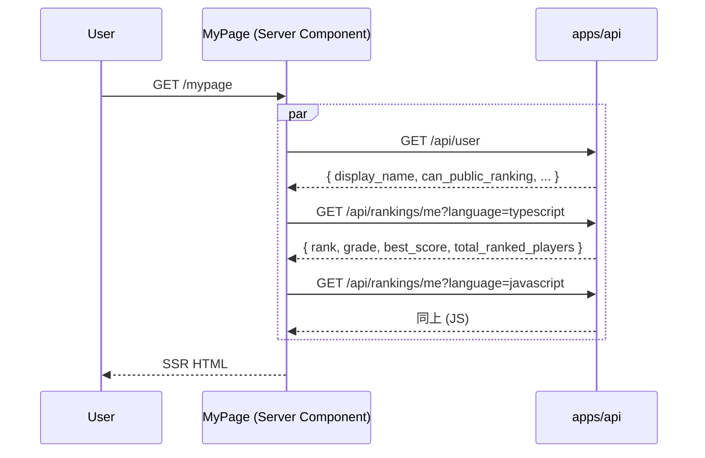

# step6: リザルト画面のランキング表示 + マイページのグレード/ランキング表示

step3 で `/finish` レスポンスに追加された順位/グレード情報と、step2 で実装した `GET /api/rankings/me` を使って:

1. **リザルト画面（`/play/[sessionId]`）**: 現状の placeholder を実データに置き換え
   - 「順位は集計後に表示されます」→ 実際の `new_rank` / `total_ranked_players`
   - グレード進捗を「今回のスコア基準」から「`/finish` レスポンスの `grade_up` + サーバー側で確定したベストスコア」に修正
   - `grade_up !== null` のとき祝賀演出（バッジを輝かせる程度の軽い表現）
   - `score > top_ten_boundary_score` のとき TOP 10 入りの予告バナーを出す（モーダル本体は Rewards 機能側）

2. **マイページ（`/mypage`）**: 現状の placeholder を実データに置き換え
   - 4-stat (ベストスコア / 累計文字数 / 総プレイ数 / 平均正確率)
   - エンジニアグレード進捗カード
   - 全期間ランキング表（言語別 ベスト / 順位 / 状態）
   - 「最近のプレイ」は本 step では placeholder のまま（プレイ履歴 API は別 step）

リザルトとマイページを 1 step にまとめる理由：

- どちらも `GET /api/rankings/me` を呼ぶ
- グレード進捗バーの計算ロジック（`computeGradeProgress`）を共有
- 同じ祝賀 / 表現トーン（gold / purple グラデーション）で揃える必要がある

## 目次

- [対象画面・呼び出し API](#対象画面呼び出し-api)
- [参考モック](#参考モック)
- [依存](#依存)
- [画面の状態モデル](#画面の状態モデル)
- [処理フロー](#処理フロー)
  - [リザルト画面の流れ](#リザルト画面の流れ)
  - [マイページの流れ](#マイページの流れ)
- [設計方針](#設計方針)
- [対応内容](#対応内容)
  - [リザルト画面の差分](#リザルト画面の差分)
  - [マイページの差分](#マイページの差分)
- [動作確認](#動作確認)
- [次の step での利用](#次の-step-での利用)

## 対象画面・呼び出し API

### 画面（Next.js Route）

| Route | 種別 | 概要 |
|---|---|---|
| `/play/[sessionId]` リザルトフェーズ | Client Component（既存 `ResultScreen`） | `/finish` レスポンス + `GET /api/rankings/me` のデータで順位 / グレード進捗を表示 |
| `/mypage` | Server Component（既存） | グレード進捗 + 全期間ランキング表を実データ化 |

### 呼び出す API

| メソッド / パス | 呼び出すタイミング | 経路 | 認証 |
|---|---|---|---|
| `POST /api/play-sessions/:id/finish` | プレイ終了時（既存） | Client Component → Express | 必須 |
| `GET /api/rankings/me?language=...` | リザルト画面表示時 / マイページ表示時 | Server Component / Route Handler 経由 | 必須 |
| `GET /api/rankings/me?language=javascript` | マイページで JS 行表示 | 並列 fetch | 必須 |

## 参考モック

| 画面 | モックファイル | 反映すべき要素 |
|---|---|---|
| リザルト | [`docs/mocks/result.html`](../../mocks/result.html) | 「🏆 全期間ランキング」カード（#87, 53,871 人中）/ エンジニアグレード進捗（gold プログレスバー）/ TOP 10 入り祝賀表現 |
| マイページ | [`docs/mocks/mypage.html`](../../mocks/mypage.html) | 4-stat（ベストスコア / 累計文字数 / 総プレイ数 / 平均正確率）/ ⚡ エンジニアグレード進捗カード / 📈 全期間ランキング表（TS/JS 別ベスト + 順位 + 状態）/ アバター + グレードバッジ + 連続日数 |

### モックから読み取った主要構造

- リザルト「🏆 全期間ランキング」カード: 中央寄せの大きい順位（`.text-mono` 36px）+「TypeScript · 53,871 人中」
- グレード進捗バーは purple（`#9659e8`）と gold-light のグラデーション（既存 globals.css）
- マイページ「📈 全期間ランキング」テーブル: `<th>言語</th><th>ベスト</th><th>順位</th><th>状態</th>` の 4 列、状態は `.badge.success`（圏内）/ `.badge.warning`（圏外）
- 4-stat の数値部分は `.stat-value.accent` / `.stat-value.success` 等で色付け

> モック内「snapshot 14 分前 · 次バッチで更新されます」「2026-06-03 15:00 JST 時点」は **削除**（リアルタイム集計）。代わりに「現在の順位」表記または時刻表記そのものを省く

## 依存

| 依存先 | 何を使うか | 本 step での扱い |
|---|---|---|
| step2 (`GET /api/rankings/me`) | 順位 + グレード + 進捗 | 必須前提 |
| step3 (`/finish` レスポンス拡張) | `new_rank` / `grade_up` / `top_ten_boundary_score` / `best_score_updated` | 必須前提 |
| 既存 `apps/web/src/libs/grade.ts` | グレード閾値テーブルと進捗計算 | 流用 + 軽い修正（grade slug 受け取り） |
| 既存 `ResultScreen`（`apps/web/src/app/play/[sessionId]/result-screen.tsx`） | リザルト画面の本体 | 編集 |
| 既存 `MyPage`（`apps/web/src/app/mypage/page.tsx`） | マイページ本体 | 編集 |

## 画面の状態モデル

### リザルト画面

| state | 値 | UI |
|---|---|---|
| `result` | `/finish` のレスポンス（既存） | 必須、null なら通信失敗 |
| `me` | `GetMyRankingResponse \| null` | サイドバーは無いがランキングカードで利用、null なら「順位取得失敗、再読込してね」を表示 |
| `result.best_score_updated` | bool | true なら「✨ベスト更新！」バッジ |
| `result.grade_up` | object \| null | non-null なら「🎉 {to.name} 昇格！」バナー |
| `result.top_ten_boundary_score` + `result.score` | int | score > boundary なら「TOP 10 入り見込み」バナー、モーダル本体は Rewards 側 |

### マイページ

| state | 値 | UI |
|---|---|---|
| `me` | `GetUserResponse`（既存） | アバター / 表示名 / publicRanking |
| `tsRanking` | `GetMyRankingResponse \| null` | TS の順位 / グレード / 進捗 |
| `jsRanking` | `GetMyRankingResponse \| null` | JS の順位 |
| `lifetimeStats` | 既存 user_lifetime_stats を /api/users/me 拡張 or 新規 /api/users/me/stats で取得 | 4-stat の値 |

> マイページの「累計文字数 / 総プレイ数 / 平均正確率」は `user_lifetime_stats` から取得する。**`/api/users/me` のレスポンスを拡張するか、新規 `/api/users/me/stats` を立てるかは本 step の対象外**（既存 `/api/user` のレスポンス schema 編集で対応する想定）。本 step ではマイページ側で `lifetimeStats` を受け取って表示するロジックだけ実装し、API 拡張は別 PR

実装簡略化のため：本 step では **`GET /api/rankings/me`** からグレード + ベストスコアを取り、4-stat の `総プレイ数` / `平均正確率` だけ既存 placeholder を残す（step3 で累計打鍵数は更新されるが、API 経由で取得する手段を本 step ではスコープ外）。

## 処理フロー

### リザルト画面の流れ

```mermaid
sequenceDiagram
    participant U as User
    participant Loop as PlayLoop
    participant Res as ResultScreen
    participant Web as apps/web Route Handler
    participant API as apps/api

    U->>Loop: プレイ完了
    Loop->>API: POST /finish
    API-->>Loop: { score, new_rank, grade_up, top_ten_boundary_score, ... }
    Loop->>Res: onFinished(result)
    Res->>Web: useEffect: GET /api/rankings/me?language=typescript
    Web->>API: GET /api/rankings/me (cookie 経由)
    API-->>Web: { rank, grade, next_grade, total_ranked_players }
    Web-->>Res: me state 更新
    Res-->>U: 順位カード / グレード進捗 / 祝賀バナーを描画
```

#### 流れ

1. `PlayLoop` で `/finish` を叩き、結果を `ResultScreen` に props で渡す（既存）
2. `ResultScreen` がマウント時に **Route Handler 経由で** `GET /api/rankings/me` を fetch（Client Component から直接 Express を叩かない、apps/web/CLAUDE.md のルール）
3. `me` を state に保持し、ランキングカードに `new_rank ?? me.rank` で表示（`/finish` のレスポンスから即時 rank が来るので二重取得不要かもしれないが、UI 一貫性のため `me` で grade 情報も取る）
4. `grade_up` / `best_score_updated` / `top_ten_boundary_score` 比較で祝賀バナーを描画

### マイページの流れ



#### 流れ

1. `MyPage` Server Component が cookie 付きで `apiClient.get` を 3 並列実行
2. グレードは TS / JS で同じ（全言語通算）なので、いずれかから取り出す
3. ランキング表（TS / JS）には各 `me.rank` / `me.best_score` を埋め込む
4. グレード進捗カードは全言語ベスト基準で計算（リザルトと同一ロジック）

## 設計方針

- **リザルト画面でも `GET /api/rankings/me` を別途叩く理由**: `/finish` レスポンスには `new_rank` と `grade_up` は含まれるが、`grade.name` / `grade.level` / `next_grade.score_needed` のような UI 用フィールドは含まれない（`grade_up.to` のみ）。グレード進捗バーを描くには `me.grade` + `me.next_grade` が必要なので、リザルトでも `/me` を叩いて補完する
  - **代替案**: `/finish` レスポンスに `current_grade` / `next_grade` を含める。step3 で対応してもよいが API responsibility が広がるので、本 step では client 側で 2 API 叩いて合成する方を採用
- **`grade_up` 祝賀演出を控えめにする理由**: 派手な animation / モーダルは Rewards 機能側で「達成カード PNG」として実装される（README 参照）。本 step では「✨ Senior Engineer → Staff Engineer 昇格！」バッジ + 軽い border-glow 程度に留める
- **TOP 10 入りバナー本体を本 step に含めない理由**: モーダル UI （[`../rewards/README.md#hall-of-fame-コメントの入力タイミング`](../rewards/README.md#hall-of-fame-コメントの入力タイミング)）は Rewards 機能側。本 step では `top_ten_boundary_score` 比較と「TOP 10 入り見込み」バナー表示だけ
- **マイページの「平均正確率」「累計文字数」をどう取るか**: `/api/users/me` レスポンスに `lifetime_stats` を埋め込む拡張が必要。これは本 step スコープ外、別 PR で `/api/users/me` 拡張。本 step ではマイページ側で「実装後ここに数値が入る」プレースホルダのまま、グレード + 全期間ランキング表だけ実装
- **既存 `result-screen.tsx` の grade 計算ロジック修正**: 現状 `computeGradeProgress(result.score)` と「**今回のスコア**で計算」しているが、本来は `user_lifetime_stats.bestScore`（全言語通算）で計算すべき。本 step で `me.grade` / `me.next_grade` ベースの計算に置き換える
- **マイページの「TS 圏内 / JS 圏外」表現**: 本設計では「圏外」概念は廃止（全プレイヤーに順位を返す）。`me.rank === null`（プレイ未経験）なら「—」表示、それ以外は「#87」のように具体順位を出す。`.badge.success` / `.badge.warning` の色分けは「上位 1000 位以内なら success / それ以外なら warning」に変更（リアルタイム集計でも 1000 位の境界は UX として残す）
- **`canPublicRanking=false` の自分の表示**: マイページにバナー「あなたの順位は公開されていません」を出す（プロフィール詳細画面で自分が出ないことを明示）。`/api/rankings/me` は自分には自分の順位を返してくれる仕様（step2）なので、自分には数字が見える
- **Server Component で `/me` を叩く理由**: cookie ベース認証のため、Server Component / Route Handler 経由で叩く必要がある（apps/web/CLAUDE.md ルール）。リザルト画面は Client Component なので、Route Handler `/api/internal/my-ranking?language=...` を新規追加して bridge する
- **Route Handler vs Server Action**: ランキング取得は **GET 相当** なので Server Action は使わない（apps/web/CLAUDE.md ルール「Server Action は mutation 専用」）。Route Handler を追加

## 対応内容

### リザルト画面の差分

#### `apps/web/src/app/api/internal/my-ranking/route.ts`（新規 - Route Handler）

```typescript
import { cookies } from "next/headers"
import { NextResponse } from "next/server"

import type { GetMyRankingResponse } from "@repo/api-schema"

import { apiClient } from "@/libs/api-client"

/**
 * Client Component (ResultScreen) から /api/rankings/me を叩く bridge
 *
 * cookie は Next.js 経由で apps/api に転送する
 */
export async function GET(req: Request) {
  const url = new URL(req.url)
  const language = url.searchParams.get("language") ?? "typescript"
  const cookieHeader = (await cookies()).toString()

  if (!cookieHeader.includes("app_access_token=")) {
    return NextResponse.json({ error: "Unauthorized" }, { status: 401 })
  }

  try {
    const res = await apiClient.get<GetMyRankingResponse>(
      "/api/rankings/me",
      { language },
      { cookie: cookieHeader },
    )
    return NextResponse.json(res)
  } catch {
    return NextResponse.json({ error: "Failed to fetch" }, { status: 500 })
  }
}
```

#### `apps/web/src/app/play/[sessionId]/result-screen.tsx`（編集）

```typescript
"use client"

import Link from "next/link"
import { useEffect, useState } from "react"

import { FinishPlaySessionResponse, GetMyRankingResponse, StartSoloPlaySessionResponse } from "@repo/api-schema"

import { Topbar } from "@/components/topbar"
import { gradeBadgeClass } from "@/libs/grade"

type Props = {
    repoInfo: StartSoloPlaySessionResponse["repo_info"]
    result: FinishPlaySessionResponse | null
}

/**
 * NOTE: `result.monthly_top_ten_boundary_score` と `result.total_ranked_players` は
 *       /finish レスポンスに含まれており、リザルト画面側で次の用途に直接利用する:
 *       - `monthly_top_ten_boundary_score`: 今回スコアが月間 TOP 10 圏内かを判定し、
 *         圏内なら月間 TOP 10 入りモーダル / 演出を出す
 *       - `total_ranked_players`: 「○○人中 N 位」表示の母数として利用

export function ResultScreen({ repoInfo, result }: Props) {
  const [me, setMe] = useState<GetMyRankingResponse | null>(null)

  useEffect(() => {
    if (result === null) return
    /** TS 固定でフェッチ（本 step では言語選択を引き継ぐ仕組みは別途）*/
    fetch("/api/internal/my-ranking?language=typescript")
      .then((r) => r.ok ? r.json() : null)
      .then((data) => setMe(data as GetMyRankingResponse | null))
      .catch(() => setMe(null))
  }, [result])

  if (result === null) {
    /** 既存の失敗フォールバック */
    return <FailureFallback />
  }

  /** TOP 10 入り判定 */
  const isTopTenEntry = result.top_ten_boundary_score !== null
        && result.score > result.top_ten_boundary_score

  return (
    <>
      <Topbar />

      <div className="container container-narrow">
        {/* 既存: スコアヘッダ */}
        <div className="text-center mt-24">
          <div className="text-mono text-muted text-sm">SESSION COMPLETE · 120s</div>
          <h1 className="text-mono" style={{ fontSize: "48px", margin: "8px 0" }}>
            {result.score} <span className="text-muted" style={{ fontSize: "18px" }}>pts</span>
          </h1>
          <div className="flex gap-8" style={{ flexWrap: "wrap", justifyContent: "center" }}>
            <span className="badge accent">TypeScript</span>
            <span className="badge">通常モード</span>
            {me !== null && (
              <span className={`badge-grade ${gradeBadgeClass(me.grade.name)}`} data-level={me.grade.level}>
                {me.grade.name}
              </span>
            )}
            {result.best_score_updated && (
              <span className="badge success">✨ ベスト更新</span>
            )}
          </div>
        </div>

        {/* 既存: 4 stat */}
        <div className="stat-row">{/* ... 既存と同じ */}</div>

        {/* TOP 10 入りバナー（新規）*/}
        {isTopTenEntry && (
          <div className="card mb-16" style={{ borderColor: "rgba(255, 213, 74, 0.5)" }}>
            <div className="text-center">
              <strong style={{ color: "var(--gold-light)" }}>🏆 TOP 10 入り見込み！</strong>
              <p className="text-sm text-muted mt-8">
                                Hall of Fame コメントの入力モーダルは Rewards 機能で実装予定
              </p>
            </div>
          </div>
        )}

        {/* グレードアップバナー（新規）*/}
        {result.grade_up !== null && (
          <div className="card mb-16" style={{ borderColor: "var(--accent)" }}>
            <div className="text-center">
              <strong style={{ color: "var(--accent)" }}>
                                🎉 {result.grade_up.from.name} → {result.grade_up.to.name} 昇格！
              </strong>
              <p className="text-sm text-muted mt-8">
                                達成カードは Rewards 機能で自動生成されます
              </p>
            </div>
          </div>
        )}

        {/* 全期間ランキング（差し替え）*/}
        <div className="card mb-16">
          <div className="card-header">
            <div className="card-title">🏆 全期間ランキング</div>
            <Link className="text-sm" href="/ranking">ランキング全体 →</Link>
          </div>
          {result.new_rank !== null && me !== null ? (
            <>
              <div className="text-center mb-16">
                <div style={{ color: "var(--accent)", fontFamily: "var(--font-mono)", fontSize: "36px", fontWeight: 700 }}>
                                    #{result.new_rank}
                </div>
                <div className="text-sm text-muted">
                                    TypeScript · {me.total_ranked_players.toLocaleString()} 人中
                </div>
              </div>
              <div className="text-sm text-muted text-center">現在の順位を即時表示</div>
            </>
          ) : (
            <div className="text-sm text-muted text-center">
                            順位を取得できませんでした
            </div>
          )}
        </div>

        {/* グレード進捗（差し替え）*/}
        {me !== null && (
          <div className="card mb-16" style={{ borderColor: "rgba(189, 147, 249, 0.3)" }}>
            <div className="card-header">
              <div className="card-title">⚡ エンジニアグレード</div>
              <span className={`badge-grade ${gradeBadgeClass(me.grade.name)}`} data-level={me.grade.level}>
                {me.grade.name}
              </span>
            </div>
            <div className="text-sm mb-8">
              <div className="flex-between mb-8">
                <span className="text-muted">現在のベストスコア（全言語通算）</span>
                <span className="text-mono">{me.best_score ?? 0} pts</span>
              </div>
              {me.next_grade !== null && (
                <div className="flex-between">
                  <span className="text-muted">次の <strong style={{ color: "var(--gold-light)" }}>{me.next_grade.name}</strong> まで</span>
                  <span className="text-mono" style={{ color: "var(--gold)" }}>
                                        あと {me.next_grade.score_needed} pts
                  </span>
                </div>
              )}
            </div>
            {me.next_grade !== null && (
              <ProgressBar bestScore={me.best_score ?? 0} grade={me.grade} nextGrade={me.next_grade} />
            )}
          </div>
        )}

        {/* 既存: mistype top 5 / repo / share buttons */}
        {/* ... 既存と同じ */}
      </div>
    </>
  )
}
```

`ProgressBar` コンポーネントは `MyRankingSidebar`（step5）と同じロジックを共通化して `apps/web/src/components/grade-progress-bar.tsx` に切り出すと良い。

#### `apps/web/src/components/grade-progress-bar.tsx`（新規 - 共通化）

```typescript
type Props = {
    bestScore: number
    grade: { level: number; name: string; slug: string }
    nextGrade: { level: number; name: string; score_needed: number; slug: string }
}

const THRESHOLDS: Record<string, number> = {
  distinguished: 1000,
  fellow: 1200,
  intern: 0,
  junior: 100,
  mid: 250,
  principal: 800,
  senior: 400,
  staff: 600,
}

export function GradeProgressBar({ bestScore, grade, nextGrade }: Props) {
  const current = THRESHOLDS[grade.slug] ?? 0
  const next = THRESHOLDS[nextGrade.slug] ?? current + 1
  const progress = Math.max(0, Math.min(1, (bestScore - current) / (next - current)))

  return (
    <>
      <div className="progress mb-8">
        <div
          className="progress-fill"
          style={{
            background: "linear-gradient(180deg, rgba(255,255,255,0.45) 0%, transparent 45%, rgba(0,0,0,0.15) 100%), linear-gradient(180deg, #d8b9ff 0%, #9659e8 100%)",
            width: `${(progress * 100).toFixed(1)}%`,
          }}
        />
      </div>
      <div className="text-sm text-muted text-center">
        {current} → <strong style={{ color: "var(--text-primary)" }}>{bestScore}</strong> → {next}{" "}
        <span style={{ color: "var(--gold-light)" }}>({nextGrade.name})</span>
      </div>
    </>
  )
}
```

step5 の `MyRankingSidebar` も本コンポーネントを使うように reactor。

### マイページの差分

#### `apps/web/src/app/mypage/page.tsx`（編集）

```typescript
import type { Metadata } from "next"
import { cookies } from "next/headers"
import Link from "next/link"

import { GetMyRankingResponse, GetUserResponse } from "@repo/api-schema"

import { GradeProgressBar } from "@/components/grade-progress-bar"
import { Topbar } from "@/components/topbar"
import { apiClient } from "@/libs/api-client"
import { gradeBadgeClass } from "@/libs/grade"

export const metadata: Metadata = {
  title: "マイページ - Typing Royale",
}

export default async function MyPage() {
  const cookieHeader = (await cookies()).toString()

  /** 並列 fetch */
  const [me, tsRanking, jsRanking] = await Promise.all([
    apiClient.get<GetUserResponse>("/api/user", undefined, { cookie: cookieHeader }),
    apiClient.get<GetMyRankingResponse>("/api/rankings/me", { language: "typescript" }, { cookie: cookieHeader }).catch(() => null),
    apiClient.get<GetMyRankingResponse>("/api/rankings/me", { language: "javascript" }, { cookie: cookieHeader }).catch(() => null),
  ])

  const initials = (me.display_name ?? "??").slice(0, 2).toUpperCase()
  /** TS / JS どちらかから grade を取り出す（同じ値）*/
  const grade = tsRanking?.grade ?? jsRanking?.grade ?? null
  const nextGrade = tsRanking?.next_grade ?? jsRanking?.next_grade ?? null
  const bestScore = tsRanking?.best_score !== null && tsRanking?.best_score !== undefined
    ? Math.max(tsRanking.best_score, jsRanking?.best_score ?? 0)
    : (jsRanking?.best_score ?? 0)

  return (
    <>
      <Topbar active="mypage" />

      <div className="container">
        <div className="flex gap-16 mb-24" style={{ alignItems: "center" }}>
          <span className="avatar lg">{initials}</span>
          <div style={{ flex: 1 }}>
            <h1 style={{ marginBottom: "4px" }}>{me.display_name ?? "(no name)"}</h1>
            <div className="text-muted text-sm mb-8">
                            ランキング掲載: <strong style={{ color: me.can_public_ranking ? "var(--success)" : "var(--text-muted)" }}>
                {me.can_public_ranking ? "ON" : "OFF"}
              </strong>
            </div>
            {grade !== null && (
              <span className={`badge-grade ${gradeBadgeClass(grade.name)}`} data-level={grade.level}>
                {grade.name}
              </span>
            )}
          </div>
          <Link className="btn" href="/mypage/account">⚙ 設定</Link>
        </div>

        <div className="tabs">
          <Link className="tab active" href="/mypage">概要</Link>
          <a className="tab" href="#">特典</a>
          <a className="tab" href="#">プレイ履歴</a>
          <Link className="tab" href="/mypage/account">設定</Link>
        </div>

        <div className="row">
          <div className="col">
            {/* 4-stat - 累計打鍵数 / 総プレイ数 / 平均正確率 は /api/user 拡張までプレースホルダのまま */}
            <div className="stat-row">
              <div className="stat">
                <div className="stat-value accent">{bestScore}</div>
                <div className="stat-label">ベストスコア</div>
              </div>
              <div className="stat">
                <div className="stat-value">—</div>
                <div className="stat-label">累計文字数</div>
              </div>
              <div className="stat">
                <div className="stat-value">—</div>
                <div className="stat-label">総プレイ数</div>
              </div>
              <div className="stat">
                <div className="stat-value success">—</div>
                <div className="stat-label">平均正確率</div>
              </div>
            </div>

            {/* グレード進捗 */}
            {grade !== null && (
              <div className="card mb-16" style={{ borderColor: "rgba(189, 147, 249, 0.3)" }}>
                <div className="card-header">
                  <div className="card-title">⚡ エンジニアグレード進捗</div>
                  <span className={`badge-grade ${gradeBadgeClass(grade.name)}`} data-level={grade.level}>
                    {grade.name}
                  </span>
                </div>
                <div className="text-sm mb-8">
                  <div className="flex-between mb-8">
                    <span className="text-muted">現在のベストスコア（全言語通算）</span>
                    <span className="text-mono">{bestScore} pts</span>
                  </div>
                  {nextGrade !== null && (
                    <div className="flex-between">
                      <span className="text-muted">次の <strong style={{ color: "var(--gold-light)" }}>{nextGrade.name}</strong> まで</span>
                      <span className="text-mono" style={{ color: "var(--gold)" }}>
                                                あと {nextGrade.score_needed} pts
                      </span>
                    </div>
                  )}
                </div>
                {nextGrade !== null && (
                  <GradeProgressBar bestScore={bestScore} grade={grade} nextGrade={nextGrade} />
                )}
              </div>
            )}

            {/* 全期間ランキング表 */}
            <div className="card mb-16">
              <div className="card-header">
                <div className="card-title">📈 全期間ランキング</div>
                <Link className="text-sm" href="/ranking">ランキング →</Link>
              </div>
              <table className="table">
                <thead>
                  <tr>
                    <th>言語</th>
                    <th className="numeric">ベスト</th>
                    <th className="numeric">順位</th>
                    <th>状態</th>
                  </tr>
                </thead>
                <tbody>
                  <RankingRow badge="accent" label="TypeScript" ranking={tsRanking} />
                  <RankingRow badge="warning" label="JavaScript" ranking={jsRanking} />
                </tbody>
              </table>
            </div>

            {/* 最近のプレイは別 step */}
            <div className="card mb-16">
              <div className="card-header">
                <div className="card-title">📜 最近のプレイ</div>
              </div>
              <p className="text-sm text-muted">プレイ履歴は別 step で実装します。</p>
            </div>
          </div>

          <aside className="col-sidebar">
            {/* sidebar は既存 placeholder のまま */}
          </aside>
        </div>
      </div>

      <div className="footer">
        <a href="#">利用規約</a> · <a href="#">プライバシー</a>
      </div>
    </>
  )
}

const RankingRow = ({ badge, label, ranking }: {
    badge: "accent" | "warning"
    label: string
    ranking: GetMyRankingResponse | null
}) => {
  if (ranking === null || ranking.rank === null || ranking.best_score === null) {
    return (
      <tr>
        <td><span className={`badge ${badge}`}>{label}</span></td>
        <td className="numeric text-muted">—</td>
        <td className="numeric text-muted">—</td>
        <td><span className="badge">未プレイ</span></td>
      </tr>
    )
  }
  /** 「圏内」「圏外」の境界は便宜的に 1000 位（UX として残す） */
  const inRange = ranking.rank <= 1000
  return (
    <tr>
      <td><span className={`badge ${badge}`}>{label}</span></td>
      <td className="numeric"><strong>{ranking.best_score}</strong></td>
      <td className="numeric"><strong style={{ color: "var(--accent)" }}>#{ranking.rank}</strong></td>
      <td>
        <span className={`badge ${inRange ? "success" : "warning"}`}>
          {inRange ? "圏内" : "圏外（1000位以下）"}
        </span>
      </td>
    </tr>
  )
}
```

> NOTE: 上記の 3 バリアント（圏内 / 圏外 / 未プレイ）切り替えは設計上のリファレンス。
> 現状の `apps/web/src/app/mypage` 実装はこの判定ロジックを持たない簡略版になっており、
> `ranking.best_score` / `ranking.rank` をそのまま表示するだけのテーブルになっている。
> 厳密な「圏内 / 圏外 / 未プレイ」演出はリザルト画面側（`monthly_top_ten_boundary_score` などを利用）に寄せている。

## 動作確認

| 区分 | 内容 |
|---|---|
| 初回プレイ後のリザルト | TOP 1 で `new_rank=1` が表示、`best_score_updated=true` で「✨ベスト更新」バッジが出る、グレード昇格があれば「🎉 Intern → Junior 昇格！」バナー |
| 2 回目で TOP 10 内（仮想 11 ユーザーで seed） | `top_ten_boundary_score` を超えるスコアで「🏆 TOP 10 入り見込み！」バナー、未超過なら表示なし |
| マイページ | TS / JS のランキング表に自分の順位が表示、グレード進捗バーが正しく描画 |
| 未ログインでマイページ | middleware が `/sign-in` にリダイレクト（既存挙動） |
| `canPublicRanking=false` のマイページ | ランキング掲載 = OFF と表示、ランキング表には自分の順位が出る（自分は自分の順位を見れる） |
| `next_grade=null`（Fellow 到達） | 進捗バー無し、「あと X pts」テキスト非表示 |
| Route Handler の認証 | cookie 無しで `/api/internal/my-ranking` を叩くと 401 |
| Playwright MCP | リザルト画面と /mypage の前後スクショ、コンソール error 0 件 |
| Lint / Build | `pnpm lint && pnpm build` |

### Playwright MCP 確認手順

1. `pnpm --filter api issue-test-token <userId>` で test token 発行
2. cookie に挿入して `/play/[sessionId]` 経由でプレイ → リザルト画面のスクショ
3. `/mypage` に遷移してスクショ
4. before は本 step 着手前に main の状態で（placeholder 表示）撮る

## 次の step での利用

- **step7 (`/players/[userId]` 画面)**: 本 step で実装した `GradeProgressBar` コンポーネントを再利用してプレイヤー詳細でも同じ表現
- **Rewards 機能（将来）**: 本 step で出したフラグ（`grade_up !== null` / `top_ten_boundary_score` 越え）を hook にして、達成カード PNG 生成 / Hall of Fame コメント入力モーダルを実装
- **`/api/users/me` 拡張（別 PR）**: 累計打鍵数 / 総プレイ数 / 平均正確率を返すように schema 拡張、マイページ 4-stat を完成
- **typing-engine リザルト画面**: 本 step で追加した `GradeProgressBar` を、リザルト以外のグレード進捗が必要な画面で再利用
