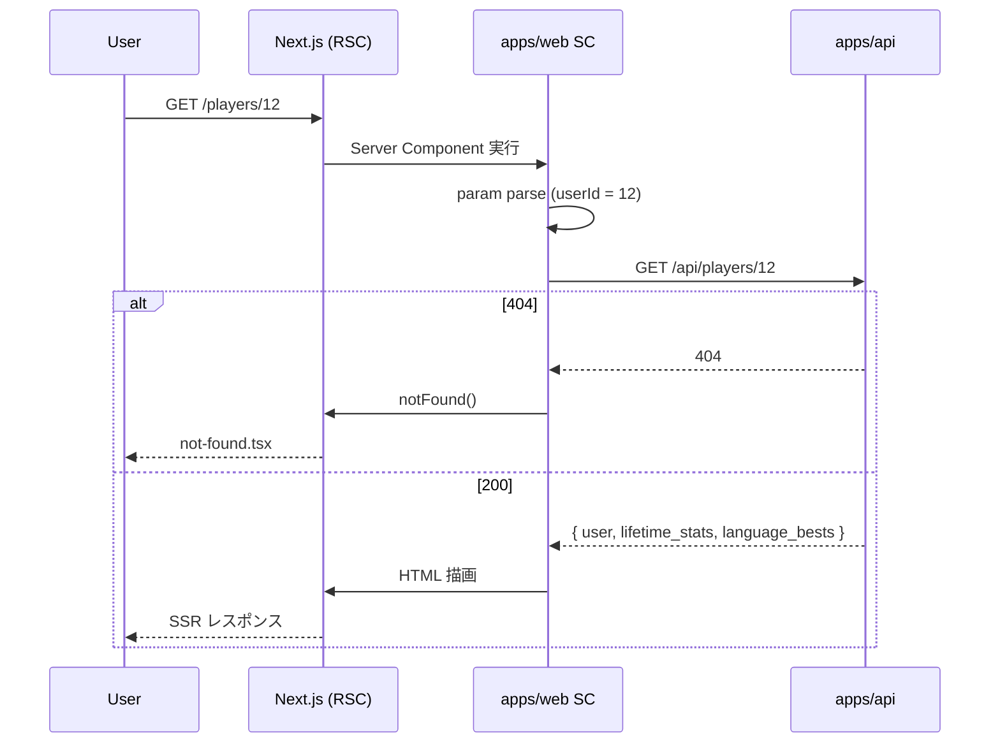

# step7: /players/[userId] 新規画面（プレイヤー詳細）

`docs/mocks/player-detail.html` モックに沿って `/players/[userId]` ページを実装する。step4 の `GET /api/players/:userId` を Server Component から叩いて SSR。

## 目次

- [対象画面・呼び出し API](#対象画面呼び出し-api)
- [参考モック](#参考モック)
- [依存](#依存)
- [画面の状態モデル](#画面の状態モデル)
- [処理フロー](#処理フロー)
  - [処理の流れ](#処理の流れ)
- [設計方針](#設計方針)
- [対応内容](#対応内容)
- [動作確認](#動作確認)
- [次の step での利用](#次の-step-での利用)

## 対象画面・呼び出し API

### 画面（Next.js Route）

| Route | 種別 | 概要 |
|---|---|---|
| `/players/[userId]` | Server Component | プレイヤー詳細（ヘッダー + 4-stat + 言語別ベスト一覧） |
| `/players/[userId]` `notFound()` | App Router の `notFound()` | 404 時に Next.js 標準の `not-found.tsx` を表示 |

### 呼び出す API

| メソッド / パス | 呼び出すタイミング | 経路 | 認証 |
|---|---|---|---|
| `GET /api/players/:userId` | ページ表示時 | Server Component → `apiClient.get()` → Express | 不要 |

## 参考モック

| 画面 | モックファイル | 反映すべき要素 |
|---|---|---|
| `/players/[userId]` | [`docs/mocks/player-detail.html`](../../mocks/player-detail.html) | ヘッダー（96px アバター + 表示名 + 参加日 + 連続日数 + グレード + 順位バッジ）/ `.stat-row` 4 stat（TS ベスト / JS ベスト / 累計文字数 / 平均正確率）/ 代表リプレイ（placeholder）/ スコア推移（placeholder）/ sidebar（獲得特典 placeholder + リンク） |

### モックから読み取った主要構造

- アバターは `.avatar.lg` で 96px、文字サイズ 28px のスタイル指定（既存 CSS にあり）
- ヘッダー右側に「⚡ 神々に挑戦（ランダム選定）」CTA ボタン（自分のページなら非表示 / 他人のページのみ）
- `.badge-grade.{slug}` でグレードバッジ、`.badge.accent` で「TS 全期間 #1」のようなランキング情報
- 4-stat の TS / JS は `stat-value.accent`（メイン）と `stat-value`（補助）で色分け
- 代表リプレイカード: `background: var(--bg-surface-2)`、padding 12px 16px、display flex
- スコア推移 SVG はモックでは固定 polyline。本 step ではプレイ履歴 API が無いため placeholder
- 獲得特典は Rewards 機能で実装

> モック「@yuki-kano」(右上の自分) は固定値だが、実装では認証済み cookie の表示名を使う

## 依存

| 依存先 | 何を使うか | 本 step での扱い |
|---|---|---|
| step4 (`GET /api/players/:userId`) | プレイヤー詳細データ | 必須前提 |
| 既存 `apiClient` | サーバー間通信 | 流用 |
| 既存 `Topbar` | ヘッダー | `active="ranking"`（ランキング動線から来るので） |
| step5 で作った（または既存） `gradeBadgeClass` | グレードバッジの slug → CSS クラス | 流用 |
| step6 で作った `GradeProgressBar` | グレード進捗バー | 本画面でも使用（任意） |

## 画面の状態モデル

Server Component のみ、Client state なし：

| state | 値 | UI |
|---|---|---|
| `player` | `GetPlayerResponse` | ヘッダー + 4-stat + 言語別ベスト |
| 404 | `notFound()` 呼び出し | Next.js が `not-found.tsx` を表示 |

## 処理フロー



### 処理の流れ

1. ユーザーが `/players/[userId]` に遷移（ランキング表 / リザルト画面 / その他から）
2. Server Component が `params.userId` を受け取り、数値変換（不正なら `notFound()`）
3. `apiClient.get('/api/players/${userId}')` を呼ぶ
4. 404 を catch して `notFound()`、その他のエラーは throw（Next.js が error boundary で処理）
5. レスポンスを使ってヘッダー / 4-stat / 言語別ベスト一覧を描画

## 設計方針

- **Server Component で fetch**: SEO 対象（プレイヤープロフィールは将来的にシェアされる可能性）。CSR 不要
- **`notFound()` を投げる理由**: 404 専用 UI を Next.js 標準の `not-found.tsx` で別途デザインできる。`/players/[userId]/not-found.tsx` で「プレイヤーが見つかりません」+「ランキングに戻る」CTA を実装
- **4-stat の構成**: モックは「TS ベスト / JS ベスト / 累計文字数 / 平均正確率」だが、`平均正確率` は本 API に含まれていない（step4 でも除外）。本 step では「平均正確率」のスロットを「累計セッション数」に置き換える。または `—` 表示。**「平均正確率」は別 PR で API 拡張**してから埋める
- **「神々に挑戦」CTA**: モックでは静的に置いてあるが、これはプロフィール → 「この人と同じ問題で挑戦」の動線。実装上は **本 step ではボタンを置かない**（typing-engine `/challenge-gods` の「相手指定」モードは未実装）。代わりに `<Link href="/play">⚡ 自分も神々に挑戦</Link>` のような汎用 CTA に差し替え
- **「代表的なリプレイ」「スコア推移」「獲得した特典」**: 本 step ではすべて placeholder（「Phase X で実装」テキスト）。リプレイ機能 / Rewards 機能の依存
- **言語別ベスト一覧の並び順**: API が `orderBy: { language: { id: "asc" } }` で返すので、TS → JS の順番が固定される。表示順を変えるなら client 側で `entries.sort(...)` する。本 step では API の順序をそのまま使う
- **「TS 全期間 #1」バッジの判定**: API が `language_bests[].rank` を返すので、`rank === 1` のときだけ `.badge.accent` で「{LangName} 全期間 #1」を表示
- **`canPublicRanking=false` の自分のページ**: step4 で 404 が返るが、自分自身が自分のページに行きたいケースは無い（マイページがある）。本 step では特別扱いなし
- **URL の userId 形式**: `params.userId` は string で来るので `z.coerce.number()` で変換、不正なら `notFound()`。
- **メタタグ / OGP**: `generateMetadata` で `title: "@{display_name} - Typing Royale"`、`description: "TS ベスト N pts · グレード {slug}"` を設定。プロフィール URL がシェアされたときの OGP に効く

## 対応内容

### `apps/web/src/app/players/[userId]/page.tsx`（新規）

```typescript
import type { Metadata } from "next"
import Link from "next/link"
import { notFound } from "next/navigation"

import type { GetPlayerResponse } from "@repo/api-schema"

import { GradeProgressBar } from "@/components/grade-progress-bar"
import { Topbar } from "@/components/topbar"
import { apiClient } from "@/libs/api-client"
import { gradeBadgeClass } from "@/libs/grade"

type Params = { userId: string }

const fetchPlayer = async (userId: string): Promise<GetPlayerResponse | null> => {
  const numeric = Number(userId)
  if (!Number.isInteger(numeric) || numeric <= 0) return null
  try {
    return await apiClient.get<GetPlayerResponse>(`/api/players/${numeric}`)
  } catch (err) {
    /** 404 → null、その他はそのまま throw（Next.js が error boundary で処理） */
    if (err instanceof Error && err.message.includes("404")) return null
    throw err
  }
}

export const generateMetadata = async ({ params }: { params: Promise<Params> }): Promise<Metadata> => {
  const { userId } = await params
  const player = await fetchPlayer(userId)
  if (player === null) {
    return { title: "プレイヤーが見つかりません - Typing Royale" }
  }
  const tsBest = player.language_bests.find((b) => b.language.slug === "typescript")
  return {
    description: `グレード: ${player.lifetime_stats.current_grade.name} · ベストスコア: ${player.lifetime_stats.best_score} pts${tsBest ? ` · TS 全期間 #${tsBest.rank}` : ""}`,
    title: `@${player.user.github_username} - Typing Royale`,
  }
}

export default async function PlayerDetailPage({ params }: { params: Promise<Params> }) {
  const { userId } = await params
  const player = await fetchPlayer(userId)
  if (player === null) notFound()

  const initials = player.user.github_username.slice(0, 2).toUpperCase()
  const grade = player.lifetime_stats.current_grade
  const tsBest = player.language_bests.find((b) => b.language.slug === "typescript")
  const jsBest = player.language_bests.find((b) => b.language.slug === "javascript")
  const joinedYmd = new Date(player.user.joined_at).toISOString().slice(0, 10)
  const reachedYmd = player.lifetime_stats.current_grade_reached_at === null
    ? null
    : new Date(player.lifetime_stats.current_grade_reached_at).toISOString().slice(0, 10)

  return (
    <>
      {/**
       * ランキング動線（/ranking 月間ランキング）に加え、/hall-of-fame からも
       * プレイヤー詳細に遷移するため Topbar の active は "ranking" を維持する。
       */}
      <Topbar active="ranking" />

      <div className="container">
        <div className="text-sm text-muted mb-8">
          <Link href="/ranking">← ランキング</Link>
        </div>

        {/* ヘッダーカード */}
        <div className="card mb-24">
          <div className="flex gap-16" style={{ alignItems: "center" }}>
            {player.user.avatar_url === null ? (
              <span className="avatar lg" style={{ fontSize: "28px", height: "96px", width: "96px" }}>
                {initials}
              </span>
            ) : (
              
            )}

            <div style={{ flex: 1 }}>
              <h1 style={{ marginBottom: "4px" }}>@{player.user.github_username}</h1>
              <div className="text-muted mb-8">
                                参加: {joinedYmd} · 連続 <strong style={{ color: "var(--success)" }}>{player.lifetime_stats.streak_days} 日</strong>
              </div>
              <div className="flex gap-8" style={{ flexWrap: "wrap" }}>
                <span className={`badge-grade ${gradeBadgeClass(grade.name)}`} data-level={grade.level}>
                  {grade.name}
                </span>
                {tsBest && tsBest.rank === 1 && <span className="badge accent">TS 全期間 #1</span>}
                {jsBest && jsBest.rank === 1 && <span className="badge warning">JS 全期間 #1</span>}
                {reachedYmd !== null && (
                  <span className="text-sm text-muted">{reachedYmd} 達成</span>
                )}
              </div>
            </div>

            <div>
              <Link className="btn btn-gold" href="/play">⚡ 自分も挑戦する</Link>
            </div>
          </div>
        </div>

        {/* 4-stat */}
        <div className="stat-row">
          <div className="stat">
            <div className="stat-value accent">{tsBest?.score?.toLocaleString() ?? "—"}</div>
            <div className="stat-label">TS ベスト</div>
          </div>
          <div className="stat">
            <div className="stat-value">{jsBest?.score?.toLocaleString() ?? "—"}</div>
            <div className="stat-label">JS ベスト</div>
          </div>
          <div className="stat">
            <div className="stat-value">{player.lifetime_stats.total_typed_chars.toLocaleString()}</div>
            <div className="stat-label">累計文字数</div>
          </div>
          <div className="stat">
            <div className="stat-value success">{player.lifetime_stats.total_sessions}</div>
            <div className="stat-label">総プレイ数</div>
          </div>
        </div>

        <div className="row">
          <div className="col">
            {/* 言語別ベスト一覧 */}
            <div className="card mb-16">
              <div className="card-header">
                <div className="card-title">📊 言語別ベスト</div>
              </div>
              {player.language_bests.length === 0 ? (
                <p className="text-sm text-muted text-center" style={{ padding: "24px 0" }}>
                                    まだプレイ履歴がありません
                </p>
              ) : (
                <div style={{ display: "grid", gap: "8px" }}>
                  {player.language_bests.map((b) => (
                    <div
                      className="card"
                      key={b.language.id}
                      style={{
                        alignItems: "center",
                        background: "var(--bg-surface-2)",
                        display: "flex",
                        justifyContent: "space-between",
                        padding: "12px 16px",
                      }}
                    >
                      <div>
                        <div className="text-mono">
                          {b.language.name} · 全期間 #{b.rank}
                        </div>
                        <div className="text-sm text-muted">
                          {b.score} pts · {b.typed_chars} 文字 · {(b.accuracy * 100).toFixed(1)}%
                        </div>
                      </div>
                      <span className="badge accent">ベスト</span>
                    </div>
                  ))}
                </div>
              )}
            </div>

            {/* スコア推移 placeholder */}
            <div className="card">
              <div className="card-header">
                <div className="card-title">📈 スコア推移</div>
              </div>
              <p className="text-sm text-muted text-center" style={{ padding: "24px 0" }}>
                                スコア推移グラフはプレイ履歴 API（別 step）で実装します
              </p>
            </div>
          </div>

          <aside className="col-sidebar">
            <div className="card mb-16">
              <div className="card-header">
                <div className="card-title">🏆 獲得した特典</div>
              </div>
              <p className="text-sm text-muted">
                                特典は Rewards 機能で実装します。
              </p>
            </div>

            <div className="card">
              <div className="card-header">
                <div className="card-title">🌐 リンク</div>
              </div>
              <div className="text-sm" style={{ display: "grid", gap: "8px" }}>
                <span className="text-muted">外部リンクは別 step で対応</span>
              </div>
            </div>
          </aside>
        </div>
      </div>

      <div className="footer">
        <Link href="/ranking">← ランキングに戻る</Link>
      </div>
    </>
  )
}
```

### `apps/web/src/app/players/[userId]/not-found.tsx`（新規）

```typescript
import Link from "next/link"

import { Topbar } from "@/components/topbar"

export default function NotFound() {
  return (
    <>
      <Topbar />
      <div className="container container-narrow text-center mt-24">
        <h1>プレイヤーが見つかりません</h1>
        <p className="text-muted mt-8">
                    URL が間違っているか、このプレイヤーはランキングを非公開にしています。
        </p>
        <div className="flex gap-12 mt-24" style={{ justifyContent: "center" }}>
          <Link className="btn btn-primary" href="/ranking">ランキングに戻る</Link>
          <Link className="btn" href="/">トップへ</Link>
        </div>
      </div>
    </>
  )
}
```

### `apps/web/src/libs/api-client.ts`（編集 - 404 エラーメッセージの明示化）

`apiClient.get` 内で 404 のときは `Error("API error: 404 ...")` のような形で throw する設計に揃える（既に上記実装の通り）。`fetchPlayer` 側で `.includes("404")` で判定できるようにする：

```typescript
async get<T>(path: string, query?: ..., opts?: ...): Promise<T> {
  // ...
  if (!res.ok) {
    throw new Error(`API error: ${res.status} ${res.statusText}`)
  }
  return res.json() as Promise<T>
}
```

### `apps/web/src/components/topbar.tsx`（編集 - 既存）

step5 で `active="ranking"` 等のパターンは追加済み。本 step では特に変更不要（プレイヤー詳細でも `active="ranking"` 流用）。

### `apps/web/src/components/ranking-table.tsx`（編集 - 既存）

step5 で実装済み `<Link href={\`/players/${e.user.id}\`}>` の動線が本 step のページに繋がる。動作確認のとき相互遷移を見る。

## 動作確認

| 区分 | 内容 |
|---|---|
| 存在する公開プレイヤー | seed 後 `http://localhost:3000/players/1` → ヘッダー / 4-stat / 言語別ベストが表示 |
| 存在しない userId | `/players/9999` → `/players/9999/not-found.tsx` の UI |
| 不正な userId | `/players/abc` → 同 `not-found.tsx`（`fetchPlayer` が早期 return） |
| `canPublicRanking=false` の userId | `/players/{非公開userId}` → not-found（API が 404） |
| OGP メタタグ | DevTools で `<title>@sakurai_dev - Typing Royale</title>` 確認、`<meta name="description">` にグレード + ベスト情報 |
| ランキング表 → プレイヤー詳細遷移 | `/ranking` でプレイヤー名 / アバターをクリックして本ページに遷移 |
| 言語別ベスト 0 件 | プレイ前ユーザー → 「まだプレイ履歴がありません」プレースホルダ |
| TOP 1 表示 | TS で #1 のユーザーは「TS 全期間 #1」バッジが表示、他は非表示 |
| Playwright MCP | `/players/1` のスクショ + `/players/9999` の not-found スクショ、コンソール error 0 件 |
| Lint / Build | `pnpm lint && pnpm build` |

### Playwright MCP 確認手順

1. seed 後の有効な userId で `/players/${id}` に遷移
2. `mcp__playwright__browser_snapshot` でヘッダー要素確認
3. ランキングページから「@sakurai_dev」リンクをクリックして遷移確認
4. 存在しない userId （`/players/99999`）に直接アクセスして not-found ページ確認
5. before/after を `docs/screenshots/score-ranking/player-detail-{before,after}.png` に保存

## 次の step での利用

- **Rewards 機能（将来）**: 「獲得した特典」placeholder を `<AchievementGrid achievements={...} />` に差し替え
- **プレイ履歴 API（別 step）**: 「スコア推移」placeholder を `<ScoreTimelineChart sessions={...} />` に差し替え、「代表的なリプレイ」カードを実データに置き換え
- **typing-engine 拡張**: 「⚡ 自分も挑戦する」ボタンを `「{user.display_name} と同じ問題で挑戦」` の専用 CTA に置き換える（神々モードを「ランダム選定」から「特定ユーザー指定」モードに拡張する別 PR）
- **typing-engine `/challenge-gods` への影響**: 本 step は表示専用、typing-engine への変更なし
