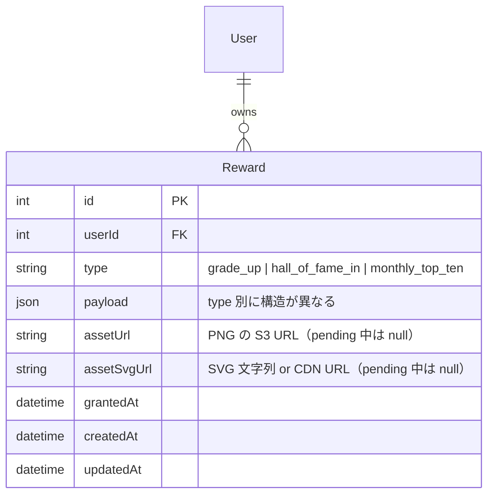
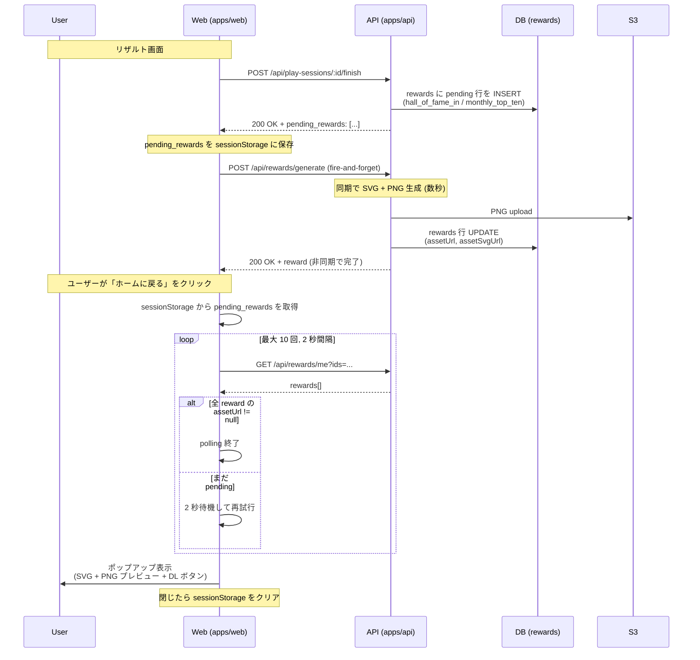
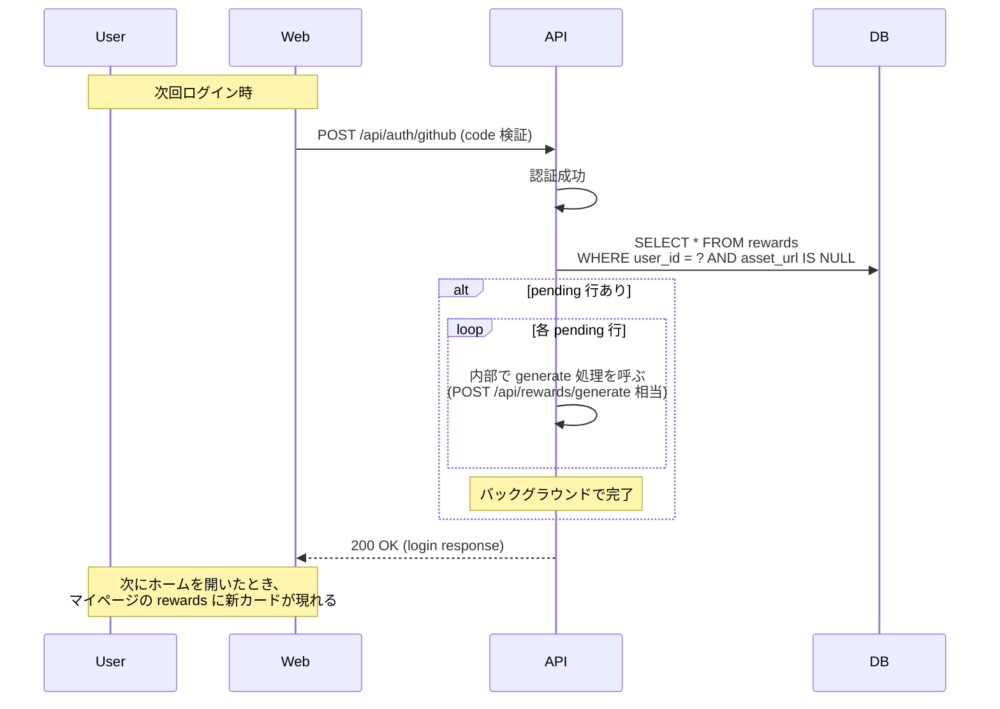

# 特別バッジ・達成カード（殿堂入り / 月間 TOP 10）

Hall of Fame 入賞時と月間 TOP 10 入賞時に、ユーザー専用の特別 SVG バッジと PNG 達成カードを発行する機能。既存 [rewards](../rewards/README.md) 機能（グレードアップ達成カード + 動的 SVG バッジ）の拡張として実装する。

エンジニアが「自慢したくなる」要素を一段強める位置付け。SVG は GitHub README に貼って常時更新、PNG は SNS シェアと所有資産として永続保存。

このドキュメントは **仕様（What）** と **設計（How）** を分けて記述する：

- **仕様**：入賞時に何が生成され、ユーザーがどこで何を受け取れるか
- **設計**：/finish との分離、冪等生成、自己修復、ストレージ戦略

## 関連 spec

- [`../rewards/README.md`](../rewards/README.md) — 既存の特典機能（グレードアップ達成カード + バッジ）。本機能はこの拡張
- [`../score-ranking/README.md`](../score-ranking/README.md) — Hall of Fame と全期間ランキングの定義元
- [`../monthly-ranking/README.md`](../monthly-ranking/README.md) — 月間ランキング v2 の定義元
- [`../result-top-ten-popup/README.md`](../result-top-ten-popup/README.md) — リザルト画面の入賞演出（本機能は演出と独立）

## 目次

- [仕様](#仕様)
  - [対象となる入賞種別](#対象となる入賞種別)
  - [生成トリガー](#生成トリガー)
  - [提供する 2 形式](#提供する-2-形式)
  - [配色ルール](#配色ルール)
  - [ユーザーが受け取る場所](#ユーザーが受け取る場所)
- [設計](#設計)
  - [/finish と生成の分離](#finish-と生成の分離)
  - [冪等性](#冪等性)
  - [自己修復](#自己修復)
  - [ストレージ戦略](#ストレージ戦略)
  - [SVG バッジの生成](#svg-バッジの生成)
  - [PNG 達成カードの生成](#png-達成カードの生成)
- [必要な画面](#必要な画面)
- [必要な API](#必要な-api)
- [必要な DB 設計](#必要な-db-設計)
- [フロー図](#フロー図)

---

## 仕様

### 対象となる入賞種別

| 種別 | 条件 | 対応言語 |
| --- | --- | --- |
| **Hall of Fame 入賞**（`hall_of_fame_in`） | 全期間トップ 10 に入る | TypeScript / JavaScript |
| **月間 TOP 10 入賞**（`monthly_top_ten`） | 当月のトップ 10 に入る | TypeScript / JavaScript |

両方とも `publicRanking=true` のユーザーのみ対象（[`../score-ranking/README.md` 「プライバシー」](../score-ranking/README.md#プライバシーpublicranking)に従う）。

### 生成トリガー

| 種別 | 生成タイミング |
| --- | --- |
| Hall of Fame | **初入賞時** + **順位更新時**（11 位 → 5 位、5 位 → 1 位 など）に毎回生成 |
| 月間 TOP 10 | **順位更新時に毎回生成**（圏外から TOP 10 入り、TOP 10 内で順位変動の両方） |

両方とも `(userId, type, language, year_month?)` でユニーク。順位が変わった場合は **同じ行を update して新しい assetUrl / assetSvgUrl で上書き**（履歴は保持しない、現在の最高順位のみ）。

### 提供する 2 形式

| 形式 | 用途 | サイズ | フォーマット |
| --- | --- | --- | --- |
| **SVG バッジ** | GitHub README に貼る、ブログサイドバー | 360×80 | SVG |
| **PNG 達成カード** | X / Slack / Facebook 等の SNS シェア、所有資産 | 1200×630（OG カード規格） | PNG |

両方とも 1 入賞につき 1 セット（SVG + PNG）。

### 配色ルール

すべての PNG カードと SVG バッジに**光沢演出**（gloss）を適用する：

- 斜め白グラデーション sheen（左上から右下に向かう光沢ライン）
- 上端ハイライト（金属感を出す）
- 中央上部のラジアルグロー
- アクセント色のドロップシャドウ（数字・絵文字を発光させる）
- rank 1 のカードのみ、上半分に sparkle ドット（小さな白丸 4〜6 個）

加えて **SVG バッジは SMIL アニメーション** を持つ（GitHub README / Camo CDN 上で動作する）：

- **shimmer sweep**: 白い斜めグラデーションが左から右に約 3〜4 秒周期で横断
- **pulsing border**: アクセント色の縁が `stroke-opacity 0.65 → 1 → 0.65` で約 2.4〜3 秒周期で脈打つ
- **左サイドバーのパルス**: 縁と同期して `opacity 0.85 → 1 → 0.85` で発光
- HoF #1（金）が最も明るく / 速く動き、ランク降下に従い徐々に控えめになる（#7 黒は最も静か）

PNG カードは静的（rasterize されるため SMIL は使えない）、光沢のみで質感を作る。

**Hall of Fame**: 順位による色分け（金 / 銀 / 銅 / 黒）

| 順位 | メインカラー | アクセント |
| --- | --- | --- |
| 1 位 | 金（#ffd54a → #8a5a0a） | 👑 emoji + 金縁 |
| 2 位 | 銀（#e5e7eb → #6b7280） | 🥈 emoji + 銀縁 |
| 3 位 | 銅（#d97706 → #78350f） | 🥉 emoji + 銅縁 |
| 4 〜 10 位 | 黒メイン（#1f2937 → #030712） | 💎 emoji + 銀寄りアクセント |

**月間 TOP 10**: 全順位で青メイン固定

| 順位 | メインカラー | アクセント |
| --- | --- | --- |
| 1 〜 10 位 | 青（#7dd3fc → #0c4a6e） | 🏆 emoji + 月情報（`2026.06` など）を見出し表示 |

### ユーザーが受け取る場所

| 場所 | 表示・操作 |
| --- | --- |
| **ホーム画面ポップアップ** | リザルト → ホーム遷移直後に生成完了をキャッチし、SVG + PNG プレビュー + 個別 DL ボタン |
| **マイページ `/mypage/rewards`** | 全 reward を「グレードアップ」「殿堂入り」「月間」の 3 タブで一覧表示、各カードに SVG / PNG の個別 DL |
| **README 用 SVG バッジ URL** | `GET /badge/:username/hall-of-fame.svg?language=...` / `GET /badge/:username/monthly.svg?language=...` をユーザーが手動で README に貼る（CDN 経由でリアルタイム反映、圏外落ち時は表示が消える）|

リザルト画面では何もしない（既存の `TopTenAnnouncementModal` 演出はそのまま、画像生成・表示はここでは行わない）。

---

## 設計

### /finish と生成の分離

`/finish` の応答性を最優先するため、画像生成は別 API に切り出す。

1. `/finish` ではランクイン判定を行うが画像生成はしない
2. `/finish` 内で `rewards` テーブルに **pending 行**（`assetUrl = null`, `assetSvgUrl = null`）を先に作成する（後述の自己修復の起点になる）
3. `/finish` レスポンスに `pending_rewards: [{ type, language, rank, year_month? }, ...]` を含める
4. クライアントは `/finish` レスポンス受信後、`POST /api/rewards/generate` を **fire-and-forget**（await しない）で叩く
5. クライアントは `pending_rewards` を `sessionStorage` に保存しておく（ホーム遷移後の popup 起動用）

これにより `/finish` の応答時間は画像生成（数百 ms 〜 数秒）の影響を受けない。

### 冪等性

`POST /api/rewards/generate` は **冪等**。

- 同じキー `{userId, type, language, year_month?}` で再リクエストされても重複生成しない
- 既に `assetUrl` / `assetSvgUrl` が埋まっていればそのまま返す
- 順位が変わっている（`payload.rank` が古い）場合は再生成して上書き

これにより、fire-and-forget の二重発火・ネットワーク再試行・ページリロードに対して安全。

### 自己修復

クライアント起点でリクエストが届かなかった場合（タブを閉じた、ネットワーク断、JS エラー等）の保険として、サーバー側に **自己修復** を組み込む。

- `/finish` 完了時：直前の自分の `rewards` テーブルに `assetUrl = null` の pending 行があれば、即時で `POST /api/rewards/generate` 相当の生成処理をバックグラウンドで呼ぶ
- 次回ログイン時（`POST /api/auth/github` 成功直後）にも同様の検査を行う
- `rewards.createdAt` から 24h 以上経過しても `assetUrl = null` のままなら定期バッチで自動生成（運用負荷低減のため初期は cron 不要、ログイン経路で十分とする）

これにより、最悪のケースでも次回ログイン時には全 pending が解消される。

### ストレージ戦略

| 形式 | 保存先 | TTL / ライフサイクル |
| --- | --- | --- |
| **SVG バッジ** | DB に SVG 文字列を直接保存 + CDN キャッシュ | CDN TTL 5〜15 分（圏外落ち時は次回 README 描画で消える） |
| **PNG 達成カード** | S3 等のオブジェクトストレージ | 永続保存（順位変動時は上書き、ユーザー削除時のみ削除） |

SVG はサイズが小さく（数 KB）DB 直保存で十分。PNG は S3 一択。

### SVG バッジの生成

既存 [`apps/api/src/lib/badge-svg.ts`](../../apps/api/src/lib/badge-svg.ts) と同じ **string template** パターンを踏襲（satori / fontfetch 不要、高速）。

- `apps/api/src/lib/badge-svg-hof.ts` — HoF バッジ（rank で配色分岐）
- `apps/api/src/lib/badge-svg-monthly.ts` — 月間バッジ（青固定）

両方とも純粋関数（DB 入出力なし）で、入力は `{ username, language, rank, year_month? }`、出力は SVG 文字列。テストは vitest のスナップショットでカバー。

### PNG 達成カードの生成

既存 [`apps/api/src/lib/card-renderer.ts`](../../apps/api/src/lib/card-renderer.ts) と同じ **satori + resvg-js** パターンを踏襲。

- `renderHallOfFameCard(input)` — rank で配色（金 / 銀 / 銅 / 黒）分岐
- `renderMonthlyTopTenCard(input)` — 青固定、月情報を表示

サイズ・フォント・テンプレートのレイアウト構造は既存 `renderGradeUpCard` と統一（OG カード規格 1200×630、Noto Sans JP）。

---

## 必要な画面

| 画面 | 概要 |
| --- | --- |
| ホーム画面ポップアップ | `sessionStorage` の `pending_rewards` を取り出し、`GET /api/rewards/me?ids=...` を 2 秒間隔 × 最大 10 回 polling。生成完了したら SVG + PNG プレビュー + 個別 DL ボタンの popup を表示。閉じたら `sessionStorage` をクリア |
| `/mypage/rewards`（既存タブ拡張） | 「グレードアップ」「殿堂入り」「月間」の 3 タブで一覧表示。各カードに SVG / PNG の個別 DL ボタン + README 貼付け用の URL コピーボタン |

リザルト画面は本機能では変更しない（既存 `TopTenAnnouncementModal` の演出はそのまま）。

## 必要な API

| メソッド | パス | 説明 |
| --- | --- | --- |
| POST | `/api/rewards/generate` | 冪等な生成エンドポイント。リクエストボディに `type` / `language` / `rank` / `year_month?`。レスポンスは生成済 reward 1 件（`assetUrl`, `assetSvgUrl` 含む） |
| GET | `/api/rewards/me` | 自分の reward 一覧（既存）。レスポンスに `assetSvgUrl` フィールド追加 |
| GET | `/api/rewards/me?ids=1,2,3` | ホームポップアップの polling 用。指定 id の reward のみ返す |
| GET | `/badge/:username/hall-of-fame.svg?language=ts` | README 用 SVG バッジ（HoF 版）。CDN キャッシュ 5〜15 分 TTL |
| GET | `/badge/:username/monthly.svg?language=ts` | README 用 SVG バッジ（月間版）。CDN キャッシュ 5〜15 分 TTL |

## 必要な DB 設計



### `rewards` テーブル拡張

| カラム | 変更 | 備考 |
| --- | --- | --- |
| `type` | enum 値追加 | 既存 `grade_up` に加え `hall_of_fame_in` / `monthly_top_ten` |
| `payload` (json) | type 別の構造 | <ul><li>`grade_up`: `{ grade_slug }`（既存）</li><li>`hall_of_fame_in`: `{ language, rank }`</li><li>`monthly_top_ten`: `{ language, year_month, rank }`</li></ul> |
| `assetSvgUrl` | **新規 nullable** | SVG バッジの URL or 直接文字列。pending 中は null |
| `assetUrl` | 既存（nullable に変更） | PNG の S3 URL。pending 中は null |

### ユニーク制約（部分インデックス）

```sql
-- HoF: 言語ごとに 1 行（順位変動時は update）
CREATE UNIQUE INDEX rewards_hof_unique
  ON rewards(user_id, type, (payload->>'language'))
  WHERE type = 'hall_of_fame_in';

-- 月間: 言語 × 月ごとに 1 行
CREATE UNIQUE INDEX rewards_monthly_unique
  ON rewards(user_id, type, (payload->>'language'), (payload->>'year_month'))
  WHERE type = 'monthly_top_ten';
```

`grade_up` には従来通り制約を付けない（同じグレードを 2 回踏むケースは無いが、enum 別の段階制約で十分）。

## フロー図

### 入賞 → 生成 → ホームポップアップの全体フロー



### 自己修復フロー（クライアント起点が失敗した場合）


