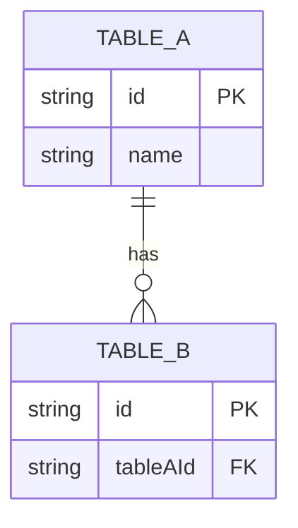
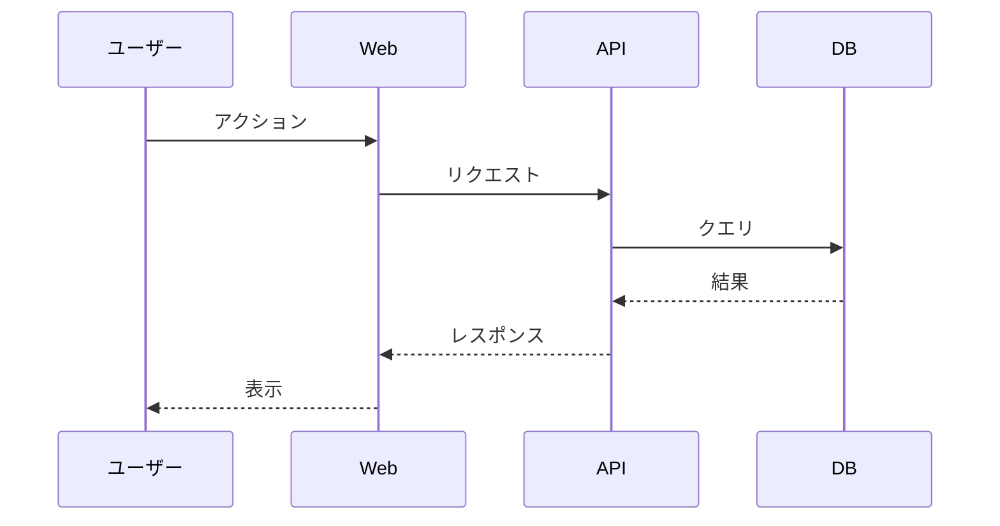

# {機能名}（テンプレート）

このファイルは `docs/spec/{feature}/README.md` のテンプレート。`design-feature` skill が新機能設計時にこの構造に従う。`{feature}` はディレクトリ名で kebab-case（例：`typing-engine`, `github-auth`）。

冒頭の段落で機能の目的を 1〜2 段落で記述する。「何のための機能で、誰が何のために使うか」を簡潔に伝える。

このドキュメントは **仕様（What）** と **設計（How）** を分けて記述する：

- **仕様**：ユーザーから見える挙動・ルール・データの意味
- **設計**：実装にあたっての技術的な選択と制約

## 関連 spec

- [`../{他機能}/README.md`](../{他機能}/README.md) — （関係の一言説明。例：「神々モード時のゴーストデータ取得元」）
- [`../{他機能}/README.md`](../{他機能}/README.md) — （関係の一言説明）

## 目次

- [仕様](#仕様)
  - [サブセクション 1](#サブセクション-1)
  - [サブセクション 2](#サブセクション-2)
- [設計](#設計)
  - [サブセクション 1](#サブセクション-1-1)
  - [サブセクション 2](#サブセクション-2-1)
- [必要な画面](#必要な画面)
- [必要な API](#必要な-api)
- [必要な DB 設計](#必要な-db-設計)
- [フロー図](#フロー図)

---

## 仕様

### サブセクション 1

ユーザー視点での挙動・ルール・データの意味を記述する。

判断基準：
- PdM・デザイナーが知るべき内容 → ここに書く
- エンジニアだけが気にする内容 → `## 設計` に書く

書く内容の例：
- 「120 秒固定のセッション」
- 「リザルト画面に順位と集計時刻を表示」
- 「`publicRanking=false` のユーザーはランキング集計対象から完全除外」

### サブセクション 2

...

---

## 設計

### サブセクション 1

技術的な実装方針・選択を記述する。

書く内容の例：
- 「Redis 揮発ステートに TTL 5 分で保持」
- 「サーバー権威タイマー」
- 「INP p95 < 50ms を CI で監視」
- 「`forEachLeadingCommentRange` でコメント範囲を列挙して除去」

### サブセクション 2（MVP 対象外がある場合）

MVP では実装しないが将来検討する項目は、本体 README に長々と書かず `deferred-{topic}.md` に切り出す。本体には **「MVP 対象外（将来検討）」サブセクション** を置いてリンクするだけにする。

例：

```markdown
### MVP 対象外（将来検討）

以下は MVP では実装しない。{トリガー条件}が発生した場合に着手する。

- 項目 1
- 項目 2

詳細：[`./deferred-{topic}.md`](./deferred-{topic}.md)
```

---

## 必要な画面

| 画面 | 概要 |
| --- | --- |
| 画面 1 | 役割の簡潔な説明 |
| 画面 2 | 役割の簡潔な説明 |

具体的な UI 仕様は `design-mock` skill で確定後に追記される。

## 必要な API

| メソッド | パス | 説明 |
| --- | --- | --- |
| GET | `/api/...` | 説明 |
| POST | `/api/...` | 説明 |

REST 以外（SSE / WebSocket / Server Action 等）も同じ形式で列挙する。

## 必要な DB 設計

| テーブル | 主要カラム | 説明 |
| --- | --- | --- |
| `table_name` | `id`, `columnA`, `columnB(jsonb)`, `createdAt` | 説明 |



## フロー図


